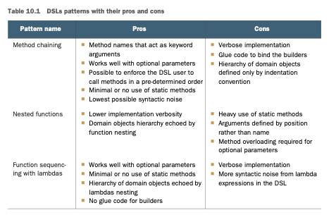

# Capitulo 10

# ***Lenguajes de dominio específico usando lambdas***

### Este capítulo cubre
- Qué son los lenguajes de dominio específico (DSLs) y sus formas
- Los pros y contras de agregar un DSL a tu API
- Las alternativas disponibles en la JVM para un DSL basado en Java plano
- Aprendiendo de los DSLs presentes eninterfaces y clases Java modernos
- Patrones y técnicas para implementar DSLs efectivos basados en Java
- Cómo bibliotecas y herramientas comúnes de Java usanestos patrones

Los desarrolladores a menudo olvidan que un lenguaje de programación es ante todo un lenguaje. El 
propósito principal de cualquier lenguaje es transmitir un mensaje de la manera más clara y 
comprensible. Quizás la característica más importante del software bien escrito es la comunicación 
clara de sus intenciones —o, como declaró el famoso científico de computadoras Harold Abelson, "Los 
programas deben ser escritos para que las personas los lean y solo de manera incidental para que las
máquinas los ejecuten." La legibilidad y comprensibilidad son aún más importantes en las partes del 
software que están destinadas a modelar el negocio central de tu aplicación. Escribir código que pueda
ser compartido y entendido tanto por el equipo de desarrollo como por los expertos de dominio es 
beneficial para la productividad. Los expertos de dominio pueden ser involucrados en el proceso de 
desarrollo de software y verificar la corrección del software desde un punto de vista de negocio. Como
resultado, los errores y malentendidos puedendetectarse tempranamente.
Para lograr este resultado, es común expresar la lógica de negocio de la aplicación a través de un 
lenguaje de dominio específico (DSL). Un DSL es un pequeño lenguaje de programación, usualmente no 
de propósito general, explícitamente adaptado para un dominio específico. El DSL usa la terminología
característica de ese dominio. Puedes estar familiarizado con Maven y Ant, por ejemplo. Puedes verlo
como DSLs para expresar procesos de construcción. También estás familiarizado con HTML, que es un 
lenguaje adaptado para definir la estructura de una página web. Históricamente, debido a su rigidez 
y verbosidad excesiva, Java nunca ha sido popular para implementar un DSL compacto que también sea 
adecuado para ser leído por personas no técnicas. Ahora que Java soporta expresiones lambda, ¡tienes
nuevas herramientas en tu caja de herramientas! De hecho, aprendiste en el capítulo 3 que las 
expresiones lambda ayudan a reducir la verbosidad del código y mejorar la relación señal/ruido de tus
programas.
Piensa en una base de datos implementada en Java. En lo profundo de la base de datos, probablemente 
hay mucho código elaborado determinando dónde en el disco almacenar un registro dado, construyendo 
índices para tablas y tratando con transacciones concurrentes. Esta base de datos probablemente es 
programada por programadores relativamente expertos. Supón que ahora quieres programar una consulta 
similar a las que exploramos en los capítulos 4 y 5: "Encontrar todas las entradas de menú en un menú
dado que tienen menos de 400 calorías."
Históricamente, tales programadores expertos podrían haber escrito rápidamente código de bajo nivel 
en este estilo y pensar que la tarea era fácil:
```java
while (block != null) {
    read(block, buffer)
    for (every record in buffer) {
        if (record.calorie < 400) {
            System.out.println(record.name);
        }
    }
    block = buffer.next();
}
```
Esta solución tiene dos problemas principales: es difícil para un programador menos experimentado 
crearla (puede requerir detalles sutiles de bloqueo, E/S o asignación de disco), y más importante, 
trata con conceptos de nivel de sistema, no de nivel de aplicación. Un programador que se incorpora
nuevo y trabaja con usuarios podría decir: "¿Por qué no me proporcionas una interfaz SQL para poder 
escribir SELECT name FROM menu WHERE calorie < 400, donde menu contiene el menú del restaurante 
expresado como una tabla SQL? Ahora puedo programar mucho más efectivamente que toda esta tontería 
de nivel de sistema!" ¡Es difícil argumentar contra esta declaración! En esencia, el programador ha 
solicitado un DSL para interactuar con la base de datos en lugar de escribir código Java puro. 
Técnicamente, este tipo de DSL se denomina externo porque espera que la base de datos tenga una API 
que pueda analizar y evaluar expresiones SQL escritas en texto. Aprendes más sobre la distinción 
entre DSL externos e internos más adelante en este capítulo. Pero si recuerdas los capítulos 4 y 5, 
notarás que este código también podría escribirse de manera más concisa en Java usando la API de 
Streams, como el siguiente:
```java
menu.stream()
    .filter(d -> d.getCalories() < 400)
    .map(Dish::getName)
    .forEach(System.out::println);
```
Este uso del encadenamiento de métodos, tan característico de la API de Streams, a menudo se denomina
estilo fluidos en el sentido de que es fácil de comprender rápidamente, en contraste con el flujo de
control complejo en los bucles de Java.
Este estilo captura efectivamente un DSL. En este caso, este DSL no es externo, sino interno. En un 
DSL interno, las primitivas de nivel de aplicación se exponen como métodos Java para usar en uno o 
más tipos de clase que representan la base de datos, en contraste con la sintaxis no Java para 
primitivas en un DSL externo, como SELECT FROM en la discusión de SQL anterior.
En esencia, diseñar un DSL consiste en decidir qué operaciones necesita manipular el programador de 
nivel de aplicación (evitando cuidadosamente cualquier contaminación innecesaria causada por 
conceptos de nivel de sistema) y proporcionar estas operaciones al programador. Para un DSL interno,
este proceso significa exponer clases y métodos apropiados para que el código pueda escribirse de 
manera fluida. Un DSL externo requiere más esfuerzo; no solo debes diseñar la sintaxis del DSL, sino
también implementar un parser y un evaluador para el DSL. Sin embargo, si obtienes el diseño 
correcto, quizás programadores menos capacitados puedan escribir código de manera rápida y efectiva 
(haciendo así el dinero que mantiene a tu empresa en negocio) sin tener que programar directamente 
dentro de tu hermoso código de nivel de sistema (¡pero difícil de entender para no expertos)!
En este capítulo, aprendes qué es un DSL a través de varios ejemplos y casos de uso; aprendes cuándo
deberías considerar implementar uno y cuáles son los beneficios. Luego exploras algunos de los 
pequeños DSLs que se introdujeron en la API de Java 8. También aprendes cómo podrías emplear los 
mismos patrones para crear tus propios DSLs. Finalmente, investigas cómo algunas bibliotecas y marcos
de trabajo ampliamente usados en Java han adoptado estas técnicas para ofrecer sus funcionalidades a
través de un conjunto de DSLs, haciendo sus APIs más accesibles y fáciles de usar.

## 10.1 Un lenguaje específico para tu dominio
Un DSL es un lenguaje personalizado diseñado para resolver un problema para un dominio de negocio 
específico. Por ejemplo, podrías estar desarrollando una aplicación de software para contabilidad. 
Tu dominio de negocio incluye conceptos como estados de cuenta y operaciones como conciliación. 
Podrías crear un DSL personalizado para expresar problemas en ese dominio. En Java, necesitas idear
un conjunto de clases y métodos para representar ese dominio. De cierta manera, puedes ver el DSL 
como una API creada para interactuar con un dominio de negocio específico.
Un DSL no es un lenguaje de programación de propósito general; restringe las operaciones y vocabulario
disponibles a un dominio específico, lo cual significa que tienes menos de qué preocuparte y puedes 
invertir más atención en resolver el problema de negocio en cuestión. Tu DSL debería permitir que sus
usuarios traten solo con las complejidades de ese dominio. Otros detalles de implementación de nivel
inferior deberían ocultarse, tal como hacer privados los métodos de implementación de nivel inferior
de una clase. Esto resulta en un DSL fácil de usar.
¿Qué no es un DSL? Un DSL no es inglés plano.Tampoco es un lenguaje que permita a los expertos del 
dominio implementar lógica de negocio de bajo nivel. Dos razones deberían impulsarte hacia el 
desarrollo de un DSL:

- La comunicación es lo primero. Tu código debería comunicar claramente sus intenciones y ser 
comprensible incluso para un no programador. De esta manera, esta persona puede contribuir a validar
si el código coincide con los requisitos de negocio.
- El código se escribe una vez pero se lee muchas veces. La legibilidad es vital para la 
mantenibilidad. En otras palabras, siempre deberías programar de una manera por la que tus colegaste
agradezcan en lugar de odiarte.
Un DSL bien diseñado ofrece muchos beneficios. Sin embargo, desarrollar y usar un DSL personalizado 
tiene ventajas y desventajas. En la sección 10.1.1, exploramos las ventajas y desventajas con más 
detalle para que puedas decidir cuándo un DSL es apropiado (o no) para un escenario particular.

### 10.1.1 Ventajas y desventajas de los DSLs
Los DSLs, como otras tecnologías y soluciones en el desarrollo de software, no son balas de plata. 
Usar un DSL para trabajar con tu dominio puede ser tanto un activo como un pasivo. Un DSL puede ser 
un activo porque eleva el nivel de abstracción con el que puedes aclarar la intención de negocio del
código y hace que el código sea más legible. Pero también puede ser un pasivo porque la 
implementación del DSL es código en sí mismo que necesita ser probado y mantenido. Por esta razón, 
es útil investigar los beneficios y costos de los DSLs para que puedas evaluar si agregar uno a tu 
proyecto resultará en un retorno positivo de la inversión.

Los DSLs ofrecen los siguientes beneficios:
- Concisión: una API que convenientemente encapsula la lógica de negocio te permite evitar la 
repetición, resultando en código menos verboso.
- Legibilidad: usar palabras que pertenecen al vocabulario del dominio hace que el código sea 
comprensible incluso para no expertos del dominio. En consecuencia, el código y el conocimiento del 
dominio pueden compartirse entre un rango más amplio de miembros de la organización.
- Mantenibilidad: el código escrito contra un DSL bien diseñado es más fácil de mantener y modificar.
El mantenibilidad es especialmente importante para el código relacionado con negocio, que es la parte
de la aplicación que puede cambiar más frecuentemente.
- Mayor nivel de abstracción: las operaciones disponibles en un DSL trabajan al mismo nivel de 
abstracción que el dominio, ocultando así los detalles que no están estrictamente relacionados con 
los problemas del dominio.
- Enfoque: tener un lenguaje diseñado con el único propósito de expresar las reglas del dominio de 
negocio ayuda a los programadores a mantenerse enfocados en esa parte específica del código. El 
resultado es una productividad aumentada.
- Separación de intereses: expresar la lógica de negocio en un lenguaje dedicado facilita mantener 
el código relacionado con el negocio aislado de la parte infrastruktur al de la aplicación. El 
resultado es código más fácil de mantener.

Por el contrario, introducir un DSL en tu base de código puede tener algunas desventajas:
- Dificultad del diseño del DSL: es difícil capturar el conocimiento del dominio en un lenguaje 
limitado y conciso.
- Costo de desarrollo: agregar un DSL a tu base de código es una inversión a largo plazo con un alto
costo inicial, lo cual podría retrasar tu proyecto en sus etapas tempranas. Además, el mantenimiento
del DSL y su evolución agregan más carga de ingeniería.
- Capa adicional de indirección: un DSL envuelve tu modelo de dominio en una capa adicional que debe
ser lo más delgada posible para evitar incurrir en problemas de rendimiento.
- Otro lenguaje que aprender: hoy en día, los desarrolladores están acostumbrados a emplear múltiples
idiomas. Sin embargo, agregar un DSL a tu proyecto implícitamente implica que tú y tu equipo tienen 
un idioma más que aprender. Peor aún, si decides tener múltiples DSLs cubriendo diferentes áreas de 
tu dominio de negocio, combinarlos de manera perfecta podría ser difícil porque los DSLs tienden a 
evolucionar independientemente.
- Limitaciones del lenguaje anfitrión: algunos lenguajes de programación de propósito general 
(Java es uno de ellos) son conocidos por ser verbosos y tener una sintaxis rígida. Estos lenguajes 
dificultan diseñar un DSL fácil de usar. De hecho, los DSLs desarrollados sobre un lenguaje de 
programación verboso están limitados por la sintaxis incómoda y pueden no ser agradables de leer. 
La introducción de expresiones lambda en Java 8 ofrece una nueva herramienta poderosa para mitigar 
este problema.

Dadas estas listas de argumentos positivos y negativos, decidir si desarrollar un DSL para tu 
proyecto no es fácil. Además, tienes alternativas a Java para implementar tu propio DSL. Antes de 
investigar qué patrones y estrategias podrías emplear para desarrollar un DSL legible y fácil de usar
en Java 8 y posteriores, exploramos rápidamente estas alternativas y describimos las circunstancias
bajo las cuales podrían ser soluciones apropiadas.

### 10.1.2 Diferentes soluciones de DSL disponibles en la JVM
En esta sección, aprendes las categorías de los DSLs. También aprendes que tienes muchas alternativas
además de Java para implementar DSLs. En secciones posteriores, nos enfocamos en cómo implementar 
DSLs usando características de Java.
La forma más común de categorizar los DSLs, introducida por Martin Fowler, es distinguir entre DSLs
internos y externos. Los DSLs internos (también conocidos como DSLs embebidos) se implementan sobre 
el lenguaje anfitrión existente (que podría ser código Java simple), mientras que los DSLs externos 
se denominan independientes porque se desarrollan desde cero con una sintaxis independiente del 
lenguaje anfitrión.
Además, la JVM te da una tercera posibilidad que cae entre un DSL interno y externo: otro lenguaje 
de programación de propósito general que también se ejecuta en la JVM pero es más flexible y 
expresivo que Java, como Scala o Groovy. Nos referimos a esta tercera alternativa como un DSL 
políglota.
En las siguientes secciones, examinamos estos tres tipos de DSLs en orden.

### DSL Interno
Porque este libro trata sobre Java, cuando hablamos de un DSL interno, claramente queremos decir un 
DSL escrito en Java. Históricamente, Java no se ha considerado un lenguaje amigable para DSLs porque
su sintaxis incómoda e inflexible dificulta producir un DSL legible, conciso y expresivo. Este 
problema se ha mitigado en gran medida por la introducción de expresiones lambda. Como viste en el 
capítulo 3, las lambdas son útiles para usar la parametrización de comportamiento de manera concisa.
De hecho, usar lambdas extensivamente resulta en un DSL con una proporción señal/ruido más aceptable
al reducir la verbosidad que obtienes con clases internas anónimas. Para demostrar la proporción 
señal/ruido, intenta imprimir una lista de Strings con sintaxis de Java 7, pero usa el nuevo método 
forEach de Java 8:
```java
List<String> numbers = Arrays.asList("one", "two", "three");
numbers.forEach( new Consumer<String>() {
    @Override
    public void accept( String s ) {
    System.out.println(s);
    }
});
```
En este fragmento, la parte que está en negrita lleva la señal del código. Todo el código restante 
es ruido sintáctico que no proporciona ningún beneficio adicional y (aún mejor) ya no es necesario 
en Java 8. La clase interna anónima puede ser reemplazada por la expresión lambda
```java
numbers.forEach(s -> System.out.println(s));
```
o de manera aún más concisa mediante una referencia de método:
```java
numbers.forEach(System.out::println);
```
Podrás estar satisfecho de construir tu DSL con Java cuando esperes que los usuarios tengan cierto 
conocimiento técnico. Si la sintaxis de Java no es un problema, elegir desarrollar tu DSL en Java 
puro tiene muchas ventajas:
- El esfuerzo de aprender los patrones y técnicas necesarios para implementar un buen DSL en Java es
modesto en comparación con el esfuerzo requerido para aprender un nuevo lenguaje de programación y 
las herramientas normalmente utilizadas para desarrollar un DSL externo.
- Tu DSL está escrito en Java puro, por lo que se compila junto con el resto de tu código. No hay 
ningún costo adicional de construcción causado por la integración de un compilador de un segundo 
lenguaje o de la herramienta empleada para generar el DSL externo.
- Tu equipo de desarrollo no necesitará familiarizarse con un lenguaje diferente ni con una 
herramienta externa potencialmente unfamiliar y compleja.
- Los usuarios de tu DSL tendrán todas las funciones normalmente proporcionadas por tu IDE de Java 
favorito, como autocompletado y instalaciones de refactorización. Los IDEs modernos están mejorando 
su soporte para otros lenguajes populares de JVM, pero aún no tienen un soporte comparable al que 
ofrecen a los desarrolladores de Java.
- Si necesitas implementar más de un DSL para cubrir varias partes de tu dominio o múltiples dominios,
no tendrás ningún problema para combinarlos si están escritos en Java puro.

Otra posibilidad es combinar DSLs que usan el mismo bytecode de Java combinando lenguajes de 
programación basados en JVM. Llamamos a estos DSLs políglotas y los describimos en la próxima 
sección.

### DSL Poliglota
Hoy en día, probablemente más de 100 lenguajes se ejecutan en la JVM. Algunos de estos lenguajes, 
como Scala y Groovy, son bastante populares, y no es difícil encontrar desarrolladores que sean 
hábiles en ellos. Otros lenguajes, incluyendo JRuby y Jython, son puertos de otros lenguajes de 
programación conocidos a la JVM. Finalmente, otros lenguajes emergentes, como Kotlin y Ceylon, están
ganando tracción principalmente porque afirman tener características comparables a las de Scala, pero
con menor complejidad intrínseca y una curva de aprendizaje gentle. Todos estos lenguajes son más 
jóvenes que Java y han sido diseñados con una sintaxis menos restringida y menos verbosa. Esta 
característica es importante porque ayuda a implementar un DSL que tiene menos verbosidad inherente
debido al lenguaje de programación en el que está incorporado.
Scala en particular tiene varias características, como currificación y conversión implícita, que son
convenientes para desarrollar un DSL. Obtienes una visión general de Scala y cómo se compara con Java
en el capítulo 20. Por ahora, queremos darte una sensación de lo que puedes hacer con estas 
características dándote un pequeño ejemplo.
Supongamos que quieres construir una función de utilidad que repite la ejecución de otra función, f,
un número dado de veces. Como primer intento, podrías terminar con la siguiente implementación 
recursiva en Scala. (No te preocupes por la sintaxis; la idea general es lo importante.)
```scala
def times(i: Int, f: => Unit): Unit = {
f  //ejecuta la funcion "f"
if (i > 1) times(i - 1, f) //Si el contador i es positivo, descréselo e invoque recursivamente la función times.
}
```
Observa que en Scala, invocar esta función con valores grandes de i no causará un overflow de pila, 
como sucedería en Java, porque Scala tiene la optimización de llamada tail, lo que significa que la 
invocación recursiva a la función times no será añadida a la pila. Aprendes más sobre este tema en 
los capítulos 18 y 19. Puedes usar esta función para ejecutar otra función repetidamente (una que 
imprima "Hello World" tres veces) de la siguiente manera:
```java
times(3, println("Hello World"))
```
Si aplicas currificación a la función times, o divides sus argumentos en dos grupos (cubrimos la 
currificación en detalle en el capítulo 19),
```java
def times(i: Int)(f: => Unit): Unit = {
f
if (i > 1 times(i - 1)(f)
}
```
puedes lograr el mismo resultado pasando la función a ejecutar múltiples veces entre llaves:
```java
times(3) {
println("Hello World")
}
```
Finalmente, en Scala puedes definir una conversión implícita de un Int a una clase anónima usando 
solo una función que a su vez tiene como argumento la función a repetir. Again, no te preocupes por
la sintaxis ni por los detalles. El objetivo de este ejemplo es darte una idea de lo que es posible 
más allá de Java.
```java
implicit def intToTimes(i: Int) = new{

def times(f:=>Unit):Unit ={

def times(i:Int, f:=>Unit):Unit ={
f
if(i >1)

times(i -1, f)
}

times(i, f)
}
}
```
De esta manera, el usuario de tu pequeño DSL embebido en Scala puede ejecutar una función que imprima
"Hello World" tres veces de la siguiente manera:
```java
3 times {
println("Hello World")
}
```
Como puedes ver, el resultado no tiene ruido sintáctico, y es fácilmente comprensible incluso por un
no desarrollador. Aquí, el número 3 es convertido automáticamente por el compilador en una instancia
de una clase que almacena el número en su campo i. Luego la función times es invocada con notación 
sin punto, tomando como argumento la función a repetir. Obtener un resultado similar en Java es 
imposible, por lo que las ventajas de usar un lenguaje más amigable para DSL son obvias. Esta elección
también tiene algunos inconvenientes claros, sin embargo:
- Tienes que aprender un nuevo lenguaje de programación o tener a alguien en tu equipo que ya sea 
hábil en él. Porque desarrollar un buen DSL en estos lenguajes generalmente requiere el uso de 
características relativamente avanzadas, el conocimiento superficial del nuevo lenguaje normalmente
no es suficiente.
- Necesitas complicar un poco tu proceso de construcción al integrar múltiples compiladores para 
construir el código escrito con dos o más lenguajes.
- Finalmente, aunque la mayoría de los lenguajes que se ejecutan en la JVM aseguran ser 100 por 
ciento compatibles con Java, hacer que interoperen con Java a menudo requiere awkward tricks y 
compromisos. También, esta interoperación a veces causa una pérdida de rendimiento. Las colecciones 
de Scala y Java no son compatibles, por ejemplo, así que cuando una colección de Scala tiene que ser
pasada a una función de Java o viceversa, la colección original tiene que ser convertida a una que 
pertenezca a la API nativa del lenguaje objetivo.

### DSL Externo
La tercera opción para agregar un DSL a tu proyecto es implementar uno externo. En este caso, tienes
que diseñar un nuevo lenguaje desde cero, con su propia sintaxis y semántica. También necesitas 
configurar una infraestructura separada para analizar el nuevo lenguaje, analizar la salida del 
parser, y generar el código para ejecutar tu DSL externo. ¡Esto es mucho trabajo! Las habilidades 
requeridas para realizar estas tareas no son comunes ni fáciles de adquirir. Si realmente quieres 
seguir este camino, ANTLR es un generador de parsers que se usa comúnmente para ayudar y que va de 
la mano con Java. Además, incluso diseñar un lenguaje de programación coherente desde cero no es una
tarea trivial. Otro problema común es que es fácil que un DSL externo se descontrole y cubra áreas y
propósitos para los que no fue diseñado.
La mayor ventaja en desarrollar un DSL externo es el grado de flexibilidad prácticamente ilimitado 
que proporciona. Es posible que diseñes un lenguaje que se ajuste perfectamente a las necesidades y 
peculiaridades de tu dominio. Si haces un buen trabajo, el resultado es un lenguaje extremadamente 
legible específicamente adaptado para describir y resolver los problemas de tu negocio. El otro 
resultado positivo es la clara separación entre el código infrastructural desarrollado en Java y el 
código de negocio escrito con el DSL externo. Esta separación es una espada de doble filo, sin 
embargo, porque también crea una capa artificial entre el DSL y el lenguaje host.
En el resto de este capítulo, aprendes sobre patrones y técnicas que pueden ayudarte a desarrollar 
DSLs internos efectivos basados en Java moderno. Comienza explorando cómo estas ideas han sido usadas
en el diseño de la API nativa de Java, especialmente las adiciones a la API en Java 8 y más allá.

## 10.2 Pequeños DSLs en APIs modernas de Java
Las primeras APIs en aprovechar las nuevas capacidades funcionales de Java son las APIs nativas de 
Java. Antes de Java 8, la API nativa de Java ya tenía pocas interfaces con un solo método abstracto,
pero como viste en la sección 10.1, su uso requería la implementación de una clase interna anónima 
con una sintaxis voluminosa. La adición de lambdas y (quizás más importante desde un punto de vista 
de DSL) referencias de métodos cambió las reglas del juego, haciendo que las interfaces funcionales 
sean una piedra angular del diseño de la API de Java.
La interfaz Comparator en Java 8 ha sido actualizada con nuevos métodos. Aprendes en el capítulo 13 
que una interfaz puede incluir tanto métodos estáticos como métodos default. Por ahora, la interfaz 
Comparator sirve como un buen ejemplo de cómo los lambdas mejoran la reutilización y composabilidad 
de los métodos en la API nativa de Java.
Supón que tienes una lista de objetos representando personas (Persons), y quieres ordenar estos 
objetos basándote en las edades de las personas. Antes de los lambdas, tenías que implementar la 
interfaz Comparator usando una clase interna:
```java
Collections.sort(persons, new Comparator<Person>() {
public int compare(Person p1, Person p2){
        return p1.getAge() - p2.getAge();
    }
});
```
Como has visto en muchos otros ejemplos de este libro, ahora puedes reemplazar la clase interna con 
una expresión lambda más compacta:
```java
Collections.sort(persons, comparing(p -> p.getAge()));
```
Mejor aún, puedes reemplazar el lambda con una referencia de método:
```java
Collections.sort(persons, comparing(Person::getAge));
```
El beneficio de este enfoque puede extenderse aún más. Si quieres ordenar las personas por edad, pero
en orden inverso, puedes aprovechar el método de instancia reverse (también añadido en Java 8):
```java
Collections.sort(persons, comparing(Person::getAge).reverse());
```
Más aún, si deseas que las personas de la misma edad se ordenen alfabéticamente, puedes componer ese
Comparator con uno que realiza la comparación por los nombres:
```java
Collections.sort(persons, comparing(Person::getAge)
                    .thenComparing(Person::getName));
```
Finalmente, podrías utilizar el nuevo método sort añadido a la interfaz List para ordenar las cosas
más todavía:
```java
persons.sort(comparing(Person::getAge)
                .thenComparing(Person::getName));
```
Esta pequeña API es un DSL mínimo para el dominio de ordenación de colecciones. A pesar de su alcance
limitado, este DSL ya te muestra cómo un uso bien diseñado de lambdas y referencias de métodos puede
mejorar la legibilidad, reutilizabilidad y composabilidad de tu código.
En la siguiente sección, exploramos una clase más rica y más ampliamente utilizada en Java 8 en la 
que la mejora de la legibilidad es aún más evidente: la API de Streams.

## 10.2.1 La API de Streams vista como un DSL para manipular colecciones
La interfaz Stream es un gran ejemplo de un pequeño DSL interno introducido en la API nativa de Java. 
De hecho, un Stream puede verse como un DSL compacto pero poderoso que filtra, ordena, transforma, 
agrupa y manipula los elementos de una colección. Supong que necesitas leer un archivo de registro 
y collecting the first 40 lines, starting with the word "ERROR" en una List<String>. Podrías realizar
esta tarea en un estilo imperativo, como se muestra en el siguiente listado.

Listado 10.1 Leyendo las líneas de error en un archivo de registro en estilo imperativo
```java
List<String> errors = new ArrayList<>();
int errorCount = 0;
BufferedReader bufferedReader
= new BufferedReader(new FileReader(fileName));
String line = bufferedReader.readLine();
while (errorCount < 40 && line != null) {
if (line.startsWith("ERROR")) {
errors.add(line);
errorCount++;
}
line = bufferedReader.readLine();}
```
Aquí, omitimos la parte de manejo de errores del código por brevedad. A pesar de esto, el código es 
excesivamente verboso, y su intención no es inmediatamente evidente. El otro aspecto que perjudica 
tanto la legibilidad como el mantenimiento es la falta de una clara separación de preocupaciones. De
hecho, el código con la misma responsabilidad está disperso a través de múltiples declaraciones. El 
código usado para leer el archivo línea por línea, por ejemplo, está ubicado en tres lugares:
- Donde se crea el FileReader
- La segunda condición del bucle while, que verifica si el archivo ha terminado
- El final del propio bucle while que lee la siguiente línea en el archivo

De manera similar, el código que limita el número de líneas collectées en la lista a las primeras 
40 está disperso a través de tres declaraciones:
- La que inicializa la variable errorCount
- La primera condición del bucle while
- La declaración que incrementa el contador cuando se encuentra una línea que comienza con "ERROR" 
en el registro

Lograr el mismo resultado en un estilo más funcional a través de la interfaz Stream es mucho más 
fácil y resulta en un código mucho más compacto, como se muestra en el listado 10.2.

Listado 10.2 Leyendo las líneas de error en un archivo de registro en estilo funcional:
```java
//Abre el archivo y crea un Stream de Strings, donde cada String corresponde a una línea del archivo.
List<String> errors = Files.lines(Paths.get(fileName))
        .filter(line -> line.startsWith("ERROR")) //Filtra la línea que comienza con "ERROR".
        .limit(40) //Limita el resultado a las primeras 40 líneas.
        .collect(toList()); //Recopila las Strings resultantes en una Lista.
```
Files.lines es un método de utilidad estático que devuelve un Stream<String> donde cada
String representa una línea del archivo que se va a analizar. Esa parte del código es la única
que tiene que leer el archivo línea por línea. De la misma manera, la declaración limit(40)
es suficiente para limitar el número de líneas de error recopiladas a las primeras 40. ¿Se puede 
imaginar algo más obviamente legible? El estilo fluido de la API de Stream es otro aspecto 
interesante que es típico de un DSL bien diseñado. Todas las operaciones intermedias son perezosas y
devuelven otro Stream, lo que permite encadenar una secuencia de operaciones. La operación terminal 
es ansiosa y desencadena el cálculo del resultado de toda la tubería.
Ha llegado el momento de investigar las APIs de otro DSL pequeño diseñado para usarse en conjunto con
el método collect de la interfaz Stream: la API de Collectors.

### 10.2.2 Collectors como un DSL para agregar datos
Viste que la interfaz Stream puede considerarse como un DSL que manipula listas de datos. De manera 
similar, la interfaz Collector puede considerarse como un DSL que realiza agregaciones sobre datos. 
En el capítulo 6, exploramos la interfaz Collector y explicamos cómo usarla para recopilar, agrupar 
y particionar los elementos de un Stream. También investigamos los métodos de fábrica estática 
proporcionados por la clase Collectors para crear cómodamente diferentes tipos de objetos Collector 
y combinarlos. Es hora de repasar cómo se diseñan estos métodos desde un punto de vista de DSL. En 
particular, ya que los métodos en la interfaz Comparator pueden combinarse para admitir ordenamiento
por múltiples campos, los Collectors pueden combinarse para lograr agrupamiento multinivel. Puedes 
agrupar una lista de coches, por ejemplo, primero por su marca y luego por su color de la siguiente 
manera:
```java
Map<String, Map<Color, List<Car>>> carsByBrandAndColor = cars.stream()
        .collect(groupingBy(Car::getBrand, groupingBy(Car::getColor)));
```
¿Qué observa aquí en comparación con lo que hizo para concatenar dos Comparators? Definió el 
Comparator multiflujo componiendo dos Comparators de manera fluida,
```java
Comparator<Person> comparator = comparing(Person::getAge)
        .thenComparing(Person::getName);
```
mientras que la API de Collectors le permite crear un Collector multinivel anidando los Collectors:
```java
Collector<? super Car, ?, Map<Brand, Map<Color, List<Car>>>> carGroupingCollector = 
        groupingBy(Car::getBrand, groupingBy(Car::getColor));
```
Normalmente, el estilo fluido se considera más legible que el estilo de anidamiento, especialmente 
cuando la composición involucra tres o más componentes. ¿Es esta diferencia de estilo una curiosidad?
En realidad, refleja una elección de diseño deliberada causada por el hecho de que el Collector más 
interno tiene que evaluarse primero, pero lógicamente, es la última agrupación en realizarse. En este
caso, crear los Collector mediante métodos estáticos anidados en lugar de concatenarlos de manera 
fluida permite que la agrupación más interna se evalúe primero pero hace que parezca ser la última 
en el código.
Sería más fácil (excepto por el uso de genéricos en las definiciones) implementar un GroupingBuilder
que delegue al método de factory groupingBy pero permita que múltiples operaciones de agrupación se 
compongan de manera fluida. Esta siguiente lista muestra cómo.

Lista 10.3 Un builder de collectors de agrupamiento fluido:
```java
import static java.util.stream.Collectors.groupingBy;
public class GroupingBuilder<T, D, K> {
    private final Collector<? super T, ?, Map<K, D>> collector;

    private GroupingBuilder(Collector<? super T, ?, Map<K, D>> collector) {
        this.collector = collector;
    }

    public Collector<? super T, ?, Map<K, D>> get() {
        return collector;
    }

    public <J> GroupingBuilder<T, Map<K, D>, J>
    after(Function<? super T, ? extends J> classifier) {
        return new GroupingBuilder<>(groupingBy(classifier, collector));
    }

    public static <T, D, K> GroupingBuilder<T, List<T>, K>
    groupOn(Function<? super T, ? extends K> classifier) {
        return new GroupingBuilder<>(groupingBy(classifier));
    }
}
```
¿Cuál es el problema con este builder fluido? Intentar usarlo hace que el problema sea evidente:
```java
Collector<? super Car, ?, Map<Brand, Map<Color, List<Car>>>> carGroupingCollector = 
        groupOn(Car::getColor).after(Car::getBrand).get();
```
Como puede ver, el uso de esta clase de utilidad es contradictorio porque las funciones de 
agrupamiento tienen que escribirse en orden inverso respecto al nivel de agrupamiento anidado 
correspondiente. Si intenta refactorizar este builder fluido para corregir el problema de ordenación,
se dará cuenta de que, desafortunadamente, el sistema de tipos de Java no le permitirá hacerlo.
Al examinar más de cerca la API nativa de Java y las razones detrás de sus decisiones de diseño, ha 
comenzado a aprender algunos patrones y tricks útiles para implementar DSLs legibles. En la próxima 
sección, continúa investigando técnicas para desarrollar DSLs efectivos.

## 10.3 Patrones y técnicas para crear DSLs en Java
Un DSL proporciona una API amigable y legible para trabajar con un modelo de dominio particular. Por
esa razón, comenzamos esta sección definiendo un modelo de dominio simple; luego discutimos los 
patrones que se pueden usar para crear un DSL sobre él.
El modelo de dominio de ejemplo está compuesto por tres cosas. La primera cosa son simples Java beans
que modelan una acción cotizada en un mercado dado:
```java
public class Stock {
    private String symbol;
    private String market;

    public String getSymbol() {
        return symbol;
    }

    public void setSymbol(String symbol) {
        this.symbol = symbol;
    }

    public String getMarket() {
        return market;
    }

    public void setMarket(String market) {
        this.market = market;
    }
}
```
La segunda cosa es una operación de compra o venta de una cantidad determinada de una acción a un 
precio determinado:
```java
public class Trade {
    public enum Type {BUY, SELL}

    private Type type;
    private Stock stock;
    private int quantity;
    private double price;

    public Type getType() {
        return type;
    }

    public void setType(Type type) {
        this.type = type;
    }

    public int getQuantity() {
        return quantity;
    }

    public void setQuantity(int quantity) {
        this.quantity = quantity;
    }

    public double getPrice() {
        return price;
    }

    public void setPrice(double price) {
        this.price = price;
    }

    public Stock getStock() {
        return stock;
    }

    public void setStock(Stock stock) {
        this.stock = stock;
    }

    public double getValue() {
        return quantity * price;
    }
}
```
La tercera cosa es una orden colocada por un cliente para liquidar una o más operaciones:
```java
public class Order {
    private String customer;
    private List<Trade> trades = new ArrayList<>();

    public void addTrade(Trade trade) {
        trades.add(trade);
    }

    public String getCustomer() {
        return customer;
        public void setCustomer (String customer){
            this.customer = customer;
            public double getValue () {
                return trades.stream().mapToDouble(Trade::getValue).sum();
            }
        }
    }
}
```
Este modelo de dominio es directo. Es laborioso crear objetos que representen órdenes, por ejemplo. 
Intente definir una orden simple que contenga dos operaciones para su cliente BigBank, como se 
muestra en la lista 10.4.

Lista 10.4 Crear una orden de trading de acciones usando la API del objeto de dominio directamente:
```java
Order order = new Order();
order.setCustomer("BigBank");
Trade trade1 = new Trade();
trade1.setType(Trade.Type.BUY);
Stock stock1 = new Stock();
stock1.setSymbol("IBM");
stock1.setMarket("NYSE");
trade1.setStock(stock1);
trade1.setPrice(125.00);
trade1.setQuantity(80);
order.addTrade(trade1);
Trade trade2 = new Trade();
trade2.setType(Trade.Type.BUY);
Stock stock2 = new Stock();
stock2.setSymbol("GOOGLE");
stock2.setMarket("NASDAQ");
trade2.setStock(stock2);
trade2.setPrice(375.00);
trade2.setQuantity(50);
order.addTrade(trade2);
```
La verbosidad de este código hardly acceptable; no puede esperar que un experto del dominio que no 
sea desarrollador lo entienda y valide a primera vista. Lo que necesita es un DSL que refleje el 
modelo de dominio y permita manipulado de manera más inmediata e intuitiva. Puede emplear varios 
enfoques para lograr este resultado. En el resto de esta sección, aprende los pros y contras de estos
enfoques.

### 10.3.1 Encadenamiento de métodos
El primer estilo de DSL a explorar es uno de los más comunes. Permite definir una orden de trading 
con una sola cadena de invocaciones de métodos. La siguiente lista muestra un ejemplo de este tipo 
de DSL.

Lista 10.5 Crear una orden de trading de acciones con encadenamiento de métodos:
```java
Order order = forCustomer( "BigBank" )
        .buy( 80 ).stock( "IBM" )
        .on( "NYSE" )
        .at( 125.00 )
        .sell( 50 )
        .stock( "GOOGLE" )
        .on( "NASDAQ" )
        .at( 375.00 )
        .end();
```
Este código parece una gran mejora, ¿verdad? Es muy probable que su experto del dominio entienda este
código sin esfuerzo. ¿Pero cómo puede implementar un DSL para lograr este resultado? Necesita algunos
builders que creen los objetos de este dominio a través de una API fluida. El builder de nivel 
superior crea y envuelve una orden, haciendo posible agregar una o más operaciones a ella, como se 
muestra en la siguiente lista.

Lista 10.6 Un builder de órdenes que proporciona un DSL de encadenamiento de métodos:
```java
public class MethodChainingOrderBuilder {
    public final Order order = new Order(); //La orden envuelta por este builder

    private MethodChainingOrderBuilder(String customer) {
        //Un metodo de factory estático para crear un builder de una orden realizada por un cliente dado
        order.setCustomer(customer);
    }

    public static MethodChainingOrderBuilder forCustomer(String customer) {
        return new MethodChainingOrderBuilder(customer);
    }

    public TradeBuilder buy(int quantity) {
        //Crea un TradeBuilder para construir una operación de compra de una acción
        return new TradeBuilder(this, Trade.Type.BUY, quantity);
    }

    public TradeBuilder sell(int quantity) {
        //Crea un TradeBuilder para construir una operación de venta de una acción
        return new TradeBuilder(this, Trade.Type.SELL, quantity);
    }

    public MethodChainingOrderBuilder addTrade(Trade trade) {
        order.addTrade(trade);//Agrega una operación a la orden
        //Devuelve el propio builder de la orden, permitiéndole crear y agregar operaciones 
        //adicionales de manera fluida
        return this;
    }

    public Order end() {
        return order;//Finaliza la construcción de la orden y la devuelve
    }
}
```
Los métodos buy() y sell() del builder de órdenes crean y devuelven otro builder que construye una 
operación y la agrega a la orden en sí:
```java
public class TradeBuilder {
    private final MethodChainingOrderBuilder builder;
    public final Trade trade = new Trade();

    private TradeBuilder(MethodChainingOrderBuilder builder,
                         Trade.Type type, int quantity) {
        this.builder = builder;
        trade.setType(type);
        trade.setQuantity(quantity);
        public StockBuilder stock (String symbol){
            return new StockBuilder(builder, trade, symbol);
        }
    }
}
```
El único método público del TradeBuilder se utiliza para crear otro builder, que luego construye una
instancia de la clase Stock:
```java
public class StockBuilder {
    private final MethodChainingOrderBuilder builder;
    private final Trade trade;
    private final Stock stock = new Stock();

    private StockBuilder(MethodChainingOrderBuilder builder,
                         Trade trade, String symbol) {
        this.builder = builder;
        this.trade = trade;
        stock.setSymbol(symbol);
    }

    public TradeBuilderWithStock on(String market) {
        stock.setMarket(market);
        trade.setStock(stock);
        return new TradeBuilderWithStock(builder, trade);
    }
}
```
El StockBuilder tiene un único método, on(), que especifica el mercado para la acción, agrega la 
acción a la operación y devuelve un último builder:
```java
public class TradeBuilderWithStock {
private final MethodChainingOrderBuilder builder;
private final Trade trade;
    public TradeBuilderWithStock(MethodChainingOrderBuilder builder,
                                 Trade trade) {
        this.builder = builder;
        this.trade = trade;
    }
    public MethodChainingOrderBuilder at(double price) {
        trade.setPrice(price);
        return builder.addTrade(trade);
    }
}
```
Este método público único del TradeBuilderWithStock establece el precio unitario de la acción 
negociada y devuelve el builder de órdenes original. Como ha visto, este método le permite agregar 
otras operaciones a la orden de manera fluida hasta que se llama el método end del 
MethodChainingOrderBuilder. La elección de tener múltiples clases de builders —y en particular, dos 
builders de operaciones diferentes— se hace para obligar al usuario de este DSL a llamar a los 
métodos de su API fluida en una secuencia predeterminada, asegurando que una operación se haya 
configurado correctamente antes de que el usuario comience a crear la siguiente. La otra ventaja de 
este enfoque es que los parámetros utilizados para configurar una orden tienen alcance dentro del 
builder. Este enfoque minimiza el uso de métodos estáticos y permite que los nombres de los métodos 
actúen como argumentos nombrados, mejorando aún más la legibilidad de este estilo de DSL. Finalmente,
el DSL fluido resultante de esta técnica tiene el menor ruido sintáctico posible.
Desafortunadamente, el problema principal en el encadenamiento de métodos es la verbosidad requerida
para implementar los builders. Se necesita mucho código pegamento para mezclar los builders de nivel
superior con los de nivel inferior. Otra desventaja evidente es el hecho de que no tiene manera de 
hacer cumplir la convención de sangría que utilizó para subrayar la jerarquía de anidamiento de los 
objetos en su dominio.
En la siguiente sección, investiga un segundo patrón de DSL que tiene características bastante diferentes.

### 10.3.2 Usando funciones anidadas
El patrón de DSL de funciones anidadas toma su nombre del hecho de que povo el modelo de dominio 
usando funciones que están anidadas dentro de otras funciones. La siguiente lista ilustra el estilo 
de DSL resultante de este enfoque.

Lista 10.7 Crear una orden de trading de acciones con funciones anidadas:
```java
Order order = order("BigBank",
buy(80,
stock("IBM", on("NYSE")),
at(125.00)),
sell(50,
stock("GOOGLE", on("NASDAQ")),
at(375.00))
);
```
El código requerido para implementar este estilo de DSL es mucho más compacto que lo que aprendió en
la sección 10.3.1.
El NestedFunctionOrderBuilder en la siguiente lista muestra que es posible proporcionar una API con 
este estilo de DSL a sus usuarios. (En esta lista, implícitamente asumimos que todos sus métodos 
estáticos están importados.)

Lista 10.8 Un builder de órdenes que proporciona un DSL de funciones anidadas:
```java
public class NestedFunctionOrderBuilder {
    public static Order order(String customer, Trade... trades) {
        Order order = new Order();//Crea una orden para un cliente dado
        order.setCustomer(customer);
        Stream.of(trades).forEach(order::addTrade);//Agrega todas las operaciones a la orden
        return order;
    }

    public static Trade buy(int quantity, Stock stock, double price) {
        //Crea una operación para comprar una acción
        return buildTrade(quantity, stock, price, Trade.Type.BUY);
    }

    public static Trade sell(int quantity, Stock stock, double price) {
        //Crea una operación para vender una acción
        return buildTrade(quantity, stock, price, Trade.Type.SELL);
    }

    private static Trade buildTrade(int quantity, Stock stock, double price,
                                    Trade.Type buy) {
        Trade trade = new Trade();
        trade.setQuantity(quantity);
        trade.setType(buy);
        trade.setStock(stock);
        trade.setPrice(price);
        return trade;
    }
    //Un metodo ficticio para definir el precio unitario de la acción negociada
    public static double at(double price) {
        return price;
    }
    //crea la acción negociada
    public static Stock stock(String symbol, String market) {
        Stock stock = new Stock();
        stock.setSymbol(symbol);
        stock.setMarket(market);
        return stock;
    }
    //un metodo ficticio para definir el mercado donde se negocia la acción
    public static String on(String market) {
        return market;
    }
}    
```
La otra ventaja de esta técnica comparada con el encadenamiento de métodos es que la estructura de 
jerarquía de sus objetos de dominio (una orden contiene una o más operaciones, y cada operación se 
refiere a una sola acción en el ejemplo) es visible por la forma en que las diferentes funciones 
están anidadas.
Desafortunadamente, este patrón también tiene algunos problemas. Puede haber notado que el DSL 
resultante requiere muchos paréntesis. Además, la lista de argumentos que se deben pasar a los métodos
estáticos está rígidamente predeterminada. Si los objetos de su dominio tienen algunos campos 
opcionales, necesita implementar diferentes versiones sobrecargadas de esos métodos, lo que le permite
omitir los parámetros faltantes. Finalmente, los significados de los diferentes argumentos se definen
por sus posiciones en lugar de sus nombres. Puede mitigar este último problema introduciendo algunos
métodos ficticios, como lo hizo con los métodos at() y on() en su NestedFunctionOrderBuilder, cuyo 
único propósito es aclarar el rol de un argumento.
Los dos patrones de DSL que le hemos mostrado hasta ahora no requieren el uso de expresiones lambda.
En la siguiente sección, ilustramos una tercera técnica que aprovecha las capacidades funcionales 
introducidas por Java 8.

### 10.3.3 Secuenciación de funciones con expresiones lambda
El siguiente patrón de DSL emplea una secuencia de funciones definidas con expresiones lambda. 
Implementar un DSL en este estilo sobre su modelo de dominio habitual de trading de acciones le 
permite definir una orden, como se muestra en la lista 10.9.

Lista 10.9 Crear una orden de trading de acciones con secuenciación de funciones:
```java
Order order = order( o -> {
o.forCustomer( "BigBank" );
o.buy( t -> {
t.quantity( 80 );
t.price( 125.00 );
t.stock( s -> {
s.symbol( "IBM" );
s.market( "NYSE" );
} );
});
o.sell( t -> {
t.quantity( 50 );
t.price( 375.00 );
t.stock( s -> {
s.symbol( "GOOGLE" );
s.market( "NASDAQ" );
} );
});
} );
```
Para implementar este enfoque, necesita desarrollar varios builders que acepten expresiones lambda y
povo el modelo de dominio ejecutándolos. Estos builders mantienen el estado intermedio de los objetos
a crear de la misma manera que lo hizo en la implementación del DSL usando encadenamiento de métodos.
Como hizo en el patrón de encadenamiento de métodos, tiene un builder de nivel superior para crear 
la orden, pero esta vez, el builder toma objetos Consumer como parámetros para que el usuario del 
DSL pueda usar expresiones lambda para implementarlos. La siguiente lista muestra el código requerido
para implementar este enfoque.

Lista 10.10 Un builder de órdenes que proporciona un DSL de secuenciación de funciones:
```java
public class LambdaOrderBuilder {
    private Order order = new Order(); //La orden envuelta por este constructor
    
    public static Order order(Consumer<LambdaOrderBuilder> consumer) {
        LambdaOrderBuilder builder = new LambdaOrderBuilder();
        consumer.accept(builder); //Ejecuta la expresión lambda pasada al constructor de órdenes
        return builder.order; //Devuelve la orden poblada al ejecutar el Consumidor del OrderBuilder
    }
    public void forCustomer(String customer) {
        order.setCustomer(customer); //Establece el cliente que realizó el pedido
    }
    public void buy(Consumer<TradeBuilder> consumer) {
        trade(consumer, Trade.Type.BUY); //Consume un TradeBuilder para crear una operación de compra de una acción
    }
    public void sell(Consumer<TradeBuilder> consumer) {
        trade(consumer, Trade.Type.SELL); //Consume un TradeBuilder para crear una operación de venta de una acción
    }
    private void trade(Consumer<TradeBuilder> consumer, Trade.Type type) {
        TradeBuilder builder = new TradeBuilder();
        builder.trade.setType(type);
        consumer.accept(builder); //Ejecuta la expresión lambda pasada al TradeBuilder
        order.addTrade(builder.trade); //Añade a la orden la operación poblada al ejecutar el Consumidor del TradeBuilder
    }
}
```
Los métodos buy() y sell() del constructor de órdenes aceptan dos expresiones lambda que son 
Consumer<TradeBuilder>. Cuando se ejecutan, estos métodos completan una operación de compra o venta, 
de la siguiente manera:
```java
public class TradeBuilder {
    private Trade trade = new Trade();

    public void quantity(int quantity) {
        trade.setQuantity(quantity);
    }

    public void price(double price) {
        trade.setPrice(price);
    }
    public void stock(Consumer<StockBuilder> consumer) {
        StockBuilder builder = new StockBuilder();
        consumer.accept(builder);
        trade.setStock(builder.stock);
    }
}
```
Finalmente, el TradeBuilder acepta el Consumidor de un tercer constructor que está destinado a 
definir la acción negociada:
```java
public class StockBuilder {
    private Stock stock = new Stock();

    public void symbol(String symbol) {
        stock.setSymbol(symbol);
    }

    public void market(String market) {
        stock.setMarket(market);
    }
}
```
Este patrón tiene el mérito de combinar dos características positivas de los dos estilos anteriores 
de DSL. Al igual que el patrón de encadenamiento de métodos, permite definir la orden de negociación
de manera fluida. Además, de manera similar al estilo de funciones anidadas, preserva la estructura 
jerárquica de nuestros objetos de dominio en el nivel de anidamiento de las diferentes expresiones 
lambda.
Desafortunadamente, este enfoque requiere mucho código de configuración, y el uso del DSL en sí se 
ve afectado por la sintaxis ruidosa de las expresiones lambda de Java 8.
Elegir entre estos tres estilos de DSL es principalmente una cuestión de gusto. También requiere algo
de experiencia para encontrar el mejor ajuste para el modelo de dominio para el cual deseas crear un
lenguaje de dominio. Además, es posible combinar dos o más de estos estilos en un único DSL, como 
verás en la siguiente sección.

### 10.3.4 Juntándolo todo
Como has visto hasta ahora, los tres patrones de DSL tienen pros y contras, pero nada te impide 
usarlos juntos dentro de un único DSL. Podrías terminar desarrollando un DSL a través del cual 
podrías definir tu orden de negociación de acciones como se muestra en el siguiente listado.

Listado 10.11 Creando una orden de negociación de acciones usando múltiples patrones de DSL:
```java
Order order = forCustomer( "BigBank", //Función anidada para especificar atributos de la orden de nivel superior
        buy( t -> t.quantity( 80 ) //Expresión lambda para crear una única operación
                .stock( "IBM" ) //Encadenamiento de métodos en el cuerpo de la expresión lambda que completa el objeto de operación
                .on( "NYSE" )
                .at( 125.00 )),
        sell( t -> t.quantity( 50 )
                .stock( "GOOGLE" )
                .on( "NASDAQ" )
                .at( 125.00 )) );
```
En este ejemplo, el patrón de funciones anidadas se combina con el enfoque lambda. Cada operación es
creada por un Consumidor de un TradeBuilder que se implementa mediante una expresión lambda, como se
muestra en el siguiente listado.

Listado 10.13 Un constructor de órdenes que proporciona un DSL que mezcla múltiples estilos:
```java
public class MixedBuilder {
    public static Order forCustomer(String customer,
                                    TradeBuilder... builders) {
        Order order = new Order();
        order.setCustomer(customer);
        Stream.of(builders).forEach(b -> order.addTrade(b.trade));
        return order;
        public static TradeBuilder buy (Consumer < TradeBuilder > consumer) {
            return buildTrade(consumer, Trade.Type.BUY);
            public static TradeBuilder sell (Consumer < TradeBuilder > consumer) {
                return buildTrade(consumer, Trade.Type.SELL);
            }
        }
    }

    private static TradeBuilder buildTrade(Consumer<TradeBuilder> consumer,
                                           Trade.Type buy) {
        TradeBuilder builder = new TradeBuilder();
        builder.trade.setType(buy);
        consumer.accept(builder);
        return builder;
    }
}
```
Finalmente, la clase auxiliar TradeBuilder y el StockBuilder que utiliza internamente (implementación
mostrada inmediatamente después de este párrafo) proporcionan una API fluida que implementa el patrón
de encadenamiento de métodos. Después de realizar esta elección, puedes escribir el cuerpo de la 
expresión lambda a través de la cual la operación se completará de la manera más compacta posible:
```java
public class TradeBuilder {
private Trade trade = new Trade();
public TradeBuilder quantity(int quantity) {
    trade.setQuantity(quantity);
    return this;
}
public TradeBuilder at(double price) {
    trade.setPrice(price);
    return this;
}
    public StockBuilder stock(String symbol) {
        return new StockBuilder(this, trade, symbol);
    }
}
public class StockBuilder {
    private final TradeBuilder builder;
    private final Trade trade;
    private final Stock stock = new Stock();

    private StockBuilder(TradeBuilder builder, Trade trade, String symbol) {
        this.builder = builder;
        this.trade = trade;
        stock.setSymbol(symbol);
    }

    public TradeBuilder on(String market) {
        stock.setMarket(market);
        trade.setStock(stock);
        return builder;
    }
}
```
El listado 10.12 es un ejemplo de cómo los tres patrones de DSL discutidos en este capítulo pueden 
combinarse para lograr un DSL legible. Al hacerlo, puedes aprovechar las ventajas de los diversos 
estilos de DSL, pero esta técnica tiene un pequeño drawback: el DSL resultante parece ser menos 
uniforme que uno que usa una única técnica, por lo que los usuarios de este DSL probablemente 
necesitarán más tiempo para aprenderlo.
Hasta ahora has usado expresiones lambda, pero, como muestran las APIs de Comparator y Stream, usar 
referencias de métodos puede mejorar aún más la legibilidad de muchos DSLs. Demostramos este hecho 
en la siguiente sección a través de un ejemplo práctico de uso de referencias de métodos en el modelo
de dominio de negociación de acciones.

### 10.3.5 Usando referencias de métodos en un DSL
En esta sección, intentas agregar otra característica simple a tu modelo de dominio de negociación 
de acciones. Esta característica calcula el valor final de una orden después de agregar cero o más 
de los siguientes impuestos al valor neto de la orden, como se muestra en el siguiente listado.

Listado 10.13 Los impuestos que pueden aplicarse al valor neto de la orden:
```java
public class Tax {
    public static double regional(double value) {
        return value * 1.1;
        public static double general ( double value){
            return value * 1.3;
        }
        public static double surcharge ( double value){
            return value * 1.05;
        }
    }
}
```
La forma más simple de implementar tal calculadora de impuestos es usar un método estático que acepte
la orden más una bandera booleana para cada impuesto que podría aplicarse (listado 10.14).

Listado 10.14 Aplicando impuestos al valor neto de la orden con un conjunto de banderas booleanas:
```java
public static double calculate(Order order, boolean useRegional,
boolean useGeneral, boolean useSurcharge) {
    double value = order.getValue();
    if (useRegional) value = Tax.regional(value);
    if (useGeneral) value = Tax.general(value);
    if (useSurcharge) value = Tax.surcharge(value);
    return value;
}
```
De esta manera, es posible calcular el valor final de una orden después de aplicar el impuesto 
regional y el recargo, pero no el impuesto general, de la siguiente manera:
```java
double value = calculate(order, true, false, true);
```
El problema de legibilidad de esta implementación es evidente: es difícil recordar la secuencia 
correcta de variables booleanas y entender qué impuestos se han aplicado y cuáles no. La forma 
canónica de解决这个问题 es implementar un TaxCalculator que proporcione un DSL mínimo para establecer
las banderas booleanas una por una de manera fluida, como se muestra en el siguiente listado.

Listado 10.15 Un calculador de impuestos que define de manera fluida los impuestos a aplicarse:
```java
public class TaxCalculator {
    private boolean useRegional;
    private boolean useGeneral;
    private boolean useSurcharge;

    public TaxCalculator withTaxRegional() {
        useRegional = true;
        return this;
    }

    public TaxCalculator withTaxGeneral() {
        useGeneral = true;
        return this;
    }

    public TaxCalculator withTaxSurcharge() {
        useSurcharge = true;
        return this;
    }

    public double calculate(Order order) {
        return calculate(order, useRegional, useGeneral, useSurcharge);
    }
}
```
Usando este TaxCalculator queda claro que deseas aplicar el impuesto regional y el recargo al valor
neto de la orden:
```java
double value = new TaxCalculator().withTaxRegional()
.withTaxSurcharge()
.calculate(order);
```
El principal problema con esta solución es su verbosidad. No escala porque necesitas un campo 
booleano y un método para cada impuesto en tu dominio. Al usar las capacidades funcionales de Java, 
puedes lograr el mismo resultado en términos de legibilidad de una manera mucho más compacta y 
flexible. Para ver cómo, refactoriza tu TaxCalculator como se muestra en el siguiente listado.

Listado 10.16 Un calculador de impuestos que combina de manera fluida las funciones de impuesto a 
aplicarse:
```java
public class TaxCalculator {
    //La función que calcula todos los impuestos a aplicarse al valor de la orden
    public DoubleUnaryOperator taxFunction = d -> d;

    public TaxCalculator with(DoubleUnaryOperator f) {
        //obtiene la nueva función de cálculo de impuestos, componiendo la actual con la pasada como argumento
        taxFunction = taxFunction.andThen(f);
        return this; //Devuelve esto, permitiendo que otras funciones de impuesto se concatenen de manera fluida
    }
    public double calculate(Order order) {
        //Calcula el valor final de la orden aplicando la función de cálculo de impuestos al valor neto de la orden
        return taxFunction.applyAsDouble(order.getValue());
    }
}
```
Con esta solución, solo necesitas un campo: la función que, cuando se aplica al valor neto de la 
orden, agrega de una sola vez todos los impuestos configurados a través de la clase TaxCalculator. 
El valor inicial de esta función es la función identidad. En este punto, ningún impuesto se ha 
agregado aún, por lo que el valor final de la orden es el mismo que el valor neto. Cuando se agrega 
un nuevo impuesto a través del método with(), este impuesto se compose con la función actual de 
cálculo de impuestos, englobando así todos los impuestos agregados en una sola función. Finalmente, 
cuando se pasa una orden al método calculate(), la función de cálculo de impuestos resultante de la 
composición de los diversos impuestos configurados se aplica al valor neto de la orden. Este 
TaxCalculator refactorizado puede usarse de la siguiente manera:
```java
double value = new TaxCalculator().with(Tax::regional)
        .with(Tax::surcharge)
        .calculate(order);
```
Esta solución usa referencias de métodos, es fácil de leer y proporciona código sucinto. También es 
flexible en el sentido de que si y cuando se agrega una nueva función de impuesto a la clase Tax, 
puedes usarla inmediatamente con tu TaxCalculator funcional sin modificación.
Ahora que hemos discutido las diversas técnicas que pueden usarse para implementar un DSL en Java 8 
y más allá, es interesante investigar cómo estas estrategias han sido usadas en herramientas y 
frameworks de Java ampliamente adoptados.

## 10.4 DSL de Java 8 en el Mundo Real
En la sección 10.3, aprendiste tres patrones útiles para desarrollar DSLs en Java, junto con sus 
ventajas y desventajas. La tabla 10.1 resume lo que hemos discutido hasta ahora.



Es hora de consolidar lo que has aprendido hasta ahora analizando cómo estos patrones se emplean en
tres bibliotecas Java bien conocidas: una herramienta de mapeo SQL, un framework de desarrollo basado
en comportamiento y una herramienta que implementa Patrones de Integración Empresarial.

### 10.4.1 jOOQ
SQL es uno de los DSL más comunes y ampliamente utilizados. Por esta razón, no debería ser 
sorprendente que exista una biblioteca Java que proporcione un buen DSL para escribir y ejecutar
consultas SQL. jOOQ es un DSL interno que implementa SQL como un lenguaje incrustado y type-safe 
directamente en Java. Un generador de código fuente hace ingeniería inversa del esquema de la base 
de datos, lo que permite al compilador Java verificar tipos de instrucciones SQL complejas. El 
producto de este proceso de ingeniería inversa genera información con la cual puedes navegar por tu 
esquema de base de datos. Como un ejemplo simple, la siguiente consulta SQL:
```sql
SELECT * FROM BOOK
WHERE BOOK.PUBLISHED_IN = 2016
ORDER BY BOOK.TITLE
```
puede escribirse usando el DSL de jOOQ de esta manera:
```sql
create.selectFrom(BOOK)
      .where(BOOK.PUBLISHED_IN.eq(2016))
      .orderBy(BOOK.TITLE)
```
Otra característica nice del DSL de jOOQ es la posibilidad de usarlo en combinación con la API de 
Stream. Esta característica te permite manipular en memoria, con una única instrucción fluida, los 
datos resultantes de la ejecución de la consulta SQL, como se muestra en el siguiente listado.

Listado 10.17 Seleccionando libros de una base de datos usando el DSL de jOOQ:
```java
Class.forName("org.h2.Driver");
try (Connection c = getConnection("jdbc:h2:~/sql-goodies-with-mapping", "sa", "")){
        DSL.using(c)
            .select(BOOK.AUTHOR, BOOK.TITLE)
            .where(BOOK.PUBLISHED_IN.eq(2016))
        .orderBy(BOOK.TITLE)
        .fetch()
        .stream()
        .collect(groupingBy(r ->r.getValue(BOOK.AUTHOR),LinkedHashMap::new,
                mapping(r ->r.getValue(BOOK.TITLE),toList())))
                    .forEach((author, titles) -> System.out.println(author +" is author of "+titles));
}
```
Es evidente que el principal patrón de DSL elegido para implementar el DSL de jOOQ es el 
encadenamiento de métodos. De hecho, varias características de este patrón (permitir parámetros 
opcionales y requerir que ciertos métodos se llamen solo en una secuencia predeterminada) son 
esenciales para imitar la sintaxis de una consulta SQL bien formada. Estas características, junto 
con su menor ruido sintáctico, hacen que el patrón de encadenamiento de métodos sea adecuado para 
las necesidades de jOOQ.

### 10.4.2 Cucumber
El desarrollo basado en comportamiento (BDD) es una extensión del desarrollo dirigido por pruebas 
que utiliza un simple lenguaje de scripting específico de dominio compuesto por declaraciones 
estructuradas que describen varios escenarios de negocio. Cucumber, como otros frameworks de BDD, 
traduce estas declaraciones en casos de prueba ejecutables. Como resultado, los scripts resultantes 
de la aplicación de esta técnica de desarrollo pueden usarse tanto como pruebas ejecutables como 
criterios de aceptación para una determinada característica de negocio. El BDD también enfoca el 
esfuerzo de desarrollo en la entrega de valor de negocio priorizado y verificable, y cierra la brecha
entre los expertos del dominio y los programadores al hacer que compartan un vocabulario de negocio.
Estos conceptos abstractos puedenclarificarse con un ejemplo práctico que usa Cucumber, una 
herramienta de BDD que permite a los desarrolladores escribir escenarios de negocio en inglés simple.
Usa el lenguaje de scripting de Cucumber de la siguiente manera para definir un simple escenario de 
negocio:
```terminaloutput
Feature: Buy stock
    Scenario: Buy 10 IBM stocks
        Given the price of a "IBM" stock is 125$
        When I buy 10 "IBM"
        Then the order value should be 1250$
```
Cucumber usa una notación dividida en tres partes: la definición de prerrequisitos (Given), las 
llamadas reales a los objetos del dominio bajo prueba, y (When) las verificaciones que comprueban el
resultado del caso de prueba (Then).
El script que define el escenario de prueba está escrito con un DSL externo que tiene un número 
limitado de palabras clave y te permite escribir oraciones en un formato libre. Estas oraciones se 
emparejan a través de expresiones regulares que capturan las variables del caso de prueba y las 
pasan como argumentos a los métodos que implementan la prueba en sí. Usando el modelo de dominio de 
negociación de acciones del comienzo de la sección 10.3, es posible desarrollar un caso de prueba de
Cucumber que verifique si el valor de una orden de negociación de acciones se calcula correctamente,
como se muestra en el siguiente listado.

Listado 10.18 Implementando un escenario de prueba usando anotaciones de Cucumber:
```java
public class BuyStocksSteps {
    private Map<String, Integer> stockUnitPrices = new HashMap<>();
    private Order order = new Order();

    //Define el precio unitario de una acción como un prerrequisito de este escenario
    @Given("^the price of a \"(.*?)\" stock is (\\d+)\\$$")
    public void setUnitPrice(String stockName, int unitPrice) {
        //Almacena el precio unitario de la acción
        stockUnitValues.put(stockName, unitPrice);
    }

    //Define las acciones a realizarse sobre el modelo de dominio bajo prueba
    @When("^I buy (\\d+) \"(.*?)\"$")
    public void buyStocks(int quantity, String stockName) {
        //Llena el modelo de dominio según corresponda
        Trade trade = new Trade();
        trade.setType(Trade.Type.BUY);
        Stock stock = new Stock();
        stock.setSymbol(stockName);
        trade.setStock(stock);
        trade.setPrice(stockUnitPrices.get(stockName));
        trade.setQuantity(quantity);
        order.addTrade(trade);
    }
    
    //Define el resultado esperado del escenario
    @Then("^the order value should be (\\d+)\\$$")
    public void checkOrderValue(int expectedValue) {
        //Verifica las aserciones de la prueba
        assertEquals(expectedValue, order.getValue());
    }
}
```
La introducción de expresiones lambda en Java 8 permitió a Cucumber desarrollar una sintaxis 
alternativa que eliminó las anotaciones usando métodos de dos argumentos: la expresión regular 
contenida previamente en el valor de la anotación y la lambda que implementa el método de prueba. 
Cuando usas este segundo tipo de notación, puedes reescribir el escenario de prueba de esta manera:
```java
public class BuyStocksSteps implements cucumber.api.java8.En {
    private Map<String, Integer> stockUnitPrices = new HashMap<>();
    private Order order = new Order();

    public BuyStocksSteps() {
        Given("^the price of a \"(.*?)\" stock is (\\d+)\\$$",
                (String stockName, int unitPrice) -> {
                    stockUnitValues.put(stockName, unitPrice);
                });
// ... When y Then lambdas omitidas por brevedad
    }
}
```
Esta sintaxis alternativa tiene la ventaja obvia de ser compacta. En particular, reemplazar los 
métodos de prueba con lambdas anónimas elimina la carga de encontrar nombres significativos (que rara
vez agregan algo a la legibilidad en un escenario de prueba).
El DSL de Cucumber es extremadamente simple, pero demuestra cómo combinar efectivamente un DSL 
externo con uno interno y (una vez más) muestra que las lambdas te permiten escribir código más 
compacto y legible.

### 10.4.3 Spring Integration
Spring Integration extiende el modelo de programación basado en inyección de dependencias de Spring 
para soportar los bien conocidos Patrones de Integración Empresarial. Los objetivos principales de 
Spring Integration son proporcionar un modelo simple para implementar soluciones complejas de 
integración empresarial y promover la adopción de una arquitectura asíncrona orientada a mensajes.

Spring Integration habilita el remoting ligero, mensajería y programación dentro de aplicaciones 
basadas en Spring. Estas características también están disponibles a través de un DSL rico y fluido 
que es más que syntactic sugar construido sobre los tradicionales archivos de configuración XML de 
Spring. Spring Integration implementa todos los patrones más comunes necesarios para aplicaciones 
basadas en mensajes, como canales, endpoints, pollers e interceptores de canales. Los endpoints se 
expresan como verbos en el DSL para mejorar la legibilidad, y los procesos de integración se 
construyen componiendo estos endpoints en uno o más flujos de mensajes. El siguiente listado muestra
cómo Spring Integration funciona con un ejemplo simple pero completo.

Listado 10.19 Configurando un flujo de Spring Integration usando el DSL de Spring Integration:
```java
@Configuration
@EnableIntegration
public class MyConfiguration {
    @Bean
    public MessageSource<?> integerMessageSource() {
        //Crea un nuevo MessageSource que en cada invocación incrementa un AtomicInteger
        MethodInvokingMessageSource source =
                new MethodInvokingMessageSource();
        source.setObject(new AtomicInteger());
        source.setMethodName("getAndIncrement");
        return source;
    }

    //El canal que transmite los datos que llegan del MessageSource
    @Bean
    public DirectChannel inputChannel() {
        return new DirectChannel();
    }

    //Comienza a crear el IntegrationFlow a través de un constructor que sigue el patrón de 
    // encadenamiento de métodos
    @Bean
    public IntegrationFlow myFlow() {
        return IntegrationFlows
                //Utiliza el MessageSource definido anteriormente como origen para este IntegrationFlow
                .from(this.integerMessageSource(),
                        // Polls the MessageSource para eliminar los datos que transmite
                        c -> c.poller(Pollers.fixedRate(10)))
                .channel(this.inputChannel())
                // Filtra solo los números pares
                .filter((Integer p) -> p % 2 == 0)
                // Convierte los Integer recuperados del MessageSource en Strings
                .transform(Object::toString)
                // Establece el canal queueChannel como salida para este IntegrationFlow
                .channel(MessageChannels.queue("queueChannel"))
                // Finaliza la construcción del IntegrationFlow y lo devuelve
                .get();
    }
}
```
Aquí, el método myFlow() construye un IntegrationFlow usando el DSL de Spring Integration. Utiliza 
el constructor fluido proporcionado por la clase IntegrationFlows, que implementa el patrón de 
encadenamiento de métodos. En este caso, el flujo resultante sondea un MessageSource a una tasa fija,
proporcionando una secuencia de Integers; filtra los pares y los convierte a Strings, y finalmente 
envía el resultado a un canal de salida en un estilo similar al de la API nativa de Java 8 Stream. 
Esta API permite que un mensaje se envíe a cualquier componente dentro del flujo si conoces el nombre
de su inputChannel. Si el flujo comienza con un canal directo, no un MessageSource, es posible 
definir el IntegrationFlow con una expresión lambda de la siguiente manera:
```java
@Bean
public IntegrationFlow myFlow() {
    return flow -> flow.filter((Integer p) -> p % 2 == 0)
            .transform(Object::toString)
            .handle(System.out::println);
}
```
Como ves, el patrón más ampliamente usado en el DSL de Spring Integration es el encadenamiento de 
métodos. Este patrón se ajusta bien al propósito principal del constructor de IntegrationFlow: crear
un flujo de paso de mensajes y transformaciones de datos. Sin embargo, como se muestra en este último
ejemplo, también usa secuenciación de funciones con expresiones lambda para el objeto de nivel 
superior a construir (y en algunos casos también para argumentos de métodos internos más complejos).

### Resumen
- El propósito principal de un DSL es llenar la brecha entre los desarrolladores y los expertos del
dominio. Es raro que la persona que escribe el código que implementa la lógica de negocio de una 
aplicación también tenga un conocimiento profundo del campo de negocio en el que se utilizará el
programa. Escribir esta lógica de negocio en un lenguaje que los no desarrolladores puedan entender 
no convierte a los expertos del dominio en programadores, pero sí les permite leer y validar la lógica.
- Las dos categorías principales de DSLs son internas (implementadas en el mismo lenguaje usado para
desarrollar la aplicación en la que se usará el DSL) y externas (usando un lenguaje diferente 
diseñado ad hoc). Los DSLs internos requieren menos esfuerzo de desarrollo pero tienen una sintaxis 
restringida por el lenguaje anfitrión. Los DSLs externos ofrecen un mayor grado de flexibilidad pero
son más difíciles de implementar.
- Es posible desarrollar un DSL políglota usando otro lenguaje de programación ya disponible en la 
JVM, como Scala o Groovy. Estos lenguajes son frecuentemente más flexibles y concisos que Java. 
Integrarlos con Java requiere un proceso de construcción más complejo, sin embargo, su 
interoperabilidad con Java puede estar lejos de ser perfecta.
- debido a su verbosidad y sintaxis rígida, Java no es el lenguaje de programación ideal para 
desarrollar DSLs internos, pero la introducción de expresiones lambda y referencias de métodos en 
Java 8 mejoró enormemente esta situación.
- Java moderno ya proporciona pequeños DSLs en su API nativa. Estos DSLs, como los de las clases 
Stream y Collectors, son útiles y convenientes, particularmente para ordenar, filtrar, transformar y
agrupar colecciones de datos.
- Los tres patrones principales usados para implementar DSLs en Java son el encadenamiento de métodos,
las funciones anidadas y la secuenciación de funciones. Cada patrón tiene pros y contras, pero puedes
combinar los tres patrones en un único DSL para aprovechar las tres técnicas.
- Muchos frameworks y bibliotecas de Java permiten usar sus características a través de un DSL. Este
capítulo analizó tres de ellos: jOOQ, una herramienta de mapeo SQL; Cucumber, un framework de BDD; y
Spring Integration, una extensión de Spring que implementa Patrones de Integración Empresarial.