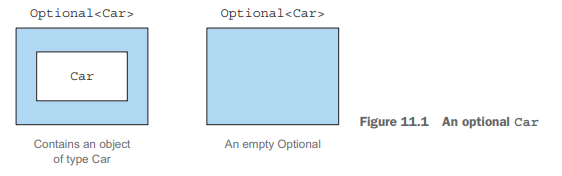
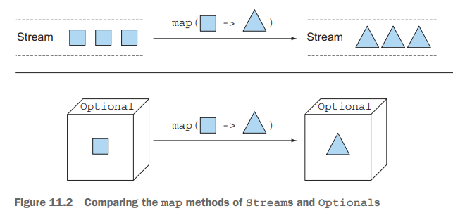
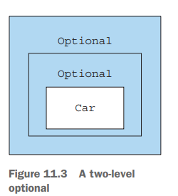
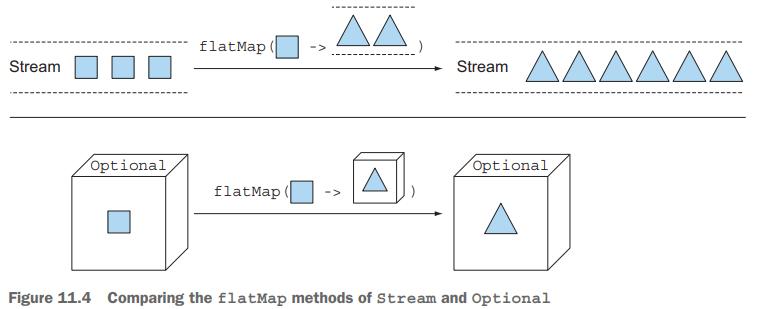

# Parte 4

# Java Cotidiano

La cuarta parte de este libro explora varias características nuevas en Java 8 y Java 9 enfocadas en 
facilitar y hacer más confiable la escritura de tus proyectos. Comenzamos con dos APIs introducidas 
en Java 8.
El capítulo 11 cubre la clase java.util.Optional, que te permite tanto diseñar mejores APIs como 
reducir las excepciones de puntero nulo.
El capítulo 12 explora la API de Fecha y Hora, que mejora greatly las APIs anteriores propensas a 
errores para trabajar con fechas y tiempo.
Luego explicamos las mejoras de Java 8 y Java 9 para escribir sistemas grandes y permitir que 
evolucionen.
En el capítulo 13, aprenderás qué son los métodos predeterminados, cómo puedes usarlos para 
evolucionar APIs de manera compatible, algunos patrones de uso prácticos y reglas para usar los 
métodos predeterminados de manera efectiva.
El capítulo 14 es nuevo para esta segunda edición y explora el Sistema de Módulos de Java—una mejora
importante en Java 9 que permite que los sistemas grandes sean modularizados de una manera documentada
y exigible, en lugar de ser "solo una colección casual de paquetes".

# Capitulo 11

# Usando Optional como una mejor alternativa a null

Este capítulo cubre
- Qué está mal con las referencias nulas y por qué deberías evitarlas
- De null a Optional: reescribiendo tu modelo de dominio de manera segura ante nulos
- Poniendo Optionals a trabajar: eliminando verificaciones de null de tu código
- Diferentes formas de leer el valor posiblemente contenido en un Optional
- Repensando la programación dados valores potencialmente faltantes

Levanta la mano si alguna vez obtuviste una NullPointerException durante tu vida como desarrollador 
de Java. Manténla levantada si esta Excepción es la que más frecuentemente encuentras. 
Desafortunadamente, no podemos verte en este momento, pero creemos que hay una alta probabilidad de 
que tu mano esté levantada ahora. También猜测 que podrías estar pensando algo como "Sí, estoy de 
acuerdo. Las NullPointerExceptions son un dolor de cabeza para cualquier desarrollador de Java, 
novato o experto. Pero no hay mucho que podamos hacer al respecto, porque este es el precio que 
pagamos por usar una construcción tan conveniente, y tal vez inevitable, como las referencias nulas."
Este sentimiento es común en el mundo de la programación (imperativa); sin embargo, puede no ser toda
la verdad y es más bien un sesgo con sólidas raíces históricas.
El científico británico de computadoras Tony Hoare introdujo las referencias nulas en 1965 mientras 
diseñaba ALGOL W, uno de los primeros lenguajes de programación tipados con registros asignados en el
heap, más tarde diciendo que lo hizo "simplemente porque era tan fácil de implementar." A pesar de su
objetivo "de asegurar que todo uso de referencias pudiera ser absolutamente seguro, con verificaciones
realizadas automáticamente por el compilador," decidió hacer una excepción para las referencias nulas
porque pensaba que era la manera más conveniente de modelar la ausencia de un valor. Después de muchos
años, se arrepintió de esta decisión, llamándola "mi error de mil millones de dólares." Todos hemos 
visto el efecto. Examinamos un campo de un objeto, quizás para determinar si su valor es una de dos 
formas esperadas, solo para descubrir que no estamos examinando un objeto sino un puntero nulo que 
rápidamente levanta esa molesta NullPointerException.
En realidad, la declaración de Hoare podría subestimar los costos incurridos por millones de 
desarrolladores corrigiendo errores causados por referencias nulas en los últimos 50 años. De hecho,
la gran mayoría de los lenguajes1 creados en las últimas décadas, incluyendo Java, han sido 
construidos con la misma decisión de diseño, tal vez por razones de compatibilidad con lenguajes más
antiguos o (más probablemente), como dice Hoare, "simplemente porque era tan fácil de implementar." 
Comenzamos mostrándote un ejemplo simple de los problemas con null.

## 11.1 ¿Cómo modelas la ausencia de un valor?
Imagina que tienes la siguiente estructura de objetos anidados para una persona que posee un carro y
tiene seguro de auto en el siguiente listado.

Listado 11.1 El modelo de datos Persona/Automóvil/Seguro:
```java
public class Person {
    private Car car;

    public Car getCar() {
        return car;
    }
}
public class Car {
    private Insurance insurance;

    public Insurance getInsurance() {
        return insurance;
    }
}
public class Insurance {
    private String name;

    public String getName() {
        return name;
    }
}
```
`Excepciones notables incluyen la mayoría de los lenguajes funcionales tipados, como Haskell y ML. 
Estos lenguajes incluyen tipos de datos algebraicos que permiten expresar los tipos de datos de manera
sucinta, incluyendo la especificación explícita de si valores especiales como null deben ser incluidos
tipo por tipo.`

¿Qué esproblemático con el siguiente código?
```java
public String getCarInsuranceName(Person person) {
    return person.getCar().getInsurance().getName();
}
```
Este código se ve bastante razonable, pero muchas personas no poseen un carro, então ¿cuál es el 
resultado de llamar al método getCar? Una práctica común desafortunada es devolver la referencia nula
para indicar la ausencia de un valor (aquí, para indicar la ausencia de un carro). Como consecuencia,
la llamada a getInsurance devuelve el seguro de una referencia nula, lo que resulta en una 
NullPointerException en tiempo de ejecución y detiene la ejecución de tu programa. Pero eso no es todo.
¿Qué pasa si person era null? ¿Qué pasa si el método getInsurance también devolvía null?

### 11.1.1 Reduciendo NullPointerExceptions con verificaciones defensivas
¿Qué puedes hacer para evitar encontrarte con una NullPointerException inesperada? Típicamente, 
puedes agregar verificaciones de null donde sea necesario (y a veces, en un exceso de programación 
defensiva, incluso donde no es necesario) y a menudo con diferentes estilos. Un primer intento de 
escribir un método que prevenga una NullPointerException se muestra en el siguiente listado.

Listado 11.2 Intento nulo-seguro 1: profundas dudas:
```java
public String getCarInsuranceName(Person person) {
    //Cada verificación de null aumenta el nivel de anidamiento de la parte restante de la cadena 
    // de invocación.
    if (person != null) {
        Car car = person.getCar();
        if (car != null) {
            Insurance insurance = car.getInsurance();
            if (insurance != null) {
                return insurance.getName();
            }
        }
    }
    return "Unknown";
}
```
Este método realiza una verificación de null cada vez que desreferencia una variable, devolviendo la
cadena "Unknown" si cualquiera de las variables atravesadas en esta cadena de desreferencia es un 
valor null. La única excepción a esta regla es que no estás verificando si el nombre de la empresa 
de seguros es null porque (como cualquier otra empresa) sabes que debe tener un nombre. Ten en cuenta 
que solo puedes evitar esta última verificación debido a tu conocimiento del dominio del negocio, 
pero ese hecho no está reflejando en las clases de Java que modelan tus datos.
Etiquetamos el método en el listado 11.2 como "profundas dudas" porque muestra un patrón recurrente:
cada vez que dudas que una variable podría ser null, estás obligado a agregar un bloque if anidado 
adicional, aumentando el nivel de indentación del código. Esta técnica claramente escala mal y 
compromete la legibilidad, por lo que quizás te gustaría intentar otra solución. Intenta evitar este
problema haciendo algo diferente como se muestra en el siguiente listado.

Listado 11.3 Intento nulo-seguro 2: demasiadas salidas:
```java
public String getCarInsuranceName(Person person) {
    //Cada verificación de null agrega un punto de salida adicional.
    if (person == null) {
        return "Unknown";
    }
    Car car = person.getCar();
    if (car == null) {
        return "Unknown";
    }
    Insurance insurance = car.getInsurance();
    if (insurance == null) {
        return "Unknown";
    }
    return insurance.getName();
}
```
En este segundo intento, intentas evitar los bloques if profundamente anidados, adoptando una 
estrategia diferente: cada vez que te encuentras con una variable null, devuelves la cadena "Unknown".

Sin embargo, esta solución también está lejos de ser ideal; ahora el método tiene cuatro puntos de 
salida distintos, lo que dificulta su mantenimiento. Peor aún, el valor predeterminado que se devuelve
en caso de null, la cadena "Unknown", se repite en tres lugares—y (esperamos) ¡sin errores de 
ortografía! (Quizás quieras extraer la cadena repetida en una constante para prevenir este problema,
por supuesto.)
Además, el proceso es propenso a errores. ¿Qué pasa si olvidas verificar si una propiedad podría ser
null? Argumentamos en este capítulo que usar null para representar la ausencia de un valor es el 
enfoque incorrecto. Lo que necesitas es una mejor manera de modelar la ausencia y presencia de un valor.

### 11.1.2 Problemas con null
Para resumir nuestra discusión hasta ahora, el uso de referencias nulas en Java causa tanto problemas
teóricos como prácticos:
- Es una fuente de errores. NullPointerException es, con mucho, la excepción más común en Java.
- Infla tu código. Empeora la legibilidad al hacer necesario llenar tu código con verificaciones de 
null que a menudo están profundamente anidadas.
- No tiene sentido. No tiene ningún significado semántico, y en particular, representa la manera 
incorrecta de modelar la ausencia de un valor en un lenguaje tipado estáticamente.
- Rompe la filosofía de Java. Java siempre oculta los punteros de los desarrolladores excepto en un 
caso: el puntero null.
- Crea un agujero en el sistema de tipos. null no lleva información de tipo ni otra información, por
lo que puede asignarse a cualquier tipo de referencia. Esta situación es un problema porque cuando 

  null se propaga a otra parte del sistema, no tienes idea de qué era ese null inicialmente.

Para proporcionar contexto para otras soluciones, en la próxima sección analizamos brevemente lo que
otros lenguajes de programación tienen para ofrecer.

### 11.1.3 ¿Cuáles son las alternativas a null en otros lenguajes?
En años recientes, lenguajes como Groovy trabajaron alrededor de este problema introduciendo un 
operador de navegación seguro, representado por ?., para navegar valores potencialmente nulos de 
manera segura. Para entender cómo funciona este proceso, considera el siguiente código Groovy, que 
recupera el nombre de la empresa de seguros usada por una persona dada para asegurar un carro:

```groovy
def carInsuranceName = person?.car?.insurance?.name 
```

Lo que hace esta declaración debería ser claro. Una persona puede no tener un carro, y tiendes a 
modelar esta posibilidad asignando un null a la referencia de carro del objeto Persona. De manera 
similar, un carro puede no estar asegurado. El operador de navegación segura de Groovy te permite 
navegar estas referencias potencialmente nulas sin lanzar una NullPointerException propagando la 
referencia nula a través de la cadena de invocaciones, devolviendo un null en caso de que cualquier 
valor en la cadena sea un null.
Una característica similar fue propuesta y luego descartada para Java 7. De alguna manera, sin 
embargo, no parece extrañar un operador de navegación segura en Java. La primera tentación de todos 
los desarrolladores de Java cuando se enfrentan a una NullPointerException es solucionarlo rápidamente
agregando una declaración if, verificando que un valor no sea null antes de invocar un método sobre 
él. Si resuelves el problema de esta manera, sin preguntarte si es correcto para tu algoritmo o modelo
de datos presentar un valor null en esa situación específica, no estás corrigiendo un error sino 
ocultándolo, haciendo que su descubrimiento y remediación sean mucho más difíciles para quien será 
llamado a trabajar en él la próxima vez (probablemente tú en la próxima semana o mes). Estás barriendo
la basura debajo de la alfombra. El operador de desreferencia nula-segura de Groovy es solo una escoba
más grande y poderosa para cometer este error sin preocuparse demasiado por sus consecuencias.
Otros lenguajes funcionales, como Haskell y Scala, adoptan una visión diferente. Haskell incluye un 
tipo Maybe, que esencialmente encapsula un valor opcional. Un valor de tipo Maybe puede contener un 
valor de un tipo dado o nada. Haskell no tiene concepto de referencia nula. Scala tiene una 
construcción similar llamada OptionT para encapsular la presencia o ausencia de un valor de tipo T, 
que discutimos en el capítulo 20. Luego tienes que verificar explícitamente si un valor está presente
o no usando operaciones disponibles en el tipo Option, lo que impone la idea de "verificación de null".
Ya no puedes olvidar verificar null—porque la verificación es impuesta por el sistema de tipos.
Está bien, nos hemos desviado un poco, y todo esto suena bastante abstracto. Quizás te preguntes 
sobre Java 8. Java 8 se inspira en esta idea de un valor opcional introduciendo una nueva clase 
llamada java.util.Optional<T>! En este capítulo, mostramos las ventajas de usar esta clase para 
modelar valores potencialmente ausentes en lugar de asignarles una referencia nula. También aclaramos
cómo esta migración de nulls a Optionals te requiere repensar la forma en que tratas los valores 
opcionales en tu modelo de dominio.
Finalmente, exploramos las características de esta nueva clase Optional y proporcionamos algunos 
ejemplos prácticos mostrando cómo usarla efectivamente. En última instancia, aprendes cómo diseñar 
mejores APIs en las que los usuarios pueden saber si deben esperar un valor opcional leyendo la firma
de un método.

## 11.2 Introduciendo la clase Optional
Java 8 introduce una nueva clase llamada java.util.Optional<T> que está inspirada en Haskell y Scala.
La clase encapsula un valor opcional. Si sabes que una persona puede no tener un carro, por ejemplo,
la variable de carro dentro de la clase Persona no debería declararse tipo Car y asignarse a una 
referencia nula cuando la persona no posee un carro; en cambio, debería ser tipo Optional<Car>, como
se ilustra en la figura 11.1.



Cuando un valor está presente, la clase Optional lo envuelve. Por el contrario, la ausencia de un 
valor se modela con un optional vacío devuelto por el método Optional.empty(). Este método de fábrica
estático devuelve una instancia especial singleton de la clase Optional. Quizás te preguntes sobre la
diferencia entre una referencia nula y Optional.empty(). Semánticamente, podrían verse como la misma 
cosa, pero en la práctica, la diferencia es enorme. Intentar desreferenciar un null invariablemente 
causa una NullPointerException, mientras que Optional.empty() es un objeto válido y funcional de tipo
Optional que puede invocarse de maneras útiles. Pronto verás cómo.
Una diferencia semántica práctica importante al usar Optionals en lugar de nulls es que en el primer
caso, declarar una variable de tipo Optional<Car> en lugar de Car claramente señala que se permite un
valor faltante. Por el contrario, usar siempre el tipo Car y posiblemente asignar una referencia nula
a una variable de ese tipo implica que no tienes ninguna ayuda, además de tu conocimiento del modelo
de negocio, para entender si el null pertenece al dominio válido de esa variable dada.
Con esto en mente, puedes re-elaborar el modelo original del listado 11.1, usando la clase Optional 
como se muestra en el siguiente listado.

Listado 11.4 Redefiniendo el modelo de datos Persona/Automóvil/Seguro usando Optional:
```java
public class Person {
    private Optional<Car> car; //Una persona puede no poseer un carro, así que declaras este campo como Optional.

    public Optional<Car> getCar() { 
        return car;
    }
}
public class Car {
    private Optional<Insurance> insurance; //Un carro puede no estar asegurado, así que declaras este campo como Optional.

    public Optional<Insurance> getInsurance() {
        return insurance;
    }
}
public class Insurance { //Una compañía de seguros debe tener un nombre.
    private String name;

    public String getName() {
        return name;
    }
}
```
Observa cómo el uso de la clase Optional enriquece la semántica de tu modelo. El hecho de que una 
persona referencie un Optional<Car>, y un carro referencie un Optional<Insurance>, hace explícito en
el dominio que una persona puede o no poseer un carro, y que un carro puede o no estar asegurado.
Al mismo tiempo, el hecho de que el nombre de la compañía de seguros sea declarado de tipo String en
lugar de Optional<String> hace evidente que una compañía de seguros debe tener un nombre. De esta 
manera, sabes con certeza si obtendrás una NullPointerException al desreferenciar el nombre de una 
compañía de seguros; no tienes que agregar una verificación de null, porque hacerlo ocultaría el 
problema en lugar de corregirlo. Una compañía de seguros debe tener un nombre, entonces si encuentras
una sin nombre, tendrás que resolver qué está mal en tus datos en lugar de agregar un fragmento de 
código para cubrir esta circunstancia. El uso consistente de valores Optional crea una distinción 
clara entre un valor faltante que está planeado y un valor que está ausente solo debido a un error 
en tu algoritmo o un problema en tus datos.
Es importante notar que la intención de la clase Optional no es reemplazar cada referencia nula 
individual. En cambio, su propósito es ayudarte a diseñar APIs más comprensibles para que al leer la
firma de un método, puedas saber si esperar un valor opcional. Se te obliga a desenvolver activamente
un optional para tratar con la ausencia de un valor.

## 11.3 Patrones para adoptar Optionals
Hasta ahora, bien; has aprendido cómo emplear optionals en tipos para clarificar tu modelo de dominio,
y has visto las ventajas de este proceso sobre representar valores faltantes con referencias nulas. 
¿Cómo puedes usar optionals ahora? Más específicamente, ¿cómo puedes usar un valor envuelto en un 
optional?

### 11.3.1 Creando objetos Optional
El primer paso antes de trabajar con Optional es aprender cómo crear objetos Optional. Puedes 
crearlos de varias maneras.

### Opcional Vacio
Como se mencionó anteriormente, puedes obtener un objeto optional vacío usando el método de fábrica 
estático Optional.empty:
```java
Optional<Car> optCar = Optional.empty();
```
### OPTIONAL desde un valor no Null
También puedes crear un optional desde un valor no nulo con el método de fábrica estático Optional.of:
```java
Optional<Car> optCar = Optional.of(car);
```
Si el coche fuera null, se lanzaría un NullPointerException inmediatamente (en lugar de obtener un 
error latente cuando intentas acceder a las propiedades del coche).

### Optional desde Null
Finalmente, usando el método de fábrica estático Optional.ofNullable, puedes crear un objeto Optional
que puede contener un valor null:
```java
Optional<Car> optCar = Optional.ofNullable(car);
```
Si car fuera null, el objeto Optional resultante estaría vacío.
Podrías imaginar que continuaremos investigando cómo obtener un valor de un optional. Un método get 
hace precisamente esto, y hablaremos más sobre él después. Pero get lanza una excepción cuando el 
optional está vacío, por lo que usarlo de manera indisciplinada efectivamente recrea todos los 
problemas de mantenimiento causados por usar null. En su lugar, comenzamos observando formas de usar
valores optional que eviten pruebas explícitas, inspirados en operaciones similares en streams.

### 11.3.2 Extrayendo y transformando valores de Optionals con map
Un patrón común es extraer información de un objeto. Puede que quieras extraer el nombre de una 
compañía de seguros, por ejemplo. Necesitas verificar si insurance es null antes de extraer el nombre
de la siguiente manera:
```java
String name = null;
if(insurance != null){
    name =insurance.getName();
}
```
Optional soporta un método map para este patrón, el cual funciona de la siguiente manera (de aquí en
adelante, usamos el modelo presentado en el listado 11.4):
```java
Optional<Insurance> optInsurance = Optional.ofNullable(insurance);
Optional<String> name = optInsurance.map(Insurance::getName);
```
Este método es conceptualmente similar al método map de Stream que viste en los capítulos 4 y 5. La 
operación map aplica la función proporcionada a cada elemento de un stream. También podrías pensar en
un objeto Optional como una colección particular de datos, que contiene como máximo un solo elemento.
Si el Optional contiene un valor, la función pasada como argumento a map transforma ese valor. Si el
Optional está vacío, no ocurre nada. La figura 11.2 ilustra esta similitud, mostrando lo que sucede 
cuando pasas una función que transforma un cuadrado en un triángulo a los métodos map tanto de un 
stream de cuadrados como de un optional de cuadrado.



Esta idea parece útil, pero ¿cómo puedes usarla para reescribir el código en el listado 11.1?
```java
public String getCarInsuranceName(Person person) {
    return person.getCar().getInsurance().getName();
}
```
el cual encadena varias llamadas a métodos, de una manera segura? La respuesta es usar otro método 
soportado por Optional llamado flatMap.

### 11.3.3 Encadenando objetos Optional con flatMap
Debido a que has aprendido cómo usar map, tu primera reacción podría ser usar map para reescribir
el código de la siguiente manera:
```java
Optional<Person> optPerson = Optional.of(person);
Optional<String> name =
 optPerson.map(Person::getCar)
 .map(Car::getInsurance)
 .map(Insurance::getName);
```
Desafortunadamente, este código no compila. ¿Por qué? La variable optPerson es de tipo Optional<Person>,
por lo que es perfectamente válido llamar al método map. Pero getCar devuelve un objeto de tipo 
Optional<Car> (como se presenta en el listado 11.4), lo que significa que el resultado de la operación
map es un objeto de tipo Optional<Optional<Car>>.
Como resultado, la llamada a getInsurance es inválida porque el optional más externo contiene como su
valor otro optional, el cual por supuesto no soporta el método getInsurance. La figura 11.3 ilustra 
la estructura anidada de optional que obtendrías.



¿Cómo puedes resolver este problema? Nuevamente, puedes observar un patrón que has usado anteriormente
con streams: el método flatMap. Con streams, el método flatMap toma una función como argumento y 
devuelve otro stream. Esta función se aplica a cada elemento de un stream, resultando en un stream de
streams. Pero flatMap tiene el efecto de reemplazar cada stream generado con el contenido de ese 
stream. En otras palabras, todos los streams separados que son generados por la función get se 
amalgaman o aplastan en un solo stream. Lo que quieres aquí es algo similar, pero quieres aplanar un
optional de dos niveles en uno solo.
Como la figura 11.2 hace para el método map, la figura 11.4 ilustra las similitudes entre los métodos
flatMap de las clases Stream y Optional.



