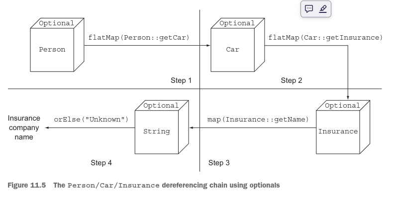
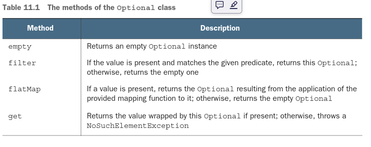
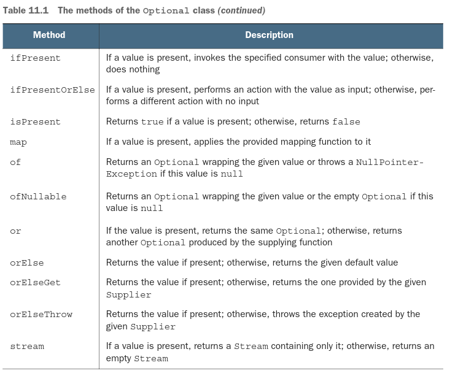

# Parte 4

# Java Cotidiano

La cuarta parte de este libro explora varias características nuevas en Java 8 y Java 9 enfocadas en 
facilitar y hacer más confiable la escritura de tus proyectos. Comenzamos con dos APIs introducidas 
en Java 8.
El capítulo 11 cubre la clase java.util.Optional, que te permite tanto diseñar mejores APIs como 
reducir las excepciones de puntero nulo.
El capítulo 12 explora la API de Fecha y Hora, que mejora greatly las APIs anteriores propensas a 
errores para trabajar con fechas y tiempo.
Luego explicamos las mejoras de Java 8 y Java 9 para escribir sistemas grandes y permitir que 
evolucionen.
En el capítulo 13, aprenderás qué son los métodos predeterminados, cómo puedes usarlos para 
evolucionar APIs de manera compatible, algunos patrones de uso prácticos y reglas para usar los 
métodos predeterminados de manera efectiva.
El capítulo 14 es nuevo para esta segunda edición y explora el Sistema de Módulos de Java—una mejora
importante en Java 9 que permite que los sistemas grandes sean modularizados de una manera documentada
y exigible, en lugar de ser "solo una colección casual de paquetes".

# Capitulo 11

# Usando Optional como una mejor alternativa a null

Este capítulo cubre
- Qué está mal con las referencias nulas y por qué deberías evitarlas
- De null a Optional: reescribiendo tu modelo de dominio de manera segura ante nulos
- Poniendo Optionals a trabajar: eliminando verificaciones de null de tu código
- Diferentes formas de leer el valor posiblemente contenido en un Optional
- Repensando la programación dados valores potencialmente faltantes

Levanta la mano si alguna vez obtuviste una NullPointerException durante tu vida como desarrollador 
de Java. Manténla levantada si esta Excepción es la que más frecuentemente encuentras. 
Desafortunadamente, no podemos verte en este momento, pero creemos que hay una alta probabilidad de 
que tu mano esté levantada ahora. También猜测 que podrías estar pensando algo como "Sí, estoy de 
acuerdo. Las NullPointerExceptions son un dolor de cabeza para cualquier desarrollador de Java, 
novato o experto. Pero no hay mucho que podamos hacer al respecto, porque este es el precio que 
pagamos por usar una construcción tan conveniente, y tal vez inevitable, como las referencias nulas."
Este sentimiento es común en el mundo de la programación (imperativa); sin embargo, puede no ser toda
la verdad y es más bien un sesgo con sólidas raíces históricas.
El científico británico de computadoras Tony Hoare introdujo las referencias nulas en 1965 mientras 
diseñaba ALGOL W, uno de los primeros lenguajes de programación tipados con registros asignados en el
heap, más tarde diciendo que lo hizo "simplemente porque era tan fácil de implementar." A pesar de su
objetivo "de asegurar que todo uso de referencias pudiera ser absolutamente seguro, con verificaciones
realizadas automáticamente por el compilador," decidió hacer una excepción para las referencias nulas
porque pensaba que era la manera más conveniente de modelar la ausencia de un valor. Después de muchos
años, se arrepintió de esta decisión, llamándola "mi error de mil millones de dólares." Todos hemos 
visto el efecto. Examinamos un campo de un objeto, quizás para determinar si su valor es una de dos 
formas esperadas, solo para descubrir que no estamos examinando un objeto sino un puntero nulo que 
rápidamente levanta esa molesta NullPointerException.
En realidad, la declaración de Hoare podría subestimar los costos incurridos por millones de 
desarrolladores corrigiendo errores causados por referencias nulas en los últimos 50 años. De hecho,
la gran mayoría de los lenguajes1 creados en las últimas décadas, incluyendo Java, han sido 
construidos con la misma decisión de diseño, tal vez por razones de compatibilidad con lenguajes más
antiguos o (más probablemente), como dice Hoare, "simplemente porque era tan fácil de implementar." 
Comenzamos mostrándote un ejemplo simple de los problemas con null.

## 11.1 ¿Cómo modelas la ausencia de un valor?
Imagina que tienes la siguiente estructura de objetos anidados para una persona que posee un carro y
tiene seguro de auto en el siguiente listado.

Listado 11.1 El modelo de datos Persona/Automóvil/Seguro:
```java
public class Person {
    private Car car;

    public Car getCar() {
        return car;
    }
}
public class Car {
    private Insurance insurance;

    public Insurance getInsurance() {
        return insurance;
    }
}
public class Insurance {
    private String name;

    public String getName() {
        return name;
    }
}
```
`Excepciones notables incluyen la mayoría de los lenguajes funcionales tipados, como Haskell y ML. 
Estos lenguajes incluyen tipos de datos algebraicos que permiten expresar los tipos de datos de manera
sucinta, incluyendo la especificación explícita de si valores especiales como null deben ser incluidos
tipo por tipo.`

¿Qué esproblemático con el siguiente código?
```java
public String getCarInsuranceName(Person person) {
    return person.getCar().getInsurance().getName();
}
```
Este código se ve bastante razonable, pero muchas personas no poseen un carro, então ¿cuál es el 
resultado de llamar al método getCar? Una práctica común desafortunada es devolver la referencia nula
para indicar la ausencia de un valor (aquí, para indicar la ausencia de un carro). Como consecuencia,
la llamada a getInsurance devuelve el seguro de una referencia nula, lo que resulta en una 
NullPointerException en tiempo de ejecución y detiene la ejecución de tu programa. Pero eso no es todo.
¿Qué pasa si person era null? ¿Qué pasa si el método getInsurance también devolvía null?

### 11.1.1 Reduciendo NullPointerExceptions con verificaciones defensivas
¿Qué puedes hacer para evitar encontrarte con una NullPointerException inesperada? Típicamente, 
puedes agregar verificaciones de null donde sea necesario (y a veces, en un exceso de programación 
defensiva, incluso donde no es necesario) y a menudo con diferentes estilos. Un primer intento de 
escribir un método que prevenga una NullPointerException se muestra en el siguiente listado.

Listado 11.2 Intento nulo-seguro 1: profundas dudas:
```java
public String getCarInsuranceName(Person person) {
    //Cada verificación de null aumenta el nivel de anidamiento de la parte restante de la cadena 
    // de invocación.
    if (person != null) {
        Car car = person.getCar();
        if (car != null) {
            Insurance insurance = car.getInsurance();
            if (insurance != null) {
                return insurance.getName();
            }
        }
    }
    return "Unknown";
}
```
Este método realiza una verificación de null cada vez que desreferencia una variable, devolviendo la
cadena "Unknown" si cualquiera de las variables atravesadas en esta cadena de desreferencia es un 
valor null. La única excepción a esta regla es que no estás verificando si el nombre de la empresa 
de seguros es null porque (como cualquier otra empresa) sabes que debe tener un nombre. Ten en cuenta 
que solo puedes evitar esta última verificación debido a tu conocimiento del dominio del negocio, 
pero ese hecho no está reflejando en las clases de Java que modelan tus datos.
Etiquetamos el método en el listado 11.2 como "profundas dudas" porque muestra un patrón recurrente:
cada vez que dudas que una variable podría ser null, estás obligado a agregar un bloque if anidado 
adicional, aumentando el nivel de indentación del código. Esta técnica claramente escala mal y 
compromete la legibilidad, por lo que quizás te gustaría intentar otra solución. Intenta evitar este
problema haciendo algo diferente como se muestra en el siguiente listado.

Listado 11.3 Intento nulo-seguro 2: demasiadas salidas:
```java
public String getCarInsuranceName(Person person) {
    //Cada verificación de null agrega un punto de salida adicional.
    if (person == null) {
        return "Unknown";
    }
    Car car = person.getCar();
    if (car == null) {
        return "Unknown";
    }
    Insurance insurance = car.getInsurance();
    if (insurance == null) {
        return "Unknown";
    }
    return insurance.getName();
}
```
En este segundo intento, intentas evitar los bloques if profundamente anidados, adoptando una 
estrategia diferente: cada vez que te encuentras con una variable null, devuelves la cadena "Unknown".

Sin embargo, esta solución también está lejos de ser ideal; ahora el método tiene cuatro puntos de 
salida distintos, lo que dificulta su mantenimiento. Peor aún, el valor predeterminado que se devuelve
en caso de null, la cadena "Unknown", se repite en tres lugares—y (esperamos) ¡sin errores de 
ortografía! (Quizás quieras extraer la cadena repetida en una constante para prevenir este problema,
por supuesto.)
Además, el proceso es propenso a errores. ¿Qué pasa si olvidas verificar si una propiedad podría ser
null? Argumentamos en este capítulo que usar null para representar la ausencia de un valor es el 
enfoque incorrecto. Lo que necesitas es una mejor manera de modelar la ausencia y presencia de un valor.

### 11.1.2 Problemas con null
Para resumir nuestra discusión hasta ahora, el uso de referencias nulas en Java causa tanto problemas
teóricos como prácticos:
- Es una fuente de errores. NullPointerException es, con mucho, la excepción más común en Java.
- Infla tu código. Empeora la legibilidad al hacer necesario llenar tu código con verificaciones de 
null que a menudo están profundamente anidadas.
- No tiene sentido. No tiene ningún significado semántico, y en particular, representa la manera 
incorrecta de modelar la ausencia de un valor en un lenguaje tipado estáticamente.
- Rompe la filosofía de Java. Java siempre oculta los punteros de los desarrolladores excepto en un 
caso: el puntero null.
- Crea un agujero en el sistema de tipos. null no lleva información de tipo ni otra información, por
lo que puede asignarse a cualquier tipo de referencia. Esta situación es un problema porque cuando 

  null se propaga a otra parte del sistema, no tienes idea de qué era ese null inicialmente.

Para proporcionar contexto para otras soluciones, en la próxima sección analizamos brevemente lo que
otros lenguajes de programación tienen para ofrecer.

### 11.1.3 ¿Cuáles son las alternativas a null en otros lenguajes?
En años recientes, lenguajes como Groovy trabajaron alrededor de este problema introduciendo un 
operador de navegación seguro, representado por ?., para navegar valores potencialmente nulos de 
manera segura. Para entender cómo funciona este proceso, considera el siguiente código Groovy, que 
recupera el nombre de la empresa de seguros usada por una persona dada para asegurar un carro:

```groovy
def carInsuranceName = person?.car?.insurance?.name 
```

Lo que hace esta declaración debería ser claro. Una persona puede no tener un carro, y tiendes a 
modelar esta posibilidad asignando un null a la referencia de carro del objeto Persona. De manera 
similar, un carro puede no estar asegurado. El operador de navegación segura de Groovy te permite 
navegar estas referencias potencialmente nulas sin lanzar una NullPointerException propagando la 
referencia nula a través de la cadena de invocaciones, devolviendo un null en caso de que cualquier 
valor en la cadena sea un null.
Una característica similar fue propuesta y luego descartada para Java 7. De alguna manera, sin 
embargo, no parece extrañar un operador de navegación segura en Java. La primera tentación de todos 
los desarrolladores de Java cuando se enfrentan a una NullPointerException es solucionarlo rápidamente
agregando una declaración if, verificando que un valor no sea null antes de invocar un método sobre 
él. Si resuelves el problema de esta manera, sin preguntarte si es correcto para tu algoritmo o modelo
de datos presentar un valor null en esa situación específica, no estás corrigiendo un error sino 
ocultándolo, haciendo que su descubrimiento y remediación sean mucho más difíciles para quien será 
llamado a trabajar en él la próxima vez (probablemente tú en la próxima semana o mes). Estás barriendo
la basura debajo de la alfombra. El operador de desreferencia nula-segura de Groovy es solo una escoba
más grande y poderosa para cometer este error sin preocuparse demasiado por sus consecuencias.
Otros lenguajes funcionales, como Haskell y Scala, adoptan una visión diferente. Haskell incluye un 
tipo Maybe, que esencialmente encapsula un valor opcional. Un valor de tipo Maybe puede contener un 
valor de un tipo dado o nada. Haskell no tiene concepto de referencia nula. Scala tiene una 
construcción similar llamada OptionT para encapsular la presencia o ausencia de un valor de tipo T, 
que discutimos en el capítulo 20. Luego tienes que verificar explícitamente si un valor está presente
o no usando operaciones disponibles en el tipo Option, lo que impone la idea de "verificación de null".
Ya no puedes olvidar verificar null—porque la verificación es impuesta por el sistema de tipos.
Está bien, nos hemos desviado un poco, y todo esto suena bastante abstracto. Quizás te preguntes 
sobre Java 8. Java 8 se inspira en esta idea de un valor opcional introduciendo una nueva clase 
llamada java.util.Optional<T>! En este capítulo, mostramos las ventajas de usar esta clase para 
modelar valores potencialmente ausentes en lugar de asignarles una referencia nula. También aclaramos
cómo esta migración de nulls a Optionals te requiere repensar la forma en que tratas los valores 
opcionales en tu modelo de dominio.
Finalmente, exploramos las características de esta nueva clase Optional y proporcionamos algunos 
ejemplos prácticos mostrando cómo usarla efectivamente. En última instancia, aprendes cómo diseñar 
mejores APIs en las que los usuarios pueden saber si deben esperar un valor opcional leyendo la firma
de un método.

## 11.2 Introduciendo la clase Optional
Java 8 introduce una nueva clase llamada java.util.Optional<T> que está inspirada en Haskell y Scala.
La clase encapsula un valor opcional. Si sabes que una persona puede no tener un carro, por ejemplo,
la variable de carro dentro de la clase Persona no debería declararse tipo Car y asignarse a una 
referencia nula cuando la persona no posee un carro; en cambio, debería ser tipo Optional<Car>, como
se ilustra en la figura 11.1.


Cuando un valor está presente, la clase Optional lo envuelve. Por el contrario, la ausencia de un 
valor se modela con un optional vacío devuelto por el método Optional.empty(). Este método de fábrica
estático devuelve una instancia especial singleton de la clase Optional. Quizás te preguntes sobre la
diferencia entre una referencia nula y Optional.empty(). Semánticamente, podrían verse como la misma 
cosa, pero en la práctica, la diferencia es enorme. Intentar desreferenciar un null invariablemente 
causa una NullPointerException, mientras que Optional.empty() es un objeto válido y funcional de tipo
Optional que puede invocarse de maneras útiles. Pronto verás cómo.
Una diferencia semántica práctica importante al usar Optionals en lugar de nulls es que en el primer
caso, declarar una variable de tipo Optional<Car> en lugar de Car claramente señala que se permite un
valor faltante. Por el contrario, usar siempre el tipo Car y posiblemente asignar una referencia nula
a una variable de ese tipo implica que no tienes ninguna ayuda, además de tu conocimiento del modelo
de negocio, para entender si el null pertenece al dominio válido de esa variable dada.
Con esto en mente, puedes re-elaborar el modelo original del listado 11.1, usando la clase Optional 
como se muestra en el siguiente listado.

Listado 11.4 Redefiniendo el modelo de datos Persona/Automóvil/Seguro usando Optional:
```java
public class Person {
    private Optional<Car> car; //Una persona puede no poseer un carro, así que declaras este campo como Optional.

    public Optional<Car> getCar() { 
        return car;
    }
}
public class Car {
    private Optional<Insurance> insurance; //Un carro puede no estar asegurado, así que declaras este campo como Optional.

    public Optional<Insurance> getInsurance() {
        return insurance;
    }
}
public class Insurance { //Una compañía de seguros debe tener un nombre.
    private String name;

    public String getName() {
        return name;
    }
}
```
Observa cómo el uso de la clase Optional enriquece la semántica de tu modelo. El hecho de que una 
persona referencie un Optional<Car>, y un carro referencie un Optional<Insurance>, hace explícito en
el dominio que una persona puede o no poseer un carro, y que un carro puede o no estar asegurado.
Al mismo tiempo, el hecho de que el nombre de la compañía de seguros sea declarado de tipo String en
lugar de Optional<String> hace evidente que una compañía de seguros debe tener un nombre. De esta 
manera, sabes con certeza si obtendrás una NullPointerException al desreferenciar el nombre de una 
compañía de seguros; no tienes que agregar una verificación de null, porque hacerlo ocultaría el 
problema en lugar de corregirlo. Una compañía de seguros debe tener un nombre, entonces si encuentras
una sin nombre, tendrás que resolver qué está mal en tus datos en lugar de agregar un fragmento de 
código para cubrir esta circunstancia. El uso consistente de valores Optional crea una distinción 
clara entre un valor faltante que está planeado y un valor que está ausente solo debido a un error 
en tu algoritmo o un problema en tus datos.
Es importante notar que la intención de la clase Optional no es reemplazar cada referencia nula 
individual. En cambio, su propósito es ayudarte a diseñar APIs más comprensibles para que al leer la
firma de un método, puedas saber si esperar un valor opcional. Se te obliga a desenvolver activamente
un optional para tratar con la ausencia de un valor.

## 11.3 Patrones para adoptar Optionals
Hasta ahora, bien; has aprendido cómo emplear optionals en tipos para clarificar tu modelo de dominio,
y has visto las ventajas de este proceso sobre representar valores faltantes con referencias nulas. 
¿Cómo puedes usar optionals ahora? Más específicamente, ¿cómo puedes usar un valor envuelto en un 
optional?

### 11.3.1 Creando objetos Optional
El primer paso antes de trabajar con Optional es aprender cómo crear objetos Optional. Puedes 
crearlos de varias maneras.

### Opcional Vacio
Como se mencionó anteriormente, puedes obtener un objeto optional vacío usando el método de fábrica 
estático Optional.empty:
```java
Optional<Car> optCar = Optional.empty();
```
### OPTIONAL desde un valor no Null
También puedes crear un optional desde un valor no nulo con el método de fábrica estático Optional.of:
```java
Optional<Car> optCar = Optional.of(car);
```
Si el coche fuera null, se lanzaría un NullPointerException inmediatamente (en lugar de obtener un 
error latente cuando intentas acceder a las propiedades del coche).

### Optional desde Null
Finalmente, usando el método de fábrica estático Optional.ofNullable, puedes crear un objeto Optional
que puede contener un valor null:
```java
Optional<Car> optCar = Optional.ofNullable(car);
```
Si car fuera null, el objeto Optional resultante estaría vacío.
Podrías imaginar que continuaremos investigando cómo obtener un valor de un optional. Un método get 
hace precisamente esto, y hablaremos más sobre él después. Pero get lanza una excepción cuando el 
optional está vacío, por lo que usarlo de manera indisciplinada efectivamente recrea todos los 
problemas de mantenimiento causados por usar null. En su lugar, comenzamos observando formas de usar
valores optional que eviten pruebas explícitas, inspirados en operaciones similares en streams.

### 11.3.2 Extrayendo y transformando valores de Optionals con map
Un patrón común es extraer información de un objeto. Puede que quieras extraer el nombre de una 
compañía de seguros, por ejemplo. Necesitas verificar si insurance es null antes de extraer el nombre
de la siguiente manera:
```java
String name = null;
if(insurance != null){
    name =insurance.getName();
}
```
Optional soporta un método map para este patrón, el cual funciona de la siguiente manera (de aquí en
adelante, usamos el modelo presentado en el listado 11.4):
```java
Optional<Insurance> optInsurance = Optional.ofNullable(insurance);
Optional<String> name = optInsurance.map(Insurance::getName);
```
Este método es conceptualmente similar al método map de Stream que viste en los capítulos 4 y 5. La 
operación map aplica la función proporcionada a cada elemento de un stream. También podrías pensar en
un objeto Optional como una colección particular de datos, que contiene como máximo un solo elemento.
Si el Optional contiene un valor, la función pasada como argumento a map transforma ese valor. Si el
Optional está vacío, no ocurre nada. La figura 11.2 ilustra esta similitud, mostrando lo que sucede 
cuando pasas una función que transforma un cuadrado en un triángulo a los métodos map tanto de un 
stream de cuadrados como de un optional de cuadrado.


Esta idea parece útil, pero ¿cómo puedes usarla para reescribir el código en el listado 11.1?
```java
public String getCarInsuranceName(Person person) {
    return person.getCar().getInsurance().getName();
}
```
el cual encadena varias llamadas a métodos, de una manera segura? La respuesta es usar otro método 
soportado por Optional llamado flatMap.

### 11.3.3 Encadenando objetos Optional con flatMap
Debido a que has aprendido cómo usar map, tu primera reacción podría ser usar map para reescribir
el código de la siguiente manera:
```java
Optional<Person> optPerson = Optional.of(person);
Optional<String> name =
 optPerson.map(Person::getCar)
 .map(Car::getInsurance)
 .map(Insurance::getName);
```
Desafortunadamente, este código no compila. ¿Por qué? La variable optPerson es de tipo Optional<Person>,
por lo que es perfectamente válido llamar al método map. Pero getCar devuelve un objeto de tipo 
Optional<Car> (como se presenta en el listado 11.4), lo que significa que el resultado de la operación
map es un objeto de tipo Optional<Optional<Car>>.
Como resultado, la llamada a getInsurance es inválida porque el optional más externo contiene como su
valor otro optional, el cual por supuesto no soporta el método getInsurance. La figura 11.3 ilustra 
la estructura anidada de optional que obtendrías.


¿Cómo puedes resolver este problema? Nuevamente, puedes observar un patrón que has usado anteriormente
con streams: el método flatMap. Con streams, el método flatMap toma una función como argumento y 
devuelve otro stream. Esta función se aplica a cada elemento de un stream, resultando en un stream de
streams. Pero flatMap tiene el efecto de reemplazar cada stream generado con el contenido de ese 
stream. En otras palabras, todos los streams separados que son generados por la función get se 
amalgaman o aplastan en un solo stream. Lo que quieres aquí es algo similar, pero quieres aplanar un
optional de dos niveles en uno solo.
Como la figura 11.2 hace para el método map, la figura 11.4 ilustra las similitudes entre los métodos
flatMap de las clases Stream y Optional.


Aquí, la función pasada al método flatMap del stream transforma cada cuadrado en otro stream que contiene dos triángulos.
Entonces el resultado de un simple map es un stream que contiene otros tres streams, cada uno con dos triángulos, pero el
método flatMap aplana este stream de dos niveles en un solo stream que contiene seis triángulos en total. Del mismo modo,
la función pasada al método flatMap del optional transforma el cuadrado contenido en el optional original en un optional
que contiene un triángulo. Si esta función se pasara al método map, el resultado sería un optional que contiene otro 
optional que a su vez contiene un triángulo, pero el método flatMap aplana este optional de dos niveles en un solo 
optional que contiene un triángulo.

### Obtener el nombre de la compania de seguros de un coche Optional
Ahora que conoces la teoría de los métodos map y flatMap de Optional, estás listo para ponerlos en práctica. Los feos
intentos realizados en los listados 11.2 y 11.3 pueden reescribirse utilizando el modelo de datos basado en optional del 
listado 11.4 de la siguiente manera:

Listado 11.5 Obteniendo el nombre de la compañía de seguros de un coche con Optionals:
```java
public String getCarInsuranceName(Optional<Person> person) {
    return person.flatMap(Person::getCar)
            .flatMap(Car::getInsurance)
            .map(Insurance::getName)
            .orElse("Unknown"); //Un valor por defecto si el Optional resultante está vacío
}
```
Al comparar el listado 11.5 con los dos intentos anteriores se muestran las ventajas de usar optionals al tratar con 
valores potencialmente ausentes. Esta vez, puedes obtener lo que quieres con una declaración fácilmente comprensible en 
lugar de incrementar la complejidad del código con ramas condicionales.
En términos de implementación, primero nota que modificas la firma del método getCarInsuranceName de los listados 11.2 y
11.3. Dijimos explícitamente que podría haber un caso en el que una Person inexistente se pase a este método, como cuando
esa Person se recupera de una base de datos mediante un identificador, y quieres modelar la posibilidad de que no exista
ninguna Person en tus datos para el identificador dado. Modelas este requerimiento adicional cambiando el tipo del 
argumento del método de Person a Optional<Person>.
Una vez más, este enfoque te permite hacer explícito a través del sistema de tipos algo que de otro modo permanecería 
implícito en tu conocimiento del modelo de dominio: el primer propósito de un lenguaje, incluso un lenguaje de 
programación, es la comunicación. Declarar que un método acepta un optional como argumento o devuelve un optional como 
resultado documenta a tus colegas —y a todos los futuros usuarios de tu método— que puede recibir un valor vacío o dar 
un valor vacío como resultado.

### Cadena de desreferenciacion Person/Car/Insurance usando Optional
Comenzando con este Optional<Person>, el Car de la Person, el Insurance del Car, y el String que contiene el nombre de 
la compañía de seguros del Insurance se desreferencian con una combinación de los métodos map y flatMap introducidos 
anteriormente en este capítulo. La figura 11.5 ilustra esta tubería de operaciones.



Aquí, comienzas con el optional que envuelve la Person e invocas flatMap(Person::getCar) sobre él. Como dijimos, puedes 
pensar lógicamente en esta invocación como algo que ocurre en dos pasos. En el paso 1, se aplica una Function a la Person
dentro del optional para transformarla. En este caso, la Function se expresa con una referencia a método que invoca el 
método getCar sobre esa Person. Debido a que ese método devuelve un Optional<Car>, la Person dentro del optional se 
transforma en una instancia de ese tipo, resultando en un optional de dos niveles que se aplana como parte de la operación
flatMap. Desde un punto de vista teórico, puedes pensar en esta operación de aplanamiento como la operación que combina 
dos optionals anidados, resultando en un optional vacío si al menos uno de ellos está vacío. Lo que ocurre en realidad es
que si invocas flatMap sobre un optional vacío, nada cambia, y el optional vacío se devuelve tal cual. Por el contrario, 
si el optional envuelve una Person, la Function pasada al método flatMap se aplica a esa Person. Debido a que el valor 
producido por esa aplicación de Function ya es un optional, el método flatMap puede devolverlo tal cual.
El segundo paso es similar al primero, transformando el Optional<Car> en un Optional<Insurance>. El paso 3 convierte el 
Optional<Insurance> en un Optional<String>: porque el método Insurance.getName() devuelve un String. En este caso, no es
necesario un flatMap.

En este punto, el optional resultante estará vacío si cualquiera de los métodos en esta cadena de invocación devuelve un
optional vacío, o de lo contrario contendrá el nombre deseado de la compañía de seguros. ¿Cómo lees ese valor? Después de
todo, terminarás obteniendo un Optional<String> que puede o no contener el nombre de la compañía de seguros. En el 
listado 11.5, usamos otro método llamado orElse, que proporciona un valor por defecto en caso de que el optional esté 
vacío. Muchos métodos proporcionan acciones por defecto o desempaquetan un optional. En la siguiente sección, veremos 
esos métodos en detalle.

Usando optionals en un modelo de dominio y por qué no son serializables
En el listado 11.4, mostramos cómo usar Optionals en tu modelo de dominio para marcar con un tipo específico los valores
que se permite que estén ausentes o permanezcan indefinidos. Los diseñadores de la clase Optional, sin embargo, la 
desarrollaron basándose en suposiciones diferentes y con un caso de uso distinto en mente. En particular, el arquitecto 
del lenguaje Java, Brian Goetz, declaró claramente que el propósito de Optional es soportar únicamente el idiom de 
retorno optional.
Debido a que la clase Optional no fue diseñada para usarse como tipo de campo, no implementa la interfaz Serializable. 
Por esta razón, usar Optionals en tu modelo de dominio podría romper aplicaciones con herramientas o frameworks que 
requieren un modelo serializable para funcionar. No obstante, creemos que te hemos mostrado por qué usar Optionals como
un tipo adecuado en tu dominio es una buena idea, especialmente cuando tienes que recorrer un grafo de objetos que 
potencialmente no están presentes. Alternativamente, si necesitas tener un modelo de dominio serializable, sugerimos que
al menos proporciones un método que permita acceder a cualquier valor posiblemente ausente como un optional, como en el 
siguiente ejemplo:
```java
public class Person {
    private Car car;

    public Optional<Car> getCarAsOptional() {
        return Optional.ofNullable(car);
    }
}
```
### 11.3.4 Manipulando un stream de optionals
El método stream() de Optional, introducido en Java 9, te permite convertir un Optional con un valor en un Stream que 
contiene solo ese valor, o un Optional vacío en un Stream igualmente vacío. Esta técnica puede ser particularmente 
conveniente en un caso común: cuando tienes un Stream de Optional y necesitas transformarlo en otro Stream que contenga 
solo los valores presentes en los Optional no vacíos del Stream original. En esta sección, demostramos con otro ejemplo 
práctico por qué podrías encontrarte teniendo que lidiar con un Stream de Optional y cómo realizar esta operación.
El ejemplo del listado 11.6 usa el modelo de dominio Person/Car/Insurance definido en el listado 11.4. Supón que se te 
pide implementar un método que recibe una List<Person> y que debe devolver un Set<String> que contenga todos los nombres
distintos de las compañías de seguros utilizadas por las personas en esa lista que poseen un coche.

Listado 11.6 Encontrando los nombres distintos de compañías de seguros utilizados por una lista de personas:
```java
public Set<String> getCarInsuranceNames(List<Person> persons) {
    return persons.stream()
            //Convierte la lista de personas en un Stream de Optional<Car> con los coches que eventualmente poseen.
            .map(Person::getCar)
            //Aplana cada Optional<Car> en el correspondiente Optional<Insurance> usando flatMap.
            .map(optCar -> optCar.flatMap(Car::getInsurance))
            //Transforma cada Optional<Insurance> en el Optional<String> que contiene el nombre correspondiente.
            .map(optIns -> optIns.map(Insurance::getName))
            //Transforma el Stream<Optional<String>> en un Stream<String> que contenga solo los nombres presentes.
            .flatMap(Optional::stream)
            //Recolecta los Strings resultantes en un Set para obtener solo los valores distintos.
            .collect(toSet());
}
```
A menudo, manipular los elementos de un Stream resulta en una larga cadena de transformaciones, filtros y otras 
operaciones, pero este caso tiene una complicación adicional porque cada elemento también está envuelto en un Optional. 
Recuerda que modelaste el hecho de que una persona puede no tener un coche haciendo que su método getCar() devuelva un 
Optional<Car> en lugar de un simple Car. Así que, después de la primera transformación map, obtienes un 
Stream<Optional<Car>>. En este punto, los dos map subsecuentes te permiten transformar cada Optional<Car> en un 
Optional<Insurance> y luego cada uno de ellos en un Optional<String> como hiciste en el listado 11.5 para un solo elemento
en lugar de un Stream.
Al final de estas tres transformaciones, obtienes un Stream<Optional<String>> en el que algunos de estos Optionals pueden
estar vacíos porque una persona no posee un coche o porque el coche no está asegurado. El uso de Optionals te permite
realizar estas operaciones de manera completamente null-safe incluso en caso de valores ausentes, pero ahora tienes el
problema de eliminar los Optionals vacíos y desempaquetar los valores contenidos en los restantes antes de recolectar los
resultados en un Set. Podrías haber obtenido este resultado con un filter seguido de un map, por supuesto, de la 
siguiente manera:
```java
Stream<Optional<String>> stream = ...
Set<String> result = stream.filter(Optional::isPresent)
.map(Optional::get)
.collect(toSet());
```
Como se anticipó en el listado 11.6, sin embargo, es posible lograr el mismo resultado en una sola operación en lugar de 
dos usando el método stream() de la clase Optional. En efecto, este método transforma cada Optional en un Stream con cero
o un elementos, dependiendo de si el Optional transformado está vacío. Por esta razón, una referencia a ese método puede 
verse como una función desde un solo elemento del Stream a otro Stream y luego pasarse al método flatMap invocado sobre 
el Stream original. Como ya has aprendido, de esta manera cada elemento se convierte en un Stream y luego el Stream de 
Streams de dos niveles se aplana en uno de un solo nivel. Este truco te permite desempaquetar los Optionals que contienen
un valor y saltarse los vacíos en un solo paso.

### 11.3.5 Acciones por defecto y desempaquetar un Optional
En la sección 11.3.3, decidiste leer un valor Optional usando el método orElse, que te permite también proporcionar un 
valor por defecto que se devolverá en caso de un optional vacío. La clase Optional proporciona varios métodos de instancia
para leer el valor contenido por una instancia de Optional:

- get() es el más simple pero también el menos seguro de estos métodos. Devuelve el valor envuelto si uno está presente 
y lanza una NoSuchElementException en caso contrario. Por esta razón, usar este método es casi siempre una mala idea a 
menos que estés seguro de que el optional contiene un valor. Además, este método no es una gran mejora respecto a las 
comprobaciones de null anidadas.
- orElse(T other) es el método usado en el listado 11.5, y como señalamos allí, te permite proporcionar un valor por 
defecto cuando el optional no contiene un valor.
- orElseGet(Supplier<? extends T> other) es la contraparte lazy del método orElse, porque el supplier se invoca solo si 
el optional no contiene valor. Deberías usar este método cuando el valor por defecto requiere mucho tiempo de creación 
(para ganar eficiencia) o quieres que el supplier se invoque solo si el optional está vacío (cuando usar orElseGet es vital).
- or(Supplier<? extends Optional<? extends T>> supplier) es similar al anterior método orElseGet, pero no desempaqueta 
el valor dentro del Optional, si está presente. En la práctica, este método (introducido con Java 9) no realiza ninguna 
acción y devuelve el Optional tal cual cuando contiene un valor, pero proporciona perezosamente un Optional diferente 
cuando el original está vacío.
- orElseThrow(Supplier<? extends X> exceptionSupplier) es similar al método get en que lanza una excepción cuando el 
optional está vacío, pero te permite elegir el tipo de excepción que quieres lanzar.
- ifPresent(Consumer<? super T> consumer) te permite ejecutar la acción dada como argumento si un valor está presente; 
de lo contrario, no se realiza ninguna acción.

Java 9 introdujo un método de instancia adicional:
- ifPresentOrElse(Consumer<? super T> action, Runnable emptyAction). Este difiere de ifPresent al tomar un Runnable que 
proporciona una acción basada en vacío para ejecutarse cuando el Optional está vacío.

### 11.3.6 Combinando dos Optionals
Ahora supón que tienes un método que, dado un Person y un Car, consulta algunos servicios externos e implementa alguna 
lógica de negocio compleja para encontrar la compañía de seguros que ofrece la póliza más barata para esa combinación:
```java
public Insurance findCheapestInsurance(Person person, Car car) {
// queries services provided by the different insurance companies
// compare all those data
    return cheapestCompany;
}
```
Supón también que quieres desarrollar una versión null-safe de este método, tomando dos optionals como argumentos y 
devolviendo un Optional<Insurance> que estará vacío si al menos uno de los valores que se le pasan también está vacío. 
La clase Optional también proporciona un método isPresent que devuelve true si el optional contiene un valor, por lo que
tu primer intento podría ser implementar este método de la siguiente manera:
```java
public Optional<Insurance> nullSafeFindCheapestInsurance(
Optional<Person> person, Optional<Car> car) {
    if (person.isPresent() && car.isPresent()) {
        return Optional.of(findCheapestInsurance(person.get(), car.get()));
    } else {
        return Optional.empty();
    }
}
```
Este método tiene la ventaja de dejar claro en su firma que tanto los valores Person como Car que se le pasan podrían 
faltar y que, por esta razón, no podría devolver ningún valor. Desafortunadamente, su implementación se asemeja demasiado
a las comprobaciones de null que escribirías si el método tomara como argumentos un Person y un Car, ambos de los cuales
podrían ser null. ¿Hay una forma mejor, más idiomática, de implementar este método usando las características de la clase
Optional? Tómate unos minutos para resolver el cuestionario 11.1 e intenta encontrar una solución elegante.
Las analogías entre la clase Optional y la interfaz Stream no se limitan a los métodos map y flatMap. Un tercer método, 
filter, se comporta de manera similar en ambas clases, y lo exploramos a continuación.

### Cuestionario 11.1: Combinando dos optionals sin desempaquetarlos
Usando una combinación de los métodos map y flatMap que aprendiste en esta sección, reescribe la implementación del 
método anterior nullSafeFindCheapestInsurance() en una sola sentencia.

### Respuesta:
Puedes implementar ese método en una sola sentencia y sin usar ninguna construcción condicional como el operador ternario
de la siguiente manera:
```java
public Optional<Insurance> nullSafeFindCheapestInsurance(
Optional<Person> person, Optional<Car> car) {
    return person.flatMap(p -> car.map(c -> findCheapestInsurance(p, c)));
}
```
Aquí, invocas un flatMap sobre el primer optional, así que si este optional está vacío, la expresión lambda pasada a él 
no se ejecutará, y esta invocación devolverá un optional vacío. Por el contrario, si la persona está presente, flatMap la
usa como entrada para una Function que devuelve un Optional<Insurance> según lo requerido por el método flatMap. El 
cuerpo de esta función invoca un map sobre el segundo optional, así que si no contiene ningún Car, la Function devuelve 
un optional vacío, y lo mismo hace todo el método nullSafeFindCheapestInsurance. Finalmente, si tanto el Person como el 
Car están presentes, la expresión lambda pasada como argumento al método map puede invocar de forma segura el método 
original findCheapestInsurance con ellos.

### 11.3.7 Rechazando ciertos valores con filter
A menudo, necesitas llamar a un método sobre un objeto para comprobar alguna propiedad. Puede que necesites comprobar si
el nombre del insurance es igual a CambridgeInsurance, por ejemplo. Para hacerlo de forma segura, primero comprueba si 
la referencia que apunta a un objeto Insurance es null y luego llama al método getName, de la siguiente manera:
```java
Insurance insurance = ...;
if(insurance != null && "CambridgeInsurance".equals(insurance.getName())){
        System.out.

println("ok");
}
```
Puedes reescribir este patrón usando el método filter sobre un objeto Optional, de la siguiente manera:
```java
Optional<Insurance> optInsurance = ...;
optInsurance.filter(insurance ->
"CambridgeInsurance".equals(insurance.getName()))
.ifPresent(x -> System.out.println("ok"));
```
El método filter toma un predicado como argumento. Si un valor está presente en el objeto Optional, y ese valor coincide
con el predicado, el método filter devuelve ese valor; de lo contrario, devuelve un objeto Optional vacío. Si recuerdas 
que puedes pensar en un optional como un stream que contiene como máximo un solo elemento, el comportamiento de este 
método debería quedar claro. Si el optional ya está vacío, no tiene ningún efecto; de lo contrario, aplica el predicado 
al valor contenido en el optional. Si esta aplicación devuelve true, el optional se devuelve sin cambios; de lo contrario,
el valor se filtra, dejando el optional vacío. Puedes probar tu comprensión de cómo funciona el método filter resolviendo
el cuestionario 11.2.

### Cuestionario 11.2: Filtrando un optional
Suponiendo que la clase Person de tu modelo Person/Car/Insurance también tiene un método getAge para acceder a la edad 
de la persona, modifica el método getCarInsuranceName del listado 11.5 usando la firma
```java
public String getCarInsuranceName(Optional<Person> person, int minAge);
```
de modo que el nombre de la compañía de seguros se devuelva solo si la persona tiene una edad mayor o igual al argumento
minAge.

### Respuesta:
Puedes filtrar el Optional<Person> para eliminar cualquier persona contenida cuya edad no cumpla con ser al menos el 
argumento minAge, codificando esta condición en un predicado pasado al método filter de la siguiente manera:
```java
public String getCarInsuranceName(Optional<Person> person, int minAge) {
    return person.filter(p -> p.getAge() >= minAge)
            .flatMap(Person::getCar)
            .flatMap(Car::getInsurance)
            .map(Insurance::getName)
            .orElse("Unknown");
}
```
En la siguiente sección, investigaremos las características restantes de la clase Optional y proporcionaremos más 
ejemplos prácticos de varias técnicas que podrías usar para reimplementar el código que escribes para gestionar valores 
ausentes.
La tabla 11.1 resume los métodos de la clase Optional.





## 11.4 Ejemplos prácticos de usar Optional
Como has aprendido, el uso efectivo de la nueva clase Optional implica repensar completamente cómo lidias con valores 
potencialmente ausentes. Este replanteamiento involucra no solo el código que escribes, sino también (y posiblemente aún
más importante) cómo interactúas con las APIs nativas de Java.
De hecho, creemos que muchas de esas APIs se habrían escrito de manera diferente si la clase Optional hubiera estado 
disponible cuando fueron desarrolladas. Por razones de compatibilidad hacia atrás, las APIs antiguas de Java no pueden 
modificarse para hacer un uso adecuado de optionals, pero no todo está perdido. Puedes arreglar, o al menos sortear, este
problema añadiendo a tu código pequeños métodos de utilidad que te permitan beneficiarte del poder de los optionals. 
Verás cómo hacer esto con un par de ejemplos prácticos.

### 11.4.1 Envolviendo un valor potencialmente null en un Optional
Una API Java existante casi siempre devuelve un null para señalar que el valor requerido está ausente o que el cómputo 
para obtenerlo falló por alguna razón. El método get de un Map devuelve null como su valor si no contiene ninguna 
asignación para la clave solicitada, por ejemplo. Pero por las razones que enumeramos anteriormente, en la mayoría de 
casos como este, preferirías que estos métodos devolvieran un optional. No puedes modificar la firma de estos métodos, 
pero puedes envolver fácilmente el valor que devuelven con un optional. Continuando con el ejemplo del Map, y suponiendo
que tienes un Map<String, Object>, accediendo al valor indexado por la clave con
```java
Object value = map.get("key");
```
devuelve null si no hay ningún valor en el mapa asociado con el String "key". Puedes mejorar dicho código envolviendo en
un optional el valor devuelto por el mapa. Puedes añadir un feo if-then-else que aumenta la complejidad del código, o 
puedes usar el método Optional.ofNullable que discutimos anteriormente:
```java
Optional<Object> value = Optional.ofNullable(map.get("key"));
```
Puedes usar este método cada vez que quieras transformar de forma segura un valor que podría ser null en un optional.
11.4.2 Excepciones vs. Optional
Lanzar una excepción es otra alternativa común en la API de Java a devolver un null cuando un valor no puede 
proporcionarse. Un ejemplo típico es la conversión de String a int proporcionada por el método estático 
Integer.parseInt(String). En este caso, si el String no contiene un entero parseable, este método lanza una
NumberFormatException. Una vez más, el efecto neto es que el código señala un argumento inválido si un String no 
representa un entero, la única diferencia siendo que esta vez tienes que comprobarlo con un bloque try/catch en lugar de
usar una condición if para controlar si un valor no es null.
También podrías modelar el valor inválido causado por Strings no convertibles con un optional vacío, por lo que 
preferirías que parseInt devolviera un optional. No puedes cambiar el método original de Java, pero nada te impide 
implementar un pequeño método de utilidad, envolviéndolo, y devolviendo un optional como se desee, como se muestra en el
siguiente listado.

Listado 11.7 Convirtiendo un String a un Integer devolviendo un optional:
```java
public static Optional<Integer> stringToInt(String s) {
    try {
        //Si el String puede convertirse a un Integer, devuelve un optional que lo contiene.
        return Optional.of(Integer.parseInt(s));
    } catch (NumberFormatException e) {
        //De lo contrario, devuelve un optional vacío.
        return Optional.empty();
    }
}
```
Nuestra sugerencia es recolectar varios métodos similares en una clase de utilidad, que puedes llamar OptionalUtility. 
A partir de entonces, siempre podrás convertir un String a un Optional<Integer> usando este método 
OptionalUtility.stringToInt. Puedes olvidar que encapsulaste la fea lógica try/catch en él.

### 11.4.3 Optionals primitivos y por qué no deberías usarlos
Nota que al igual que los streams, los optionals también tienen contrapartes primitivas —OptionalInt, OptionalLong y 
OptionalDouble— por lo que el método del listado 11.7 podría haber devuelto OptionalInt en lugar de Optional<Integer>. 
En el capítulo 5, recomendamos el uso de streams primitivos (especialmente cuando podrían contener una gran cantidad de 
elementos) por razones de rendimiento, pero debido a que un Optional puede tener como máximo un solo valor, esa 
justificación no aplica aquí.
Desaconsejamos el uso de optionals primitivos porque carecen de los métodos map, flatMap y filter, que (como viste en 
la sección 11.2) son los métodos más útiles de la clase Optional. Además, como ocurre con los streams, un optional no 
puede componerse con su contraparte primitiva, por lo que si el método del listado 11.7 devolviera OptionalInt, no 
podrías pasarlo como referencia de método al método flatMap de otro optional.

### 11.4.4 Poniéndolo todo junto
En esta sección, demostramos cómo los métodos de la clase Optional que hemos presentado hasta ahora pueden usarse juntos
en un caso de uso más convincente. Supón que tienes algunas Properties que se pasan como argumentos de configuración a 
tu programa. Para el propósito de este ejemplo y para probar el código que desarrollarás, crea algunas Properties de 
muestra de la siguiente manera:
```java
Properties props = new Properties();
props.setProperty("a", "5");
props.setProperty("b", "true");
props.setProperty("c", "-3");
```
Supón también que tu programa necesita leer un valor de estas Properties e interpretarlo como una duración en segundos. 
Debido a que una duración tiene que ser un número positivo (>0), querrás un método con la firma
```java
public int readDuration(Properties props, String name);
```
de modo que cuando el valor de una propiedad dada es un String que representa un entero positivo, el método devuelve ese
entero, pero devuelve cero en todos los demás casos. Para aclarar este requisito, formalízalo con algunas aserciones JUnit:
```java
assertEquals(5, readDuration(param, "a"));
assertEquals(0, readDuration(param, "b"));
assertEquals(0, readDuration(param, "c"));
assertEquals(0, readDuration(param, "d"));
```
Estas aserciones reflejan el requisito original: el método readDuration devuelve 5 para la propiedad "a" porque el valor
de esta propiedad es un String que es convertible en un número positivo, y el método devuelve 0 para "b" porque no es un
número, devuelve 0 para "c" porque es un número pero es negativo, y devuelve 0 para "d" porque una propiedad con ese 
nombre no existe. Intenta implementar el método que satisface este requisito en estilo imperativo, como se muestra en el
siguiente listado.

Listado 11.8 Leyendo duración desde una propiedad de forma imperativa:
```java
public int readDuration(Properties props, String name) {
    String value = props.getProperty(name);
    //Asegúrate de que exista una propiedad con el nombre requerido.
    if (value != null) {
        try {
            //Intenta convertir la propiedad String a un número.
            int i = Integer.parseInt(value);
            //Comprueba si el número resultante es positivo
            if (i > 0) {
                return i;
            }
        } catch (NumberFormatException nfe) {
        }
    }
    //Devuelve 0 si alguna de las condiciones falla.
    return 0;
}
```
Como era de esperar, la implementación resultante es enrevesada y no legible, presentando múltiples condiciones anidadas
codificadas tanto como sentencias if como un bloque try/catch. Tómate unos minutos para resolver en el cuestionario 11.3
cómo puedes lograr el mismo resultado usando lo que has aprendido en este capítulo.

### Cuestionario 11.3: Leyendo duración desde una propiedad usando un Optional
Usando las características de la clase Optional y el método de utilidad del listado 11.7, intenta reimplementar el método
imperativo del listado 11.8 con una sola sentencia fluida.

### Respuesta:
Debido a que el valor devuelto por el método Properties.getProperty(String) es null cuando la propiedad requerida no 
existe, es conveniente convertir este valor en un optional con el método de fábrica ofNullable. Luego puedes convertir 
el Optional<String> en un Optional<Integer>, pasando a su método flatMap una referencia al método 
OptionalUtility.stringToInt desarrollado en el listado 11.7. Finalmente, puedes filtrar fácilmente el número negativo. 
De esta manera, si alguna de estas operaciones devuelve un optional vacío, el método devuelve el 0 que se pasa como valor
por defecto al método orElse; de lo contrario, devuelve el entero positivo contenido en el optional. Esta descripción se
implementa de la siguiente manera:
```java
public int readDuration(Properties props, String name) {
    return Optional.ofNullable(props.getProperty(name))
            .flatMap(OptionalUtility::stringToInt)
            .filter(i -> i > 0)
            .orElse(0);
}
```
Nota el estilo común en el uso de optionals y streams; ambos recuerdan a una consulta de base de datos en la que varias 
operaciones se encadenan.

### Resumen
- Las referencias null fueron introducidas históricamente en los lenguajes de programación para señalar la ausencia de un valor.
- Java 8 introdujo la clase java.util.Optional<T> para modelar la presencia o ausencia de un valor.
- Puedes crear objetos Optional con los métodos de fábrica estáticos Optional.empty, Optional.of y Optional.ofNullable.
- La clase Optional soporta muchos métodos —como map, flatMap y filter— que son conceptualmente similares a los métodos 
de un stream.
- Usar Optional te obliga a desempaquetar activamente un optional para lidiar con la ausencia de un valor; como resultado,
proteges tu código contra excepciones de puntero null no intencionadas.
- Usar Optional puede ayudarte a diseñar mejores APIs en las que, al leer la firma de un método, los usuarios puedan 
saber si esperar un valor optional.