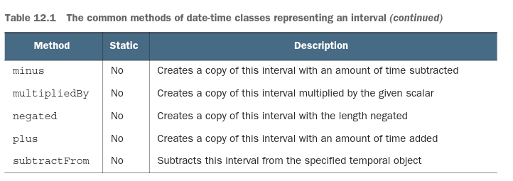
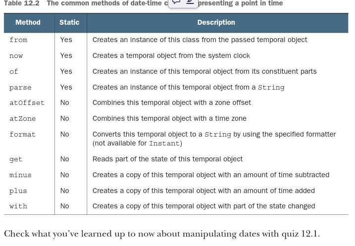
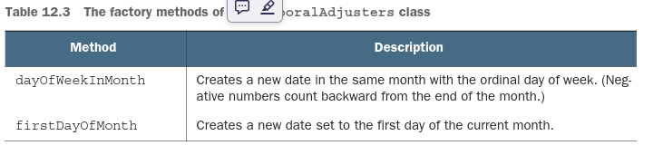
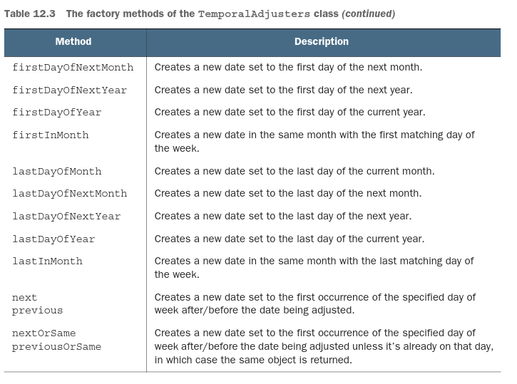
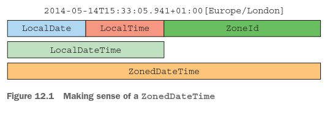

# ***Nueva API de Fecha y Hora*** 

### Este capítulo cubre:
- Por qué necesitábamos una nueva biblioteca de fecha y hora, introducida en Java 8
- Representación de fecha y hora tanto para humanos como para máquinas
- Definición de una cantidad de tiempo
- Manipulación, formateo y análisis de fechas
- Manejo de diferentes zonas horarias y calendarios

Los meses comienzan en el índice 0. Si quisieras representar la fecha de lanzamiento de Java 9, que es el 21 de septiembre
de 2017, tendrías que crear una instancia de Date de la siguiente manera:
```java
Date date = new Date(117, 8, 21);
```
Al imprimir esta fecha se obtiene, para los autores:
```terminaloutput
Thu Sep 21 00:00:00 CET 2017
```
No es muy intuitivo, ¿verdad? Además, incluso el String devuelto por el método toString de la clase Date puede ser 
bastante engañoso. También incluye la zona horaria predeterminada de la JVM, CET, que es la hora de Europa Central en 
nuestro caso. ¡De hecho, la clase Date simplemente inserta la zona horaria predeterminada de la JVM!
Los problemas y limitaciones de la clase Date fueron evidentes de inmediato cuando salió Java 1.0, pero también estaba 
claro que los problemas no podían solucionarse sin romper la compatibilidad hacia atrás. Como consecuencia, en Java 1.1 
muchos métodos de la clase Date fueron depreciados, y la clase fue reemplazada por la clase alternativa java.util.Calendar.
Desafortunadamente, Calendar tiene problemas similares y fallos de diseño que conducen a código propenso a errores. Los
meses también comienzan en el índice 0. (Al menos Calendar eliminó el desplazamiento de 1900 para el año.) Peor aún, la 
presencia de ambas clases Date y Calendar aumenta la confusión entre los desarrolladores. (¿Cuál deberías usar?) Además,
funcionalidades como DateFormat, utilizadas para formatear y analizar fechas u horas de manera independiente del idioma,
solo funcionan con la clase Date.

DateFormat tiene su propio conjunto de problemas. No es seguro para hilos, por ejemplo, lo que significa que si dos hilos
intentan analizar una fecha usando el mismo formateador al mismo tiempo, puedes obtener resultados impredecibles.

Finalmente, tanto Date como Calendar son clases mutables. ¿Qué significa mutar el 21 de septiembre de 2017 al 25 de 
octubre? Esta decisión de diseño puede llevarte a una pesadilla de mantenimiento, como aprenderás en detalle en el 
capítulo 18, que trata sobre programación funcional.
La consecuencia es que todos estos fallos e inconsistencias han fomentado el uso de bibliotecas de terceros para fecha y
hora, como Joda-Time. Por estas razones, Oracle decidió proporcionar soporte de alta calidad para fecha y hora en la API
nativa de Java. Como resultado, Java 8 integra muchas de las funcionalidades de Joda-Time en el paquete java.time.
En este capítulo, exploramos las funcionalidades introducidas por la nueva API de Fecha y Hora. Comenzamos con casos de 
uso básicos como la creación de fechas y horas adecuadas para ser utilizadas tanto por humanos como por máquinas. Luego 
exploramos gradualmente aplicaciones más avanzadas de la nueva API de Fecha y Hora, como manipular, analizar e imprimir 
objetos de fecha y hora, y trabajar con diferentes zonas horarias y calendarios alternativos.

## 12.1 LocalDate, LocalTime, LocalDateTime, Instant, Duration y Period
Comenzamos explorando cómo crear fechas e intervalos simples. El paquete java.time incluye muchas clases nuevas para 
ayudarte: LocalDate, LocalTime, LocalDateTime, Instant, Duration y Period.

### 12.1.1 Trabajando con LocalDate y LocalTime
La clase LocalDate probablemente sea la primera que te encuentres cuando comiences a usar la nueva API de Fecha y Hora.
Una instancia de esta clase es un objeto inmutable que representa una fecha simple sin la hora del día. En particular, 
no contiene ninguna información sobre la zona horaria.
Puedes crear una instancia de LocalDate usando el método de fábrica estático of. Una instancia de LocalDate proporciona 
muchos métodos para leer sus valores más comúnmente utilizados (año, mes, día de la semana, etc.), como se muestra en el
siguiente listado.

Listado 12.1 Creación de un LocalDate y lectura de sus valores:
```java
LocalDate date = LocalDate.of(2017, 9, 21);
int year = date.getYear();
Month month = date.getMonth();
int day = date.getDayOfMonth();
DayOfWeek dow = date.getDayOfWeek();
int len = date.lengthOfMonth();
boolean leap = date.isLeapYear();
```
También es posible obtener la fecha actual del reloj del sistema usando el método de fábrica now:
```java
LocalDate today = LocalDate.now();
```
Todas las demás clases de fecha y hora que investigamos en el resto de este capítulo proporcionan un método de fábrica 
similar. También puedes acceder a la misma información pasando un TemporalField al método get. La interfaz TemporalField 
define cómo acceder al valor de un campo específico de un objeto temporal. La enumeración ChronoField implementa esta 
interfaz, por lo que puedes usar convenientemente un elemento de esa enumeración con el método get, como se muestra en el
siguiente listado.

Listado 12.2 Lectura de valores de LocalDate usando un TemporalField:
```java
int year = date.get(ChronoField.YEAR);
int month = date.get(ChronoField.MONTH_OF_YEAR);
int day = date.get(ChronoField.DAY_OF_MONTH);
```
Puedes crear tanto LocalDate como LocalTime analizando un String que los represente. Para lograr esto, usa sus métodos 
estáticos parse:
```java
LocalDate date = LocalDate.parse("2017-09-21");
LocalTime time = LocalTime.parse("13:45:20");
```
Es posible pasar un DateTimeFormatter al método parse. Una instancia de esta clase especifica cómo formatear un objeto 
de fecha y/o hora. Está diseñado para ser un reemplazo del antiguo java.util.DateFormat que mencionamos anteriormente. 
Mostramos con más detalle cómo puedes usar un DateTimeFormatter en la sección 12.2.2. También ten en cuenta que ambos 
métodos parse lanzan una DateTimeParseException, que extiende RuntimeException en caso de que el argumento String no 
pueda analizarse como un LocalDate o LocalTime válido.

### 12.1.2 Combinando una fecha y una hora
La clase compuesta llamada LocalDateTime empareja un LocalDate y un LocalTime. Representa tanto una fecha como una hora 
sin zona horaria y puede crearse directamente o combinando una fecha y una hora, como se muestra en el siguiente listado.

Listado 12.4 Creación de un LocalDateTime directamente o combinando una fecha y una hora:
```java
// 2017-09-21T13:45:20
LocalDateTime dt1 = LocalDateTime.of(2017, Month.SEPTEMBER, 21, 13, 45, 20);
LocalDateTime dt2 = LocalDateTime.of(date, time);
LocalDateTime dt3 = date.atTime(13, 45, 20);
LocalDateTime dt4 = date.atTime(time);
LocalDateTime dt5 = time.atDate(date);
```
Ten en cuenta que es posible crear un LocalDateTime pasando una hora a un LocalDate o una fecha a un LocalTime, usando 
sus métodos atTime o atDate, respectivamente. También puedes extraer el componente LocalDate o LocalTime de un 
LocalDateTime usando los métodos toLocalDate y toLocalTime.
```java
LocalDate date1 = dt1.toLocalDate(); //2017-09-21
LocalTime time1 = dt1.toLocalTime(); //13:45:20
```
### 12.1.3 Instant: una fecha y hora para máquinas
Como humanos, estamos acostumbrados a pensar en fechas y horas en términos de semanas, días, horas y minutos. Sin 
embargo, esta representación no es fácil de manejar para una computadora. Desde el punto de vista de una máquina, el 
formato más natural para modelar el tiempo es un único número grande que representa un punto en una línea de tiempo 
continua. Este enfoque es utilizado por la nueva clase java.time.Instant, que representa el número de segundos 
transcurridos desde la época de Unix, establecida por convención a la medianoche del 1 de enero de 1970 UTC.
Puedes crear una instancia de esta clase pasando el número de segundos a su método de fábrica estático ofEpochSecond. 
Además, la clase Instant admite precisión de nanosegundos. Una versión sobrecargada adicional del método de fábrica 
estático ofEpochSecond acepta un segundo argumento que es un ajuste de nanosegundos al número de segundos pasado. Esta 
versión sobrecargada ajusta el argumento de nanosegundos, asegurando que la fracción de nanosegundos almacenada esté 
entre 0 y 999,999,999. Como resultado, las siguientes invocaciones del método de fábrica ofEpochSecond devuelven 
exactamente el mismo Instant:
```java
Instant.ofEpochSecond(3);
Instant.ofEpochSecond(3, 0);
Instant.ofEpochSecond(2, 1_000_000_000); //1.000.000.000 de nanosegundos (1 segundo) después de 2 segundos
Instant.ofEpochSecond(4, -1_000_000_000); //1.000.000.000 de nanosegundos (1 segundo) antes de 4 segundos
```
Como ya has visto para LocalDate y las otras clases de fecha y hora legibles para humanos, la clase Instant soporta otro
método de fábrica estático llamado now, que te permite capturar una marca de tiempo del momento actual. Es importante 
reforzar que un Instant está diseñado para ser usado solo por una máquina. Consiste en un número de segundos y 
nanosegundos. Como consecuencia, no proporciona ninguna capacidad para manejar unidades de tiempo que sean significativas
para los humanos. Una declaración como
```java
int day = Instant.now().get(ChronoField.DAY_OF_MONTH);
```
lanza una excepción como esta:
```java
java.time.temporal.UnsupportedTemporalTypeException: Unsupported field: DayOfMonth
```
Pero puedes trabajar con Instant usando las clases Duration y Period, que veremos a continuación.

### 12.1.4 Definiendo una Duration o un Periodo
Todas las clases que has visto hasta ahora implementan la interfaz Temporal, que define cómo leer y manipular los valores
de un objeto que modela un punto genérico en el tiempo. Te hemos mostrado algunas formas de crear diferentes instancias 
de Temporal. El siguiente paso natural es crear una duración entre dos objetos temporales. El método de fábrica estático
between.

El método between de la clase Duration sirve exactamente para este propósito. Puedes crear una duración entre dos 
LocalTime, dos LocalDateTime o dos Instant de la siguiente manera:
```java
Duration d1 = Duration.between(time1, time2);
Duration d1 = Duration.between(dateTime1, dateTime2);
Duration d2 = Duration.between(instant1, instant2);
```
Debido a que LocalDateTime e Instant están hechos para diferentes propósitos (uno para ser usado por humanos y el otro 
por máquinas), no se permite mezclarlos. Si intentas crear una duración entre ellos, solo obtendrás una DateTimeException.
Además, como la clase Duration se usa para representar una cantidad de tiempo medida en segundos y eventualmente 
nanosegundos, no puedes pasar un LocalDate al método between.
Cuando necesitas modelar una cantidad de tiempo en términos de años, meses y días, puedes usar la clase Period. Puedes 
encontrar la diferencia entre dos LocalDate con el método de fábrica between de esa clase:
```java
Period tenDays = Period.between(LocalDate.of(2017, 9, 11),
LocalDate.of(2017, 9, 21));
```
Finalmente, las clases Duration y Period tienen otros métodos de fábrica convenientes para crear instancias de ellas 
directamente, sin definirlas como la diferencia entre dos objetos temporales, como se muestra en el siguiente listado.

Listado 12.5 Creación de Duraciones y Periodos:
```java
Duration threeMinutes = Duration.ofMinutes(3);
Duration threeMinutes = Duration.of(3, ChronoUnit.MINUTES);
Period tenDays = Period.ofDays(10);
Period threeWeeks = Period.ofWeeks(3);
Period twoYearsSixMonthsOneDay = Period.of(2, 6, 1);
```
Las clases Duration y Period comparten muchos métodos similares, que la tabla 12.1 enumera.




Todas las clases que hemos investigado hasta ahora son inmutables, lo cual es una excelente decisión de diseño para 
permitir un estilo de programación más funcional, garantizar la seguridad en concurrencia y preservar la consistencia del
modelo de dominio. No obstante, la nueva API de Fecha y Hora ofrece algunos métodos prácticos para crear versiones 
modificadas de esos objetos. Puede que quieras agregar tres días a una instancia existente de LocalDate, por ejemplo, y 
exploramos cómo hacerlo en la siguiente sección. Además, exploramos cómo crear un formateador de fecha-hora a partir de 
un patrón dado, como dd/MM/yyyy, o incluso programáticamente, así como también cómo usar este formateador tanto para 
analizar (parsear) como para imprimir una fecha.

## 12.2 Manipulación, análisis (parsing) y formateo de fechas
La forma más inmediata y sencilla de crear una versión modificada de un LocalDate existente es cambiar uno de sus 
atributos, usando uno de sus métodos withAttribute. Ten en cuenta que todos los métodos devuelven un nuevo objeto con el
atributo modificado, como se muestra en el listado 12.6; ¡no mutan el objeto existente!

Listado 12.6 Manipulación absoluta de los atributos de un LocalDate:
```java
LocalDate date1 = LocalDate.of(2017, 9, 21);
LocalDate date2 = date1.withYear(2011);
LocalDate date3 = date2.withDayOfMonth(25);
LocalDate date4 = date3.with(ChronoField.MONTH_OF_YEAR, 2);
```
Puedes hacer lo mismo con el método genérico with, que toma un TemporalField como primer argumento, como en la última 
sentencia del listado 12.6. Este último método with es el complemento del método get usado en el listado 12.2. Ambos 
métodos están declarados en la interfaz Temporal implementada por todas las clases de la API de Fecha y Hora, como 
LocalDate, LocalTime, LocalDateTime e Instant. Más precisamente, los métodos get y with te permiten leer y modificar 
respectivamente los campos de un objeto Temporal. Lanzan una UnsupportedTemporalTypeException si el campo solicitado
no es soportado por el Temporal específico, como un ChronoField.MONTH_OF_YEAR en un Instant o un 
ChronoField.NANO_OF_SECOND en un LocalDate.
Incluso es posible manipular un LocalDate de manera declarativa. Puedes sumar o restar una cantidad de tiempo dada, por 
ejemplo, como se muestra en el listado 12.7.

Listado 12.7 Manipulación relativa de los atributos de un LocalDate:
```java
LocalDate date1 = LocalDate.of(2017, 9, 21);
LocalDate date2 = date1.plusWeeks(1);
LocalDate date3 = date2.minusYears(6);
LocalDate date4 = date3.plus(6, ChronoUnit.MONTHS);
```
De manera similar a lo que hemos explicado sobre los métodos with y get, el método genérico plus usado en la última 
sentencia del listado 12.7, junto con el método análogo minus, está declarado en la interfaz Temporal. Estos métodos te 
permiten mover un Temporal hacia adelante o hacia atrás una cantidad de tiempo determinada, definida por un número más 
una TemporalUnit, donde la enumeración ChronoUnit ofrece una implementación conveniente de la interfaz TemporalUnit.
Como habrás anticipado, todas las clases de fecha-hora que representan un punto en el tiempo, como LocalDate, LocalTime,
LocalDateTime e Instant, tienen muchos métodos en común. La tabla 12.2 resume estos métodos.



### Cuestionario 12.1: Manipulación de un LocalDate
¿Cuál será el valor de la variable date después de las siguientes manipulaciones?
```java
LocalDate date = LocalDate.of(2014, 3, 18);
date = date.with(ChronoField.MONTH_OF_YEAR, 9);
date = date.plusYears(2).minusDays(10);
date.withYear(2011);
```
### Respuesta:
2016-09-08
Como has visto, puedes manipular la fecha tanto de forma absoluta como de forma relativa. También puedes concatenar 
varias manipulaciones en una sola sentencia, porque cada cambio crea un nuevo objeto LocalDate, y la invocación s
ubsiguiente manipula el objeto creado por la anterior. Finalmente, la última sentencia en este fragmento de código no 
tiene ningún efecto observable porque, como es habitual, crea una nueva instancia de LocalDate, pero no estamos asignando
este nuevo valor a ninguna variable.

### 12.2.1 Trabajando con TemporalAdjusters
Todas las manipulaciones de fechas que has visto hasta ahora son relativamente sencillas. Sin embargo, a veces necesitas
realizar operaciones avanzadas, como ajustar una fecha al próximo domingo, al siguiente día hábil o al último día del 
mes. En tales casos, puedes pasarle a una versión sobrecargada del método with un TemporalAdjuster que proporciona una 
forma más personalizable de definir la manipulación necesaria para operar sobre una fecha específica. La API de Fecha y 
Hora ya proporciona muchos TemporalAdjusters predefinidos para los casos de uso más comunes. Puedes acceder a ellos 
mediante los métodos fábrica estáticos contenidos en la clase TemporalAdjusters, como se muestra en el listado 12.8.

Listado 12.8 Uso de los TemporalAdjusters predefinidos:
```java
import static java.time.temporal.TemporalAdjusters.*;
LocalDate date1 = LocalDate.of(2014, 3, 18);
LocalDate date2 = date1.with(nextOrSame(DayOfWeek.SUNDAY));
LocalDate date3 = date2.with(lastDayOfMonth());
```
La tabla 12.3 enumera los TemporalAdjusters que puedes crear con estos métodos fábrica.





Como puedes ver, los TemporalAdjusters te permiten realizar manipulaciones de fechas más complejas que siguen leyéndose 
como el enunciado del problema. Además, es relativamente sencillo crear tu propia implementación personalizada de 
TemporalAdjuster si no encuentras un TemporalAdjuster predefinido que se ajuste a tus necesidades. De hecho, la interfaz 
TemporalAdjuster declara solo un único método (lo que la convierte en una interfaz funcional), definido como se muestra 
en el siguiente listado.

Listado 12.9 La interfaz TemporalAdjuster:
```java
@FunctionalInterface
public interface TemporalAdjuster {
Temporal adjustInto(Temporal temporal);
}
```
Este ejemplo significa que una implementación de la interfaz TemporalAdjuster define cómo convertir un objeto Temporal 
en otro Temporal. Puedes pensar en un TemporalAdjuster como si fuera un UnaryOperator<Temporal>. Tómate unos minutos para
practicar lo que has aprendido hasta ahora e implementa tu propio TemporalAdjuster en el cuestionario 12.2.

### Cuestionario 12.2: Implementación de un TemporalAdjuster personalizado
Desarrolla una clase llamada NextWorkingDay que implemente la interfaz TemporalAdjuster y que avance una fecha un día 
hacia adelante pero saltándose los sábados y domingos. Usando:
```java
date = date.with(new NextWorkingDay());
```
debería mover la fecha al día siguiente, si ese día está entre lunes y viernes, pero al siguiente lunes si es sábado o 
domingo.

### Respuesta:
Puedes implementar el adjuster NextWorkingDay de la siguiente manera:
```java
public class NextWorkingDay implements TemporalAdjuster {
    @Override
    public Temporal adjustInto(Temporal temporal) {
        DayOfWeek dow =
                DayOfWeek.of(temporal.get(ChronoField.DAY_OF_WEEK)); //Lee el día actual.
        int dayToAdd = 1; //Normalmente suma un día.
        if (dow == DayOfWeek.FRIDAY) dayToAdd = 3;//Pero suma tres días si hoy es viernes.
        else if (dow == DayOfWeek.SATURDAY) dayToAdd = 2;//Suma dos días si hoy es sábado.
        return temporal.plus(dayToAdd, ChronoUnit.DAYS);//Devuelve la fecha modificada sumando el número correcto de días.
    }
}
```
Este TemporalAdjuster normalmente mueve una fecha un día hacia adelante, excepto cuando hoy es viernes o sábado, en cuyo
caso adelanta la fecha tres o dos días, respectivamente. Ten en cuenta que, como TemporalAdjuster es una interfaz 
funcional, podrías pasar el comportamiento de este adjuster en una expresión lambda:
```java
date = date.with(temporal ->{
DayOfWeek dow =
        DayOfWeek.of(temporal.get(ChronoField.DAY_OF_WEEK));
int dayToAdd = 1;
if(dow ==DayOfWeek.FRIDAY)dayToAdd =3;
        else if(dow ==DayOfWeek.SATURDAY)dayToAdd =2;
        return temporal.

plus(dayToAdd, ChronoUnit.DAYS);
});
```
Es probable que quieras aplicar esta manipulación a una fecha en varios puntos de tu código, y por esta razón, sugerimos 
encapsular su lógica en una clase adecuada, como hicimos aquí. Haz lo mismo con todas las manipulaciones que uses con 
frecuencia. Terminarás con una pequeña biblioteca de adjusters que tú y tu equipo podrán reutilizar fácilmente en su base
de código.
Si quieres definir el TemporalAdjuster con una expresión lambda, es preferible hacerlo usando el método fábrica estático 
ofDateAdjuster de la clase TemporalAdjusters, el cual acepta un UnaryOperator<LocalDate> de la siguiente manera:
```java
TemporalAdjuster nextWorkingDay = TemporalAdjusters.ofDateAdjuster(
temporal -> {
DayOfWeek dow =
DayOfWeek.of(temporal.get(ChronoField.DAY_OF_WEEK));
int dayToAdd = 1;
if (dow == DayOfWeek.FRIDAY) dayToAdd = 3;
else if (dow == DayOfWeek.SATURDAY) dayToAdd = 2;
return temporal.plus(dayToAdd, ChronoUnit.DAYS);
});
date = date.with(nextWorkingDay);
```
Otra operación común que quizás quieras realizar sobre tus objetos de fecha y hora es imprimirlos en diferentes formatos
específicos para tu dominio de negocio. Del mismo modo, puede que quieras convertir cadenas (Strings) que representan 
fechas en esos formatos a objetos de fecha reales. En la siguiente sección, demostramos los mecanismos proporcionados por
la nueva API de Fecha y Hora para llevar a cabo estas tareas.

### 12.2.2 Impresión y análisis (parsing) de objetos fecha-hora
El formateo y el análisis (parsing) son otras características relevantes para trabajar con fechas y horas. El nuevo 
paquete java.time.format está dedicado a estos fines. La clase más importante de este paquete es DateTimeFormatter. La 
forma más sencilla de crear un formateador es a través de sus métodos fábrica estáticos y constantes. Las constantes como
BASIC_ISO_DATE e ISO_LOCAL_DATE son instancias predefinidas de la clase DateTimeFormatter. Puedes usar todos los 
DateTimeFormatters para crear una cadena (String) que represente una fecha u hora determinada en un formato específico. 
Aquí, por ejemplo, producimos una cadena usando dos formateadores diferentes:
```java
LocalDate date = LocalDate.of(2014, 3, 18);
String s1 = date.format(DateTimeFormatter.BASIC_ISO_DATE);
String s2 = date.format(DateTimeFormatter.ISO_LOCAL_DATE);
```
En comparación con la antigua clase java.util.DateFormat, todas las instancias de DateTimeFormatter son thread-safe. Por
lo tanto, puedes crear formateadores singleton como los definidos por las constantes de DateTimeFormatter y compartirlos 
entre múltiples hilos. El siguiente listado muestra cómo la clase DateTimeFormatter también soporta un método fábrica 
estático que te permite crear un formateador a partir de un patrón específico.

Listado 12.10 Creación de un DateTimeFormatter a partir de un patrón:
```java
DateTimeFormatter formatter = DateTimeFormatter.ofPattern("dd/MM/yyyy");
LocalDate date1 = LocalDate.of(2014, 3, 18);
String formattedDate = date1.format(formatter);
LocalDate date2 = LocalDate.parse(formattedDate, formatter);
```
Aquí, el método format de LocalDate produce una cadena (String) que representa la fecha con el patrón solicitado. A 
continuación, el método estático parse recrea la misma fecha analizando (parsing) la cadena generada, usando el mismo 
formateador. El método ofPattern también tiene una versión sobrecargada que te permite crear un formateador para un 
Locale determinado, como se muestra en el siguiente listado.

Listado 12.11 Creación de un DateTimeFormatter localizado:
```java
DateTimeFormatter italianFormatter =
DateTimeFormatter.ofPattern("d. MMMM yyyy", Locale.ITALIAN);
LocalDate date1 = LocalDate.of(2014, 3, 18);
String formattedDate = date.format(italianFormatter); // 18. marzo 2014
LocalDate date2 = LocalDate.parse(formattedDate, italianFormatter);
```
Finalmente, en caso de que necesites aún más control, la clase DateTimeFormatterBuilder te permite definir formateadores 
complejos paso a paso usando métodos significativos. Además, te proporciona la capacidad de tener análisis (parsing) sin
distinción entre mayúsculas y minúsculas, análisis permisivo (que permite al parser usar heurísticas para interpretar 
entradas que no coinciden exactamente con el formato especificado), relleno (padding) y secciones opcionales del 
formateador. Puedes construir programáticamente el mismo italianFormatter que usamos en el listado 12.11 a través del 
DateTimeFormatterBuilder, por ejemplo, como se muestra en el siguiente listado.

Listado 12.12 Construcción de un DateTimeFormatter:
```java
DateTimeFormatter italianFormatter = new DateTimeFormatterBuilder()
.appendText(ChronoField.DAY_OF_MONTH)
.appendLiteral(". ")
.appendText(ChronoField.MONTH_OF_YEAR)
.appendLiteral(" ")
.appendText(ChronoField.YEAR)
.parseCaseInsensitive()
.toFormatter(Locale.ITALIAN);
```
Hasta ahora, has aprendido cómo crear, manipular, formatear y analizar (parsear) tanto puntos en el tiempo como 
intervalos, pero no has visto cómo manejar las sutilezas que involucran las fechas y la hora. Puede que necesites lidiar
con diferentes zonas horarias o sistemas de calendario alternativos. En las siguientes secciones, exploramos estos temas
usando la nueva API de Fecha y Hora.

## 12.3 Trabajando con diferentes zonas horarias y calendarios
Ninguna de las clases que has visto hasta ahora contiene información sobre zonas horarias. Lidiar con zonas horarias es 
otro tema importante que ha sido enormemente simplificado por la nueva API de Fecha y Hora. La nueva clase 
java.time.ZoneId es el reemplazo de la antigua clase java.util.TimeZone. Su objetivo es protegerte mejor de las 
complejidades relacionadas con las zonas horarias, como el manejo del horario de verano (DST). Al igual que las otras 
clases de la API de Fecha y Hora, es inmutable.

### 12.3.1 Uso de zonas horarias
Una zona horaria es un conjunto de reglas correspondientes a una región en la que la hora estándar es la misma. Alrededor
de 40 zonas horarias están contenidas en instancias de la clase ZoneRules. Puedes llamar a getRules() en un ZoneId para 
obtener las reglas de esa zona horaria. Un ZoneId específico se identifica mediante un ID de región, como en este ejemplo:
```java
ZoneId romeZone = ZoneId.of("Europe/Rome");
```
Todos los ID de región tienen el formato "{área}/{ciudad}", y el conjunto de ubicaciones disponibles es el proporcionado
por la Base de Datos de Zonas Horarias de la Internet Assigned Numbers Authority (IANA) 
(ver https://www.iana.org/time-zones). También puedes convertir un objeto TimeZone antiguo a un ZoneId usando el nuevo 
método toZoneId:
```java
ZoneId zoneId = TimeZone.getDefault().toZoneId();
```
Cuando tienes un objeto ZoneId, puedes combinarlo con un LocalDate, un LocalDateTime o un Instant para transformarlo en 
instancias de ZonedDateTime, las cuales representan puntos en el tiempo relativos a la zona horaria especificada, como 
se muestra en el siguiente listado.

Listado 12.13 Aplicación de una zona horaria a un punto en el tiempo:
```java
LocalDate date = LocalDate.of(2014, Month.MARCH, 18);
ZonedDateTime zdt1 = date.atStartOfDay(romeZone);
LocalDateTime dateTime = LocalDateTime.of(2014, Month.MARCH, 18, 13, 45);
ZonedDateTime zdt2 = dateTime.atZone(romeZone);
Instant instant = Instant.now();
ZonedDateTime zdt3 = instant.atZone(romeZone);
```

La figura 12.1 ilustra los componentes de un ZonedDateTime para ayudarte a entender las diferencias entre LocalDate, 
LocalTime, LocalDateTime y ZoneId.



También puedes convertir un LocalDateTime a un Instant usando un ZoneId:
```java
LocalDateTime dateTime = LocalDateTime.of(2014, Month.MARCH, 18, 13, 45);
Instant instantFromDateTime = dateTime.toInstant(romeZone);
```
O puedes hacerlo al revés:
```java
Instant instant = Instant.now();
LocalDateTime timeFromInstant = LocalDateTime.ofInstant(instant, romeZone);
```
Ten en cuenta que trabajar con Instant es bastante útil porque a menudo tienes que trabajar con código heredado que 
utiliza la clase Date. Allí, se agregaron dos métodos para ayudar a la interoperación entre la API obsoleta y la nueva 
API de Fecha y Hora: toInstant() y el método estático fromInstant().

### 12.3.2 Offset fijo desde UTC/Greenwich
Otra forma común de expresar una zona horaria es usar un offset fijo desde UTC/Greenwich. Puedes usar esta notación para 
decir, "Nueva York está cinco horas detrás de Londres", por ejemplo. En casos como este, puedes usar la clase ZoneOffset,
una subclase de ZoneId que representa la diferencia entre una hora y el meridiano cero de Greenwich, Londres, de la 
siguiente manera:
```java
ZoneOffset newYorkOffset = ZoneOffset.of("-05:00");
```
El offset -05:00 efectivamente corresponde a la Hora Estándar del Este de EE.UU. Ten en cuenta, sin embargo, que un 
ZoneOffset definido de esta manera no tiene ninguna gestión del horario de verano (DST), y por esta razón, no se 
recomienda en la mayoría de los casos. Debido a que un ZoneOffset también es un ZoneId, puedes usarlo como se muestra en
el listado 12.13 anteriormente en este capítulo. También puedes crear un OffsetDateTime, que representa una fecha-hora 
con un offset desde UTC/Greenwich en el sistema de calendario ISO-8601:
```java
LocalDateTime dateTime = LocalDateTime.of(2014, Month.MARCH, 18, 13, 45);
OffsetDateTime dateTimeInNewYork = OffsetDateTime.of(date, newYorkOffset);
```
Otra característica avanzada soportada por la nueva API de Fecha y Hora es el soporte para sistemas de calendario no ISO.

### 12.3.3 Uso de sistemas de calendario alternativos
El sistema de calendario ISO-8601 es el sistema de calendario civil mundial de facto. Pero se proporcionan cuatro 
sistemas de calendario adicionales en Java 8. Cada uno de estos sistemas de calendario tiene una clase de fecha 
dedicada: ThaiBuddhistDate, MinguoDate, JapaneseDate y HijrahDate. Todas estas clases, junto con LocalDate, implementan 
la interfaz ChronoLocalDate, que está diseñada para modelar una fecha en una cronología arbitraria. Puedes crear una 
instancia de una de estas clases a partir de un LocalDate. Más generalmente, puedes crear cualquier otra instancia de 
Temporal usando sus métodos fábrica estáticos from de la siguiente manera:
```java
LocalDate date = LocalDate.of(2014, Month.MARCH, 18);
JapaneseDate japaneseDate = JapaneseDate.from(date);
```
Alternativamente, puedes crear explícitamente un sistema de calendario para un Locale específico y crear una instancia 
de una fecha para ese Locale. En la nueva API de Fecha y Hora, la interfaz Chronology modela un sistema de calendario, y
puedes obtener una instancia de ella usando su método fábrica estático ofLocale:
```java
Chronology japaneseChronology = Chronology.ofLocale(Locale.JAPAN);
ChronoLocalDate now = japaneseChronology.dateNow();
```
Los diseñadores de la API de Fecha y Hora recomiendan usar LocalDate en lugar de ChronoLocalDate en la mayoría de los 
casos, porque un desarrollador podría hacer suposiciones en su código que desafortunadamente no son ciertas en un sistema
multicalendario. Tales suposiciones podrían incluir creer que el valor de un día o mes nunca será mayor a 31, que un año
contiene 12 meses, o incluso que un año tiene un número fijo de meses. Por estas razones, recomendamos usar LocalDate en
toda tu aplicación, incluyendo todo el almacenamiento, manipulación e interpretación de reglas de negocio, mientras que
deberías emplear ChronoLocalDate solo cuando necesites localizar la entrada o salida de tu programa.

### Calendaro Islamico
De los nuevos calendarios agregados a Java 8, el HijrahDate (calendario Islámico) parece ser el más complejo porque puede
tener variantes. El sistema de calendario Hijrah está basado en meses lunares. Existe una variedad de métodos para 
determinar un nuevo mes, como una luna nueva que podría ser visible en cualquier lugar del mundo o que debe ser visible 
primero en Arabia Saudita. El método withVariant se usa para elegir la variante deseada. Java 8 incluye la variante Umm 
Al-Qura para HijrahDate como estándar.
El siguiente código ilustra un ejemplo de cómo mostrar las fechas de inicio y fin del Ramadán para el año Islámico actual
en fecha ISO:

```java
HijrahDate ramadanDate =
HijrahDate.now().with(ChronoField.DAY_OF_MONTH, 1)
.with(ChronoField.MONTH_OF_YEAR, 9); //Obtén la fecha Hijrah actual; luego cámbiala para que tenga el primer día de Ramadán, que es el noveno mes.
System.out.println("Ramadan starts on " +
IsoChronology.INSTANCE.date(ramadanDate) + //IsoChronology.INSTANCE es una instancia estática de la clase IsoChronology.
" and ends on " +
IsoChronology.INSTANCE.date( //Ramadán 1438 comenzó el 26-05-2017 y terminó el 24-06-2017.
ramadanDate.with(
TemporalAdjusters.lastDayOfMonth())));
```

### Resumen
- La antigua clase java.util.Date y todas las demás clases utilizadas para modelar fechas y horas en Java antes de 
Java 8 tienen muchas inconsistencias y defectos de diseño, incluyendo mutabilidad y algunos offsets, valores 
predeterminados y nombres mal elegidos.
- Todos los objetos fecha-hora de la nueva API de Fecha y Hora son inmutables.
- Esta nueva API proporciona dos representaciones de tiempo diferentes para gestionar las distintas necesidades de 
humanos y máquinas al operar sobre él.
- Puedes manipular objetos de fecha y hora tanto de forma absoluta como relativa, y el resultado de estas manipulaciones
es siempre una nueva instancia, dejando la original sin cambios.
- Los TemporalAdjusters te permiten manipular una fecha de una manera más compleja que cambiar uno de sus valores, y 
puedes definir y usar tus propias transformaciones de fecha personalizadas.
- Puedes definir un formateador para imprimir y analizar (parsear) objetos fecha-hora en un formato específico. Estos 
formateadores pueden crearse a partir de un patrón o programáticamente, y todos son thread-safe.
- Puedes representar una zona horaria, relativa a una región/ubicación específica y como un offset fijo desde 
UTC/Greenwich, y aplicarla a un objeto fecha-hora para localizarlo.
- Puedes usar sistemas de calendario diferentes al sistema estándar ISO-8601.