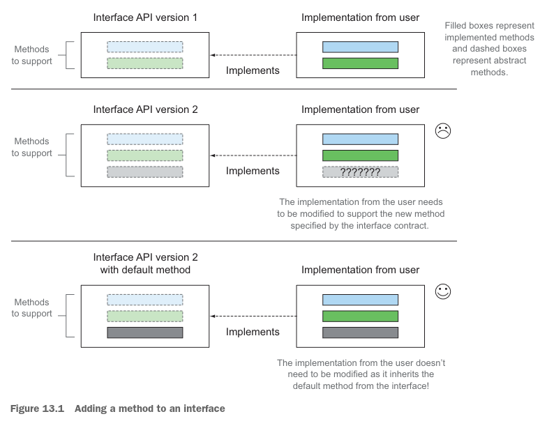
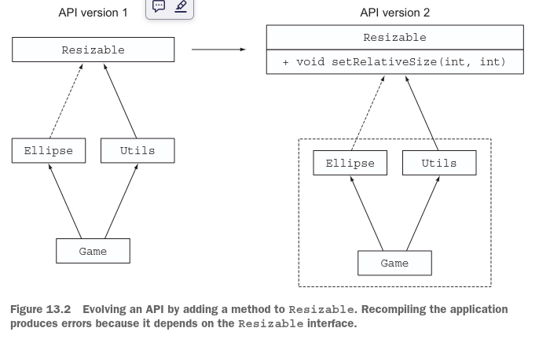
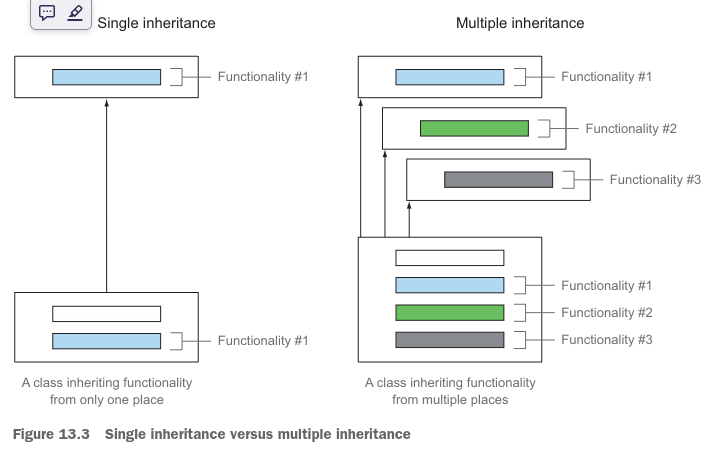
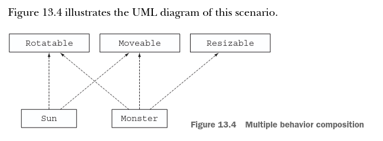
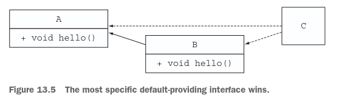
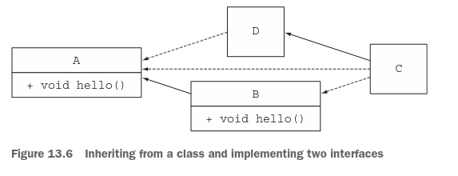
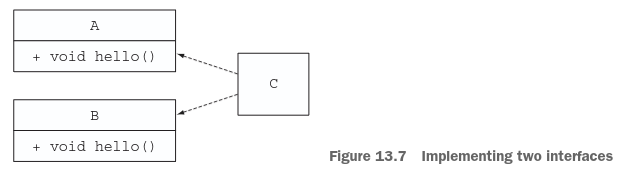
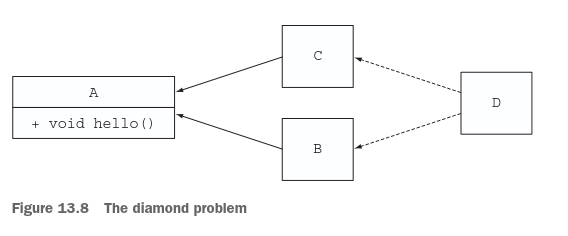

# ***Metodos por Defecto***

### Este capítulo cubre:
- Qué son los métodos default (por defecto)
- Evolución de APIs de manera compatible
- Patrones de uso para métodos default
- Reglas de resolución

Tradicionalmente, una interfaz de Java agrupa métodos relacionados en un contrato. Cualquier clase (no abstracta) que 
implemente una interfaz debe proporcionar una implementación para cada método definido por la interfaz o heredar la 
implementación de una superclase. Pero este requisito causa un problema cuando los diseñadores de bibliotecas necesitan 
actualizar una interfaz para agregar un nuevo método. De hecho, las clases concretas existentes (que pueden no estar bajo
el control de los diseñadores de la interfaz) necesitan ser modificadas para reflejar el nuevo contrato de la interfaz. 
Esta situación es particularmente problemática porque la API de Java 8 introduce muchos métodos nuevos en interfaces 
existentes, como el método sort en la interfaz List que usaste en capítulos anteriores. ¡Imagina a todos los mantenedores
enfadados de frameworks de colecciones alternativos como Guava y Apache Commons que ahora necesitan modificar todas las 
clases que implementan la interfaz List para proporcionar también una implementación para el método sort!

Pero no te preocupes. Java 8 introdujo un nuevo mecanismo para abordar este problema. Puede sonar sorprendente, pero 
desde Java 8 las interfaces pueden declarar métodos con código de implementación de dos maneras. Primero, Java 8 permitió
métodos estáticos dentro de las interfaces. Segundo, Java 8 introdujo una nueva característica llamada métodos default 
(por defecto) que te permite proporcionar una implementación por defecto para métodos en una interfaz. En otras palabras,
las interfaces ahora pueden proporcionar implementación concreta para métodos. Como resultado, las clases existentes que
implementan una interfaz heredan automáticamente las implementaciones por defecto si no proporcionan una explícitamente,
lo que te permite evolucionar las interfaces de forma no intrusiva. Has estado usando varios métodos default todo el 
tiempo. Dos ejemplos que has visto son sort en la interfaz List y stream en la interfaz Collection.
El método sort en la interfaz List, que viste en el capítulo 1, es nuevo en Java 8 y se define de la siguiente manera:
```java
default void sort(Comparator<? super E> c) {
    Collections.sort(this, c);
}
```
Observa el nuevo modificador default antes del tipo de retorno. Este modificador es la forma de identificar que un método
es un método predeterminado. Aquí, el método sort llama al método Collections.sort para realizar la ordenación. Gracias 
a este nuevo método, puedes ordenar una lista llamando al método directamente:
```java
List<Integer> numbers = Arrays.asList(3, 5, 1, 2, 6);
numbers.sort(Comparator.naturalOrder()); //sort es un metodo predeterminado en la interfaz List
```
Algo más es nuevo en este código. Observa que llamas al método Comparator.naturalOrder. Este nuevo método estático en la 
interfaz Comparator devuelve un objeto Comparator para ordenar los elementos en orden natural (la ordenación alfanumérica
estándar). El método stream en Collection que viste en el capítulo 4 se ve así:
```java
default Stream<E> stream() {
    return StreamSupport.stream(spliterator(), false);
}
```
Aquí, el método stream, que usaste extensivamente en capítulos anteriores para procesar colecciones, llama al método 
StreamSupport.stream para devolver un stream. Observa cómo el cuerpo del método stream llama al método spliterator, que
también es un método predeterminado de la interfaz Collection.
¡Vaya! ¿Son las interfaces como clases abstractas ahora? Sí y no; hay diferencias fundamentales, que explicamos en este 
capítulo. Más importante aún, ¿por qué deberían importarte los métodos predeterminados? Los principales usuarios de los 
métodos predeterminados son los diseñadores de bibliotecas. Como explicaremos más adelante, los métodos predeterminados 
se introdujeron para evolucionar bibliotecas como la API de Java de manera compatible, como se ilustra en la figura 13.1.
En pocas palabras, agregar un método a una interfaz es la fuente de muchos problemas; las clases existentes que 
implementan la interfaz necesitan modificarse para proporcionar una implementación del método. Si tienes control sobre 
la interfaz y todas sus implementaciones, la situación no es tan grave. Pero este no suele ser el caso, y esto 
proporciona la motivación para los métodos predeterminados, que permiten que las clases hereden automáticamente una 
implementación predeterminada de una interfaz.
Si eres un diseñador de bibliotecas, este capítulo es importante porque los métodos predeterminados proporcionan un 
medio para evolucionar interfaces sin modificar las implementaciones existentes. Además, como explicamos más adelante en
el capítulo, los métodos predeterminados pueden ayudar a estructurar tus programas proporcionando un mecanismo flexible 
para la herencia múltiple de comportamiento; una clase puede heredar métodos predeterminados de varias interfaces. Por 
lo tanto, puede que aún te interese conocer los métodos predeterminados incluso si no eres un diseñador de bibliotecas.



### Métodos estáticos e interfaces
Un patrón común en Java es definir tanto una interfaz como una clase utilitaria acompañante que define muchos métodos 
estáticos para trabajar con instancias de la interfaz. Collections es una clase acompañante para tratar con objetos 
Collection, por ejemplo. Ahora que los métodos estáticos pueden existir dentro de las interfaces, dichas clases 
utilitarias en tu código pueden desaparecer y sus métodos estáticos pueden trasladarse al interior de una interfaz. Estas
clases acompañantes se mantienen en la API de Java para preservar la compatibilidad hacia atrás.
El capítulo está estructurado de la siguiente manera. Primero, te guiamos a través de un caso de uso de evolución de una
API y los problemas que pueden surgir. Luego explicamos qué son los métodos predeterminados y discutimos cómo puedes 
usarlos para abordar los problemas del caso de uso. A continuación, mostramos cómo puedes crear tus propios métodos 
predeterminados para lograr una forma de herencia múltiple en Java. Concluimos con información más técnica sobre cómo el
compilador de Java resuelve posibles ambigüedades cuando una clase hereda varios métodos predeterminados con la misma 
firma.

## 13.1 Evolucionando APIs
Para entender por qué es difícil evolucionar una API una vez que ha sido publicada, supongamos para los fines de esta 
sección que eres el diseñador de una popular librería de dibujo en Java. Tu librería contiene una interfaz Resizable que
define muchos métodos que una forma redimensionable simple debe soportar: setHeight, setWidth, getHeight, getWidth y 
setAbsoluteSize. Además, proporcionas varias implementaciones listas para usar, como Square y Rectangle. Debido a que tu
librería es tan popular, tienes algunos usuarios que han creado sus propias implementaciones interesantes, como Ellipse,
usando tu interfaz Resizable.
Unos meses después de lanzar tu API, te das cuenta de que a Resizable le faltan algunas características. Sería bueno, 
por ejemplo, que la interfaz tuviera un método setRelativeSize que tome como argumento un factor de crecimiento para 
redimensionar una forma. Podrías agregar el método setRelativeSize a Resizable y actualizar tus implementaciones de 
Square y Rectangle. ¡Pero no tan rápido! ¿Qué hay de todos tus usuarios que crearon sus propias implementaciones de la 
interfaz Resizable? Desafortunadamente, no tienes acceso a sus clases que implementan Resizable y no puedes modificarlas.
Este problema es el mismo que enfrentan los diseñadores de librerías de Java cuando necesitan evolucionar la API de Java.
En la siguiente sección, veremos en detalle un ejemplo que muestra las consecuencias de modificar una interfaz que ya ha
sido publicada.

### 13.1.1 Versión 1 de la API
La primera versión de tu interfaz Resizable tiene los siguientes métodos:
```java
public interface Resizable extends Drawable {
    int getWidth();

    int getHeight();

    void setWidth(int width);

    void setHeight(int height);

    void setAbsoluteSize(int width, int height);
}
```
### IMPLEMENTACIÓN DE USUARIO
Uno de tus usuarios más leales decide crear su propia implementación de Resizable llamada Ellipse:
```java
public class Ellipse implements Resizable {}
```
Ha creado un juego que procesa diferentes tipos de formas Resizable (incluyendo su propio Ellipse):
```java
public class Game {
    public static void main(String…args) {
        List<Resizable> resizableShapes =
                Arrays.asList(new Square(), new Rectangle(), new Ellipse()); //Una lista de formas que son redimensionables
        Utils.paint(resizableShapes);
    }
}
public class Utils {
    public static void paint(List<Resizable> l) {
        l.forEach(r -> {
            r.setAbsoluteSize(42, 42);//Llamando al metodo setAbsoluteSize en cada forma
            r.draw();
        });
    }
}
```

### 13.1.2 Versión 2 de la API
Después de que tu librería ha estado en uso durante unos meses, recibes muchas solicitudes para actualizar tus 
implementaciones de Resizable: Square, Rectangle, etc., para que soporten el método setRelativeSize. Presentas la versión
2 de tu API, como se muestra aquí y se ilustra en la figura 13.2:



```java
public interface Resizable {
    int getWidth();

    int getHeight();

    void setWidth(int width);

    void setHeight(int height);

    void setAbsoluteSize(int width, int height);

    void setRelativeSize(int wFactor, int hFactor);//Agregando un nuevo metodo para la versión 2 de la API
}
```
### Problemas para tus Usuarios
Esta actualización de Resizable crea problemas. Primero, la interfaz ahora exige una implementación de setRelativeSize, 
pero la implementación Ellipse que creó tu usuario no implementa el método setRelativeSize. Agregar un nuevo método a una
interfaz es binariamente compatible, lo que significa que las implementaciones de archivos de clase existentes aún se 
ejecutan sin la implementación del nuevo método si no se intenta recompilarlas. En este caso, el juego aún se ejecutará 
(a menos que sea recompilado) a pesar de la adición del método setRelativeSize a la interfaz Resizable. Sin embargo, el 
usuario podría modificar el método Utils.paint en su juego para usar el método setRelativeSize porque el método paint 
espera una lista de objetos Resizable como argumento. Si se pasa un objeto Ellipse, se lanza un error en tiempo de 
ejecución porque el método setRelativeSize no está implementado:
```terminaloutput
Exception in thread "main" java.lang.AbstractMethodError:
lambdasinaction.chap9.Ellipse.setRelativeSize(II)V
```
Segundo, si el usuario intenta reconstruir toda su aplicación (incluyendo Ellipse), obtendrá el siguiente error de 
compilación:
```terminaloutput
lambdasinaction/chap9/Ellipse.java:6: error: Ellipse is not abstract and does
not override abstract method setRelativeSize(int,int) in Resizable
```
En consecuencia, actualizar una API publicada crea incompatibilidades hacia atrás, razón por la cual evolucionar APIs 
existentes, como la API oficial de Colecciones de Java, causa problemas para los usuarios de las APIs. Tienes 
alternativas para evolucionar una API, pero son malas opciones. Podrías crear una versión separada de tu API y mantener 
tanto la versión antigua como la nueva, por ejemplo, pero esta opción es inconveniente por varias razones. Primero, es 
más complejo de mantener para ti como diseñador de la librería. Segundo, tus usuarios podrían tener que usar ambas 
versiones de tu API en la misma base de código, lo que afecta el espacio de memoria y el tiempo de carga porque se 
requieren más archivos de clase para sus proyectos.
En este caso, los métodos predeterminados vienen al rescate. Permiten a los diseñadores de librerías evolucionar APIs 
sin romper el código existente, porque las clases que implementan una interfaz actualizada heredan automáticamente una 
implementación predeterminada.

### Diferentes tipos de compatibilidad: binaria, de fuente y de comportamiento
Existen tres tipos principales de compatibilidad al introducir un cambio en un programa Java: binaria, de fuente y de 
comportamiento (consulta https://blogs.oracle.com/darcy/entry/kinds_of_compatibility). Viste que agregar un método a una
interfaz es binariamente compatible pero resulta en un error de compilador si la clase que implementa la interfaz es 
recompilada. Es bueno conocer los diferentes tipos de compatibilidad, así que en este recuadro los examinamos en detalle.
Compatibilidad binaria significa que los binarios existentes que se ejecutan sin errores continúan enlazándose (lo que 
implica verificación, preparación y resolución) sin error después de introducir un cambio. Agregar un método a una 
interfaz es binariamente compatible, por ejemplo, porque si no es llamado, los métodos existentes de la interfaz aún 
pueden ejecutarse sin problemas.
En su forma más simple, compatibilidad de fuente significa que un programa existente aún se compilará después de 
introducir un cambio. Agregar un método a una interfaz no es compatible a nivel de fuente; las implementaciones 
existentes no se recompilarán porque necesitan implementar el nuevo método.
Finalmente, compatibilidad de comportamiento significa que ejecutar un programa después de un cambio con la misma entrada
produce el mismo comportamiento. Agregar un método a una interfaz es compatible a nivel de comportamiento porque el 
método nunca es llamado en el programa (o es sobrescrito por una implementación).

## 13.2 Métodos predeterminados en pocas palabras
Has visto cómo agregar métodos a una API publicada interrumpe las implementaciones existentes. Los métodos predeterminados
son nuevos en Java 8 para evolucionar APIs de manera compatible. Ahora una interfaz puede contener firmas de métodos para
los cuales una clase implementadora no proporciona una implementación. ¿Quién los implementa? Los cuerpos de los métodos
faltantes se proporcionan como parte de la interfaz (de ahí, implementaciones predeterminadas) en lugar de en la clase 
implementadora.
¿Cómo reconoces un método predeterminado? Simple: comienza con un modificador default y contiene un cuerpo como un método
declarado en una clase. En el contexto de una librería de colecciones, podrías definir una interfaz Sized con un método 
abstracto size y un método predeterminado isEmpty, de la siguiente manera:
```java
public interface Sized {
    int size();

    default boolean isEmpty() { //un metodo default
        return size() == 0;
    }
}
```
Ahora cualquier clase que implemente la interfaz Sized hereda automáticamente la implementación de isEmpty. En 
consecuencia, agregar un método a una interfaz con una implementación predeterminada no es una incompatibilidad de fuente.
Ahora regresa al ejemplo inicial de la librería de dibujo de Java y tu juego. Concretamente, para evolucionar tu librería
de manera compatible (lo que significa que los usuarios de tu librería no tienen que modificar todas sus clases que 
implementan Resizable), usa un método predeterminado y proporciona una implementación predeterminada para setRelativeSize,
de la siguiente manera:
```java
default void setRelativeSize(int wFactor, int hFactor) {
    setAbsoluteSize(getWidth() / wFactor, getHeight() / hFactor);
}
```
Debido a que las interfaces ahora pueden tener métodos con implementación, ¿significa eso que la herencia múltiple ha 
llegado a Java? ¿Qué sucede si una clase implementadora también define la misma firma de método o si los métodos 
predeterminados pueden ser sobrescritos? No te preocupes por estos problemas por ahora; existen algunas reglas y 
mecanismos disponibles para ayudarte a lidiar con estos temas. Los exploramos en detalle en la sección 13.4.
Puede que hayas adivinado que los métodos predeterminados se usan extensivamente en la API de Java 8. Viste en la 
introducción de este capítulo que el método stream en la interfaz Collection, que usamos extensivamente en capítulos 
anteriores, es un método predeterminado. El método sort en la interfaz List también es un método predeterminado. Muchas 
de las interfaces funcionales que presentamos en el capítulo 3 —como Predicate, Function y Comparator— también 
introdujeron nuevos métodos predeterminados, como Predicate.and y Function.andThen. (Recuerda que una interfaz funcional
contiene solo un método abstracto; los métodos predeterminados son métodos no abstractos).
Para poner en práctica tu conocimiento de los métodos predeterminados, intenta resolver el cuestionario 13.1.

### Clases abstractas vs. interfaces en Java 8
¿Cuál es la diferencia entre una clase abstracta y una interfaz? Ambas pueden contener métodos abstractos y métodos con 
un cuerpo.
- Primero, una clase puede extender solo de una clase abstracta, pero una clase puede implementar múltiples interfaces.
- Segundo, una clase abstracta puede imponer un estado común a través de variables de instancia (campos). Una interfaz no 
puede tener variables de instancia.

### Cuestionario 13.1: removeIf
Para este cuestionario, imagina que eres uno de los maestros del lenguaje Java y la API. Has recibido muchas solicitudes
para un método removeIf para usar en ArrayList, TreeSet, LinkedList y todas las demás colecciones. El método removeIf 
debería eliminar todos los elementos de una colección que coincidan con un predicado dado. Tu tarea en este cuestionario
es determinar la mejor manera de mejorar la API de Colecciones con este nuevo método.

### Respuesta:
¿Cuál es la forma más disruptiva de mejorar la API de Colecciones? Podrías copiar y pegar la implementación de removeIf
en cada clase concreta de la API de Colecciones, pero esa solución sería un crimen contra la comunidad Java. ¿Qué más 
puedes hacer? Bueno, todas las clases de Colecciones implementan una interfaz llamada java.util.Collection. Genial; 
¿puedes agregar un método allí? Sí. Has aprendido que los métodos predeterminados te permiten agregar implementaciones 
dentro de una interfaz de manera compatible a nivel de fuente. Todas las clases que implementan Collection (incluyendo 
las clases de tus usuarios que no son parte de la API de Colecciones) pueden usar la implementación de removeIf. La 
solución de código para removeIf es la siguiente (que es aproximadamente la implementación en la API oficial de 
Colecciones de Java 8). Esta solución es un método predeterminado dentro de la interfaz Collection:
```java
default boolean removeIf(Predicate<? super E> filter) {
    boolean removed = false;
    Iterator<E> each = iterator();
    while (each.hasNext()) {
        if (filter.test(each.next())) {
            each.remove();
            removed = true;
        }
    }
    return removed;
}
```
## 13.3 Patrones de uso para métodos predeterminados
Has visto que los métodos predeterminados pueden ser útiles para evolucionar una librería de manera compatible. ¿Puedes 
hacer algo más con ellos? También puedes crear tus propias interfaces que tengan métodos predeterminados. Puede que 
quieras hacerlo para dos casos de uso que exploramos en las siguientes secciones: métodos opcionales y herencia múltiple
de comportamiento.

### 13.3.1 Métodos opcionales
Es probable que te hayas encontrado con clases que implementan una interfaz pero dejan vacías algunas implementaciones 
de métodos. Tomemos la interfaz Iterator, por ejemplo, que define hasNext y next, pero también el método remove. Antes 
de Java 8, remove era a menudo ignorado porque los usuarios decidían no usar esa capacidad. Como resultado, muchas clases
que implementan Iterator tienen una implementación vacía para remove, lo que produce código boilerplate innecesario.
Con los métodos predeterminados, puedes proporcionar una implementación predeterminada para dichos métodos, así las 
clases concretas no necesitan proporcionar explícitamente una implementación vacía. La interfaz Iterator en Java 8 
proporciona una implementación predeterminada para remove de la siguiente manera:
```java
interface Iterator<T> {
    boolean hasNext();

    T next();

    default void remove() {
        throw new UnsupportedOperationException();
    }
}
```
Consecuentemente, puedes reducir el código boilerplate. Cualquier clase que implemente la interfaz Iterator ya no 
necesita declarar un método remove vacío para ignorarlo, porque ahora tiene una implementación predeterminada.

### 13.3.2 Herencia múltiple de comportamiento
Los métodos predeterminados habilitan algo elegante que no era posible antes: la herencia múltiple de comportamiento, que
es la capacidad de una clase de reutilizar código de múltiples lugares (figura 13.3).



Recuerda que las clases en Java pueden heredar de solo una clase, pero las clases siempre han podido implementar 
múltiples interfaces. Para confirmarlo, así es como se define la clase ArrayList en la API de Java:
```java
public class ArrayList<E> extends AbstractList<E> //Hereda de una clase
implements List<E>, RandomAccess, Cloneable,
Serializable {//Implementa cuatro interfaces
}
```
### Herencia Multiple de tipos
Aquí, ArrayList extiende una clase e implementa directamente cuatro interfaces. Como resultado, un ArrayList es un 
subtipo directo de siete tipos: AbstractList, List, RandomAccess, Cloneable, Serializable, Iterable y Collection. En 
cierto sentido, ya tienes herencia múltiple de tipos.
Debido a que los métodos de interfaz pueden tener implementaciones en Java 8, las clases pueden heredar comportamiento 
(código de implementación) de múltiples interfaces. En la siguiente sección, exploramos un ejemplo para mostrar cómo 
puedes usar esta capacidad en tu beneficio. Mantener las interfaces mínimas y ortogonales te permite lograr una gran 
reutilización y composición de comportamiento dentro de tu base de código.

### Interfaces minimas con funcionalidades ortogonales
Supón que necesitas definir varias formas con diferentes características para el juego que estás creando. Algunas formas
deberían ser redimensionables pero no rotables; algunas deberían ser rotables y movibles pero no redimensionables. ¿Cómo
puedes lograr una gran reutilización de código? Puedes comenzar definiendo una interfaz independiente Rotatable con dos
métodos abstractos: setRotationAngle y getRotationAngle. La interfaz también declara un método predeterminado rotateBy 
que puedes implementar usando los métodos setRotationAngle y getRotationAngle de la siguiente manera:
```java
public interface Rotatable {
    void setRotationAngle(int angleInDegrees);

    int getRotationAngle();

    default void rotateBy(int angleInDegrees) { //Una implementación predeterminada para el metodo rotateBy
        setRotationAngle((getRotationAngle() + angleInDegrees) % 360);
    }
}
```
Esta técnica está relacionada con el patrón de diseño template method, en el que un algoritmo esqueleto se define en 
términos de otros métodos que necesitan ser implementados.
Ahora cualquier clase que implemente Rotatable necesitará proporcionar una implementación para setRotationAngle y 
getRotationAngle, pero heredará la implementación predeterminada de rotateBy sin costo adicional.
De manera similar, puedes definir dos interfaces que viste anteriormente: Moveable y Resizable. Ambas interfaces 
contienen implementaciones predeterminadas. Aquí está el código para Moveable:
```java
public interface Moveable {
    int getX();

    int getY();

    void setX(int x);

    void setY(int y);

    default void moveHorizontally(int distance) {
        setX(getX() + distance);
    }

    default void moveVertically(int distance) {
        setY(getY() + distance);
    }
}
```
Y aquí está el código para Resizable:
```java
public interface Resizable {
    int getWidth();

    int getHeight();

    void setWidth(int width);

    void setHeight(int height);

    void setAbsoluteSize(int width, int height);

    default void setRelativeSize(int wFactor, int hFactor) {
        setAbsoluteSize(getWidth() / wFactor, getHeight() / hFactor);
    }
}
```
### Componiendo Interfaces
Puedes crear diferentes clases concretas para tu juego componiendo estas interfaces. Los monstruos, por ejemplo, pueden 
ser movibles, rotables y redimensionables:
```java
public class Monster implements Rotatable, Moveable, Resizable {//Needs to provide implementations for all
    //abstract methods but not the default methods
}
```
La clase Monster hereda automáticamente los métodos predeterminados de las interfaces Rotatable, Moveable y Resizable. 
En este caso, Monster hereda las implementaciones de rotateBy, moveHorizontally, moveVertically y setRelativeSize.
Ahora puedes llamar a los diferentes métodos directamente:
```java
Monster m = new Monster(); //El constructor establece internamente las coordenadas, la altura, el ancho y el ángulo predeterminado.
m.rotateBy(180); //Llamando a rotateBy desde Rotatable
m.moveVertically(10);//Llamando a moveVertically desde Moveable
```
Supongamos que ahora necesitas declarar otra clase que sea movible y rotable pero no redimensionable, como el sol. No 
necesitas copiar y pegar código; puedes reutilizar las implementaciones predeterminadas de las interfaces Moveable y 
Rotatable, como se muestra aquí.
```java
public class Sun implements Moveable, Rotatable {//Necesita proporcionar implementaciones para todos los métodos 
    // abstractos, pero no para los métodos predeterminados
}
```



He aquí otra ventaja de definir interfaces simples con implementaciones predeterminadas como las de tu juego. Supongamos 
que necesitas modificar la implementación de moveVertically para hacerla más eficiente. Puedes cambiar su implementación
directamente en la interfaz Moveable, y todas las clases que la implementan heredan automáticamente el código (¡siempre 
que no hayan implementado el método por sí mismas)!
Has visto que los métodos predeterminados son útiles para muchos patrones de uso. Pero aquí hay algo para reflexionar: 
¿qué sucede si una clase implementa dos interfaces que tienen la misma firma de método predeterminado? ¿Qué método puede
usar la clase? Exploramos este problema en la siguiente sección.
---

## 13.4 Reglas de resolución
Como sabes, en Java una clase solo puede extender una clase padre pero implementar múltiples interfaces. Con la 
introducción de los métodos predeterminados en Java 8, existe la posibilidad de que una clase herede más de un método 
con la misma firma. ¿Qué versión del método debería usarse? Dichos conflictos probablemente sean bastante raros en la 
práctica, pero cuando ocurren, deben existir reglas que especifiquen cómo manejar el conflicto. Esta sección explica cómo 
el compilador de Java resuelve dichos conflictos potenciales. Nuestro objetivo es responder preguntas como "En el 
siguiente código, ¿qué método hello está llamando C?"
Ten en cuenta que los ejemplos que siguen tienen la intención de explorar escenarios problemáticos; dichos escenarios no
necesariamente ocurrirán con frecuencia en la práctica:
```java
public interface A {
default void hello() {
System.out.println("Hello from A");
}
}
public interface B extends A {
    default void hello() {
        System.out.println("Hello from B");
    }
}
public class C implements B, A {
    public static void main(String... args) {
        new C().hello(); //¿Qué se imprime?
    }
}
```
Además, es posible que hayas oído hablar del problema del diamante en C++, en el que una clase puede heredar dos métodos
con la misma firma. ¿Cuál se elige? ¡Java 8 también proporciona reglas de resolución para resolver este problema! 
Continuemos.

### 13.4.1 Tres reglas de resolución que debes conocer
Tienes que seguir tres reglas cuando una clase hereda un método con la misma firma de múltiples lugares (como otra clase
o interfaz):
1. Las clases siempre ganan. Una declaración de método en la clase o una superclase tiene prioridad sobre cualquier 
declaración de método predeterminado.
2. De lo contrario, las subinterfaces ganan: se selecciona el método con la misma firma en la interfaz que proporciona 
el predeterminado más específica. (Si B extiende A, B es más específica que A).
3. Finalmente, si la elección sigue siendo ambigua, la clase que hereda de múltiples interfaces tiene que seleccionar 
explícitamente qué implementación de método predeterminado usar sobrescribiéndolo y llamando al método deseado 
explícitamente.
¡Prometemos que estas son las únicas reglas que necesitas conocer! En la siguiente sección, veremos algunos ejemplos.

### 13.4.2 Gana la interfaz predeterminada más específica
Aquí, retomamos el ejemplo del inicio de esta sección en el que C implementa tanto B como A, que definen un método 
predeterminado llamado hello. Además, B extiende A. La figura 13.5 proporciona un diagrama UML para el escenario.



¿Qué declaración del método hello usará el compilador? La regla 2 dice que se selecciona el método de la interfaz que 
proporciona el predeterminado más específica. Debido a que B es más específica que A, se selecciona el hello de B. En 
consecuencia, el programa imprime "Hello from B". Ahora considera qué sucedería si C heredara de D de la siguiente manera
(ilustrado en la figura 13.6):



```java
public class D implements A{ }
public class C extends D implements B, A {
    public static void main(String... args) {
        new C().hello(); //¿Qué se imprime?
    }
}
```
La regla 1 dice que una declaración de método en la clase tiene prioridad. Pero D no sobrescribe hello; implementa la 
interfaz A. En consecuencia, tiene un método predeterminado de la interfaz A. La regla 2 dice que si no hay métodos en 
la clase o superclase, se selecciona el método de la interfaz que proporciona el predeterminado más específica. El 
compilador, por lo tanto, tiene una opción entre el método hello de la interfaz A y el método hello de la interfaz B. 
Debido a que B es más específica, el programa imprime "Hello from B" nuevamente.
Para comprobar tu comprensión de las reglas de resolución, intenta resolver el cuestionario 13.2.

---

### Cuestionario 13.2: Recuerda las reglas de resolución
Para este cuestionario, reutiliza el ejemplo anterior, excepto que D sobrescribe explícitamente el método hello de A. 
¿Qué crees que se imprimirá?
```java
public class D implements A {
    void hello() {
        System.out.println("Hello from D");
    }
}
public class C extends D implements B, A {
    public static void main(String... args) {
        new C().hello();
    }
}
```
### Respuesta:
El programa imprime "Hello from D" porque una declaración de método de una superclase tiene prioridad, como lo establece
la regla 1. Ten en cuenta que si D se declarara de la siguiente manera,
```java
public abstract class D implements A {
    public abstract void hello();
}
```
C se vería obligada a implementar el método hello por sí misma, incluso aunque existan implementaciones predeterminadas 
en otros lugares de la jerarquía.

---

### 13.4.3 Conflictos y desambiguación explícita
Los ejemplos que has visto hasta ahora pudieron resolverse con las dos primeras reglas de resolución. Ahora supón que B 
ya no extiende a A (ilustrado en la figura 13.7):



```java
public interface A {
    default void hello() {
        System.out.println("Hello from A");
    }
}
public interface B {
    default void hello() {
        System.out.println("Hello from B");
    }
}
public class C implements B, A { }
```
La regla 2 no te ayuda ahora porque no hay una interfaz más específica para seleccionar. Ambos métodos hello de A y B 
podrían ser opciones válidas. Por lo tanto, el compilador de Java produce un error de compilación porque no sabe qué 
método es más adecuado: "Error: class C inherits unrelated defaults for hello() from types B and A."

### Resolviendo el conflicto
No hay muchas soluciones para resolver el conflicto entre los dos posibles métodos válidos; tienes que decidir 
explícitamente qué declaración de método quieres que use C. Para hacerlo, puedes sobrescribir el método hello en la clase
C y luego, en su cuerpo, llamar explícitamente al método que deseas usar. Java 8 introduce la nueva sintaxis 
X.super.m(...) donde X es la superinterfaz cuyo método m quieres llamar. Si quieres que C use el método predeterminado 
de B, por ejemplo, el código se ve así:
```java
public class C implements B, A {
    void hello() {
        B.super.hello(); //Eligiendo explícitamente llamar al metodo de la interfaz B
    }
}
```
Intenta resolver el cuestionario 13.3 para investigar un caso complicado relacionado.

---
### Cuestionario 13.3: Casi la misma firma
Para este cuestionario, supón que las interfaces A y B se declaran de la siguiente manera:
```java
public interface A {
    default Number getNumber() {
        return 10;
    }
}
public interface B {
    default Integer getNumber() {
        return 42;
    }
}
```
Supón también que la clase C se declara de la siguiente manera:
```java
public class C implements B, A {
    public static void main(String... args) {
        System.out.println(new C().getNumber());
    }
}
```
¿Qué imprimirá el programa?

### Respuesta:
C no puede distinguir qué método de A o B es más específico. Por esta razón, la clase C no compilará.

---

### 13.4.4 Problema del diamante
Finalmente, considera un escenario que hace temblar a la comunidad de C++:
```java
public interface A {
    default void hello() {
        System.out.println("Hello from A");
    }
}
public interface B extends A { }
public interface C extends A { }
public class D implements B, C {
    public static void main(String... args) {
        new D().hello(); //¿Qué se imprime?
    }
}
```
La figura 13.8 ilustra el diagrama UML para este escenario. El problema se llama problema del diamante porque el diagrama
se asemeja a un diamante. ¿Qué declaración de método predeterminado hereda D: la de B o la de C? Solo tienes una 
declaración de método para elegir. Solo A declara un método predeterminado. Debido a que la interfaz es una superinterfaz
de D, el código imprime "Hello from A".



Ahora, ¿qué sucede si B también tiene un método hello predeterminado con la misma firma? La regla 2 dice que seleccionas
la interfaz que proporciona el predeterminado más específica. Debido a que B es más específica que A, se selecciona la 
declaración del método predeterminado de B. Si tanto B como C declaran un método hello con la misma firma, tienes un 
conflicto y necesitas resolverlo explícitamente, como mostramos anteriormente.
Como nota al margen, quizás te preguntes qué sucede si agregas un método hello abstracto (uno que no sea predeterminado)
en la interfaz C de la siguiente manera (aún sin métodos en A y B):
```java
public interface C extends A {
    void hello();
}
```
El nuevo método abstracto hello en C tiene prioridad sobre el método predeterminado hello de la interfaz A porque C es 
más específica. Por lo tanto, la clase D necesita proporcionar una implementación explícita para hello; de lo contrario,
el programa no compilará.

---

### Problema del diamante en C++
El problema del diamante es más complicado en C++. Primero, C++ permite herencia múltiple de clases. Por defecto, si una
clase D hereda de las clases B y C, y las clases B y C heredan ambas de A, la clase D tiene acceso a una copia de un 
objeto B y una copia de un objeto C. Como resultado, los usos de métodos de A tienen que calificarse explícitamente: 
¿provienen de B o de C? Además, las clases tienen estado, por lo que modificar variables miembro de B no se refleja en 
la copia del objeto C.

---

Has visto que el mecanismo de resolución de métodos predeterminados es simple si una clase hereda de varios métodos con 
la misma firma. Sigue tres reglas sistemáticamente para resolver todos los conflictos posibles:

1. Primero, una declaración de método explícita en la clase o una superclase tiene prioridad sobre cualquier declaración
de método predeterminado.
2. De lo contrario, se selecciona el método con la misma firma en la interfaz que proporciona el predeterminado más 
específica.
3. Finalmente, si aún existe un conflicto, tienes que sobrescribir explícitamente los métodos predeterminados y elegir 
cuál debe usar tu clase.

### Resumen
- Las interfaces en Java 8 pueden tener código de implementación a través de métodos predeterminados y métodos estáticos.
- Los métodos predeterminados comienzan con la palabra clave default y contienen un cuerpo, como los métodos de clase.
- Agregar un método abstracto a una interfaz publicada es una incompatibilidad de fuente.
- Los métodos predeterminados ayudan a los diseñadores de bibliotecas a evolucionar APIs de manera compatible hacia atrás.
- Los métodos predeterminados pueden usarse para crear métodos opcionales y herencia múltiple de comportamiento.
- Existen reglas de resolución para resolver conflictos cuando una clase hereda de varios métodos predeterminados con la
misma firma.
- Una declaración de método en la clase o una superclase tiene prioridad sobre cualquier declaración de método 
predeterminado. De lo contrario, se selecciona el método con la misma firma en la interfaz que proporciona el 
predeterminado más específica.
- Cuando dos métodos son igualmente específicos, una clase debe sobrescribir explícitamente este método, por ejemplo, 
para seleccionar cuál llamar.