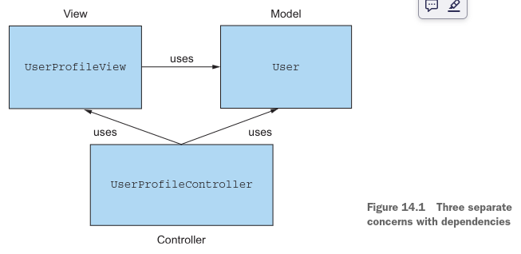
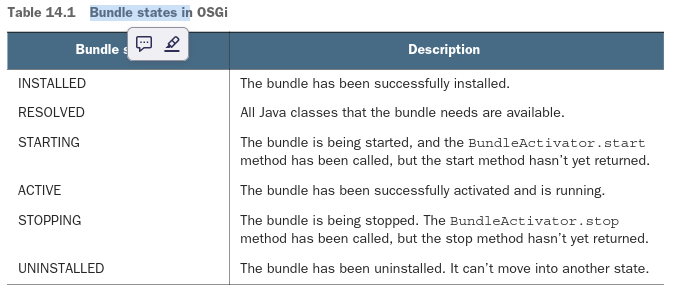
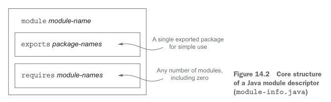
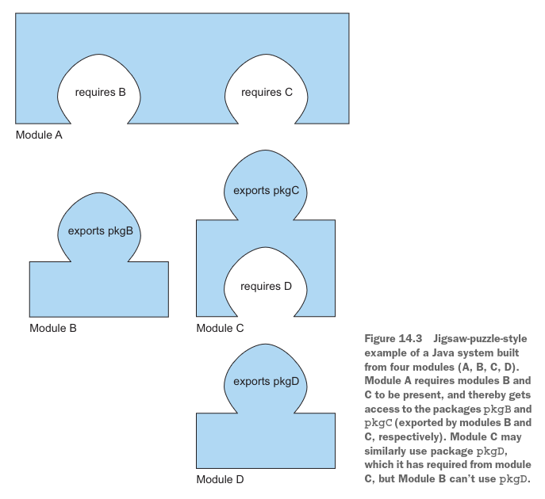
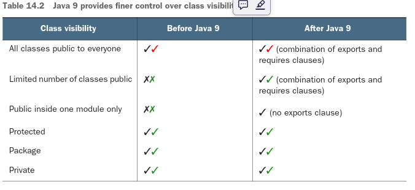
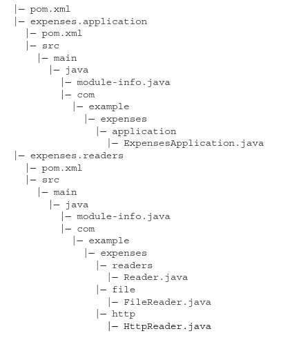

# ***El Sistema de Módulos de Java***

### Este capítulo cubre:
- Las fuerzas evolutivas que llevaron a Java a adoptar un sistema de módulos
- La estructura principal: declaraciones de módulos y directivas requires y exports
- Módulos automáticos para archivos JAR legacy (JARs heredados)
- Modularización y la biblioteca del JDK
- Módulos y compilaciones con Maven
- Un breve resumen de las directivas de módulos más allá de las simples requires y exports

La funcionalidad principal y más discutida introducida con Java 9 es su sistema de módulos. Esta característica fue 
desarrollada dentro del proyecto Jigsaw, y su desarrollo tomó casi una década. Esta línea temporal es una buena medida 
tanto de la importancia de esta adición como de las dificultades que el equipo de desarrollo de Java encontró al 
implementarla. Este capítulo proporciona el contexto sobre por qué deberías interesarte como desarrollador en qué es un 
sistema de módulos, así como una descripción general de para qué está destinado el nuevo Sistema de Módulos de Java y 
cómo puedes beneficiarte de él.

Tenga en cuenta que el Sistema de Módulos de Java es un tema complejo que merece un libro completo. Recomendamos The Java
Module System de Nicolai Parlog (Manning Publications, https://www.manning.com/books/the-java-module-system) como recurso
exhaustivo. En este capítulo, mantenemos deliberadamente una perspectiva general para que comprendas la motivación 
principal y obtengas una visión rápida de cómo trabajar con módulos de Java.

## 14.1 La fuerza motriz: razonar sobre el software
Antes de profundizar en los detalles del Sistema de Módulos de Java, es útil comprender la motivación y el contexto para
apreciar los objetivos establecidos por los diseñadores del lenguaje Java. ¿Qué significa modularidad? ¿Qué problema 
intenta resolver el sistema de módulos? Este libro ha dedicado bastante tiempo a discutir nuevas características del 
lenguaje que nos ayudan a escribir código que se lee más cercano a la descripción del problema y, como resultado, es más
fácil de entender y mantener. Sin embargo, esta preocupación es de nivel bajo. En última instancia, a alto nivel (nivel 
de arquitectura de software), quieres trabajar con un proyecto de software que sea fácil de razonar, porque esto te hace
más productivo cuando introduces cambios en tu base de código. En las siguientes secciones, destacamos dos principios de
diseño que ayudan a producir software más fácil de razonar: separación de responsabilidades y ocultamiento de información.

### 14.1.1 Separación de responsabilidades
La separación de responsabilidades (SoC, por sus siglas en inglés) es un principio que promueve descomponer un programa
de computadora en funcionalidades distintas. Supongamos que necesitas desarrollar una aplicación de contabilidad que 
analice gastos en diferentes formatos, los analice y proporcione informes resumidos a tu cliente. Aplicando SoC, divides
el análisis, el análisis y los reportes en partes separadas llamadas módulos—grupos cohesivos de código que tienen poco 
solape. En otras palabras, un módulo agrupa clases, permitiéndote expresar relaciones de visibilidad entre clases en tu 
aplicación.
Podrías decir: "Ah, pero los paquetes de Java ya agrupan clases." Tienes razón, pero los módulos de Java 9 te dan un 
control más refinado sobre qué clases pueden ver qué otras clases y permiten que este control se verifique en tiempo de 
compilación. En esencia, los paquetes de Java no soportan modularidad.

El principio de SoC es útil desde un punto de vista arquitectónico (como modelo versus vista versus controlador) y en un
enfoque de bajo nivel (como separar la lógica de negocio del mecanismo de recuperación). Los beneficios son:
- Permitir trabajar en partes individuales de forma aislada, lo que ayuda a la colaboración del equipo
- Facilitar la reutilización de partes separadas
- Mantenimiento más fácil del sistema en general

### 14.1.2 Ocultamiento de información
El ocultamiento de información es un principio que promueve ocultar los detalles de implementación. ¿Por qué es 
importante este principio? En el contexto de la construcción de software, los requisitos pueden cambiar frecuentemente. 
Al ocultar los detalles de implementación, puedes reducir las posibilidades de que un cambio local requiera cambios en 
cascada en otras partes de tu programa. En otras palabras, es un principio útil para gestionar y proteger tu código. A
menudo escuchas el término encapsulamiento usado para indicar que una pieza específica de código está tan bien aislada 
de las demás partes de la aplicación que cambiar su implementación interna no las afectará negativamente. En Java, puedes
lograr que el compilador verifique que los componentes dentro de una clase estén bien encapsulados usando la palabra 
clave private de manera apropiada. Pero hasta Java 9, no existía una estructura de lenguaje que permitiera al compilador
verificar que las clases y paquetes estuvieran disponibles solo para los propósitos previstos.

### 14.1.3 Software en Java
Estos dos principios son fundamentales en cualquier software bien diseñado. ¿Cómo se relacionan con las características 
del lenguaje Java? Java es un lenguaje orientado a objetos, y trabajas con clases e interfaces. Haces tu código modular 
agrupando paquetes, clases e interfaces que abordan una preocupación específica. En la práctica, razonar sobre código 
crudo es un poco abstracto. Como resultado, herramientas como diagramas UML (o, más simplemente, cajas y flechas) te 
ayudan a razonar sobre tu software representando visualmente las dependencias entre las partes de tu código. La 
figura 14.1 muestra un diagrama UML para una aplicación de gestión de perfil de usuario que ha sido descompuesta en tres
preocupaciones específicas.



¿Qué pasa con el ocultamiento de información? En Java, estás familiarizado con el uso de modificadores de visibilidad 
para controlar el acceso a métodos, campos y clases: public, protected, a nivel de paquete, y private. Sin embargo, como
aclaramos en la siguiente sección, su granularidad no es lo suficientemente fina en muchos casos, y podrías verse 
obligado a declarar un método como public incluso si no pretendías hacerlo accesible para los usuarios finales. Esta 
preocupación no era tan grande en los primeros días de Java, cuando las aplicaciones y las cadenas de dependencias eran
relativamente pequeñas. Ahora que muchas aplicaciones de Java son grandes, el problema es más importante. De hecho, si 
ves un campo o método público en una clase, probablemente te sientas con derecho a usarlo (¿no es así?), aunque el 
diseñador pueda considerarlo solo para uso privado entre algunas de sus propias clases.
Ahora que comprendes los beneficios de la modularización, puedes preguntarte cómo su soporte causa cambios en Java. Lo 
explicamos en la siguiente sección.

## 14.2 Por qué se diseñó el Sistema de Módulos de Java
En esta sección, aprenderás por qué se diseñó un nuevo sistema de módulos para el lenguaje y el compilador de Java. 
Primero, cubrimos las limitaciones de la modularidad antes de Java 9. A continuación, proporcionamos contexto sobre la 
biblioteca del JDK y explicamos por qué modularizarla era importante.

### 14.2.1 Limitaciones de la modularidad
Desafortunadamente, el soporte incorporado en Java para ayudar a producir proyectos de software modular era algo limitado
antes de Java 9. Java ha tenido tres niveles en los que se agrupaba el código: clases, paquetes y JARs. Para las clases,
Java siempre ha tenido soporte para modificadores de acceso y encapsulamiento. Sin embargo, había poco encapsulamiento a
nivel de paquete y JAR.

### Control de vicibilidad Limitado
Como se discutió en la sección anterior, Java proporciona modificadores de acceso para soportar el ocultamiento de 
información. Estos modificadores son visibilidad public, protected, a nivel de paquete y private. Pero, ¿qué pasa con el
control de visibilidad entre paquetes? La mayoría de las aplicaciones tienen varios paquetes definidos para agrupar 
diversas clases, pero los paquetes tienen un soporte limitado para el control de visibilidad. Si quieres que clases e 
interfaces de un paquete sean visibles para otro paquete, debes declararlas como public. Como consecuencia, estas clases
e interfaces también son accesibles para todos los demás. Una ocurrencia típica de este problema es cuando ves paquetes 
acompañantes con nombres que incluyen la cadena "impl" para proporcionar implementaciones por defecto. En este caso, 
porque el código dentro de ese paquete fue definido como public, no tienes forma de prevenir que los usuarios usen estas
implementaciones internas. Como resultado, se vuelve difícil evolucionar tu código sin hacer cambios que rompan la 
compatibilidad, porque lo que pensabas que era solo para uso interno fue usado por un programador temporalmente para 
hacer funcionar algo y luego se congeló en el sistema. Peor aún, esta situación es mala desde el punto de vista de la 
seguridad porque potencialmente aumentas la superficie de ataque al exponer más código al riesgo de manipulación.

### Class Path
A principios de este capítulo, discutimos los beneficios del software escrito de una manera que lo hace simple de 
mantener y entender—in otras palabras, más fácil de razonar. También hablamos sobre la separación de responsabilidades y
el modelado de dependencias entre módulos. Desafortunadamente, Java históricamente no cumple con el soporte de estas 
ideas cuando se trata de empaquetar y ejecutar una aplicación. De hecho, debes enviar todas tus clases compiladas en un
solo JAR plano, que se hace accesible desde el class path.¹ Luego, el JVM puede localizar y cargar dinámicamente clases 
del class path según sea necesario. Desafortunadamente, la combinación del class path y los JARs tiene varios 
inconvenientes.
Primero, el class path no tiene noción de versionado para la misma clase. No puedes, por ejemplo, especificar que la 
clase JSONParser de una biblioteca de análisis debe pertenecer a la versión 1.0 o versión 2.0, por lo que no puedes 
predecir qué sucederá si la misma biblioteca con dos versiones diferentes está disponible en el class path. Esta 
situación es común en aplicaciones grandes, ya que puedes tener diferentes versiones de las mismas bibliotecas usadas 
por diferentes componentes de tu aplicación.
Segundo, el class path no soporta dependencias explícitas; todas las clases dentro de diferentes JARs se fusionan en una
bolsa de clases en el class path. En otras palabras, el class path no te permite declarar explícitamente que un JAR 
depende de un conjunto de clases contenidas dentro de otro JAR. Esta situación hace difícil razonar sobre el class path
y hacer preguntas como:

- ¿Falta algo?
- ¿Hay conflictos?

Herramientas de compilación como Maven y Gradle pueden ayudarte a resolver este problema. Sin embargo, antes de Java 9, 
ni Java ni el JVM tenían soporte para dependencias explícitas. Los problemas combinados se conocen comúnmente como 
"Infierno de JARs" o "Infierno del Class Path". La consecuencia directa de estos problemas es que es común tener que 
seguir agregando y eliminando archivos de clase en el class path en un ciclo de prueba y error, con la esperanza de que 
el JVM ejecute tu aplicación sin lanzar excepciones en tiempo de ejecución como ClassNotFoundException. Idealmente, te 
gustaría que tales problemas se descubrieran temprano en el proceso de desarrollo. Usar el sistema de módulos de Java 9 
consistentemente permite que todos estos errores se detecten en tiempo de compilación.
Sin embargo, el encapsulamiento y el "Infierno del Class Path" no son problemas solo para la arquitectura de tu software.
¿Qué pasa con el JDK mismo?

### 14.2.2 JDK monolítico
El Java Development Kit (JDK) es una colección de herramientas que te permite trabajar y ejecutar programas de Java. 
Quizás las herramientas más importantes con las que estás familiarizado son javac para compilar programas de Java y java
para cargar y ejecutar una aplicación de Java, junto con la biblioteca del JDK, que proporciona soporte de ejecución que
incluye entrada/salida, colecciones y flujos. La primera versión fue lanzada en 1996. Es importante entender que como 
cualquier software, el JDK ha crecido y aumentado considerablemente en tamaño. Muchas tecnologías fueron agregadas y 
luego deprecadas. CORBA es un buen ejemplo. No importa si estás usando CORBA en tu aplicación o no; sus clases se envían
con el JDK. Esta situación se vuelve problemática especialmente en aplicaciones que se ejecutan en móviles o en la nube
y típicamente no necesitan todas las partes disponibles en la biblioteca del JDK.
¿Cómo puedes escapar de este problema como ecosistema completo? Java 8 introdujo la noción de perfiles compactos como un
paso adelante. Se introdujeron tres perfiles para tener diferentes huellas de memoria, dependiendo de qué partes de la 
biblioteca del JDK te interesan. Sin embargo, los perfiles compactos solo proporcionaron una solución a corto plazo. 
Muchas API internas en el JDK no están destinadas a uso público. Desafortunadamente, debido al pobre encapsulamiento 
proporcionado por el lenguaje Java, esas API se usan comúnmente. La clase sun.misc.Unsafe, por ejemplo, es usada por 
varias bibliotecas (incluyendo Spring, Netty y Mockito) pero nunca fue destinada a estar disponible fuera de los internos
del JDK. Como resultado, es extremadamente difícil evolucionar estas API sin introducir cambios incompatibles.
Todos estos problemas proporcionaron la motivación para diseñar un Sistema de Módulos de Java que también puede ser 
usado para modularizar el JDK mismo. En resumen, se necesitaban nuevas construcciones de estructura para permitirte 
elegir qué partes del JDK necesitas y cómo razonar sobre el class path, y para proporcionar un encapsulamiento más fuerte
para evolucionar la plataforma.

### 14.2.3 Comparación con OSGi
Esta sección compara los módulos de Java 9 con OSGi. Si no has oído hablar de OSGi, te sugerimos que omitas esta sección.
Antes de la introducción de módulos basados en el proyecto Jigsaw en Java 9, Java ya tenía un poderoso sistema de 
módulos, llamado OSGi, aunque no era formalmente parte de la plataforma Java. La iniciativa Open Service Gateway (OSGi) 
comenzó en 2000 y, hasta la llegada de Java 9, representó el estándar de facto para implementar una aplicación modular 
en el JVM.
En realidad, OSGi y el nuevo Sistema de Módulos de Java 9 no son mutuamente excluyentes; pueden coexistir en la misma 
aplicación. De hecho, sus características se superponen solo parcialmente. OSGi tiene un alcance mucho más amplio y 
proporciona muchas capacidades que no están disponibles en Jigsaw.
Los módulos OSGi se llaman bundles y se ejecutan dentro de un framework específico de OSGi. Existen varias 
implementaciones certificadas de frameworks OSGi, pero las dos con mayor adopción son Apache Felix y Equinox (que 
también se usa para ejecutar el IDE de Eclipse). Cuando se ejecuta dentro de un framework OSGi, un solo bundle puede ser
instalado remotamente, iniciado, detenido, actualizado y desinstalado sin reiniciar. En otras palabras, OSGi define un 
ciclo de vida claro para los bundles formado por los estados listados en la tabla 14.1.



La posibilidad de intercambiar caliente diferentes subpartes de tu aplicación sin necesidad de reiniciarla probablemente
es la principal ventaja de OSGi sobre Jigsaw. Cada bundle se define a través de un archivo de texto que describe qué 
paquetes externos son requeridos por el bundle para funcionar y qué paquetes internos son exportados públicamente por el
bundle y luego puestos a disposición de otros bundles.
Otra característica interesante de OSGi es que permite que diferentes versiones del mismo bundle se instalen en el 
framework al mismo tiempo. El Sistema de Módulos de Java 9 no soporta control de versiones porque Jigsaw todavía usa un 
solo class loader por aplicación, mientras que OSGi carga cada bundle en su propio class loader.

### 14.3 Módulos de Java: la imagen general
Java 9 proporciona una nueva unidad de estructura de programas de Java: el módulo. Un módulo se presenta con una nueva 
palabra clave² module, seguida de su nombre y su cuerpo. Dicho descriptor de módulo³ vive en un archivo especial: 
module-info.java, que se compila a module-info.class. El cuerpo de un descriptor de módulo consiste en cláusulas, de las
cuales las dos más importantes son requires y exports. La cláusula requires especifica qué otros módulos necesitan tus 
módulos para ejecutarse, y exports especifica todo lo que tu módulo quiere que sea visible para que otros módulos lo 
usen. Aprenderás sobre estas cláusulas con más detalle en secciones posteriores.
Un descriptor de módulo describe y encapsula uno o más paquetes (y típicamente vive en la misma carpeta que estos 
paquetes), pero en casos de uso simples, exporta (hace visible) solo uno de estos paquetes.

La estructura central de un descriptor de módulo de Java se muestra en la figura 14.2.



Es útil pensar en las partes de exports y requires de un módulo como siendo respectivamente como las pestañas 
(o lengüetas) y los agujeros de un rompecabezas (que es quizás de donde originó el nombre de trabajo "Proyecto Jigsaw").
La figura 14.3 muestra un ejemplo con varios módulos



Cuando usas herramientas como Maven, gran parte del detalle de las descripciones de módulos es manejada por un IDE y 
está oculta para el usuario.
Dicho esto, en la siguiente sección exploramos estos conceptos con más detalle basados en ejemplos.

## 14.4 Desarrollando una aplicación con el Sistema de Módulos de Java
En esta sección, obtienes una visión general del Sistema de Módulos de Java 9 construyendo una aplicación modular simple 
desde cero. Aprenderás cómo estructurar, empaquetar y lanzar una pequeña aplicación modular. Esta sección no explica cada
tema en detalle pero te muestra la imagen general, para que puedas profundizar independientemente si es necesario.

### 14.4.1 Configurando una aplicación
Para comenzar con el Sistema de Módulos de Java, necesitas un proyecto de ejemplo para escribir código. Quizás viajas 
mucho, haces compras de comestibles o sales a tomar café con tus amigos, y tienes que lidiar con muchos recibos. Nadie 
disfrutó nunca gestionar gastos. Para ayudarte, escribes una aplicación que puede gestionar tus gastos. La aplicación 
necesita realizar varias tareas:

- Leer una lista de gastos de un archivo o una URL;
- Analizar las representaciones de cadena de estos gastos;
- Calcular estadísticas;
- Mostrar un resumen útil;
- Proporcionar un coordinador principal de inicio y cierre para estas tareas.

Necesitas definir diferentes clases e interfaces para modelar los conceptos en esta aplicación. Primero, una interfaz 
Reader te permite leer gastos serializados de una fuente. Tendrás diferentes implementaciones, como HttpReader o 
FileReader, dependiendo de la fuente. También necesitas una interfaz Parser para deserializar los objetos JSON en un 
objeto de dominio Expense que puedas manipular en tu aplicación de Java. Finalmente, necesitas una clase 
SummaryCalculator que sea responsable de calcular estadísticas, dada una lista de objetos Expense, y devolver objetos 
SummaryStatistics.
Ahora que tienes un proyecto, ¿cómo lo modularizas usando el Sistema de Módulos de Java? Está claro que el proyecto 
involucra varias preocupaciones, que quieres separar:

- Leer datos de diferentes fuentes (Reader, HttpReader, FileReader)
- Analizar los datos de diferentes formatos (Parser, JSONParser, ExpenseJSONParser)
- Representar objetos de dominio (Expense)
- Calcular y devolver estadísticas (SummaryCalculator, SummaryStatistics)
- Coordinar las diferentes preocupaciones (ExpensesApplication)

Aquí, tomaremos un enfoque detallado por razones pedagógicas. Puedes agrupar cada preocupación en un módulo separado, de
la siguiente manera (y discutiremos el esquema de nombres de módulos con más detalle después):

- expenses.readers
- expenses.readers.http
- expenses.readers.file
- expenses.parsers
- expenses.parsers.json
- expenses.model
- expenses.statistics
- expenses.application

Para esta aplicación simple, adoptas una descomposición detallada para ejemplificar las diferentes partes del sistema de
módulos. En la práctica, tomar un enfoque tan detallado para un proyecto simple resultaría en un alto costo inicial por 
el beneficio discutiblemente limitado de encapsular correctamente pequeñas partes del proyecto. Sin embargo, a medida que
el proyecto crece y se agregan más implementaciones internas, los beneficios del encapsulamiento y el razonamiento se 
vuelven más evidentes. Podrías imaginar la lista anterior como siendo una lista de paquetes, dependiendo de los límites 
de tu aplicación. Un módulo agrupa una serie de paquetes. Quizás cada módulo tiene paquetes específicos de implementación
que no quieres exponer a otros módulos. El módulo expenses.statistics, por ejemplo, puede contener varios paquetes para 
diferentes implementaciones de métodos estadísticos experimentales. Más adelante, puedes decidir cuáles de estos paquetes
liberar a los usuarios.

### 14.4.2 Modularización detallada y general
Cuando estás modularizando un sistema, puedes elegir la granularidad. En el esquema más detallado, cada paquete tiene su
propio módulo (como en la sección anterior); en el esquema más general, un solo módulo contiene todos los paquetes en tu
sistema.
Como se señaló en la sección anterior, el primer esquema aumenta el costo de diseño por ganancias limitadas, y el segundo
pierde todos los beneficios de la modularización. La mejor elección es una descomposición pragmática del sistema en 
módulos junto con un proceso de revisión regular para asegurar que un proyecto de software en evolución permanezca 
suficientemente modularizado para que puedas continuar razonando sobre él y modificándolo.
En resumen, la modularización es el enemigo del óxido del software. 

### 14.4.3 Fundamentos del Sistema de Módulos de Java
Comencemos con una aplicación modular básica, que tiene solo un módulo para soportar la aplicación principal. La 
estructura del directorio del proyecto es la siguiente, con cada nivel anidado en un directorio:

|─ expenses.application
    |─ module-info.java
    |─ com
        |─ example
            |─ expenses
                |─ application
                    |─ ExpensesApplication.java

Has notado este misterioso module-info.java que era parte de la estructura del proyecto. Este archivo es un descriptor 
de módulo, como explicamos anteriormente en el capítulo, y debe ubicarse en la raíz de la jerarquía de archivos del 
código fuente del módulo para que puedas especificar las dependencias de tu módulo y lo que quieres exponer. Para tu 
aplicación de gastos, el archivo module-info.java de nivel superior contiene una descripción del módulo que tiene un 
nombre pero está vacío en lo demás porque no depende de ningún otro módulo ni expone su funcionalidad a otros módulos. 
Aprenderás sobre características más sofisticadas más adelante, comenzando con la sección 14.5. El contenido de 
module-info.java es el siguiente:
```java
module expenses.application {
}
```
¿Cómo ejecutas una aplicación modular? Echa un vistazo a algunos comandos para comprender las partes de bajo nivel. Este 
código está automatizado por tu IDE y sistema de compilación, pero ver qué está pasando es útil. Cuando estés en el 
directorio fuente del módulo de tu proyecto, ejecuta los siguientes comandos:
```terminaloutput
javac module-info.java
com/example/expenses/application/ExpensesApplication.java -d target
jar cvfe expenses-application.jar
com.example.expenses.application.ExpensesApplication -C target
```
Estos comandos producen una salida similar a la siguiente, que muestra qué carpetas y archivos de clase se incorporan en 
el JAR generado (expenses-application.jar):
```terminaloutput
added manifest
added module-info: module-info.class
adding: com/(in = 0) (out= 0)(stored 0%)
adding: com/example/(in = 0) (out= 0)(stored 0%)
adding: com/example/expenses/(in = 0) (out= 0)(stored 0%)
adding: com/example/expenses/application/(in = 0) (out= 0)(stored 0%)
adding: com/example/expenses/application/ExpensesApplication.class(in = 456)
(out= 306)(deflated 32%)
```
Finalmente, ejecutas el JAR generado como una aplicación modular:
```terminaloutput
java --module-path expenses-application.jar \
--module expenses/com.example.expenses.application.ExpensesApplication
```
Deberías estar familiarizado con los dos primeros pasos, que representan una forma estándar de empaquetar una aplicación
de Java en un JAR. La única parte nueva es que el archivo module-info.java se convierte en parte del paso de compilación.
El programa java, que ejecuta archivos .class de Java, tiene dos nuevas opciones:

- --module-path—Esta opción especifica qué módulos están disponibles para cargar. Esta opción difiere del argumento 
--classpath, que pone los archivos de clase disponibles.
- --module—Esta opción especifica el módulo principal y la clase a ejecutar.

La declaración de un módulo no incluye una cadena de versión. Abordar el problema de selección de版本 no fue un punto de 
diseño específico para el Sistema de Módulos de Java 9, por lo que el versionado no es soportado. La justificación fue
que este es un problema para las herramientas de compilación y las aplicaciones contenedor.
 
## 14.5 Trabajando con varios módulos
Ahora que sabes cómo configurar una aplicación básica con un módulo, estás listo para hacer algo un poco más realista 
con múltiples módulos. Quieres que tu aplicación de gastos lea gastos de una fuente. Para este fin, introduce un nuevo 
módulo expenses.readers que encapsula estas responsabilidades. La interacción entre los dos módulos expenses.application 
y expenses.readers está especificada por las cláusulas exports y requires de Java 9.

### 14.5.1 La cláusula exports
Así es como podríamos declarar el módulo expenses.readers. (No te preocupes por la sintaxis y los conceptos todavía; 
cubriremos estos temas más adelante.)
```java
// "Estos son nombres de paquetes, no nombres de módulos"
module expenses.readers {
    exports com.example.expenses.readers;
    exports com.example.expenses.readers.file;
    exports com.example.expenses.readers.http;
}
```
Hay algo nuevo: la cláusula exports, que hace que los tipos públicos en paquetes específicos estén disponibles para ser 
usados por otros módulos. Por defecto, todo está encapsulado dentro de un módulo. El sistema de módulos adopta un enfoque
de lista blanca que te ayuda a obtener un encapsulamiento fuerte, ya que necesitas decidir explícitamente qué poner a 
disposición de otro módulo para que lo use. (Este enfoque evita que exportes accidentalmente algunas características 
internas que un atacante podría explotar para comprometer tus sistemas varios años después.)
La estructura de directorios de la versión de dos módulos de tu proyecto ahora se ve así:

|─ expenses.application
    |─ module-info.java
    |─ com
        |─ example
            |─ expenses
                |─ application
                    |─ ExpensesApplication.java
|─ expenses.readers
    |─ module-info.java
    |─ com
        |─ example
            |─ expenses
                |─ readers
                    |─ Reader.java
                |─ file
                    |─ FileReader.java
                |─ http
                    |─ HttpReader.java

### 14.5.2 La cláusula requires
Alternativamente, podrías haber escrito module-info.java de la siguiente manera:
```java
module expenses.readers {
    //Este es un nombre de módulo, no un nombre de paquete.
    requires java.base; 
    //Este es un nombre de paquete, no un nombre de módulo.
    exports com.example.expenses.readers;
    exports com.example.expenses.readers.file;
    exports com.example.expenses.readers.http;
}
```
El nuevo elemento es la cláusula requires, que te permite especificar de qué depende el módulo. Por defecto, todos los 
módulos dependen de un módulo de plataforma llamado java.base que incluye los paquetes principales de Java como net, io 
y util. Este módulo siempre se requiere por defecto, por lo que no necesitas decirlo explícitamente. (Esto es similar a 
cómo decir class Foo { ... } en Java es equivalente a decir class Foo extends Object { ... }.)
Se vuelve útil cuando necesitas importar módulos distintos a java.base.
La combinación de las cláusulas requires y exports hace que el control de acceso de las clases sea más sofisticado en 
Java 9. La tabla 14.2 resume las diferencias de visibilidad con los diferentes modificadores de acceso antes y después 
de Java 9.



### 14.5.3 Nomenclatura
En esta etapa, es útil comentar sobre la convención de nomenclatura para los módulos. Optamos por un enfoque corto (por 
ejemplo, expenses.application) para no confundir las ideas de módulos y paquetes. (Un módulo puede exportar múltiples 
paquetes). La convención recomendada es diferente, sin embargo.
Oracle recomienda nombrar los módulos siguiendo la misma convención inversa de nombre de dominio de internet (por 
ejemplo, com.iteratrlearning.training) utilizada para los paquetes. Además, el nombre de un módulo debe corresponder a 
su paquete API exportado principal, que también debe seguir esa convención. Si un módulo no tiene ese paquete, o si por 
otras razones requiere un nombre que no corresponda a uno de sus paquetes exportados, debe comenzar con la forma 
invertida de un dominio de internet asociado con su autor.
Ahora que has aprendido cómo configurar un proyecto con múltiples módulos, ¿cómo lo empaquetas y ejecutas? Cubrimos este
tema en la siguiente sección.

## 14.6 Compilación y empaquetado
Ahora que te sientes cómodo configurando un proyecto y declarando un módulo, estás listo para ver cómo puedes usar 
herramientas de compilación como Maven para compilar tu proyecto. Esta sección asume que estás familiarizado con Maven, 
que es una de las herramientas de compilación más comunes en el ecosistema Java. Otra herramienta de compilación popular
es Gradle, que te animamos a explorar si no has oído hablar de ella.
Primero, necesitas introducir un archivo pom.xml para cada módulo. De hecho, cada módulo puede compilarse de forma 
independiente para que se comporte como un proyecto por sí mismo. También necesitas agregar un pom.xml para el padre de 
todos los módulos para coordinar la compilación de todo el proyecto. La estructura general ahora se ve de la siguiente 
manera:



Observa los tres nuevos archivos pom.xml y la estructura de directorios del proyecto Maven. El descriptor de módulo 
(module-info.java) debe ubicarse en el directorio src/main/java. Maven configurará javac para usar la ruta de módulo 
fuente apropiada.
El pom.xml para el proyecto expenses.readers se ve así:

```xml
<?xml version="1.0" encoding="UTF-8"?>
<project xmlns="http://maven.apache.org/POM/4.0.0"
xmlns:xsi="http://www.w3.org/2001/XMLSchema-instance"
xsi:schemaLocation="http://maven.apache.org/POM/4.0.0
http://maven.apache.org/xsd/maven-4.0.0.xsd">
<modelVersion>4.0.0</modelVersion>
<groupId>com.example</groupId>
<artifactId>expenses.readers</artifactId>
<version>1.0</version>
<packaging>jar</packaging>
    <parent>
        <groupId>com.example</groupId>
        <artifactId>expenses</artifactId>
        <version>1.0</version>
    </parent>
</project>
```
Lo importante a notar es que este código menciona explícitamente el módulo padre para ayudar en el proceso de compilación.
El padre es el artefacto con el ID expenses. Necesitas definir el padre en pom.xml, como verás en breve.
A continuación, necesitas especificar el pom.xml para el módulo expenses.application. Este archivo es similar al 
anterior, pero tienes que agregar una dependencia al proyecto expenses.readers, porque ExpensesApplication requiere las 
clases e interfaces que contiene para compilar:
```xml
<?xml version="1.0" encoding="UTF-8"?>
<project xmlns="http://maven.apache.org/POM/4.0.0"
xmlns:xsi="http://www.w3.org/2001/XMLSchema-instance"
xsi:schemaLocation="http://maven.apache.org/POM/4.0.0
http://maven.apache.org/xsd/maven-4.0.0.xsd">
<modelVersion>4.0.0</modelVersion>
<groupId>com.example</groupId>
<artifactId>expenses.application</artifactId>
<version>1.0</version>
<packaging>jar</packaging>
<parent>
<groupId>com.example</groupId>
<artifactId>expenses</artifactId>
<version>1.0</version>
</parent>
<dependencies>
<dependency>
<groupId>com.example</groupId>
<artifactId>expenses.readers</artifactId>
<version>1.0</version>
</dependency>
</dependencies>
</project>
```
Ahora que dos módulos, expenses.application y expenses.readers, tienen su propio pom.xml, puedes configurar el pom.xml 
global para guiar el proceso de compilación. Maven soporta proyectos que tienen múltiples módulos de Maven con el 
elemento XML especial <module>, que se refiere a los ID de artefacto de los hijos. Aquí está la definición completa, que
se refiere a los dos módulos hijos expenses.application y expenses.readers:
```xml
<?xml version="1.0" encoding="UTF-8"?>
<project xmlns="http://maven.apache.org/POM/4.0.0"
xmlns:xsi="http://www.w3.org/2001/XMLSchema-instance"
         xsi:schemaLocation="http://maven.apache.org/POM/4.0.0
http://maven.apache.org/xsd/maven-4.0.0.xsd">
    <modelVersion>4.0.0</modelVersion>
    <groupId>com.example</groupId>
    <artifactId>expenses</artifactId>
    <packaging>pom</packaging>
    <version>1.0</version>
    <modules>
        <module>expenses.application</module>
        <module>expenses.readers</module>
    </modules>
    <build>
        <pluginManagement>
            <plugins>
                <plugin>
                    <groupId>org.apache.maven.plugins</groupId>
                    <artifactId>maven-compiler-plugin</artifactId>
                    <version>3.7.0</version>
                    <configuration>
                        <source>9</source>
                        <target>9</target>
                    </configuration>
                </plugin>
            </plugins>
        </pluginManagement>
    </build>
</project>
```
¡Felicitaciones! Ahora puedes ejecutar el comando mvn clean package para generar los JARs para los módulos en tu proyecto.
Este comando genera:
```terminaloutput
./expenses.application/target/expenses.application-1.0.jar
./expenses.readers/target/expenses.readers-1.0.jar
```
Puedes ejecutar tu aplicación modular incluyendo estos dos JARs en el module path de la siguiente manera:
```terminaloutput
java --module-path \
./expenses.application/target/expenses.application-1.0.jar:\
./expenses.readers/target/expenses.readers-1.0.jar \
--module \
expenses.application/com.example.expenses.application.ExpensesApplication
```
Hasta ahora, has aprendido sobre los módulos que creaste y has visto cómo usar requires para referenciar java.base. Sin 
embargo, el software del mundo real depende de módulos y bibliotecas externas. ¿Cómo funciona ese proceso, y qué pasa si
las bibliotecas heredadas no han sido actualizadas con un module-info.java explícito? En la siguiente sección, 
respondemos estas preguntas introduciendo los módulos automáticos.

## 14.7 Módulos automáticos
Puede que decidas que la implementación de tu HttpReader es de bajo nivel; en su lugar, te gustaría usar una biblioteca 
especializada como httpclient del proyecto Apache. ¿Cómo incorporas esa biblioteca en tu proyecto? Has aprendido sobre la
cláusula requires, así que intenta agregarla en el module-info.java del proyecto expenses.readers. Ejecuta mvn clean 
package nuevamente para ver qué sucede. Desafortunadamente, el resultado es una mala noticia:
```terminaloutput
[ERROR] module not found: httpclient
```
Obtienes este error porque también necesitas actualizar tu pom.xml para declarar la dependencia. El plugin de compilación
de Maven coloca todas las dependencias en el module path cuando estás construyendo un proyecto que tiene un 
module-info.java, para que los JARs apropiados se descarguen y reconozcan en tu proyecto, de la siguiente manera:
```xml
<dependencies>
<dependency>
<groupId>org.apache.httpcomponents</groupId>
<artifactId>httpclient</artifactId>
<version>4.5.3</version>
</dependency>
</dependencies>
```
Ahora, al ejecutar mvn clean package se compila el proyecto correctamente. Sin embargo, nota algo interesante: la 
biblioteca httpclient no es un módulo de Java. Es una biblioteca externa que quieres usar como módulo, pero aún no ha 
sido modularizada. Java convierte el JAR apropiado en un llamado módulo automático. Cualquier JAR en el module path sin 
un archivo module-info se convierte en un módulo automático. Los módulos automáticos exportan implícitamente todos sus 
paquetes. Un nombre para este módulo automático se inventa automáticamente, derivado del nombre del JAR. Tienes algunas 
formas de derivar el nombre, pero la manera más fácil es usar la herramienta jar con el argumento --describe-module:
```terminaloutput
jar --file=./expenses.readers/target/dependency/httpclient-4.5.3.jar \
--describe-module
httpclient@4.5.3 automatic
```
En este caso, el nombre es httpclient.
El paso final es ejecutar la aplicación y agregar el JAR de httpclient al module path:
```terminaloutput
java --module-path \
./expenses.application/target/expenses.application-1.0.jar:\
./expenses.readers/target/expenses.readers-1.0.jar \
./expenses.readers/target/dependency/httpclient-4.5.3.jar \
--module \
expenses.application/com.example.expenses.application.ExpensesApplication
``` 
`NOTA`: Existe un proyecto (https://github.com/moditect/moditect) para proporcionar mejor soporte para el Sistema de 
Módulos de Java 9 dentro de Maven, como generar archivos module-info automáticamente.

## 14.8 Declaración de módulos y cláusulas
El Sistema de Módulos de Java es una bestia grande. Como mencionamos anteriormente, recomendamos que leas un libro 
dedicado al tema si deseas profundizar. No obstante, esta sección te da una breve visión general de otras palabras clave
disponibles en el lenguaje de declaración de módulos para darte una idea de lo que es posible.
Como aprendiste en las secciones anteriores, declaras un módulo usando la directiva module. Aquí, tiene el nombre 
com.iteratrlearning.application:
```java
module com.iteratrlearning.application {
}
```
¿Qué puede ir dentro de la declaración del módulo? Has aprendido sobre las cláusulas requires y exports, pero hay otras 
cláusulas, incluyendo requires-transitive, exports-to, open, opens, uses y provides. Vemos estas cláusulas por turno en
las siguientes secciones.

### 14.8.1 requires
La cláusula requires te permite especificar que tu módulo depende de otro módulo tanto en tiempo de compilación como en 
tiempo de ejecución. El módulo com.iteratrlearning.application, por ejemplo, depende del módulo com.iteratrlearning.ui:
```java
module com.iteratrlearning.application {
requires com.iteratrlearning.ui;
}
```
El resultado es que solo los tipos públicos que fueron exportados por com.iteratrlearning.ui están disponibles para que
com.iteratrlearning.application los use.

### 14.8.2 exports
La cláusula exports hace que los tipos públicos en paquetes específicos estén disponibles para su uso por otros módulos.
Por defecto, ningún paquete se exporta. Obtienes un encapsulamiento fuerte al hacer explícito qué paquetes deben 
exportarse. En el siguiente ejemplo, los paquetes com.iteratrlearning.ui.panels y com.iteratrlearning.ui.widgets se 
exportan. (Nota que exports toma un nombre de paquete como argumento y que requires toma un nombre de módulo, a pesar de
los esquemas de nomenclatura similares.)
```java
module com.iteratrlearning.ui {
    requires com.iteratrlearning.core;
    exports com.iteratrlearning.ui.panels;
    exports com.iteratrlearning.ui.widgets;
}
```
### 14.8.3 requires transitive
Puedes especificar que un módulo puede usar los tipos públicos requeridos por otro módulo. Puedes modificar la cláusula 
requires, por ejemplo, a requires transitive dentro de la declaración del módulo com.iteratrlearning.ui:
```java
module com.iteratrlearning.ui {
    requires transitive com.iteratrlearning.core;
    exports com.iteratrlearning.ui.panels;
    exports com.iteratrlearning.ui.widgets;
}
module com.iteratrlearning.application{
        requires com.iteratrlearning.ui;
        }
```
El resultado es que el módulo com.iteratrlearning.application tiene acceso a los tipos públicos exportados por 
com.iteratrlearning.core. La transitividad es útil cuando el módulo requerido (aquí, com.iteratrlearning.ui) devuelve 
tipos de otro módulo requerido por este módulo (com.iteratrlearning.core). Sería molesto tener que redeclarar requires 
com.iteratrlearning.core dentro del módulo com.iteratrlearning.application. Este problema se resuelve con transitive. 
Ahora cualquier módulo que dependa de com.iteratrlearning.ui lee automáticamente el módulo com.iteratrlearning.core.

### 14.8.4 exports to
Tienes un nivel adicional de control de visibilidad, en el que puedes restringir los usuarios permitidos de una 
exportación particular usando la construcción exports to. Como viste en la sección 14.8.2, puedes restringir los usuarios
permitidos de com.iteratrlearning.ui.widgets a com.iteratrlearning.ui.widgetuser ajustando la declaración del módulo así:
```java
module com.iteratrlearning.ui {
    requires com.iteratrlearning.core;
    exports com.iteratrlearning.ui.panels;
    exports com.iteratrlearning.ui.widgets to
            com.iteratrlearning.ui.widgetuser;
}
```

### 14.8.5 open y opens
Usar el calificador open en la declaración del módulo da a otros módulos acceso reflectivo a todos sus paquetes. El 
calificador open no tiene efecto sobre la visibilidad del módulo excepto para permitir acceso reflectivo, como en este 
ejemplo:
```java
open module com.iteratrlearning.ui {
}
```
Antes de Java 9, podías inspeccionar el estado privado de objetos usando reflexión. En otras palabras, nada estaba 
verdaderamente encapsulado. Herramientas de mapeo objeto-relacional (ORM) como Hibernate a menudo usan esta capacidad 
para acceder y modificar el estado directamente. En Java 9, la reflexión ya no está permitida por defecto. La cláusula 
open en el código anterior sirve para permitir ese comportamiento cuando sea necesario.
En lugar de abrir un módulo completo a la reflexión, puedes usar una cláusula opens dentro de una declaración de módulo 
para abrir sus paquetes individualmente, según sea necesario. También puedes usar el calificador to en la variante opens
to para limitar los módulos autorizados a realizar acceso reflectivo, análogo a cómo exports to limita los módulos 
autorizados a requerir un paquete exportado.

### 14.8.6 uses y provides
Si estás familiarizado con servicios y ServiceLoader, el Sistema de Módulos de Java te permite especificar un módulo como
proveedor de servicios usando la cláusula provides y un consumidor de servicios usando la cláusula uses. Este tema es 
avanzado, sin embargo, y está más allá del alcance de este capítulo. Si estás interesado en combinar módulos y service 
loaders, recomendamos que leas un recurso completo como The Java Module System de Nicolai Parlog (Manning Publications),
mencionado anteriormente en este capítulo.

## 14.9 Un ejemplo más grande y dónde aprender más
Puedes obtener una muestra del sistema de módulos del siguiente ejemplo, tomado de la documentación de Oracle sobre Java.
Este ejemplo muestra una declaración de módulo usando la mayoría de las características discutidas en este capítulo. El 
ejemplo no pretende asustarte (la gran mayoría de las declaraciones de módulos son simples exports y requires), pero te 
da un vistazo a algunas características más ricas:
```java
module com.example.foo {
    requires com.example.foo.http;
    requires java.logging;
    requires transitive com.example.foo.network;
    exports com.example.foo.bar;
    exports com.example.foo.internal to com.example.foo.probe;
    opens com.example.foo.quux;
    opens com.example.foo.internal to com.example.foo.network,
            com.example.foo.probe;
    uses com.example.foo.spi.Intf;
    provides com.example.foo.spi.Intf with com.example.foo.Impl;
}
```
Este capítulo discutió la necesidad del nuevo Sistema de Módulos de Java y proporcionó una introducción suave a sus 
características principales. No cubrimos muchas características, incluyendo service loaders, cláusulas adicionales del 
descriptor de módulos, y herramientas para trabajar con módulos como jdeps y jlink. Si eres un desarrollador Java EE, es
importante tener en cuenta al migrar tus aplicaciones a Java 9 que varios paquetes relevantes para EE no se cargan por 
defecto en la Máquina Virtual de Java 9 modularizada. Las clases de la API JAXB, por ejemplo, ahora se consideran APIs 
de Java EE y ya no están disponibles en el class path predeterminado de Java SE 9. Necesitas agregar explícitamente los 
módulos de interés usando el interruptor de línea de comandos --add-modules para mantener la compatibilidad. Para agregar
java.xml.bind, por ejemplo, necesitas especificar --add-modules java.xml.bind.
Como señalamos anteriormente, hacer justicia al Sistema de Módulos de Java requeriría un libro completo, no un solo 
capítulo. Para explorar los detalles en mayor profundidad, sugerimos un libro como The Java Module System de Nicolai 
Parlog (Manning Publications), mencionado anteriormente en este capítulo.

### Resumen
- La separación de responsabilidades y el ocultamiento de información son dos principios importantes para ayudar a 
construir software sobre el que puedas razonar.
- Antes de Java 9, hacías el código modular introduciendo paquetes, clases e interfaces que tienen una responsabilidad 
específica, pero estos elementos no eran lo suficientemente ricos para un encapsulamiento efectivo.
- El problema del "Infierno del Class Path" dificulta razonar sobre las dependencias de una aplicación.
- Antes de Java 9, el JDK era monolítico, resultando en altos costos de mantenimiento y una evolución restringida.
- Java 9 introdujo un nuevo sistema de módulos en el que un archivo module-info.java nombra un módulo y especifica sus 
dependencias (requires) y su API pública (exports).
- La cláusula requires te permite especificar dependencias en otros módulos.
- La cláusula exports hace que los tipos públicos de paquetes específicos en un módulo estén disponibles para su uso por
otros módulos.
- La convención de nomenclatura preferida para un módulo sigue la convención inversa de nombre de dominio de internet.
- Cualquier JAR en el module path sin un archivo module-info se convierte en un módulo automático.
- Los módulos automáticos exportan implícitamente todos sus paquetes.
- Maven soporta aplicaciones estructuradas con el Sistema de Módulos de Java 9.