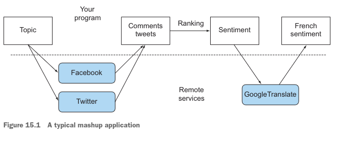
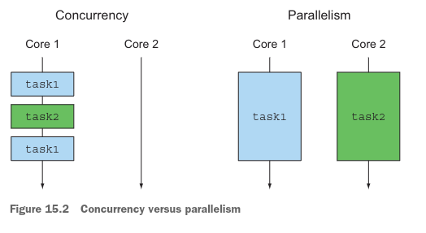
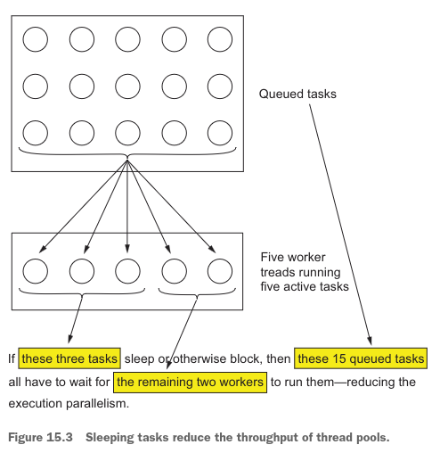
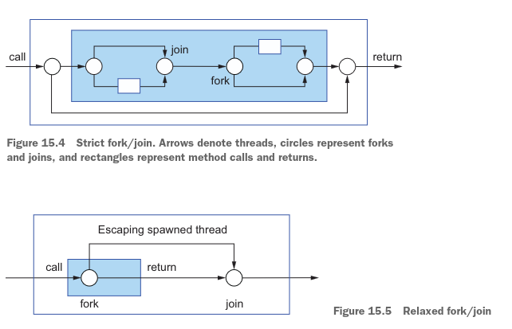
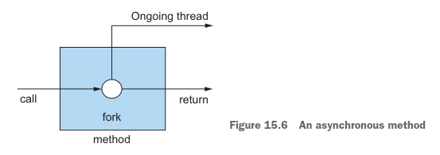
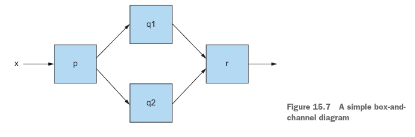
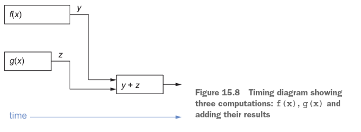
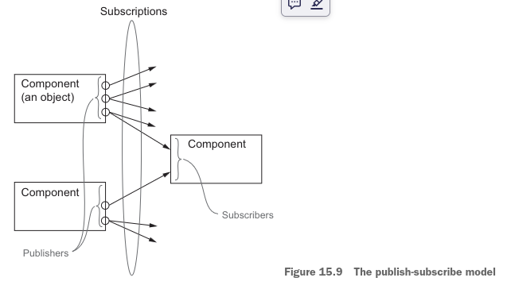

# Parte 5

# Concurrencia mejorada en Java
La quinta parte de este libro explora las formas más avanzadas de estructurar programas concurrentes en Java —más allá 
de las ideas del procesamiento paralelo fácil de usar para flujos introducidas en los capítulos 6 y 7. De nuevo, nada en
el resto del libro depende de esta parte, así que siéntete libre de saltarte esta parte si (todavía) no necesitas 
explorar estas ideas.

- El capítulo 15 es nuevo en esta segunda edición y cubre la idea de "visión general" de las APIs asíncronas, incluyendo 
las ideas de Futures y el protocolo publish-subscribe detrás de la programación reactiva y encapsulado en la Java 9 Flow
API.
- El capítulo 16 explora CompletableFuture, que te permite expresar cálculos asíncronos complejos de forma declarativa en
paralelo con el diseño de la Streams API.
- El capítulo 17 también es nuevo en esta segunda edición y explora la Java 9 Flow API en detalle, enfocándose en código 
práctico de programación reactiva.

# Conceptos detrás de CompletableFuture y la programación reactiva 

### Este capítulo cubre
- Hilos, Futures y las fuerzas evolutivas
que llevan a Java a soportar APIs de concurrencia más ricas
- APIs asíncronas
- La vista de cajas y canales de la computación concurrente 
- Combinadores de CompletableFuture para conectar cajas dinámicamente
- El protocolo publish-subscribe que forma la base de la Java 9 Flow API para la programación reactiva
- Programación reactiva y sistemas reactivos

En los últimos años, dos tendencias están obligando a los desarrolladores a repensar la forma en que se escribe el 
software. La primera tendencia está relacionada con el hardware en el que se ejecutan las aplicaciones, y la segunda 
tendencia se refiere a cómo se estructuran las aplicaciones (particularmente cómo interactúan). Discutimos el efecto de 
la tendencia del hardware en el capítulo 7. Señalamos que desde la llegada de los procesadores multinúcleo, la forma más
efectiva de acelerar tus aplicaciones es escribir software que pueda explotar completamente los procesadores multinúcleo.
Viste que puedes dividir tareas grandes y hacer que cada subtarea se ejecute en paralelo con las demás. También 
aprendiste cómo el framework fork/join (disponible desde Java 7) y los streams paralelos (nuevo en Java 8) te permiten 
realizar esta tarea de una manera más simple y efectiva que trabajando directamente con hilos.
La segunda tendencia refleja la creciente disponibilidad y uso por parte de las aplicaciones de los servicios de 
Internet. La adopción de la arquitectura de microservicios, por ejemplo, ha crecido en los últimos años. En lugar de ser
una aplicación monolítica, tu aplicación se subdivide en servicios más pequeños. La coordinación de estos servicios más 
pequeños requiere una mayor comunicación en red. De manera similar, muchos más servicios de internet son accesibles a 
través de APIs públicas, puestas a disposición por proveedores conocidos como Google (información de localización), 
Facebook (información social) y Twitter (noticias). Hoy en día, es relativamente raro desarrollar un sitio web o una 
aplicación de red que funcione en completo aislamiento. Es mucho más probable que tu próxima aplicación web sea un 
mashup, utilizando contenido de múltiples fuentes y agregándolo para facilitar la vida de tus usuarios.
Puede que quieras construir un sitio web que recopile y resuma la opinión de las redes sociales sobre un tema determinado
para tus usuarios franceses. Para hacerlo, podrías usar la API de Facebook o Twitter para encontrar comentarios populares
sobre ese tema en muchos idiomas y clasificar los más relevantes con tus algoritmos internos. Luego podrías usar Google 
Translate para traducir los comentarios al francés o usar Google Maps para geolocalizar a sus autores, agregar toda esta
información y mostrarla en tu sitio web.
Si alguno de estos servicios de red externos es lento en responder, por supuesto querrás proporcionar resultados 
parciales a tus usuarios, quizás mostrando tus resultados de texto junto con un mapa genérico con un signo de 
interrogación en lugar de mostrar una pantalla en blanco hasta que el servidor de mapas responda o expire el tiempo de 
espera. La figura 15.1 ilustra cómo este estilo de aplicación mashup interactúa con servicios remotos.



Para implementar aplicaciones como esta, tienes que contactar múltiples servicios web a través de Internet. Pero no 
quieres bloquear tus cálculos y desperdiciar billones de preciosos ciclos de reloj de tu CPU esperando una respuesta de 
estos servicios. No deberías tener que esperar datos de Facebook antes de procesar los datos provenientes de Twitter, 
por ejemplo.
Esta situación representa la otra cara de la moneda de la programación multitarea. El framework fork/join y los streams 
paralelos, discutidos en el capítulo 7, son herramientas valiosas para el paralelismo; dividen una tarea en múltiples 
subtareas y ejecutan esas subtareas en paralelo en diferentes núcleos, CPUs o incluso máquinas.
Por el contrario, cuando estás lidiando con concurrencia en lugar de paralelismo, o cuando tu objetivo principal es 
realizar varias tareas débilmente relacionadas en las mismas CPUs, manteniendo sus núcleos tan ocupados como sea posible
para maximizar el rendimiento de tu aplicación, quieres evitar bloquear un hilo y desperdiciar sus recursos 
computacionales mientras esperas (potencialmente durante bastante tiempo) un resultado de un servicio remoto o de 
interrogar una base de datos.
Java ofrece dos conjuntos de herramientas principales para tales circunstancias. Primero, como verás en los capítulos 
16 y 17, la interfaz Future, y particularmente su implementación CompletableFuture de Java 8, a menudo proporcionan 
soluciones simples y efectivas (capítulo 16). Más recientemente, Java 9 añadió la idea de programación reactiva, 
construida alrededor de la idea del llamado protocolo publish-subscribe a través de la Flow API, que ofrece enfoques de 
programación más sofisticados (capítulo 17).
La figura 15.2 ilustra la diferencia entre concurrencia y paralelismo. La concurrencia es una propiedad de programación 
(ejecución superpuesta) que puede ocurrir incluso en una máquina de un solo núcleo, mientras que el paralelismo es una 
propiedad del hardware de ejecución (ejecución simultánea).



El resto de este capítulo explica las ideas fundamentales que sustentan las nuevas APIs CompletableFuture y Flow de Java.
Comenzamos explicando la evolución de Java en cuanto a concurrencia, incluyendo Hilos y abstracciones de más alto nivel,
incluyendo Thread Pools y Futures (sección 15.1). Notamos que el capítulo 7 trató principalmente sobre el uso de 
paralelismo en programas tipo bucle. La sección 15.2 explora cómo puedes explotar mejor la concurrencia para llamadas a 
métodos. La sección 15.3 te ofrece una forma diagramática de ver partes de programas como cajas que se comunican a través
de canales. Las secciones 15.4 y 15.5 examinan los principios de CompletableFuture y la programación reactiva en 
Java 8 y 9. Finalmente, la sección 15.6 explica la diferencia entre un sistema reactivo y la programación reactiva.
Ejemplificamos la mayoría de los conceptos con un ejemplo práctico que muestra cómo calcular expresiones como f(x)+g(x) 
y luego devolver, o imprimir, el resultado utilizando varias características de concurrencia de Java, asumiendo que f(x)
y g(x) son cómputos de larga duración.

### Guía para el lector
Este capítulo contiene poco código Java real. Sugerimos que los lectores que quieran ver solo código pasen directamente
a los capítulos 16 y 17. Por otro lado, como todos hemos descubierto, el código que implementa ideas desconocidas puede 
ser difícil de entender. Por lo tanto, usamos funciones simples e incluimos diagramas para explicar las ideas generales,
como el protocolo publish-subscribe detrás de la Flow API que captura la programación reactiva.

## 15.1 Evolución del soporte de Java para expresar concurrencia
Java ha evolucionado considerablemente en su soporte para la programación concurrente, reflejando en gran medida los 
cambios en hardware, sistemas de software y conceptos de programación durante los últimos 20 años. Resumir esta evolución
puede ayudarte a entender la razón de las nuevas adiciones y sus roles en la programación y el diseño de sistemas.
Inicialmente, Java tenía locks (a través de clases y métodos synchronized), Runnables y Threads. En 2004, Java 5 introdujo
el paquete java.util.concurrent, que soportaba concurrencia más expresiva, particularmente la interfaz ExecutorService 
(que desacoplaba el envío de tareas de la ejecución de hilos), así como Callable\<T\> y Future\<T\>, que producían 
variantes de más alto nivel que devolvían resultados de Runnable y Thread y usaban genéricos (también introducidos en 
Java 5). Los ExecutorServices pueden ejecutar tanto Runnables como Callables. Estas características facilitaron la 
programación paralela en las CPUs multinúcleo que comenzaron a aparecer al año siguiente. Para ser honestos, ¡a nadie le
gustaba trabajar directamente con hilos!
Las versiones posteriores de Java continuaron mejorando el soporte de concurrencia, ya que era cada vez más demandado 
por los programadores que necesitaban programar CPUs multinúcleo de manera efectiva. Como viste en el capítulo 7, 
Java 7 añadió java.util.concurrent.RecursiveTask para soportar la implementación fork/join de algoritmos divide-y-vencerás,
y Java 8 añadió soporte para Streams y su procesamiento paralelo (basándose en el soporte recién añadido para lambdas).
Java enriqueció aún más sus características de concurrencia al proporcionar soporte para componer Futures (a través de 
la implementación CompletableFuture de Future en Java 8, sección 15.4 y capítulo 16), y Java 9 proporcionó soporte 
explícito para la programación asíncrona distribuida. Estas APIs te brindan un modelo mental y un conjunto de 
herramientas para construir el tipo de aplicación mashup mencionada en la introducción de este capítulo. Allí, la 
aplicación funcionaba contactando varios servicios web y combinando su información en tiempo real para un usuario o para
exponerla como otro servicio web. Este proceso se llama programación reactiva, y Java 9 proporciona soporte para ello a 
través del protocolo publish-subscribe (especificado por la interfaz java.util.concurrent.Flow; ver sección 15.5 y 
capítulo 17). Un concepto clave de CompletableFuture y java.util.concurrent.Flow es proporcionar estructuras de 
programación que permitan a tareas independientes ejecutarse concurrentemente siempre que sea posible y de una manera que
explote fácilmente tanto como sea posible el paralelismo proporcionado por máquinas multinúcleo o múltiples.

### 15.1.1 Hilos y abstracciones de más alto nivel
Muchos de nosotros aprendimos sobre hilos y procesos en un curso de sistemas operativos. Una computadora de un solo CPU 
puede soportar múltiples usuarios porque su sistema operativo asigna un proceso a cada usuario. El sistema operativo 
otorga a estos procesos espacios de direcciones virtuales separados para que dos usuarios sientan que son los únicos 
usuarios de la computadora. El sistema operativo refuerza esta ilusión despertándose periódicamente para compartir la 
CPU entre los procesos. Un proceso puede solicitar que el sistema operativo le asigne uno o más hilos —procesos que 
comparten un espacio de direcciones con su proceso propietario y por lo tanto pueden ejecutar tareas concurrente y 
cooperativamente.
En un entorno multinúcleo, quizás una laptop monousuario ejecutando solo un proceso de usuario, un programa nunca puede 
explotar completamente la potencia de cómputo de la laptop a menos que use hilos. Cada núcleo puede usarse para uno o 
más procesos o hilos, pero si tu programa no usa hilos, efectivamente está usando solo uno de los núcleos del procesador.
De hecho, si tienes una CPU de cuatro núcleos y puedes lograr que cada núcleo haga continuamente trabajo útil, tu 
programa teóricamente se ejecuta hasta cuatro veces más rápido. (Los overheads reducen este resultado en algún punto, 
por supuesto.) Dado un arreglo de números de tamaño 1,000,000 que almacena el número de preguntas correctas respondidas 
por estudiantes en un ejemplo, compara el programa
```java
long sum = 0;
for (int i = 0; i < 1_000_000; i++){
    sum +=stats[i];
}
```
ejecutándose en un solo hilo, que funcionaba bien en la era de un solo núcleo, con una versión que crea cuatro hilos, 
ejecutando el primer hilo
```java
long sum0 = 0;
for (int i = 0; i < 250_000; i++){
    sum0 +=stats[i];
}
```
y al cuarto hilo ejecutando
```java
long sum3 = 0;
for (int i = 750_000; i < 1_000_000; i++){
    sum3 +=stats[i];
}
```
Estos cuatro hilos se complementan con el programa principal que los inicia a su vez (.start() en Java), espera a que 
terminen (.join()), y luego calcula
```java
sum = sum0 + … + sum3;
```
El problema es que hacer esto para cada bucle es tedioso y propenso a errores. Además, ¿qué puedes hacer para código que
no sea un bucle?
El capítulo 7 mostró cómo los Streams de Java pueden lograr este paralelismo con poco esfuerzo del programador mediante 
el uso de iteración interna en lugar de iteración externa (bucles explícitos):
```java
sum = Arrays.stream(stats).parallel().sum();
```
La idea principal es que la iteración paralela con Streams es un concepto de más alto nivel que el uso explícito de hilos.
En otras palabras, este uso de Streams abstrae un patrón de uso determinado de hilos. Esta abstracción en Streams es 
análoga a un patrón de diseño, pero con el beneficio de que gran parte de la complejidad se implementa dentro de la 
biblioteca en lugar de ser código repetitivo. El capítulo 7 también explicó cómo usar el soporte 
java.util.concurrent.RecursiveTask en Java 7 para la abstracción fork/join de hilos con el fin de paralelizar algoritmos
divide-y-vencerás, proporcionando una forma de más alto nivel para sumar el arreglo eficientemente en una máquina 
multinúcleo.
Antes de ver abstracciones adicionales para hilos, visitamos la idea (de Java 5) de ExecutorServices y los thread pools
sobre los cuales se construyen estas abstracciones adicionales.

### 15.1.2 Executors y thread pools
Java 5 proporcionó el framework Executor y la idea de thread pools como un concepto de más alto nivel que captura el 
poder de los hilos, permitiendo a los programadores de Java desacoplar el envío de tareas de la ejecución de tareas.

### Problemas con los hilos
Los hilos de Java acceden directamente a los hilos del sistema operativo. El problema es que los hilos del sistema 
operativo son costosos de crear y destruir (involucrando interacción con las tablas de páginas), y además, solo existe 
un número limitado. Exceder el número de hilos del sistema operativo puede hacer que una aplicación Java falle 
misteriosamente, así que ten cuidado de no dejar hilos ejecutándose mientras continúas creando nuevos.
El número de hilos del sistema operativo (y de Java) superará significativamente el número de hilos hardware, por lo que
todos los hilos hardware pueden estar ocupados útilmente ejecutando código incluso cuando algunos hilos del sistema 
operativo están bloqueados o dormidos. Como ejemplo, el procesador Intel Core i7-6900K para servidores de 2016 tiene ocho
núcleos, cada uno con dos hilos hardware de multiprocesamiento simétrico (SMP), lo que da 16 hilos hardware, y un 
servidor puede contener varios de estos procesadores, llegando quizás a 64 hilos hardware. Por el contrario, una laptop 
puede tener solo uno o dos hilos hardware, por lo que los programas portables deben evitar asumir cuántos hilos hardware
están disponibles. Por el contrario, ¡el número óptimo de hilos de Java para un programa dado depende del número de 
núcleos hardware disponibles!

### Thread Pools y por que son mejores
El ExecutorService de Java proporciona una interfaz donde puedes enviar tareas y obtener sus resultados más tarde. La 
implementación esperada utiliza un pool de hilos, que puede ser creado por uno de los métodos fábrica, como el método 
newFixedThreadPool:
```java
ExecutorService newFixedThreadPool(int nThreads);
```
Este método crea un ExecutorService que contiene nThreads (a menudo llamados hilos trabajadores) y los almacena en un 
thread pool, del cual se toman hilos no utilizados para ejecutar tareas enviadas por orden de llegada. Estos hilos se 
devuelven al pool cuando sus tareas terminan. Un gran resultado es que es barato enviar miles de tareas a un thread pool
mientras se mantiene el número de tareas en un número apropiado para el hardware. Varias configuraciones son posibles, 
incluyendo el tamaño de la cola, la política de rechazo y la prioridad para diferentes tareas.
Nota la redacción: El programador proporciona una tarea (un Runnable o un Callable), que es ejecutada por un hilo.

### Thread Pools y por que son peores
Los thread pools son mejores que la manipulación explícita de hilos en casi todos los aspectos, pero debes tener en 
cuenta dos "trampas":
- Un thread pool con k hilos puede ejecutar solo k tareas concurrentemente. Cualquier envío adicional de tareas se 
mantiene en una cola y no se le asigna un hilo hasta que una de las tareas existentes se complete. Esta situación es 
generalmente buena, ya que te permite enviar muchas tareas sin crear accidentalmente un número excesivo de hilos, pero 
debes tener cuidado con las tareas que duermen o esperan por E/S o conexiones de red. En el contexto de E/S bloqueante, 
estas tareas ocupan hilos trabajadores pero no hacen trabajo útil mientras esperan. Intenta tomar cuatro hilos hardware 
y un thread pool de tamaño 5 y enviar 20 tareas (figura 15.3). Podrías esperar que las tareas se ejecuten en paralelo 
hasta que las 20 se hayan completado. Pero supón que tres de las primeras tareas enviadas duermen o esperan por E/S. 
Entonces solo dos hilos están disponibles para las 15 tareas restantes, por lo que estás obteniendo solo la mitad del 
rendimiento que esperabas (y que tendrías si hubieras creado el thread pool con ocho hilos). Incluso es posible causar 
un deadlock en un thread pool si los envíos de tareas anteriores, o tareas ya en ejecución, necesitan esperar por envíos
de tareas posteriores, que es un patrón de uso típico para Futures.
La conclusión es tratar de evitar enviar tareas que puedan bloquearse (dormir o esperar eventos) a thread pools, pero no
siempre puedes hacerlo en sistemas existentes.
- Java típicamente espera a que todos los hilos terminen antes de permitir el retorno de main para evitar matar un hilo 
que ejecuta código vital. Por lo tanto, es importante en la práctica y como parte de una buena higiene apagar cada 
thread pool antes de salir del programa (porque se habrán creado hilos trabajadores para este pool pero

no terminados, ya que están esperando otro envío de tarea). En la práctica, es común tener un ExecutorService de larga 
duración que gestiona un servicio de Internet siempre activo.
Java proporciona el método Thread.setDaemon para controlar este comportamiento, que discutimos en la siguiente sección.



### 15.1.3 Otras abstracciones de hilos: no anidadas con llamadas a métodos
Para explicar por qué las formas de concurrencia utilizadas en este capítulo difieren de las utilizadas en el capítulo 7
(procesamiento paralelo con Streams y el framework fork/join), notaremos que las formas utilizadas en el capítulo 7 
tienen una propiedad especial: cada vez que una tarea (o hilo) se inicia dentro de una llamada a método, esa misma 
llamada a método espera a que termine antes de retornar. En otras palabras, la creación del hilo y el join() 
correspondiente ocurren de una manera que se anida correctamente dentro del anidamiento de llamada-retorno de las 
llamadas a métodos. Esta idea, llamada fork/join estricto, se representa en la figura 15.4.
Es relativamente inocuo tener una forma más relajada de fork/join en la que una tarea generada escapa de una llamada a 
método interna pero se une en una llamada externa, de modo que la interfaz proporcionada a los usuarios todavía parece 
una llamada normal, como se muestra en la figura 15.5.



En este capítulo, nos centramos en formas más ricas de concurrencia en las que los hilos creados (o tareas generadas) 
por la llamada a un método de un usuario pueden sobrevivir a la llamada, como se muestra en la figura 15.6.



Este tipo de método se denomina a menudo método asíncrono, particularmente cuando la tarea generada en curso continúa 
haciendo trabajo que es útil para el llamante del método. Exploramos técnicas de Java 8 y 9 para beneficiarse de dichos 
métodos más adelante en este capítulo, comenzando en la sección 15.2, pero primero, verifiquemos los peligros:

- El hilo en curso se ejecuta concurrentemente con el código que sigue a la llamada al método y, por lo tanto, requiere 
una programación cuidadosa para evitar condiciones de carrera.
- ¿Qué sucede si el método main() de Java retorna antes de que el hilo en curso haya terminado? Hay dos respuestas, 
ambas bastante insatisfactorias:
- Esperar a que todos los hilos pendientes terminen antes de salir de la aplicación.
- Matar todos los hilos pendientes y luego salir.

La primera solución corre el riesgo de una aparente caída de la aplicación al no terminar nunca debido a un hilo 
olvidado; la segunda corre el riesgo de interrumpir una secuencia de operaciones de E/S escribiendo en disco, dejando 
así datos externos en un estado inconsistente. Para evitar ambos problemas, asegúrate de que tu programa lleve un 
registro de todos los hilos que crea y los reúna a todos antes de salir (incluyendo apagar cualquier grupo de hilos).
Los hilos de Java pueden etiquetarse como daemon o no daemon, usando la llamada al método setDaemon(). Los hilos daemon 
se matan al salir (y por lo tanto son útiles para servicios que no dejan el disco en un estado inconsistente), mientras 
que retornar de main continúa esperando a que todos los hilos que no son daemon terminen antes de salir del programa.

### 15.1.4 ¿Qué quieres de los hilos?
Lo que quieres es poder estructurar tu programa de modo que siempre que pueda beneficiarse del paralelismo, haya 
suficientes tareas disponibles para ocupar todos los hilos de hardware, lo que significa estructurar tu programa para 
tener muchas tareas más pequeñas (pero no demasiado pequeñas debido al costo del cambio de tarea). Viste cómo hacer esto
para bucles y algoritmos de dividir y conquistar en el capítulo 7, usando procesamiento de streams paralelos y fork/join,
pero en el resto de este capítulo (y en los capítulos 16 y 17), verás cómo hacerlo para llamadas a métodos sin escribir 
grandes cantidades de código repetitivo de manipulación de hilos.

## 15.2 APIs síncronas y asíncronas
El capítulo 7 te mostró que los Streams de Java 8 te dan una forma de explotar el hardware paralelo. Esta explotación 
ocurre en dos etapas. Primero, reemplazas la iteración externa (bucles for explícitos) con iteración interna (usando 
métodos de Stream). Luego puedes usar el método parallel() en los Streams para permitir que los elementos sean procesados
en paralelo por la biblioteca de tiempo de ejecución de Java en lugar de reescribir cada bucle para usar operaciones 
complejas de creación de hilos. Una ventaja adicional es que el sistema en tiempo de ejecución está mucho mejor informado
sobre el número de hilos disponibles cuando el bucle se ejecuta de lo que está el programador, que solo puede adivinar.
Situaciones distintas a las computaciones basadas en bucles también pueden beneficiarse del paralelismo. Un desarrollo 
importante de Java que forma el trasfondo de este capítulo y los capítulos 16 y 17 son las APIs asíncronas.
Tomemos como ejemplo el problema de sumar los resultados de llamadas a los métodos f y g con las firmas:
```java
int f(int x);
int g(int x);
```
Para enfatizar, nos referiremos a estas firmas como una API síncrona, ya que devuelven sus resultados cuando retornan 
físicamente, en un sentido que pronto quedará claro. Podrías invocar esta API con un fragmento de código que llama a 
ambos e imprime la suma de sus resultados:
```java
int y = f(x);
int z = g(x);
System.out.println(y + z);
```
Ahora supongamos que los métodos f y g se ejecutan durante mucho tiempo. (Estos métodos podrían implementar una tarea de
optimización matemática, como el descenso de gradiente, pero en los capítulos 16 y 17, consideramos casos más prácticos 
en los que realizan consultas a Internet.) En general, el compilador de Java no puede hacer nada para optimizar este 
código porque f y g pueden interactuar de maneras que no son claras para el compilador. Pero si sabes que f y g no 
interactúan, o no te importa, quieres ejecutar f y g en núcleos de CPU separados, lo que hace que el tiempo total de 
ejecución sea solo el máximo de las llamadas a f y g en lugar de la suma. Todo lo que necesitas hacer es ejecutar las 
llamadas a f y g en hilos separados. Esta idea es excelente, pero complica el código simple anterior.
```java
class ThreadExample {
    public static void main(String[] args) throws InterruptedException {
        int x = 1337;
        Result result = new Result();
        Thread t1 = new Thread(() -> {
            result.left = f(x);
        });
        Thread t2 = new Thread(() -> {
            result.right = g(x);
        });
        t1.start();
        t2.start();
        t1.join();
        t2.join();
        System.out.println(result.left + result.right);
    }

    private static class Result {
        private int left;
        private int right;
    }
}
```
Puedes simplificar un poco este código usando la interfaz de la API Future en lugar de Runnable. Suponiendo que 
previamente configuraste un grupo de hilos como un ExecutorService (como executorService), puedes escribir:
```java
public class ExecutorServiceExample {
    public static void main(String[] args)
            throws ExecutionException, InterruptedException {
        int x = 1337;
        ExecutorService executorService = Executors.newFixedThreadPool(2);
        Future<Integer> y = executorService.submit(() -> f(x));
        Future<Integer> z = executorService.submit(() -> g(x));
        System.out.println(y.get() + z.get());
        executorService.shutdown();
    }
}
```
pero este código sigue estando contaminado por el código repetitivo que involucra llamadas explícitas a submit. Necesitas 
una mejor manera de expresar esta idea, análoga a cómo la iteración interna en Streams evitó la necesidad de usar 
sintaxis de creación de hilos para paralelizar la iteración externa.
La respuesta implica cambiar la API a una API asíncrona. En lugar de permitir que un método devuelva su resultado al 
mismo tiempo que retorna físicamente al llamante (síncronamente), permites que retorne físicamente antes de producir su 
resultado, como se muestra en la figura 15.6. Así, la llamada a f y el código que sigue a esta llamada (aquí, la llamada
a g) pueden ejecutarse en paralelo. Puedes lograr este paralelismo usando dos técnicas, ambas cambian las firmas de f y g.
La primera técnica usa Java Futures de una mejor manera. Los Futures aparecieron en Java 5 y se enriquecieron en 
CompletableFuture en Java 8 para hacerlos componibles; explicamos este concepto en la sección 15.4 y exploramos la API 
de Java en detalle con un ejemplo práctico de código Java en el capítulo 16. La segunda técnica es un estilo de 
programación reactiva que usa las interfaces java.util.concurrent.Flow de Java 9, basadas en el protocolo de 
publicación-suscripción explicado en la sección 15.5 y ejemplificado con código práctico en el capítulo 17.

¿Cómo afectan estas alternativas las firmas de f y g?

### 15.2.1 API estilo Future
En esta alternativa, cambia la firma de f y g a
```java
Future<Integer> f(int x);
Future<Integer> g(int x);
```
y cambia las llamadas a
```java
Future<Integer> y = f(x);
Future<Integer> z = g(x);
System.out.println(y.get() + z.get());
```
La idea es que el método f devuelve un Future, que contiene una tarea que continúa evaluando su cuerpo original, pero el
retorno de f ocurre tan rápido como sea posible después de la llamada. El método g devuelve de manera similar un future,
y la tercera línea de código usa get() para esperar a que ambos Futures se completen y suma sus resultados.
En este caso, podrías haber dejado la API y la llamada de g sin cambios sin reducir el paralelismo — introduciendo 
Futures solo para f. Tienes dos razones para no hacerlo en programas más grandes:
- Otros usos de g pueden requerir una versión estilo Future, por lo que prefieres un estilo de API uniforme.
- Para permitir que el hardware paralelo ejecute tus programas lo más rápido posible, es útil tener más tareas y más 
pequeñas (dentro de lo razonable).

### 15.2.2 API estilo reactivo
En la segunda alternativa, la idea central es usar programación basada en callbacks cambiando la firma de f y g a
void f(int x, IntConsumer dealWithResult);
Esta alternativa puede parecer sorprendente al principio. ¿Cómo puede funcionar f si no devuelve un valor? La respuesta 
es que en su lugar pasas un callback (una lambda) a f como un argumento adicional, y el cuerpo de f genera una tarea que
llama a esta lambda con el resultado cuando está listo en lugar de devolver un valor con return. Nuevamente, f retorna 
inmediatamente después de generar la tarea para evaluar el cuerpo, lo que resulta en el siguiente estilo de código:
```java
public class CallbackStyleExample {
    public static void main(String[] args) {
        int x = 1337;
        Result result = new Result();
        f(x, (int y) -> {
            result.left = y;
            System.out.println((result.left + result.right));
        });
        g(x, (int z) -> {
            result.right = z;
            System.out.println((result.left + result.right));
        });
    }
}
```
¡Ah, pero esto no es lo mismo! Antes de que este código imprima el resultado correcto (la suma de las llamadas a f y g),
imprime el valor más rápido en completarse (y ocasionalmente imprime la suma dos veces, ya que no hay bloqueo aquí, y 
ambos operandos de + podrían actualizarse antes de que se ejecute cualquiera de las llamadas a println). Hay dos 
respuestas:
- Podrías recuperar el comportamiento original invocando println después de probar con un if-then-else que ambos 
callbacks hayan sido llamados, quizás contándolos con el bloqueo apropiado.
- Esta API de estilo reactivo está destinada a reaccionar a una secuencia de eventos, no a resultados únicos, para los 
cuales los Futures son más apropiados.

Ten en cuenta que este estilo de programación reactiva permite que los métodos f y g invoquen su callback dealWithResult
múltiples veces. Las versiones originales de f y g estaban obligadas a usar un return que solo puede realizarse una vez.
De manera similar, un Future solo puede completarse una vez, y su resultado está disponible para get(). En cierto 
sentido, la API asíncrona de estilo reactivo habilita naturalmente una secuencia (que más adelante compararemos con un 
stream) de valores, mientras que la API de estilo Future corresponde a un marco conceptual de una sola vez.
En la sección 15.5, refinamos este ejemplo de idea central para modelar una llamada de hoja de cálculo que contiene una 
fórmula como =C1+C2.
Puedes argumentar que ambas alternativas hacen el código más complejo. Hasta cierto punto, este argumento es correcto; 
no deberías usar sin pensar cualquiera de las APIs para cada método. Pero las APIs mantienen el código más simple (y 
usan construcciones de más alto nivel) que la manipulación explícita de hilos. Además, el uso cuidadoso de estas APIs 
para llamadas a métodos que (a) causan computaciones de larga duración (quizás más de varios milisegundos) o (b) esperan
una red o entrada de un humano puede mejorar significativamente la eficiencia de tu aplicación. En el caso (a), estas 
técnicas hacen que tu programa sea más rápido sin el uso explícito y ubicuo de hilos contaminando tu programa. En el 
caso (b), hay el beneficio adicional de que el sistema subyacente puede usar hilos efectivamente sin obstruirse. Pasamos
a este último punto en la siguiente sección.

### 15.2.3 Dormir (y otras operaciones de bloqueo) considerado dañino
Cuando interactúas con un humano o una aplicación que necesita restringir la velocidad a la que ocurren las cosas, una 
forma natural de programar es usar el método sleep(). Sin embargo, un hilo dormido todavía ocupa recursos del sistema. 
Esta situación no importa si solo tienes unos pocos hilos, pero importa si tienes muchos hilos, la mayoría de los cuales
están durmiendo. (Ver la discusión en la sección 15.2.1 y la figura 15.3.)
La lección para recordar es que las tareas que duermen en un grupo de hilos consumen recursos al bloquear que otras 
tareas comiencen a ejecutarse. (No pueden detener tareas ya asignadas a un hilo, ya que el sistema operativo programa 
estas tareas.)
No solo dormir puede obstruir los hilos disponibles en un grupo de hilos, por supuesto. Cualquier operación de bloqueo 
puede hacer lo mismo. Las operaciones de bloqueo se dividen en dos clases: esperar a que otra tarea haga algo, como 
invocar get() en un Future; y esperar interacciones externas como lecturas de redes, servidores de bases de datos o 
dispositivos de interfaz humana como teclados.
¿Qué puedes hacer? Una respuesta bastante totalitaria es nunca bloquear dentro de una tarea, o al menos hacerlo con un 
pequeño número de excepciones en tu código. (Ver la sección 15.2.4 para una verificación de la realidad.) La mejor 
alternativa es dividir tu tarea en dos partes — antes y después — y pedirle a Java que programe la parte de después solo
cuando no vaya a bloquear.
Compara el código A, mostrado como una sola tarea:
```java
work1();
Thread.sleep(10000); //Duerme 10 seg
work2();
```
Con el Codigo B:
```java
public class ScheduledExecutorServiceExample {
    public static void main(String[] args) {
        ScheduledExecutorService scheduledExecutorService
                = Executors.newScheduledThreadPool(1);
        work1();
        scheduledExecutorService.schedule(
                //Programar una tarea separada para work2() 10 segundos después de que work1() termine
                ScheduledExecutorServiceExample::work2, 10, TimeUnit.SECONDS);
        scheduledExecutorService.shutdown();
    }

    public static void work1() {
        System.out.println("Hello from Work1!");
    }

    public static void work2() {
        System.out.println("Hello from Work2!");
    }
}
```
Piensa en ambas tareas ejecutándose dentro de un grupo de hilos. Considera cómo se ejecuta el código A. Primero, se pone
en cola para ejecutarse en el grupo de hilos, y más tarde, comienza a ejecutarse. Sin embargo, a mitad de camino, se 
bloquea en la llamada a sleep, ocupando un hilo de trabajo durante 10 segundos completos sin hacer nada. Luego ejecuta 
work2() antes de terminar y liberar el hilo de trabajo. El código B, en comparación, ejecuta work1() y luego termina 
pero solo después de haber puesto en cola una tarea para hacer work2() 10 segundos después.
El código B es mejor, pero ¿por qué? El código A y el código B hacen lo mismo. La diferencia es que el código A ocupa un
hilo valioso mientras duerme, mientras que el código B pone en cola otra tarea para ejecutar (con unos pocos bytes de 
memoria y sin requerir un hilo) en lugar de dormir.
Este es un efecto que siempre debes tener en cuenta al crear tareas. Las tareas ocupan recursos valiosos cuando comienzan
a ejecutarse, por lo que debes procurar mantenerlas ejecutándose hasta que se completen y liberen sus recursos. En lugar
de bloquearse, una tarea debería terminar después de enviar una tarea de seguimiento para completar el trabajo que 
pretendía hacer.
Siempre que sea posible, esta guía también se aplica a E/S. En lugar de hacer una lectura bloqueante clásica, una tarea 
debería emitir una llamada al método "iniciar una lectura" no bloqueante y terminar después de pedirle a la biblioteca 
de tiempo de ejecución que programe una tarea de seguimiento cuando la lectura esté completa.
Este patrón de diseño puede parecer que lleva a un montón de código difícil de leer. Pero la interfaz CompletableFuture 
de Java (sección 15.4 y capítulo 16) abstrae este estilo de código dentro de la biblioteca de tiempo de ejecución, usando
combinadores en lugar de usos explícitos de operaciones get() bloqueantes en Futures, como discutimos anteriormente.
Como comentario final, notaremos que el código A y el código B serían igualmente efectivos si los hilos fueran ilimitados
y baratos. Pero no lo son, así que el código B es el camino a seguir siempre que tengas más de unas pocas tareas que 
puedan dormir o bloquearse de otra manera.

### 15.2.4 Verificación de la realidad
Si estás diseñando un nuevo sistema, diseñarlo con muchas tareas concurrentes pequeñas de modo que todas las operaciones
de bloqueo posibles se implementen con llamadas asíncronas es probablemente el camino a seguir si quieres explotar el 
hardware paralelo. Pero la realidad necesita irrumpir en este principio de diseño de "todo asíncrono". (Recuerda, "lo 
mejor es enemigo de lo bueno"). Java ha tenido primitivas de E/S no bloqueantes (java.nio) desde Java 1.4 en 2002, y son
relativamente complicadas y no bien conocidas. Pragmáticamente, sugerimos que intentes identificar situaciones que se 
beneficiarían de las APIs de concurrencia mejoradas de Java, y las uses sin preocuparte por hacer que cada API sea 
asíncrona.
También puede ser útil mirar bibliotecas más nuevas como Netty (https://netty.io/), que proporciona una API uniforme de 
bloqueo/no bloqueo para servidores de red.

### 15.2.5 ¿Cómo funcionan las excepciones con las APIs asíncronas?
Tanto en las APIs asíncronas basadas en Future como en las de estilo reactivo, el cuerpo conceptual del método llamado 
se ejecuta en un hilo separado, y la ejecución del llamante probablemente haya salido del ámbito de cualquier manejador 
de excepciones colocado alrededor de la llamada. Está claro que un comportamiento inusual que habría desencadenado una 
excepción necesita realizar una acción alternativa. Pero ¿cuál podría ser esta acción? En la implementación 
CompletableFuture de Futures, la API incluye disposiciones para exponer excepciones en el momento del método get() y 
también proporciona métodos como exceptionally() para recuperarse de excepciones, que discutimos en el capítulo 16.
Para las APIs asíncronas de estilo reactivo, tienes que modificar la interfaz introduciendo un callback adicional, que 
se llama en lugar de lanzar una excepción, ya que el callback existente se llama en lugar de ejecutar un return. Para 
hacer esto, incluye múltiples callbacks en la API reactiva, como en este ejemplo:
```java
void f(int x, Consumer<Integer> dealWithResult,
            Consumer<Throwable> dealWithException);
```
Entonces el cuerpo de f podría ejecutar
```java
dealWithException(e);
```
Si hay múltiples callbacks, en lugar de proporcionarlos por separado, puedes envolverlos equivalentemente como métodos 
en un solo objeto. La API Flow de Java 9, por ejemplo, envuelve estos múltiples callbacks dentro de un solo objeto 
(de clase Subscriber<T> que contiene cuatro métodos interpretados como callbacks). Aquí hay tres de ellos:
```java
void onComplete()
void onError(Throwable throwable)
void onNext(T item)
```
Callbacks separados indican cuándo un valor está disponible (onNext), cuándo surgió una excepción al intentar poner un 
valor disponible (onError), y cuándo un callback onComplete permite que el programa indique que no se producirán más 
valores (o excepciones). Para el ejemplo anterior, la API para f ahora sería
```java
void f(int x, Subscriber<Integer> s);
```
y el cuerpo de f ahora indicaría una excepción, representada como Throwable t, ejecutando
```java
s.onError(t);
```
Compara esta API que contiene múltiples callbacks con la lectura de números de un archivo o dispositivo de teclado. Si 
piensas en dicho dispositivo como un productor en lugar de una estructura de datos pasiva, produce una secuencia de 
elementos "Aquí hay un número" o "Aquí hay un elemento malformado en lugar de un número", y finalmente una notificación 
de "No quedan más caracteres (fin de archivo)".
Es común referirse a estas llamadas como mensajes, o eventos. Podrías decir, por ejemplo, que el lector de archivos 
produjo los eventos numéricos 3, 7 y 42, seguidos de un evento de número malformado, seguido del evento numérico 2 y 
luego el evento de fin de archivo.
Al ver estos eventos como parte de una API, es importante notar que la API no significa nada sobre el orden relativo de 
estos eventos (a menudo llamado el protocolo del canal). En la práctica, la documentación adjunta especifica el protocolo
usando frases como "Después de un evento onComplete, no se producirán más eventos".

## 15.3 El modelo de caja y canal
A menudo, la mejor manera de diseñar y pensar en sistemas concurrentes es pictóricamente. Llamamos a esta técnica el 
modelo de caja y canal. Considera una situación simple que involucra enteros, generalizando el ejemplo anterior de 
calcular f(x) + g(x). Ahora quieres llamar al método o función p con el argumento x, pasar su resultado a las funciones 
q1 y q2, llamar al método o función r con los resultados de estas dos llamadas, y luego imprimir el resultado. (Para 
evitar desorden en esta explicación, no vamos a distinguir entre un método m de una clase C y su función asociada C::m).
Pictóricamente, esta tarea es simple, como se muestra en la figura 15.7



Mira dos formas de codificar la figura 15.7 en Java para ver los problemas que causan. La primera forma es
```java
int t = p(x);
System.out.println( r(q1(t), q2(t)) );
```
Este código parece claro, pero Java ejecuta las llamadas a q1 y q2 en secuencia, que es lo que quieres evitar al intentar
explotar el paralelismo del hardware.
Otra forma es usar Futures para evaluar f y g en paralelo:
```java
int t = p(x);
Future<Integer> a1 = executorService.submit(() -> q1(t));
Future<Integer> a2 = executorService.submit(() -> q2(t));
System.out.println( r(a1.get(), a2.get()));
```
Nota: No envolvimos p y r en Futures en este ejemplo debido a la forma del diagrama de caja y canal. p tiene que hacerse 
antes que todo lo demás y r después de todo lo demás. Esto ya no sería el caso si cambiáramos el ejemplo para imitar
```java
System.out.println( r(q1(t), q2(t)) + s(x) );
```
en cuyo caso necesitaríamos envolver las cinco funciones (p, q1, q2, r y s) en Futures para maximizar la concurrencia.
Esta solución funciona bien si la cantidad total de concurrencia en el sistema es pequeña. Pero ¿qué sucede si el sistema
se vuelve grande, con muchos diagramas de caja y canal separados, y con algunas de las cajas usando internamente sus 
propias cajas y canales? En esta situación, muchas tareas podrían estar esperando (con una llamada a get()) a que un 
Future se complete, y como se discutió en la sección 15.1.2, el resultado puede ser una subexplotación del paralelismo 
del hardware o incluso un interbloqueo. Además, tiende a ser difícil entender la estructura de un sistema a gran escala 
lo suficientemente bien como para determinar cuántas tareas es probable que estén esperando un get(). La solución que 
adopta Java 8 (CompletableFuture; ver sección 15.4 para detalles) es usar combinadores. Ya has visto que puedes usar 
métodos como compose() y andThen() en dos Functions para obtener otra Function (ver capítulo 3). Suponiendo que add1 
suma 1 a un Integer y que dble duplica un Integer, por ejemplo, puedes escribir
```java
Function<Integer, Integer> myfun = add1.andThen(dble);
```
para crear una Function que duplica su argumento y suma 2 al resultado. Pero los diagramas de caja y canal también pueden
codificarse directa y agradablemente con combinadores. La figura 15.7 podría capturarse de manera sucinta con las 
Funciones Java p, q1, q2 y la BiFunction r como
```java
p.thenBoth(q1,q2).thenCombine(r)
```
Desafortunadamente, ni thenBoth ni thenCombine son parte de las clases Function y BiFunction de Java exactamente en esta
forma.
En la siguiente sección, verás cómo ideas similares de combinadores funcionan para CompletableFuture y evitan que las 
tareas tengan que esperar usando get().
Antes de dejar esta sección, queremos enfatizar el hecho de que el modelo de caja y canal puede usarse para estructurar 
pensamientos y código. En un sentido importante, eleva el nivel de abstracción para construir un sistema más grande. 
Dibujas cajas (o usas combinadores en programas) para expresar el cómputo que deseas, que luego se ejecuta, quizás más 
eficientemente de lo que podrías haber obtenido codificando el cómputo manualmente. Este uso de combinadores funciona no
solo para funciones matemáticas, sino también para Futures y flujos reactivos de datos. En la sección 15.5, generalizamos
estos diagramas de caja y canal en diagramas de canicas en los que se muestran múltiples canicas (que representan 
mensajes) en cada canal. El modelo de caja y canal también te ayuda a cambiar la perspectiva de programar concurrencia 
directamente a permitir que los combinadores hagan el trabajo internamente. De manera similar, los Streams de Java 8 
cambian la perspectiva de que el codificador tenga que iterar sobre una estructura de datos a que los combinadores en 
Streams hagan el trabajo internamente.

## 15.4 CompletableFuture y combinadores para concurrencia
Un problema con la interfaz Future es que es una interfaz, lo que te anima a pensar y estructurar tus tareas de 
codificación concurrente como Futures. Históricamente, sin embargo, los Futures han proporcionado pocas acciones más 
allá de las implementaciones de FutureTask: crear un future con un cómputo dado, ejecutarlo, esperar a que termine, etc.
Versiones posteriores de Java proporcionaron soporte más estructurado (como RecursiveTask, discutido en el capítulo 7).
Lo que Java 8 trae a la mesa es la capacidad de componer Futures, usando la implementación CompletableFuture de la 
interfaz Future. Entonces, ¿por qué llamarlo CompletableFuture en lugar de, digamos, ComposableFuture? Bueno, un Future 
ordinario se crea típicamente con un Callable, que se ejecuta, y el resultado se obtiene con un get(). Pero un 
CompletableFuture te permite crear un Future sin darle ningún código para ejecutar, y un método complete() permite que 
algún otro hilo lo complete más tarde con un valor (de ahí el nombre) para que get() pueda acceder a ese valor. Para 
sumar f(x) y g(x) concurrentemente, puedes escribir:
```java
public class CFComplete {
    public static void main(String[] args)
            throws ExecutionException, InterruptedException {
        ExecutorService executorService = Executors.newFixedThreadPool(10);
        int x = 1337;
        CompletableFuture<Integer> a = new CompletableFuture<>();
        executorService.submit(() -> a.complete(f(x)));
        int b = g(x);
        System.out.println(a.get() + b);
        executorService.shutdown();
    }
}
```
Puedes escribir:
```java
public class CFComplete {
    public static void main(String[] args)
            throws ExecutionException, InterruptedException {
        ExecutorService executorService = Executors.newFixedThreadPool(10);
        int x = 1337;
        CompletableFuture<Integer> a = new CompletableFuture<>();
        executorService.submit(() -> b.complete(g(x)));
        int a = f(x);
        System.out.println(a + b.get());
        executorService.shutdown();
    }
}
```
Ten en cuenta que ambas versiones de código pueden desperdiciar recursos de procesamiento (recuerda la sección 15.2.3) 
al tener un hilo bloqueado esperando un get — la primera si f(x) toma más tiempo, y la última si g(x) toma más tiempo. 
Usar CompletableFuture de Java 8 te permite evitar esta situación; pero primero un cuestionario.

### Cuestionario 15.1:
Antes de leer más, piensa cómo podrías escribir tareas para explotar hilos perfectamente en este caso: dos hilos activos
mientras ambos f(x) y g(x) se están ejecutando, y un hilo comenzando desde cuando el primero se completa hasta la 
sentencia return.
La respuesta es que usarías una tarea para ejecutar f(x), una segunda tarea para ejecutar g(x), y una tercera tarea 
(una nueva o una de las existentes) para calcular la suma, y de alguna manera, la tercera tarea no puede comenzar antes 
de que las dos primeras terminen. ¿Cómo resuelves este problema en Java?

La solución es usar la idea de composición en Futures. Primero, refresca tu memoria sobre la composición de operaciones,
que has visto dos veces antes en este libro. Componer operaciones es una poderosa idea de estructuración de programas 
utilizada en muchos otros lenguajes, pero despegó en Java solo con la adición de lambdas en Java 8. Una instancia de esta 
idea de composición es componer operaciones en streams, como en este ejemplo:
```java
myStream.map(...).filter(...).sum()
```
Otra instancia de esta idea es usar métodos como compose() y andThen() en dos Functions para obtener otra Function 
(ver sección 15.5).
Esto te da una nueva y mejor manera de sumar los resultados de tus dos cómputos usando el método thenCombine de 
CompletableFuture<T>. No te preocupes demasiado por los detalles por ahora; discutimos este tema más exhaustivamente en 
el capítulo 16. El método thenCombine tiene la siguiente firma (ligeramente simplificada para evitar el desorden 
asociado con genéricos y comodines):
```java
CompletableFuture<V> thenCombine(CompletableFuture<U> other, BiFunction<T, U, V> fn);
```
El método toma dos valores CompletableFuture (con tipos de resultado T y U) y crea uno nuevo (con tipo de resultado V). 
Cuando los dos primeros se completan, toma ambos resultados, aplica fn a ambos resultados, y completa el future 
resultante sin bloquear. El código anterior podría ahora reescribirse en la siguiente forma:
```java
public class CFCombine {
    public static void main(String[] args) throws ExecutionException,
            InterruptedException {
        ExecutorService executorService = Executors.newFixedThreadPool(10);
        int x = 1337;
        CompletableFuture<Integer> a = new CompletableFuture<>();
        CompletableFuture<Integer> b = new CompletableFuture<>();
        CompletableFuture<Integer> c = a.thenCombine(b, (y, z) -> y + z);
        executorService.submit(() -> a.complete(f(x)));
        executorService.submit(() -> b.complete(g(x)));
        System.out.println(c.get());
        executorService.shutdown();
    }
}
```
La línea thenCombine es crítica: sin saber nada sobre los cómputos en los Futures a y b, crea un cómputo que está 
programado para ejecutarse en el grupo de hilos solo cuando ambos de los primeros dos cómputos se hayan completado. El 
tercer cómputo, c, suma sus resultados y (lo más importante) no se considera elegible para ejecutarse en un hilo hasta 
que los otros dos cómputos se hayan completado (en lugar de comenzar a ejecutarse temprano y luego bloquearse). Por lo 
tanto, no se realiza ninguna operación de espera real, lo cual era problemático en las dos versiones anteriores de este 
código. En esas versiones, si el cómputo en el Future resulta terminar segundo, dos hilos en el grupo de hilos siguen 
activos, ¡aunque solo necesitas uno! La figura 15.8 muestra esta situación diagramáticamente. En ambas versiones 
anteriores, calcular y+z ocurre en el mismo hilo fijo que calcula f(x) o g(x) — con una espera potencial en medio. Por 
el contrario, usar thenCombine programa el cómputo de la suma solo después de que tanto f(x) como g(x) se hayan completado.
Para ser claros, para muchas piezas de código, no necesitas preocuparte por unos pocos hilos bloqueados esperando un 
get(), por lo que los Futures anteriores a Java 8 siguen siendo opciones de programación sensatas. Sin embargo, en 
algunas situaciones, quieres tener un gran número de Futures (como para manejar múltiples consultas a servicios). En 
estos casos, usar CompletableFuture y sus combinadores para evitar llamadas bloqueantes a get() y una posible pérdida de
paralelismo o interbloqueo suele ser la mejor solución.



## 15.5 Publicación-suscripción y programación reactiva
El modelo mental para un Future y CompletableFuture es el de un cómputo que se ejecuta independiente y concurrentemente.
El resultado del Future está disponible con get() después de que el cómputo se completa. Por lo tanto, los Futures son 
de una sola vez, ejecutando código que se ejecuta hasta completarse solo una vez.
Por el contrario, el modelo mental para la programación reactiva es un objeto similar a un Future que, con el tiempo, 
produce múltiples resultados. Considera dos ejemplos, comenzando con un objeto termómetro. Esperas que este objeto 
produzca un resultado repetidamente, dándote un valor de temperatura cada pocos segundos. Otro ejemplo es un objeto que 
representa el componente de escucha de un servidor web; este objeto espera hasta que aparece una solicitud HTTP a través
de la red y de manera similar produce los datos de la solicitud. Luego otro código puede procesar el resultado: una 
temperatura o datos de una solicitud HTTP. Luego el termómetro y los objetos de escucha vuelven a sensar temperaturas o 
escuchar antes de potencialmente producir más resultados.
Nota dos puntos aquí. El punto central es que estos ejemplos son como Futures pero difieren en que pueden completarse 
(o producir) múltiples veces en lugar de ser de una sola vez. Otro punto es que en el segundo ejemplo, los resultados 
anteriores pueden ser tan importantes como los vistos después, mientras que para un termómetro, la mayoría de los 
usuarios solo están interesados en la temperatura más reciente. ¿Pero por qué este tipo de programación se llama 
reactiva? La respuesta es que otra parte del programa puede querer reaccionar a un reporte de baja temperatura 
(como encendiendo un calentador).
Puedes pensar que la idea anterior es solo un Stream. Si tu programa encaja naturalmente en el modelo Stream, un Stream 
puede ser la mejor implementación. En general, sin embargo, el paradigma de programación reactiva es más expresivo. Un 
Stream de Java dado puede ser consumido por solo una operación terminal. Como mencionamos en la sección 15.3, el 
paradigma Stream dificulta expresar operaciones similares a Stream que puedan dividir una secuencia de valores entre dos
tuberías de procesamiento (piensa en fork) o procesar y combinar elementos de dos streams separados (piensa en join). 
Los Streams tienen tuberías de procesamiento lineales.
Java 9 modela la programación reactiva con interfaces disponibles dentro de java.util.concurrent.Flow y codifica lo que 
se conoce como el modelo de publicación-suscripción (o protocolo, a menudo abreviado como pub-sub). Aprendes sobre la 
API Flow de Java 9 con más detalle en el capítulo 17, pero proporcionamos una breve descripción aquí. Hay tres conceptos
principales:
- Un publicador al cual un suscriptor puede suscribirse.
- La conexión se conoce como una suscripción.
- Los mensajes (también conocidos como eventos) se transmiten a través de la conexión.
La figura 15.9 muestra la idea pictóricamente, con suscripciones como canales y publicadores y suscriptores como puertos
- en cajas. Múltiples componentes pueden suscribirse a un solo publicador, un componente puede publicar múltiples streams
- separados, y un componente puede suscribirse a múltiples publicadores. En la siguiente sección, te mostramos cómo 
- funciona esta idea paso a paso, usando la nomenclatura de la interfaz Flow de Java 9.



### 15.5.1 Ejemplo de uso para sumar dos flujos
Un ejemplo simple pero característico de publicación-suscripción combina eventos de dos fuentes de información y los 
publica para que otros los vean. Este proceso puede sonar oscuro al principio, pero es lo que hace conceptualmente una 
celda que contiene una fórmula en una hoja de cálculo. Modela una celda de hoja de cálculo C3, que contiene la 
fórmula "=C1+C2". Cada vez que la celda C1 o C2 se actualiza (por un humano o porque la celda contiene una fórmula 
adicional), C3 se actualiza para reflejar el cambio. El siguiente código asume que la única operación disponible es 
sumar los valores de las celdas.
Primero, modela el concepto de una celda que contiene un valor:
```java
private class SimpleCell {
    private int value = 0;
    private String name;

    public SimpleCell(String name) {
        this.name = name;
    }
}
```
Por ahora, el código es simple, y puedes inicializar algunas celdas, de la siguiente manera:
```java
SimpleCell c2 = new SimpleCell("C2");
SimpleCell c1 = new SimpleCell("C1");
```
¿Cómo especificas que cuando el valor de c1 o c2 cambia, c3 suma los dos valores? Necesitas una forma para que c1 y c2 
suscriban c3 a sus eventos. Para hacerlo, introduce la interfaz Publisher<T>, que en esencia se ve así:
```java
interface Publisher<T> {
    void subscribe(Subscriber<? super T> subscriber);
}
```
Esta interfaz toma un suscriptor como argumento con el que puede comunicarse. La interfaz Subscriber<T> incluye un 
método simple, onNext, que toma esa información como argumento y luego es libre de proporcionar una implementación 
específica:
```java
interface Subscriber<T> {
    void onNext(T t);
}
```
¿Cómo unes estos dos conceptos? Puedes darte cuenta de que una Cell es de hecho tanto un Publisher (puede suscribir 
celdas a sus eventos) como un Subscriber (reacciona a eventos de otras celdas). La implementación de la clase Cell ahora
se ve así:
```java
private class SimpleCell implements Publisher<Integer>, Subscriber<Integer> {
    private int value = 0;
    private String name;
    private List<Subscriber> subscribers = new ArrayList<>();

    public SimpleCell(String name) {
        this.name = name;
    }

    @Override
    public void subscribe(Subscriber<? super Integer> subscriber) {
        subscribers.add(subscriber);
    }

    private void notifyAllSubscribers() { //Este metodo notifica a todos los suscriptores con un nuevo valor.
        subscribers.forEach(subscriber -> subscriber.onNext(this.value));
    }

    @Override
    public void onNext(Integer newValue) {
        //Reacciona a un nuevo valor de una celda a la que está suscrito actualizando su valor.
        this.value = newValue; 
        //Imprime el valor en la consola pero podría estar renderizando la celda actualizada como parte de una interfaz de usuario.
        System.out.println(this.name + ":" + this.value);
        //Notifica a todos los suscriptores sobre el valor actualizado.
        notifyAllSubscribers();
    }
}
```
Prueba un ejemplo simple:
```java
SimpleCell c3 = new SimpleCell("C3");
SimpleCell c2 = new SimpleCell("C2");
SimpleCell c1 = new SimpleCell("C1");
c1.subscribe(c3);
c1.onNext(10); // Actualiza el valor de C1 a 10
c2.onNext(20); // Actualiza el valor de C2 a 20
```
Este código produce el siguiente resultado porque C3 está suscrito directamente a C1:
```terminaloutput
C1:10
C3:10
C2:20
```
¿Cómo implementas el comportamiento de "C3=C1+C2"? Necesitas introducir una clase separada que sea capaz de almacenar 
dos lados de una operación aritmética (izquierdo y derecho):
```java
public class ArithmeticCell extends SimpleCell {
    private int left;
    private int right;

    public ArithmeticCell(String name) {
        super(name);
    }

    public void setLeft(int left) { 
        this.left = left;
        onNext(left + this.right);//Actualiza el valor de la celda y notifica a cualquier suscriptor.
    }

    public void setRight(int right) {
        this.right = right;
        onNext(right + this.left);//Actualiza el valor de la celda y notifica a cualquier suscriptor.
    }
}
```
Ahora puedes probar un ejemplo más realista:
```java
ArithmeticCell c3 = new ArithmeticCell("C3");
SimpleCell c2 = new SimpleCell("C2");
SimpleCell c1 = new SimpleCell("C1");
c1.subscribe(c3::setLeft);
c2.subscribe(c3::setRight);
c1.onNext(10); // Update value of C1 to 10
c2.onNext(20); // update value of C2 to 20
c1.onNext(15); // update value of C1 to 15
```
La salida es:
```terminaloutput
C1:10
C3:10
C2:20
C3:30
C1:15
C3:35
```
Al inspeccionar la salida, ves que cuando C1 se actualizó a 15, C3 reaccionó inmediatamente y actualizó su valor también.
Lo interesante de la interacción publicador-suscriptor es el hecho de que puedes configurar un grafo de publicadores y 
suscriptores. Podrías crear otra celda C5 que dependa de C3 y C4 expresando "C5=C3+C4", por ejemplo:
```java
ArithmeticCell c5 = new ArithmeticCell("C5");
ArithmeticCell c3 = new ArithmeticCell("C3");
SimpleCell c4 = new SimpleCell("C4");
SimpleCell c2 = new SimpleCell("C2");
SimpleCell c1 = new SimpleCell("C1");
c1.subscribe(c3::setLeft);
c2.subscribe(c3::setRight);
c3.subscribe(c5::setLeft);
c4.subscribe(c5::setRight);
```
Luego puedes realizar varias actualizaciones en tu hoja de cálculo:
```java
c1.onNext(10); // Update value of C1 to 10
c2.onNext(20); // update value of C2 to 20
c1.onNext(15); // update value of C1 to 15
c4.onNext(1); // update value of C4 to 1
c4.onNext(3); // update value of C4 to 3
```
Estas acciones resultan en la siguiente salida:
```terminaloutput
C1:10
C3:10
C5:10
C2:20
C3:30
C5:30
C1:15
C3:35
C5:35
C4:1
C5:36
C4:3
C5:38
```
Al final, el valor de C5 es 38 porque C1 es 15, C2 es 20 y C4 es 3.
### Nomenclatura
Debido a que los datos fluyen del publicador (productor) al suscriptor (consumidor), los desarrolladores suelen usar 
palabras como río arriba y río abajo. En los ejemplos de código anteriores, el dato newValue recibido por los métodos 
onNext() de río arriba se pasa a través de la llamada a notifyAllSubscribers() a la llamada onNext() de río abajo.

Esa es la idea central de publicación-suscripción. Sin embargo, hemos omitido algunas cosas, algunas de las cuales son 
adornos sencillos, y una de las cuales (contrapresión) es tan vital que la discutimos por separado en la siguiente sección.
Primero, discutiremos las cosas sencillas. Como señalamos en la sección 15.2, la programación práctica de flujos puede 
querer señalar cosas distintas a un evento onNext, por lo que los suscriptores (escuchas) necesitan definir métodos 
onError y onComplete para que el publicador pueda indicar excepciones y terminaciones del flujo de datos. (Quizás el 
ejemplo de un termómetro ha sido reemplazado y nunca producirá más valores a través de onNext). Los métodos onError y 
onComplete son soportados en la interfaz Subscriber real en la API Flow de Java 9. Estos métodos son algunas de las 
razones por las que este protocolo es más poderoso que el patrón Observador tradicional.
Dos ideas simples pero vitales que complican significativamente las interfaces Flow son la presión y la contrapresión. 
Estas ideas pueden parecer poco importantes, pero son vitales para la utilización de hilos. Supón que tu termómetro, que
anteriormente reportaba una temperatura cada pocos segundos, se actualizó a uno mejor que reporta una temperatura cada 
milisegundo. ¿Podría tu programa reaccionar a estos eventos suficientemente rápido, o podría algún búfer desbordarse y 
causar un fallo? (Recuerda los problemas de dar a los grupos de hilos un gran número de tareas si más de unas pocas 
tareas podrían bloquearse). De manera similar, supón que te suscribes a un publicador que proporciona todos los mensajes
SMS en tu teléfono. La suscripción podría funcionar bien en mi teléfono nuevo con solo unos pocos mensajes SMS, pero 
¿qué sucede en unos años cuando haya miles de mensajes, todos potencialmente enviados a través de llamadas a onNext en 
menos de un segundo? Esta situación se conoce a menudo como presión.
Ahora piensa en una tubería vertical que contiene mensajes escritos en bolas. También necesitas una forma de 
contrapresión, como un mecanismo que restrinja el número de bolas que se añaden a la columna. La contrapresión se 
implementa en la API Flow de Java 9 mediante un método request() (en una nueva interfaz llamada Subscription) que invita
al publicador a enviar el/los siguiente(s) elemento(s), en lugar de que los elementos se envíen a una velocidad ilimitada
(el modelo de extracción en lugar del modelo de empuje). Abordamos este tema en la siguiente sección.

### 15.5.2 Contrapresión
Has visto cómo pasar un objeto Subscriber (que contiene los métodos onNext, onError y onComplete) a un Publisher, al cual
el publicador llama cuando es apropiado. Este objeto pasa información del Publisher al Subscriber. Quieres limitar la 
velocidad a la que se envía esta información a través de la contrapresión (control de flujo), lo que requiere que envíes
información del Subscriber al Publisher. El problema es que el Publisher puede tener múltiples Subscribers, y quieres 
que la contrapresión afecte solo a la conexión punto a punto involucrada. En la API Flow de Java 9, la interfaz 
Subscriber incluye un cuarto método
```java
void onSubscribe(Subscription subscription);
```
que se llama como el primer evento enviado en el canal establecido entre Publisher y Subscriber. El objeto Subscription 
contiene métodos que permiten al Subscriber comunicarse con el Publisher, de la siguiente manera:
```java
interface Subscription {
    void cancel();

    void request(long n);
}
```
Nota el habitual efecto "esto parece al revés" con los callbacks. El Publisher crea el objeto Subscription y lo pasa al 
Subscriber, que puede llamar a sus métodos para pasar información del Subscriber de vuelta al Publisher.

### 15.5.3 Una forma simple de contrapresión real
Para permitir que una conexión de publicación-suscripción maneje eventos uno a la vez, necesitas hacer los siguientes 
cambios:
- Organizar que el Subscriber almacene localmente el objeto Subscription pasado por onSubscribe, quizás como un campo
subscription.
- Hacer que la última acción de onSubscribe, onNext y (quizás) onError sea una llamada a channel.request(1) para 
solicitar el siguiente evento (solo un evento, lo que evita que el Subscriber se sature).
- Cambiar el Publisher para que notifyAllSubscribers (en este ejemplo) envíe un evento onNext o onError solo a lo largo 
de los canales que hicieron una solicitud.
(Típicamente, el Publisher crea un nuevo objeto Subscription para asociar con cada Subscriber, de modo que múltiples 
Subscribers puedan procesar datos cada uno a su propia velocidad).
Aunque este proceso parece simple, implementar la contrapresión requiere pensar en una gama de compromisos de 
implementación:
- ¿Envías eventos a múltiples Subscribers a la velocidad del más lento, o tienes una cola separada de datos aún no 
enviados para cada Subscriber?
- ¿Qué sucede cuando estas colas crecen excesivamente?
- ¿Descartas eventos si el Subscriber no está listo para ellos?
La elección depende de la semántica de los datos que se envían. Perder un reporte de temperatura de una secuencia puede no importar, ¡pero perder un crédito en tu cuenta bancaria ciertamente sí importa!
A menudo escuchas este concepto referido como contrapresión reactiva basada en extracción. El concepto se llama basada en extracción reactiva porque proporciona una forma para que el Subscriber extraiga (solicite) más información del Publisher a través de eventos (reactiva). El resultado es un mecanismo de contrapresión.

## 15.6 Sistemas reactivos vs. programación reactiva
Cada vez más en las comunidades de programación y académicas, puedes escuchar sobre sistemas reactivos y programación 
reactiva, y es importante darse cuenta de que estos términos expresan ideas bastante diferentes.
Un sistema reactivo es un programa cuya arquitectura le permite reaccionar a cambios en sus entornos de tiempo de 
ejecución. Las propiedades que los sistemas reactivos deberían tener están formalizadas en el Manifiesto Reactivo 
(http://www.reactivemanifesto.org) (ver capítulo 17). Tres de estas propiedades pueden resumirse como: responsive, 
resilient y elastic.
Responsive significa que un sistema reactivo puede responder a entradas en tiempo real en lugar de retrasar una consulta
simple porque el sistema está procesando un trabajo grande para otra persona. Resilient significa que un sistema 
generalmente no falla porque un componente falla; un enlace de red roto no debería afectar consultas que no involucran 
ese enlace, y las consultas a un componente que no responde pueden redirigirse a un componente alternativo. Elastic 
significa que un sistema puede ajustarse a cambios en su carga de trabajo y continuar ejecutándose eficientemente. Así 
como podrías reasignar dinámicamente personal en un bar entre servir comida y servir bebidas para que los tiempos de 
espera en ambas filas sean similares, podrías ajustar el número de hilos de trabajo asociados con varios servicios de 
software para que ningún trabajador esté inactivo mientras se asegura de que cada cola continúe siendo procesada.
Claramente, puedes lograr estas propiedades de muchas maneras, pero un enfoque principal es usar el estilo de 
programación reactiva, proporcionado en Java por las interfaces asociadas con java.util.concurrent.Flow. El diseño de 
estas interfaces refleja la cuarta y última propiedad del Manifiesto Reactivo: estar impulsado por mensajes. Los sistemas
impulsados por mensajes tienen APIs internas basadas en el modelo de caja y canal, con componentes que esperan entradas 
que se procesan, con los resultados enviados como mensajes a otros componentes para permitir que el sistema sea 
responsive.

## 15.7 Hoja de ruta
El capítulo 16 explora la API CompletableFuture con un ejemplo real de Java, y el capítulo 17 explora la API Flow 
(publicación-suscripción) de Java 9.

### Resumen
- El soporte para concurrencia en Java ha evolucionado y continúa evolucionando. Los grupos de hilos son generalmente 
útiles pero pueden causar problemas cuando tienes muchas tareas que pueden bloquearse.
- Hacer que los métodos sean asíncronos (retornar antes de que todo su trabajo esté hecho) permite paralelismo adicional,
complementario al utilizado para optimizar bucles.
- Puedes usar el modelo de caja y canal para visualizar sistemas asíncronos.
- La clase CompletableFuture de Java 8 y la API Flow de Java 9 pueden representar diagramas de caja y canal.
- La clase CompletableFuture expresa cómputos asíncronos de una sola vez. Los combinadores pueden usarse para componer 
cómputos asíncronos sin el riesgo de bloqueo inherente en los usos tradicionales de Futures.
- La API Flow se basa en el protocolo de publicación-suscripción, incluyendo contrapresión, y forma la base para la 
programación reactiva en Java.
- La programación reactiva puede usarse para implementar un sistema reactivo.