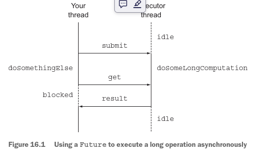
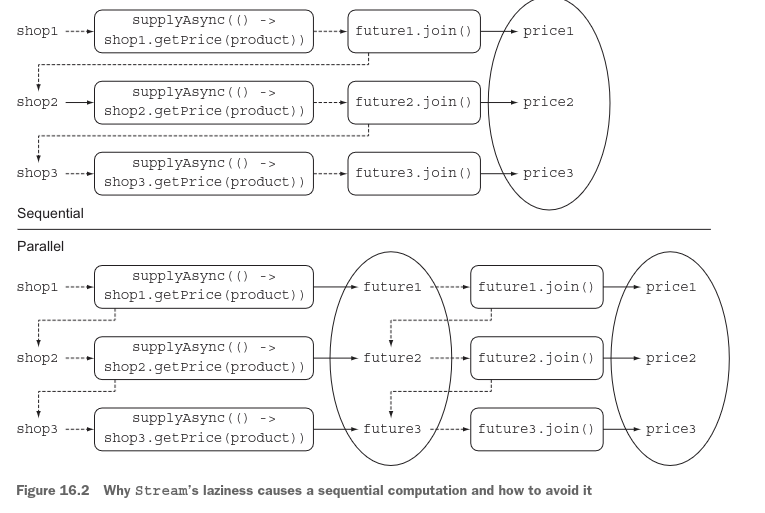
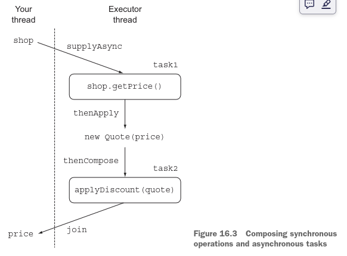
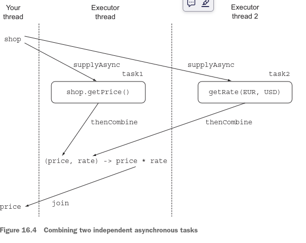

# CompletableFuture: programación asíncrona componible

### Este capítulo cubre
- Crear una computación asíncrona y recuperar su resultado
- Incrementar el rendimiento usando operaciones no bloqueantes
- Diseñar e implementar una API asíncrona
- Consumir asíncronamente una API síncrona
- Canalizar y fusionar dos o más operaciones asíncronas
- Reaccionar a la finalización de una operación asíncrona

El Capítulo 15 exploró el contexto moderno de concurrencia: que múltiples recursos de procesamiento (núcleos de CPU y 
similares) están disponibles, y quieres que tus programas exploten tantos de estos recursos como sea posible de una 
manera de alto nivel (en lugar de ensuciar tus programas con operaciones en hilos mal estructuradas y no mantenibles). 
Observamos que los streams paralelos y el paralelismo fork/join proporcionan construcciones de más alto nivel para 
expresar paralelismo en programas que iteran sobre colecciones y en programas que involucran divide-y-vencerás, pero que
las invocaciones a métodos proporcionan oportunidades adicionales para ejecutar código en paralelo. Java 8 y 9 introducen
dos APIs específicas para este propósito: CompletableFuture y el paradigma de programación reactiva. Este capítulo 
explica, mediante ejemplos de código prácticos, cómo la implementación de CompletableFuture de Java 8 de la interfaz 
Future te proporciona armas adicionales en tu arsenal de programación. También analiza las adiciones introducidas en 
Java 9.

## 16.1 Uso simple de Futures
La interfaz Future fue introducida en Java 5 para modelar un resultado disponible en algún momento en el futuro. Una 
consulta a un servicio remoto no estará disponible inmediatamente cuando el llamante realiza la solicitud, por ejemplo. 
La interfaz Future modela una computación asíncrona y proporciona una referencia a su resultado que se vuelve disponible
cuando la computación en sí misma se completa. Desencadenar una acción potencialmente costosa en tiempo dentro de un 
Future permite que el hilo llamante continúe haciendo trabajo útil en lugar de esperar el resultado de la operación. 
Puedes pensar en este proceso como llevar una bolsa de ropa a tu tintorería favorita. El tintorero te da un recibo para 
indicarte cuándo estarán limpia tu ropa (un Future); mientras tanto, puedes hacer otras actividades. Otra ventaja de 
Future es que es más amigable de usar que los hilos de más bajo nivel. Para trabajar con un Future, típicamente tienes 
que envolver la operación costosa en tiempo dentro de un objeto Callable y enviarlo a un ExecutorService. El siguiente 
listado muestra un ejemplo escrito antes de Java 8.

Listado 16.1 Ejecutando una operación de larga duración asíncronamente en un Future:
```java
//Crea un ExecutorService que te permita enviar tareas a un pool de hilos.
ExecutorService executor = Executors.newCachedThreadPool();
//Envía un Callable al ExecutorService.
Future<Double> future = executor.submit(new Callable<Double>() {
public Double call() {
    //Ejecuta una operación larga asíncronamente en un hilo separado.
return doSomeLongComputation();
}});
//Haz otra cosa mientras la operación asíncrona está progresando.
doSomethingElse();
try {
    //Recupera el resultado de la operación asíncrona, bloqueando si aún no está disponible pero esperando como 
    // máximo 1 segundo antes de agotar el tiempo de espera.
Double result = future.get(1, TimeUnit.SECONDS);
} catch (ExecutionException ee) {
// the computation threw an exception
} catch (InterruptedException ie) {
// the current thread was interrupted while waiting
} catch (TimeoutException te){
// the timeout expired before the Future completion
}
```
Como se representa en la figura 16.1, este estilo de programación permite que tu hilo realice algunas otras tareas 
mientras la operación de larga duración se ejecuta concurrentemente en un hilo separado proporcionado por el 
ExecutorService. Luego, cuando no puedes hacer ningún otro trabajo significativo sin tener el resultado de esa operación
asíncrona, puedes recuperarlo del Future invocando su método get. Este método devuelve inmediatamente el resultado de la
operación si ya se ha completado o bloquea tu hilo, esperando a que su resultado esté disponible.



Observa el problema con este escenario. ¿Qué pasa si la operación larga nunca regresa? Para manejar esta posibilidad, 
casi siempre es una buena idea usar la versión de dos argumentos de get, que toma un tiempo de espera especificando el 
tiempo máximo (junto con su unidad de tiempo) que tu hilo está dispuesto a esperar por el resultado del Future (como en 
el listado 16.1). La versión de cero argumentos de get esperaría indefinidamente.

### 16.1.1 Entendiendo los Futures y sus limitaciones
Este primer pequeño ejemplo muestra que la interfaz Future proporciona métodos para verificar si la computación asíncrona
está completa (usando el método isDone), esperar su finalización y recuperar su resultado. Pero estas características no
son suficientes para permitirte escribir código concurrente conciso. Es difícil, por ejemplo, expresar dependencias entre
los resultados de un Future. Declarativamente, es fácil especificar, "Cuando el resultado de la computación larga esté 
disponible, por favor envía su resultado a otra computación larga, y cuando eso termine, combina su resultado con el 
resultado de otra consulta". Implementar esta especificación con las operaciones disponibles en un Future es otra 
historia, por lo cual sería útil tener características más declarativas en la implementación, como estas:

- Combinar dos computaciones asíncronas tanto cuando son independientes como cuando la segunda depende del resultado de 
la primera
- Esperar la finalización de todas las tareas realizadas por un conjunto de Futures
- Esperar la finalización solo de la tarea más rápida en un conjunto de Futures (posiblemente porque los Futures están 
intentando calcular el mismo valor de diferentes maneras) y recuperar su resultado
- Completar programáticamente un Future (es decir, proporcionando el resultado de la operación asíncrona manualmente)
- Reaccionar a la finalización de un Future (es decir, ser notificado cuando ocurre la finalización y luego poder 
realizar una acción adicional con el resultado del Future en lugar de estar bloqueado mientras esperas su resultado)

En el resto de este capítulo, aprenderás cómo la clase CompletableFuture (que implementa la interfaz Future) hace 
posibles todas estas cosas de manera declarativa mediante las nuevas características de Java 8. Los diseños de Stream y 
CompletableFuture siguen patrones similares, porque ambos usan expresiones lambda y canalización. Por esta razón, podrías
decir que CompletableFuture es a un Future simple lo que Stream es a una Collection.

### 16.1.2 Usando CompletableFutures para construir una aplicación asíncrona
Para explorar las características de CompletableFuture, en esta sección desarrollas incrementalmente una aplicación 
buscadora-de-mejor-precio que contacta múltiples tiendas en línea para encontrar el precio más bajo para un producto o 
servicio dado. En el camino, aprendes varias habilidades importantes:

- Cómo proporcionar una API asíncrona para tus clientes (útil si eres el dueño de una de las tiendas en línea).
- Cómo hacer que tu código no sea bloqueante cuando eres un consumidor de una API síncrona. Descubres cómo canalizar dos
operaciones asíncronas subsecuentes, fusionándolas en una sola computación asíncrona. Esta situación surge, por ejemplo,
cuando la tienda en línea devuelve un código de descuento junto con el precio original del artículo que querías comprar.
Tienes que contactar un segundo servicio remoto de descuento para averiguar el porcentaje de descuento asociado con este
código de descuento antes de calcular el precio real de ese artículo.
- Cómo procesar reactivamente eventos que representan la finalización de una operación asíncrona y cómo hacerlo permite 
que la aplicación buscadora-de-mejor-precio actualice constantemente la cotización de mejor compra para el artículo que 
quieres comprar a medida que cada tienda devuelve su precio, en lugar de esperar a que todas las tiendas devuelvan sus 
respectivas cotizaciones. Esta habilidad también evita el escenario en el que el usuario ve una pantalla en blanco para
siempre si uno de los servidores de las tiendas está caído.

### API Síncrona vs. Asíncrona
La frase API síncrona es otra forma de hablar de una llamada tradicional a un método: la llamas, el llamante espera 
mientras el método computa, el método retorna, y el llamante continúa con el valor devuelto. Incluso si el llamante y el
llamado se ejecutaran en hilos diferentes, el llamante aún esperaría a que el llamado se completara. Esta situación da 
lugar a la frase llamada bloqueante.
Por el contrario, en una API asíncrona el método retorna inmediatamente (o al menos antes de que su computación esté 
completa), delegando su computación restante a un hilo, que se ejecuta asíncronamente respecto al llamante — de ahí la 
frase llamada no bloqueante. La computación restante entrega su valor al llamante llamando a un método callback, o el 
llamante invoca un método adicional "esperar hasta que la computación esté completa". Este estilo de computación es común
en la programación de sistemas de E/S: inicias un acceso a disco, que ocurre asíncronamente mientras haces más 
computación, y cuando no tienes nada más útil que hacer, esperas hasta que los bloques del disco se carguen en memoria. 
Nota que bloqueante y no bloqueante se usan a menudo para implementaciones específicas de E/S por el sistema operativo. 
Sin embargo, estos términos tienden a usarse indistintamente con asíncrono y síncrono incluso en contextos no 
relacionados con E/S.

## 16.2 Implementando una API asíncrona
Para comenzar a implementar la aplicación buscadora-de-mejor-precio, define la API que cada tienda debería proporcionar.
Primero, una tienda declara un método que devuelve el precio de un producto, dado su nombre:
```java
public class Shop {
    public double getPrice(String product) {
// to be implemented
    }
}
```
La implementación interna de este método consultaría la base de datos de la tienda, pero probablemente también realizaría
otras tareas costosas en tiempo, como contactar otros servicios externos (como los proveedores de la tienda o descuentos
promocionales relacionados con el fabricante). Para simular una ejecución de método tan larga, en el resto de este 
capítulo usas un método delay, que introduce un retardo artificial de 1 segundo, como se define en el siguiente listado.

Listado 16.2 Un método para simular un retardo de 1 segundo:
```java
public static void delay() {
    try {
        Thread.sleep(1000L);
    } catch (InterruptedException e) {
        throw new RuntimeException(e);
    }
}
```
Para los propósitos de este capítulo, puedes modelar el método getPrice llamando a delay y luego devolviendo un valor 
calculado aleatoriamente para el precio, como se muestra en el siguiente listado. El código para devolver un precio 
calculado aleatoriamente puede parecer un poco un truco; aleatoriza el precio basándose en el nombre del producto usando
el resultado de charAt como un número.

Listado 16.3 Introduciendo un retardo simulado en el método getPrice:
```java
public double getPrice(String product) {
    return calculatePrice(product);
}
private double calculatePrice(String product) {
    delay();
    return random.nextDouble() * product.charAt(0) + product.charAt(1);
}
```
Este código implica que cuando el consumidor de esta API (en este caso, la aplicación buscadora-de-mejor-precio) invoca 
este método, permanece bloqueado y luego está inactivo durante 1 segundo mientras espera su finalización síncrona. Esta 
situación es inaceptable, especialmente considerando que la aplicación buscadora-de-mejor-precio tiene que repetir esta
operación para todas las tiendas en su red. En las secciones subsecuentes de este capítulo, descubres cómo resolver este
problema consumiendo esta API síncrona de una manera asíncrona. Pero para los propósitos de aprender cómo diseñar una 
API asíncrona, continúas en esta sección pretendiendo estar al otro lado de la barricada. Eres un dueño de tienda sabio 
que se da cuenta de lo dolorosa que es esta API síncrona para sus usuarios, y quieres reescribirla como una API asíncrona
para hacer la vida más fácil a tus clientes.

### 16.2.1 Convirtiendo un método síncrono en uno asíncrono
Para lograr este objetivo, primero tienes que convertir el método getPrice en un método getPriceAsync y cambiar su valor
de retorno, como sigue:
```java
public Future<Double> getPriceAsync(String product) { ... }
```
Como mencionamos en la introducción de este capítulo, la interfaz java.util.concurrent.Future fue introducida en Java 5 
para representar el resultado de una computación asíncrona. (Es decir, se permite que el hilo llamante continúe sin 
bloquearse.) Un Future es un manejador para un valor que aún no está disponible pero que puede ser recuperado invocando 
su método get después de que su computación finalmente termina. Como resultado, el método getPriceAsync puede retornar 
inmediatamente, dando al hilo llamante la oportunidad de realizar otras computaciones útiles mientras tanto. La clase 
CompletableFuture de Java 8 te da varias posibilidades para implementar este método fácilmente, como se muestra en el 
siguiente listado.

Listado 16.4 Implementando el método getPriceAsync:
```java
public Future<Double> getPriceAsync(String product) {
    //Crea el CompletableFuture que contendrá el resultado de la computación.
    CompletableFuture<Double> futurePrice = new CompletableFuture<>();
    new Thread(() -> {
        //Ejecuta la computación asíncronamente en un Hilo diferente.
        double price = calculatePrice(product);
        //Establece el valor devuelto por la computación larga en el Future cuando esté disponible.
        futurePrice.complete(price);
    }).start();
    //Devuelve el Future sin esperar a que se complete la computación del resultado que contiene.
    return futurePrice;
}
```
Aquí, creas una instancia de CompletableFuture, representando una computación asíncrona y conteniendo un resultado cuando
esté disponible. Luego bifurcas un Hilo diferente que realizará el cálculo de precio real y devuelves la instancia de 
Future sin esperar a que termine ese cálculo de larga duración. Cuando el precio del producto solicitado esté finalmente
disponible, puedes completar el CompletableFuture, usando su método complete para establecer el valor. Esta 
característica también explica el nombre de esta implementación de Future de Java 8. Un cliente de esta API puede 
invocarla, como se muestra en el siguiente listado.

Listado 16.5 Usando una API asíncrona:
```java
Shop shop = new Shop("BestShop");
long start = System.nanoTime();
//Consulta a la tienda para recuperar el precio de un producto.
Future<Double> futurePrice = shop.getPriceAsync("my favorite product");
long invocationTime = ((System.nanoTime() - start) / 1_000_000);
System.out.println("Invocation returned after " + invocationTime
+ " msecs");
// Do some more tasks, like querying other shops
doSomethingElse();
// while the price of the product is being calculated
try {
    //Read the price from the Future or block until it becomes available
double price = futurePrice.get();
System.out.printf("Price is %.2f%n", price);
} catch (Exception e) {
throw new RuntimeException(e);
}
long retrievalTime = ((System.nanoTime() - start) / 1_000_000);
System.out.println("Price returned after " + retrievalTime + " msecs");
```
Como puedes ver, el cliente le pide a la tienda que obtenga el precio de un cierto producto. Debido a que la tienda 
proporciona una API asíncrona, esta invocación devuelve casi inmediatamente el Future, a través del cual el cliente puede
recuperar el precio del producto más tarde. Luego el cliente puede realizar otras tareas, como consultar otras tiendas, 
en lugar de permanecer bloqueado, esperando que la primera tienda produzca el resultado solicitado. Más tarde, cuando el
cliente no pueda hacer ningún otro trabajo significativo sin tener el precio del producto, puede invocar get en el 
Future. Al hacerlo, el cliente desempaqueta el valor contenido en el Future (si la tarea asíncrona ha terminado) o 
permanece bloqueado hasta que ese valor esté disponible.

La salida producida por el código en el listado 16.5 podría ser algo como esto:
```terminaloutput
Invocation returned after 43 msecs
Price is 123.26
Price returned after 1045 msecs
```
Puedes ver que la invocación del método getPriceAsync retorna mucho antes de que el cálculo del precio eventualmente 
termine. En la sección 16.4, aprendes que también es posible que el cliente evite cualquier riesgo de ser bloqueado. En 
cambio, el cliente puede ser notificado cuando el Future esté completo y puede ejecutar un código callback, definido a 
través de una expresión lambda o una referencia a método, solo cuando el resultado de la computación esté disponible. 
Por ahora, abordaremos otro problema: cómo gestionar un error durante la ejecución de la tarea asíncrona.

### 16.2.2 Manejando errores
El código que has desarrollado hasta ahora funciona correctamente si todo va bien. Pero ¿qué sucede si el cálculo del 
precio genera un error? Desafortunadamente, en este caso obtienes un resultado particularmente negativo: la excepción 
lanzada para señalar el error permanece confinada en el hilo que está intentando calcular el precio del producto, y 
finalmente mata el hilo. Como consecuencia, el cliente permanece bloqueado para siempre, esperando que llegue el 
resultado del método get.
El cliente puede prevenir este problema usando una versión sobrecargada del método get que también acepta un tiempo de 
espera. Es una buena práctica usar un tiempo de espera para prevenir situaciones similares en otras partes de tu código.
De esta forma, el cliente al menos evita esperar indefinidamente, pero cuando el tiempo de espera expira, se le notifica
con una TimeoutException. Como consecuencia, el cliente no tendrá oportunidad de descubrir qué causó esa falla dentro 
del hilo que intentaba calcular el precio del producto. Para hacer que el cliente sea consciente de la razón por la cual
la tienda no pudo proporcionar el precio del producto solicitado, tienes que propagar la Excepción que causó el problema
dentro del CompletableFuture a través de su método completeExceptionally. Aplicando esta idea al listado 16.4 se produce
el código mostrado en el siguiente listado.

Listado 16.6 Propagando un error dentro del CompletableFuture:
```java
public Future<Double> getPriceAsync(String product) {
    CompletableFuture<Double> futurePrice = new CompletableFuture<>();
    new Thread(() -> {
        try {
            double price = calculatePrice(product);
            //Si el cálculo del precio se completa normalmente, completa el Future con el precio.
            futurePrice.complete(price);
        } catch (Exception ex) {
            //De lo contrario, completa el Future excepcionalmente con la Excepción que causó la falla.
            futurePrice.completeExceptionally(ex);
        }
    }).start();
    return futurePrice;
}
```
Ahora el cliente será notificado con una ExecutionException (que toma un parámetro Exception conteniendo la causa la 
Excepción original lanzada por el método de cálculo del precio). Si ese método lanza una RuntimeException diciendo que 
el producto no está disponible, por ejemplo, el cliente obtiene una ExecutionException como la siguiente:
```terminaloutput
Exception in thread "main" java.lang.RuntimeException:
java.util.concurrent.ExecutionException: java.lang.RuntimeException:
product not available
at java89inaction.chap16.AsyncShopClient.main(AsyncShopClient.java:16)
Caused by: java.util.concurrent.ExecutionException: java.lang.RuntimeException:
product not available
at java.base/java.util.concurrent.CompletableFuture.reportGet
(CompletableFuture.java:395)
at java.base/java.util.concurrent.CompletableFuture.get
(CompletableFuture.java:1999)
at java89inaction.chap16.AsyncShopClient.main(AsyncShopClient.java:14)
Caused by: java.lang.RuntimeException: product not available
at java89inaction.chap16.AsyncShop.calculatePrice(AsyncShop.java:38)
at java89inaction.chap16.AsyncShop.lambda$0(AsyncShop.java:33)
at java.base/java.util.concurrent.CompletableFuture$AsyncSupply.run
(CompletableFuture.java:1700)
at java.base/java.util.concurrent.CompletableFuture$AsyncSupply.exec
(CompletableFuture.java:1692)
at java.base/java.util.concurrent.ForkJoinTask.doExec(ForkJoinTask.java:283)
at java.base/java.util.concurrent.ForkJoinPool.runWorker
(ForkJoinPool.java:1603)
at java.base/java.util.concurrent.ForkJoinWorkerThread.run
(ForkJoinWorkerThread.java:175)
```
### Creando un CompletableFuture con el metodo de fabrica SupplyAsync
Hasta ahora, has creado CompletableFutures y los has completado programáticamente cuando parecía conveniente hacerlo, 
pero la clase CompletableFuture viene con muchos métodos de fábrica útiles que pueden hacer este proceso mucho más fácil
y menos verboso. El método supplyAsync, por ejemplo, te permite reescribir el método getPriceAsync del listado 16.4 con 
una sola sentencia, como se muestra en el siguiente listado.

Listado 16.7 Creando un CompletableFuture con el método de fábrica supplyAsync:
```java
public Future<Double> getPriceAsync(String product) {
    return CompletableFuture.supplyAsync(() -> calculatePrice(product));
}
```
El método supplyAsync acepta un Supplier como argumento y devuelve un CompletableFuture que será completado 
asíncronamente con el valor obtenido al invocar ese Supplier. Este Supplier es ejecutado por uno de los Executors en el 
ForkJoinPool, pero puedes especificar un Executor diferente pasándolo como segundo argumento a la versión sobrecargada 
de este método. Más generalmente, puedes pasar un Executor a todos los demás métodos de fábrica de CompletableFuture. 
Usas esta capacidad en la sección 16.3.4, donde demostramos que usar un Executor que se ajuste a las características de 
tu aplicación puede tener un efecto positivo en su rendimiento.
También nota que el CompletableFuture devuelto por el método getPriceAsync en el listado 16.7 es equivalente al que 
creaste y completaste manualmente en el listado 16.6, lo que significa que proporciona la misma gestión de errores que 
agregaste cuidadosamente.
Para el resto de este capítulo, supondremos que no tienes control sobre la API implementada por la clase Shop y que 
proporciona solo métodos de bloqueo síncronos. Esta situación ocurre típicamente cuando quieres consumir una API HTTP 
proporcionada por algún servicio. Ves cómo todavía es posible consultar múltiples tiendas asíncronamente, evitando así 
quedarte bloqueado en una sola solicitud y, por lo tanto, incrementando el rendimiento y la capacidad de procesamiento 
de tu aplicación buscadora-de-mejor-precio.

## 16.3 Haciendo tu código no bloqueante
Te han pedido que desarrolles una aplicación buscadora-de-mejor-precio, y todas las tiendas que tienes que consultar 
proporcionan solo la misma API síncrona implementada como se mostró al principio de la sección 16.2. En otras palabras, 
tienes una lista de tiendas, como esta:
```java
List<Shop> shops = List.of(new Shop("BestPrice"),
new Shop("LetsSaveBig"),
new Shop("MyFavoriteShop"),
new Shop("BuyItAll"));
```
Tienes que implementar un método con la siguiente firma, que, dado el nombre de un producto, devuelve una lista de 
strings. Cada string contiene el nombre de una tienda y el precio del producto solicitado en esa tienda, como sigue:
```java
public List<String> findPrices(String product);
```
Tu primera idea probablemente será usar las características de Stream que aprendiste en los capítulos 4, 5 y 6. Puede 
que te sientas tentado a escribir algo como el siguiente listado. (Sí, es bueno si ya estás pensando que esta primera 
solución es mala.)

Listado 16.8 Una implementación de findPrices consultando secuencialmente todas las tiendas:
```java
public List<String> findPrices(String product) {
    return shops.stream()
            .map(shop -> String.format("%s price is %.2f",
                    shop.getName(), shop.getPrice(product)))
            .collect(toList());
}
```
Esta solución es directa. Ahora intenta poner el método findPrices a funcionar con el único producto que deseas locamente
estos días: el myPhone27S. Además, registra cuánto tiempo toma ejecutarse el método, como se muestra en el siguiente 
listado. Esta información te permite comparar el rendimiento del método con el del método mejorado que desarrollarás más
tarde.

Listado 16.9 Verificando la corrección y el rendimiento de findPrices:
```java
long start = System.nanoTime();
System.out.println(findPrices("myPhone27S"));
long duration = (System.nanoTime() - start) / 1_000_000;
System.out.println("Done in " + duration + " msecs");
```
El código en el listado 16.9 produce una salida como esta:
```terminaloutput
[BestPrice price is 123.26, LetsSaveBig price is 169.47, MyFavoriteShop price
is 214.13, BuyItAll price is 184.74]
Done in 4032 msecs
```
Como era de esperar, el tiempo que tarda el método findPrices en ejecutarse es unos pocos milisegundos más de 4 segundos,
porque las cuatro tiendas son consultadas secuencialmente y bloqueando una tras otra, y cada tienda tarda 1 segundo en 
calcular el precio del producto solicitado. ¿Cómo puedes mejorar este resultado?

### 16.3.1 Paralelizando solicitudes usando un Stream paralelo
Después de leer el capítulo 7, la primera y más rápida mejora que debería ocurrírseme sería evitar esta computación 
secuencial usando un Stream paralelo en lugar de uno secuencial, como se muestra en el siguiente listado.

Listado 16.10 Paralelizando el método findPrices:
```java
public List<String> findPrices(String product) {
    //Usa un Stream paralelo para recuperar los precios de las diferentes tiendas en paralelo.
    return shops.parallelStream()
            .map(shop -> String.format("%s price is %.2f",
                    shop.getName(), shop.getPrice(product)))
            .collect(toList());
}
```
Averigua si esta nueva versión de findPrices es mejor ejecutando nuevamente el código en el listado 16.9:
```terminaloutput
[BestPrice price is 123.26, LetsSaveBig price is 169.47, MyFavoriteShop price
is 214.13, BuyItAll price is 184.74]
Done in 1180 msecs
```
¡Bien hecho! Parece que esta idea es simple pero efectiva. Ahora las cuatro tiendas son consultadas en paralelo, por lo 
que el código tarda un poco más de un segundo en completarse.
¿Puedes hacerlo incluso mejor? Intenta convertir todas las invocaciones síncronas a las tiendas en el método findPrices 
en invocaciones asíncronas, usando lo que has aprendido hasta ahora sobre CompletableFutures.

### 16.3.2 Haciendo solicitudes asíncronas con CompletableFutures
Viste anteriormente que puedes usar el método de fábrica supplyAsync para crear objetos CompletableFuture. Ahora úsalo:
```java
List<CompletableFuture<String>> priceFutures =
shops.stream()
.map(shop -> CompletableFuture.supplyAsync(
() -> String.format("%s price is %.2f",
shop.getName(), shop.getPrice(product))))
.collect(toList());
```
Con este enfoque, obtienes un List<CompletableFuture<String>>, donde cada CompletableFuture en el List contiene el String
nombre de una tienda cuando su computación está completa. Pero debido a que el método findPrices que estás intentando 
reimplementar con CompletableFutures tiene que devolver un List<String>, tendrás que esperar la finalización de todos 
estos futures y extraer los valores que contienen antes de devolver el List. Para lograr este resultado, puedes aplicar 
una segunda operación map al List<CompletableFuture<String>> original, invocando join en todos los futures en el List y 
luego esperando su finalización uno por uno. Nota que el método join de la clase CompletableFuture tiene el mismo 
significado que el método get también declarado en la interfaz Future, siendo la única diferencia que join no lanza 
ninguna excepción verificada. Al usar join, no tienes que inflar la expresión lambda pasada a este segundo map con un
bloque try/catch. Juntando todo, puedes reescribir el método findPrices como se muestra en el listado que sigue.

Listado 16.11 Implementando el método findPrices con CompletableFutures:
```java
public List<String> findPrices(String product) {
    List<CompletableFuture<String>> priceFutures =
            shops.stream()
                    //Calcula cada precio asíncronamente con un CompletableFuture
                    .map(shop -> CompletableFuture.supplyAsync(
                            () -> shop.getName() + " price is " +
                                    shop.getPrice(product)))
                    .collect(Collectors.toList());
    return priceFutures.stream()
            //Espera la finalización de todas las operaciones asíncronas.
            .map(CompletableFuture::join)
            .collect(toList());
}
```
Nota que usas dos pipelines de stream separados en lugar de poner las dos operaciones map una después de la otra en el 
mismo pipeline de procesamiento de stream — y por una buena razón. Dada la naturaleza perezosa de las operaciones 
intermedias de stream, si hubieras procesado el stream en un solo pipeline, habrías logrado solo ejecutar todas las 
solicitudes a las diferentes tiendas síncrona y secuencialmente. La creación de cada CompletableFuture para interrogar a
una tienda dada comenzaría solo cuando la computación de la anterior se completara, dejando que el método join devuelva 
el resultado de esa computación. La figura 16.2 aclara este importante detalle.
La mitad superior de la figura 16.2 muestra que procesar el stream con un solo pipeline implica que el orden de 
evaluación (identificado por la línea punteada) es secuencial. De hecho, un nuevo CompletableFuture se crea solo después
de que el anterior se haya evaluado completamente. Por el contrario, la mitad inferior de la figura demuestra cómo 
primero reunir los CompletableFutures en una lista (representada por el óvalo) permite que todos ellos comiencen antes 
de esperar su finalización.
Ejecutando el código en el listado 16.11 para verificar el rendimiento de esta tercera versión del método findPrices, 
podrías obtener una salida como esta:
```terminaloutput
[BestPrice price is 123.26, LetsSaveBig price is 169.47, MyFavoriteShop price is 214.13, BuyItAll price is 184.74]
Done in 2005 msecs
```
Este resultado es bastante decepcionante, ¿no es así? Con un tiempo de ejecución de más de 2 segundos, esta 
implementación con CompletableFutures es más rápida que la implementación secuencial y bloqueante original del 
listado 16.8. Pero también es casi el doble de lenta que la implementación anterior usando un stream paralelo. Es aún 
más decepcionante considerando el hecho de que obtuviste la versión de stream paralelo con un cambio trivial a la 
versión secuencial.
La versión más nueva con CompletableFutures requirió bastante trabajo. Pero ¿es usar CompletableFutures en este 
escenario una pérdida de tiempo? ¿O estás pasando por alto algo importante? Tómate unos minutos antes de seguir adelante,
recordando particularmente que estás probando los ejemplos de código en una máquina que es capaz de ejecutar cuatro 
hilos en paralelo.



### 16.3.3 Buscando la solución que escala mejor
La versión de stream paralelo se desempeña tan bien solo porque puede ejecutar cuatro tareas en paralelo, por lo que es 
capaz de asignar exactamente un hilo para cada tienda. ¿Qué sucede si decides agregar una quinta tienda a la lista de 
tiendas rastreadas por tu aplicación buscadora-de-mejor-precio? No es sorprendente que la versión secuencial requiera un
poco más de 5 segundos para ejecutarse, como se muestra en la siguiente salida:
```terminaloutput
[BestPrice price is 123.26, LetsSaveBig price is 169.47, MyFavoriteShop price
is 214.13, BuyItAll price is 184.74, ShopEasy price is 166.08]
Done in 5025 msecs ##La salida del programa usando un stream secuencial
```
Desafortunadamente, la versión de stream paralelo también requiere un segundo completo más que antes, porque los cuatro
hilos que puede ejecutar en paralelo (disponibles en el pool de hilos común) están ahora ocupados con las primeras 
cuatro tiendas. La quinta consulta tiene que esperar la finalización de una de las operaciones anteriores para liberar 
un hilo, como sigue:
```terminaloutput
[BestPrice price is 123.26, LetsSaveBig price is 169.47, MyFavoriteShop price
is 214.13, BuyItAll price is 184.74, ShopEasy price is 166.08]
Done in 2167 msecs ##La salida del programa usando un stream paralelo
```
¿Qué pasa con la versión de CompletableFuture? Pruébalo con la quinta tienda:
```terminaloutput
BestPrice price is 123.26, LetsSaveBig price is 169.47, MyFavoriteShop price
is 214.13, BuyItAll price is 184.74, ShopEasy price is 166.08]
Done in 2006 msecs ##La salida del programa usando CompletableFutures
```
La versión de CompletableFuture parece ser un poco más rápida que la que usa stream paralelo, pero esta versión tampoco 
es satisfactoria. Si intentas ejecutar tu código con nueve tiendas, la versión de stream paralelo tarda 3143 
milisegundos, mientras que la versión de CompletableFuture requiere 3009 milisegundos. Las versiones parecen equivalentes
por una buena razón: ambas usan internamente el mismo pool común que por defecto tiene un número fijo de hilos igual al 
devuelto por Runtime.getRuntime().availableProcessors(). Sin embargo, la versión de CompletableFutures tiene una ventaja:
en contraste con la API de Streams paralelos, te permite especificar un Executor diferente para enviar tareas. Puedes 
configurar este Executor, y dimensionar su pool de hilos, de una manera que se ajuste mejor a los requisitos de tu 
aplicación. En la siguiente sección, traduces este mejor nivel de configurabilidad en una ganancia práctica de 
rendimiento para tu aplicación.

### 16.3.4 Usando un Executor personalizado
En este caso, una elección sensata parece ser crear un Executor con un número de hilos en su pool que tenga en cuenta la
carga de trabajo real que podrías esperar en tu aplicación. ¿Cómo dimensionas este Executor correctamente?

### Dimensionando pools de hilos
En el gran libro Java Concurrency in Practice (Addison-Wesley, 2006; http://jcip.net), Brian Goetz y sus coautores dan 
algunos consejos sobre cómo encontrar el tamaño óptimo para un pool de hilos. Este consejo es importante porque si el 
número de hilos en el pool es demasiado grande, los hilos terminan compitiendo por los escasos recursos de CPU y memoria,
perdiendo su tiempo realizando cambios de contexto. Por el contrario, si este número es demasiado pequeño (como 
probablemente lo es en tu aplicación), algunos de los núcleos de la CPU permanecerán infrautilizados. Goetz sugiere que 
puedes calcular el tamaño de pool correcto para aproximar una tasa de uso de CPU deseada con la siguiente fórmula:
```math
Nthreads = NCPU * UCPU * (1 + W/C)
```
En esta fórmula, NCPU es el número de núcleos, disponible a través de Runtime.getRuntime().availableProcessors()
- UCPU es el uso objetivo de CPU (entre 0 y 1).
- W/C es la relación entre tiempo de espera y tiempo de cómputo

La aplicación está gastando aproximadamente el 99 por ciento de su tiempo esperando las respuestas de las tiendas, por 
lo que podrías estimar una relación W/C de 100. Si tu objetivo es un 100 por ciento de uso de CPU, deberías tener un 
pool con 400 hilos. En la práctica, es derrochador tener más hilos que tiendas, porque tendrás hilos en tu pool que 
nunca se usan. Por esta razón, necesitas configurar un Executor con un número fijo de hilos igual al número de tiendas 
que tienes que consultar, para que tengas un hilo para cada tienda. También establece un límite superior de 100 hilos 
para evitar una caída del servidor para un número mayor de tiendas, como se muestra en el siguiente listado.

Listado 16.12 Un Executor personalizado que se ajusta a la aplicación buscadora-de-mejor-precio:
```java
private final Executor executor =
Executors.newFixedThreadPool(Math.min(shops.size(), 100),
(Runnable r) -> {
    Thread t = new Thread(r);
    t.setDaemon(true);
    return t;
}
);
```
Nota que estás creando un pool compuesto de hilos daemon. Un programa Java no puede terminar o salir mientras un hilo 
normal está ejecutándose, por lo que un hilo sobrante esperando un evento que nunca se satisfará causa problemas. Por el
contrario, marcar un hilo como daemon significa que puede ser eliminado en la terminación del programa. No hay diferencia
de rendimiento. Ahora puedes pasar el nuevo Executor como el segundo argumento del método de fábrica supplyAsync. Además,
ahora crea el CompletableFuture que recupera el precio del producto solicitado de una tienda dada de la siguiente manera:
```java
CompletableFuture.supplyAsync(() -> shop.getName() + " price is " +
shop.getPrice(product), executor);
```
Después de esta mejora, la solución de CompletableFutures tarda 1021 milisegundos en procesar cinco tiendas y 1022 
milisegundos en procesar nueve tiendas. Esta tendencia continúa hasta que el número de tiendas alcanza el umbral de 400 
que calculaste anteriormente. Este ejemplo demuestra el hecho de que es una buena idea crear un Executor que se ajuste a
las características de tu aplicación y usar CompletableFutures para enviar tareas a él. Esta estrategia es casi siempre 
efectiva y algo a considerar cuando haces uso intensivo de operaciones asíncronas.

### Paralelismo: ¿mediante Streams o CompletableFutures?
Has visto dos formas de hacer computación paralela en una colección: convertir la colección a un stream paralelo y usar 
operaciones como map en él, o iterar sobre la colección y lanzar operaciones dentro de un CompletableFuture. Esta última
técnica proporciona más control al redimensionar pools de hilos, lo que asegura que tu computación general no se bloquee
porque todos tus (número fijo de) hilos están esperando E/S.

Nuestro consejo para usar estas APIs es el siguiente:
- Si estás haciendo operaciones de cómputo pesado sin E/S, la interfaz Stream proporciona la implementación más simple y
la que probablemente sea más eficiente. (Si todos los hilos están limitados por cómputo, no tiene sentido tener más hilos
que núcleos de procesador.)
- Si tus unidades paralelas de trabajo implican esperar E/S (incluyendo conexiones de red), la solución de 
CompletableFutures proporciona más flexibilidad y te permite igualar el número de hilos a la relación espera/cómputo 
(W/C), como se discutió anteriormente. Otra razón para evitar usar streams paralelos cuando hay esperas de E/S 
involucradas en el pipeline de procesamiento del stream es que la pereza de los streams puede hacer más difícil razonar 
sobre cuándo ocurren las esperas.
Has aprendido cómo aprovechar CompletableFutures para proporcionar una API asíncrona a tus clientes y para funcionar 
como el cliente de un servidor síncrono pero lento, pero realizaste solo una operación costosa en tiempo en cada Future.
En la siguiente sección, usas CompletableFutures para canalizar múltiples operaciones asíncronas en un estilo declarativo
similar al que aprendiste usando la API de Streams.

### 16.4 Canalizando tareas asíncronas
Supongamos que todas las tiendas han acordado usar un servicio de descuento centralizado. Este servicio usa cinco códigos
de descuento, cada uno de los cuales tiene un porcentaje de descuento diferente. Representas esta idea definiendo una 
enumeración Discount.Code, como se muestra en el siguiente listado.

Listado 16.13 Una enumeración que define los códigos de descuento:
```java
public class Discount {
    public enum Code {
        NONE(0), SILVER(5), GOLD(10), PLATINUM(15), DIAMOND(20);
        private final int percentage;

        Code(int percentage) {
            this.percentage = percentage;
        }
    }
// Discount class implementation omitted, see Listing 16.14
}
```
También supón que las tiendas han acordado cambiar el formato del resultado del método getPrice, que ahora devuelve un 
String en el formato NombreTienda:precio:CódigoDescuento. Tu implementación de ejemplo devuelve un Discount.Code 
aleatorio junto con el precio aleatorio ya calculado, de la siguiente manera:
```java
public String getPrice(String product) {
    double price = calculatePrice(product);
    Discount.Code code = Discount.Code.values()[
            random.nextInt(Discount.Code.values().length)];
    return String.format("%s:%.2f:%s", name, price, code);
}
private double calculatePrice(String product) {
    delay();
    return random.nextDouble() * product.charAt(0) + product.charAt(1);
}
```
Invocar getPrice podría entonces devolver un String como
```terminaloutput
BestPrice:123.26:GOLD
```
### 16.4.1 Implementando un servicio de descuento
Tu aplicación buscadora-de-mejor-precio debería ahora obtener los precios de las tiendas; analizar los Strings 
resultantes; y, para cada String, consultar lo que necesita el servidor de descuentos. Este proceso determina el precio 
final con descuento del producto solicitado. (El porcentaje de descuento real asociado con cada código de descuento 
podría cambiar, por eso consultas el servidor cada vez.) El análisis de los Strings producidos por la tienda está 
encapsulado en la siguiente clase Quote:
```java
public class Quote {
private final String shopName;
private final double price;
private final Discount.Code discountCode;
    public Quote(String shopName, double price, Discount.Code code) {
        this.shopName = shopName;
        this.price = price;
        this.discountCode = code;
    }
    public static Quote parse(String s) {
        String[] split = s.split(":");
        String shopName = split[0];
        double price = Double.parseDouble(split[1]);
        Discount.Code discountCode = Discount.Code.valueOf(split[2]);
        return new Quote(shopName, price, discountCode);
    }
    public String getShopName() { return shopName; }
    public double getPrice() { return price; }
    public Discount.Code getDiscountCode() { return discountCode; }
}
```
Puedes obtener una instancia de la clase Quote — que contiene el nombre de la tienda, el precio sin descuento y el código
de descuento — pasando el String producido por una tienda al método de fábrica estático parse.
El servicio Discount también tiene un método applyDiscount que acepta un objeto Quote y devuelve un String indicando el 
precio con descuento para la tienda que produjo esa cotización, como se muestra en el siguiente listado.

Listado 16.14 El servicio Discount:
```java
public class Discount {
    public enum Code {
// source omitted ...
    }

    public static String applyDiscount(Quote quote) {
        return quote.getShopName() + " price is " +
                Discount.apply(quote.getPrice(),//Aplica el código de descuento al precio original.
                        quote.getDiscountCode());
    }

    private static double apply(double price, Code code) {
        delay(); //Simular un retraso en la respuesta del servicio Discount.
        return format(price * (100 - code.percentage) / 100);
    }
}
```
### 16.4.2 Uso del servicio Discount
Debido a que el servicio Discount es un servicio remoto, nuevamente agregas un retraso simulado de 1 segundo, como se 
muestra en el siguiente listado. Como hiciste en la sección 16.3, primero intenta reimplementar el método findPrices 
para ajustarlo a estos nuevos requisitos de la manera más obvia (pero, lamentablemente, secuencial y síncrona).

Listado 16.15 Implementación más simple de findPrices que usa el servicio Discount:
```java
public List<String> findPrices(String product) {
    return shops.stream()
            //Recupera el precio sin descuento de cada tienda.
            .map(shop -> shop.getPrice(product))
            //Transforma los Strings devueltos por las tiendas en objetos Quote.
            .map(Quote::parse)
            //Contacta al servicio Discount para aplicar el descuento en cada Quote.
            .map(Discount::applyDiscount)
            .collect(toList());
}
```
Obtienes el resultado deseado encadenando tres operaciones map sobre el stream de tiendas:
- La primera operación transforma cada tienda en un String que codifica el precio y el código de descuento del producto 
solicitado para esa tienda.
- La segunda operación analiza esos Strings, convirtiendo cada uno en un objeto Quote.
- La tercera operación contacta el servicio remoto Discount, que calcula el precio final con descuento y devuelve otro 
String que contiene el nombre de la tienda con ese precio.
Como te imaginarás, el rendimiento de esta implementación está lejos de ser óptimo. Pero intenta medirlo como de 
costumbre ejecutando tu benchmark.
```terminaloutput
[BestPrice price is 110.93, LetsSaveBig price is 135.58, MyFavoriteShop price
is 192.72, BuyItAll price is 184.74, ShopEasy price is 167.28]
Done in 10028 msecs
```
Como era de esperar, este código tarda 10 segundos en ejecutarse, porque los 5 segundos necesarios para consultar las 
cinco tiendas secuencialmente se suman a los 5 segundos consumidos por el servicio Discount al aplicar el código de 
descuento a los precios devueltos por las cinco tiendas. Ya sabes que puedes mejorar este resultado convirtiendo el 
stream en uno paralelo. Pero también sabes (de la sección 16.3) que esta solución no escala bien cuando aumentas el 
número de tiendas a consultar, debido al pool de hilos común fijo del que dependen los streams. Por el contrario, 
aprendiste que puedes usar mejor tu CPU definiendo un Executor personalizado que programe las tareas realizadas por los 
CompletableFuture.

### 16.4.3 Composición de operaciones síncronas y asíncronas
En esta sección, intentas reimplementar el método findPrices de forma asíncrona, usando nuevamente las características 
proporcionadas por CompletableFuture. El siguiente listado muestra el código. No te preocupes si algo parece desconocido; 
explicamos el código en esta sección.

Listado 16.16 Implementación del método findPrices con CompletableFutures:
```java
public List<String> findPrices(String product) {
    List<CompletableFuture<String>> priceFutures =
            shops.stream()
                    //Recupera de forma asíncrona el precio sin descuento de cada tienda.
                    .map(shop -> CompletableFuture.supplyAsync(
                            () -> shop.getPrice(product), executor))
                    //Transforma el String devuelto por una tienda en un objeto Quote cuando esté disponible.
                    .map(future -> future.thenApply(Quote::parse))
                    //Componer el Future resultante con otra tarea asíncrona, aplicando el código de descuento.
                    .map(future -> future.thenCompose(quote ->
                            CompletableFuture.supplyAsync(
                                    () -> Discount.applyDiscount(quote), executor)))
                    .collect(toList());
    return priceFutures.stream()
            //Espera a que todos los Futures en el stream se completen y extrae sus respectivos resultados.
            .map(CompletableFuture::join)
            .collect(toList());
}
```
Las cosas se ven un poco más complejas esta vez, así que intenta entender lo que sucede paso a paso. La figura 16.3 
describe la secuencia de estas tres transformaciones.



Estás realizando las mismas tres operaciones map que hiciste en la solución síncrona del listado 16.15, pero haces que 
esas operaciones sean asíncronas cuando es necesario, usando la funcionalidad proporcionada por la clase 
CompletableFuture.

### Obtencion de los Precios
Ya has visto la primera de estas tres operaciones en varios ejemplos de este capítulo; consultas la tienda de forma 
asíncrona pasando una expresión lambda al método de fábrica supplyAsync. El resultado de esta primera transformación es 
un Stream<CompletableFuture<String>>, donde cada CompletableFuture contiene, cuando se completa, el String devuelto por
la tienda correspondiente. Ten en cuenta que configuras los CompletableFuture con el Executor personalizado desarrollado
en el listado 16.12.

### Analisis de los Quotes
Ahora tienes que convertir esos Strings a Quotes con una segunda transformación. Pero debido a que esta operación de 
análisis no invoca ningún servicio remoto ni realiza E/S en general, puede ejecutarse casi instantáneamente y de forma 
síncrona sin introducir retraso alguno. Por esta razón, implementas esta segunda transformación invocando el método 
thenApply en los CompletableFuture producidos por el primer paso y pasándole una Function que convierte un String en una
instancia de Quote.
Ten en cuenta que usar el método thenApply no bloquea tu código hasta que el CompletableFuture sobre el que lo invocas 
se complete. Cuando el CompletableFuture finalmente se completa, transformas el valor que contiene usando la expresión 
lambda pasada al método thenApply, transformando así cada CompletableFuture<String> en el stream en un 
CompletableFuture<Quote> correspondiente. Puedes ver este proceso como construir una receta que especifica qué hacer con
el resultado del CompletableFuture, como cuando trabajabas con un pipeline de streams.

### Compocision de los Futures para calcular el precio con descuento
La tercera operación map implica contactar al servicio remoto Discount para aplicar el porcentaje de descuento apropiado
a los precios sin descuento recibidos de las tiendas. Esta transformación es diferente de la anterior porque debe 
ejecutarse de forma remota (o, en este caso, simular la invocación remota con un retraso), y por esta razón, también 
quieres realizarla de forma asíncrona.
Para lograr este objetivo, como hiciste con la primera invocación de supplyAsync con getPrice, pasas esta operación como
una expresión lambda al método de fábrica supplyAsync, que devuelve otro CompletableFuture. En este punto tienes dos 
operaciones asíncronas, modeladas con dos CompletableFuture distintos, que quieres realizar en cascada:

- Recuperar el precio de una tienda y luego transformarlo en un Quote.
- Tomar este Quote y pasarlo al servicio Discount para obtener el precio final con descuento.

La API de CompletableFuture de Java 8 proporciona el método thenCompose específicamente para este propósito, 
permitiéndote encadenar dos operaciones asíncronas, pasando el resultado de la primera operación a la segunda cuando 
esté disponible. En otras palabras, puedes componer dos CompletableFuture invocando el método thenCompose en el primer 
CompletableFuture y pasándole una Function. Esta Function tiene como argumento el valor devuelto por ese primer 
CompletableFuture cuando se completa, y devuelve un segundo CompletableFuture que usa el resultado del primero como 
entrada para su cómputo. Ten en cuenta que con este enfoque, mientras los Futures recuperan los quotes de las tiendas, 
el hilo principal puede realizar otras operaciones útiles, como responder a eventos de la interfaz de usuario.
Al recolectar los elementos del Stream resultante de estas tres operaciones map en una Lista, obtienes una 
List<CompletableFuture<String>>. Finalmente, puedes esperar la finalización de esos CompletableFuture y extraer sus 
valores usando join, exactamente como hiciste en el listado 16.11. Esta nueva versión del método findPrices implementada
en el listado 16.8 podría producir una salida como esta:
```terminaloutput
[BestPrice price is 110.93, LetsSaveBig price is 135.58, MyFavoriteShop price
is 192.72, BuyItAll price is 184.74, ShopEasy price is 167.28]
Done in 2035 msecs
```
El método thenCompose que usaste en el listado 16.16, como otros métodos de la clase CompletableFuture, tiene una 
variante con el sufijo Async, thenComposeAsync. En general, un método sin el sufijo Async en su nombre ejecuta su tarea 
en el mismo hilo que la tarea anterior, mientras que un método que termina con Async siempre envía la tarea siguiente al
pool de hilos, por lo que cada una de las tareas puede ser manejada por un hilo diferente. En este caso, el resultado 
del segundo CompletableFuture depende del primero, por lo que no hay diferencia en el resultado final ni en el tiempo 
general, ya sea que compongas los dos CompletableFuture con una u otra variante de este método. Elegiste usar thenCompose
solo porque es ligeramente más eficiente debido a menos sobrecarga de cambio de hilo. Sin embargo, ten en cuenta que no 
siempre está claro qué hilo se está utilizando, especialmente si ejecutas una aplicación que gestiona su propio pool de
hilos (como Spring).

### 16.4.4 Combinación de dos CompletableFuture: dependientes e independientes
En el listado 16.16, invocaste el método thenCompose en un CompletableFuture y le pasaste un segundo CompletableFuture, 
que necesitaba como entrada el valor resultante de la ejecución del primero. En otro caso común, necesitas combinar los 
resultados de las operaciones realizadas por dos CompletableFuture independientes, y no quieres esperar a que el primero
se complete antes de comenzar el segundo.
En situaciones como esta, usa el método thenCombine. Este método toma como segundo argumento una BiFunction, que define 
cómo se combinarán los resultados de los dos CompletableFuture cuando ambos estén disponibles. Al igual que thenCompose,
el método thenCombine tiene una variante Async. En este caso, usar el método thenCombineAsync hace que la operación de 
combinación definida por la BiFunction se envíe al pool de hilos y luego se ejecute de forma asíncrona en una tarea 
separada.
Volviendo al ejemplo práctico de este capítulo, puede que sepas que una de las tiendas proporciona precios en € (EUR), 
pero siempre quieres comunicarlos a tus clientes en $ (USD). Puedes preguntar de forma asíncrona a la tienda el precio 
de un producto dado y recuperar por separado, desde un servicio remoto de tipo de cambio, la tasa de cambio actual entre
€ y $. Una vez que ambas solicitudes se hayan completado, puedes combinar los resultados multiplicando el precio por la 
tasa de cambio. Con este enfoque, obtienes un tercer CompletableFuture que se completa cuando los resultados de los dos 
CompletableFuture están ambos disponibles y han sido combinados mediante la BiFunction, como se muestra en el siguiente 
listado.

Listado 16.17 Combinación de dos CompletableFuture independientes:
```java
Future<Double> futurePriceInUSD =
        //Crea una primera tarea consultando a la tienda para obtener el precio de un producto.
CompletableFuture.supplyAsync(() -> shop.getPrice(product))
.thenCombine(
        //Crea una segunda tarea independiente para recuperar la tasa de conversión entre USD y EUR.
CompletableFuture.supplyAsync(
() -> exchangeService.getRate(Money.EUR, Money.USD)),
//Combina el precio y la tasa de cambio multiplicándolos
(price, rate) -> price * rate
));
```
Aquí, debido a que la operación de combinación es una simple multiplicación, realizarla en una tarea separada habría 
sido un desperdicio de recursos, por lo que necesitas usar el método thenCombine en lugar de su contraparte asíncrona 
thenCombineAsync. La figura 16.4 muestra cómo las tareas creadas en el listado 16.17 se ejecutan en los diferentes hilos
del pool y cómo se combinan sus resultados.



### 16.4.5 Reflexión sobre Future vs. CompletableFuture
Los últimos dos ejemplos en los listados 16.16 y 16.17 muestran claramente una de las mayores ventajas de 
CompletableFuture sobre las otras implementaciones de Future previas a Java 8. CompletableFuture usa expresiones lambda 
para proporcionar una API declarativa. Esta API te permite combinar y componer fácilmente varias tareas síncronas y 
asíncronas para realizar una operación compleja de la manera más efectiva. Para obtener una idea más tangible de los 
beneficios de legibilidad de código de CompletableFuture, intenta obtener el resultado del listado 16.17 puramente en 
Java 7. El siguiente listado te muestra cómo. Listado 16.18 Combinación de dos Futures en Java 7

Listado 16.18 Combinación de dos Futures en Java 7:
```java
//Crea un ExecutorService que te permita enviar tareas a un pool de hilos.
ExecutorService executor = Executors.newCachedThreadPool();
final Future<Double> futureRate = executor.submit(new Callable<Double>() {
public Double call() {
    //Crea un Future que recupere la tasa de cambio entre EUR y USD.
    return exchangeService.getRate(Money.EUR, Money.USD);
}});
Future<Double> futurePriceInUSD = executor.submit(new Callable<Double>() {
    public Double call() {
        //Encuentra el precio del producto solicitado para una tienda determinada en un segundo Future.
        double priceInEUR = shop.getPrice(product);
        //Multiplica el precio y la tasa de cambio en el mismo Future usado para encontrar el precio.
        return priceInEUR * futureRate.get();
    }});

```
En el listado 16.18, creas un primer Future, enviando un Callable a un Executor que consulta un servicio externo para 
encontrar la tasa de cambio entre EUR y USD. Luego creas un segundo Future, recuperando el precio en EUR del producto 
solicitado para una tienda determinada. Finalmente, como hiciste en el listado 16.17, multiplicas la tasa de cambio por 
el precio en el mismo Future que también consultó a la tienda para recuperar el precio en EUR. Ten en cuenta que usar 
thenCombineAsync en lugar de thenCombine en el listado 16.17 habría sido equivalente a realizar la multiplicación del 
precio por la tasa en un tercer Future en el listado 16.18. La diferencia entre estas dos implementaciones puede parecer 
pequeña solo porque estás combinando dos Futures.

### 16.4.6 Uso efectivo de timeouts
Como se mencionó en la sección 16.2.2, siempre es una buena idea especificar un timeout al intentar leer el valor 
calculado por un Future para evitar quedar bloqueado indefinidamente mientras se espera el cómputo de ese valor. Java 9 
introdujo un par de métodos convenientes que enriquecen las capacidades de timeout proporcionadas por los 
CompletableFuture. El método orTimeout usa un ScheduledThreadExecutor para completar el CompletableFuture con una 
TimeoutException después de que haya transcurrido el timeout especificado, y devuelve otro CompletableFuture. Usando 
este método, puedes encadenar más tu pipeline de cómputo y manejar la TimeoutException proporcionando un mensaje 
amigable. Puedes agregar un timeout al Future del listado 16.17 y hacer que lance una TimeoutException si no se completa
después de 3 segundos agregando este método al final de la cadena de métodos, como se muestra en el siguiente listado. 
La duración del timeout debe coincidir con tus requisitos de negocio, por supuesto. 

Listado 16.19 Adición de un timeout a CompletableFuture:
```java
Future<Double> futurePriceInUSD =
CompletableFuture.supplyAsync(() -> shop.getPrice(product))
.thenCombine(
CompletableFuture.supplyAsync(
() -> exchangeService.getRate(Money.EUR, Money.USD)),
(price, rate) -> price * rate
))
        //Haz que el Future lance una TimeoutException si no se completa después de 3 segundos. La gestión asíncrona 
        // de timeouts se añadió en Java 9.
.orTimeout(3, TimeUnit.SECONDS);
```

A veces, también es aceptable usar un valor por defecto en caso de que un servicio no pueda responder momentáneamente de
manera oportuna. Podrías decidir que en el listado 16.19 quieres esperar a que el servicio de cambio proporcione la tasa
de cambio actual de EUR a USD por no más de 1 segundo, pero si la solicitud tarda más en completarse, no quieres abortar
todo el cómputo con una Excepción. En su lugar, puedes recurrir a usar una tasa de cambio predefinida. Puedes agregar 
fácilmente este segundo tipo de timeout usando el método completeOnTimeout, también introducido en Java 9 
(el siguiente listado). 

Listado 16.20 Completar un CompletableFuture con un valor por defecto después de un timeout:
```java
Future<Double> futurePriceInUSD =
CompletableFuture.supplyAsync(() -> shop.getPrice(product))
.thenCombine(
CompletableFuture.supplyAsync(
() -> exchangeService.getRate(Money.EUR, Money.USD))
        //Usa una tasa de cambio predeterminada si el servicio de cambio no proporciona un resultado en 1 segundo.
.completeOnTimeout(DEFAULT_RATE, 1, TimeUnit.SECONDS),
(price, rate) -> price * rate
))
.orTimeout(3, TimeUnit.SECONDS);
```
Como el método orTimeout, el método completeOnTimeout devuelve un CompletableFuture, por lo que puedes encadenarlo con 
otros métodos de CompletableFuture. En resumen, has configurado dos tipos de tiempos de espera: uno que hace que todo el
cálculo falle si tarda más de 3 segundos, y otro que expira en 1 segundo pero completa el Future con un valor 
predeterminado en lugar de causar un fallo.
Estás casi terminado con tu aplicación de buscador de mejores precios, pero todavía falta un ingrediente. Te gustaría 
mostrar a tus usuarios los precios proporcionados por las tiendas tan pronto como estén disponibles (como suelen hacer 
los sitios web de comparación de seguros de coche y vuelos), en lugar de esperar a que todas las solicitudes de precio 
se completen, como has hecho hasta ahora. En la siguiente sección, descubrirás cómo lograr este objetivo reaccionando a 
la finalización de un CompletableFuture en lugar de invocar get o join sobre él y, por lo tanto, permanecer bloqueado 
hasta que el propio CompletableFuture se complete.

## 16.5 Reaccionar a la finalización de un CompletableFuture
En todos los ejemplos de código que has visto en este capítulo, has simulado métodos que realizan invocaciones remotas 
con un retardo de 1 segundo en su respuesta. En un escenario del mundo real, es probable que los servicios remotos a los
que necesitas contactar desde tu aplicación tengan retardos impredecibles causados por todo, desde la carga del servidor
hasta retardos de red, y quizás por lo valioso que el servidor considera el negocio de tu aplicación en comparación con 
aplicaciones que pagan más por consulta.
Por estas razones, es probable que los precios de los productos que deseas comprar estén disponibles para algunas tiendas
mucho antes que para otras. En el siguiente listing, simulas este escenario introduciendo un retardo aleatorio de 0.5 a 
2.5 segundos, usando el método randomDelay en lugar del método delay que espera 1 segundo.

Listing 16.21 Un método para simular un retardo aleatorio entre 0.5 y 2.5 segundos:
```java
private static final Random random = new Random();
public static void randomDelay() {
    int delay = 500 + random.nextInt(2000);
    try {
        Thread.sleep(delay);
    } catch (InterruptedException e) {
        throw new RuntimeException(e);
    }
}
```
Hasta ahora, has implementado el método findPrices de manera que muestra los precios proporcionados por las tiendas solo
cuando todos están disponibles. Ahora quieres que la aplicación de búsqueda de mejores precios muestre el precio de una 
tienda determinada tan pronto como esté disponible, sin esperar a la más lenta (que incluso podría exceder el tiempo de 
espera). ¿Cómo puedes lograr esta mejora adicional?

### 16.5.1 Refactorización de la aplicación de búsqueda de mejores precios
Lo primero que debes evitar es esperar la creación de una List que ya contenga todos los precios. Necesitas trabajar 
directamente con el stream de CompletableFuture, en el que cada CompletableFuture está ejecutando la secuencia de 
operaciones necesarias para una tienda determinada. En el siguiente listing, refactorizas la primera parte de la 
implementación del listing 16.16 en un método findPricesStream para producir este stream de CompletableFuture.

Listing 16.22 Refactorización del método findPrices para devolver un stream de Futures:
```java
public Stream<CompletableFuture<String>> findPricesStream(String product) {
    return shops.stream()
            .map(shop -> CompletableFuture.supplyAsync(
                    () -> shop.getPrice(product), executor))
            .map(future -> future.thenApply(Quote::parse))
            .map(future -> future.thenCompose(quote ->
                    CompletableFuture.supplyAsync(
                            () -> Discount.applyDiscount(quote), executor)));
}
```
En este punto, añades una cuarta operación map sobre el Stream devuelto por el método findPricesStream a las tres ya 
realizadas dentro de ese método. Esta nueva operación registra una acción en cada CompletableFuture; esta acción consume
el valor del CompletableFuture tan pronto como se completa. La API de CompletableFuture de Java 8 proporciona esta 
característica a través del método thenAccept, que toma como argumento un Consumer del valor con el que se completa. En 
este caso, este valor es el String devuelto por los servicios de descuento y que contiene el nombre de una tienda junto 
con el precio con descuento del producto solicitado para esa tienda. La única acción que deseas realizar para consumir 
este valor es imprimirlo.
```java
findPricesStream("myPhone").map(f -> f.thenAccept(System.out::println));
```
Como has visto para los métodos thenCompose y thenCombine, el método thenAccept tiene una variante Async llamada 
thenAcceptAsync. La variante Async programa la ejecución del Consumer que se le pasa en un nuevo hilo del pool de hilos 
en lugar de realizarlo directamente, usando el mismo hilo que completó el CompletableFuture. Debido a que deseas evitar 
un cambio de contexto innecesario, y porque (más importante) deseas reaccionar a la finalización del CompletableFuture 
lo antes posible en lugar de esperar a que un nuevo hilo esté disponible, no usas esta variante aquí.
Debido a que el método thenAccept ya especifica cómo consumir el resultado producido por el CompletableFuture cuando 
esté disponible, devuelve un CompletableFuture<Void>. Como resultado, la operación map devuelve un 
Stream<CompletableFuture<Void>>. No puedes hacer mucho con un CompletableFuture<Void> excepto esperar a que se complete,
pero esto es exactamente lo que necesitas. También deseas darle a la tienda más lenta la oportunidad de proporcionar su 
respuesta e imprimir el precio devuelto. Para hacerlo, puedes poner todos los CompletableFuture<Void> del stream en un 
array y luego esperar a que todos se completen, como se muestra en el siguiente listing.

Listing 16.23 Reaccionar a la finalización de un CompletableFuture:
```java
CompletableFuture[] futures = findPricesStream("myPhone")
.map(f -> f.thenAccept(System.out::println))
.toArray(size -> new CompletableFuture[size]);
CompletableFuture.allOf(futures).join();
```
El método de fábrica allOf toma como entrada un array de CompletableFuture y devuelve un CompletableFuture<Void> que se 
completa solo cuando todos los CompletableFuture pasados se han completado. Invocar join en el CompletableFuture devuelto
por el método allOf proporciona una forma sencilla de esperar la finalización de todos los CompletableFuture en el stream
original. Esta técnica es útil para la aplicación de búsqueda de mejores precios porque puede mostrar un mensaje como 
"Todas las tiendas devolvieron resultados o agotaron el tiempo de espera" para que un usuario no se pregunte si podrían 
estar disponibles más precios.
En otras aplicaciones, es posible que desees esperar la finalización de solo uno de los CompletableFuture en un array, 
quizás si estás consultando dos servidores de cambio de divisas y te conformas con tomar el resultado del primero en 
responder. En este caso, puedes usar el método de fábrica anyOf. Como detalle, este método toma como entrada un array de 
CompletableFuture y devuelve un CompletableFuture<Object> que se completa con el mismo valor que el primer 
CompletableFuture en completarse.

### 16.5.2 Poniéndolo todo junto
Como se discutió al inicio de la sección 16.5, ahora supón que todos los métodos que simulan una invocación remota usan 
el método randomDelay del listing 16.21, introduciendo un retardo aleatorio distribuido entre 0.5 y 2.5 segundos en lugar
de un retardo de 1 segundo. Al ejecutar el código del listing 16.23 con este cambio, verás que los precios proporcionados
por las tiendas no aparecen todos al mismo tiempo, como sucedía antes, sino que se imprimen incrementalmente tan pronto 
como el precio con descuento para una tienda determinada está disponible. Para hacer más obvio el resultado de este 
cambio, el código está ligeramente modificado para reportar una marca de tiempo que muestra el tiempo que tomó calcular 
cada precio.
```java
long start = System.nanoTime();
CompletableFuture[] futures = findPricesStream("myPhone27S")
.map(f -> f.thenAccept(
s -> System.out.println(s + " (done in " +
((System.nanoTime() - start) / 1_000_000) + " msecs)")))
.toArray(size -> new CompletableFuture[size]);
CompletableFuture.allOf(futures).join();
System.out.println("All shops have now responded in "
+ ((System.nanoTime() - start) / 1_000_000) + " msecs");
```
Al ejecutar este código se produce una salida similar a la siguiente:
```terminaloutput
BuyItAll price is 184.74 (done in 2005 msecs)
MyFavoriteShop price is 192.72 (done in 2157 msecs)
LetsSaveBig price is 135.58 (done in 3301 msecs)
ShopEasy price is 167.28 (done in 3869 msecs)
BestPrice price is 110.93 (done in 4188 msecs)
All shops have now responded in 4188 msecs
```
Puedes ver que, debido al efecto de los retardos aleatorios, ¡el primer precio ahora se imprime más del doble de rápido 
que el último!

## 16.6 Hoja de ruta
El capítulo 17 explora la API Flow de Java 9, la cual generaliza la idea de CompletableFuture (de un solo uso, ya sea 
calculando o terminado con un valor) al permitir que los cálculos produzcan una serie de valores antes de terminar 
opcionalmente.

Resumen
- Ejecutar operaciones relativamente duraderas mediante tareas asíncronas puede aumentar el rendimiento y la capacidad 
de respuesta de tu aplicación, especialmente si depende de uno o más servicios externos remotos.
- Deberías considerar proporcionar una API asíncrona a tus clientes. Puedes implementar una fácilmente usando las 
características de CompletableFuture.
- Un CompletableFuture te permite propagar y gestionar errores generados dentro de una tarea asíncrona.
- Puedes consumir de forma asíncrona desde una API síncrona envolviendo su invocación en un CompletableFuture.
- Puedes componer o combinar múltiples tareas asíncronas cuando son independientes y cuando el resultado de una de ellas
se usa como entrada de otra.
- Puedes registrar un callback en un CompletableFuture para ejecutar reactivamente algún código cuando el Future se 
complete y su resultado esté disponible.
- Puedes determinar cuándo se han completado todos los valores en una lista de CompletableFuture, o puedes esperar solo 
a que se complete el primero.
- Java 9 añadió soporte para tiempos de espera asíncronos en CompletableFuture a través de los métodos orTimeout y 
completeOnTimeout.