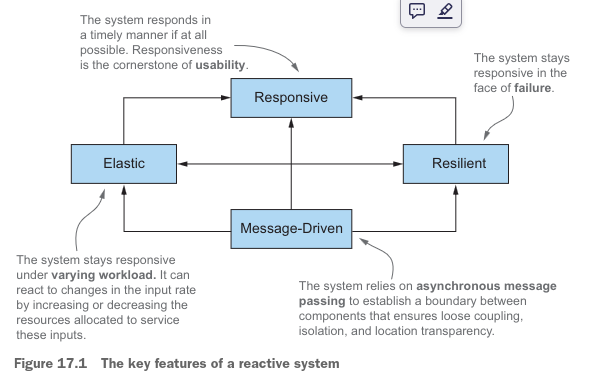
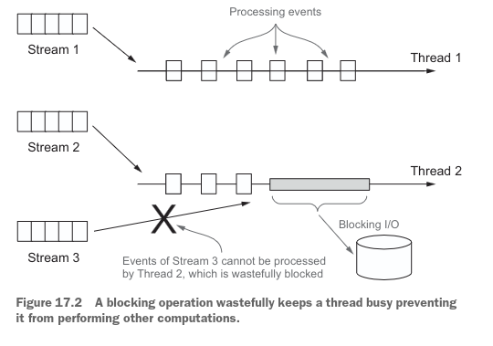
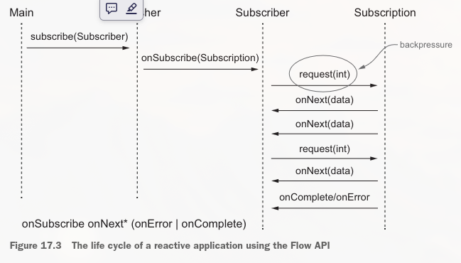
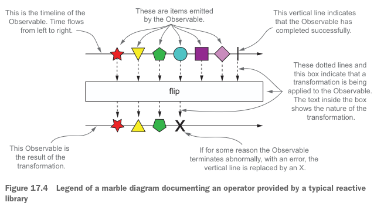
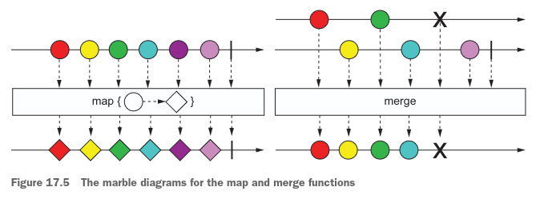

# Programación reactiva

### Este capítulo cubre
- Definir la programación reactiva y discutir los principios del Manifiesto Reactivo
- Programación reactiva a nivel de aplicación y de sistema
- Mostrar código de ejemplo usando flujos reactivos y la API Flow de Java 9
- Presentar RxJava, una biblioteca reactiva ampliamente utilizada
- Explorar las operaciones de RxJava para transformar y combinar múltiples flujos reactivos
- Presentar diagramas de mármol que documentan visualmente las operaciones sobre flujos reactivos
  Antes de profundizar en qué es la programación reactiva y cómo funciona, conviene aclarar por qué este nuevo paradigma
tiene una importancia creciente. Hace unos años, las aplicaciones más grandes tenían decenas de servidores y gigabytes 
de datos; los tiempos de respuesta de varios segundos y los tiempos de mantenimiento offline medidos en horas se 
consideraban aceptables. Hoy en día, esta situación está cambiando rápidamente por al menos tres razones:

- Big Data: el Big Data generalmente se mide en petabytes y crece a diario.
- Entornos heterogéneos: las aplicaciones se despliegan en diversos entornos que van desde dispositivos móviles hasta 
clústeres en la nube que ejecutan miles de procesadores multinúcleo.
- Patrones de uso: los usuarios esperan tiempos de respuesta de milisegundos y un 100 % de disponibilidad.
Estos cambios implican que las demandas actuales no se satisfacen con las arquitecturas de software de ayer. Esta 
situación se ha hecho evidente, sobre todo ahora que los dispositivos móviles son la mayor fuente de tráfico en internet,
y las cosas solo pueden empeorar en un futuro cercano cuando ese tráfico sea superado por el Internet de las Cosas (IoT).

La programación reactiva aborda estos problemas al permitirte procesar y combinar flujos de elementos de datos 
provenientes de distintos sistemas y fuentes de forma asíncrona. De hecho, las aplicaciones escritas siguiendo este 
paradigma reaccionan a los elementos de datos a medida que ocurren, lo que les permite ser más ágiles en su interacción 
con los usuarios. Además, el enfoque reactivo puede aplicarse no solo a la construcción de un único componente o 
aplicación, sino también a la coordinación de muchos componentes en un sistema reactivo completo. Los sistemas diseñados
de esta manera pueden intercambiar y enrutar mensajes en condiciones de red variables y ofrecer disponibilidad bajo carga
elevada, teniendo en cuenta fallos e interrupciones. (Nota: aunque los desarrolladores tradicionalmente ven sus sistemas
o aplicaciones como construidos a partir de componentes, en este nuevo estilo de mashup y acoplamiento flexible para 
construir sistemas, esos componentes suelen ser aplicaciones completas en sí mismos. Por lo tanto, componentes y 
aplicaciones son casi sinónimos.)
Las características y ventajas que definen a las aplicaciones y sistemas reactivos están plasmadas en el Manifiesto 
Reactivo, que tratamos en la siguiente sección.

## 17.1 El Manifiesto Reactivo
El Manifiesto Reactivo (https://www.reactivemanifesto.org) —desarrollado entre 2013 y 2014 por Jonas Bonér, Dave Farley, 
Roland Kuhn y Martin Thompson— formalizó un conjunto de principios fundamentales para desarrollar aplicaciones y sistemas
reactivos. El Manifiesto identificó cuatro características:

- Responsivo: un sistema reactivo tiene un tiempo de respuesta rápido y, sobre todo, coherente y predecible. Como 
resultado, el usuario sabe qué esperar. Esto, a su vez, aumenta la confianza del usuario, que es, sin duda, el aspecto 
clave de una aplicación usable.
- Resiliente: un sistema debe mantenerse responsivo aun cuando se produzcan fallos. El Manifiesto Reactivo sugiere 
distintas técnicas para lograr la resiliencia, entre ellas replicar la ejecución de los componentes, desacoplar dichos 
componentes en el tiempo (el emisor y el receptor tienen ciclos de vida independientes) y en el espacio (el emisor y el 
receptor se ejecutan en procesos distintos), y permitir que cada componente delegue tareas de forma asíncrona a otros 
componentes.
- Elástico: otro problema que afecta la capacidad de respuesta de las aplicaciones es el hecho de que pueden estar 
sometidas a distintas cargas de trabajo a lo largo de su ciclo de vida. Los sistemas reactivos están diseñados para 
reaccionar automáticamente a una carga de trabajo mayor incrementando la cantidad de recursos asignados a los componentes
afectados.
- Dirigido por mensajes: la resiliencia y la elasticidad requieren que los límites de los componentes que forman el 
sistema estén claramente definidos para garantizar bajo acoplamiento, aislamiento y transparencia de ubicación. La 
comunicación a través de estos límites se realiza mediante paso de mensajes asíncrono. Esta elección habilita tanto la 
resiliencia (al delegar los fallos como mensajes) como la elasticidad (al monitorizar la cantidad de mensajes 
intercambiados y escalar en consecuencia el número de recursos destinados a gestionarlos).

La figura 17.1 muestra cómo estas cuatro características se relacionan y dependen entre sí. Estos principios son válidos
a distintas escalas, desde estructurar el interior de una pequeña aplicación hasta determinar cómo deben coordinarse 
dichas aplicaciones para construir un sistema grande. No obstante, ciertos aspectos específicos sobre el nivel de 
granularidad en el que se aplican estas ideas merecen discutirse con más detalle.



### 17.1.1 Reactivo a nivel de aplicación
La característica principal de la programación reactiva para los componentes a nivel de aplicación permite que las 
tareas se ejecuten de forma asíncrona. Como veremos en el resto de este capítulo, procesar flujos de eventos de manera 
asíncrona y sin bloqueo es esencial para maximizar la tasa de uso de las CPUs multinúcleo modernas y, más concretamente,
de los hilos que compiten por utilizarlas. Para lograr este objetivo, los frameworks y bibliotecas reactivas comparten 
los hilos (recursos relativamente costosos y escasos) entre construcciones más ligeras, como futuros, actores y, más 
comúnmente, bucles de eventos que despachan una secuencia de callbacks destinados a agregar, transformar y gestionar los
eventos a procesar.

### Comprobación de conocimientos previos
Si te resultan confusos términos como evento, mensaje, señal y bucle de eventos (o publicación-suscripción, listener y 
backpressure, que se usan más adelante en este capítulo), lee la introducción más amena del capítulo 15. Si no, sigue 
leyendo.

Estas técnicas no solo tienen la ventaja de ser más económicas que los hilos, sino que además ofrecen una gran ventaja 
desde el punto de vista del desarrollador: elevan el nivel de abstracción al implementar aplicaciones concurrentes y 
asíncronas, lo que permite al desarrollador concentrarse en los requisitos de negocio en lugar de lidiar con los
problemas habituales del multihilo de bajo nivel, como la sincronización, las condiciones de carrera y los interbloqueos.
Lo más importante a tener en cuenta al usar estas estrategias de multiplexación de hilos es no realizar nunca operaciones
bloqueantes dentro del bucle de eventos principal. Conviene incluir como operaciones bloqueantes todas las operaciones 
limitadas por I/O, como acceder a una base de datos o al sistema de archivos, o llamar a un servicio remoto que puede 
tardar un tiempo largo o impredecible en completarse. Es fácil e interesante explicar por qué debes evitar las 
operaciones bloqueantes mediante un ejemplo práctico.
Imagina un escenario de multiplexación simplificado pero típico, con un grupo de dos hilos procesando tres flujos de 
eventos. Solo se pueden procesar dos flujos al mismo tiempo y los flujos tienen que competir por compartir esos dos 
hilos de la forma más justa y eficiente posible. Ahora supón que procesar el evento de un flujo desencadena una 
operación de I/O potencialmente lenta, como escribir en el sistema de archivos u obtener datos de una base de datos 
mediante una API bloqueante. Como muestra la figura 17.2, en esta situación el Hilo 2 queda bloqueado inútilmente 
esperando a que la operación de I/O finalice, por lo que, aunque el Hilo 1 puede procesar el primer flujo, el tercer 
flujo no se puede procesar antes de que la operación bloqueante termine.



Para superar este problema, la mayoría de los frameworks reactivos (como RxJava y Akka) permiten que las operaciones 
bloqueantes se ejecuten mediante un grupo de hilos dedicado e independiente. Todos los hilos del grupo principal quedan 
libres para ejecutarse sin interrupciones, manteniendo todos los núcleos de la CPU en la mayor tasa de uso posible. 
Mantener grupos de hilos separados para operaciones limitadas por CPU y limitadas por I/O tiene el beneficio adicional 
de permitir dimensionar y configurar los grupos con mayor granularidad, y de monitorizar el rendimiento de estos dos 
tipos de tareas con mayor precisión.
Desarrollar aplicaciones siguiendo los principios reactivos es solo un aspecto de la programación reactiva, y a menudo 
ni siquiera el más difícil. Tener un conjunto de aplicaciones reactivas bellamente diseñadas que funcionen de forma 
eficiente de manera aislada es al menos tan importante como lograr que cooperen en un sistema reactivo bien coordinado.

### 17.1.2 Reactivo a nivel de sistema
Un sistema reactivo es una arquitectura de software que permite que varias aplicaciones funcionen como una única 
plataforma coherente y resiliente, y que además permite que esas aplicaciones estén lo suficientemente desacopladas como
para que, cuando una falle, no derribe el sistema completo. La principal diferencia entre las aplicaciones reactivas y 
los sistemas reactivos es que las primeras suelen realizar cálculos basados en flujos de datos efímeros y se denominan 
dirigidas por eventos. Los segundos están pensados para componer las aplicaciones y facilitar la comunicación. A los 
sistemas con esta propiedad se les suele denominar dirigidos por mensajes.
Otra distinción importante entre mensajes y eventos es el hecho de que los mensajes se dirigen hacia un único destino 
definido, mientras que los eventos son hechos que serán recibidos por los componentes que estén registrados para 
observarlos. En los sistemas reactivos, también es esencial que estos mensajes sean asíncronos para desacoplar las 
operaciones de envío y recepción del emisor y del receptor, respectivamente. Este desacoplamiento es un requisito para 
el aislamiento total entre componentes y es fundamental para mantener el sistema responsivo tanto ante fallos 
(resiliencia) como ante carga elevada (elasticidad).
Más concretamente, la resiliencia se logra en las arquitecturas reactivas aislando los fallos en los componentes donde 
se producen, para evitar que las malfunctiones se propaguen a componentes adyacentes y, desde ahí, en una cascada 
catastrófica al resto del sistema. La resiliencia, en este sentido reactivo, es más que tolerancia a fallos. El sistema 
no se degrada de forma controlada, sino que se recupera por completo de los fallos aislándolos y devolviendo el sistema 
a un estado saludable. Esta "magia" se consigue conteniendo los errores y reificándolos como mensajes que se envían a 
otros componentes que actúan como supervisores. De este modo, la gestión del problema puede realizarse desde un contexto
seguro externo al propio componente que falla.
Como el aislamiento y el desacoplamiento son clave para la resiliencia, el principal facilitador de la elasticidad es la
transparencia de ubicación, que permite que cualquier componente de un sistema reactivo se comunique con cualquier otro 
servicio, sin importar dónde resida el destinatario. La transparencia de ubicación, a su vez, permite al sistema replicar
y escalar (automáticamente) cualquier aplicación según la carga de trabajo actual. Este escalado agnóstico a la 
ubicación muestra otra diferencia entre las aplicaciones reactivas (asíncronas, concurrentes y desacopladas en el tiempo)
y los sistemas reactivos (que pueden volverse desacoplados en el espacio gracias a la transparencia de ubicación).
En el resto de este capítulo, pondrás en práctica algunas de estas ideas con varios ejemplos de programación reactiva y,
en particular, explorarás la API Flow de Java 9.

## 17.2 Flujos reactivos y la API Flow
La programación reactiva es programación que utiliza flujos reactivos. Los flujos reactivos son una técnica estandarizada
(basada en el protocolo publicación-suscripción, o pub-sub, explicado en el capítulo 15) para procesar de forma asíncrona
secuencias de datos potencialmente ilimitadas, en orden y con backpressure obligatorio sin bloqueo. El backpressure es 
un mecanismo de control de flujo utilizado en publicación-suscripción para evitar que un consumidor lento de los eventos
del flujo sea desbordado por uno o varios productores más rápidos. Cuando se da esta situación, es inaceptable que el 
componente bajo presión falle de forma catastrófica o descarte eventos de manera incontrolada. El componente necesita 
una forma de pedir a los productores aguas arriba que reduzcan la velocidad, o de indicarles cuántos eventos puede 
aceptar y procesar en un momento dado antes de recibir más datos.
Cabe destacar que el requisito de backpressure integrado se justifica por la naturaleza asíncrona del procesamiento del 
flujo. De hecho, cuando se realizan invocaciones síncronas, el sistema está implícitamente backpresionado por las APIs 
bloqueantes. Lamentablemente, esta situación impide ejecutar cualquier otra tarea útil hasta que la operación bloqueante
finalice, por lo que se terminan desperdiciando muchos recursos en esperar. Por el contrario, con APIs asíncronas se 
puede maximizar la tasa de uso del hardware, pero se corre el riesgo de abrumar a algún componente aguas abajo más lento.
En esta situación entran en juego los mecanismos de backpressure o control de flujo; establecen un protocolo que impide 
que los destinatarios de los datos sean desbordados sin necesidad de bloquear ningún hilo.
Estos requisitos y el comportamiento que implican se condensaron en el proyecto Reactive Streams 
(www.reactive-streams.org), en el que participaron ingenieros de Netflix, Red Hat, Twitter, Lightbend y otras empresas, 
y que produjo la definición de cuatro interfaces interrelacionadas que representan el conjunto mínimo de características
que cualquier implementación de Reactive Streams debe proporcionar. Estas interfaces forman ahora parte de Java 9,
anidadas dentro de la nueva clase java.util.concurrent.Flow, y están implementadas por muchas bibliotecas de terceros, 
entre ellas Akka Streams (Lightbend), Reactor (Pivotal), RxJava (Netflix) y Vert.x (Red Hat). En la siguiente sección, 
examinamos en detalle los métodos declarados por estas interfaces y aclaramos cómo se espera que se usen para expresar 
componentes reactivos.

### 17.2.1 Presentación de la clase Flow
Java 9 añade una nueva clase para programación reactiva: java.util.concurrent.Flow. Esta clase contiene solo componentes
estáticos y no se puede instanciar. La clase Flow contiene cuatro interfaces anidadas para expresar el modelo de 
publicación-suscripción de la programación reactiva, tal como lo estandarizó el proyecto Reactive Streams:

- Publisher
- Subscriber
- Subscription
- Processor
La clase Flow permite que interfaces interrelacionadas y métodos estáticos establezcan componentes con control de flujo,
- en los que los Publishers producen elementos consumidos por uno o varios Subscribers, cada uno gestionado por una 
- Subscription. El Publisher es un proveedor de una cantidad potencialmente ilimitada de eventos secuenciados, pero está
- limitado por el mecanismo de backpressure a producirlos según la demanda recibida de su(s) Subscriber(s). El Publisher
- es una interfaz funcional de Java (declara un único método abstracto) que permite a un Subscriber registrarse como 
- listener de los eventos emitidos por el Publisher; el control de flujo, incluido el backpressure, entre Publishers y 
- Subscribers se gestiona mediante una Subscription. Estas tres interfaces, junto con la interfaz Processor, se muestran
- en los listados 17.1, 17.2, 17.3 y 17.4.

Listado 17.1 La interfaz Flow.Publisher:
```java
@FunctionalInterface
public interface Publisher<T> {
    void subscribe(Subscriber<? super T> s);
}
```
Por el otro lado, la interfaz Subscriber tiene cuatro métodos callback que son invocados por el Publisher cuando produce
los eventos correspondientes.

Listado 17.2 La interfaz Flow.Subscriber:
```java
public interface Subscriber<T> {
    void onSubscribe(Subscription s);

    void onNext(T t);

    void onError(Throwable t);

    void onComplete();
}
```
Esos eventos deben publicarse (y los métodos correspondientes invocarse) siguiendo estrictamente la secuencia definida 
por este protocolo:
```terminaloutput
onSubscribe onNext* (onError | onComplete)?
```
Esta notación significa que onSubscribe siempre se invoca como el primer evento, seguido por un número arbitrario de 
señales onNext. El flujo de eventos puede continuar indefinidamente, o puede terminarse mediante un callback onComplete 
para indicar que no se producirán más elementos, o mediante onError si el Publisher experimenta un fallo. (Compáralo con
la lectura de un terminal, donde obtienes una cadena o una indicación de fin de archivo o error de I/O).
Cuando un Subscriber se registra en un Publisher, la primera acción del Publisher es invocar el método onSubscribe para 
pasarle un objeto Subscription. La interfaz Subscription declara dos métodos. El Subscriber puede usar el primer método 
para notificar al Publisher que está listo para procesar un número determinado de eventos; el segundo método le permite 
cancelar la Subscription, indicándole al Publisher que ya no le interesa recibir sus eventos.

Listado 17.3 La interfaz Flow.Subscription:
```java
public interface Subscription {
    void request(long n);

    void cancel();
}
```
La especificación de Flow de Java 9 define un conjunto de reglas mediante las cuales las implementaciones de estas 
interfaces deben cooperar. Estas reglas se pueden resumir así:

- El Publisher debe enviar al Subscriber una cantidad de elementos no mayor a la especificada por el método request de 
la Subscription. Sin embargo, un Publisher puede enviar menos onNext de los solicitados y terminar la Subscription 
llamando a onComplete si la operación terminó correctamente, o a onError si falló. En estos casos, cuando se ha alcanzado
un estado terminal (onComplete u onError), el Publisher no puede enviar ninguna otra señal a sus Subscribers, y la 
Subscription debe considerarse cancelada.
- El Subscriber debe notificar al Publisher que está listo para recibir y procesar n elementos. De este modo, el 
Subscriber ejerce backpressure sobre el Publisher, evitando que el Subscriber se vea desbordado por demasiados eventos 
que gestionar. Además, al procesar las señales onComplete u onError, el Subscriber no puede llamar a ningún método del 
Publisher o la Subscription, y debe considerar la Subscription como cancelada. Finalmente, el Subscriber debe estar 
preparado para recibir estas señales terminales incluso sin ninguna llamada previa al método Subscription.request(), y 
para recibir uno o más onNext incluso después de haber llamado a Subscription.cancel().
- La Subscription es compartida por exactamente un Publisher y un Subscriber, y representa la relación única entre ellos.
Por esta razón, debe permitir que el Subscriber llame a su método request de forma síncrona tanto desde los métodos 
onSubscribe como onNext. El estándar especifica que la implementación del método Subscription.cancel() debe ser 
idempotente (llamarlo repetidamente tiene el mismo efecto que llamarlo una vez) y segura para hilos, de modo que, 
después de la primera vez que se ha llamado, cualquier otra invocación adicional sobre la Subscription no tiene efecto. 
Invocar este método solicita al Publisher que eventualmente elimine cualquier referencia al Subscriber correspondiente. 
No se recomienda volver a suscribirse con el mismo objeto Subscriber, pero la especificación no exige que se lance una 
excepción en esta situación, porque todas las suscripciones previamente canceladas tendrían que almacenarse 
indefinidamente.

La figura 17.3 muestra el ciclo de vida típico de una aplicación que implementa las interfaces definidas por la API Flow.



El cuarto y último miembro de la clase Flow es la interfaz Processor, que extiende tanto Publisher como Subscriber sin 
requerir ningún método adicional.

Listado 17.4 La interfaz Flow.Processor:
```java
public interface Processor<T, R> extends Subscriber<T>, Publisher<R> { }
```
De hecho, esta interfaz representa una etapa de transformación de los eventos procesados a través del flujo reactivo. Al
recibir un error, el Processor puede optar por recuperarse de él (y entonces considerar la Subscription como cancelada) 
o propagar inmediatamente la señal onError a su(s) Subscriber(s). El Processor también debería cancelar su Subscription 
aguas arriba cuando su último Subscriber cancele su Subscription, para propagar la señal de cancelación (aunque esta 
cancelación no es estrictamente requerida por la especificación).
La API Flow de Java 9 / Reactive Streams exige que cualquier implementación de todos los métodos de la interfaz 
Subscriber nunca bloquee al Publisher, pero no especifica si estos métodos deben procesar los eventos de forma síncrona 
o asíncrona. Nótese, sin embargo, que todos los métodos definidos por estas interfaces retornan void, por lo que pueden 
implementarse de manera completamente asíncrona.

En la siguiente sección, pondrás en práctica lo que has aprendido hasta ahora mediante un ejemplo simple y práctico.

### 17.2.2 Creando tu primera aplicación reactiva
Las interfaces definidas en la clase Flow, en la mayoría de los casos, no están pensadas para implementarse directamente.
¡Inusualmente, la biblioteca de Java 9 tampoco proporciona clases que las implementen! Estas interfaces están 
implementadas por las bibliotecas reactivas que ya hemos mencionado (Akka, RxJava, etc.). La especificación de Java 9 de
java.util.concurrent.Flow funciona tanto como un contrato al que deben adherirse todas esas bibliotecas como una lingua
franca que permite que aplicaciones reactivas desarrolladas sobre diferentes bibliotecas reactivas cooperen y se 
comuniquen entre sí. Además, esas bibliotecas reactivas suelen ofrecer muchas más funcionalidades (clases y métodos que 
transforman y fusionan flujos reactivos, más allá del subconjunto mínimo especificado por la interfaz 
java.util.concurrent.Flow).
Dicho esto, tiene sentido que desarrolles una primera aplicación reactiva directamente sobre la API Flow de Java 9 para 
tener una idea de cómo funcionan juntas las cuatro interfaces discutidas en las secciones anteriores. Con este fin, 
escribirás un programa simple de reporte de temperaturas utilizando principios reactivos. Este programa tiene dos 
componentes:

- TempInfo, que simula un termómetro remoto (reportando constantemente temperaturas elegidas al azar entre 0 y 99 grados
Fahrenheit, lo cual es apropiado para ciudades estadounidenses la mayor parte del tiempo)
- TempSubscriber, que escucha estos reportes e imprime el flujo de temperaturas reportadas por un sensor instalado en 
una ciudad determinada

El primer paso es definir una clase simple que transmita la temperatura actualmente reportada, como se muestra en el
siguiente listado.

Listado 17.5 Un Java Bean que transmite la temperatura actualmente reportada:
```java
import java.util.Random;
public class TempInfo {
    public static final Random random = new Random();
    private final String town;
    private final int temp;

    public TempInfo(String town, int temp) {
        this.town = town;
        this.temp = temp;
    }
    //Una instancia de TempInfo para una ciudad determinada se crea mediante un metodo factory estático.
    public static TempInfo fetch(String town) {
        //Obtener la temperatura actual puede fallar aleatoriamente una de cada diez veces.
        if (random.nextInt(10) == 0)
            throw new RuntimeException("Error!");
        //Retorna una temperatura aleatoria en el rango de 0 a 99 grados Fahrenheit
        return new TempInfo(town, random.nextInt(100));
    }

    @Override
    public String toString() {
        return town + " : " + temp;
    }

    public int getTemp() {
        return temp;
    }

    public String getTown() {
        return town;
    }
}
```
Después de definir este modelo de dominio simple, puedes implementar una Subscription para las temperaturas de una 
ciudad determinada, que envía un reporte de temperatura cada vez que su Subscriber lo solicita, como se muestra en el 
siguiente listado.

Listado 17.6 Una Subscription que envía un flujo de TempInfo a su Subscriber:
```java
import java.util.concurrent.Flow.*;
public class TempSubscription implements Subscription {
    private final Subscriber<? super TempInfo> subscriber;
    private final String town;

    public TempSubscription(Subscriber<? super TempInfo> subscriber,
                            String town) {
        this.subscriber = subscriber;
        this.town = town;
    }

    @Override
    public void request(long n) {
        //Itera una vez por cada solicitud realizada por el Subscriber.
        for (long i = 0L; i < n; i++) {
            try {
                //Envía la temperatura actual al Subscriber.
                subscriber.onNext(TempInfo.fetch(town));
            } catch (Exception e) {
                //En caso de un fallo al obtener la temperatura, propaga el error al Subscriber.
                subscriber.onError(e);
                break;
            }
        }
    }

    @Override
    public void cancel() {
        //Si la suscripción es cancelada, envía una señal de finalización (onComplete) al Subscriber.
        subscriber.onComplete();
    }
}
```
El siguiente paso es crear un Subscriber que, cada vez que recibe un nuevo elemento, imprima las temperaturas recibidas 
de la Subscription y solicite un nuevo reporte, como se muestra en el siguiente listado.

Listado 17.7 Un Subscriber que imprime las temperaturas recibidas:
```java
import java.util.concurrent.Flow.*;
public class TempSubscriber implements Subscriber<TempInfo> {
    private Subscription subscription;

    //Almacena la suscripción y envía una primera solicitud.
    @Override
    public void onSubscribe(Subscription subscription) {
        this.subscription = subscription;
        subscription.request(1);
    }
    
    //Imprime la temperatura recibida y solicita una más.
    @Override
    public void onNext(TempInfo tempInfo) {
        System.out.println(tempInfo);
        subscription.request(1);
    }

    //Imprime el mensaje de error en caso de un error.
    @Override
    public void onError(Throwable t) {
        System.err.println(t.getMessage());
    }

    @Override
    public void onComplete() {
        System.out.println("Done!");
    }
}
```
El siguiente listado pone en funcionamiento tu aplicación reactiva con una clase Main que crea un Publisher y luego se 
suscribe a él usando TempSubscriber.

Listado 17.8 Una clase Main: creando un Publisher y suscribiendo TempSubscriber a él:
```java
import java.util.concurrent.Flow.*;
public class Main {
    public static void main(String[] args) {
        //Crea un nuevo Publisher de temperaturas en Nueva York y suscribe el TempSubscriber a él.
        getTemperatures("New York").subscribe(new TempSubscriber());
    }

    //Retorna un Publisher que envía un TempSubscription al Subscriber que se suscribe a él.
    private static Publisher<TempInfo> getTemperatures(String town) {
        return subscriber -> subscriber.onSubscribe(
                new TempSubscription(subscriber, town));
    }
}
```
Aquí, el método getTemperatures retorna una expresión lambda que toma un Subscriber como argumento e invoca su método 
onSubscribe, pasándole una nueva instancia de TempSubscription. Debido a que la signatura de esta lambda es idéntica al 
único método abstracto de la interfaz funcional Publisher, el compilador de Java puede convertir automáticamente la 
lambda a un Publisher (como aprendiste en el capítulo 3). El método main crea un Publisher para las temperaturas en 
Nueva York y luego suscribe una nueva instancia de la clase TempSubscriber a él. Ejecutar main produce una salida similar
a esta:
```terminaloutput
New York : 44
New York : 68
New York : 95
New York : 30
Error!
```
En la ejecución anterior, TempSubscription obtuvo correctamente la temperatura en Nueva York cuatro veces, pero falló en
la quinta lectura. Parece que has implementado correctamente el problema usando tres de las cuatro interfaces de la API 
Flow. Pero, ¿estás seguro de que no hay errores en el código? Piensa en esta pregunta completando el siguiente 
cuestionario.

### Cuestionario 17.1:
El ejemplo desarrollado hasta ahora tiene un problema sutil. Sin embargo, este problema está oculto por el hecho de que 
en algún momento el flujo de temperaturas será interrumpido por el error generado aleatoriamente dentro del método 
factory de TempInfo. ¿Puedes adivinar qué sucederá si comentas la sentencia que genera el error aleatorio y dejas que tu
main se ejecute el tiempo suficiente?

### Respuesta:
El problema con lo que has hecho hasta ahora es que cada vez que el TempSubscriber recibe un nuevo elemento en su método
onNext, envía una nueva solicitud al TempSubscription, y entonces el método request envía otro elemento al propio 
TempSubscriber. Estas invocaciones recursivas se apilan en la pila una tras otra hasta que la pila se desborda, 
generando un StackOverflowError como el siguiente:

```terminaloutput
Exception in thread "main" java.lang.StackOverflowError
at java.base/java.io.PrintStream.print(PrintStream.java:666)
at java.base/java.io.PrintStream.println(PrintStream.java:820)
at flow.TempSubscriber.onNext(TempSubscriber.java:36)
at flow.TempSubscriber.onNext(TempSubscriber.java:24)
at flow.TempSubscription.request(TempSubscription.java:60)
at flow.TempSubscriber.onNext(TempSubscriber.java:37)
at flow.TempSubscriber.onNext(TempSubscriber.java:24)
at flow.TempSubscription.request(TempSubscription.java:60)
```
¿Qué puedes hacer para solucionar este problema y evitar desbordar la pila? Una posible solución es agregar un Executor 
al TempSubscription y luego usarlo para enviar nuevos elementos al TempSubscriber desde un hilo diferente. Para lograr 
esto, puedes modificar el TempSubscription como se muestra en el siguiente listado. (La clase está incompleta; la 
definición completa usa las definiciones restantes del listado 17.6.)

Listado 17.9 Agregando un Executor al TempSubscription:
```java
import java.util.concurrent.ExecutorService;
import java.util.concurrent.Executors;
//Código sin modificar del TempSubscription original ha sido omitido.
public class TempSubscription implements Subscription {
    private static final ExecutorService executor =
            Executors.newSingleThreadExecutor();

    @Override
    public void request(long n) {
        //Envía los siguientes elementos al subscriber desde un hilo diferente.
        executor.submit(() -> {
            for (long i = 0L; i < n; i++) {
                try {
                    subscriber.onNext(TempInfo.fetch(town));
                } catch (Exception e) {
                    subscriber.onError(e);
                    break;
                }
            }
        });
    }
}
```
Hasta ahora, has usado solo tres de las cuatro interfaces definidas por la API Flow. ¿Qué hay de la interfaz Processor? 
Un buen ejemplo de cómo usar esa interfaz es crear un Publisher que reporte las temperaturas en Celsius en lugar de 
Fahrenheit (para suscriptores fuera de Estados Unidos).

### 17.2.3 Transformando datos con un Processor
Como se describió en la sección 17.2.1, un Processor es tanto un Subscriber como un Publisher. De hecho, está diseñado 
para suscribirse a un Publisher y republicar los datos que recibe después de transformarlos. Como ejemplo práctico, 
implementa un Processor que se suscriba a un Publisher que emite temperaturas en Fahrenheit y las republique después de 
convertirlas a Celsius, como se muestra en el siguiente listado.

Listado 17.10 Un Processor que transforma temperaturas de Fahrenheit a Celsius:
```java
import java.util.concurrent.Flow.*;
//Un processor que transforma un TempInfo en otro TempInfo.
public class TempProcessor implements Processor<TempInfo, TempInfo> {
    private Subscriber<? super TempInfo> subscriber;

    @Override
    public void subscribe(Subscriber<? super TempInfo> subscriber) {
        this.subscriber = subscriber;
    }

    @Override
    public void onNext(TempInfo temp) {
        //Republica el TempInfo después de convertir la temperatura a Celsius.
        subscriber.onNext(new TempInfo(temp.getTown(),
                (temp.getTemp() - 32) * 5 / 9));
    }
    
    //Todas las demás señales se delegan sin cambios al subscriber aguas arriba.
    @Override
    public void onSubscribe(Subscription subscription) {
        subscriber.onSubscribe(subscription);
    }

    @Override
    public void onError(Throwable throwable) {
        subscriber.onError(throwable);
    }

    @Override
    public void onComplete() {
        subscriber.onComplete();
    }
}
```
Observa que el único método del TempProcessor que contiene algo de lógica de negocio es onNext, que republica las 
temperaturas después de convertirlas de Fahrenheit a Celsius. Todos los demás métodos que implementan la interfaz 
Subscriber simplemente pasan sin cambios (delegan) todas las señales recibidas al Subscriber aguas arriba, y el método 
subscribe del Publisher registra el Subscriber aguas arriba en el Processor.

El siguiente listado pone a trabajar el TempProcessor usándolo en tu clase Main.

Listado 17.11 Clase Main: crea un Publisher y suscribe TempSubscriber a él:
```java
import java.util.concurrent.Flow.*;
public class Main {
    public static void main(String[] args) {
        //Crea un nuevo Publisher de temperaturas en Celsius para Nueva York.
        getCelsiusTemperatures("New York")
                //Suscribe el TempSubscriber al Publisher.
                .subscribe(new TempSubscriber());
    }

    public static Publisher<TempInfo> getCelsiusTemperatures(String town) {
        return subscriber -> {
            TempProcessor processor = new TempProcessor();
            //Crea un TempProcessor y lo coloca entre el Subscriber y el Publisher retornado.
            processor.subscribe(subscriber);
            processor.onSubscribe(new TempSubscription(processor, town));
        };
    }
}
```
Esta vez, al ejecutar Main se produce la siguiente salida, con temperaturas típicas de la escala Celsius:
```terminaloutput
New York : 10
New York : -12
New York : 23
Error!
```
En esta sección, implementaste directamente las interfaces definidas en la API Flow y, al hacerlo, te familiarizaste con
el procesamiento de flujos asíncronos mediante el protocolo de publicación-suscripción que forma la idea central de la 
API Flow. Pero hay algo ligeramente inusual en este ejemplo, que abordamos en la siguiente sección.

### 17.2.4 ¿Por qué Java no proporciona una implementación de la API Flow?
La API Flow en Java 9 es bastante extraña. La biblioteca de Java generalmente proporciona interfaces e implementaciones 
para ellas, pero aquí implementaste la API Flow tú mismo. Comparemos con la API List. Como sabes, Java proporciona la 
interfaz List<T> que está implementada por muchas clases, incluyendo ArrayList<T>. Más precisamente (y bastante invisible
para el usuario), la clase ArrayList<T> extiende la clase abstracta AbstractList<T>, que implementa la interfaz List<T>.
Por el contrario, Java 9 declara la interfaz Publisher<T> y no proporciona ninguna implementación, razón por la cual 
tuviste que definir la tuya propia (aparte del beneficio de aprendizaje que obtuviste al implementarla). Seamos sinceros:
una interfaz por sí sola puede ayudarte a estructurar tu pensamiento sobre programación, ¡pero no te ayuda a escribir 
programas más rápido!
¿Qué está pasando? La respuesta es histórica: existían múltiples bibliotecas de código Java de flujos reactivos 
(como Akka y RxJava). Originalmente, estas bibliotecas se desarrollaron por separado y, aunque implementaban la 
programación reactiva mediante ideas de publicación-suscripción, usaban nomenclatura y API diferentes. Durante el 
proceso de estandarización de Java 9, estas bibliotecas evolucionaron para que sus clases implementaran formalmente las 
interfaces en java.util.concurrent.Flow, en lugar de simplemente implementar los conceptos reactivos. Este estándar 
permite una mayor colaboración entre diferentes bibliotecas.
Ten en cuenta que construir una implementación de flujos reactivos es complejo, por lo que la mayoría de los usuarios 
simplemente usarán una existente. Como muchas clases que implementan una interfaz, suelen proporcionar una funcionalidad
más rica de la requerida para una implementación mínima.
En la siguiente sección, usarás una de las bibliotecas más utilizadas: la biblioteca RxJava (extensiones reactivas para 
Java) desarrollada por Netflix, específicamente la versión actual RxJava 2.0, que implementa las interfaces Flow de 
Java 9.

## 17.3 Usando la biblioteca reactiva RxJava
RxJava estuvo entre las primeras bibliotecas en desarrollar aplicaciones reactivas en Java. Nació en Netflix como un 
puerto del proyecto Reactive Extensions (Rx), desarrollado originalmente por Microsoft en el entorno .NET. RxJava 
versión 2.0 se ajustó para adherirse a la API Reactive Streams explicada anteriormente en este capítulo y adoptada por 
Java 9 como java.util.concurrent.Flow. Cuando usas una biblioteca externa en Java, este hecho se hace evidente a partir 
de los imports. Importas las interfaces Flow de Java, por ejemplo, incluyendo Publisher con una línea como esta:
```java
import java.util.concurrent.Flow.*;
```
Pero también necesitas importar las clases de implementación apropiadas con una línea como:
```java
import io.reactivex.Observable;
```
si quieres usar la implementación Observable de Publisher, como elegirás hacer más adelante en este capítulo.
Debemos enfatizar un problema arquitectónico: el buen estilo arquitectónico de sistemas evita hacer visibles en todo el 
sistema los conceptos de detalle fino que se usan solo en una parte del sistema. En consecuencia, es una buena práctica
usar un Observable solo donde se requiere la estructura adicional de un Observable y, en caso contrario, usar su 
interfaz Publisher. Ten en cuenta que sigues esta directriz con la interfaz List sin pensar. Aunque un método puede haber
recibido un valor que sabes que es un ArrayList, declaras el parámetro para ese valor como de tipo List, para evitar 
exponer y restringir los detalles de implementación. De hecho, permites que un cambio posterior de implementación de 
ArrayList a LinkedList no requiera cambios ubicuos.
En el resto de esta sección, definirás un sistema de reporte de temperaturas utilizando la implementación de flujos 
reactivos de RxJava. El primer problema que encuentras es que RxJava proporciona dos clases, ambas implementan 
Flow.Publisher.
Al leer la documentación de RxJava, descubres que una clase es io.reactivex.Flowable, que incluye la característica de 
backpressure reactiva basada en pull de Java 9 Flow (usando request), ejemplificada en los listados 17.7 y 17.9. El 
backpressure evita que un Subscriber sea desbordado por datos producidos por un Publisher rápido. La otra clase es la 
versión original de RxJava io.reactivex.Observable de Publisher, que no soportaba backpressure. Esta clase es tanto más 
simple de programar como más apropiada para eventos de interfaz de usuario (como movimientos del ratón); estos eventos 
son flujos que no se pueden backpresionar razonablemente. (¡No puedes pedirle al usuario que disminuya la velocidad o 
que deje de mover el ratón!) Por esta razón, RxJava proporciona estas dos clases de implementación para la idea común de
flujo de eventos.
El consejo de RxJava es usar el Observable sin backpressure cuando tienes un flujo de no más de mil elementos, o cuando 
estás tratando con eventos de GUI como movimientos del ratón o eventos táctiles, que son imposibles de backpresionar y 
no son frecuentes de todos modos.
Debido a que analizamos el escenario de backpressure al discutir la API Flow en la sección anterior, no hablaremos más 
de Flowable; en su lugar, demostraremos la interfaz Observable en un caso de uso sin backpressure. Vale la pena señalar 
que cualquier subscriber puede efectivamente desactivar el backpressure invocando request(Long.MAX_VALUE) en la 
suscripción, aunque esta práctica no es recomendable a menos que estés seguro de que el Subscriber siempre podrá 
procesar todos los eventos recibidos de manera oportuna.

### 17.3.1 Creando y usando un Observable
Las clases Observable y Flowable vienen con muchos métodos factory convenientes que te permiten crear muchos tipos de 
flujos reactivos. (Tanto Observable como Flowable implementan Publisher, por lo que estos métodos factory publican 
flujos reactivos).
El Observable más simple que puedes querer crear está compuesto por un número fijo de elementos predeterminados, de la 
siguiente manera:
```java
Observable<String> strings = Observable.just("first", "second");
```
Aquí, el método factory just() convierte uno o más elementos en un Observable que emite esos elementos. Un subscriber de
este Observable recibe los mensajes onNext("first"), onNext("second") y onComplete(), en ese orden.
Otro método factory de Observable que es bastante común, especialmente cuando tu aplicación interactúa con un usuario en
tiempo real, emite eventos a una tasa de tiempo fija:
```java
Observable<Long> onePerSec = Observable.interval(1, TimeUnit.SECONDS);
```
El método factory interval retorna un Observable, llamado onePerSec, que emite una secuencia infinita de valores 
ascendentes de tipo long, comenzando en cero, a un intervalo de tiempo fijo de tu elección (1 segundo en este ejemplo). 
Ahora planeas usar onePerSec como base de otro Observable que emite la temperatura reportada para una ciudad determinada
cada segundo.
Como paso intermedio hacia este objetivo, puedes imprimir esas temperaturas cada segundo. Para hacerlo, necesitas 
suscribirte a onePerSec para ser notificado por él cada vez que haya pasado un segundo, y luego obtener e imprimir las 
temperaturas de la ciudad de interés.
En RxJava, el Observable juega el papel del Publisher en la API Flow, por lo que el Observer corresponde de manera 
similar a la interfaz Subscriber de Flow. La interfaz Observer de RxJava declara los mismos métodos que el Subscriber 
de Java 9 dado en el listado 17.2, con la diferencia de que el método onSubscribe tiene un argumento Disposable en lugar
de Subscription. Como mencionamos anteriormente, Observable no soporta backpressure, por lo que no tiene un método 
request que forme parte de una Subscription. La interfaz Observer completa es:
```java
public interface Observer<T> {
    void onSubscribe(Disposable d);

    void onNext(T t);

    void onError(Throwable t);

    void onComplete();
}
```
Ten en cuenta, sin embargo, que las API de RxJava son más flexibles (tienen variantes más sobrecargadas) que la API Flow
nativa de Java 9. Puedes suscribirte a un Observable, por ejemplo, pasando una expresión lambda con la signatura del 
método onNext y omitiendo los otros tres métodos. En otras palabras, puedes suscribirte a un Observable con un Observer 
que implementa solo el método onNext con un Consumer del evento recibido, dejando los otros métodos con una 
implementación por defecto sin operación para la finalización y el manejo de errores. Usando esta característica, puedes
suscribirte al Observable onePerSec y usarlo para imprimir las temperaturas en Nueva York una vez por segundo, todo en 
una sola línea de código:
```java
onePerSec.subscribe(i -> System.out.println(TempInfo.fetch("New York")));
```
En esta sentencia, el Observable onePerSec emite un evento por segundo, y al recibir este mensaje, el Subscriber obtiene 
la temperatura en Nueva York y la imprime. Sin embargo, si pones esta sentencia en un método main e intentas ejecutarla,
no ves nada porque el Observable que publica un evento por segundo se ejecuta en un hilo que pertenece al grupo de hilos
de cómputo de RxJava, que está compuesto por hilos daemon. Pero tu programa main termina inmediatamente y, al hacerlo, 
mata el hilo daemon antes de que pueda producir ninguna salida.
Como una solución algo burda, puedes evitar esta terminación inmediata poniendo un Thread.sleep después de la sentencia
anterior. Mejor aún, podrías usar el método blockingSubscribe que llama a los callbacks en el hilo actual (en este caso,
el hilo principal). Para los fines de una demostración en ejecución, blockingSubscribe es perfectamente adecuado. Sin 
embargo, en un contexto de producción, normalmente usas el método subscribe, de la siguiente manera:
```java
onePerSec.blockingSubscribe(i -> System.out.println(TempInfo.fetch( "New York" ));
```
Puedes obtener una salida como la siguiente:
```terminaloutput
New York : 87
New York : 18
New York : 75
java.lang.RuntimeException: Error!
at flow.common.TempInfo.fetch(TempInfo.java:18)
at flow.Main.lambda$main$0(Main.java:12)
at io.reactivex.internal.observers.LambdaObserver
.onNext(LambdaObserver.java:59)
at io.reactivex.internal.operators.observable
.ObservableInterval$IntervalObserver.run(ObservableInterval.java:74)
```
Desafortunadamente, la obtención de la temperatura puede, por diseño, fallar aleatoriamente (y de hecho lo hace después 
de tres lecturas). Debido a que tu Observer implementa solo el camino feliz y no tiene ningún tipo de gestión de errores,
como onError, este fallo explota en la cara del usuario como una excepción no capturada.
Es hora de subir el listón y empezar a complicar un poco este ejemplo. No solo quieres añadir gestión de errores. 
También tienes que generalizar lo que tienes. No quieres imprimir las temperaturas inmediatamente, sino proporcionar a 
los usuarios un método factory que retorne un Observable que emita esas temperaturas una vez por segundo durante 
(digamos) un máximo de cinco veces antes de completarse. Puedes lograr este objetivo fácilmente usando un método factory
llamado create que crea un Observable a partir de una lambda, tomando como argumento otro Observer y retornando void, 
como se muestra en el siguiente listado.

Listado 17.12 Creando un Observable que emite temperatura una vez por segundo:
```java
public static Observable<TempInfo> getTemperature(String town) {
    //Crea un Observable a partir de una función que consume un Observer.
    return Observable.create(emitter ->
            //Un Observable que emite una secuencia infinita de longs ascendentes, uno por segundo.
            Observable.interval(1, TimeUnit.SECONDS)
                    .subscribe(i -> {
                        //Haz algo solo si el observer consumido no ha sido dispuesto aún (debido a un error anterior).
                        if (!emitter.isDisposed()) {
                            //Si la temperatura ya ha sido emitida cinco veces, completa el observer terminando el flujo.
                            if (i >= 5) {
                                emitter.onComplete();
                            } else {
                                try {
                                    //De lo contrario, envía un reporte de temperatura al Observer.
                                    emitter.onNext(TempInfo.fetch(town));
                                } catch (Exception e) {
                                    //En caso de error, notifica al Observer.
                                    emitter.onError(e);
                                }
                            }
                        }
                    }));
}
```
Aquí, estás creando el Observable retornado a partir de una función que consume un ObservableEmitter, enviándole los 
eventos deseados. La interfaz ObservableEmitter de RxJava extiende el Emitter básico de RxJava, que puedes pensar como 
un Observer sin el método onSubscribe.
```java
public interface Emitter<T> {
    void onNext(T t);

    void onError(Throwable t);

    void onComplete();
}
```
con algunos métodos más para establecer un nuevo Disposable en el Emitter y verificar si la secuencia ya ha sido 
dispuesta aguas abajo.
Internamente, te suscribes a un Observable como onePerSec que publica una secuencia infinita de longs ascendentes, uno 
por segundo. Dentro de la función de suscripción (pasada como argumento al método subscribe), primero verificas si el 
Observer consumido ya ha sido dispuesto mediante el método isDisposed proporcionado por la interfaz ObservableEmitter. 
(Esta situación podría ocurrir si se produjo un error en una iteración anterior). Si la temperatura ya ha sido emitida 
cinco veces, el código completa el Observer, terminando el flujo; de lo contrario, envía el reporte de temperatura más 
reciente para la ciudad solicitada al Observer en un bloque try/catch. Si ocurre un error durante la obtención de la 
temperatura, propaga el error al Observer.
Ahora es fácil implementar un Observer completo que luego se usará para suscribirse al Observable retornado por el 
método getTemperature y que imprima las temperaturas que publica, como se muestra en el siguiente listado.

Listado 17.13 Un Observer que imprime las temperaturas recibidas:
```java
import io.reactivex.Observer;
import io.reactivex.disposables.Disposable;
public class TempObserver implements Observer<TempInfo> {
    @Override
    public void onComplete() {
        System.out.println("Done!");
    }

    @Override
    public void onError(Throwable throwable) {
        System.out.println("Got problem: " + throwable.getMessage());
    }

    @Override
    public void onSubscribe(Disposable disposable) {
    }

    @Override
    public void onNext(TempInfo tempInfo) {
        System.out.println(tempInfo);
    }
}
```
Este Observer es similar a la clase TempSubscriber del listado 17.7 (que implementa Flow.Subscriber de Java 9), pero 
tienes una simplificación adicional. Debido a que el Observable de RxJava no soporta backpressure, no necesitas hacer 
request() de más elementos después de procesar los publicados.
En el siguiente listado, creas un programa main en el que suscribes este Observer al Observable retornado por el método 
getTemperature del listado 17.12.

Listado 17.14 Una clase Main que imprime las temperaturas en Nueva York:
```java
public class Main {
    public static void main(String[] args) {
        //Crea un Observable que emite las temperaturas reportadas en Nueva York una vez por segundo.
        Observable<TempInfo> observable = getTemperature("New York");
        //Suscribe a ese Observable con un Observer simple que imprime las temperaturas.
        observable.blockingSubscribe(new TempObserver());
    }
}
```
Suponiendo que esta vez no ocurra ningún error al obtener las temperaturas, main imprime una línea por segundo cinco veces, y luego el Observable emite la señal onComplete, por lo que podrías obtener una salida como la siguiente:
New York : 69
New York : 26
New York : 85
New York : 94
New York : 29
Done!
Es hora de enriquecer un poco más tu ejemplo de RxJava y, en particular, ver cómo esta biblioteca te permite manipular 
uno o más flujos reactivos.

### 17.3.2 Transformando y combinando Observables
Una de las principales ventajas de RxJava y otras bibliotecas reactivas al trabajar con flujos reactivos, en comparación
con lo que ofrece la API Flow nativa de Java 9, es que proporcionan un rico conjunto de funciones para combinar, crear y
filtrar cualquiera de esos flujos. Como demostramos en las secciones anteriores, un flujo puede usarse como entrada para
otro. Además, has aprendido sobre el Flow.Processor de Java 9 usado en la sección 17.2.3 para transformar temperaturas 
de Fahrenheit a Celsius. Pero también puedes filtrar un flujo para obtener otro que tenga solo los elementos que te 
interesan, transformar esos elementos con una función de mapeo dada (ambas cosas se pueden lograr con Flow.Processor), o
incluso fusionar o combinar dos flujos de muchas maneras (lo cual no se puede lograr con Flow.Processor).
Estas funciones de transformación y combinación pueden ser bastante sofisticadas, hasta el punto de que explicar su 
comportamiento en palabras simples puede resultar en frases extrañas y enrevesadas. Para que te hagas una idea, mira 
cómo RxJava documenta su función mergeDelayError:
"Aplana un Observable que emite Observables en un solo Observable, de una manera que permite a un Observer recibir todos
los elementos emitidos exitosamente de todos los Observables fuente sin ser interrumpido por una notificación de error 
de uno de ellos, mientras limita el número de suscripciones concurrentes a estos Observables."
Debes admitir que lo que hace esta función no es evidente de inmediato. Para aliviar este problema, la comunidad de 
flujos reactivos decidió documentar los comportamientos de estas funciones de forma visual, usando los llamados diagramas
de mármol. Un diagrama de mármol, como el que se muestra en la figura 17.4, representa la secuencia temporalmente 
ordenada de elementos en un flujo reactivo como formas geométricas sobre una línea horizontal; símbolos especiales 
representan las señales de error y finalización. Los recuadros indican cómo los operadores nombrados transforman esos 
elementos o combinan múltiples flujos.



Usando esta notación, es fácil proporcionar una representación visual de las características de todas las funciones de 
la biblioteca RxJava, como se muestra en la figura 17.5, que ejemplifica map (que transforma los elementos publicados 
por un Observable) y merge (que combina los eventos emitidos por dos o más Observables en uno).



Te preguntarás cómo puedes usar map y merge para mejorar y añadir funcionalidades al ejemplo de RxJava que desarrollaste
en la sección anterior. Usar map es una forma más concisa de lograr la transformación de Fahrenheit a Celsius que 
implementaste usando el Processor de la API Flow, como se muestra en el siguiente listado.

Listado 17.15 Usando map en Observable para transformar Fahrenheit a Celsius:
```java
public static Observable<TempInfo> getCelsiusTemperature(String town) {
    return getTemperature(town)
            .map(temp -> new TempInfo(temp.getTown(),
                    (temp.getTemp() - 32) * 5 / 9));
}
```
Este método simple toma el Observable retornado por el método getTemperature del listado 17.12 y retorna otro Observable
que re-emite las temperaturas publicadas (una vez por segundo) por el primero después de transformarlas de Fahrenheit a 
Celsius.
Para reforzar tu comprensión de cómo puedes manipular los elementos emitidos por un Observable, intenta usar otra 
función de transformación en el siguiente cuestionario.

### Cuestionario 17.2: Filtrando solo temperaturas negativas
El método filter de la clase Observable toma un Predicate como argumento y produce un segundo Observable que emite solo 
los elementos que pasan la prueba definida por ese Predicate. Supón que te han pedido desarrollar un sistema de 
advertencia que alerte al usuario cuando haya riesgo de hielo. ¿Cómo puedes usar este operador para crear un Observable 
que emita la temperatura en Celsius registrada en una ciudad solo si la temperatura está por debajo de cero? (La escala 
Celsius usa convenientemente cero para el punto de congelación del agua.)

### Respuesta:
Basta con tomar el Observable retornado por el método del listado 17.15 y aplicarle el operador filter con un Predicate 
que acepte solo temperaturas negativas, de la siguiente manera:
```java
public static Observable<TempInfo> getNegativeTemperature(String town) {
    return getCelsiusTemperature(town)
            .filter(temp -> temp.getTemp() < 0);
}
```
Ahora imagina también que te han pedido generalizar este último método y permitir que tus usuarios tengan un Observable 
que emita las temperaturas no solo para una ciudad, sino para un conjunto de ciudades. El listado 17.16 satisface este 
último requisito invocando el método del listado 17.15 una vez por cada ciudad y combinando todos los Observables 
obtenidos de estas invocaciones en uno solo mediante la función merge.

Listado 17.16 Fusionando las temperaturas reportadas para una o más ciudades:
```java
public static Observable<TempInfo> getCelsiusTemperatures(String... towns) {
    return Observable.merge(Arrays.stream(towns)
            .map(TempObservable::getCelsiusTemperature)
            .collect(toList()));
}
```
Este método toma un argumento varargs que contiene el conjunto de ciudades para las cuales quieres temperaturas. Este 
varargs se convierte en un stream de String; luego cada String se pasa al método getCelsiusTemperature del listado 17.11
(mejorado en el listado 17.15). De esta manera, cada ciudad se transforma en un Observable que emite la temperatura de 
esa ciudad cada segundo. Finalmente, el stream de Observables se recolecta en una lista, y la lista se pasa al método 
factory estático merge proporcionado por la propia clase Observable. Este método toma un Iterable de Observables y 
combina su salida para que actúen como un solo Observable. En otras palabras, el Observable resultante emite todos los 
eventos publicados por todos los Observables contenidos en el Iterable pasado, preservando su orden temporal.

Para probar este método, úsalo en una clase main final como se muestra en el siguiente listado.

Listado 17.17 Una clase Main que imprime las temperaturas en tres ciudades:
```java
public class Main {
    public static void main(String[] args) {
        Observable<TempInfo> observable = getCelsiusTemperatures(
                "New York", "Chicago", "San Francisco");
        observable.blockingSubscribe(new TempObserver());
    }
}
```
Esta clase main es idéntica a la del listado 17.14, excepto que ahora te estás suscribiendo al Observable retornado por 
el método getCelsiusTemperatures del listado 17.16 e imprimiendo las temperaturas registradas para tres ciudades. 
Ejecutar este main produce una salida como esta:
```terminaloutput
New York : 21
Chicago : 6
San Francisco : -15
New York : -3
Chicago : 12
San Francisco : 5
Got problem: Error!
```
Cada segundo, main imprime la temperatura de cada ciudad solicitada hasta que una de las operaciones de obtención de 
temperatura genera un error que se propaga al Observer, interrumpiendo el flujo de datos.
El propósito de este capítulo no era proporcionar una visión completa de RxJava (o cualquier otra biblioteca reactiva), 
para lo cual sería necesario un libro completo, sino darte una idea de cómo funciona este tipo de toolkit e introducirte
en los principios de la programación reactiva. Apenas hemos arañado la superficie de este estilo de programación, pero 
esperamos haber demostrado algunas de sus ventajas y haber estimulado tu curiosidad al respecto.

### Resumen
- Las ideas fundamentales detrás de la programación reactiva tienen entre 20 y 30 años, pero se han vuelto populares 
recientemente debido a las altas demandas de las aplicaciones modernas en términos de cantidad de datos procesados y 
expectativas de los usuarios.
- Estas ideas han sido formalizadas por el Manifiesto Reactivo, que establece que el software reactivo debe 
caracterizarse por cuatro características interrelacionadas: capacidad de respuesta, resiliencia, elasticidad y estar 
dirigido por mensajes.
- Los principios de la programación reactiva pueden aplicarse, con algunas diferencias, en la implementación de una 
aplicación individual y en el diseño de un sistema reactivo que integre múltiples aplicaciones.
- Una aplicación reactiva se basa en el procesamiento asíncrono de uno o más flujos de eventos transmitidos por flujos 
reactivos. Debido a que el rol de los flujos reactivos es tan central en el desarrollo de aplicaciones reactivas, un 
consorcio de empresas que incluye Netflix, Pivotal, Lightbend y Red Hat estandarizó los conceptos para maximizar la 
interoperabilidad de diferentes implementaciones.
- Debido a que los flujos reactivos se procesan de forma asíncrona, se han diseñado con un mecanismo de backpressure 
integrado. Esto evita que un consumidor lento sea desbordado por productores más rápidos.
- El resultado de este proceso de diseño y estandarización se ha incorporado a Java. La API Flow de Java 9 define cuatro
interfaces centrales: Publisher, Subscriber, Subscription y Processor.
- Estas interfaces no están pensadas, en la mayoría de los casos, para ser implementadas directamente por los 
desarrolladores, sino para actuar como una lingua franca para las diversas bibliotecas que implementan el paradigma 
reactivo.
- Una de las más utilizadas de estos toolkits es RxJava, que (además de las características básicas definidas por la API
Flow de Java 9) proporciona muchos operadores útiles y potentes. Los ejemplos incluyen operadores que transforman y 
filtran convenientemente los elementos publicados por un único flujo reactivo, y operadores que combinan y agregan 
múltiples flujos.