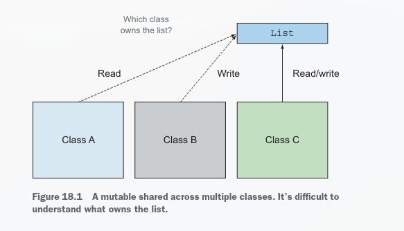
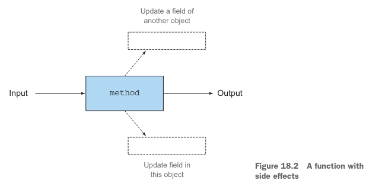
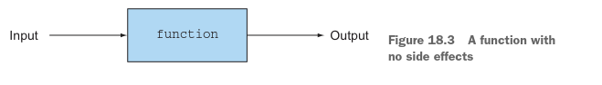
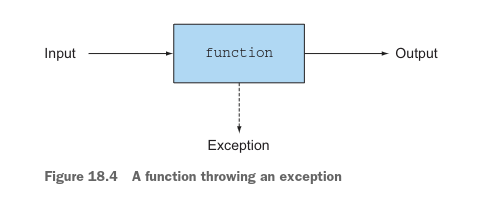
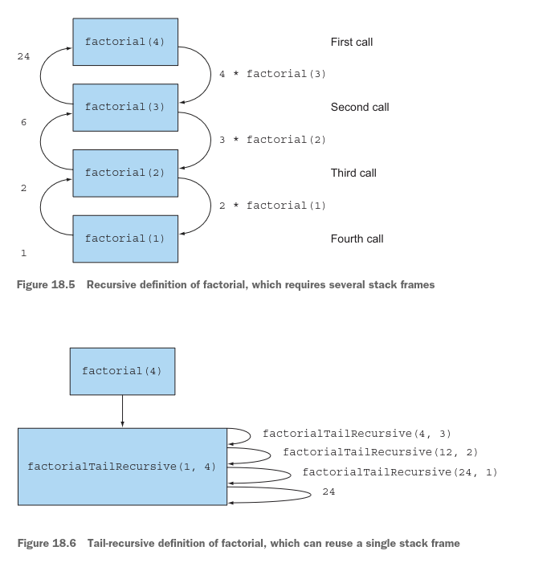

# Parte 6

# Programación funcional y la evolución futura de Java

En la parte final de este libro, retrocedemos un poco con una introducción tutorial sobre cómo escribir programas 
efectivos de estilo funcional en Java, junto con una comparación de las características de Java 8 con las de Scala.
---
El capítulo 18 ofrece un tutorial completo sobre programación funcional, introduce algo de su terminología y explica 
ómo escribir programas de estilo funcional en Java.
El capítulo 19 cubre técnicas de programación funcional más avanzadas, incluyendo funciones de orden superior, currying,
estructuras de datos persistentes, listas perezosas y pattern matching. Puede ver este capítulo como una mezcla de 
técnicas prácticas para aplicar en su base de código, así como información académica que lo convertirá en un programador
más informado.

El capítulo 20 continúa discutiendo cómo las características de Java 8 se comparan con las características del lenguaje 
Scala — un lenguaje que, como Java, está implementado sobre la JVM y que ha evolucionado rápidamente para amenazar 
algunos aspectos del nicho de Java en el ecosistema de lenguajes de programación.

Finalmente, el capítulo 21 repasa el viaje de aprendizaje sobre Java 8 y el suave impulso hacia la programación de 
estilo funcional. Además, especulamos sobre qué mejoras futuras y grandes características nuevas pueden estar en el 
pipeline de Java más allá de Java 8 y Java 9.

# Pensando funcionalmente

### Este capítulo cubre
- ¿Por qué programación funcional?
- ¿Qué define la programación funcional?
- Programación declarativa y transparencia referencial
- Guías para escribir Java de estilo funcional
- Iteración versus recursión

Has visto el término funcional con bastante frecuencia a lo largo de este libro. A estas alturas, es posible que tengas 
algunas ideas sobre lo que implica ser funcional. ¿Se trata de lambdas y funciones de primera clase, o de restringir tu 
derecho a mutar objetos? ¿Qué logras al adoptar un estilo funcional?
En este capítulo, arrojamos luz sobre las respuestas a estas preguntas. Explicamos qué es la programación funcional e 
introducimos algo de su terminología. Primero, examinamos los conceptos detrás de la programación funcional como efectos
secundarios, inmutabilidad, programación declarativa y transparencia referencial — y luego relacionamos estos conceptos 
con Java 8. En el capítulo 19, observamos más de cerca las técnicas de programación funcional como funciones de orden 
superior, currying, estructuras de datos persistentes, listas perezosas, pattern matching y combinadores.

## 18.1 Implementando y manteniendo sistemas
Para comenzar, imagina que te han pedido gestionar una actualización de un gran sistema de software que no has visto 
antes. ¿Deberías aceptar el trabajo de mantener dicho sistema de software? La máxima apenas en broma de un contratista 
experimentado de Java para decidir es "Comienza buscando la palabra clave synchronized; si la encuentras, solo di que no
(reflejando la dificultad de arreglar bugs de concurrencia). De lo contrario, considera la estructura del sistema con más
detalle." Proporcionamos más detalle en los siguientes párrafos. Primero, sin embargo, notaremos que como has visto en 
capítulos anteriores, la adición de streams en Java 8 te permite explotar el paralelismo sin preocuparte por el bloqueo,
siempre que adoptes comportamientos sin estado. (Esto es, las funciones en tu pipeline de procesamiento de streams no 
interactúan, con una función leyendo o escribiendo una variable que es escrita por otra).
¿Qué más podrías querer que el programa tenga para que sea fácil de trabajar? Querrías que esté bien estructurado, con 
una jerarquía de clases comprensible que refleje la estructura del sistema. Tienes formas de estimar dicha estructura 
usando las métricas de ingeniería de software acoplamiento (qué tan interdependientes son las partes del sistema) y 
cohesión (qué tan relacionadas están las diversas partes del sistema).
Pero para muchos programadores, la preocupación clave del día a día es la depuración durante el mantenimiento: algún 
código falló porque observó un valor inesperado. ¿Pero qué partes del programa estuvieron involucradas en crear y 
modificar este valor? ¡Piensa en cuántas de tus preocupaciones de mantenimiento caen en esta categoría! Resulta que los
conceptos de sin efectos secundarios e inmutabilidad, que la programación funcional promueve, pueden ayudar. Examinamos 
estos conceptos con más detalle en las siguientes secciones.

### 18.1.1 Datos mutables compartidos
En última instancia, la razón del problema del valor inesperado de variable discutido en la sección precedente es que 
las estructuras de datos mutables compartidas son leídas y actualizadas por más de uno de los métodos en los que se 
centra tu mantenimiento. Supongamos que varias clases mantienen una referencia a una lista. Como mantenedor, necesitas 
establecer respuestas a las siguientes preguntas:

- ¿Quién es dueño de esta lista?
- ¿Qué sucede si una clase modifica la lista?
- ¿Otras clases esperan este cambio?
- ¿Cómo se enteran esas clases de este cambio?
- ¿Necesitan las clases ser notificadas de este cambio para satisfacer todas las suposiciones en esta lista, o deberían 
hacer copias defensivas para sí mismas?

En otras palabras, las estructuras de datos mutables compartidas hacen más difícil rastrear cambios en diferentes partes
de tu programa. La figura 18.1 ilustra esta idea.



Considera un sistema que no mute ninguna estructura de datos. Este sistema sería un sueño de mantener porque no tendrías
malas sorpresas sobre algún objeto en algún lugar que modifica inesperadamente una estructura de datos. Un método que no 
modifica ni el estado de su clase contenedora ni el estado de ningún otro objeto y devuelve todos sus resultados usando 
return se llama puro o libre de efectos secundarios.
¿Qué constituye un efecto secundario? En pocas palabras, un efecto secundario es una acción que no está totalmente 
contenida dentro de la función misma. Aquí hay algunos ejemplos:
 Modificar una estructura de datos en el lugar, incluyendo asignar a cualquier campo, aparte de la inicialización 
dentro de un constructor (como métodos setter)
- Lanzar una excepción
- Realizar operaciones de E/S como escribir en un archivo

Otra forma de ver la idea de sin efectos secundarios es considerar los objetos inmutables. Un objeto inmutable es un 
objeto que no puede cambiar su estado después de ser instanciado, por lo que no puede ser afectado por las acciones de 
una función. Cuando los objetos inmutables son instanciados, nunca pueden entrar en un estado inesperado. Puedes 
compartirlos sin tener que copiarlos, y son thread-safe porque no pueden ser modificados.
La idea de sin efectos secundarios puede parecer una restricción severa, y puedes dudar si los sistemas reales pueden 
construirse de esta manera. Esperamos persuadirte de que pueden construirse para el final del capítulo. La buena noticia
es que los componentes de los sistemas que adoptan esta idea pueden usar paralelismo de múltiples núcleos sin usar 
bloqueo, porque los métodos ya no pueden interferir entre sí. Además, este concepto es excelente para entender 
inmediatamente qué partes del programa son independientes.
Estas ideas provienen de la programación funcional, a la que nos dirigimos en la siguiente sección.

### 18.1.2 Programación declarativa
Primero, exploramos la idea de la programación declarativa, en la cual se basa la programación funcional. Hay dos formas
de pensar sobre la implementación de un sistema escribiendo un programa. Una forma se centra en cómo se hacen las cosas.
(Primero haz esto, luego actualiza aquello, y así sucesivamente.) Si quieres calcular la transacción más cara en una 
lista, por ejemplo, típicamente ejecutas una secuencia de comandos. (Toma una transacción de la lista y compárala con la
transacción más cara provisional; si es más cara, se convierte en la más cara provisional; repite con la siguiente 
transacción en la lista, y así sucesivamente.) Este estilo "cómo" de programación es una excelente combinación para la 
programación clásica orientada a objetos (a veces llamada programación imperativa), porque tiene instrucciones que imitan
el vocabulario de bajo nivel de una computadora (como asignación, bifurcación condicional y bucles), como se muestra en 
este código:
```java
Transaction mostExpensive = transactions.get(0);
if(mostExpensive == null)
throw new IllegalArgumentException("Empty list of transactions");
for(Transaction t: transactions.subList(1, transactions.size())){
if(t.getValue() > mostExpensive.getValue()){
mostExpensive = t;
}
}
```
La otra forma se centra en qué se va a hacer. Viste en los capítulos 4 y 5 que usando la API de Streams, podías 
especificar esta consulta de la siguiente manera:
```java
Optional<Transaction> mostExpensive = transactions.stream()
        .max(comparing(Transaction::getValue));
```
El detalle fino de cómo se implementa esta consulta se deja a la biblioteca. Nos referimos a esta idea como iteración
interna. La gran ventaja es que tu consulta se lee como el enunciado del problema, y por esa razón, es inmediatamente 
clara, en comparación con tratar de entender lo que hace una secuencia de comandos.
Este estilo "qué" se llama a menudo programación declarativa. Proporcionas reglas que dicen lo que quieres, y esperas 
que el sistema decida cómo lograr ese objetivo. Este tipo de programación es excelente porque se lee más cerca del 
enunciado del problema.

### 18.1.3 ¿Por qué programación funcional?
La programación funcional ejemplifica esta idea de programación declarativa (di lo que quieras usando expresiones que no
interactúan, y para las cuales el sistema puede elegir la implementación) y cómputo libre de efectos secundarios, 
explicado antes en este capítulo. Estas dos ideas pueden ayudarte a implementar y mantener sistemas más fácilmente.
Ten en cuenta que ciertas características del lenguaje, como componer operaciones y pasar comportamientos 
(que presentamos en el capítulo 3 usando expresiones lambda), son requeridas para leer y escribir código de una manera 
natural con un estilo declarativo. Usando streams, puedes encadenar varias operaciones para expresar una consulta 
complicada. Estas características caracterizan a los lenguajes de programación funcional. Observamos estas 
características más cuidadosamente bajo la apariencia de combinadores en el capítulo 19.
Para hacer la discusión tangible y conectarla con las nuevas características de Java 8, en la siguiente sección 
definimos concretamente la idea de programación funcional y su representación en Java. Nos gustaría transmitir el hecho 
de que usando el estilo de programación funcional, puedes escribir programas serios sin depender de efectos secundarios.
---

## 18.2 ¿Qué es la programación funcional?
La respuesta demasiado simplista a "¿Qué es la programación funcional?" es "Programar con funciones." ¿Qué es una función?
Es fácil imaginar un método que toma un int y un double como argumentos y produce un double — y también tiene el efecto 
secundario de contar el número de veces que ha sido llamado actualizando una variable mutable, como se ilustra en la 
figura 18.2.



En el contexto de la programación funcional, sin embargo, una función corresponde a una función matemática: toma cero o 
más argumentos, devuelve uno o más resultados, y no tiene efectos secundarios. Puedes ver una función como una caja negra
que toma algunas entradas y produce algunas salidas, como se ilustra en la figura 18.3.



La distinción entre este tipo de función y los métodos que ves en lenguajes de programación como Java es central. 
(La idea de que funciones matemáticas como log o sin pudieran tener tales efectos secundarios es impensable.) En 
particular, las funciones matemáticas siempre devuelven los mismos resultados cuando se llaman repetidamente con los
mismos argumentos. Esta caracterización descarta métodos como Random.nextInt, y discutimos más a fondo este concepto de
transparencia referencial en la sección 18.2.2.
Cuando decimos funcional, nos referimos a como en matemáticas, sin efectos secundarios. Ahora aparece una sutileza de 
programación. ¿Queremos decir: cada función está construida solo con funciones e ideas matemáticas como if-then-else? 
¿O podría una función hacer cosas no funcionales internamente siempre que no exponga ninguno de estos efectos secundarios 
al resto del sistema? En otras palabras, si los programadores realizan un efecto secundario que no puede ser observado 
por los llamadores, ¿existe ese efecto secundario? Los llamadores no necesitan saberlo ni importarles, porque no puede 
afectarlos.
Para enfatizar la diferencia, nos referimos a la primera como programación puramente funcional y a la última como 
programación de estilo funcional.

### 18.2.1 Java de estilo funcional
En la práctica, no puedes programar completamente en estilo puramente funcional en Java. El modelo de E/S de Java 
consiste en métodos con efectos secundarios, por ejemplo. (Llamar a Scanner.nextLine tiene el efecto secundario de 
consumir una línea de un archivo, así que llamarlo dos veces típicamente produce resultados diferentes.) No obstante, es
posible escribir componentes centrales de tu sistema como si fueran puramente funcionales. En Java, vas a escribir 
programas de estilo funcional.
Primero, hay una sutileza adicional acerca de que nadie vea tus efectos secundarios y, por lo tanto, en el significado 
de funcional. Supón que una función o método no tiene efectos secundarios excepto incrementar un campo al entrar y 
decrementarlo al salir. Desde el punto de vista de un programa que consiste en un solo hilo, este método no tiene efectos
secundarios visibles y puede considerarse de estilo funcional. Por otro lado, si otro hilo pudiera inspeccionar el 
campo — o pudiera llamar al método concurrentemente — el método no sería funcional. Podrías ocultar este problema 
envolviendo el cuerpo de este método con un bloqueo, lo que te permitiría argumentar que el método es funcional. Pero al
hacerlo, perderías la capacidad de ejecutar dos llamadas al método en paralelo usando dos núcleos en tu procesador 
multinúcleo. Tu efecto secundario puede no ser visible para un programa, pero es visible para el programador en términos
de ejecución más lenta.
Nuestra guía es que para ser considerado de estilo funcional, una función o método puede mutar solo variables locales. 
Además, los objetos a los que hace referencia deben ser inmutables — esto es, todos los campos son final, y todos los 
campos de tipo referencia refieren transitivamente a otros objetos inmutables. Más adelante, puedes permitir 
actualizaciones a campos de objetos que son recién creados en el método, de modo que no sean visibles desde otro lugar 
i se guarden para afectar el resultado de una llamada subsecuente.
Nuestra guía es incompleta, sin embargo. Hay un requisito adicional para ser funcional: que una función o método no debe
lanzar ninguna excepción. Una justificación es que lanzar una excepción significaría que se está señalando un resultado 
distinto a través del retorno de un valor de la función; consulta el modelo de caja negra de la figura 18.2. Hay margen
para el debate aquí, con algunos autores argumentando que las excepciones no capturadas que representan errores fatales 
están bien y que es el acto de capturar una excepción lo que representa un flujo de control no funcional. Tal uso de 
excepciones aún rompe la metáfora simple de "pasar argumentos, devolver resultado" representada en el modelo de caja 
negra, sin embargo, llevando a una tercera flecha que representa una excepción, como se ilustra en la figura 18.4.



### Funciones y funciones parciales
En matemáticas, se requiere que una función dé exactamente un resultado para cada posible valor de argumento. Pero 
muchas operaciones matemáticas comunes son lo que propiamente deberían llamarse funciones parciales. Esto es, para 
algunos o la mayoría de los valores de entrada, dan exactamente un resultado, pero para otros valores de entrada, están 
indefinidas y no dan ningún resultado. Un ejemplo es la división cuando el segundo operando es cero o sqrt cuando su 
argumento es negativo. A menudo modelamos estas situaciones en Java lanzando una excepción. 

¿Cómo podrías expresar funciones como la división sin usar excepciones? Usa tipos como Optional<T>. En lugar de tener la
firma "double sqrt(double) pero puede lanzar una excepción", sqrt tendría la firma Optional<Double> sqrt(double). O 
devuelve un valor que representa éxito, o indica en su valor de retorno que no pudo realizar la operación solicitada. Y 
sí, hacer esto significa que el llamador necesita verificar si cada llamada a método puede resultar en un Optional vacío.
Esto puede sonar a algo enorme, pero pragmáticamente, dada nuestra guía sobre programación de estilo funcional versus 
programación puramente funcional, puedes elegir usar excepciones localmente pero no exponerlas a través de interfaces de
gran escala, obteniendo así las ventajas del estilo funcional sin el riesgo de inflación de código.
Para ser considerado funcional, tu función o método debe llamar solo a aquellas funciones de biblioteca con efectos 
secundarios para las cuales puedas ocultar el comportamiento no funcional (esto es, asegurando que cualquier mutación 
que hagan en estructuras de datos esté oculta de tu llamador, quizás copiando primero y capturando cualquier excepción).
En la sección 18.2.4, ocultas el uso de una función de biblioteca con efectos secundarios List.add dentro de un método 
insertAll copiando la lista.
A menudo puedes marcar estas prescripciones usando comentarios o declarando un método con una anotación marcadora y 
coincidir con las restricciones que impusiste en las funciones pasadas a operaciones de procesamiento de streams 
paralelos como Stream.map en los capítulos 4–7.
Finalmente, por razones pragmáticas, puede resultarte conveniente que el código de estilo funcional pueda generar 
información de depuración hacia alguna forma de archivo de registro. Este código no puede describirse estrictamente como
funcional, pero en la práctica, retienes la mayoría de los beneficios de la programación de estilo funcional.

### 18.2.2 Transparencia referencial
Las restricciones sobre ningún efecto secundario visible (sin mutar estructura visible para los llamadores, sin E/S, sin 
excepciones) codifican el concepto de transparencia referencial. Una función es referencialmente transparente si siempre
devuelve el mismo valor resultante cuando se llama con el mismo valor de argumento. El método String.replace, por 
ejemplo, es referencialmente transparente porque "raoul".replace('r', 'R') siempre produce el mismo resultado (replace 
devuelve un nuevo String con todas las rs minúsculas reemplazadas por Rs mayúsculas) en lugar de actualizar su objeto 
this, por lo que puede considerarse una función.
Dicho de otra manera, una función produce consistentemente el mismo resultado dado la misma entrada, sin importar dónde 
y cuándo se invoque. También explica por qué Random.nextInt no se considera funcional. En Java, usar un objeto Scanner 
para obtener la entrada del teclado de un usuario viola la transparencia referencial porque llamar al método nextLine 
puede producir un resultado diferente en cada llamada. Pero sumar dos variables final int siempre produce el mismo 
resultado porque el contenido de las variables nunca puede cambiar.
La transparencia referencial es una gran propiedad para la comprensión de programas. También abarca la optimización de 
guardar-en-lugar-de-recalcular para operaciones costosas o de larga duración, un proceso que recibe el nombre de 
memoización o caché. Aunque importante, este tema es un poco tangencial aquí, así que lo discutimos en el capítulo 19.
Java tiene una ligera complicación con respecto a la transparencia referencial. Supón que haces dos llamadas a un método
que devuelve un List. Las dos llamadas pueden devolver referencias a listas distintas en memoria pero que contienen los 
mismos elementos. Si estas listas han de ser vistas como valores mutables orientados a objetos (y por lo tanto no 
idénticas), el método no es referencialmente transparente. Si planeas usar estas listas como valores puros (inmutables),
tiene sentido ver los valores como iguales, por lo que la función es referencialmente transparente. En general, en 
código de estilo funcional, eliges considerar tales funciones como referencialmente transparentes.
En la siguiente sección, exploramos si mutar desde una perspectiva más amplia.

### 18.2.3 Programación orientada a objetos vs. de estilo funcional
Comenzamos contrastando la programación de estilo funcional con la programación clásica (extrema) orientada a objetos 
antes de observar que Java 8 ve estos estilos como meros extremos en el espectro orientado a objetos. Como programador 
de Java, sin pensar conscientemente en ello, casi con seguridad usas algunos aspectos de la programación de estilo 
funcional y algunos aspectos de lo que llamaremos programación extrema orientada a objetos. Como señalamos en el 
capítulo 1, los cambios en el hardware (como multinúcleo) y las expectativas de los programadores (como consultas estilo
base de datos para manipular datos) están empujando los estilos de ingeniería de software de Java más hacia el extremo 
funcional de este espectro, y uno de los objetivos de este libro es ayudarte a adaptarte al clima cambiante.
En un extremo del espectro está la visión extrema orientada a objetos: todo es un objeto, y los programas operan 
actualizando campos y llamando métodos que actualizan su objeto asociado. En el otro extremo del espectro yace el estilo 
de programación funcional referencialmente transparente de ninguna mutación (visible). En la práctica, los programadores 
de Java siempre han mezclado estos estilos. Podrías recorrer una estructura de datos usando un Iterator que contiene 
estado interno mutable pero usarlo para calcular, digamos, la suma de valores en la estructura de datos de una manera de
estilo funcional. (En Java, como se discutió antes, este proceso puede incluir mutar variables locales.) Uno de los 
objetivos de este capítulo y del capítulo 19 es discutir técnicas de programación e introducir características de la 
programación funcional para permitirte escribir programas que sean más modulares y más adecuados para procesadores 
multinúcleo. Piensa en estas ideas como armas adicionales en tu arsenal de programación.

### 18.2.4 Estilo funcional en la práctica
Para comenzar, resolvamos un ejercicio de programación dado a estudiantes principiantes que ejemplifica el estilo 
funcional: dado un valor List<Integer>, como {1, 4, 9}, construye un valor List<List<Integer>> cuyos miembros sean todos
los subconjuntos de {1, 4, 9}, en cualquier orden. Los subconjuntos de {1, 4, 9} son {1, 4, 9}, {1, 4}, {1, 9}, {4, 9}, 
{1}, {4}, {9}, y {}. Hay ocho subconjuntos, incluyendo el subconjunto vacío, escrito {}. Cada subconjunto se representa 
como tipo List<Integer>, lo que significa que la respuesta es de tipo List<List<Integer>>.
Los estudiantes a menudo tienen problemas pensando cómo comenzar y necesitan una pista con el comentario "Los 
subconjuntos de {1, 4, 9} o contienen 1 o no." Los que no contienen 1 son subconjuntos de {4, 9}, y los que sí contienen 
1 pueden obtenerse tomando los subconjuntos de {4, 9} e insertando 1 en cada uno de ellos. Hay una sutileza sin embargo:
debemos recordar que el conjunto vacío tiene exactamente un subconjunto — él mismo. Este entendimiento te da una 
codificación fácil, natural, de arriba hacia abajo, de estilo de programación funcional en Java como sigue:
```java
static List<List<Integer>> subsets(List<Integer> list) {
    if (list.isEmpty()) { //Si la lista de entrada está vacía, tiene un subconjunto: la lista vacía misma.
        List<List<Integer>> ans = new ArrayList<>();
        ans.add(Collections.emptyList());
        return ans;
    }
    Integer fst = list.get(0);
    List<Integer> rest = list.subList(1, list.size());
    //De lo contrario, toma un elemento, fst, y encuentra todos los subconjuntos del resto para obtener subAns; subAns 
    // forma la mitad de la respuesta.
    List<List<Integer>> subAns = subsets(rest);
    //La otra mitad de la respuesta, subAns2, consiste en todas las listas en subAns pero ajustadas anteponiendo fst a 
    // cada una de estas listas de elementos.
    List<List<Integer>> subAns2 = insertAll(fst, subAns);
    //Entonces concatena los dos subanswers.
    return concat(subAns, subAns2);
}
```
El programa solución produce {{}, {9}, {4}, {4, 9}, {1}, {1, 9}, {1, 4}, {1, 4, 9}} cuando se le da {1, 4, 9} como 
entrada. Inténtalo cuando hayas definido los dos métodos faltantes.
Para repasar, has asumido que los métodos faltantes insertAll y concat son en sí mismos funcionales y deducido que tu 
función subsets también es funcional, porque ninguna operación en ella muta ninguna estructura existente. (Si estás 
familiarizado con matemáticas, reconocerás este argumento como por inducción.)
Ahora veamos cómo definir insertAll. Aquí está el primer punto de peligro. Supón que definieras insertAll de modo que 
mutara sus argumentos, quizás actualizando todos los elementos de subAns para que contengan fst. Entonces el programa 
causaría incorrectamente que subAns se modificara de la misma manera que subAns2, resultando en una respuesta que 
misteriosamente contenía ocho copias de {1,4,9}. En su lugar, define insertAll funcionalmente de la siguiente manera:
```java
static List<List<Integer>> insertAll(Integer fst,
List<List<Integer>> lists) {
    List<List<Integer>> result = new ArrayList<>();
    for (List<Integer> list : lists) {
        //Copia la lista para que puedas agregarle. No copiarías la estructura de nivel inferior aunque fuera mutable. 
        // (Los Integers no son mutables.)
        List<Integer> copyList = new ArrayList<>();
        copyList.add(fst);
        copyList.addAll(list);
        result.add(copyList);
    }
    return result;
}
```
Ten en cuenta que estás creando una nueva List que contiene todos los elementos de subAns. Te aprovechas del hecho de que
un objeto Integer es inmutable; de lo contrario, tendrías que clonar cada elemento también. El enfoque provocado por 
pensar en métodos como insertAll como funcionales te da un lugar natural para poner todo este código cuidadosamente 
copiado: dentro de insertAll en lugar de en sus llamadores.
Finalmente, necesitas definir el método concat. En este caso, la solución es simple, pero te rogamos que no la uses; la 
mostramos solo para que puedas comparar los diferentes estilos:
```java
static List<List<Integer>> concat(List<List<Integer>> a,
List<List<Integer>> b) {
    a.addAll(b);
    return a;
}
```
En su lugar, sugerimos que escribas este código:
```java
static List<List<Integer>> concat(List<List<Integer>> a,
List<List<Integer>> b) {
    List<List<Integer>> r = new ArrayList<>(a);
    r.addAll(b);
    return r;
}
```
¿Por qué? La segunda versión de concat es una función pura. La función puede estar usando mutación (agregando elementos 
a la lista r) internamente, pero devuelve un resultado basado en sus argumentos y no modifica ninguno de ellos. Por el 
contrario, la primera versión depende del hecho de que después de la llamada concat(subAns, subAns2), nadie se refiere 
al valor de subAns nuevamente. Para nuestra definición de subsets, este es el caso, así que seguramente usar la versión
más barata de concat es mejor. La respuesta depende de cómo valores tu tiempo. Compara el tiempo que gastarías después
buscando bugs oscuros versus el costo adicional de hacer una copia.
No importa qué tan bien comentes que el concat impuro es "para usarse solo cuando el primer argumento puede ser 
sobrescrito arbitrariamente, y destinado a usarse solo en el método subsets, y cualquier cambio en subsets debe ser 
revisado a la luz de este comentario", alguien, en algún momento, lo encontrará útil en alguna pieza de código donde 
aparentemente parece funcionar. Tu futura pesadilla de depuración ha nacido. Retomamos este tema en el capítulo 19.
Punto clave: pensar en problemas de programación en términos de métodos de estilo función que se caracterizan solo por 
sus argumentos de entrada y resultados de salida (qué hacer) es a menudo más productivo que pensar en cómo hacerlo y qué
mutar demasiado pronto en el ciclo de diseño.
En la siguiente sección, discutimos la recursión en detalle.
---

## 18.3 Recursión vs. iteración
La recursión es una técnica promovida en la programación funcional para permitirte pensar en términos de estilo qué hacer.
Los lenguajes de programación puramente funcionales típicamente no incluyen constructos iterativos como while y for. 
Tales constructos son a menudo invitaciones ocultas para usar mutación. La condición en un bucle while necesita ser 
actualizada, por ejemplo; de lo contrario, el bucle se ejecutaría cero veces o un número infinito de veces. En muchos 
casos, sin embargo, los bucles están bien. Hemos argumentado que para el estilo funcional, se permite la mutación si 
nadie puede verte haciéndolo, por lo que es aceptable mutar variables locales. Cuando usas el bucle for-each en Java, 
for(Apple apple : apples) { }, esto se decodifica en un Iterator
```java
Iterator<Apple> it = apples.iterator();
while (it.hasNext()){
Apple apple = it.next();
// ...
}
```
Esta traducción no es un problema porque las mutaciones (cambiar el estado del Iterator con el método next y asignar a 
la variable apple dentro del cuerpo del while) no son visibles para el llamador del método donde ocurren las mutaciones.
Pero cuando usas un bucle for-each, como un algoritmo de búsqueda, por ejemplo, lo que sigue es problemático porque el 
cuerpo del bucle está actualizando una estructura de datos que es compartida con el llamador:
```java
public void searchForGold(List<String> l, Stats stats) {
    for (String s : l) {
        if ("gold".equals(s)) {
            stats.incrementFor("gold");
        }
    }
}
```
Efectivamente, el cuerpo del bucle tiene un efecto secundario que no puede descartarse como estilo funcional: muta el 
estado del objeto stats, que es compartido con otras partes del programa.
Por esta razón, los lenguajes de programación puramente funcionales como Haskell omiten tales operaciones con efectos 
secundarios. ¿Cómo se supone que debes escribir programas? La respuesta teórica es que cada programa puede reescribirse
para evitar la iteración usando recursión en su lugar, la cual no requiere mutabilidad. Usar recursión te permite 
deshacerte de las variables de iteración que se actualizan paso a paso. Un problema escolar clásico es calcular la 
función factorial (para argumentos positivos) de manera iterativa y de manera recursiva (asumiendo que la entrada es > 0),
como se muestra en los siguientes dos listados.

Listado 18.1 Factorial iterativo:
```java
static long factorialIterative(long n) {
    long r = 1;
    for (int i = 1; i <= n; i++) {
        r *= i;
    }
    return r;
}
```
Factorial recursivo:
```java
static long factorialRecursive(long n) {
    return n == 1 ? 1 : n * factorialRecursive(n - 1);
}
```
El primer listado demuestra una forma estándar basada en bucles: las variables r y i se actualizan en cada iteración. El
segundo listado muestra una definición recursiva (la función se llama a sí misma) en una forma matemáticamente más 
familiar. En Java, las formas recursivas típicamente son menos eficientes, como discutimos inmediatamente después del 
siguiente ejemplo.
Sin embargo, si has leído los capítulos anteriores de este libro, sabes que los streams de Java 8 proporcionan una forma
declarativa aún más simple de definir factorial, como se muestra en el siguiente listado.

Listado 18.3 Factorial con streams:
```java
static long factorialStreams(long n) {
    return LongStream.rangeClosed(1, n)
            .reduce(1, (long a, long b) -> a * b);
}
```
Ahora pasaremos a la eficiencia. Como usuarios de Java, cuidado con los fanáticos de la programación funcional que te 
dicen que siempre debes usar recursión en lugar de iteración. En general, hacer una llamada a función recursiva es mucho
más costoso que emitir la instrucción de bifurcación a nivel de máquina necesaria para iterar. Cada vez que se llama a 
la función factorial recursiva, se crea un nuevo marco de pila en la pila de llamadas para mantener el estado de cada 
llamada a función (la multiplicación que necesita hacer) hasta que la recursión termine. Tu definición recursiva de 
factorial consume memoria proporcional a su entrada. Por esta razón, si ejecutas factorialRecursive con una entrada 
grande, es probable que recibas un StackOverflowError:
```java
Exception in thread "main" java.lang.StackOverflowError
```
¿Es la recursión inútil? ¡Por supuesto que no! Los lenguajes funcionales proporcionan una respuesta a este problema: 
optimización de llamada tail-call. La idea básica es que puedes escribir una definición recursiva de factorial en la que
la llamada recursiva sea lo último que sucede en la función (o la llamada está en una posición tail). Esta forma 
diferente de estilo de recursión puede optimizarse para ejecutarse rápido. El siguiente listado proporciona una 
definición tail-recursiva de factorial.

Listado 18.4 Factorial tail-recursivo:
```java
static long factorialTailRecursive(long n) {
    return factorialHelper(1, n);
}
static long factorialHelper(long acc, long n) {
    return n == 1 ? acc : factorialHelper(acc * n, n - 1);
}
```
La función factorialHelper es tail-recursiva porque la llamada recursiva es lo último que sucede en la función. Por el 
contrario, en la definición anterior de factorialRecursive, lo último era una multiplicación de n y el resultado de una 
llamada recursiva. Esta forma de recursión es útil porque en lugar de almacenar cada resultado intermedio de la recursión
en marcos de pila separados, el compilador puede decidir reutilizar un único marco de pila. De hecho, en la definición 
de factorialHelper, los resultados intermedios (los resultados parciales del factorial) se pasan directamente como 
argumentos a la función. No hay necesidad de llevar un seguimiento del resultado intermedio de cada llamada recursiva en
un marco de pila separado; es accesible directamente como el primer argumento de factorialHelper. Las figuras 18.5 y 
18.6 ilustran la diferencia entre las definiciones recursiva y tail-recursiva de factorial.
La mala noticia es que Java no soporta este tipo de optimización. Pero adoptar la recursión tail puede ser una mejor 
práctica que la recursión clásica porque abre el camino a una eventual optimización del compilador. Muchos lenguajes JVM 
modernos como Scala, Groovy y Kotlin pueden optimizar esos usos de recursión, que son equivalentes a la iteración 
(y se ejecutan a la misma velocidad). Como resultado, los adeptos a la programación puramente funcional pueden tener su 
pastel de pureza y comérselo también de manera eficiente.
La guía al escribir Java 8 es que a menudo puedes reemplazar la iteración con streams para evitar la mutación. Además, 
puedes reemplazar la iteración con recursión cuando la recursión te permita escribir un algoritmo de una manera más 
concisa y libre de efectos secundarios. De hecho,



la recursión puede hacer que los ejemplos sean más fáciles de leer, escribir y entender (como en el ejemplo de subsets 
mostrado antes en este capítulo), y la eficiencia del programador es a menudo más importante que pequeñas diferencias en
el tiempo de ejecución.
En esta sección, discutimos la programación de estilo funcional con la idea de un método siendo funcional; todo lo que 
dijimos se habría aplicado a la primera versión de Java. En el capítulo 19, veremos las increíbles y poderosas 
posibilidades que ofrece la introducción de funciones de primera clase en Java 8.
--- 

### Resumen
- Reducir las estructuras de datos mutables compartidas puede ayudarte a mantener y depurar tus programas a largo plazo.
- La programación de estilo funcional promueve métodos libres de efectos secundarios y programación declarativa.
- Los métodos de estilo función se caracterizan únicamente por sus argumentos de entrada y su resultado de salida.
- Una función es referencialmente transparente si siempre devuelve el mismo valor resultante cuando se llama con el mismo
valor de argumento. Los constructos iterativos como los bucles while pueden reemplazarse por recursión.
- La recursión tail puede ser una mejor práctica que la recursión clásica en Java porque abre el camino a una potencial 
optimización del compilador.