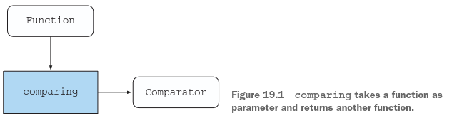
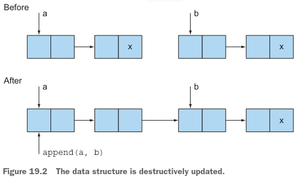
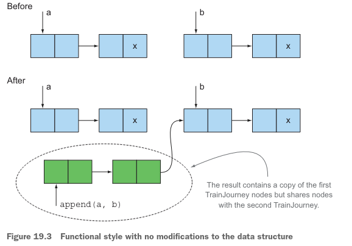
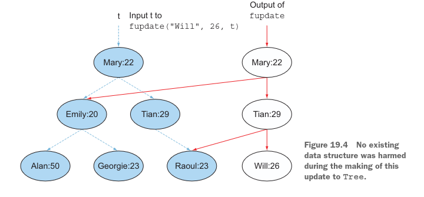
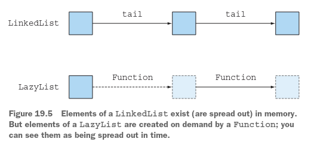

# Técnicas de programación funcional

### Este capítulo cubre
- Ciudadanos de primera clase, funciones de orden superior, currying y aplicación parcial
- Estructuras de datos persistentes
- Evaluación perezosa y listas perezosas como generalización de los streams de Java
- Pattern matching y cómo simularlo en Java
- Transparencia referencial y caché

En el capítulo 18, viste cómo pensar funcionalmente; pensar en términos de métodos sin efectos secundarios puede 
ayudarte a escribir código más mantenible. En este capítulo, introducimos técnicas de programación funcional más 
avanzadas. Puedes ver este capítulo como una mezcla de técnicas prácticas para aplicar en tu base de código, así como 
información académica que te convertirá en un programador más conocedor. Discutimos funciones de orden superior, 
currying, estructuras de datos persistentes, listas perezosas, pattern matching, caché con transparencia referencial, y 
combinadores.

## 19.1 Funciones en todas partes
En el capítulo 18 usamos la frase programación de estilo funcional para significar que el comportamiento de las funciones
y métodos debería ser como el de las funciones de estilo matemático, sin efectos secundarios. Los programadores de 
lenguajes funcionales a menudo usan la frase con más generalidad para significar que las funciones pueden ser usadas como
otros valores: pasadas como argumentos, devueltas como resultados, y almacenadas en estructuras de datos. Las funciones 
que pueden ser usadas como otros valores se denominan funciones de primera clase. Las funciones de primera clase son lo 
que Java 8 añadió sobre versiones anteriores de Java: puedes usar cualquier método como un valor de función, usando el 
operador `::` para crear una referencia a método, y expresiones lambda (como (int x) -> x + 1) para expresar valores de 
función directamente. En Java 8 es perfectamente válido almacenar el método Integer.parseInt en una variable usando una 
referencia a método de la siguiente manera:
```java
Function<String, Integer> strToInt = Integer::parseInt;
```
### 19.1.1 Funciones de orden superior
Hasta ahora, has usado principalmente el hecho de que los valores de función son de primera clase solo para pasarlos a 
operaciones de procesamiento de streams de Java 8 (como en los capítulos 4–7) y para lograr el efecto similar de 
parametrización de comportamiento cuando pasaste Apple::isGreenApple como un valor de función a filterApples en los 
capítulos 1 y 2. Otro ejemplo interesante fue usar el método estático Comparator.comparing, que toma una función como 
parámetro y devuelve otra función (un Comparator), como se ilustra en el siguiente código y figura 19.1.



```java
Comparator<Apple> c = comparing(Apple::getWeight);
```
Hiciste algo similar cuando compusiste funciones en el capítulo 3 para crear un pipeline de operaciones:
```java
Function<String, String> transformationPipeline
= addHeader.andThen(Letter::checkSpelling)
.andThen(Letter::addFooter);
```
Las funciones (como Comparator.comparing) que pueden hacer al menos una de las siguientes cosas se llaman funciones de 
orden superior dentro de la comunidad de programación funcional:
- Tomar una o más funciones como parámetro
- Devolver una función como resultado

Esta caracterización se relaciona directamente con las funciones de Java 8 porque pueden no solo ser pasadas como 
argumentos, sino también devueltas como resultados, asignadas a variables locales, o incluso insertadas en estructuras. 
Un programa de calculadora de bolsillo podría tener un Map<String, Function<Double, Double>> que mapee el String "sin" a
Function<Double, Double> para mantener la referencia al método Math::sin. Hiciste algo similar cuando aprendiste sobre 
el patrón de diseño factory en el capítulo 8.
Los lectores que disfrutaron el ejemplo de cálculo al final del capítulo 3 pueden considerar el tipo de diferenciación 
como:
```java
Function<Function<Double,Double>, Function<Double,Double>>
```
porque toma una función como argumento (tal como (Double x) -> x * x) y devuelve una función como resultado (en este 
ejemplo, (Double x) -> 2 * x). Hemos escrito este código como un tipo de función (el Function más a la izquierda) para 
afirmar explícitamente el hecho de que podrías pasar esta función diferenciadora a otra función. Pero es bueno recordar 
que el tipo para diferenciar y la firma dicen lo mismo.
```java
Function<Double,Double> differentiate(Function<Double,Double> func);
```
---
### Efectos secundarios y funciones de orden superior
Notamos en el capítulo 7 que las funciones pasadas a operaciones de stream generalmente no tienen efectos secundarios, y
notamos los problemas que surgen de otra manera (como resultados incorrectos e incluso resultados impredecibles debido a
condiciones de carrera que no habías considerado). Este principio también se aplica en general cuando usas funciones de 
orden superior. Cuando estás escribiendo una función o método de orden superior, no sabes de antemano qué argumentos se 
le pasarán y, si los argumentos tienen efectos secundarios, qué podrían hacer esos efectos secundarios. Se vuelve 
demasiado complicado razonar sobre lo que hace tu código si usa funciones pasadas como argumentos que hacen cambios 
impredecibles en el estado de tu programa; tales funciones podrían incluso interferir con tu código de alguna manera 
difícil de depurar. Es un buen principio de diseño documentar qué efectos secundarios estás dispuesto a aceptar de las 
funciones pasadas como parámetros. ¡Ninguno es lo mejor de todo!
En la siguiente sección, pasamos a currying: una técnica que puede ayudarte a modularizar funciones y reutilizar código.
---
### 19.1.2 Currying
Antes de darte la definición teórica de currying, presentaremos un ejemplo. Las aplicaciones casi siempre necesitan ser 
internacionalizadas, por lo que convertir de un conjunto de unidades a otro es un problema que surge repetidamente.
La conversión de unidades siempre involucra un factor de conversión y, de vez en cuando, un factor de ajuste de línea 
base. La fórmula para convertir Celsius a Fahrenheit, por ejemplo, es CtoF(x) = x*9/5 + 32. El patrón básico de toda 
conversión de unidades es el siguiente:

1. Multiplicar por el factor de conversión.
2. Ajustar la línea base si es relevante.

Puedes expresar este patrón con el siguiente método general:
```java
static double converter(double x, double f, double b) {
    return x * f + b;
}
```
Aquí, x es la cantidad que quieres convertir, f es el factor de conversión, y b es la línea base. Pero este método es un
poco demasiado general. Típicamente, requieres muchas conversiones entre el mismo par de unidades, como kilómetros a 
millas. Podrías llamar al método converter con tres argumentos en cada ocasión, pero proporcionar el factor y la línea 
base cada vez sería tedioso, y podrías escribirlos mal accidentalmente. Podrías escribir un nuevo método para cada 
aplicación, pero hacerlo perdería la reutilización de la lógica subyacente.
Aquí hay una manera fácil de beneficiarse de la lógica existente mientras adaptas el convertidor para aplicaciones 
particulares. Puedes definir una fábrica que fabrique funciones de conversión de un argumento para ejemplificar la idea 
de currying:
```java
static DoubleUnaryOperator curriedConverter(double f, double b) {
    return (double x) -> x * f + b;
}
```
Ahora todo lo que tienes que hacer es pasar a curriedConverter el factor de conversión y la línea base (f y b), y 
obedientemente devuelve una función (de x) para hacer lo que pediste. Luego puedes usar la fábrica para producir 
cualquier convertidor que necesites, de la siguiente manera:
```java
DoubleUnaryOperator convertCtoF = curriedConverter(9.0/5, 32);
DoubleUnaryOperator convertUSDtoGBP = curriedConverter(0.6, 0);
DoubleUnaryOperator convertKmtoMi = curriedConverter(0.6214, 0);
```
Debido a que DoubleUnaryOperator define un método applyAsDouble, puedes usar tus convertidores de la siguiente manera:
```java
double gbp = convertUSDtoGBP.applyAsDouble(1000);
```
Como resultado, tu código es más flexible y reutiliza la lógica de conversión existente.
Reflexiona sobre lo que estás haciendo aquí. En lugar de pasar todos los argumentos x, f y b de una vez al método 
converter, pides solo los argumentos f y b y devuelves otra función que, cuando se le da un argumento x, 
devuelve x * f + b. Este proceso de dos etapas te permite reutilizar la lógica de conversión y crear diferentes funciones
con diferentes factores de conversión.

---
### Definición formal de currying 
Currying es una técnica en la que una función f de dos argumentos (tales como x e y) es vista en su lugar como una 
función g de un argumento que devuelve una función también de un argumento. El valor devuelto por la última función es 
el mismo que el valor de la función original — es decir, f(x,y) = (g(x))(y).
Esta definición se generaliza, por supuesto. Puedes aplicar currying a una función de seis argumentos para que primero 
tome los argumentos numerados 2, 4 y 6, que devuelve una función que toma el argumento 5, que devuelve una función que 
toma los argumentos restantes, 1 y 3.
Cuando algunos argumentos (pero menos que el complemento completo de argumentos) han sido pasados, la función está 
parcialmente aplicada.

`Nota: La palabra currying no está relacionada con la comida india; el término lleva el nombre del lógico Haskell Brooks
 Curry, quien popularizó la técnica. Sin embargo, él la atribuyó a Moses Ilyich Schönfinkel. ¿Deberíamos referirnos a 
 currying como schönfinkeling en su lugar?`
---

En la siguiente sección, pasamos a otro aspecto de la programación de estilo funcional: las estructuras de datos. 
¿Es posible programar con estructuras de datos si tienes prohibido modificarlas?

## 19.2 Estructuras de datos persistentes
Las estructuras de datos usadas en programas de estilo funcional tienen varios nombres, como estructuras de datos 
funcionales y estructuras de datos inmutables, pero quizás el más común es estructuras de datos persistentes. 
(Desafortunadamente, esta terminología choca con la noción de persistente en bases de datos, que significa "sobrevivir a
una ejecución del programa".)
Lo primero a notar es que un método de estilo funcional no tiene permitido actualizar ninguna estructura de datos global
ni ninguna estructura pasada como parámetro. ¿Por qué? Porque llamarlo dos veces probablemente produciría respuestas 
diferentes, violando la transparencia referencial y la capacidad de entender el método como un mapeo simple de argumentos
a resultados. 

### 19.2.1 Actualizaciones destructivas vs. funcional
Considera los problemas que pueden surgir. Supongamos que representas viajes en tren de A a B como una clase mutable 
TrainJourney (una implementación simple de una lista enlazada simple), con un campo int que modela algún detalle del 
viaje, como el precio del tramo actual del viaje. Los viajes que requieren cambiar de tren tienen varios objetos 
TrainJourney enlazados a través del campo onward; un tren directo o el tramo final de un viaje tiene onward como null:
```java
class TrainJourney {
public int price;
public TrainJourney onward;
    public TrainJourney(int p, TrainJourney t) {
        price = p;
        onward = t;
    }
}
```
Ahora supón que tienes objetos TrainJourney separados que representan un viaje de X a Y y de Y a Z. Puede que quieras 
crear un viaje que enlace los dos objetos TrainJourney (es decir, X a Y a Z).
Aquí hay un método imperativo tradicional simple para enlazar estos viajes en tren:
```java
static TrainJourney link(TrainJourney a, TrainJourney b) {
    if (a == null) return b;
    TrainJourney t = a;
    while (t.onward != null) {
        t = t.onward;
    }
    t.onward = b;
    return a;
}
```
Este método funciona encontrando el último tramo en el TrainJourney de a y reemplazando el null que marca el final de la
lista de a con la lista b. (Necesitas un caso especial si a no tiene elementos.)
Aquí está el problema: supón que una variable firstJourney contiene la ruta de X a Y y que una variable secondJourney 
contiene la ruta de Y a Z. Si llamas a link(firstJourney, secondJourney), este código actualiza destructivamente 
firstJourney para que también contenga secondJourney, así que además del usuario individual que solicita un viaje de X a
Z viendo el viaje combinado como se pretende, el viaje de X a Y ha sido actualizado destructivamente. De hecho, la 
variable firstJourney ya no es una ruta de X a Y, sino una de X a Z, ¡lo cual rompe el código que depende de que 
firstJourney no sea modificado! Supón que firstJourney representaba el tren tempranero de Londres a Bruselas, que todos 
los usuarios subsiguientes que intentan llegar a Bruselas se sorprenderán al ver que requiere un tramo adicional, quizás
a Colonia. Todos hemos luchado con tales errores sobre cuán visible debe ser un cambio en una estructura de datos.
El enfoque de estilo funcional a este problema es prohibir tales métodos con efectos secundarios. Si necesitas una 
estructura de datos para representar el resultado de un cómputo, deberías crear una nueva, no mutar una estructura de 
datos existente, como has hecho anteriormente. Hacerlo es a menudo una mejor práctica en la programación orientada a 
objetos estándar también. Una objeción común al enfoque funcional es que causa copia excesiva, y el programador dice 
"lo recordaré" o "documentaré" los efectos secundarios. Pero tal optimismo es una trampa para los programadores de 
mantenimiento que tienen que lidiar con tu código más tarde.
Por lo tanto, la solución de estilo funcional es la siguiente:
```java
static TrainJourney append(TrainJourney a, TrainJourney b) {
    return a == null ? b : new TrainJourney(a.price, append(a.onward, b));
}
```
Este código es claramente de estilo funcional (no usa mutación, ni siquiera localmente) y no modifica ninguna estructura
de datos existente. Nota, sin embargo, que el código no crea un nuevo TrainJourney. Si a es una secuencia de n elementos
y b es una secuencia de m elementos, el código devuelve una secuencia de n+m elementos, en la cual los primeros n 
elementos son nuevos nodos y los últimos m elementos comparten con TrainJourney b. Nota que se requiere que los usuarios 
no muten el resultado de append porque al hacerlo, podrían corromper los trenes pasados como secuencia b. Las 
figuras 19.2 y 19.3 ilustran la diferencia entre el append destructivo y el append de estilo funcional.



Append de estilo funcional:



### 19.2.2 Otro ejemplo con árboles
Antes de dejar este tema, considera otra estructura de datos: un árbol de búsqueda binario que podría usarse para 
implementar una interfaz similar a un HashMap. La idea es que un Tree contiene un String que representa una clave y un 
int que representa su valor, quizás nombres y edades:
```java
class Tree {
    private String key;
    private int val;
    private Tree left, right;

    public Tree(String k, int v, Tree l, Tree r) {
        key = k;
        val = v;
        left = l;
        right = r;
    }
}
class TreeProcessor {
    public static int lookup(String k, int defaultval, Tree t) {
        if (t == null) return defaultval;
        if (k.equals(t.key)) return t.val;
        return lookup(k, defaultval,
                k.compareTo(t.key) < 0 ? t.left : t.right);
    }
// other methods processing a Tree
}
```
Quieres usar el árbol de búsqueda binario para buscar valores String y producir un int.
Ahora considera cómo podrías actualizar el valor asociado con una clave dada (asumiendo por simplicidad que la clave ya 
está presente en el árbol):
```java
public static void update(String k, int newval, Tree t) {
    if (t == null) { /* should add a new node */ } else if (k.equals(t.key)) t.val = newval;
    else update(k, newval, k.compareTo(t.key) < 0 ? t.left : t.right);
}
```
Añadir un nuevo nodo es más complicado. La forma más fácil es hacer que el método update devuelva el Tree que ha sido 
recorrido (sin cambios a menos que tuvieras que añadir un nodo). Ahora este código es un poco más incómodo porque el 
usuario necesita recordar que update intenta actualizar el árbol en su lugar, devolviendo el mismo árbol que fue pasado.
Pero si el árbol original estuviera vacío, un nuevo nodo es devuelto como resultado:
```java
public static Tree update(String k, int newval, Tree t) {
    if (t == null)
        t = new Tree(k, newval, null, null);
    else if (k.equals(t.key))
        t.val = newval;
    else if (k.compareTo(t.key) < 0)
        t.left = update(k, newval, t.left);
    else
        t.right = update(k, newval, t.right);
    return t;
}
```
Nota que ambas versiones de update mutan el Tree existente, lo que significa que todos los usuarios del mapa almacenado 
en el árbol ven la mutación.

### 19.2.3 Usando un enfoque funcional
¿Cómo podrías programar tales actualizaciones de árbol funcionalmente? Necesitas crear un nuevo nodo para el nuevo par 
clave-valor. También necesitas crear nuevos nodos en el camino desde la raíz del árbol hasta el nuevo nodo, de la 
siguiente manera:
```java
public static Tree fupdate(String k, int newval, Tree t) {
    return (t == null) ?
            new Tree(k, newval, null, null) :
            k.equals(t.key) ?
            new Tree(k, newval, t.left, t.right) :
            k.compareTo(t.key) < 0 ?
            new Tree(t.key, t.val, fupdate(k, newval, t.left), t.right) :
            new Tree(t.key, t.val, t.left, fupdate(k, newval, t.right));
}
```
En general, este código no es costoso. Si el árbol tiene profundidad d y está razonablemente bien balanceado, puede 
tener alrededor de 2^d entradas, por lo que re-creas una pequeña fracción del mismo.
Hemos escrito este código como una sola expresión condicional en lugar de usar if-then-else para enfatizar la idea de 
que el cuerpo es una sola expresión sin efectos secundarios. Pero puedes preferir escribir una cadena equivalente de 
if-then-else, cada uno conteniendo un return.
¿Cuál es la diferencia entre update y fupdate? Notamos previamente que el método update asume que cada usuario quiere 
compartir la estructura de datos y ver las actualizaciones causadas por cualquier parte del programa. Por lo tanto, es 
vital (pero a menudo pasado por alto) en código no funcional que cada vez que agregas alguna forma de valor estructurado
a un árbol, lo copies, porque alguien podría asumir más tarde que puede actualizarlo. En contraste, fupdate es puramente
funcional; crea un nuevo Tree como resultado pero comparte tanto como puede con su argumento. La figura 19.4 ilustra esta
idea. Tienes un árbol que consiste en nodos que almacenan un nombre y una edad de una persona. Llamar a fupdate no 
modifica el árbol existente; crea nuevos nodos "viviendo al lado del" árbol sin dañar la estructura de datos existente.
Tales estructuras de datos funcionales a menudo se llaman persistentes — sus valores persisten y están aislados de 
cambios que ocurren en otro lugar — así que como programador, estás seguro de que fupdate no mutará las estructuras de 
datos pasadas como sus argumentos. Hay una salvedad: el otro lado del acuerdo requiere que todos los usuarios de 
estructuras de datos persistentes sigan el requisito de no mutar. Si no, un programador que ignore esta salvedad podría 
mutar el resultado de fupdate (cambiando los 20 de Emily, por ejemplo). Entonces esta mutación sería visible como un 
cambio inesperado (casi ciertamente no deseado) y retrasado en la estructura de datos pasada como argumento a fupdate.
Visto en estos términos, fupdate puede ser más eficiente. La regla de "no mutación de estructura existente" permite que 
estructuras que difieren solo ligeramente (como el Tree visto por el usuario A y la versión modificada vista por el 
usuario B) compartan almacenamiento para partes comunes de su estructura. Puedes hacer que el compilador ayude a hacer 
cumplir esta regla declarando final los campos key, val, left y right de la clase Tree. Pero recuerda que final protege 
solo un campo, no el objeto al que apunta, el cual puede necesitar que sus propios campos sean final para protegerlo, y 
así sucesivamente.
Podrías decir: "Quiero que las actualizaciones al árbol sean vistas por algunos usuarios (pero ciertamente no por otros)".
Tienes dos opciones. Una opción es la solución clásica de Java: tener cuidado al actualizar algo para verificar si 
necesitas copiarlo primero. La otra opción es la solución de estilo funcional: lógicamente creas una nueva estructura de
datos cada vez que haces una actualización (de modo que nada es nunca mutado) y arreglas para pasar la versión correcta 
de la estructura de datos a los usuarios según corresponda. Esta idea podría ser impuesta a través de una API. Si ciertos
clientes de la estructura de datos necesitan tener visibles las actualizaciones, deberían pasar a través de una API que 
devuelva la última versión. Los clientes que no quieren que las actualizaciones sean visibles (como para análisis 
estadístico de larga duración) usan cualquier copia que recuperen, sabiendo que no puede ser mutada por debajo de ellos.
Esta técnica es como actualizar un archivo en un CD-R, que permite que un archivo sea escrito solo una vez quemando con 
un láser. Múltiples versiones del archivo son almacenadas en el CD (el software inteligente de autoría de CD podría 
incluso compartir partes comunes de múltiples versiones), y pasas la dirección de bloque apropiada del inicio del archivo
(o un nombre de archivo codificando la versión dentro de su nombre) para seleccionar qué versión quieres usar. En Java, 
las cosas son bastante mejores que en un CD, en el sentido de que las versiones antiguas de la estructura de datos que 
ya no pueden ser usadas son recolectadas como basura.



## 19.3 Evaluación perezosa con streams
Viste en capítulos anteriores que los streams son excelentes formas de procesar una colección de datos. Pero por varias 
razones, incluyendo la implementación eficiente, los diseñadores de Java 8 agregaron streams a Java de una manera 
bastante específica. Una limitación es que no puedes definir un stream recursivamente porque un stream puede ser 
consumido solo una vez. En las siguientes secciones, te mostramos cómo esta situación puede ser problemática.

### 19.3.1 Stream autodefinido
Revisita el ejemplo del capítulo 6 de generar números primos para entender esta idea de un stream recursivo. En ese 
capítulo, viste que (quizás como parte de una clase MyMathUtils), puedes computar un stream de números primos de la 
siguiente manera:
```java
public static Stream<Integer> primes(int n) {
    return Stream.iterate(2, i -> i + 1)
            .filter(MyMathUtils::isPrime)
            .limit(n);
}
public static boolean isPrime(int candidate) {
    int candidateRoot = (int) Math.sqrt((double) candidate);
    return IntStream.rangeClosed(2, candidateRoot)
            .noneMatch(i -> candidate % i == 0);
}
```
Pero esta solución es algo incómoda. Tienes que iterar a través de cada número cada vez para ver si puede ser dividido 
por un número candidato. (De hecho, solo necesitas probar números que ya han sido clasificados como primos.)
Idealmente, el stream debería filtrar los números que son divisibles por el primo que el stream está produciendo sobre 
la marcha. Así es como este proceso podría funcionar:

1. Necesitas un stream de números del cual seleccionarás números primos.
2. De ese stream, toma el primer número (la cabeza del stream), que será un número primo. (En el paso inicial, este 
número es 2.)
3. Filtra todos los números que son divisibles por ese número de la cola del stream.
4. La cola resultante es el nuevo stream de números que puedes usar para encontrar números primos. Esencialmente, vuelves
al paso 1, por lo que este algoritmo es recursivo.
   
Nota que este algoritmo es pobre por algunas razones, pero es simple para razonar sobre algoritmos con el propósito de 
trabajar con streams. En las siguientes secciones, intentas escribir este algoritmo usando la API de Streams. 

### PASO 1: OBTENER UN STREAM DE NÚMEROS
Puedes obtener un stream infinito de números comenzando desde 2 usando el método IntStream.iterate (que describimos en 
el capítulo 5) de la siguiente manera:
```java
static Intstream numbers() {
    return IntStream.iterate(2, n -> n + 1);
}
```
### PASO 2: TOMA LA CABEZA
Un IntStream viene con el método findFirst, el cual puedes usar para devolver el primer elemento:
```java
static int head(IntStream numbers) {
    return numbers.findFirst().getAsInt();
}
```
### PASO 3: FILTRAR LA COLA
Define un método para obtener la cola de un stream:
```java
static IntStream tail(IntStream numbers) {
    return numbers.skip(1);
}
```
Dada la cabeza del stream, puedes filtrar los números de la siguiente manera:
```java
IntStream numbers = numbers();
int head = head(numbers);
IntStream filtered = tail(numbers).filter(n -> n % head != 0);
```
### PASO 4: CREAR RECURSIVAMENTE UN STREAM DE PRIMOS
Aquí viene la parte complicada. Puede que te sientas tentado a intentar devolver el stream filtrado resultante para poder
tomar su cabeza y filtrar más números, de esta forma:
```java
static IntStream primes(IntStream numbers) {
    int head = head(numbers);
    return IntStream.concat(
            IntStream.of(head),
            primes(tail(numbers).filter(n -> n % head != 0))
    );
}
```
### MALAS NOTICIAS
Desafortunadamente, si ejecutas el código del paso 4, obtienes el siguiente error: java.lang.IllegalStateException: 
stream has already been operated upon or closed. De hecho, estás usando dos operaciones terminales para dividir el 
stream en su cabeza y su cola: findFirst y skip. Recuerda del capítulo 4 que después de llamar a una operación terminal 
en un stream, ¡se consume para siempre!

### EVALUACIÓN PEREZOSA
Hay un problema adicional más importante: el método estático IntStream.concat espera dos instancias de un stream, pero 
su segundo argumento es una llamada recursiva directa a primes, ¡lo que resulta en una recursión infinita! Para muchos 
propósitos en Java, restricciones como la falta de definiciones recursivas en los streams de Java 8 no son problemáticas
y le dan a tus consultas tipo base de datos expresividad y la capacidad de paralelizar. Por lo tanto, los diseñadores de
Java 8 eligieron un punto óptimo. No obstante, las características y modelos más generales de streams de lenguajes 
funcionales como Scala y Haskell pueden ser adiciones útiles a tu caja de herramientas de programación. Lo que necesitas
es una forma de evaluar perezosamente la llamada al método primes en el segundo argumento de concat. (En un vocabulario 
de programación más técnico, nos referimos a este concepto como evaluación perezosa, evaluación no estricta o incluso 
llamada por nombre). Solo cuando necesites procesar los números primos (como con el método limit) debería evaluarse el 
stream. Scala (que exploramos en el capítulo 20) proporciona soporte para esta idea. En Scala, puedes escribir el 
algoritmo anterior de la siguiente manera, donde el operador #:: realiza una concatenación perezosa (los argumentos se 
evalúan solo cuando necesitas consumir el stream):
```scala
def numbers(n: Int): Stream[Int] = n #:: numbers(n+1)
def primes(numbers: Stream[Int]): Stream[Int] = {
numbers.head #:: primes(numbers.tail filter (n => n % numbers.head != 0))
}
```
No te preocupes por este código. Su único propósito es mostrarte un área de diferencia entre Java y otros lenguajes de 
programación funcional. Es bueno reflexionar un momento sobre cómo se evalúan los argumentos. En Java, cuando llamas a 
un método, todos sus argumentos se evalúan completamente de inmediato. Pero cuando usas #:: en Scala, la concatenación 
retorna inmediatamente, y los elementos se evalúan solo cuando es necesario.
En la siguiente sección, abordamos la implementación de esta idea de listas perezosas directamente en Java.

### 19.3.2 Tu propia lista perezosa
A menudo se describe que los streams de Java 8 son perezosos. Lo son en un aspecto particular: un stream se comporta como
una caja negra que puede generar valores bajo demanda. Cuando aplicas una secuencia de operaciones a un stream, estas 
operaciones simplemente se guardan. Solo cuando aplicas una operación terminal a un stream se calcula algo. Esta demora 
tiene una gran ventaja cuando aplicas varias operaciones (quizás un filter y un map seguidos de una operación terminal 
reduce) a un stream: el stream solo debe recorrerse una vez en lugar de una vez por cada operación.
En esta sección, consideras la noción de listas perezosas, que son formas de un stream más general. (Las listas perezosas
forman un concepto similar al de stream). Las listas perezosas también proporcionan una excelente manera de pensar sobre
funciones de orden superior. Colocas un valor de función en una estructura de datos para que, la mayor parte del tiempo,
pueda permanecer allí sin usar, pero cuando se llama (bajo demanda), pueda crear más de la estructura de datos. 
La figura 19.5 ilustra esta idea.



A continuación, ves cómo funciona este concepto. Quieres generar una lista infinita de números primos utilizando el 
algoritmo que describimos anteriormente.

### Creando una lista enlazada basica
Recuerda que puedes definir una clase simple estilo lista enlazada llamada MyLinkedList en Java escribiéndola de la 
siguiente manera (con una interfaz MyList mínima):
```java
interface MyList<T> {
    T head();

    MyList<T> tail();

    default boolean isEmpty() {
        return true;
    }
}
class MyLinkedList<T> implements MyList<T> {
    private final T head;
    private final MyList<T> tail;

    public MyLinkedList(T head, MyList<T> tail) {
        this.head = head;
        this.tail = tail;
    }

    public T head() {
        return head;
    }

    public MyList<T> tail() {
        return tail;
    }

    public boolean isEmpty() {
        return false;
    }
}
class Empty<T> implements MyList<T> {
    public T head() {
        throw new UnsupportedOperationException();
    }

    public MyList<T> tail() {
        throw new UnsupportedOperationException();
    }
}
```
Ahora puedes construir un valor MyLinkedList de ejemplo de la siguiente manera:
```java
MyList<Integer> l =
new MyLinkedList<>(5, new MyLinkedList<>(10, new Empty<>()));
```

### Creando una lista perezosa basica
Una forma sencilla de adaptar esta clase al concepto de una lista perezosa es hacer que la cola no esté presente en la 
memoria de una sola vez, sino que el Supplier<T> que viste en el capítulo 3 (también puedes verlo como una fábrica con 
un descriptor de función void -> T) produzca el siguiente nodo de la lista. Este diseño conduce al siguiente código:
```java
import java.util.function.Supplier;
class LazyList<T> implements MyList<T> {
    final T head;
    final Supplier<MyList<T>> tail;

    public LazyList(T head, Supplier<MyList<T>> tail) {
        this.head = head;
        this.tail = tail;
    }

    public T head() {
        return head;
    }

    public MyList<T> tail() {
        return tail.get();//Observa que tail usando un Supplier codifica la pereza, en comparación con el metodo head.
    }

    public boolean isEmpty() {
        return false;
    }
}
```
Llamar al método get del Supplier provoca la creación de un nodo de LazyList (como una fábrica crearía un nuevo objeto).
Ahora puedes crear la lista perezosa infinita de números que comienza en n de la siguiente manera. Pasa un Supplier como
argumento tail del constructor de LazyList, que crea el siguiente elemento en la serie de números:
```java
public static LazyList<Integer> from(int n) {
    return new LazyList<Integer>(n, () -> from(n + 1));
}
```
Si pruebas el siguiente código, verás que imprime 2 3 4. De hecho, los números se generan bajo demanda. Para comprobarlo, 
inserta System.out.println apropiadamente o nota que from(2) se ejecutaría para siempre si intentara calcular todos los 
números a partir del 2.
```java
LazyList<Integer> numbers = from(2);
int two = numbers.head();
int three = numbers.tail().head();
int four = numbers.tail().tail().head();
System.out.println(two + " " + three + " " + four);
```
### Generando primos nuevamente
Mira si puedes usar lo que has hecho hasta ahora para generar una lista perezosa autodefinida de números primos (algo que
no pudiste hacer con la API de Streams). Si tradujeras el código que usaba la API de Streams anteriormente, usando la 
nueva LazyList, el código se vería algo así:
```java
public static MyList<Integer> primes(MyList<Integer> numbers) {
    return new LazyList<>(
            numbers.head(),
            () -> primes(
                    numbers.tail()
                            .filter(n -> n % numbers.head() != 0)
            )
    );
}
```
### Implementando un filtro perezoso
Desafortunadamente, una LazyList (más precisamente, la interfaz List) no define un método filter, ¡por lo que el código 
anterior no compilará! Para solucionar este problema, declara un método filter, de la siguiente manera:
```java
public MyList<T> filter(Predicate<T> p) {
    return isEmpty() ?
            this : //Podrías retornar new Empty<>(), pero usar this es igual de bueno y vacío.
            p.test(head()) ?
            new LazyList<>(head(), () -> tail().filter(p)) :
                    tail().filter(p);
}
```
Tu código compila y está listo para usar! Puedes calcular los primeros tres números primos encadenando llamadas a tail 
y head, de la siguiente manera:
```java
LazyList<Integer> numbers = from(2);
int two = primes(numbers).head();
int three = primes(numbers).tail().head();
int five = primes(numbers).tail().tail().head();
System.out.println(two + " " + three + " " + five);
```
Este código imprime 2 3 5, que son los primeros tres números primos. Ahora puedes divertirte un poco. Podrías imprimir 
todos los números primos, por ejemplo. (El programa se ejecutará infinitamente escribiendo un método printAll, que 
imprime iterativamente la cabeza y la cola de una lista).
```java
static <T> void printAll(MyList<T> list) {
    while (!list.isEmpty()) {
        System.out.println(list.head());
        list = list.tail();
    }
}
printAll(primes(from(2)));
```
Siendo este capítulo un capítulo de programación funcional, debemos explicar que este código puede escribirse 
elegantemente de forma recursiva:
```java
static <T> void printAll(MyList<T> list) {
    if (list.isEmpty())
        return;
    System.out.println(list.head());
    printAll(list.tail());
}
```
Este programa no se ejecutaría infinitamente, sin embargo. Lamentablemente, eventualmente fallaría debido a un 
desbordamiento de pila porque Java no soporta la eliminación de llamadas finales, como se discutió en el capítulo 18.

### REVISIÓN
Has construido mucha tecnología con listas perezosas y funciones, usándolas solo para definir una estructura de datos 
que contiene todos los primos. ¿Cuál es el uso práctico? Bueno, has visto cómo colocar funciones dentro de estructuras 
de datos (porque Java 8 te lo permite), y puedes usar estas funciones para crear partes de la estructura de datos bajo 
demanda en lugar de cuando se crea la estructura. Esta capacidad puede ser útil si estás escribiendo un programa de 
juegos, quizás para ajedrez; puedes tener una estructura de datos que represente conceptualmente todo el árbol de 
movimientos posibles (demasiado grande para calcularlo de manera eager) pero que pueda crearse bajo demanda. Esta 
estructura de datos sería un árbol perezoso, a diferencia de una lista perezosa. Nos hemos concentrado en listas 
perezosas en este capítulo porque proporcionan un vínculo con otra característica de Java 8, los streams, lo que nos 
permitió discutir los pros y los contras de los streams en comparación con las listas perezosas.
Queda la cuestión del rendimiento. Es fácil asumir que hacer las cosas de manera perezosa es mejor que hacerlas de 
manera eager. Seguramente, es mejor calcular solo los valores y estructuras de datos que necesita un programa bajo 
demanda que crear todos esos valores (y quizás más), como se hace en la ejecución tradicional. Desafortunadamente, el 
mundo real no es tan simple. La sobrecarga de hacer las cosas de manera perezosa (como los Supplier adicionales entre 
los elementos de tu LazyList) supera el beneficio teórico a menos que explores, digamos, menos del 10 % de la estructura
de datos. Finalmente, hay una forma sutil en la que tus valores LazyList no son verdaderamente perezosos. Si recorres un
valor LazyList como from(2), quizás hasta el décimo elemento, también crea todos los nodos dos veces, creando 20 nodos 
en lugar de 10. Este resultado difícilmente es perezoso. El problema es que el Supplier en tail se llama repetidamente 
en cada exploración bajo demanda de la LazyList. Puedes solucionar este problema haciendo que el Supplier en tail se 
llame solo en la primera exploración bajo demanda, almacenando en caché el valor resultante, solidificando efectivamente
la lista en ese punto. Para lograr este objetivo, agrega un campo privado Optional<LazyList<T>> alreadyComputed a tu 
definición de LazyList y haz que el método tail lo consulte y lo actualice adecuadamente. El lenguaje funcional puro 
Haskell hace que todas sus estructuras de datos sean adecuadamente perezosas en este último sentido. Lee uno de los 
muchos artículos sobre Haskell si estás interesado.

Nuestra guía es recordar que las estructuras de datos perezosas pueden ser armas útiles en tu arsenal de programación. 
Usa estas estructuras cuando faciliten la programación de una aplicación; reescríbelas en un estilo más tradicional si 
causan una ineficiencia inaceptable.

La siguiente sección trata sobre otra característica de casi todos los lenguajes de programación funcional excepto 
Java: la coincidencia de patrones.

## 19.4 Coincidencia de patrones
Hay otro aspecto importante de lo que generalmente se considera programación funcional: la coincidencia de patrones 
(estructural), que no debe confundirse con la coincidencia de patrones y expresiones regulares. El capítulo 1 terminó 
observando que las matemáticas pueden escribir definiciones tales como:
```scala
f(0) = 1
f(n) = n*f(n-1) otherwise
```
mientras que en Java, tienes que escribir un if-then-else o una sentencia switch. A medida que los tipos de datos se 
vuelven más complejos, la cantidad de código (y desorden) necesario para procesarlos aumenta. Usar la coincidencia de 
patrones puede reducir este desorden.
Para ilustrarlo, toma una estructura de árbol que te gustaría recorrer. Considera un lenguaje aritmético simple que 
consiste en números y operaciones binarias:
```java
class Expr { ... }
class Number extends Expr { int val; ... }
class BinOp extends Expr { String opname; Expr left, right; ... }
```
Supón que te piden escribir un método para simplificar algunas expresiones. 5 + 0 puede simplificarse a 5, por ejemplo. 
Usando nuestra clase Expr, new BinOp("+", new Number(5), new Number(0)) podría simplificarse a Number(5). Podrías 
recorrer una estructura Expr de la siguiente manera:
```java
Expr simplifyExpression(Expr expr) {
if (expr instanceof BinOp
&& ((BinOp)expr).opname.equals("+"))
&& ((BinOp)expr).right instanceof Number
&& ... // it's all getting very clumsy
&& ... ) {
return (Binop)expr.left;
}
...
}
```
Puedes ver que este código rápidamente se vuelve feo.

### 19.4.1 Patrón de diseño visitor
Otra forma de desenvolver el tipo de dato en Java es usar el patrón de diseño visitor. En esencia, creas una clase 
separada que encapsula un algoritmo para visitar un tipo de dato específico. La clase visitor funciona tomando como 
entrada una instancia específica del tipo de dato; entonces puede acceder a todos sus miembros. Aquí hay un ejemplo. 
Primero, agrega el método accept a BinOp, el cual toma SimplifyExprVisitor como argumento y se pasa a sí mismo (y agrega
un método similar para Number):
```java
class BinOp extends Expr {
...

    public Expr accept(SimplifyExprVisitor v) {
        return v.visit(this);
    }
}
```
Ahora SimplifyExprVisitor puede acceder a un objeto BinOp y desenvolverlo:
```java
public class SimplifyExprVisitor {
...

    public Expr visit(BinOp e) {
        if ("+".equals(e.opname) && e.right instanceof Number && …){
            return e.left;
        }
        return e;
    }
}
```
### 19.4.2 Pattern matching al rescate
Una solución más simple usa una funcionalidad llamada pattern matching. Esa funcionalidad no está disponible en Java, 
así que vamos a usar ejemplos pequeños del lenguaje de programación Scala para ilustrar pattern matching. Los ejemplos 
te dan una idea de lo que sería posible en Java si pattern matching estuviera soportado.
Dado el tipo de dato Expr que representa expresiones aritméticas, en el lenguaje de programación Scala (el cual usamos 
porque su sintaxis es la más cercana a Java), puedes escribir el siguiente código para descomponer una expresión:
```scala
def simplifyExpression(expr: Expr): Expr = expr match {
case BinOp("+", e, Number(0)) => e // Adding zero
case BinOp("*", e, Number(1)) => e // Multiplying by one
case BinOp("/", e, Number(1)) => e // Dividing by one
case _ => expr // Can't simplify expr
}
```
Este uso de pattern matching te da una forma extremadamente concisa y expresiva de manipular muchas estructuras de datos
tipo árbol. Típicamente, esta técnica es útil para construir compiladores o motores para procesar reglas de negocio. 
Nota que la sintaxis de Scala:
```scala
Expression match { case Pattern => Expression ... }
```
es similar a la sintaxis de Java
```java
switch (Expresión) { case Constante: Sentencia ... }
```
con el patrón comodín _ de Scala haciendo que el caso final case _ juegue el rol de default: en Java. La principal 
diferencia sintáctica visible es que Scala está orientado a expresiones, mientras que Java está más orientado a 
sentencias. Pero para el programador, la principal diferencia de expresividad es el hecho de que los patrones de Java en
las etiquetas case están restringidos a un par de tipos primitivos, enumeraciones, unas pocas clases especiales que 
envuelven ciertos tipos primitivos, y Strings. Una de las mayores ventajas prácticas de usar lenguajes con pattern 
matching es que puedes evitar usar grandes cadenas de sentencias switch o if-then-else intercaladas con operaciones de 
selección de campos.
Está claro que el pattern matching de Scala gana en facilidad de expresividad sobre Java, y puedes esperar un futuro Java
que permita sentencias switch más expresivas. (Hacemos una propuesta concreta para esta funcionalidad en el capítulo 21).
Mientras tanto, te mostramos cómo las lambdas de Java 8 pueden proporcionar una forma alternativa de lograr código 
similar a pattern matching en Java. Describimos esta técnica puramente para mostrarte otra aplicación interesante de las
lambdas.

### FINGIENDO PATTERN MATCHING EN JAVA
Primero, considera lo rica que es la forma de la expresión match de pattern matching en Scala. El caso
```scala
def simplifyExpression(expr: Expr): Expr = expr match {
case BinOp("+", e, Number(0)) => e
...
```
significa "Verifica que expr es un BinOp, extrae sus tres componentes (opname, left, right), y luego aplica pattern 
matching a estos componentes — el primero contra el String +, el segundo contra la variable e (la cual siempre coincide),
y el tercero contra el patrón Number(0)." En otras palabras, el pattern matching en Scala (y muchos otros lenguajes 
funcionales) es multinivel. Tu simulación de pattern matching con las lambdas de Java 8 produce solo pattern matching de
un solo nivel. En el ejemplo anterior, tu simulación expresaría casos como BinOp(op, l, r) o Number(n) pero no 
BinOp("+", e, Number(0)).
Primero, hacemos una observación ligeramente sorprendente: ahora que tienes lambdas, podrías en principio nunca usar 
if-then-else en tu código. Podrías reemplazar código como condition ? e1 : e2 con una llamada a método, de la 
siguiente manera:
```java
myIf(condition, () -> e1, () -> e2);
```
En alguna parte, quizás en una librería, tendrías una definición (genérica en el tipo T):
```java
static <T> T myIf(boolean b, Supplier<T> truecase, Supplier<T> falsecase) {
    return b ? truecase.get() : falsecase.get();
}
```
El tipo T juega el rol del tipo resultado de la expresión condicional. En principio, puedes hacer trucos similares con 
otras construcciones de flujo de control como switch y while. En código normal, esta codificación haría tu código más 
oscuro porque if-then-else captura este idiom perfectamente. Pero hemos notado que switch y if-then-else de Java no 
capturan el idiom de pattern matching, y resulta que las lambdas pueden codificar pattern matching (de un solo nivel) 
bastante más ordenadamente que las cadenas de if-then-else.
Volviendo a los valores con pattern matching de la clase Expr (la cual tiene dos subclases, BinOp y Number), puedes 
definir un método patternMatchExpr (nuevamente genérico en T, el tipo resultado del pattern match):
```java
interface TriFunction<S, T, U, R> {
    R apply(S s, T t, U u);
}
static <T> T patternMatchExpr(
Expr e,
TriFunction<String, Expr, Expr, T> binopcase,
Function<Integer, T> numcase,
Supplier<T> defaultcase) {
return (e instanceof BinOp) ? binopcase.apply(((BinOp)e).opname, 
        ((BinOp)e).left, ((BinOp)e).right) : e instanceof Number) ? numcase.apply(((Number)e).val) : defaultcase.get();
}
```
El resultado es que la llamada al método: 
```java
patternMatchExpr(e, (op, l, r) -> {return binopcode;},
(n) -> {return numcode;},
() -> {return defaultcode;});
```
determina si e es un BinOp (y si es así, ejecuta binopcode, el cual tiene acceso a los campos de BinOp a través de los 
identificadores op, l, r) o un Number (y si es así, ejecuta numcode, el cual tiene acceso al valor n). El método incluso
contempla defaultcode, el cual se ejecutaría si alguien creara después un nodo del árbol que no fuera ni un BinOp ni un 
Number.
El siguiente listado te muestra cómo empezar a usar patternMatchExpr simplificando expresiones de suma y multiplicación.

Listado 19.1 Implementando pattern matching para simplificar una expresión:
```java
public static Expr simplify(Expr e) {
    TriFunction<String, Expr, Expr, Expr> binopcase = //Maneja una expresión BinOp
            (opname, left, right) -> {
                if ("+".equals(opname)) { //Maneja el caso de la suma
                    if (left instanceof Number && ((Number) left).val == 0) {
                        return right;
                    }
                    if (right instanceof Number && ((Number) right).val == 0) {
                        return left;
                    }
                }
                if ("*".equals(opname)) { //Maneja el caso de la multiplicación
                    if (left instanceof Number && ((Number) left).val == 1) {
                        return right;
                    }
                    if (right instanceof Number && ((Number) right).val == 1) {
                        return left;
                    }
                }
                return new BinOp(opname, left, right);
            };
    Function<Integer, Expr> numcase = val -> new Number(val); //Maneja un Number
    //Un caso por defecto si el usuario proporciona un Expr que no es reconocido
    Supplier<Expr> defaultcase = () -> new Number(0);
    //Aplica pattern matching
    return patternMatchExpr(e, binopcase, numcase, defaultcase);
}
```
Ahora puedes llamar al método simplify de la siguiente manera:
```java
Expr e = new BinOp("+", new Number(5), new Number(0));
Expr match = simplify(e);
System.out.println(match); //Imprime 5
```
Has visto mucha información hasta ahora: funciones de orden superior, currying, estructuras de datos persistentes, listas 
perezosas y pattern matching. La siguiente sección analiza ciertas sutilezas que hemos dejado para el final para evitar 
complicar demasiado el texto.

## 19.5 Miscelánea
En esta sección, exploramos dos sutilezas de ser funcional y de tener transparencia referencial: una sobre eficiencia y 
la otra sobre devolver el mismo resultado. Estos temas son interesantes, pero los colocamos aquí porque las sutilezas 
conciernen a efectos secundarios y no son conceptualmente centrales. También exploramos la idea de combinadores — métodos
o funciones que toman dos o más funciones y devuelven otra función. Esta idea ha inspirado muchas de las adiciones a la 
API de Java 8 y más recientemente a la API Flow de Java 9.

### 19.5.1 Caché o memoización
Supón que tienes un método sin efectos secundarios computeNumberOfNodes(Range) que calcula el número de nodos dentro de
un rango dado en una red con una topología tipo árbol. Asume que la red nunca cambia (es decir, la estructura es 
inmutable), pero que llamar al método computeNumberOfNodes es costoso de calcular porque la estructura necesita ser 
recorrida recursivamente. Puede que quieras calcular los resultados una y otra vez. Si tienes transparencia referencial,
tienes una forma inteligente de evitar esta sobrecarga adicional. Una solución estándar es la memoización — agregar un 
caché (como un HashMap) al método como envoltorio. Primero, el envoltorio consulta el caché para ver si el par 
(argumento, resultado) ya está en el caché. Si es así, puede devolver el resultado almacenado inmediatamente. De lo 
contrario, llamas a computeNumberOfNodes, pero antes de devolver desde el envoltorio, almacenas el nuevo par (argumento,
resultado) en el caché. Estrictamente hablando, esta solución no es puramente funcional porque muta una estructura de 
datos compartida por múltiples llamantes, pero la versión envuelta del código es referencialmente transparente.
En la práctica, este código funciona de la siguiente manera:
```java
final Map<Range,Integer> numberOfNodes = new HashMap<>();
Integer computeNumberOfNodesUsingCache(Range range) {
    Integer result = numberOfNodes.get(range);
    if (result != null) {
        return result;
    }
    result = computeNumberOfNodes(range);
    numberOfNodes.put(range, result);
    return result;
}
```
`NOTA: Java 8 mejora la interfaz Map (ver apéndice B) con un método computeIfAbsent para tales casos de uso. Podrías usar
computeIfAbsent para escribir código más claro: 
`
```java
Integer computeNumberOfNodesUsingCache(Range range) {
    return numberOfNodes.computeIfAbsent(range,
            this::computeNumberOfNodes);
}
```
Es claro que el método computeNumberOfNodesUsingCache es referencialmente transparente (asumiendo que el método 
computeNumberOfNodes también es referencialmente transparente). Pero el hecho de 
que numberOfNodes tenga estado mutable compartido y que HashMap no esté sincronizado significa que este código no es 
thread-safe. Incluso usar Hashtable (protegido con locks) o ConcurrentHashMap (concurrente sin locks) en lugar de HashMap
puede no producir el rendimiento esperado si se hacen llamadas paralelas a numberOfNodes desde múltiples núcleos. Hay 
una condición de carrera entre encontrar que range no está en el mapa e insertar el par (argumento, resultado) de vuelta
en el mapa, lo que significa que múltiples procesos podrían calcular el mismo valor para agregarlo al mapa.
Quizás lo mejor que se puede aprender de esta dificultad es el hecho de que mezclar estado mutable con concurrencia es 
más complicado de lo que uno imagina. La programación en estilo funcional evita esta práctica excepto para trucos de bajo
nivel como el caching. Una segunda conclusión es que aparte de implementar trucos como el caching, si programas en 
estilo funcional, nunca necesitas preocuparte si otro método en estilo funcional al que llamas está sincronizado, porque
sabes que no tiene estado mutable compartido.

### 19.5.2 ¿Qué significa "Devolver el mismo objeto"?
Considere nuevamente el ejemplo del árbol binario de la sección 19.2.3. En la figura 19.4, la variable t apunta a un 
Tree existente, y la figura muestra el efecto de llamar a fupdate("Will", 26, t) para producir un nuevo Tree, que
presumiblemente se asigna a la variable t2. La figura deja claro que t y todas las estructuras de datos alcanzables desde
él no son mutadas. Ahora suponga que realiza una llamada textualmente idéntica en la asignación adicional:
```java
t3 = fupdate("Will", 26, t);
```
Ahora t3 apunta a tres nuevos nodos creados que contienen los mismos datos que aquellos en t2. La pregunta es si fupdate
es referencialmente transparente. Referencialmente transparente significa "argumentos iguales (el caso aquí) implican 
resultados iguales". El problema es que t2 y t3 son referencias diferentes, y por lo tanto (t2 == t3) es falso, por lo 
que parece que tendrías que concluir que fupdate no es referencialmente transparente. Pero cuando usas estructuras de 
datos persistentes que no se modificarán, no existe una diferencia lógica entre t2 y t3.
Podemos debatir este punto extensamente, pero el refrán más simple es que la programación en estilo funcional generalmente
usa equals para comparar valores estructurados en lugar de == (igualdad de referencia) porque los datos no se modifican, 
y bajo este modelo, fupdate es referencialmente transparente.

### 19.5.3 Combinadores
En programación funcional, es común y natural escribir una función de orden superior (quizás escrita como un método) que
acepta, digamos, dos funciones y produce otra función que de alguna manera combina estas funciones. El término combinator 
se usa generalmente para esta idea. Gran parte de la nueva API de Java 8 está inspirada en esta idea, como thenCombine 
en la clase CompletableFuture. Puedes pasar a este método dos CompletableFuture y un BiFunction para producir otro 
CompletableFuture.
Aunque una discusión detallada sobre combinadores en programación funcional está fuera del alcance de este libro, vale 
la pena ver un par de casos especiales para darte una idea de cómo las operaciones que toman y devuelven funciones son
un constructo común y natural de la programación funcional. El siguiente método codifica la idea de composición de 
funciones:
```java
static <A,B,C> Function<A,C> compose(Function<B,C> g, Function<A,B> f) {
    return x -> g.apply(f.apply(x));
}
```
Este método toma las funciones f y g como argumentos y devuelve una función cuyo efecto es hacer f primero y luego g. 
Entonces puedes definir una operación que capture la iteración interna como un combinator. Supón que quieres tomar datos
y aplicar la función f repetidamente, n veces, como en un bucle. Tu operación (llámala repeat) toma una función f, que 
indica qué sucede en una iteración y devuelve una función que indica qué sucede en n iteraciones. Una llamada como
```java
repeat(3, (Integer x) -> 2*x);
```
devuelve x -> (2*(2*(2x))) o equivalentemente x -> 8x. Puedes probar este código escribiendo:
```java
System.out.println(repeat(3, (Integer x) -> 2*x).apply(10));
```
que imprime 80.
Puedes codificar el método repeat de la siguiente manera (notando el caso especial de un bucle de cero iteraciones):
```java
static <A> Function<A,A> repeat(int n, Function<A,A> f) {
    //Devuelve la función identidad que no hace nada si n es cero.
    return n == 0 ? x -> x
            : compose(f, repeat(n - 1, f));
}
```
Variantes de esta idea pueden modelar nociones más ricas de iteración, incluyendo tener un modelo funcional de estado 
mutable que se pasa entre iteraciones. Pero es hora de seguir adelante. El rol de este capítulo fue darte un resumen de 
la programación funcional como base para Java 8. Muchos libros excelentes exploran la programación funcional con mayor 
profundidad.

### Resumen
- Las funciones de primera clase son funciones que pueden pasarse como argumentos, devolverse como resultados y 
almacenarse en estructuras de datos.
- Una función de orden superior toma una o más funciones como entrada o devuelve otra función. Funciones de orden 
superior típicas en Java incluyen comparing, andThen y compose.
- Currying es una técnica que permite modularizar funciones y reutilizar código.
- Una estructura de datos persistente conserva la versión anterior de sí misma cuando es modificada. Como resultado, 
puede prevenir copias defensivas innecesarias.
- Los streams en Java no pueden definirse por sí mismos.
- Una lista perezosa (lazy list) es una versión más expresiva de un stream de Java. Una lista perezosa permite producir 
elementos de la lista bajo demanda usando un supplier que puede crear más de la estructura de datos.
- Pattern matching es una característica funcional que permite desempaquetar tipos de datos. Puedes ver el data matching
como una generalización del switch de Java.
- La transparencia referencial permite que los cómputos sean cacheados.
- Los combinadores son ideas funcionales que combinan dos o más funciones u otras estructuras de datos.