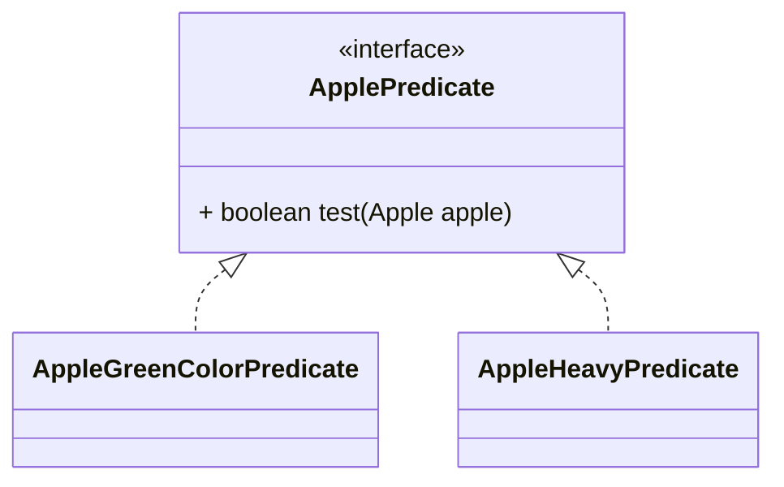

# ***PARTE 2***

## **Pasar código con parametrización de comportamiento**

    Un problema bien conocido en la ingeniería de software es que, sin importar lo que hagas, los 
    requisitos del usuario cambiarán. Por ejemplo, imagina una aplicación para ayudar a un agricultor
    a gestionar su inventario. El agricultor podría querer una función para encontrar todas las 
    manzanas verdes en su inventario. Pero al día siguiente podría decirte: "En realidad, también 
    quiero encontrar todas las manzanas que pesen más de 150 g". Dos días después, el agricultor 
    regresa y añade: "Sería muy bueno si pudiera encontrar todas las manzanas que sean verdes y pesen
    más de 150 g". ¿Cómo puedes hacer frente a estos requisitos cambiantes? Idealmente, te gustaría 
    minimizar tu esfuerzo de ingeniería. Además, funcionalidades nuevas similares deberían ser fáciles
    de implementar y mantener a largo plazo.

    La parametrización de comportamiento es un patrón de desarrollo de software que te permite manejar
    cambios frecuentes en los requisitos. En esencia, significa tomar un bloque de código y hacerlo 
    disponible sin ejecutarlo. Este bloque puede ser llamado más tarde por otras partes de tu programa,
    lo que permite diferir su ejecución. Por ejemplo, puedes pasar el bloque de código como argumento 
    a otro método que lo ejecutará posteriormente. Como resultado, el comportamiento del método se 
    parametriza según ese bloque de código. Por ejemplo, si estás procesando una colección, podrías 
    querer escribir un método que
        * Puede hacer "algo" para cada elemento de una lista
        * Puede hacer "otra cosa" cuando termine de procesar la lista
        * Puede hacer "aún otra cosa" si encuentra un error
    Esto es a lo que se refiere la parametrización de comportamiento. Aquí va una analogía: tu compañero
    de apartamento sabe cómo conducir al supermercado y regresar a casa. Puedes decirle que compre una 
    lista de cosas como pan, queso y vino. Esto equivale a llamar a un método goAndBuy pasando una 
    lista de productos como argumento. Pero un día estás en la oficina y necesitas que haga algo que 
    nunca ha hecho antes: recoger un paquete en la oficina de correos. Necesitas darle una lista de 
    instrucciones: ir a la oficina de correos, usar este número de referencia, hablar con el encargado 
    y recoger el paquete. Podrías enviarle la lista de instrucciones por correo electrónico, y cuando
    la reciba, podrá seguirlas. Ahora has hecho algo un poco más avanzado, equivalente a un método 
    goAndDo, que puede ejecutar diversos comportamientos nuevos como argumentos.

    Comenzaremos este capítulo mostrándote, mediante un ejemplo, cómo puedes hacer que tu código sea
    más flexible ante requisitos cambiantes. Sobre esta base, mostraremos cómo usar la parametrización 
    de comportamiento en varios ejemplos del mundo real. Por ejemplo, quizás ya hayas usado este patrón
    empleando clases e interfaces existentes en la API de Java para ordenar una lista, filtrar nombres 
    de archivos, indicar a un hilo que ejecute un bloque de código o incluso manejar eventos de interfaz
    gráfica. Pronto notarás que, históricamente, este patrón ha sido verboso en Java. Las expresiones 
    lambda en Java 8 y versiones posteriores abordan este problema de verbosidad. En el capítulo 3 
    mostraremos cómo construir expresiones lambda, dónde usarlas y cómo hacer tu código más conciso 
    al adoptarlas.
    
## **Hacer frente a los requisitos cambiantes**

    Escribir código que pueda hacer frente a requisitos cambiantes es difícil. Sigamos un ejemplo que
    iremos mejorando progresivamente, mostrando algunas buenas prácticas para hacer tu código más 
    flexible. En el contexto de una aplicación de inventario de una granja, debes implementar una 
    funcionalidad para filtrar manzanas verdes de una lista. Suena fácil, ¿verdad?

### **Primer intento: filtrar manzanas verdes**
    Supón, como en el capítulo 1, que tienes un enum Color disponible para representar los diferentes
    colores de una manzana:
```java
enum Color {RED, GREEN}

// Una primera solucion prodria ser como lo siguiente:

public static List<Apple> filterGreenApples(List<Apple> inventory) {
    List<Apple> result = new ArrayList<>();  // An acumulator list for apples
    for(Apple apple: inventory){
        if(GREEN.equals(apple.getColor())) {  // Select only green apples
            result.add(apple);
        }
    }
    return result;
}
```

    La línea resaltada muestra la condición necesaria para seleccionar manzanas verdes. Puedes suponer
    que tienes un enum Color con un conjunto de colores, como GREEN, disponibles. Pero ahora el 
    agricultor cambia de opinión y también quiere filtrar manzanas rojas. ¿Qué puedes hacer? Una 
    solución ingenua sería duplicar tu método, renombrarlo como filterRedApples y cambiar la condición
    del if para que coincida con manzanas rojas. Sin embargo, este enfoque no maneja bien los cambios
    si el agricultor quiere múltiples colores. Un buen principio es este: cuando te encuentres 
    escribiendo código casi repetido, intenta abstraerlo en su lugar.

### **Segundo intento: parametrizar el color**

    ¿Cómo evitamos duplicar la mayor parte del código en filterGreenApples para crear filterRedApples?
    Para parametrizar el color y ser más flexibles ante estos cambios, podrías agregar un parámetro 
    a tu método:
```java

public static List<Apple> filterApplesByColor(List<Apple> inventory, Color color) {
    List<Apple> result = new ArrayList<>();
    for (Apple apple: inventory) {
        if ( apple.getColor().equals(color) ) {
            result.add(apple);
        }
    }
    return result;
}
```
    Ahora puedes satisfacer al agricultor e invocar tu método de la siguiente manera:
```java
List<Apple> greenApples = filterApplesByColor(inventory, GREEN);
List<Apple> redApples = filterApplesByColor(inventory, RED);
```

    Sencillo, ¿verdad? Vamos a complicar un poco el ejemplo. El agricultor regresa y dice: "Sería 
    realmente genial poder diferenciar entre manzanas ligeras y pesadas. Las manzanas pesadas suelen
    tener un peso mayor a 150 g".
    Poniéndote tu sombrero de ingeniero de software, te das cuenta de antemano de que el agricultor 
    podría querer variar el peso. Así que creas el siguiente método para manejar distintos pesos 
    mediante un parámetro adicional:
```java
public static List<Apple> filterApplesByWeight(List<Apple> inventory, int weight) {
    List<Apple> result = new ArrayList<>();
    for (Apple apple: inventory){
        if ( apple.getWeight() > weight ) {
            result.add(apple);
        }
    }
    return result;
}
```
    Esta es una buena solución, pero observa que tienes que duplicar la mayor parte de la implementación
    para recorrer el inventario y aplicar los criterios de filtrado a cada manzana. Esto es algo 
    decepcionante porque viola el principio DRY (don’t repeat yourself, no te repitas) de la ingeniería
    de software. ¿Qué pasa si quieres modificar el recorrido del filtro para mejorar el rendimiento? 
    Ahora tienes que modificar la implementación de todos tus métodos en lugar de solo uno. Esto 
    resulta costoso desde el punto de vista del esfuerzo de ingeniería.
    Podrías combinar el color y el peso en un solo método, llamado filter. Pero aún necesitarías una
    forma de diferenciar por qué atributo quieres filtrar. Podrías agregar una bandera (flag) para 
    diferenciar entre consultas por color y por peso. (Pero nunca hagas esto: explicaremos por qué a
    continuación.)

### **Tercer intento: filtrar con cada atributo que se te ocurra**

    Un intento poco elegante de combinar todos los atributos podría ser el siguiente:
```java
public static List<Apple> filterApples(List<Apple> inventory, Color color, int weight, boolean flag) {
    List<Apple> result = new ArrayList<>();
    for (Apple apple : inventory) {
        if ((flag && apple.getColor().equals(color)) ||
                (!flag && apple.getWeight() > weight)) {
            result.add(apple);
        }
    }
    return result;
}    
```
    Podrías usarlo de la siguiente manera (pero es poco elegante):
```java
List<Apple> greenApples = filterApples(inventory, GREEN, 0, true);
List<Apple> heavyApples = filterApples(inventory, null, 150, false);
```
    Esta solución es extremadamente mala. Primero, el código del cliente se ve terrible. ¿Qué 
    significan los valores true y false? Además, esta solución no maneja bien los requisitos 
    cambiantes. ¿Qué pasa si el agricultor te pide filtrar por otros atributos de una manzana, como 
    su tamaño, forma, origen, etc.? ¿Y si pide consultas más complejas que combinen atributos, como 
    manzanas verdes que además sean pesadas? Tendrías o múltiples métodos de filtro duplicados o un 
    único método enormemente complejo. Hasta ahora, has parametrizado el método filterApples con 
    valores como String, Integer, un tipo enum o un booleano. Esto puede ser adecuado para problemas 
    bien definidos. Pero en este caso, necesitas una mejor forma de indicar al método filterApples 
    los criterios de selección de manzanas. En la siguiente sección, describimos cómo utilizar la 
    parametrización de comportamiento para lograr esa flexibilidad.

## **Parametrización de comportamiento**

    Viste en la sección anterior que necesitas una mejor forma que agregar muchos parámetros para 
    hacer frente a requisitos cambiantes. Retrocedamos y busquemos un mejor nivel de abstracción. 
    Una posible solución es modelar tus criterios de selección: estás trabajando con manzanas y 
    devolviendo un valor booleano basado en algunos atributos de Apple. Por ejemplo, ¿es verde? 
    ¿Pesa más de 150 g? A esto lo llamamos un predicado (una función que devuelve un valor booleano).
    Definamos entonces una interfaz para modelar los criterios de selección:

```java
public interface ApplePredicate{
    boolean test (Apple apple);
}
```
    Ahora puedes declarar múltiples implementaciones de ApplePredicate para representar diferentes 
    criterios de selección, como se muestra en el siguiente
```java
public class AppleHeavyWeightPredicate implements ApplePredicate {  //Selects only heavy apples
    public boolean test(Apple apple) {
        return apple.getWeight() > 150;
    }
}
public class AppleGreenColorPredicate implements ApplePredicate {  //Selects only green apples
    public boolean test(Apple apple) {
        return GREEN.equals(apple.getColor());
    }
}    
```



    Puedes ver estos criterios como diferentes comportamientos para el método de filtrado. Lo que 
    acabas de hacer está relacionado con el patrón de diseño Strategy (Estrategia) 
    (ver http://en.wikipedia.org/wiki/Strategy_pattern), que te permite definir una familia de algoritmos,
    encapsular cada uno (llamado estrategia) y seleccionar un algoritmo en tiempo de ejecución. En 
    este caso, la familia de algoritmos es ApplePredicate y las diferentes estrategias son 
    AppleHeavyWeightPredicate y AppleGreenColorPredicate.

    Pero, ¿cómo puedes usar las distintas implementaciones de ApplePredicate? Necesitas que tu método 
    filterApples acepte objetos ApplePredicate para probar una condición en una manzana. A esto se 
    refiere la parametrización de comportamiento: la capacidad de indicar a un método que tome 
    múltiples comportamientos (o estrategias) como parámetros y los use internamente para realizar 
    diferentes acciones.

    Para lograrlo en este ejemplo, agregas un parámetro al método filterApples para que reciba un 
    objeto ApplePredicate. Esto tiene una gran ventaja en ingeniería de software: ahora puedes separar 
    la lógica de recorrer la colección dentro del método filterApples del comportamiento que deseas 
    aplicar a cada elemento (en este caso, un predicado).

## **Cuarto intento: filtrado por criterios abstractos**
    Nuestro método de filtro modificado, que utiliza un ApplePredicate, tiene este aspecto:
```java
public static List<Apple> filterApples(List<Apple> inventory, ApplePredicate p) {
    List<Apple> result = new ArrayList<>();
    for (Apple apple : inventory) {
        if (p.test(apple)) {   //Predicate p encapsulates the condition to test on an apple.
            result.add(apple);
        }
    }
    return result;
}    
```
    CODIGO CORRECTO/COMPORTAMIENTO
    Vale la pena hacer una breve pausa para celebrar. ¡Este código es mucho más flexible que nuestro
    primer intento, pero al mismo tiempo es fácil de leer y de usar! Ahora puedes crear diferentes 
    objetos ApplePredicate y pasarlos al método filterApples. ¡Flexibilidad total! Por ejemplo, si el 
    granjero te pide que encuentres todas las manzanas rojas que pesen más de 150 g, todo lo que necesitas
    hacer es crear una clase que implemente ApplePredicate adecuadamente. Tu código ahora es lo 
    suficientemente flexible para cualquier cambio en los requisitos que involucren los atributos de 
    Apple:

```java
public class AppleRedAndHeavyPredicate implements ApplePredicate {
    public boolean test(Apple apple){
        return RED.equals(apple.getColor()) && apple.getWeight() > 150;
    }
}
List<Apple> redAndHeavyApples = filterApples(inventory, new AppleRedAndHeavyPredicate());
```

    Has logrado algo interesante: el comportamiento del método filterApples depende del código que le
    pasas a través del objeto ApplePredicate. ¡Has parametrizado el comportamiento del método 
    filterApples! Ten en cuenta que, en el ejemplo anterior, lo único relevante es la implementación 
    del método test, como se ilustra en la figura 2.2; es esto lo que define los nuevos comportamientos 
    para el método filterApples. Desafortunadamente, como el método filterApples solo puede recibir 
    objetos, debes encapsular ese código dentro de un objeto ApplePredicate. Lo que estás haciendo 
    es similar a pasar código en línea, porque estás transmitiendo una expresión booleana a través de 
    un objeto que implementa el método test. Verás en la sección 2.3 (y con más detalle en el capítulo 3) 
    que, al usar lambdas, puedes pasar directamente la expresión RED.equals(apple.getColor()) && 
    apple.getWeight() > 150 al método filterApples sin tener que definir múltiples clases ApplePredicate.
    Esto elimina la verbosidad innecesaria.

    ApplePredicate Object
```java
public class AppleRedAndHeavyPredicate implements ApplePredicate{
    public boolean test(Apple apple){
        return RED.equals(apple.getColor()) && apple.getWeight() > 150;
    }
    
    filterApples(inventory, "pass as arguments");
    /*
            Pasa una estrategia al métodos de filtro: filtra las manzanas utilizando la expresión 
            booleana encapsulada dentro del objeto ApplePredicate. Para encapsular este fragmento de
             código, se envuelve con una gran cantidad de código repetitivo
     */
}
```

    MÚLTIPLES COMPORTAMIENTOS, UN SOLO PARÁMETRO
    Como explicamos anteriormente, la parametrización del comportamiento es muy útil porque te permite
    separar la lógica de iteración sobre la colección a filtrar del comportamiento que se aplica a 
    cada elemento de esa colección. Como consecuencia, puedes reutilizar el mismo método y 
    proporcionarle diferentes comportamientos para lograr distintos resultados, como se ilustra en 
    la figura 2.3. Por eso, la parametrización del comportamiento es un concepto útil que deberías 
    tener en tu conjunto de herramientas para crear APIs flexibles.

    new behavior -> return apple.getWeight() > 150; // ApplePredicate
                    return GREEN.equals(apple.getColor()); // ApplePredicate

    Behaivor parameterization -> 

```java
import java.util.ArrayList;
import java.util.List;

public static List<Apple> filterApples(List<Apples> inventory, ApplePredicate p) {
    List<Apple> result = new ArrayList<>();
    for(Apple apple : inventory){
        if(p.test(apple)){
            result.add(apple);
        }
    }
    return result;
}
```

    ¡Para asegurarte de que comprendes bien la idea de la parametrización del comportamiento, 
    intenta resolver el cuestionario 2.1!

    Cuestionario 2.1: Escribe un método flexible prettyPrintApple
    Escribe un método prettyPrintApple que tome una lista de manzanas y que pueda ser parametrizado
    con múltiples formas de generar una salida en forma de cadena (String) a partir de una manzana 
    (algo así como varios métodos toString personalizados). Por ejemplo, podrías indicarle a tu 
    método prettyPrintApple que imprima únicamente el peso de cada manzana. Además, podrías indicarle
    que imprima cada manzana individualmente y mencione si es pesada o ligera. La solución es similar
    a los ejemplos de filtrado que hemos explorado hasta ahora. Para ayudarte a comenzar, 
    proporcionamos un esqueleto aproximado del método prettyPrintApple:
```java
public static void prettyPrintApple(List<Apple> inventory, ???) {
    for(Apple apple: inventory) {
        String output = ???.???(apple);
        System.out.println(output);
    }
}   
```
    Respuesta:
    Primero, necesitas una forma de representar un comportamiento que tome una Apple y devuelva un 
    resultado formateado como String. Ya hiciste algo similar cuando creaste la interfaz 
    ApplePredicate.
```java
public interface AppleFormatter {
    String accept(Apple a);
}
    //You can now represent multiple formatting behaviors by implementing the Apple-Formatter interface:
public class AppleFancyFormatter implements AppleFormatter {
    public String accept(Apple apple) {
        String characteristic = apple.getWeight() > 150 ? "heavy" : "light";
        return "A " + characteristic + " " + apple.getColor() +" apple";
    }
    public class AppleSimpleFormatter implements AppleFormatter {
        public String accept(Apple apple) {
            return "An apple of " + apple.getWeight() + "g";
        }
    }
}
    //Finally, you need to tell your prettyPrintApple method to take AppleFormatter
    //objects and use them internally. You can do this by adding a parameter to pretty-
    //PrintApple:
public static void prettyPrintApple(List<Apple> inventory, AppleFormatter formatter) {
    for(Apple apple: inventory) {
        String output = formatter.accept(apple);
        System.out.println(output);
    }
}
```


    ¡Bingo! Ahora puedes pasar múltiples comportamientos a tu método prettyPrintApple. Esto se hace 
    instanciando implementaciones de AppleFormatter y pasándolas como argumentos a prettyPrintApple:
```java
prettyPrintApple(inventory, new AppleFancyFormatter());   
```
    Esto generará una salida similar a:

    Una manzana verde ligera
    Una manzana roja pesada
    O prueba esto:
```java
prettyPrintApple(inventory, new AppleSimpleFormatter());   
```
    Esto generará una salida similar a:

    Una manzana de 80g
    Una manzana de 155g
    
    Has visto que puedes abstraer el comportamiento y hacer que tu código se adapte a cambios en los
    requisitos, pero el proceso es verbose porque necesitas declarar múltiples clases que solo se 
    instancian una vez. Veamos cómo mejorar eso.

    Afrontando la verbosidad
    Sabemos todos que una característica o concepto difícil de usar será evitado. En este momento, 
    cuando deseas pasar un nuevo comportamiento a tu método filterApples, estás obligado a declarar 
    varias clases que implementen la interfaz ApplePredicate y luego instanciar varios objetos 
    ApplePredicate que solo se asignan una vez, como se muestra en el siguiente listado que resume 
    lo visto hasta ahora. ¡Hay mucha verbosidad involucrada y es un proceso que consume tiempo!
    
    Parametrización del comportamiento: filtrando manzanas con predicados:
```java
public class AppleHeavyWeightPredicate implements ApplePredicate { //Select heavy apples
    public boolean test(Apple apple) {
        return apple.getWeight() > 150;
    }
}

public class AppleGreenColorPredicate implements ApplePredicate {  //Select GREEN apples
    public boolean test(Apple apple) {
        return GREEN.equals(apple.getColor());
    }
}

public class FilteringApples {
    public static void main(String... args) {
        List<Apple> inventory = Arrays.asList(new Apple(80, GREEN), new Apple(155, GREEN),
                new Apple(120, RED));
        List<Apple> heavyApples =
                filterApples(inventory, new AppleHeavyWeightPredicate()); //Results in a List containing
                                                                // one Apple of 155g.
        List<Apple> greenApples =
                filterApples(inventory, new AppleGreenColorPredicate()); //Results in a List containing
                                                                // two green apples.
    }

    public static List<Apple> filterApples(List<Apple> inventory, ApplePredicate p) {
        List<Apple> result = new ArrayList<>();
        for (Apple apple : inventory) {
            if (p.test(apple)) {
                result.add(apple);
            }
        }
        return result;
    }    
}
```
    Este esfuerzo adicional es innecesario. ¿Puedes hacerlo mejor? Java cuenta con un mecanismo 
    llamado clases anónimas, que te permiten declarar e instanciar una clase al mismo tiempo. Estas 
    te permiten mejorar tu código un paso más, haciéndolo un poco más conciso. Pero no son del todo 
    satisfactorias. La sección 2.3.3 anticipa el próximo capítulo con una breve vista previa de cómo 
    las expresiones lambda pueden hacer tu código más legible.

    CLASSES ANONIMAS
    Las clases anónimas son como las clases locales (una clase definida dentro de un bloque) con las
    que ya estás familiarizado en Java. Pero las clases anónimas no tienen nombre. Te permiten 
    declarar e instanciar una clase al mismo tiempo. En resumen, te permiten crear implementaciones 
    ad hoc.

    QUINTO INTENTO: USANDO UNA CLASE ANONIMA
    El siguiente código muestra cómo reescribir el ejemplo de filtrado creando un objeto que 
    implementa ApplePredicate utilizando una clase anónima:
```java 
// Parameterizes the behavior of the method filterApples with an anonymous class.
List<Apple> redApples = filterApples(inventory, new ApplePredicate() {
    public boolean test(Apple apple){
        return RED.equals(apple.getColor());
    }
});
```
    Las clases anónimas se utilizan a menudo en el contexto de aplicaciones GUI para crear objetos 
    manejadores de eventos. No queremos traer recuerdos dolorosos de Swing, pero lo siguiente es un 
    patrón común que se ve en la práctica (aquí utilizando la API de JavaFX, una plataforma de 
    interfaz moderna para Java):
```java
button.setOnAction(new EventHandler<ActionEvent>() {
    public void handle(ActionEvent event) {
        System.out.println("Whoooo a click!!");
    }
});
```
    Pero las clases anónimas aún no son lo suficientemente buenas. En primer lugar, tienden a ser 
    voluminosas porque ocupan mucho espacio, como se muestra en el código en negrita aquí, usando los
    mismos dos ejemplos utilizados anteriormente:
```java
// Lots of boilerplate code
List<Apple> redApples = filterApples(inventory, new ApplePredicate() {
    public boolean test(Apple a){
        return RED.equals(a.getColor());
    }
});
button.setOnAction(new EventHandler<ActionEvent>() {
    public void handle (ActionEvent event){
        System.out.println("Whoooo a click!!");
    }
}    
```
    En segundo lugar, muchas programadores encuentran confuso el uso de clases anónimas. Por ejemplo,
    el cuestionario 2.2 muestra un acertijo clásico de Java que sorprende a la mayoría de los 
    programadores. ¡Inténtalo tú mismo!

    Cuestionario 2.2: Acertijo con clase anónima
    ¿Cuál será la salida cuando se ejecute este código: 4, 5, 6 o 42?
```java
public class MeaningOfThis {
    public final int value = 4;

    public void doIt() {
        int value = 6;
        Runnable r = new Runnable() {
            public final int value = 5;

            public void run() {
                int value = 10;
                System.out.println(this.value);
            }
        };
        r.run();
    }

    public static void main(String... args) {
        MeaningOfThis m = new MeaningOfThis();
        m.doIt();  // -> What’s the output of this line?
    }
}
```
    Respuesta:
    La respuesta es 5, por que 'this' se refiere al contenedor 'Runnable', no ala clase contenedora
    'MeaningOfThis'.
    La verbosidad en general es mala; desalienta el uso de una característica del lenguaje porque 
    lleva mucho tiempo escribir y mantener código verboso, y no es agradable de leer. Un buen código 
    debería ser fácil de entender de un vistazo. Aunque las clases anónimas reducen en cierta medida 
    la verbosidad al evitar declarar múltiples clases concretas para una interfaz, aún así resultan 
    insatisfactorias. En el contexto de pasar un fragmento sencillo de código (por ejemplo, una 
    expresión booleana que representa un criterio de selección), aún debes crear un objeto e 
    implementar explícitamente un método para definir un nuevo comportamiento (por ejemplo, el método
    test para Predicate o el método handle para EventHandler).

    Idealmente, se desea fomentar el uso del patrón de parametrización del comportamiento, ya que, 
    como acabas de ver, hace que el código sea más adaptable a cambios en los requisitos. En el 
    capítulo 3 verás que los diseñadores del lenguaje Java 8 resolvieron este problema introduciendo 
    expresiones lambda, una forma más concisa de pasar código. Basta de suspense; a continuación, 
    una breve vista previa de cómo las expresiones lambda pueden ayudarte en la búsqueda de un código
    limpio.

    SEXTO INTENTO: USANDO UNA EXPRESION LAMBDA
    El código anterior puede reescribirse en Java 8 utilizando una expresión lambda de la siguiente 
    manera:
```java
List<Apple> result = filterApples(inventory, (Apple apple) -> RED.equals(apple.getColor()));
```
    Debes admitir que este código se ve mucho más limpio que nuestros intentos anteriores. Es 
    excelente porque empieza a parecerse mucho más al enunciado del problema. Ahora ya hemos resuelto
    el problema de la verbosidad.

    SEPTIMO INTENTO: ABSTRACCION SOBRE EL TIPO LIST
    Hay un paso más que puedes realizar en tu camino hacia la abstracción. En este momento, el método
    filterApples funciona únicamente para Apple. Pero también puedes abstraer sobre el tipo List para
    ir más allá del dominio del problema en el que estás pensando, como se muestra a continuación:
```java
public interface Predicate<T> {
    boolean test(T t);
}
public static <T> List<T> filter(List<T> list, Predicate<T> p) {
    List<T> result = new ArrayList<>();
    for (T e : list) {
        if (p.test(e)) {
            result.add(e);
        }
    }
    return result;
}
```
    Ahora puedes usar el método filter con una lista de plátanos, naranjas, enteros o cadenas de 
    texto. ¡Aquí tienes un ejemplo, usando expresiones lambda:
```java
List<Apple> redApples = filter(inventory, (Apple apple) -> RED.equals(apple.getColor()));
List<Integer> evenNumbers = filter(numbers, (Integer i) -> i % 2 == 0);
```
    ¿No es genial? ¡Has logrado encontrar el punto óptimo entre flexibilidad y concisión, algo que 
    no era posible antes de Java 8!

    EJEMPLO DEL MUNDO REAL
    Ahora has visto que la parametrización del comportamiento es un patrón útil para adaptarse 
    fácilmente a requisitos cambiantes. Este patrón te permite encapsular un comportamiento (un 
    fragmento de código) y parametrizar el comportamiento de los métodos pasando y utilizando estos 
    comportamientos que creas (por ejemplo, diferentes predicados para una manzana). Mencionamos 
    anteriormente que este enfoque es similar al patrón de diseño Strategy. Es posible que ya hayas 
    usado este patrón en la práctica. Muchos métodos en la API de Java pueden parametrizarse con 
    diferentes comportamientos. Estos métodos a menudo se usan junto con clases anónimas. Mostramos 
    cuatro ejemplos, que deberían reforzar la idea de pasar código: ordenar con un Comparator, 
    ejecutar un bloque de código con Runnable, devolver un resultado desde una tarea usando Callable
    y manejar eventos de interfaz gráfica (GUI).

    ORDENAMIENTO CON UN COMPARADOR
    Ordenar una colección es una tarea recurrente en programación. Por ejemplo, imagina que tu 
    granjero te pide ordenar el inventario de manzanas según su peso. O quizás cambia de opinión y 
    quiere que ordenes las manzanas por color. ¿Te suena familiar? Sí, necesitas una forma de 
    representar y usar diferentes comportamientos de ordenamiento para adaptarte fácilmente a 
    requisitos cambiantes.
    Desde Java 8, una List incluye un método sort (también podrías usar Collections.sort). El 
    comportamiento de sort puede parametrizarse utilizando un objeto java.util.Comparator, que tiene
    la siguiente interfaz:
```java
// java.util.Comparator
public interface Comparator<T> {
    int compare(T o1, T o2);
}
```
    Por lo tanto, puedes crear diferentes comportamientos para el método sort creando una 
    implementación ad hoc de Comparator. Por ejemplo, puedes usarlo para ordenar el inventario por 
    peso creciente utilizando una clase anónima:
```java
inventory.sort(new Comparator<Apple>() {
public int compare(Apple a1, Apple a2) {
return a1.getWeight().compareTo(a2.getWeight());
}
});
```
    Si el granjero cambia de opinión sobre cómo ordenar las manzanas, puedes crear un Comparator ad 
    hoc para adaptarte al nuevo requisito y pasarlo al método sort. Los detalles internos sobre cómo
    ordenar quedan abstractos. Con una expresión lambda, se vería así:
```java
inventory.sort(
(Apple a1, Apple a2) -> a1.getWeight().compareTo(a2.getWeight()));
```
    Nuevamente, no te preocupes por esta nueva sintaxis por ahora; el próximo capítulo cubre en 
    detalle cómo escribir y usar expresiones lambda.

    EJECUTAR UN BLOQUE DE CODIGO CON RUNNABLE
    Los hilos en Java permiten que un bloque de código se ejecute de forma concurrente con el resto 
    del programa. Pero ¿cómo le indicas a un hilo qué bloque de código debe ejecutar? Varios hilos 
    pueden ejecutar código diferente. Lo que necesitas es una forma de representar un fragmento de 
    código para ejecutarlo más tarde. Hasta Java 8, solo se podían pasar objetos al constructor de 
    Thread, por lo que el patrón de uso típico era engorroso: pasar una clase anónima que contuviera
    un método run que devolviera void (sin resultado). Estas clases anónimas implementan la interfaz 
    Runnable.
    En Java, puedes usar la interfaz Runnable para representar un bloque de código que se ejecutará;
    ten en cuenta que este código no devuelve ningún valor (void):
```java
// java.lang.Runnable
public interface Runnable {
    void run();
}
```
    Puedes usar esta interfaz para crear hilos con el comportamiento que elijas, de la siguiente 
    manera:
```java
Thread t = new Thread(new Runnable() {
    public void run() {
    System.out.println("Hello world");
    } 
});
```
    Pero desde Java 8 puedes usar una expresión lambda, por lo que la llamada a Thread se vería así:
```java
Thread t = new Thread(() -> System.out.println("Hello world"));
```
    DEVOLVER UN RESULTADO USANDO CALLABLE
    Es posible que estés familiarizado con la abstracción ExecutorService introducida en Java 5. La 
    interfaz ExecutorService separa cómo se envían y ejecutan las tareas. Lo útil, en comparación 
    con el uso de hilos y Runnable, es que al usar un ExecutorService puedes enviar una tarea a un 
    grupo de hilos y almacenar su resultado en un Future. No te preocupes si esto te resulta 
    desconocido; volveremos a este tema en capítulos posteriores cuando tratemos la concurrencia con
    más detalle. Por ahora, todo lo que necesitas saber es que la interfaz Callable se utiliza para 
    modelar una tarea que devuelve un resultado. Puedes verla como una versión mejorada de Runnable.
```java
// java.util.concurrent.Callable
public interface Callable<V> {
    V call();
}
```
    Puedes usarlo, de la siguiente manera, enviando una tarea a un servicio de ejecución. Aquí 
    devuelves el nombre del hilo que es responsable de ejecutar la tarea:
```java
ExecutorService executorService = Executors.newCachedThreadPool();
Future<String> threadName = executorService.submit(new Callable<String>() {
    @Override
    public String call() throws Exception {
        return Thread.currentThread().getName();
    }
});
```
    Usando una expresión lambda, este código se simplifica a lo siguiente:
```java
Future<String> threadName = executorService.submit(
                    () -> Thread.currentThread().getName());
```
    MANEJO DE EVENTOS EN GUI
    Un patrón típico en la programación de interfaces gráficas (GUI) es realizar una acción en 
    respuesta a un evento determinado, como hacer clic o pasar el cursor sobre un texto. Por ejemplo,
    si el usuario hace clic en el botón Enviar, es posible que desees mostrar una ventana emergente 
    o registrar la acción en un archivo. Una vez más, necesitas una forma de adaptarte a cambios; 
    deberías poder realizar cualquier respuesta. En JavaFX, puedes usar un EventHandler para 
    representar una respuesta a un evento pasándolo a setOnAction:
```java
Button button = new Button("Send");
button.setOnAction(new EventHandler<ActionEvent>() {
    public void handle(ActionEvent event) {
        label.setText("Sent!!");
    }
});
```
    Aquí, el comportamiento del método setOnAction se parametriza con objetos EventHandler. Con una 
    expresión lambda, se vería así:
```java
button.setOnAction((ActionEvent event) -> label.setText("Sent!!"));
```
RESUMEN
* La parametrización del comportamiento es la capacidad de un método para recibir múltiples 
    comportamientos diferentes como parámetros y usarlos internamente para lograr distintas acciones.
* Esta técnica permite que tu código sea más adaptable a requisitos cambiantes y reduce el esfuerzo 
   de desarrollo futuro.
* Pasar código como argumento es una forma de proporcionar nuevos comportamientos a un método. Antes
  de Java 8, esto era verboso; las clases anónimas ayudaron a reducir parte de esta verbosidad al evitar declarar múltiples clases concretas para interfaces usadas una sola vez.
* La API de Java contiene muchos métodos que pueden parametrizarse con diferentes comportamientos, 
  como ordenamiento, hilos y manejo de eventos GUI.