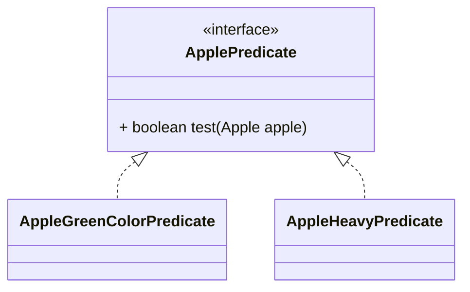

# ***PARTE 2***

## **Pasar código con parametrización de comportamiento**

    Un problema bien conocido en la ingeniería de software es que, sin importar lo que hagas, los 
    requisitos del usuario cambiarán. Por ejemplo, imagina una aplicación para ayudar a un agricultor
    a gestionar su inventario. El agricultor podría querer una función para encontrar todas las 
    manzanas verdes en su inventario. Pero al día siguiente podría decirte: "En realidad, también 
    quiero encontrar todas las manzanas que pesen más de 150 g". Dos días después, el agricultor 
    regresa y añade: "Sería muy bueno si pudiera encontrar todas las manzanas que sean verdes y pesen
    más de 150 g". ¿Cómo puedes hacer frente a estos requisitos cambiantes? Idealmente, te gustaría 
    minimizar tu esfuerzo de ingeniería. Además, funcionalidades nuevas similares deberían ser fáciles
    de implementar y mantener a largo plazo.

    La parametrización de comportamiento es un patrón de desarrollo de software que te permite manejar
    cambios frecuentes en los requisitos. En esencia, significa tomar un bloque de código y hacerlo 
    disponible sin ejecutarlo. Este bloque puede ser llamado más tarde por otras partes de tu programa,
    lo que permite diferir su ejecución. Por ejemplo, puedes pasar el bloque de código como argumento 
    a otro método que lo ejecutará posteriormente. Como resultado, el comportamiento del método se 
    parametriza según ese bloque de código. Por ejemplo, si estás procesando una colección, podrías 
    querer escribir un método que
        * Puede hacer "algo" para cada elemento de una lista
        * Puede hacer "otra cosa" cuando termine de procesar la lista
        * Puede hacer "aún otra cosa" si encuentra un error
    Esto es a lo que se refiere la parametrización de comportamiento. Aquí va una analogía: tu compañero
    de apartamento sabe cómo conducir al supermercado y regresar a casa. Puedes decirle que compre una 
    lista de cosas como pan, queso y vino. Esto equivale a llamar a un método goAndBuy pasando una 
    lista de productos como argumento. Pero un día estás en la oficina y necesitas que haga algo que 
    nunca ha hecho antes: recoger un paquete en la oficina de correos. Necesitas darle una lista de 
    instrucciones: ir a la oficina de correos, usar este número de referencia, hablar con el encargado 
    y recoger el paquete. Podrías enviarle la lista de instrucciones por correo electrónico, y cuando
    la reciba, podrá seguirlas. Ahora has hecho algo un poco más avanzado, equivalente a un método 
    goAndDo, que puede ejecutar diversos comportamientos nuevos como argumentos.

    Comenzaremos este capítulo mostrándote, mediante un ejemplo, cómo puedes hacer que tu código sea
    más flexible ante requisitos cambiantes. Sobre esta base, mostraremos cómo usar la parametrización 
    de comportamiento en varios ejemplos del mundo real. Por ejemplo, quizás ya hayas usado este patrón
    empleando clases e interfaces existentes en la API de Java para ordenar una lista, filtrar nombres 
    de archivos, indicar a un hilo que ejecute un bloque de código o incluso manejar eventos de interfaz
    gráfica. Pronto notarás que, históricamente, este patrón ha sido verboso en Java. Las expresiones 
    lambda en Java 8 y versiones posteriores abordan este problema de verbosidad. En el capítulo 3 
    mostraremos cómo construir expresiones lambda, dónde usarlas y cómo hacer tu código más conciso 
    al adoptarlas.
    
## **Hacer frente a los requisitos cambiantes**

    Escribir código que pueda hacer frente a requisitos cambiantes es difícil. Sigamos un ejemplo que
    iremos mejorando progresivamente, mostrando algunas buenas prácticas para hacer tu código más 
    flexible. En el contexto de una aplicación de inventario de una granja, debes implementar una 
    funcionalidad para filtrar manzanas verdes de una lista. Suena fácil, ¿verdad?

### **Primer intento: filtrar manzanas verdes**
    Supón, como en el capítulo 1, que tienes un enum Color disponible para representar los diferentes
    colores de una manzana:
```java
enum Color {RED, GREEN}

// Una primera solucion prodria ser como lo siguiente:

public static List<Apple> filterGreenApples(List<Apple> inventory) {
    List<Apple> result = new ArrayList<>();  // An acumulator list for apples
    for(Apple apple: inventory){
        if(GREEN.equals(apple.getColor())) {  // Select only green apples
            result.add(apple);
        }
    }
    return result;
}
```

    La línea resaltada muestra la condición necesaria para seleccionar manzanas verdes. Puedes suponer
    que tienes un enum Color con un conjunto de colores, como GREEN, disponibles. Pero ahora el 
    agricultor cambia de opinión y también quiere filtrar manzanas rojas. ¿Qué puedes hacer? Una 
    solución ingenua sería duplicar tu método, renombrarlo como filterRedApples y cambiar la condición
    del if para que coincida con manzanas rojas. Sin embargo, este enfoque no maneja bien los cambios
    si el agricultor quiere múltiples colores. Un buen principio es este: cuando te encuentres 
    escribiendo código casi repetido, intenta abstraerlo en su lugar.

### **Segundo intento: parametrizar el color**

    ¿Cómo evitamos duplicar la mayor parte del código en filterGreenApples para crear filterRedApples?
    Para parametrizar el color y ser más flexibles ante estos cambios, podrías agregar un parámetro 
    a tu método:
```java

public static List<Apple> filterApplesByColor(List<Apple> inventory, Color color) {
    List<Apple> result = new ArrayList<>();
    for (Apple apple: inventory) {
        if ( apple.getColor().equals(color) ) {
            result.add(apple);
        }
    }
    return result;
}
```
    Ahora puedes satisfacer al agricultor e invocar tu método de la siguiente manera:
```java
List<Apple> greenApples = filterApplesByColor(inventory, GREEN);
List<Apple> redApples = filterApplesByColor(inventory, RED);
```

    Sencillo, ¿verdad? Vamos a complicar un poco el ejemplo. El agricultor regresa y dice: "Sería 
    realmente genial poder diferenciar entre manzanas ligeras y pesadas. Las manzanas pesadas suelen
    tener un peso mayor a 150 g".
    Poniéndote tu sombrero de ingeniero de software, te das cuenta de antemano de que el agricultor 
    podría querer variar el peso. Así que creas el siguiente método para manejar distintos pesos 
    mediante un parámetro adicional:
```java
public static List<Apple> filterApplesByWeight(List<Apple> inventory, int weight) {
    List<Apple> result = new ArrayList<>();
    for (Apple apple: inventory){
        if ( apple.getWeight() > weight ) {
            result.add(apple);
        }
    }
    return result;
}
```
    Esta es una buena solución, pero observa que tienes que duplicar la mayor parte de la implementación
    para recorrer el inventario y aplicar los criterios de filtrado a cada manzana. Esto es algo 
    decepcionante porque viola el principio DRY (don’t repeat yourself, no te repitas) de la ingeniería
    de software. ¿Qué pasa si quieres modificar el recorrido del filtro para mejorar el rendimiento? 
    Ahora tienes que modificar la implementación de todos tus métodos en lugar de solo uno. Esto 
    resulta costoso desde el punto de vista del esfuerzo de ingeniería.
    Podrías combinar el color y el peso en un solo método, llamado filter. Pero aún necesitarías una
    forma de diferenciar por qué atributo quieres filtrar. Podrías agregar una bandera (flag) para 
    diferenciar entre consultas por color y por peso. (Pero nunca hagas esto: explicaremos por qué a
    continuación.)

### **Tercer intento: filtrar con cada atributo que se te ocurra**

    Un intento poco elegante de combinar todos los atributos podría ser el siguiente:
```java
public static List<Apple> filterApples(List<Apple> inventory, Color color, int weight, boolean flag) {
    List<Apple> result = new ArrayList<>();
    for (Apple apple : inventory) {
        if ((flag && apple.getColor().equals(color)) ||
                (!flag && apple.getWeight() > weight)) {
            result.add(apple);
        }
    }
    return result;
}    
```
    Podrías usarlo de la siguiente manera (pero es poco elegante):
```java
List<Apple> greenApples = filterApples(inventory, GREEN, 0, true);
List<Apple> heavyApples = filterApples(inventory, null, 150, false);
```
    Esta solución es extremadamente mala. Primero, el código del cliente se ve terrible. ¿Qué 
    significan los valores true y false? Además, esta solución no maneja bien los requisitos 
    cambiantes. ¿Qué pasa si el agricultor te pide filtrar por otros atributos de una manzana, como 
    su tamaño, forma, origen, etc.? ¿Y si pide consultas más complejas que combinen atributos, como 
    manzanas verdes que además sean pesadas? Tendrías o múltiples métodos de filtro duplicados o un 
    único método enormemente complejo. Hasta ahora, has parametrizado el método filterApples con 
    valores como String, Integer, un tipo enum o un booleano. Esto puede ser adecuado para problemas 
    bien definidos. Pero en este caso, necesitas una mejor forma de indicar al método filterApples 
    los criterios de selección de manzanas. En la siguiente sección, describimos cómo utilizar la 
    parametrización de comportamiento para lograr esa flexibilidad.

## **Parametrización de comportamiento**

    Viste en la sección anterior que necesitas una mejor forma que agregar muchos parámetros para 
    hacer frente a requisitos cambiantes. Retrocedamos y busquemos un mejor nivel de abstracción. 
    Una posible solución es modelar tus criterios de selección: estás trabajando con manzanas y 
    devolviendo un valor booleano basado en algunos atributos de Apple. Por ejemplo, ¿es verde? 
    ¿Pesa más de 150 g? A esto lo llamamos un predicado (una función que devuelve un valor booleano).
    Definamos entonces una interfaz para modelar los criterios de selección:

```java
public interface ApplePredicate{
    boolean test (Apple apple);
}
```
    Ahora puedes declarar múltiples implementaciones de ApplePredicate para representar diferentes 
    criterios de selección, como se muestra en el siguiente
```java
public class AppleHeavyWeightPredicate implements ApplePredicate {  //Selects only heavy apples
    public boolean test(Apple apple) {
        return apple.getWeight() > 150;
    }
}
public class AppleGreenColorPredicate implements ApplePredicate {  //Selects only green apples
    public boolean test(Apple apple) {
        return GREEN.equals(apple.getColor());
    }
}    
```



    Puedes ver estos criterios como diferentes comportamientos para el método de filtrado. Lo que 
    acabas de hacer está relacionado con el patrón de diseño Strategy (Estrategia) 
    (ver http://en.wikipedia.org/wiki/Strategy_pattern), que te permite definir una familia de algoritmos,
    encapsular cada uno (llamado estrategia) y seleccionar un algoritmo en tiempo de ejecución. En 
    este caso, la familia de algoritmos es ApplePredicate y las diferentes estrategias son 
    AppleHeavyWeightPredicate y AppleGreenColorPredicate.

    Pero, ¿cómo puedes usar las distintas implementaciones de ApplePredicate? Necesitas que tu método 
    filterApples acepte objetos ApplePredicate para probar una condición en una manzana. A esto se 
    refiere la parametrización de comportamiento: la capacidad de indicar a un método que tome 
    múltiples comportamientos (o estrategias) como parámetros y los use internamente para realizar 
    diferentes acciones.

    Para lograrlo en este ejemplo, agregas un parámetro al método filterApples para que reciba un 
    objeto ApplePredicate. Esto tiene una gran ventaja en ingeniería de software: ahora puedes separar 
    la lógica de recorrer la colección dentro del método filterApples del comportamiento que deseas 
    aplicar a cada elemento (en este caso, un predicado).

