# ***PARTE 3***

## **Procesamiento de Streams (Flujos)**

    Este capítulo cubre
    * Lambdas en pocas palabras
    * Dónde y cómo usar lambdas
    * El patrón execute-around
    * Interfaces funcionales, inferencia de tipos
    * Referencias a métodos
    * Composición de lambdas

    En el capítulo anterior, viste que pasar código con parametrización de comportamiento es útil 
    para hacer frente a cambios frecuentes en los requisitos de tu código. Te permite definir un 
    bloque de código que representa un comportamiento y luego pasarlo como argumento. Puedes decidir 
    ejecutar ese bloque cuando ocurra un evento determinado (por ejemplo, un clic en un botón) o en 
    puntos específicos de un algoritmo (por ejemplo, un predicado como “solo manzanas con más de 
    150 g” en un algoritmo de filtrado o una operación de comparación personalizada en una ordenación).
    En general, con este concepto puedes escribir código más flexible y reutilizable.

    Pero viste que usar clases anónimas para representar diferentes comportamientos no es satisfactorio:
    es verboso y no incentiva a los programadores a usar la parametrización de comportamiento en la 
    práctica. En este capítulo, aprenderás sobre una nueva característica de Java 8 que resuelve este 
    problema: las expresiones lambda. Estas te permiten representar un comportamiento o pasar código 
    de forma concisa. Por ahora, puedes pensar en las expresiones lambda como funciones anónimas, 
    métodos sin nombre, que también se pueden pasar como argumentos a un método, al igual que con una
    clase anónima.

    Veremos cómo construirlas, dónde usarlas y cómo hacer tu código más conciso con ellas. También 
    explicaremos nuevas características como la inferencia de tipos y las nuevas interfaces importantes
    disponibles en la API de Java 8. Finalmente, introduciremos las referencias a métodos, una 
    característica útil que complementa perfectamente a las expresiones lambda.

    Este capítulo está organizado para enseñarte paso a paso cómo escribir código más conciso y 
    flexible. Al final, reuniremos todos los conceptos en un ejemplo concreto: tomaremos el ejemplo 
    de ordenación del capítulo 2 y lo mejoraremos gradualmente usando expresiones lambda y referencias
    a métodos, para hacerlo más claro y legible. Este capítulo es importante por sí mismo y porque 
    usarás las lambdas extensamente a lo largo del libro.

    LAMNDAS EN POCAS PALABRAS
    Una expresión lambda puede entenderse como una representación concisa de una función anónima que
    puede pasarse como argumento. No tiene un nombre, pero sí una lista de parámetros, un cuerpo, un 
    tipo de retorno y, posiblemente, una lista de excepciones que pueden lanzarse. Desglosemos este 
    concepto:

    * Anónima: No tiene un nombre explícito como un método tradicional, lo que reduce la cantidad de
        código y simplifica su uso.
    * Función: Aunque no está asociada a una clase como un método, tiene parámetros, un cuerpo, un 
        tipo de retorno y puede lanzar excepciones, al igual que un método.
    * Pasa como argumento: Una expresión lambda puede pasarse a un método o almacenarse en una variable.
    * Concisa: Elimina la verbosidad de las clases anónimas, permitiendo escribir código más limpio 
        y directo.

    El término lambda proviene del cálculo lambda, un sistema matemático desarrollado en los años 30
    para describir la computación, donde todas las funciones son anónimas.

    ¿Por qué son importantes? Antes de Java 8, pasar comportamiento requería clases anónimas, lo que
    resultaba engorroso. Las expresiones lambda resuelven este problema al permitir pasar código de 
    forma clara y breve. Aunque no añaden funcionalidad nueva al lenguaje, sí fomentan el uso de la 
    parametrización de comportamiento, haciendo el código más legible y flexible. Por ejemplo, con 
    una lambda puedes crear un Comparator personalizado de forma mucho más simple.

    Antes:
```java
Comparator<Apple> byWeight = new Comparator<Apple>() {
    public int compare(Apple a1, Apple a2){
        return a1.getWeight().compareTo(a2.getWeight());
    }
};
```

    Despues (con expresion Lamnda):
```java
Comparator<Apple> byWeight =
    (Apple a1, Apple a2) -> a1.getWeight().compareTo(a2.getWeight());
```
    Debes admitir que el código se ve más claro. No te preocupes si aún no entiendes todas las partes
    de la expresión lambda; explicaremos cada componente en breve. Por ahora, observa que estás pasando
    literalmente solo el código necesario para comparar dos manzanas por su peso, como si estuvieras 
    pasando el cuerpo del método compare. Pronto aprenderás a simplificar aún más tu código. En la 
    siguiente sección explicaremos exactamente dónde y cómo puedes usar expresiones lambda.

    La expresión lambda que acabamos de mostrar tiene tres partes:
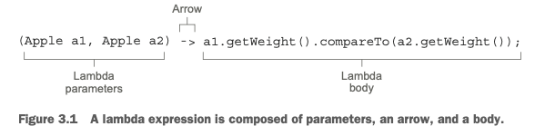

    * Una lista de parámetros: En este caso, coincide con los parámetros del método compare de un 
        Comparator: dos objetos Apple.
    * Una flecha: La flecha -> separa la lista de parámetros del cuerpo de la lambda.
    * El cuerpo de la lambda: Compara dos manzanas usando sus pesos. La expresión se considera el valor
        devuelto por la lambda.

```java
(String s) -> s.lenght() //Toma un parámetro de tipo String y devuelve un int.No tiene una sentencia
                         // return porque el valor de retorno se infiere automáticamente cuando el 
                         // cuerpo de la lambda es una única expresión.
(Apple a) -> a.getWeight() > 150 // Toma un parámetro de tipo Apple y devuelve un valor booleano 
                                 // (si la manzana pesa más de 150 g).
(int x, int y) -> {
    system.out.println("Result: ");  // Toma 2 parametros de enteros devuelve ningun valor
    system.out.println(x + y);
}
() -> 42  // no hay parametros que evaluar retorna el entero 42

```

    Esta sintaxis fue elegida por los diseñadores del lenguaje Java porque fue bien recibida en otros
    lenguajes, como C# y Scala. JavaScript tiene una sintaxis similar. La sintaxis básica de una 
    lambda es la siguiente (conocida como lambda de estilo expresión):

    Parámetros → Especificados entre paréntesis, por ejemplo (x, y).
    Flecha lambda (->) → Separa los parámetros del cuerpo.
    Cuerpo → Contiene la expresión o bloque de instrucciones a ejecutar.

    Cuestionario: Sintaxis de lambda
    Basado en las reglas de sintaxis mostradas, ¿cuáles de las siguientes expresiones no son válidas?

    1. () -> {}
    2. () -> "Raoul"
    3. () -> { return "Mario"; }
    4. (Integer i) -> return "Alan" + i;
    5. (String s) -> { "Iron Man"; }
    Respuesta:
    Las expresiones 4 y 5 son inválidas; las demás son válidas. Detalles:

    1. Válida: Lambda sin parámetros y sin retorno (void), equivalente a un método vacío.
    2. Válida: Sin parámetros, devuelve una cadena como expresión.
    3. Válida: Sin parámetros, devuelve una cadena usando return dentro de un bloque.
    4. Inválida: return es una sentencia de control y requiere llaves. Debe escribirse como:
        (Integer i) -> { return "Alan" + i; };
    5. Inválida: "Iron Man" es una expresión, no una sentencia. Para que sea válida, debe eliminarse 
        el bloque:
            (String s) -> "Iron Man" o usar return dentro de llaves:
        (String s) -> { return "Iron Man"; }

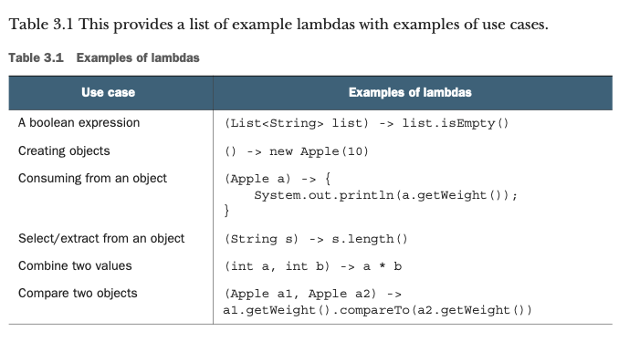

    Dónde y cómo usar lambdas
    Quizás ahora te estés preguntando dónde se pueden usar expresiones lambda. En el ejemplo anterior,
    asignaste una lambda a una variable de tipo Comparator<Apple>. También podrías usar otra lambda 
    con el método filter que implementaste en el capítulo anterior:
```java
List<Apple> greenApples =
    filter(inventory, (Apple a) -> GREEN.equals(a.getColor()));
```
    ¿Dónde exactamente puedes usar lambdas? 
    Puedes usar una expresión lambda en el contexto de una interfaz funcional. En el código mostrado
    aquí, puedes pasar una lambda como segundo argumento al método filter porque espera un objeto de
    tipo Predicate<T>, que es una interfaz funcional. 
    No te preocupes si esto suena abstracto; ahora explicaremos en detalle qué significa esto y qué 
    es una interfaz funcional.

    Interfaz funcional
    Recuerda la interfaz Predicate<T> que creaste en el capítulo 2 para parametrizar el comportamiento
    del método filter? ¡Es una interfaz funcional! ¿Por qué? Porque Predicate especifica un solo 
    método abstracto: boolean test(T t).
```java
public interface Predicate<T> {
    boolean test (T t);
}
```
    En pocas palabras, una interfaz funcional es una interfaz que declara exactamente un solo método
    abstracto. Ya conoces varias interfaces funcionales en la API de Java, como Comparator y Runnable,
    que vimos en el capítulo 2.
```java
public interface Comparator<T> { //java.util.Comparator
    int compare(T o1, T o2);
}
public interface Runnable {  //java.lang.Runnable
    void run();
}
public interface ActionListener extends EventListener {   //java.awt.event.ActionListener
    void actionPerformed(ActionEvent e);
}
public interface Callable<V> {  //java.util.concurrent.Callable
    V call() throws Exception;
}
public interface PrivilegedAction<T> {  //java.security.PrivilegedAction
    T run();
}
```

    NOTA: Verás que las interfaces ahora también pueden tener métodos por defecto (un método con 
    cuerpo que proporciona una implementación predeterminada en caso de que no sea implementado por 
    una clase). Una interfaz sigue siendo una interfaz funcional si tiene varios métodos por defecto, 
    siempre que especifique un solo método abstracto.
    Para comprobar tu comprensión, el siguiente cuestionario  debería ayudarte a determinar si has 
    comprendido el concepto de interfaz funcional.

    Cuestionario: Interfaz funcional
    ¿Cuáles de estas interfaces son interfaces funcionales?
```java
public interface Adder {
    int add(int a, int b);
}

public interface SmartAdder extends Adder {
    int add(double a, double b);
}

public interface Nothing {
}
```
    Respuesta:
    * Solo Adder es una interfaz funcional.
    * SmartAdder no lo es porque declara dos métodos abstractos (hereda add(int, int) de Adder y define 
        add(double, double)).
    * Nothing no es una interfaz funcional porque no declara ningún método abstracto.

    ¿Qué puedes hacer con interfaces funcionales? Las expresiones lambda te permiten proporcionar 
    directamente la implementación del método abstracto de una interfaz funcional en línea, y tratar 
    toda la expresión como una instancia de dicha interfaz funcional (más técnicamente, una instancia
    de una implementación concreta de la interfaz funcional). Puedes lograr lo mismo con una clase 
    interna anónima, aunque es más engorrosa: proporcionas una implementación y la instancias 
    directamente en línea. El siguiente código es válido porque Runnable es una interfaz funcional que
    define un único método abstracto, run:
```java
Runnable r1 = () -> System.out.println("Hello World 1"); //Uso de una lambda
Runnable r2 = new Runnable() {      //Uso de una clase anonima
    public void run() {
        System.out.println("Hello World 2");
    }
};
public static void process(Runnable r) {
    r.run();
}
process(r1);    //imprime "Hello World 1"
process(r2);    //imprime "Hello World 2"
process(() -> System.out.println("Hello World 3")); //imprime "Hello World 3"
```

    Descripcion Funcional
    La firma del método abstracto de la interfaz funcional describe la firma de la expresión lambda.
    A este método abstracto lo llamamos descriptor de función. Por ejemplo, la interfaz Runnable puede
    verse como la firma de una función que no acepta ningún parámetro y no devuelve nada (void), porque
    tiene un único método abstracto llamado run, que no acepta parámetros y no devuelve nada (void).

    Utilizamos una notación especial a lo largo de este capítulo para describir las firmas de las 
    expresiones lambda y de las interfaces funcionales. La notación () -> void representa una función 
    con una lista de parámetros vacía que devuelve void. Esto es exactamente lo que representa la 
    interfaz Runnable. Como otro ejemplo, (Apple, Apple) -> int denota una función que toma dos objetos 
    Apple como parámetros y devuelve un entero (int). Proporcionaremos más información sobre los 
    descriptores de función más adelante en el capítulo.

    Quizás ya te estés preguntando cómo se verifica el tipo de las expresiones lambda. Explicamos con 
    detalle cómo el compilador comprueba si una lambda es válida en un contexto determinado. Por 
    ahora, basta con entender que una expresión lambda se puede asignar a una variable o pasar a un 
    método que espera una interfaz funcional como argumento, siempre que la expresión lambda tenga la 
    misma firma que el método abstracto de la interfaz funcional. Por ejemplo, en nuestro ejemplo 
    anterior, podrías pasar una lambda directamente al método process de la siguiente manera:
```java
public void process(Runnable r) {
    r.run();
}
process(() -> System.out.println("This is awesome!!"));
```
    Este código, al ejecutarse, imprimirá “This is awesome!!”. La expresión lambda () -> System.out.println("This is awesome!!") 
    no toma parámetros y devuelve void. Esta es exactamente la firma del método run definido en la 
    interfaz Runnable.

    Lambdas y llamada a métodos void
    Aunque pueda parecer extraño, la siguiente expresión lambda es válida:
    process(() -> System.out.println("This is awesome"));
    Después de todo, System.out.println devuelve void, por lo que claramente no es una expresión. 
    ¿Por qué no es necesario encerrar el cuerpo entre llaves así?
    process(() -> { System.out.println("This is awesome"); });
    Resulta que existe una regla especial en la Especificación del Lenguaje Java: no es necesario 
    encerrar una única llamada a un método que devuelve void entre llaves. Esta simplificación 
    sintáctica permite una escritura más concisa cuando la lambda consiste únicamente en una invocación
    de método void.

    ¿Por qué solo se pueden pasar lambdas donde se espera una interfaz funcional?
    Los diseñadores del lenguaje Java optaron por vincular las expresiones lambda a interfaces 
    funcionales —es decir, interfaces con un solo método abstracto— porque esta solución encaja de forma
    natural en el modelo existente sin añadir complejidad. No fue necesario introducir nuevos tipos 
    de funciones en el lenguaje.

    Esta decisión se basó en varios factores clave:
    Compatibilidad y evolución: Interfaces como Runnable, Comparator o Callable ya eran ampliamente 
    usadas antes de Java 8 y cumplen con el patrón de un solo método abstracto. Al aprovecharlas, 
    las lambdas pudieron integrarse sin modificar APIs existentes.
    Familiaridad: Muchos programadores ya estaban acostumbrados a usar clases anónimas con interfaces 
    de un solo método, especialmente en manejadores de eventos.
    Migración suave: Al no requerir cambios en el código base, se facilitó la adopción de lambdas en 
    proyectos antiguos.
    Simplicidad del modelo: En lugar de añadir nuevos tipos funcionales, se reutilizó un mecanismo ya 
    conocido, manteniendo la coherencia del lenguaje.
    La anotación @FunctionalInterface ayuda a garantizar que una interfaz mantenga esta propiedad, 
    generando un error de compilación si se añaden más métodos abstractos.
    
    Quiz: ¿Dónde se pueden usar lambdas?
    ¿Cuáles de los siguientes son usos válidos de expresiones lambda?
    1 execute(() -> {});
        public void execute(Runnable r) {
            r.run();
        }
    2 public Callable<String> fetch() {
        return () -> "Tricky example ;-)";
    }
    3 Predicate<Apple> p = (Apple a) -> a.getWeight();

    Respuesta:
    Solo 1 y 2 son válidos.
    El primer ejemplo es válido porque la lambda () -> {} tiene la firma () -> void, que coincide con
    el método abstracto run definido en Runnable. Aunque el cuerpo de la lambda está vacío, es 
    sintácticamente correcto y no genera errores.
    El segundo ejemplo también es válido. El tipo de retorno del método fetch es Callable<String>, 
    cuyo método call() tiene la firma () -> String. La lambda () -> "Tricky example ;-)" coincide 
    exactamente con esta firma, por lo que es compatible.
    El tercer ejemplo es inválido porque la expresión lambda (Apple a) -> a.getWeight() tiene la firma
    (Apple) -> Integer, mientras que el método test de Predicate<Apple> espera una firma (Apple) -> boolean.
    Como getWeight() devuelve un entero y no un valor booleano, no se cumple la firma requerida.

    ¿Qué hay sobre @FunctionalInterface?
    La anotación @FunctionalInterface se utiliza para indicar que una interfaz está diseñada para ser
    una interfaz funcional, es decir, que debe tener exactamente un método abstracto. Aunque no es 
    obligatoria, es una buena práctica usarla porque:

    Documentación clara: Indica a otros desarrolladores que la interfaz está destinada a usarse con 
    expresiones lambda o referencias a métodos.
    Verificación en tiempo de compilación: Si se añade más de un método abstracto por error, el 
    compilador genera un error, como: "Multiple non-overriding abstract methods found", ayudando a 
    mantener la integridad de la interfaz.
    Una interfaz funcional puede tener métodos default, static y métodos abstractos heredados de Object
    (como equals()), sin que afecten su estatus funcional.

    Se puede comparar con la anotación @Override: no es obligatoria, pero ayuda a prevenir errores y 
    mejora la claridad del código.

## **Poniendo en práctica las lambdas: el patrón execute-around:**
    Veamos un ejemplo de cómo las expresiones lambda, junto con la parametrización del comportamiento,
    pueden usarse en la práctica para hacer que el código sea más flexible y conciso. Un patrón común 
    al procesar recursos (por ejemplo, archivos o bases de datos) consiste en abrir un recurso, 
    realizar un procesamiento sobre él y luego cerrarlo. Las fases de configuración y limpieza siempre
    son similares y rodean el código importante que realiza el procesamiento. Esto se conoce como el 
    patrón execute-around.

    Por ejemplo, en el siguiente código, las líneas resaltadas muestran el código repetitivo necesario
    para leer una línea de un archivo (obsérvese también que se usa la sentencia try-with-resources 
    de Java 7, que ya simplifica el código, ya que no es necesario cerrar el recurso explícitamente):
```java
public String processFile() throws IOException {
    try (BufferedReader br = new BufferedReader(new FileReader("data.txt"))) {
        return br.readLine();   //Esta es la línea que realiza un trabajo útil.
    }
}
```
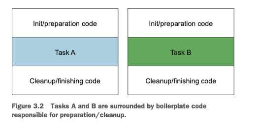

    Paso 1: Recuerda la parametrización del comportamiento
    Este código actual es limitado. Solo puedes leer la primera línea del archivo. ¿Qué tal si 
    quisieras devolver las dos primeras líneas, o incluso la palabra más frecuente? Idealmente, te 
    gustaría reutilizar el código que realiza la configuración y limpieza, y decirle al método 
    processFile que realice diferentes acciones sobre el archivo. ¿Te suena familiar? Sí, necesitas 
    parametrizar el comportamiento de processFile. Necesitas una forma de pasar un comportamiento a 
    processFile para que pueda ejecutar diferentes acciones usando un BufferedReader.

    Pasar comportamientos es exactamente para lo que sirven las expresiones lambda. ¿Cómo debería 
    verse el nuevo método processFile si quisieras leer dos líneas a la vez? Necesitas una lambda 
    que tome un BufferedReader y devuelva un String. Por ejemplo, así es como imprimirías dos líneas
    de un BufferedReader:
```java
String result = processFile((BufferedReader br) -> br.readLine() + br.readLine());
```
    Paso 2: Usa una interfaz funcional para pasar comportamientos
    Explicamos anteriormente que las expresiones lambda solo se pueden usar en el contexto de una 
    interfaz funcional. Necesitas crear una que coincida con la firma BufferedReader -> String y que 
    pueda lanzar una IOException. Llamemos a esta interfaz BufferedReaderProcessor:
```java
@FunctionalInterface
public interface BufferedReaderProcessor {
    String process(BufferedReader b) throws IOException;
}
```
    Ahora puedes usar esta interfaz como argumento para tu nuevo método processFile:
```java
public String processFile(BufferedReaderProcessor p) throws IOException {
    …
}
```
    Paso 3: ¡Ejecuta un comportamiento!
    Cualquier expresión lambda del tipo BufferedReader -> String puede pasarse como argumento, ya 
    que coincide con la firma del método definido en la interfaz BufferedReaderProcessor. Ahora solo
    necesitas una forma de ejecutar el código representado por la lambda dentro del cuerpo de 
    processFile. Recuerda, las expresiones lambda te permiten proporcionar directamente la 
    implementación del método abstracto de una interfaz funcional, y tratan toda la expresión como 
    una instancia de dicha interfaz. Por lo tanto, puedes llamar al método process sobre el objeto 
    BufferedReaderProcessor dentro del cuerpo de processFile para realizar el procesamiento:
```java
public String processFile(BufferedReaderProcessor p) throws IOException {
    try (BufferedReader br = new BufferedReader(new FileReader("data.txt"))) {
        return p.process(br);  //Procesa el objeto BufferedReader
    }
}
```
    Paso 4: Pasa lambdas
    Ahora puedes reutilizar el método processFile y procesar archivos de diferentes formas pasando 
    diferentes lambdas.
    A continuación, se muestra cómo procesar una línea:
```java
String oneLine = processFile((BufferedReader br) -> br.readLine());
```
    A continuación se muestra cómo procesar dos líneas:
```java
String twoLines = processFile((BufferedReader br) -> br.readLine() + br.readLine());
```
    Resume los cuatro pasos realizados para hacer el método processFile más flexible.
    Hemos mostrado cómo puedes utilizar interfaces funcionales para pasar expresiones lambda. Pero 
    tuviste que definir tus propias interfaces. En la siguiente sección, exploramos las nuevas 
    interfaces que se agregaron en Java 8 que puedes reutilizar para pasar múltiples lambdas 
    diferentes.

    Usando Interfaces Funcionales:
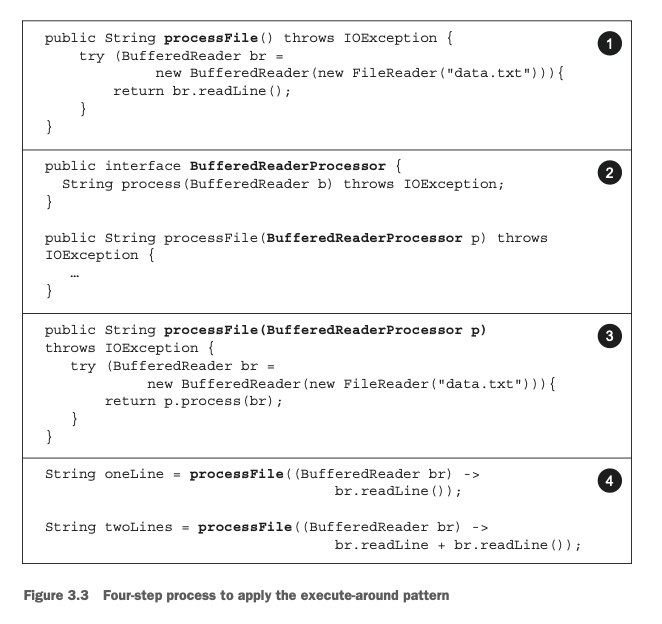

## **Usando Interfaces funcionales**
    Como aprendiste en la sección 3.2.1, una interfaz funcional especifica exactamente un método 
    abstracto. Las interfaces funcionales son útiles porque la firma del método abstracto puede 
    describir la firma de una expresión lambda. La firma del método abstracto de una interfaz 
    funcional se denomina descriptor de función. Para poder utilizar diferentes expresiones lambda,
    necesitas un conjunto de interfaces funcionales que puedan describir descriptores de función 
    comunes. Varios de estos interfaces funcionales ya están disponibles en la API de Java, como 
    Comparable, Runnable y Callable, que viste en la sección 3.2.

    PREDICADO:
    La interfaz java.util.function.Predicate<T> define un método abstracto llamado test que acepta 
    un objeto de tipo genérico T y devuelve un valor booleano. Es exactamente el mismo que creaste 
    anteriormente, ¡pero ya está disponible por defecto! Podrías querer usar esta interfaz cuando 
    necesites representar una expresión booleana que utilice un objeto de tipo T. Por ejemplo, 
    puedes definir una lambda que acepte objetos de tipo String, como se muestra en el siguiente 
    listado.

    Los diseñadores de la biblioteca de Java 8 te han ayudado introduciendo varias nuevas interfaces
    funcionales dentro del paquete java.util.function. A continuación describiremos las interfaces 
    Predicate, Consumer y Function. Una lista más completa está disponible en la tabla 3.2 al final 
    de esta sección.

    Trabajando con un PREDICADO:
```java
@FunctionalInterface
public interface Predicate<T> {
boolean test(T t);
}
public <T> List<T> filter(List<T> list, Predicate<T> p) {
    List<T> results = new ArrayList<>();
    for (T t : list) {
        if (p.test(t)) {
            results.add(t);
        }
    }
    return results;
}
Predicate<String> nonEmptyStringPredicate = (String s) -> !s.isEmpty();
List<String> nonEmpty = filter(listOfStrings, nonEmptyStringPredicate);
```
    Si buscas en la especificación Javadoc de la interfaz Predicate, podrías notar métodos 
    adicionales como and y or. No te preocupes por ellos por ahora. Volveremos a estos en la sección.
    
    CONDUMIDOR
    La interfaz java.util.function.Consumer<T> define un método abstracto llamado accept que toma un
    objeto de tipo genérico T y no devuelve ningún resultado (void). Podrías usar esta interfaz 
    cuando necesites acceder a un objeto de tipo T y realizar algunas operaciones sobre él. Por 
    ejemplo, puedes usarla para crear un método forEach, que toma una lista de enteros y aplica una 
    operación a cada elemento de esa lista. En el siguiente listado, usarás este método forEach 
    combinado con una lambda para imprimir todos los elementos de la lista.

    Trabajando con un CONSUMIDOR:
```java
@FunctionalInterface
public interface Consumer<T> {
    void accept(T t);
}
public <T> void forEach(List<T> list, Consumer<T> c) {
    for(T t: list) {
        c.accept(t);
    }
}
forEach(
        Arrays.asList(1,2,3,4,5),
        //La lambda es la implementación del metodo accept de Consumer.
        (Integer i) -> System.out.println(i)
);
```
    3.4.3 Función
    La interfaz java.util.function.Function<T, R> define un método abstracto llamado apply que toma 
    un objeto de tipo genérico T como entrada y devuelve un objeto de tipo genérico R. Puedes usar
    esta interfaz cuando necesitas definir una lambda que mapea información de un objeto de entrada 
    a una salida (por ejemplo, extraer el peso de una manzana o mapear un String a su longitud). En 
    el listado que sigue, mostramos cómo puedes usarla para crear un método map que transforme una 
    lista de Strings en una lista de Integers que contenga la longitud de cada String.

    Working with a Function:
```java
@FunctionalInterface
public interface Function<T, R> {
    R apply(T t);
}
public <T, R> List<R> map(List<T> list, Function<T, R> f) {
    List<R> result = new ArrayList<>();
    for (T t : list) {
        result.add(f.apply(t));
    }
    return result;
}
// [7, 2, 6]
List<Integer> l = map(
                Arrays.asList("lambdas", "in", "action"),
                //Implements the apply method of Function
                (String s) -> s.length()
            );
```

    ESPECIALIZACIONES PRIMITIVAS
    Describimos tres interfaces funcionales que son genéricas: Predicate<T>, Consumer<T> y 
    Function<T, R>. También existen interfaces funcionales que están especializadas con ciertos tipos.
    Para refrescar un poco: cada tipo en Java es un tipo de referencia (por ejemplo, Byte, Integer, 
    Object, List) o un tipo primitivo (por ejemplo, int, double, byte, char). Sin embargo, los 
    parámetros genéricos (por ejemplo, la T en Consumer<T>) solo pueden vincularse a tipos de 
    referencia. Esto se debe a cómo los genéricos están implementados internamente. Como resultado, 
    en Java existe un mecanismo para convertir un tipo primitivo en su correspondiente tipo de 
    referencia. Este mecanismo se llama boxing. El enfoque opuesto (convertir un tipo de referencia 
    en su correspondiente tipo primitivo) se llama unboxing. Java también tiene un mecanismo de 
    autoboxing para facilitar la tarea a los programadores: las operaciones de boxing y unboxing se 
    realizan automáticamente. Por ejemplo, es por esto que el siguiente código es válido (un int se 
    convierte mediante boxing a un Integer):

```java
List<Integer> list = new ArrayList<>();
for(int i = 300; i < 400; i++){
        list.add(i);
}
```

    Pero esto tiene un costo en rendimiento. Los valores con boxing son envoltorios alrededor de 
    tipos primitivos y se almacenan en el heap. Por lo tanto, los valores con boxing usan más memoria
    y requieren búsquedas adicionales en memoria para obtener el valor primitivo envuelto.
    Java 8 también agregó una versión especializada de las interfaces funcionales que describimos 
    anteriormente con el fin de evitar operaciones de autoboxing cuando las entradas o salidas son 
    primitivos. Por ejemplo, en el siguiente código, usar un IntPredicate evita una operación de 
    boxing del valor 1000, mientras que usar un Predicate<Integer> convertiría mediante boxing el 
    argumento 1000 a un objeto Integer:

```java
public interface IntPredicate {
    boolean test(int t);
}
IntPredicate evenNumbers = (int i) -> i % 2 == 0;
evenNumbers.test(1000); //True (no boxing)
Predicate<Integer> oddNumbers = (Integer i) -> i % 2 != 0;
oddNumbers.test(1000); //False (boxing)
```
    En general, el tipo primitivo apropiado precede los nombres de las interfaces funcionales que 
    tienen una especialización para el parámetro de tipo de entrada (por ejemplo, DoublePredicate, 
    IntConsumer, LongBinaryOperator, IntFunction, y así sucesivamente). La interfaz Function también
    tiene variantes para el parámetro de tipo de salida: ToIntFunction<T>, IntToDoubleFunction, y 
    así sucesivamente.
    La tabla 3.2 resume las interfaces funcionales más utilizadas disponibles en la API de Java y 
    sus descriptores de función, junto con sus especializaciones primitivas. Ten en cuenta que estas
    son solo un kit de inicio, y siempre puedes crear las tuyas propias si es necesario 
    (el ejercicio 3.7 inventa TriFunction con este propósito). Crear tus propias interfaces también 
    puede ayudar cuando un nombre específico del dominio contribuya a la comprensión y el 
    mantenimiento del programa. Recuerda, la notación (T, U) -> R muestra cómo pensar en un 
    descriptor de función. El lado izquierdo de la flecha es una lista que representa los tipos de 
    los argumentos, y el lado derecho representa los tipos de los resultados. En este caso, representa
    una función con dos argumentos de tipo genérico T y U respectivamente, y que tiene un tipo de 
    retorno R.
    Hasta ahora has visto muchas interfaces funcionales que pueden usarse para describir la firma de
    varias expresiones lambda. Para comprobar tu comprensión hasta este punto, intenta el ejercicio 3.4.

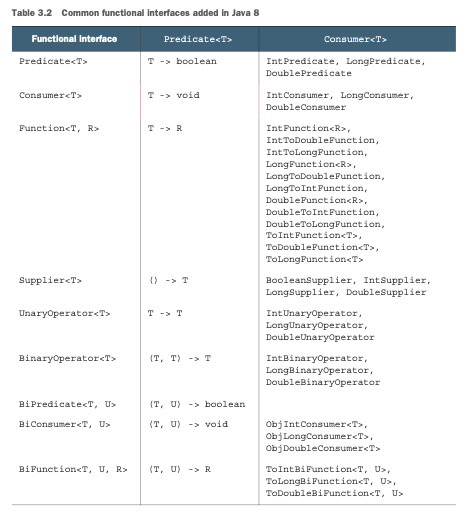

### Ejercicio 3.4: Interfaces funcionales

¿Qué interfaces funcionales usarías para los siguientes descriptores de función (firmas de 
expresiones lambda)? Encontrarás la mayoría de las respuestas en la tabla 3.2. Como ejercicio 
adicional, crea expresiones lambda válidas que puedas usar con estas interfaces funcionales.

1. T -> R
2. (int, int) -> int
3. T -> void
4. () -> T
5. (T, U) -> R

### Respuestas:

1. Function<T, R> es un buen candidato. Típicamente se usa para convertir un objeto de tipo T en un 
objeto de tipo R (por ejemplo, Function<Apple, Integer> para extraer el peso de una manzana).

2. IntBinaryOperator tiene un único método abstracto llamado applyAsInt que representa el descriptor 
de función (int, int) -> int.

3. Consumer<T> tiene un único método abstracto llamado accept que representa el descriptor de función
T -> void.

4. Supplier<T> tiene un único método abstracto llamado get que representa el descriptor de función 
() -> T.

5. BiFunction<T, U, R> tiene un único método abstracto llamado apply que representa el descriptor de 
función (T, U) -> R.

Para resumir la discusión sobre interfaces funcionales y lambdas, la tabla 3.3 proporciona un resumen
de casos de uso, ejemplos de lambdas e interfaces funcionales que pueden utilizarse.

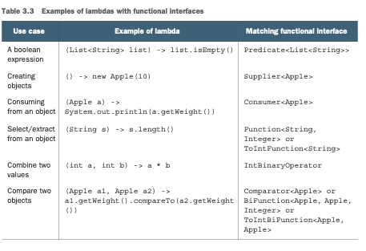

### ¿Qué pasa con las excepciones, las lambdas y las interfaces funcionales?
Ten en cuenta que ninguna de las interfaces funcionales permite lanzar una excepción verificada. 
Tienes dos opciones si necesitas que el cuerpo de una expresión lambda lance una excepción: definir
tu propia interfaz funcional que declare la excepción verificada, o envolver el cuerpo de la lambda 
con un bloque `try/catch`.
Por ejemplo, en la sección 3.3 introdujimos una nueva interfaz funcional `BufferedReaderProcessor` que 
declaraba explícitamente una `IOException`:
```java
@FunctionalInterface
public interface BufferedReaderProcessor {
String process(BufferedReader b) throws IOException;
}
BufferedReaderProcessor p = (BufferedReader br) -> br.readLine();
```
Pero es posible que estés usando una API que espera una interfaz funcional como Function<T, R> y no 
haya opción de crear la tuya propia. Verás en el próximo capítulo que la API de Streams hace un uso 
intensivo de las interfaces funcionales de la tabla 3.2. En este caso, puedes capturar explícitamente
la excepción verificada:
```java
Function<BufferedReader, String> f =
(BufferedReader b) -> {
    try {
        return b.readLine();
    } catch (IOException e) {
        throw new RuntimeException(e);
    }
};
```
Ahora ya sabes cómo crear lambdas y dónde y cómo usarlas. A continuación, explicaremos algunos 
detalles más avanzados: cómo el compilador verifica los tipos de las lambdas y las reglas que debes 
tener en cuenta, como las lambdas que hacen referencia a variables locales dentro de su cuerpo y las
lambdas compatibles con void. No es necesario comprender completamente la siguiente sección de 
inmediato, y puede que desees volver a ella más tarde y continuar con la sección 3.6 sobre referencias
a métodos.

## 3.5 Verificación de tipos, inferencia de tipos y restricciones

Cuando mencionamos por primera vez las expresiones lambda, dijimos que te permiten generar una
instancia de una interfaz funcional. Sin embargo, una expresión lambda en sí misma no contiene 
información sobre qué interfaz funcional está implementando. Para tener una comprensión más formal de
las expresiones lambda, debes saber cuál es el tipo de una lambda.

### 3.5.1 Verificación de tipos

El tipo de una lambda se deduce del contexto en el que se usa. El tipo esperado para la expresión 
lambda dentro del contexto (por ejemplo, un parámetro de método al que se pasa o una variable local
a la que se asigna) se denomina tipo objetivo. Veamos un ejemplo para ver qué sucede detrás de escena
cuando usas una expresión lambda. La figura 3.4 resume el proceso de verificación de tipos para el 
siguiente código:
```java
List<Apple> heavierThan150g =
filter(inventory, (Apple apple) -> apple.getWeight() > 150);
```
El proceso de verificación de tipos se descompone de la siguiente manera:
- Primero, buscas la declaración del método filter.
- Segundo, espera, como segundo parámetro formal, un objeto de tipo Predicate<Apple> (el tipo objetivo).
- Tercero, Predicate<Apple> es una interfaz funcional que define un único método abstracto llamado test.
- Cuarto, el método test describe un descriptor de función que acepta un Apple y devuelve un boolean.
- Finalmente, cualquier argumento del método filter debe cumplir con este requisito.

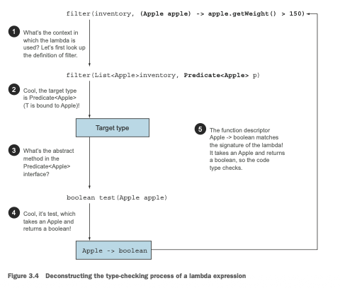

El código es válido porque la expresión lambda que estamos pasando también toma un Apple como 
parámetro y devuelve un boolean. Ten en cuenta que si la expresión lambda lanzara una excepción, la 
cláusula throws declarada del método abstracto también debería coincidir.

### 3.5.2 Misma lambda, diferentes interfaces funcionales

Debido a la idea del tipo objetivo, la misma expresión lambda puede asociarse con diferentes 
interfaces funcionales si tienen una firma de método abstracto compatible. Por ejemplo, tanto la 
interfaz Callable como PrivilegedAction descritas anteriormente representan funciones que no aceptan 
nada y devuelven un tipo genérico T. Por lo tanto, las siguientes dos asignaciones son válidas:
```java
Callable<Integer> c = () -> 42;
PrivilegedAction<Integer> p = () -> 42;
```
En este caso, la primera asignación tiene como tipo objetivo Callable<Integer> y la segunda asignación
tiene como tipo objetivo PrivilegedAction<Integer>.
En la tabla 3.3 mostramos un ejemplo similar; la misma lambda puede usarse con múltiples interfaces
funcionales diferentes:
```java
Comparator<Apple> c1 =
    (Apple a1, Apple a2) -> a1.getWeight().compareTo(a2.getWeight());
ToIntBiFunction<Apple, Apple> c2 =
    (Apple a1, Apple a2) -> a1.getWeight().compareTo(a2.getWeight());
BiFunction<Apple, Apple, Integer> c3 =
    (Apple a1, Apple a2) -> a1.getWeight().compareTo(a2.getWeight());
```
### Operador diamante
Aquellos familiarizados con la evolución de Java recordarán que Java 7 ya había introducido la idea 
de tipos inferidos a partir del contexto con la inferencia de genéricos usando el operador diamante 
(<>) (esta idea se puede encontrar incluso antes con los métodos genéricos). Una expresión de 
instancia de clase dada puede aparecer en dos o más contextos diferentes, y el argumento de tipo 
apropiado será inferido como se ejemplifica aquí:
```java
List<String> listOfStrings = new ArrayList<>();
List<Integer> listOfIntegers = new ArrayList<>();
```
### Regla especial de compatibilidad con void
Si una lambda tiene una expresión de declaración como su cuerpo, es compatible con un descriptor de 
función que devuelve void (siempre que la lista de parámetros también sea compatible). Por ejemplo, 
ambas líneas siguientes son válidas aunque el método add de una List devuelve un boolean y no void 
como se espera en el contexto de Consumer (T -> void):
```java
// Predicate has a boolean return
Predicate<String> p = (String s) -> list.add(s);
// Consumer has a void return
Consumer<String> b = (String s) -> list.add(s);
```
A estas alturas deberías tener una buena comprensión de cuándo y dónde puedes usar expresiones lambda.
Pueden obtener su tipo objetivo de un contexto de asignación, un contexto de invocación de método 
(parámetros y retorno) y un contexto de conversión de tipos. Para comprobar tu conocimiento, intenta
el ejercicio 3.5.

### Ejercicio 3.5: Verificación de tipos — ¿por qué el siguiente código no compilará?
¿Cómo podrías solucionar el problema?
```java
Object o = () -> { System.out.println("Tricky example"); };
```
### Respuesta:
El contexto de la expresión lambda es Object (el tipo objetivo). Pero Object no es una interfaz 
funcional. Para solucionar esto puedes cambiar el tipo objetivo a Runnable, que representa un descriptor
de función () -> void:
```java
Runnable r = () -> { System.out.println("Tricky example"); };
```
También podrías solucionar el problema convirtiendo mediante cast la expresión lambda a Runnable, lo 
que proporciona explícitamente un tipo objetivo.
```java
Object o = (Runnable) () -> { System.out.println("Tricky example"); };
```
Esta técnica puede ser útil en el contexto de la sobrecarga con un método que toma dos interfaces 
funcionales diferentes que tienen el mismo descriptor de función. Puedes convertir mediante cast la
lambda para desambiguar explícitamente qué firma de método debe seleccionarse.
Por ejemplo, la llamada execute(() -> {}) usando el método execute, como se muestra a continuación, 
sería ambigua, porque tanto Runnable como Action tienen el mismo descriptor de función:
```java
public void execute(Runnable runnable) {
    runnable.run();
}
public void execute(Action<T> action) {
    action.act();
}
@FunctionalInterface
interface Action {
    void act();
}
```
Pero puedes desambiguar explícitamente la llamada usando una expresión de conversión de tipos: execute
```java
((Action) () -> {});
```
Has visto cómo el tipo objetivo puede usarse para verificar si una lambda puede usarse en un contexto
particular. También puede usarse para hacer algo ligeramente diferente: inferir los tipos de los
parámetros de una lambda.

### 3.5.3 Inferencia de tipos

Puedes simplificar tu código un paso más. El compilador de Java deduce qué interfaz funcional asociar
con una expresión lambda a partir de su contexto circundante (el tipo objetivo), lo que significa que
también puede deducir una firma apropiada para la lambda porque el descriptor de función está 
disponible a través del tipo objetivo. El beneficio es que el compilador tiene acceso a los tipos de
los parámetros de una expresión lambda, y estos pueden omitirse en la sintaxis de la lambda. El 
compilador de Java infiere los tipos de los parámetros de una lambda como se muestra aquí:

```java
//Sin tipo explícito en el parámetro apple.
List<Apple> greenApples =
filter(inventory, apple -> GREEN.equals(apple.getColor()));
```
Los beneficios de la legibilidad del código son más notorios con expresiones lambda que tienen varios 
parámetros. Por ejemplo, así es como se crea un objeto Comparator:
```java
Comparator<Apple> c =
        (Apple a1, Apple a2) -> a1.getWeight().compareTo(a2.getWeight());//sin tipo de inferencia
Comparator<Apple> c =
        (a1, a2) -> a1.getWeight().compareTo(a2.getWeight());//con tipo de inferencia
```
Ten en cuenta que a veces es más legible incluir los tipos explícitamente, y otras veces es más legible
excluirlos. No existe una regla sobre cuál forma es mejor; los desarrolladores deben tomar sus propias
decisiones sobre qué hace su código más legible.

### 3.5.4 Uso de variables locales
Todas las expresiones lambda que hemos mostrado hasta ahora usaban solo sus argumentos dentro de su 
cuerpo. Pero las expresiones lambda también pueden usar variables libres (variables que no son los 
parámetros y están definidas en un ámbito externo) como pueden hacerlo las clases anónimas. Se 
denominan lambdas de captura. Por ejemplo, la siguiente lambda captura la variable portNumber:
```java
int portNumber = 1337;
Runnable r = () -> System.out.println(portNumber);
```
Sin embargo, hay un pequeño matiz. Existen algunas restricciones sobre lo que puedes hacer con estas 
variables. Las lambdas pueden capturar (referenciar en sus cuerpos) variables de instancia y variables
estáticas sin restricciones. Pero cuando se capturan variables locales, estas deben estar declaradas
explícitamente como final o ser efectivamente finales. Las expresiones lambda pueden capturar variables
locales que se asignan solo una vez. (Nota: capturar una variable de instancia puede verse como 
capturar la variable local final this.) Por ejemplo, el siguiente código no compila porque la variable
portNumber se asigna dos veces:
```java
int portNumber = 1337;
Runnable r = () -> System.out.println(portNumber);
portNumber = 31337;  //Error: la variable local portNumber no es final ni efectivamente final.
```
### RESTRICCIONES EN VARIABLES LOCALES
Puede que te estés preguntando por qué las variables locales tienen estas restricciones. Primero, 
existe una diferencia clave en cómo las variables de instancia y las variables locales se implementan
detrás de escena. Las variables de instancia se almacenan en el heap, mientras que las variables 
locales viven en el stack. Si una lambda pudiera acceder a la variable local directamente y la lambda
se usara en un hilo, entonces el hilo que usa la lambda podría intentar acceder a la variable después
de que el hilo que la asignó la hubiera liberado. Por lo tanto, Java implementa el acceso a una 
variable local libre como acceso a una copia de ella, en lugar de acceso a la variable original. Esto
no hace ninguna diferencia si la variable local se asigna solo una vez, de ahí la restricción.
En segundo lugar, esta restricción también desalienta los patrones típicos de programación imperativa
(que, como explicamos en capítulos posteriores, impiden una fácil paralelización) que mutan una 
variable externa.

Clausura
Es posible que hayas escuchado el término clausura y te estés preguntando si las lambdas cumplen con
la definición de una clausura (no confundir con el lenguaje de programación Clojure). Para decirlo 
científicamente, una clausura es una instancia de una función que puede referenciar variables no 
locales de esa función sin restricciones. Por ejemplo, una clausura podría pasarse como argumento a
otra función. También podría acceder y modificar variables definidas fuera de su ámbito. Ahora bien,
las lambdas y las clases anónimas de Java 8 hacen algo similar a las clausuras: pueden pasarse como 
argumento a métodos y pueden acceder a variables fuera de su ámbito. Pero tienen una restricción: no
pueden modificar el contenido de las variables locales del método en el que se define la lambda. Esas
variables deben ser implícitamente finales. Es útil pensar que las lambdas cierran sobre valores en
lugar de variables. Como se explicó anteriormente, esta restricción existe porque las variables 
locales viven en el stack y están implícitamente confinadas al hilo en el que se encuentran. Permitir
la captura de variables locales mutables abre nuevas posibilidades de falta de seguridad en hilos, 
lo cual es indeseable (las variables de instancia están bien porque viven en el heap, que se comparte 
entre hilos).

A continuación describiremos otra gran característica que se introdujo en el código de Java 8: las 
referencias a métodos. Piensa en ellas como versiones abreviadas de ciertas lambdas.

## 3.6 Referencias a métodos
Las referencias a métodos te permiten reutilizar definiciones de métodos existentes y pasarlas como 
lambdas. En algunos casos, parecen más legibles y se sienten más naturales que usar expresiones 
lambda. Aquí está nuestro ejemplo de ordenamiento escrito con una referencia a método y un poco de 
ayuda de la API actualizada de Java 8 (exploramos este ejemplo con más detalle en la sección 3.7).

Antes:
```java
inventory.sort((Apple a1, Apple a2)
a1.getWeight().compareTo(a2.getWeight()));
```
Después (usando una referencia a método y java.util.Comparator.comparing):
```java
inventory.sort(comparing(Apple::getWeight));  //Tu primera referencia a metodo.
```
¡No te preocupes por la nueva sintaxis y cómo funcionan las cosas. Lo aprenderás en las próximas 
secciones!

### 3.6.1 En pocas palabras
¿Por qué debería importarte las referencias a métodos? Las referencias a métodos pueden verse como 
una forma abreviada de lambdas que llaman solo a un método específico. La idea básica es que si una 
lambda representa "llama a este método directamente", es mejor referirse al método por nombre en lugar
de por una descripción de cómo llamarlo. De hecho, una referencia a método te permite crear una 
expresión lambda a partir de una implementación de método existente. Pero al referirse a un nombre 
de método explícitamente, tu código puede ganar mejor legibilidad. ¿Cómo funciona? Cuando necesitas 
una referencia a método, la referencia objetivo se coloca antes del delimitador :: y el nombre del
método se proporciona después. Por ejemplo, Apple::getWeight es una referencia al método getWeight 
definido en la clase Apple. (Recuerda que no se necesitan paréntesis después de getWeight porque no
lo estás llamando en este momento, simplemente estás citando su nombre.) Esta referencia a método es
una forma abreviada de la expresión lambda (Apple apple) -> apple.getWeight(). La tabla 3.4 muestra 
algunos ejemplos más de posibles referencias a métodos en Java 8.

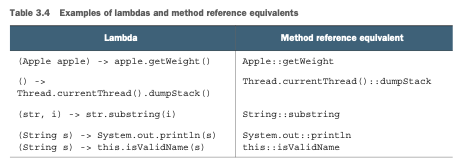

Puedes pensar en las referencias a métodos como azúcar sintáctica para las lambdas que se refieren 
solo a un único método, porque escribes menos para expresar lo mismo.

#### Receta para construir Referencia a Metodos

Hay tres tipos principales de referencias a métodos:

1. Una referencia a método a un método estático (por ejemplo, el método parseInt de Integer, escrito 
como Integer::parseInt)

2. Una referencia a método a un método de instancia de un tipo arbitrario (por ejemplo, el método 
length de un String, escrito como String::length)

3. Una referencia a método a un método de instancia de un objeto o expresión existente (por ejemplo,
supón que tienes una variable local expensiveTransaction que contiene un objeto de tipo Transaction,
que soporta un método de instancia getValue; puedes escribir expensiveTransaction::getValue)

El segundo y tercer tipo de referencias a métodos pueden resultar un poco abrumadores al principio. 
La idea con el segundo tipo de referencias a métodos, como String::length, es que estás haciendo 
referencia a un método de un objeto que se suministrará como uno de los parámetros de la lambda. Por
ejemplo, la expresión lambda (String s) -> s.toUpperCase() puede reescribirse como String::toUpperCase.
Pero el tercer tipo de referencia a método se refiere a una situación en la que estás llamando a un 
método en una lambda sobre un objeto externo que ya existe. Por ejemplo, la expresión lambda 
() -> expensiveTransaction.getValue() puede reescribirse como expensiveTransaction::getValue.
Este tercer tipo de referencia a método es particularmente útil cuando necesitas pasar un método 
definido como un auxiliar privado. Por ejemplo, supón que definiste un método auxiliar isValidName:
```java
private boolean isValidName(String string) {
    return Character.isUpperCase(string.charAt(0));
}
```
Ahora puedes pasar este método en el contexto de un Predicate<String> usando una referencia a método:
```java
filter(words, this::isValidName)
```
Para ayudarte a asimilar este nuevo conocimiento, las reglas abreviadas para refactorizar una expresión
lambda a una referencia a método equivalente siguen recetas simples, como se muestra en la figura 3.5.

Ten en cuenta que también existen formas especiales de referencias a métodos para constructores, 
constructores de arrays y llamadas a super. Apliquemos las referencias a métodos en un ejemplo 
concreto.
Supón que quieres ordenar una List de strings ignorando las diferencias entre mayúsculas y minúsculas.
El método sort en una List espera un Comparator como parámetro. Viste anteriormente que Comparator 
describe un descriptor de función con la firma (T, T) -> int. Puedes definir una expresión lambda que
use el método compareToIgnoreCase en la clase String de la siguiente manera 
(nota que compareToIgnoreCase está predefinido en la clase String):
```java
List<String> str = Arrays.asList("a","b","A","B");
str.sort((s1, s2) -> s1.compareToIgnoreCase(s2));
```
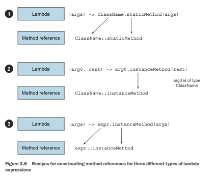

La expresión lambda tiene una firma compatible con el descriptor de función de Comparator. Usando 
las recetas descritas anteriormente, el ejemplo también puede escribirse usando una referencia a 
método, lo que resulta en un código más conciso, de la siguiente manera:
```java
List<String> str = Arrays.asList("a","b","A","B");
str.sort(String::compareToIgnoreCase);
```
Ten en cuenta que el compilador realiza un proceso de verificación de tipos similar al de las 
expresiones lambda para determinar si una referencia a método es válida con una interfaz funcional 
dada. La firma de la referencia a método debe coincidir con el tipo del contexto.
¡Para comprobar tu comprensión de las referencias a métodos, intenta el ejercicio 3.6!

### Ejercicio 3.6: Referencias a métodos
¿Cuáles son las referencias a métodos equivalentes para las siguientes expresiones lambda?

1.
```java
 ToIntFunction<String> stringToInt = (String s) -> Integer.parseInt(s);
```
2. 
```java
BiPredicate<List<String>, String> contains = (list, element) -> list.contains(element);
```  
3.
```java
Predicate<String> startsWithNumber = (String string) -> this .startsWithNumber(string);
```
#### Respuestas:
1. Esta expresión lambda reenvía su argumento al método estático parseInt de Integer. Este método toma
un String para analizar y devuelve un int. Como resultado, la lambda puede reescribirse usando la 
receta b de la figura 3.5 (expresiones lambda que llaman a un método estático) de la siguiente 
manera:
```java
ToIntFunction<String> stringToInt = Integer::parseInt;
```
2. Esta lambda usa su primer argumento para llamar al método contains sobre él. Dado que el primer 
argumento es de tipo List, puedes usar la receta c de la figura 3.5 de la siguiente manera:
```java
BiPredicate<List<String>, String> contains = List::contains;
```
Esto se debe a que el tipo objetivo describe un descriptor de función 
(List<String>, String) -> boolean, y List::contains puede desempaquetarse a ese descriptor de función.

3. Esta lambda de estilo expresión invoca un método auxiliar privado. Puedes usar la receta d de la 
figura 3.5 de la siguiente manera:
```java
Predicate<String> startsWithNumber = this::startsWithNumber;
```
Solo hemos mostrado cómo reutilizar implementaciones de métodos existentes y crear referencias a 
métodos. Pero puedes hacer algo similar con los constructores de una clase.

### 3.6.2 Referencias a constructores
Puedes crear una referencia a un constructor existente usando su nombre y la palabra clave new de la
siguiente manera: ClassName::new. Funciona de manera similar a una referencia a un método estático. 
Por ejemplo, supón que hay un constructor sin argumentos. Esto se ajusta a la firma () -> Apple de 
Supplier; puedes hacer lo siguiente:
```java
Supplier<Apple> c1 = Apple::new; //Referencia al constructor predeterminado Apple() sin argumentos.
Apple a1 = c1.get(); //Llamar al metodo get de Supplier produce un nuevo Apple.
```
lo cual es equivalente a
```java
Supplier<Apple> c1 = () -> new Apple(); //Expresión lambda para crear un Apple usando el constructor predeterminado.
Apple a1 = c1.get(); //Llamar al metodo get de Supplier produce un nuevo Apple.
```
Si tienes un constructor con la firma Apple(Integer weight), se ajusta a la firma de la interfaz 
Function, por lo que puedes hacer esto:
```java
Function<Integer, Apple> c2 = Apple::new; //Referencia al constructor Apple(Integer weight).
Apple a2 = c2.apply(110); //Llamar al metodo apply de Function con un peso dado produce un Apple.
```
lo cual es equivalente a
```java
Function<Integer, Apple> c2 = (weight) -> new Apple(weight); //Expresión lambda para crear un Apple con un peso dado.
Apple a2 = c2.apply(110); //Llamar al metodo apply de Function con un peso dado produce un nuevo objeto Apple.
```
En el siguiente código, cada elemento de una List de Integers se pasa al constructor de Apple usando
un método map similar al que definimos anteriormente, resultando en una List de manzanas con varios 
pesos:
```java
List<Integer> weights = Arrays.asList(7, 3, 4, 10);
List<Apple> apples = map(weights, Apple::new); //Pasando una referencia al constructor al metodo map.
public List<Apple> map(List<Integer> list, Function<Integer, Apple> f) {
    List<Apple> result = new ArrayList<>();
    for (Integer i : list) {
        result.add(f.apply(i));
    }
    return result;
}
```
Si tienes un constructor con dos argumentos, Apple(Color color, Integer weight), se ajusta a la firma
de la interfaz BiFunction, por lo que puedes hacer esto:
```java
BiFunction<Color, Integer, Apple> c3 = Apple::new; //Referencia al constructor Apple(Color color, Integer weight).
Apple a3 = c3.apply(GREEN, 110); //El metodo apply de BiFunction con un color y peso dados produce un nuevo objeto Apple.
```
lo cual es equivalente a
```java
BiFunction<String, Integer, Apple> c3 = //Expresión lambda para crear un Apple con un color y peso dados.
(color, weight) -> new Apple(color, weight);
Apple a3 = c3.apply(GREEN, 110); //El metodo apply de BiFunction con un color y peso dados produce un nuevo objeto Apple.
```
La capacidad de hacer referencia a un constructor sin instanciarlo permite aplicaciones interesantes.
Por ejemplo, puedes usar un Map para asociar constructores con un valor de tipo String. Luego puedes
crear un método giveMeFruit que, dado un String y un Integer, pueda crear diferentes tipos de frutas
con diferentes pesos, de la siguiente manera:
```java
static Map<String, Function<Integer, Fruit>> map = new HashMap<>();
static {
    map.put("apple", Apple::new);
    map.put("orange", Orange::new);
// etc...
}
public static Fruit giveMeFruit(String fruit, Integer weight) {
    return map.get(fruit.toLowerCase()) //Obtiene una Function<Integer, Fruit> del Map.
            .apply(weight); //El metodo apply de Function con un parámetro de peso Integer crea la Fruit solicitada.
}
```
Para comprobar tu comprensión de las referencias a métodos y constructores, intenta el ejercicio 3.7.

### Ejercicio 3.7: Referencias a constructores

Viste cómo transformar constructores de cero, uno y dos argumentos en referencias a constructores. 
¿Qué necesitarías hacer para usar una referencia a constructor para un constructor de tres argumentos
como RGB(int, int, int)?

### Respuesta:
Viste que la sintaxis para una referencia a constructor es ClassName::new, por lo que en este caso 
sería RGB::new. Pero necesitas una interfaz funcional que coincida con la firma de esa referencia a 
constructor. Dado que no existe una en el conjunto inicial de interfaces funcionales, puedes crear la
tuya propia:
```java
public interface TriFunction<T, U, V, R> {
    R apply(T t, U u, V v);
}
```
Y ahora puedes usar la referencia al constructor de la siguiente manera:
```java
TriFunction<Integer, Integer, Integer, RGB> colorFactory = RGB::new;
```
Hemos repasado mucha información nueva: lambdas, interfaces funcionales y referencias a métodos. Lo 
pondremos todo en práctica en la siguiente sección.

## 3.7 Poniendo lambdas y referencias a métodos en práctica
Para concluir este capítulo y nuestra discusión sobre las lambdas, continuaremos con nuestro problema
inicial de ordenar una lista de Apples con diferentes estrategias de ordenamiento. Y mostraremos cómo
puedes evolucionar progresivamente una solución ingenua hacia una solución concisa, usando todos los
conceptos y características explicados hasta ahora en el libro: parametrización de comportamiento, 
clases anónimas, expresiones lambda y referencias a métodos. La solución final hacia la que 
trabajaremos es la siguiente (ten en cuenta que todo el código fuente está disponible en el sitio web
del libro: www.manning.com/books/modern-java-in-action):
```java
inventory.sort(comparing(Apple::getWeight));
```
### 3.7.1 Paso 1: Pasar código
Tienes suerte; la API de Java 8 ya te proporciona un método sort disponible en List, por lo que no 
tienes que implementarlo. ¡La parte difícil ya está hecha! Pero ¿cómo puedes pasar una estrategia de
ordenamiento al método sort? Bien, el método sort tiene la siguiente firma:
```java
void sort(Comparator<? super E> c);
```
¡Espera un objeto Comparator como argumento para comparar dos Apples! Así es como puedes pasar 
diferentes estrategias en Java: deben estar envueltas en un objeto. Decimos que el comportamiento de
sort está parametrizado: su comportamiento será diferente según las diferentes estrategias de 
ordenamiento que se le pasen.

Tu primera solución se ve así:
```java
public class AppleComparator implements Comparator<Apple> {
    public int compare(Apple a1, Apple a2) {
        return a1.getWeight().compareTo(a2.getWeight());
    }
}
inventory.sort(new AppleComparator());
```
### 3.7.2 Paso 2: Usar una clase anónima
En lugar de implementar Comparator con el propósito de instanciarlo una sola vez, viste que podrías 
usar una clase anónima para mejorar tu solución:
```java
inventory.sort(new Comparator<Apple>() {
    public int compare (Apple a1, Apple a2){
        return a1.getWeight().compareTo(a2.getWeight());
    }
});
```
### 3.7.3 Paso 3: Usar expresiones lambda
Pero tu solución actual sigue siendo verbosa. Java 8 introdujo las expresiones lambda, que 
proporcionan una sintaxis ligera para lograr el mismo objetivo: pasar código. Viste que una expresión
lambda puede usarse donde se espera una interfaz funcional. Como recordatorio, una interfaz funcional
es una interfaz que define solo un método abstracto. La firma del método abstracto 
(llamado descriptor de función) puede describir la firma de una expresión lambda. En este caso, 
Comparator representa un descriptor de función (T, T) -> int. Debido a que estás usando Apples, 
representa más específicamente (Apple, Apple) -> int. Tu nueva solución mejorada se ve por lo tanto
así:
```java
inventory.sort((Apple a1, Apple a2)
    -> a1.getWeight().compareTo(a2.getWeight())
);
```
Explicamos que el compilador de Java puede inferir los tipos de los parámetros de una expresión lambda
usando el contexto en el que aparece la lambda. Por lo tanto, puedes reescribir tu solución de la 
siguiente manera:
```java
inventory.sort((a1, a2) -> a1.getWeight().compareTo(a2.getWeight()));
```
¿Puedes hacer tu código aún más legible? Comparator incluye un método auxiliar estático llamado 
comparing que toma una Function que extrae una clave Comparable y produce un objeto Comparator 
(explicamos por qué las interfaces pueden tener métodos estáticos en el capítulo 13). Puede usarse 
de la siguiente manera (ten en cuenta que ahora pasas una lambda con solo un argumento; la lambda 
especifica cómo extraer la clave para la comparación de un Apple):
```java
Comparator<Apple> c = Comparator.comparing((Apple a) -> a.getWeight());
```
Ahora puedes reescribir tu solución en una forma ligeramente más compacta:
```java
import static java.util.Comparator.comparing;
inventory.sort(comparing(apple -> apple.getWeight()));
```
### 3.7.4 Paso 4: Usar referencias a métodos
Explicamos que las referencias a métodos son azúcar sintáctica para las expresiones lambda que 
reenvían sus argumentos. Puedes usar una referencia a método para hacer tu código ligeramente menos 
verboso (asumiendo una importación estática de java.util.Comparator.comparing):
```java
inventory.sort(comparing(Apple::getWeight));
```
¡Felicitaciones, esta es tu solución final! ¿Por qué es esto mejor que el código anterior a Java 8? 
No es solo porque sea más corto; también es obvio lo que significa. El código se lee como el enunciado
del problema: "ordenar el inventario comparando el peso de las manzanas".

## 3.8 Métodos útiles para componer expresiones lambda
Varias interfaces funcionales en la API de Java 8 contienen métodos de conveniencia. Específicamente,
muchas interfaces funcionales como Comparator, Function y Predicate que se usan para pasar expresiones
lambda proporcionan métodos que permiten la composición. ¿Qué significa esto? En la práctica significa
que puedes combinar varias expresiones lambda simples para construir otras más complicadas. Por 
ejemplo, puedes combinar dos predicados en un predicado más grande que realiza una operación or entre
los dos predicados. Además, también puedes componer funciones de manera que el resultado de una se 
convierta en la entrada de otra función. Puede que te preguntes cómo es posible que haya métodos 
adicionales en una interfaz funcional. (¡Después de todo, esto va en contra de la definición de una 
interfaz funcional!) El truco es que los métodos que presentaremos se llaman métodos predeterminados
(no son métodos abstractos). Los explicamos en detalle en el capítulo 13. Por ahora, confía en 
nosotros y lee el capítulo 13 más adelante, cuando quieras saber más sobre los métodos predeterminados
y lo que puedes hacer con ellos.

### 3.8.1 Composición de Comparators
Has visto que puedes usar el método estático Comparator.comparing para retornar un Comparator basado
en una Function que extrae una clave para la comparación de la siguiente manera:
```java
Comparator<Apple> c = Comparator.comparing(Apple::getWeight);
```
### ORDEN INVERTIDO
¿Qué pasaría si quisieras ordenar las manzanas por peso decreciente? No es necesario crear una 
instancia diferente de un Comparator. La interfaz incluye un método predeterminado reversed que 
invierte el ordenamiento de un comparador dado. Puedes modificar el ejemplo anterior para ordenar 
las manzanas por peso decreciente reutilizando el Comparator inicial:
```java
inventory.sort(comparing(Apple::getWeight).reversed()); //Ordena por peso decreciente.
```  
### ENCADENAMIENTO DE COMPARATORS
Todo esto está muy bien, pero ¿qué pasa si encuentras dos manzanas que tienen el mismo peso? ¿Qué 
manzana debería tener prioridad en la lista ordenada? Es posible que quieras proporcionar un segundo
Comparator para refinar aún más la comparación. Por ejemplo, después de comparar dos manzanas según 
su peso, puede que quieras ordenarlas por país de origen. El método thenComparing te permite hacer 
eso. Toma una función como parámetro (como el método comparing) y proporciona un segundo Comparator 
si dos objetos se consideran iguales usando el Comparator inicial. Puedes resolver el problema 
elegantemente de la siguiente manera:
```java
inventory.sort(comparing(Apple::getWeight)
.reversed() //Ordena por peso decreciente.
.thenComparing(Apple::getCountry)); //Ordena además por país cuando dos manzanas tienen el mismo peso.
```
### 3.8.2 Composición de Predicates
La interfaz Predicate incluye tres métodos que te permiten reutilizar un Predicate existente para 
crear otros más complicados: negate, and y or. Por ejemplo, puedes usar el método negate para retornar
la negación de un Predicate, como una manzana que no es roja:
```java
Predicate<Apple> notRedApple = redApple.negate(); //Produce la negación del objeto Predicate existente redApple
```
Puede que quieras combinar dos lambdas para indicar que una manzana es a la vez roja y pesada con el
método and:
```java
Predicate<Apple> redAndHeavyApple =
redApple.and(apple -> apple.getWeight() > 150); //Encadena dos predicados para producir otro objeto Predicate.
```
Puedes combinar el predicado resultante un paso más para expresar manzanas que son rojas y pesadas 
(más de 150 g) o solo manzanas verdes:
```java
Predicate<Apple> redAndHeavyAppleOrGreen =
    redApple.and(apple -> apple.getWeight() > 150)
        .or(apple -> GREEN.equals(a.getColor()));//Encadena tres predicados para construir un objeto Predicate más complejo.
```
¿Por qué es esto excelente? A partir de expresiones lambda más simples puedes representar expresiones
lambda más complicadas que aún se leen como el enunciado del problema. Ten en cuenta que la 
precedencia de los métodos and y or en la cadena es de izquierda a derecha; no hay un equivalente al
uso de paréntesis. Por lo tanto, a.or(b).and(c) debe leerse como (a || b) && c. De manera similar, 
a.and(b).or(c) debe leerse como (a && b) || c.

### 3.8.3 Composición de Functions
Finalmente, también puedes componer expresiones lambda representadas por la interfaz Function. La 
interfaz Function viene con dos métodos predeterminados para esto, andThen y compose, que ambos 
retornan una instancia de Function.
El método andThen retorna una función que primero aplica una función dada a una entrada y luego 
aplica otra función al resultado de esa aplicación. Por ejemplo, dada una función f que incrementa 
un número (x -> x + 1) y otra función g que multiplica un número por 2, puedes combinarlas para crear
una función h que primero incrementa un número y luego multiplica el resultado por 2:
```java
Function<Integer, Integer> f = x -> x + 1;
Function<Integer, Integer> g = x -> x * 2;
Function<Integer, Integer> h = f.andThen(g);//En matemáticas escribirías g(f(x)) o (g ∘ f)(x).
int result = h.apply(1); //Esto retorna 4.
```
También puedes usar el método compose de manera similar para primero aplicar la función dada como 
argumento a compose y luego aplicar la función al resultado. Por ejemplo, en el ejemplo anterior 
usando compose, significaría f(g(x)) en lugar de g(f(x)) usando andThen:
```java
Function<Integer, Integer> f = x -> x + 1;
Function<Integer, Integer> g = x -> x * 2;
Function<Integer, Integer> h = f.compose(g);//En matemáticas escribirías f(g(x)) o (f ∘ g)(x).
int result = h.apply(1); //This returns 3.
```
La figura 3.6 ilustra la diferencia entre andThen y compose.
Todo esto suena un poco demasiado abstracto. ¿Cómo puedes usar esto en la práctica? Supongamos que 
tienes varios métodos utilitarios que realizan transformaciones de texto en una carta representada 
como un String:
```java
public class Letter {
    public static String addHeader(String text) {
        return "From Raoul, Mario and Alan: " + text;
    }

    public static String addFooter(String text) {
        return text + " Kind regards";
    }

    public static String checkSpelling(String text) {
        return text.replaceAll("labda", "lambda");
    }
}
```

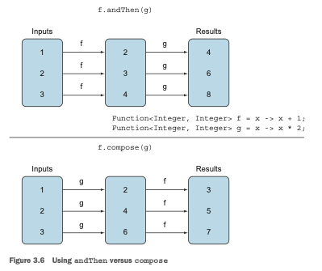

Ahora puedes crear varios canales de transformación componiendo los métodos utilitarios. Por ejemplo,
creando un canal que primero agrega un encabezado, luego verifica la ortografía y finalmente agrega 
un pie de página, como se muestra a continuación (y como se ilustra en la figura 3.7):

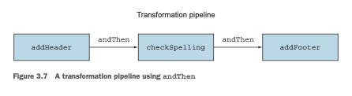

Un segundo canal podría ser solo agregar un encabezado y un pie de página sin verificar la ortografía:

```java
Function<String, String> addHeader = Letter::addHeader;
Function<String, String> transformationPipeline
= addHeader.andThen(Letter::addFooter);
```

## 3.9 Ideas similares de las matemáticas
Si te sientes cómodo con las matemáticas de bachillerato, esta sección ofrece otro punto de vista 
sobre la idea de las expresiones lambda y el paso de funciones. Siéntete libre de omitirla; nada más
en el libro depende de ella. Pero puede que disfrutes ver otra perspectiva.

### 3.9.1 Integración
Supón que tienes una función (matemática, no de Java) f, quizás definida por
```math
f(x) = x + 10
```
Luego, una pregunta que se hace con frecuencia (en la escuela y en carreras de ciencias e ingeniería)
es encontrar el área bajo la función cuando se dibuja en papel (contando el eje x como la línea 
cero). Por ejemplo, escribes

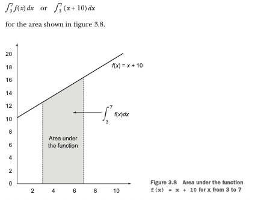

En este ejemplo, la función f es una línea recta, por lo que puedes calcular fácilmente esta área 
mediante el método del trapecio (dibujando triángulos y rectángulos) para descubrir la solución:

1/2 × ((3 + 10) + (7 + 10)) × (7 – 3) = 60

Ahora, ¿cómo podrías expresar esto en Java? Tu primer problema es reconciliar la notación extraña 
como el símbolo de integración o dy/dx con la notación familiar de los lenguajes de programación.
De hecho, pensando desde los principios básicos necesitas un método, quizás llamado integrate, que 
tome tres argumentos: uno es f, y los otros son los límites (3.0 y 7.0 aquí). Por lo tanto, quieres 
escribir en Java algo que se vea así, donde la función f se pasa como argumento:

integrate(f, 3, 7)

Ten en cuenta que no puedes escribir algo tan simple como

integrate(x + 10, 3, 7)

por dos razones. Primero, el ámbito de x no está claro, y segundo, esto pasaría un valor de x+10 a 
integrate en lugar de pasar la función f.
De hecho, el papel secreto de dx en matemáticas es decir "esa función que toma el argumento x cuyo 
resultado es x + 10".

### 3.9.2 Conectando lamndas a Java 8
Como mencionamos anteriormente, Java 8 usa la notación (double x) -> x + 10 (una expresión lambda) 
exactamente para este propósito; por lo tanto puedes escribir

integrate((double x) -> x + 10, 3, 7)
o
integrate((double x) -> f(x), 3, 7)

o, usando una referencia a método como se mencionó anteriormente,

integrate(C::f, 3, 7)

si C es una clase que contiene f como método estático. La idea es que estás pasando el código de f 
al método integrate.
Puede que ahora te preguntes cómo escribirías el método integrate en sí mismo. Sigue suponiendo que 
f es una función lineal (línea recta). Probablemente quisieras escribir de una forma similar a las
matemáticas:
```java
//¡Código Java incorrecto! (No puedes escribir funciones como lo haces en matemáticas.)
public double integrate((double -> double) f, double a, double b) {
return (f(a) + f(b)) * (b - a) / 2.0
}
```
Pero dado que las expresiones lambda solo pueden usarse en un contexto que espera una interfaz 
funcional (en este caso, DoubleFunction4), debes escribirlo de la siguiente manera:
```java
public double integrate(DoubleFunction<Double> f, double a, double b) {
    return (f.apply(a) + f.apply(b)) * (b - a) / 2.0;
}
```
o usando DoubleUnaryOperator, que también evita el boxing del resultado:
```java
public double integrate(DoubleUnaryOperator f, double a, double b) {
    return (f.applyAsDouble(a) + f.applyAsDouble(b)) * (b - a) / 2.0;
}
```
Como observación adicional, es un poco lamentable que tengas que escribir f.apply(a) en lugar de 
simplemente escribir f(a) como en matemáticas, ¡pero Java simplemente no puede alejarse de la visión
de que todo es un objeto en lugar de la idea de que una función es verdaderamente independiente! 

### Resumen 
- Una expresión lambda puede entenderse como un tipo de función anónima: no tiene nombre, pero tiene 
una lista de parámetros, un cuerpo, un tipo de retorno y también posiblemente una lista de excepciones
que pueden lanzarse. 

- Las expresiones lambda te permiten pasar código de forma concisa.

- Una interfaz funcional es una interfaz que declara exactamente un método abstracto. 

- Las expresiones lambda solo pueden usarse donde se espera una interfaz funcional. 

- Las expresiones lambda te permiten proporcionar la implementación del método abstracto de una interfaz
funcional directamente en línea y tratar toda la expresión como una instancia de una interfaz 
funcional.

- Java 8 viene con una lista de interfaces funcionales comunes en el paquete java.util.function, que 
incluye Predicate<T>, Function<T, R>, Supplier<T>, Consumer<T> y BinaryOperator<T>, descritas en la 
tabla 3.2.

- Las especializaciones primitivas de interfaces funcionales genéricas comunes como Predicate<T> y 
Function<T, R> pueden usarse para evitar operaciones de boxing: IntPredicate, IntToLongFunction, y 
así sucesivamente. 

- El patrón execute-around (para cuando necesitas ejecutar un comportamiento dado en medio de código 
repetitivo que es necesario en un método, por ejemplo, asignación y limpieza de recursos) puede 
usarse con lambdas para obtener flexibilidad y reutilización adicionales. 

- El tipo esperado para una expresión lambda se llama tipo objetivo.

- Las referencias a métodos te permiten reutilizar una implementación de método existente y pasarla 
directamente. 

- Las interfaces funcionales como Comparator, Predicate y Function tienen varios métodos 
predeterminados que pueden usarse para combinar expresiones lambda.