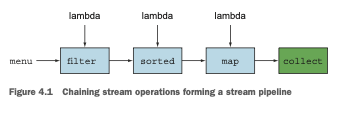

# *Parte 2*

# **Procesamiento de datos de estilo funcional con streams**

La segunda parte de este libro es una exploración profunda de la nueva API de Streams, que te permite
escribir código poderoso que procesa una colección de datos de forma declarativa. Al final de esta 
segunda parte, tendrás una comprensión completa de qué son los streams y cómo puedes usarlos en tu 
código para procesar una colección de datos de manera concisa y eficiente.
El capítulo 4 introduce el concepto de stream y explica cómo se compara con una colección.
El capítulo 5 investiga en detalle las operaciones de stream disponibles para expresar consultas 
sofisticadas de procesamiento de datos. Verás muchos patrones como filtrado, segmentación, búsqueda,
coincidencia, mapeo y reducción.
El capítulo 6 cubre los collectors, una característica de la API de Streams que te permite expresar 
consultas de procesamiento de datos aún más complejas.
En el capítulo 7, aprenderás cómo los streams pueden ejecutarse automáticamente en paralelo y 
aprovechar tus arquitecturas multinúcleo. Además, aprenderás sobre varias trampas que debes evitar 
al usar streams paralelos de manera correcta y efectiva.

# Capitulo 4

# ***Introducción a los streams***

### Este capítulo cubre
- ¿Qué es un stream?
- Colecciones versus streams
- Iteración interna versus externa
- Operaciones intermedias versus terminales

¿Qué harías sin las colecciones en Java? Casi todas las aplicaciones Java crean y procesan colecciones.
Las colecciones son fundamentales para muchas tareas de programación: te permiten agrupar y procesar
datos. Para ilustrar las colecciones en acción, imagina que se te encarga crear una colección de 
platos para representar un menú y calcular diferentes consultas. Por ejemplo, puede que quieras 
averiguar el total de calorías del menú. O puede que necesites filtrar el menú para seleccionar solo
los platos bajos en calorías para un menú especial saludable. Pero a pesar de que las colecciones son
necesarias para casi cualquier aplicación Java, manipularlas está lejos de ser perfecto:
- Mucha lógica de negocio implica operaciones similares a las de bases de datos, como agrupar una lista
de platos por categoría (por ejemplo, todos los platos vegetarianos) o encontrar el plato más caro. 
¿Cuántas veces te encuentras reimplementando estas operaciones usando iteradores? La mayoría de las 
bases de datos te permiten especificar tales operaciones de forma declarativa. Por ejemplo, la 
siguiente consulta SQL te permite seleccionar (o "filtrar") los nombres de los platos que son bajos 
en calorías: SELECT name FROM dishes WHERE calorie < 400. Como puedes ver, en SQL no necesitas 
implementar cómo filtrar usando el atributo de calorías de un plato (como lo harías con las 
colecciones de Java, por ejemplo, usando un iterador y un acumulador). En cambio, escribes lo que 
quieres como resultado. Esta idea básica significa que te preocupas menos por cómo implementar 
explícitamente tales consultas, ¡eso se maneja por ti! ¿Por qué no puedes hacer algo similar con las
colecciones?
- ¿Cómo procesarías una gran colección de elementos? Para obtener rendimiento necesitarías procesarla
en paralelo y usar arquitecturas multinúcleo. Pero escribir código paralelo es complicado en 
comparación con trabajar con iteradores. Además, ¡no es divertido depurarlo!

¿Qué podrían hacer los diseñadores del lenguaje Java para ahorrarte tu valioso tiempo y hacer tu vida
como programadores más fácil? Puede que hayas adivinado: la respuesta son los streams.

## ¿Qué son los streams?

Los streams son una actualización de la API de Java que te permite manipular colecciones de datos de
forma declarativa (expresas una consulta en lugar de codificar una implementación ad hoc para ella).
Por ahora puedes pensar en ellos como iteradores sofisticados sobre una colección de datos. Además, 
los streams pueden procesarse en paralelo de forma transparente, ¡sin que tengas que escribir ningún
código multihilo! Explicamos en detalle en el capítulo 7 cómo funcionan los streams y la 
paralelización. Para ver los beneficios de usar streams, compara el siguiente código para retornar 
los nombres de los platos que son bajos en calorías, ordenados por número de calorías, primero en 
Java 7 y luego en Java 8 usando streams. ¡No te preocupes demasiado por el código de Java 8; lo 
explicamos en detalle en las siguientes secciones!
Antes (Java 7):
```java
List<Dish> lowCaloricDishes = new ArrayList<>();
for(Dish dish: menu){
    if(dish.getCalories() < 400){ //Filtra los elementos usando un acumulador.
        lowCaloricDishes.add(dish);
    }
}
Collections.sort(lowCaloricDishes, new Comparator<Dish>() { //Ordena los platos con una clase anónima.
    public int compare (Dish dish1, Dish dish2){
        return Integer.compare(dish1.getCalories(), dish2.getCalories());
    }
});
List<String> lowCaloricDishesName = new ArrayList<>();
for(Dish dish: lowCaloricDishes){
        lowCaloricDishesName.add(dish.getName()); //Procesa la lista ordenada para seleccionar los nombres de los platos.
}
```
En este código usas una "variable basura", `lowCaloricDishes`. Su único propósito es actuar como un 
contenedor intermedio desechable. En Java 8, este detalle de implementación se lleva a la librería 
donde corresponde.

Despues en (Java 8):
```java
import static java.util.Comparator.comparing;
import static java.util.stream.Collectors.toList;
List<String> lowCaloricDishesName =
    menu.stream()
        .filter(d -> d.getCalories() < 400)//Selecciona los platos que tienen menos de 400 calorías.
        .sorted(comparing(Dish::getCalories))//Los ordena por calorías.
        .map(Dish::getName)//Extrae los nombres de estos platos.
        .collect(toList());//Almacena todos los nombres en una List.
```
Para aprovechar una arquitectura multinúcleo y ejecutar este código en paralelo, solo necesitas 
cambiar `stream()` por `parallelStream()`:
```java
List<String> lowCaloricDishesName =
    menu.parallelStream()
        .filter(d -> d.getCalories() < 400)
        .sorted(comparing(Dishes::getCalories))
        .map(Dish::getName)
        .collect(toList());
```
Puede que te estés preguntando qué sucede exactamente cuando invocas el método parallelStream. 
¿Cuántos hilos se están usando? ¿Cuáles son los beneficios en rendimiento? ¿Deberías usar este método
en absoluto? El capítulo 7 cubre estas preguntas en detalle. Por ahora, puedes ver que el nuevo 
enfoque ofrece varios beneficios inmediatos desde el punto de vista de la ingeniería de software:

- El código está escrito de forma declarativa: especificas lo que quieres lograr (filtrar platos que 
son bajos en calorías) en lugar de especificar cómo implementar una operación (usando bloques de 
control de flujo como bucles y condiciones if). Como viste en el capítulo anterior, este enfoque, 
junto con la parametrización de comportamiento, te permite adaptarte a los requisitos cambiantes: 
podrías crear fácilmente una versión adicional de tu código para filtrar platos altos en calorías 
usando una expresión lambda, sin tener que copiar y pegar código. Otra forma de pensar en el beneficio
de este enfoque es que el modelo de hilos está desacoplado de la consulta en sí. Debido a que estás 
proporcionando una receta para una consulta, podría ejecutarse de forma secuencial o en paralelo. 
Aprenderás más sobre esto en el capítulo 7.

- Encadenas varias operaciones de bloques de construcción para expresar un canal de procesamiento de 
datos complicado (encadenas el filtro enlazando las operaciones sorted, map y collect, como se
ilustra en la figura 4.1) mientras mantienes tu código legible y su intención clara. El resultado
del filtro se pasa al método sorted, que luego se pasa al método map y después al método collect.

Debido a que operaciones como filter (o sorted, map y collect) están disponibles como bloques de 
construcción de alto nivel que no dependen de un modelo de hilos específico, su implementación 
interna podría ser de un solo hilo o podría potencialmente maximizar tu multinúcleo.



arquitectura de forma transparente. En la práctica, esto significa que ya no tienes que preocuparte 
por los hilos y los bloqueos para determinar cómo paralelizar ciertas tareas de procesamiento de 
datos: ¡la API de Streams lo hace por ti!
La nueva API de Streams es expresiva. Por ejemplo, después de leer este capítulo y los capítulos 
5 y 6, podrás escribir código como el siguiente:
```java
Map<Dish.Type, List<Dish>> dishesByType =
    menu.stream().collect(groupingBy(Dish::getType));
```
Este ejemplo particular se explica en detalle en el capítulo 6. Agrupa los platos por sus tipos 
dentro de un Map. Por ejemplo, el Map puede contener el siguiente resultado:
```html
{FISH=[prawns, salmon],
OTHER=[french fries, rice, season fruit, pizza],
MEAT=[pork, beef, chicken]}
```
Ahora considera cómo implementarías esto con el enfoque típico de programación imperativa usando 
bucles. ¡Pero no desperdicies demasiado tu tiempo. En cambio, adopta el poder de los streams en este
y los siguientes capítulos!

### Otras librerías: Guava, Apache y lambdaj
Ha habido muchos intentos de proporcionar a los programadores de Java mejores librerías para 
manipular colecciones. Por ejemplo, Guava es una librería popular creada por Google. Proporciona 
clases de contenedores adicionales como multimaps y multisets. La librería Apache Commons Collections
proporciona características similares. Finalmente, lambdaj, escrita por Mario Fusco, coautor de este
libro, proporciona muchas utilidades para manipular colecciones de forma declarativa, inspirada en 
la programación funcional.
Ahora, Java 8 viene con su propia librería oficial para manipular colecciones de una manera más 
declarativa.

Para resumir, la API de Streams en Java 8 te permite escribir código que es
- Declarativo: más conciso y legible
- Componible: mayor flexibilidad
- Paralelizable: mejor rendimiento

Para el resto de este capítulo y el siguiente, usaremos el siguiente dominio para nuestros ejemplos:
un menú que no es más que una lista de platos.
```java
List<Dish> menu = Arrays.asList(
    new Dish("pork", false, 800, Dish.Type.MEAT),
    new Dish("beef", false, 700, Dish.Type.MEAT),
    new Dish("chicken", false, 400, Dish.Type.MEAT),
    new Dish("french fries", true, 530, Dish.Type.OTHER),
    new Dish("rice", true, 350, Dish.Type.OTHER),
    new Dish("season fruit", true, 120, Dish.Type.OTHER),
    new Dish("pizza", true, 550, Dish.Type.OTHER),
    new Dish("prawns", false, 300, Dish.Type.FISH),
    new Dish("salmon", false, 450, Dish.Type.FISH) );
```
donde Dish es una clase inmutable definida como:
```java
public class Dish {
    private final String name;
    private final boolean vegetarian;
    private final int calories;
    private final Type type;

    public Dish(String name, boolean vegetarian, int calories, Type type) {
        this.name = name;
        this.vegetarian = vegetarian;
        this.calories = calories;
        this.type = type;
    }

    public String getName() {
        return name;
    }

    public boolean isVegetarian() {
        return vegetarian;
    }

    public int getCalories() {
        return calories;
    }

    public Type getType() {
        return type;
    }

    @Override
    public String toString() {
        return name;
    }

    public enum Type {MEAT, FISH, OTHER}
}
```
Ahora exploraremos cómo puedes usar la API de Streams con más detalle. Compararemos los streams con 
las colecciones y proporcionaremos algo de contexto. En el próximo capítulo, investigaremos en 
detalle las operaciones de stream disponibles para expresar consultas sofisticadas de procesamiento 
de datos. Veremos muchos patrones como filtrado, segmentación, búsqueda, coincidencia, mapeo y 
reducción. Habrá muchos ejercicios y cuestionarios para intentar consolidar tu comprensión.

A continuación, analizaremos cómo puedes crear y manipular streams numéricos (por ejemplo, para 
generar un stream de números pares o triples pitagóricos). Finalmente, analizaremos cómo puedes crear
streams a partir de diferentes fuentes, como desde un archivo. También analizaremos cómo generar 
streams con un número infinito de elementos, ¡algo que definitivamente no puedes hacer con las 
colecciones!

## 4.2 Comenzando con los streams
Comenzamos nuestra discusión sobre los streams con las colecciones, porque esa es la forma más 
sencilla de empezar a trabajar con streams. Las colecciones en Java 8 soportan un nuevo método stream
que retorna un stream (la definición de la interfaz está disponible en java.util.stream.Stream). Más
adelante verás que también puedes obtener streams de varias otras formas (por ejemplo, generando 
elementos de stream a partir de un rango numérico o de recursos de I/O).
Primero, ¿qué es exactamente un stream? Una definición breve es "una secuencia de elementos de una 
fuente que soporta operaciones de procesamiento de datos." Desglosemos esta definición paso a paso:

- Secuencia de elementos: al igual que una colección, un stream proporciona una interfaz a un conjunto
secuenciado de valores de un tipo de elemento específico. Debido a que las colecciones son estructuras
de datos, se trata principalmente de almacenar y acceder a elementos con complejidades específicas 
de tiempo/espacio (por ejemplo, un ArrayList versus un LinkedList). Pero los streams se tratan de 
expresar cómputos como filter, sorted y map, que viste anteriormente. Las colecciones se tratan de 
datos; los streams se tratan de cómputos. Explicamos esta idea con mayor detalle en las secciones 
siguientes.
- Fuente: los streams consumen de una fuente proveedora de datos como colecciones, arrays o recursos 
de E/S. Ten en cuenta que generar un stream a partir de una colección ordenada preserva el 
ordenamiento. Los elementos de un stream provenientes de una lista tendrán el mismo orden que la 
lista.
- Operaciones de procesamiento de datos: los streams soportan operaciones similares a las de bases de
datos y operaciones comunes de los lenguajes de programación funcional para manipular datos, como 
filter, map, reduce, find, match, sort, y así sucesivamente. Las operaciones de stream pueden 
ejecutarse de forma secuencial o en paralelo.

Además, las operaciones de stream tienen dos características importantes:

- Encadenamiento: muchas operaciones de stream retornan un stream en sí mismas, lo que permite 
encadenar operaciones para formar un canal más grande. Esto permite ciertas optimizaciones que 
explicamos en el próximo capítulo, como la evaluación perezosa y el cortocircuito. Un canal de 
operaciones puede verse como una consulta similar a la de una base de datos sobre la fuente de datos.
- Iteración interna: a diferencia de las colecciones, que se iteran explícitamente usando un iterador,
las operaciones de stream realizan la iteración entre bastidores por ti. Mencionamos brevemente esta
idea en el capítulo 1 y volveremos a ella más adelante en la siguiente sección.

Veamos un ejemplo de código para explicar todas estas ideas:
```java
import static java.util.stream.Collectors.toList;
List<String> threeHighCaloricDishNames =
    menu.stream() //Obtiene un stream del menú (la lista de platos).
        .filter(dish -> dish.getCalories() > 300) //Crea un canal de operaciones: primero filtra los platos con alto contenido calórico.
        .map(Dish::getName) //Obtiene los nombres de los platos.
        .limit(3) //Selecciona solo los tres primeros.
        .collect(toList()); //Almacena los resultados en otra List.
System.out.println(threeHighCaloricDishNames); //Produce los resultados [pork, beef, chicken].
```
En este ejemplo, primero obtienes un stream de la lista de platos llamando al método stream sobre 
menu. La fuente de datos es la lista de platos (el menú) y proporciona una secuencia de elementos al
stream. A continuación, aplicas una serie de operaciones de procesamiento de datos sobre el stream: 
filter, map, limit y collect. Todas estas operaciones excepto collect retornan otro stream, por lo 
que pueden conectarse para formar un canal, que puede verse como una consulta sobre la fuente. 
Finalmente, la operación collect inicia el procesamiento del canal para retornar un resultado (es 
diferente porque retorna algo distinto a un stream, aquí, una List). No se produce ningún resultado,
y de hecho ningún elemento del menú es seleccionado, hasta que se invoca collect. Puedes pensar en 
ello como si las invocaciones de métodos en la cadena estuvieran en cola hasta que se llama a collect.
La figura 4.2 muestra la secuencia de operaciones de stream: filter, map, limit y collect, cada una 
de las cuales se describe brevemente aquí:

- filter: toma una lambda para excluir ciertos elementos del stream. En este caso, seleccionas platos
que tienen más de 300 calorías pasando la lambda d -> d.getCalories() > 300.
- map: toma una lambda para transformar un elemento en otro o para extraer información. En este caso, 
extraes el nombre de cada plato pasando la referencia a método Dish::getName, que es equivalente a 
la lambda d -> d.getName().
- limit: trunca un stream para que no contenga más de un número dado de elementos.
- collect: convierte un stream en otra forma. En este caso conviertes el stream en una lista. Parece 
un poco mágico; describimos cómo funciona collect con más detalle en el capítulo 6. Por ahora, puedes
ver collect como una operación que toma como argumento varias recetas para acumular los elementos de
un stream en un resultado resumido. Aquí, toList() describe una receta para convertir un stream en 
una lista.

Observa cómo el código que describimos es diferente de lo que escribirías si fueras a procesar la 
lista de elementos del menú paso a paso. Primero, usas un estilo mucho más declarativo.