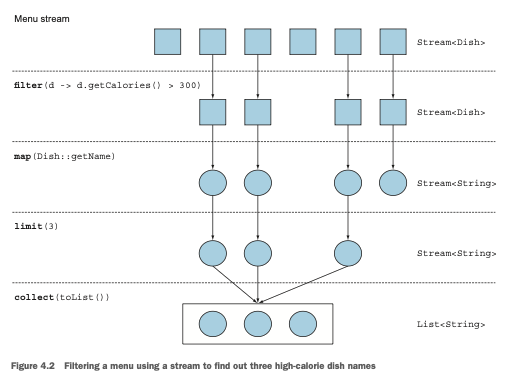
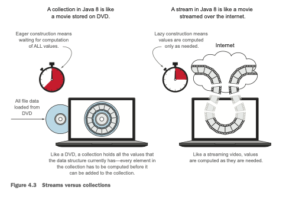
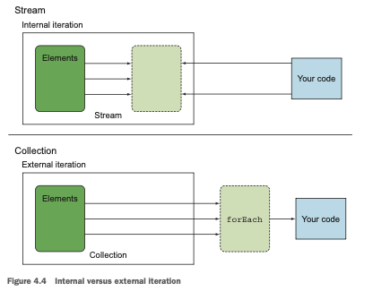
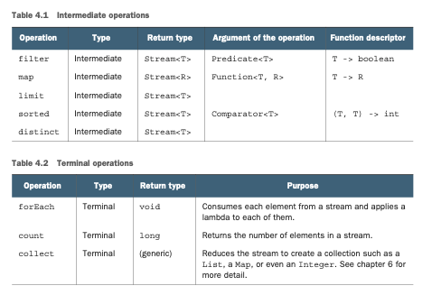

# *Parte 2*

# **Procesamiento de datos de estilo funcional con streams**

La segunda parte de este libro es una exploración profunda de la nueva API de Streams, que te permite
escribir código poderoso que procesa una colección de datos de forma declarativa. Al final de esta 
segunda parte, tendrás una comprensión completa de qué son los streams y cómo puedes usarlos en tu 
código para procesar una colección de datos de manera concisa y eficiente.
El capítulo 4 introduce el concepto de stream y explica cómo se compara con una colección.
El capítulo 5 investiga en detalle las operaciones de stream disponibles para expresar consultas 
sofisticadas de procesamiento de datos. Verás muchos patrones como filtrado, segmentación, búsqueda,
coincidencia, mapeo y reducción.
El capítulo 6 cubre los collectors, una característica de la API de Streams que te permite expresar 
consultas de procesamiento de datos aún más complejas.
En el capítulo 7, aprenderás cómo los streams pueden ejecutarse automáticamente en paralelo y 
aprovechar tus arquitecturas multinúcleo. Además, aprenderás sobre varias trampas que debes evitar 
al usar streams paralelos de manera correcta y efectiva.

# Capitulo 4

# ***Introducción a los streams***

### Este capítulo cubre
- ¿Qué es un stream?
- Colecciones versus streams
- Iteración interna versus externa
- Operaciones intermedias versus terminales

¿Qué harías sin las colecciones en Java? Casi todas las aplicaciones Java crean y procesan colecciones.
Las colecciones son fundamentales para muchas tareas de programación: te permiten agrupar y procesar
datos. Para ilustrar las colecciones en acción, imagina que se te encarga crear una colección de 
platos para representar un menú y calcular diferentes consultas. Por ejemplo, puede que quieras 
averiguar el total de calorías del menú. O puede que necesites filtrar el menú para seleccionar solo
los platos bajos en calorías para un menú especial saludable. Pero a pesar de que las colecciones son
necesarias para casi cualquier aplicación Java, manipularlas está lejos de ser perfecto:
- Mucha lógica de negocio implica operaciones similares a las de bases de datos, como agrupar una lista
de platos por categoría (por ejemplo, todos los platos vegetarianos) o encontrar el plato más caro. 
¿Cuántas veces te encuentras reimplementando estas operaciones usando iteradores? La mayoría de las 
bases de datos te permiten especificar tales operaciones de forma declarativa. Por ejemplo, la 
siguiente consulta SQL te permite seleccionar (o "filtrar") los nombres de los platos que son bajos 
en calorías: SELECT name FROM dishes WHERE calorie < 400. Como puedes ver, en SQL no necesitas 
implementar cómo filtrar usando el atributo de calorías de un plato (como lo harías con las 
colecciones de Java, por ejemplo, usando un iterador y un acumulador). En cambio, escribes lo que 
quieres como resultado. Esta idea básica significa que te preocupas menos por cómo implementar 
explícitamente tales consultas, ¡eso se maneja por ti! ¿Por qué no puedes hacer algo similar con las
colecciones?
- ¿Cómo procesarías una gran colección de elementos? Para obtener rendimiento necesitarías procesarla
en paralelo y usar arquitecturas multinúcleo. Pero escribir código paralelo es complicado en 
comparación con trabajar con iteradores. Además, ¡no es divertido depurarlo!

¿Qué podrían hacer los diseñadores del lenguaje Java para ahorrarte tu valioso tiempo y hacer tu vida
como programadores más fácil? Puede que hayas adivinado: la respuesta son los streams.

## ¿Qué son los streams?

Los streams son una actualización de la API de Java que te permite manipular colecciones de datos de
forma declarativa (expresas una consulta en lugar de codificar una implementación ad hoc para ella).
Por ahora puedes pensar en ellos como iteradores sofisticados sobre una colección de datos. Además, 
los streams pueden procesarse en paralelo de forma transparente, ¡sin que tengas que escribir ningún
código multihilo! Explicamos en detalle en el capítulo 7 cómo funcionan los streams y la 
paralelización. Para ver los beneficios de usar streams, compara el siguiente código para retornar 
los nombres de los platos que son bajos en calorías, ordenados por número de calorías, primero en 
Java 7 y luego en Java 8 usando streams. ¡No te preocupes demasiado por el código de Java 8; lo 
explicamos en detalle en las siguientes secciones!
Antes (Java 7):
```java
List<Dish> lowCaloricDishes = new ArrayList<>();
for(Dish dish: menu){
    if(dish.getCalories() < 400){ //Filtra los elementos usando un acumulador.
        lowCaloricDishes.add(dish);
    }
}
Collections.sort(lowCaloricDishes, new Comparator<Dish>() { //Ordena los platos con una clase anónima.
    public int compare (Dish dish1, Dish dish2){
        return Integer.compare(dish1.getCalories(), dish2.getCalories());
    }
});
List<String> lowCaloricDishesName = new ArrayList<>();
for(Dish dish: lowCaloricDishes){
        lowCaloricDishesName.add(dish.getName()); //Procesa la lista ordenada para seleccionar los nombres de los platos.
}
```
En este código usas una "variable basura", `lowCaloricDishes`. Su único propósito es actuar como un 
contenedor intermedio desechable. En Java 8, este detalle de implementación se lleva a la librería 
donde corresponde.

Despues en (Java 8):
```java
import static java.util.Comparator.comparing;
import static java.util.stream.Collectors.toList;
List<String> lowCaloricDishesName =
    menu.stream()
        .filter(d -> d.getCalories() < 400)//Selecciona los platos que tienen menos de 400 calorías.
        .sorted(comparing(Dish::getCalories))//Los ordena por calorías.
        .map(Dish::getName)//Extrae los nombres de estos platos.
        .collect(toList());//Almacena todos los nombres en una List.
```
Para aprovechar una arquitectura multinúcleo y ejecutar este código en paralelo, solo necesitas 
cambiar `stream()` por `parallelStream()`:
```java
List<String> lowCaloricDishesName =
    menu.parallelStream()
        .filter(d -> d.getCalories() < 400)
        .sorted(comparing(Dishes::getCalories))
        .map(Dish::getName)
        .collect(toList());
```
Puede que te estés preguntando qué sucede exactamente cuando invocas el método parallelStream. 
¿Cuántos hilos se están usando? ¿Cuáles son los beneficios en rendimiento? ¿Deberías usar este método
en absoluto? El capítulo 7 cubre estas preguntas en detalle. Por ahora, puedes ver que el nuevo 
enfoque ofrece varios beneficios inmediatos desde el punto de vista de la ingeniería de software:

- El código está escrito de forma declarativa: especificas lo que quieres lograr (filtrar platos que 
son bajos en calorías) en lugar de especificar cómo implementar una operación (usando bloques de 
control de flujo como bucles y condiciones if). Como viste en el capítulo anterior, este enfoque, 
junto con la parametrización de comportamiento, te permite adaptarte a los requisitos cambiantes: 
podrías crear fácilmente una versión adicional de tu código para filtrar platos altos en calorías 
usando una expresión lambda, sin tener que copiar y pegar código. Otra forma de pensar en el beneficio
de este enfoque es que el modelo de hilos está desacoplado de la consulta en sí. Debido a que estás 
proporcionando una receta para una consulta, podría ejecutarse de forma secuencial o en paralelo. 
Aprenderás más sobre esto en el capítulo 7.

- Encadenas varias operaciones de bloques de construcción para expresar un canal de procesamiento de 
datos complicado (encadenas el filtro enlazando las operaciones sorted, map y collect, como se
ilustra en la figura 4.1) mientras mantienes tu código legible y su intención clara. El resultado
del filtro se pasa al método sorted, que luego se pasa al método map y después al método collect.

Debido a que operaciones como filter (o sorted, map y collect) están disponibles como bloques de 
construcción de alto nivel que no dependen de un modelo de hilos específico, su implementación 
interna podría ser de un solo hilo o podría potencialmente maximizar tu multinúcleo.


arquitectura de forma transparente. En la práctica, esto significa que ya no tienes que preocuparte 
por los hilos y los bloqueos para determinar cómo paralelizar ciertas tareas de procesamiento de 
datos: ¡la API de Streams lo hace por ti!
La nueva API de Streams es expresiva. Por ejemplo, después de leer este capítulo y los capítulos 
5 y 6, podrás escribir código como el siguiente:
```java
Map<Dish.Type, List<Dish>> dishesByType =
    menu.stream().collect(groupingBy(Dish::getType));
```
Este ejemplo particular se explica en detalle en el capítulo 6. Agrupa los platos por sus tipos 
dentro de un Map. Por ejemplo, el Map puede contener el siguiente resultado:
```html
{FISH=[prawns, salmon],
OTHER=[french fries, rice, season fruit, pizza],
MEAT=[pork, beef, chicken]}
```
Ahora considera cómo implementarías esto con el enfoque típico de programación imperativa usando 
bucles. ¡Pero no desperdicies demasiado tu tiempo. En cambio, adopta el poder de los streams en este
y los siguientes capítulos!

### Otras librerías: Guava, Apache y lambdaj
Ha habido muchos intentos de proporcionar a los programadores de Java mejores librerías para 
manipular colecciones. Por ejemplo, Guava es una librería popular creada por Google. Proporciona 
clases de contenedores adicionales como multimaps y multisets. La librería Apache Commons Collections
proporciona características similares. Finalmente, lambdaj, escrita por Mario Fusco, coautor de este
libro, proporciona muchas utilidades para manipular colecciones de forma declarativa, inspirada en 
la programación funcional.
Ahora, Java 8 viene con su propia librería oficial para manipular colecciones de una manera más 
declarativa.

Para resumir, la API de Streams en Java 8 te permite escribir código que es
- Declarativo: más conciso y legible
- Componible: mayor flexibilidad
- Paralelizable: mejor rendimiento

Para el resto de este capítulo y el siguiente, usaremos el siguiente dominio para nuestros ejemplos:
un menú que no es más que una lista de platos.
```java
List<Dish> menu = Arrays.asList(
    new Dish("pork", false, 800, Dish.Type.MEAT),
    new Dish("beef", false, 700, Dish.Type.MEAT),
    new Dish("chicken", false, 400, Dish.Type.MEAT),
    new Dish("french fries", true, 530, Dish.Type.OTHER),
    new Dish("rice", true, 350, Dish.Type.OTHER),
    new Dish("season fruit", true, 120, Dish.Type.OTHER),
    new Dish("pizza", true, 550, Dish.Type.OTHER),
    new Dish("prawns", false, 300, Dish.Type.FISH),
    new Dish("salmon", false, 450, Dish.Type.FISH) );
```
donde Dish es una clase inmutable definida como:
```java
public class Dish {
    private final String name;
    private final boolean vegetarian;
    private final int calories;
    private final Type type;

    public Dish(String name, boolean vegetarian, int calories, Type type) {
        this.name = name;
        this.vegetarian = vegetarian;
        this.calories = calories;
        this.type = type;
    }

    public String getName() {
        return name;
    }

    public boolean isVegetarian() {
        return vegetarian;
    }

    public int getCalories() {
        return calories;
    }

    public Type getType() {
        return type;
    }

    @Override
    public String toString() {
        return name;
    }

    public enum Type {MEAT, FISH, OTHER}
}
```
Ahora exploraremos cómo puedes usar la API de Streams con más detalle. Compararemos los streams con 
las colecciones y proporcionaremos algo de contexto. En el próximo capítulo, investigaremos en 
detalle las operaciones de stream disponibles para expresar consultas sofisticadas de procesamiento 
de datos. Veremos muchos patrones como filtrado, segmentación, búsqueda, coincidencia, mapeo y 
reducción. Habrá muchos ejercicios y cuestionarios para intentar consolidar tu comprensión.

A continuación, analizaremos cómo puedes crear y manipular streams numéricos (por ejemplo, para 
generar un stream de números pares o triples pitagóricos). Finalmente, analizaremos cómo puedes crear
streams a partir de diferentes fuentes, como desde un archivo. También analizaremos cómo generar 
streams con un número infinito de elementos, ¡algo que definitivamente no puedes hacer con las 
colecciones!

## 4.2 Comenzando con los streams
Comenzamos nuestra discusión sobre los streams con las colecciones, porque esa es la forma más 
sencilla de empezar a trabajar con streams. Las colecciones en Java 8 soportan un nuevo método stream
que retorna un stream (la definición de la interfaz está disponible en java.util.stream.Stream). Más
adelante verás que también puedes obtener streams de varias otras formas (por ejemplo, generando 
elementos de stream a partir de un rango numérico o de recursos de I/O).
Primero, ¿qué es exactamente un stream? Una definición breve es "una secuencia de elementos de una 
fuente que soporta operaciones de procesamiento de datos." Desglosemos esta definición paso a paso:

- Secuencia de elementos: al igual que una colección, un stream proporciona una interfaz a un conjunto
secuenciado de valores de un tipo de elemento específico. Debido a que las colecciones son estructuras
de datos, se trata principalmente de almacenar y acceder a elementos con complejidades específicas 
de tiempo/espacio (por ejemplo, un ArrayList versus un LinkedList). Pero los streams se tratan de 
expresar cómputos como filter, sorted y map, que viste anteriormente. Las colecciones se tratan de 
datos; los streams se tratan de cómputos. Explicamos esta idea con mayor detalle en las secciones 
siguientes.
- Fuente: los streams consumen de una fuente proveedora de datos como colecciones, arrays o recursos 
de E/S. Ten en cuenta que generar un stream a partir de una colección ordenada preserva el 
ordenamiento. Los elementos de un stream provenientes de una lista tendrán el mismo orden que la 
lista.
- Operaciones de procesamiento de datos: los streams soportan operaciones similares a las de bases de
datos y operaciones comunes de los lenguajes de programación funcional para manipular datos, como 
filter, map, reduce, find, match, sort, y así sucesivamente. Las operaciones de stream pueden 
ejecutarse de forma secuencial o en paralelo.

Además, las operaciones de stream tienen dos características importantes:

- Encadenamiento: muchas operaciones de stream retornan un stream en sí mismas, lo que permite 
encadenar operaciones para formar un canal más grande. Esto permite ciertas optimizaciones que 
explicamos en el próximo capítulo, como la evaluación perezosa y el cortocircuito. Un canal de 
operaciones puede verse como una consulta similar a la de una base de datos sobre la fuente de datos.
- Iteración interna: a diferencia de las colecciones, que se iteran explícitamente usando un iterador,
las operaciones de stream realizan la iteración entre bastidores por ti. Mencionamos brevemente esta
idea en el capítulo 1 y volveremos a ella más adelante en la siguiente sección.

Veamos un ejemplo de código para explicar todas estas ideas:
```java
import static java.util.stream.Collectors.toList;
List<String> threeHighCaloricDishNames =
    menu.stream() //Obtiene un stream del menú (la lista de platos).
        .filter(dish -> dish.getCalories() > 300) //Crea un canal de operaciones: primero filtra los platos con alto contenido calórico.
        .map(Dish::getName) //Obtiene los nombres de los platos.
        .limit(3) //Selecciona solo los tres primeros.
        .collect(toList()); //Almacena los resultados en otra List.
System.out.println(threeHighCaloricDishNames); //Produce los resultados [pork, beef, chicken].
```
En este ejemplo, primero obtienes un stream de la lista de platos llamando al método stream sobre 
menu. La fuente de datos es la lista de platos (el menú) y proporciona una secuencia de elementos al
stream. A continuación, aplicas una serie de operaciones de procesamiento de datos sobre el stream: 
filter, map, limit y collect. Todas estas operaciones excepto collect retornan otro stream, por lo 
que pueden conectarse para formar un canal, que puede verse como una consulta sobre la fuente. 
Finalmente, la operación collect inicia el procesamiento del canal para retornar un resultado (es 
diferente porque retorna algo distinto a un stream, aquí, una List). No se produce ningún resultado,
y de hecho ningún elemento del menú es seleccionado, hasta que se invoca collect. Puedes pensar en 
ello como si las invocaciones de métodos en la cadena estuvieran en cola hasta que se llama a collect.
La figura 4.2 muestra la secuencia de operaciones de stream: filter, map, limit y collect, cada una 
de las cuales se describe brevemente aquí:

- filter: toma una lambda para excluir ciertos elementos del stream. En este caso, seleccionas platos
que tienen más de 300 calorías pasando la lambda d -> d.getCalories() > 300.
- map: toma una lambda para transformar un elemento en otro o para extraer información. En este caso, 
extraes el nombre de cada plato pasando la referencia a método Dish::getName, que es equivalente a 
la lambda d -> d.getName().
- limit: trunca un stream para que no contenga más de un número dado de elementos.
- collect: convierte un stream en otra forma. En este caso conviertes el stream en una lista. Parece 
un poco mágico; describimos cómo funciona collect con más detalle en el capítulo 6. Por ahora, puedes
ver collect como una operación que toma como argumento varias recetas para acumular los elementos de
un stream en un resultado resumido. Aquí, toList() describe una receta para convertir un stream en 
una lista.

Observa cómo el código que describimos es diferente de lo que escribirías si fueras a procesar la 
lista de elementos del menú paso a paso. Primero, usas un estilo mucho más declarativo.



para procesar los datos en el menú donde dices lo que necesita hacerse: "Encontrar los nombres de 
tres platos con alto contenido calórico." No implementas las funcionalidades de filtrado (filter), 
extracción (map) o truncamiento (limit); están disponibles a través de la librería de Streams. Como 
resultado, la API de Streams tiene más flexibilidad para decidir cómo optimizar este canal. Por 
ejemplo, los pasos de filtrado, extracción y truncamiento podrían fusionarse en un único recorrido y
detenerse tan pronto como se encuentren tres platos. Mostramos un ejemplo para demostrar eso en el 
próximo capítulo.
Demos un paso atrás y examinemos las diferencias conceptuales entre la API de Collections y la nueva
API de Streams antes de explorar con más detalle qué operaciones puedes realizar con un stream.

## 4.3 Streams vs. colecciones
Tanto la noción existente de colecciones en Java como la nueva noción de streams proporcionan 
interfaces a estructuras de datos que representan un conjunto secuenciado de valores del tipo de 
elemento. Por secuenciado, queremos decir que comúnmente recorremos los valores en orden en lugar de
acceder a ellos aleatoriamente en cualquier orden. ¿Cuál es la diferencia?
Comenzaremos con una metáfora visual. Considera una película almacenada en un DVD. Esto es una 
colección (quizás de bytes o de fotogramas, no nos importa cuál aquí) porque contiene toda la 
estructura de datos. Ahora considera ver el mismo video cuando se transmite por internet. Esto ahora
es un stream (de bytes o fotogramas). El reproductor de video en streaming solo necesita haber 
descargado unos pocos fotogramas por adelantado de donde el usuario está viendo, por lo que puedes 
comenzar a mostrar valores desde el inicio del stream antes de que la mayoría de los valores en el 
stream hayan sido calculados (considera transmitir un partido de fútbol en vivo). Ten en cuenta 
particularmente que el reproductor de video puede carecer de memoria para almacenar todo el stream 
en memoria como una colección, y el tiempo de inicio sería terrible si tuvieras que esperar a que 
aparezca el fotograma final antes de poder comenzar a mostrar el video. Podrías elegir, por razones
de implementación del reproductor de video, almacenar una parte de un stream en una colección, pero
esto es distinto de la diferencia conceptual.
En términos más generales, la diferencia entre colecciones y streams tiene que ver con cuándo se 
calculan las cosas. Una colección es una estructura de datos en memoria que contiene todos los valores
que la estructura de datos tiene actualmente; cada elemento en la colección debe calcularse antes de
poder agregarse a la colección. (Puedes agregar cosas y eliminarlas de la colección, pero en cada 
momento, cada elemento en la colección se almacena en memoria; los elementos deben calcularse antes 
de formar parte de la colección.)
Por el contrario, un stream es una estructura de datos conceptualmente fija (no puedes agregar ni 
eliminar elementos de él) cuyos elementos se calculan bajo demanda. Esto da lugar a importantes 
beneficios de programación. En el capítulo 6, mostraremos lo simple que es construir un stream que
contenga todos los números primos (2, 3, 5, 7, 11, ...) aunque haya un número infinito de ellos. La
idea es que un usuario extraerá solo los valores que requiere de un stream y estos elementos se 
producen, de forma invisible para el usuario, solo cuando se necesitan. Esta es una forma de relación
productor-consumidor.
Otra visión es que un stream es como una colección construida de forma perezosa: los valores se 
calculan cuando son solicitados por un consumidor (en términos de gestión esto es orientado a la 
demanda, o incluso fabricación justo a tiempo).
Por el contrario, una colección se construye de forma ansiosa (orientada al proveedor: llena tu 
almacén antes de comenzar a vender, como una novedad navideña que tiene una vida limitada). Imagina
aplicar esto al ejemplo de los números primos. Intentar construir una colección de todos los números
primos resultaría en un bucle de programa que calcula infinitamente un nuevo número primo, 
agregándolo a la colección, pero nunca podría terminar de hacer la colección, por lo que el consumidor
nunca podría verla.
La figura 4.3 ilustra la diferencia entre un stream y una colección, aplicada a nuestro ejemplo de 
DVD versus streaming por internet.
Otro ejemplo es una búsqueda en internet del navegador. Supón que buscas una frase con muchas 
coincidencias en Google o en una tienda en línea de comercio electrónico. En lugar de esperar a que 
se descargue toda la colección de resultados junto con sus fotografías, obtienes un stream cuyos 
elementos son las 10 o 20 mejores coincidencias, junto con un botón para hacer clic en las siguientes
10 o 20. Cuando tú, el consumidor, haces clic en las siguientes 10, el proveedor las calcula bajo 
demanda, antes de retornarlas a tu navegador para mostrarlas.



### 4.3.1 Traversable solo una vez
Ten en cuenta que, de manera similar a los iteradores, un stream solo puede recorrerse una vez. 
Después de eso se dice que el stream ha sido consumido. Puedes obtener un nuevo stream de la fuente
de datos inicial para recorrerlo nuevamente como lo harías con un iterador (asumiendo que es una 
fuente repetible como una colección; si es un canal de E/S, no tendrás suerte). Por ejemplo, el 
siguiente código lanzaría una excepción indicando que el stream ha sido consumido:
```java
List<String> title = Arrays.asList("Modern", "Java", "In", "Action");
Stream<String> s = title.stream();
s.forEach(System.out::println); //Imprime cada palabra del título.
s.forEach(System.out::println); //java.lang.IllegalStateException: el stream ya ha sido operado o cerrado.
```
¡Ten en cuenta que solo puedes consumir un stream una vez!

#### Streams y colecciones filosóficamente
Para los lectores a los que les gustan los puntos de vista filosóficos, puedes ver un stream como un
conjunto de valores distribuidos en el tiempo. Por el contrario, una colección es un conjunto de 
valores distribuidos en el espacio (aquí, la memoria del computador), que todos existen en un único 
punto en el tiempo, y a los que accedes usando un iterador para acceder a los miembros dentro de un 
bucle for-each.

Otra diferencia clave entre las colecciones y los streams es cómo gestionan la iteración sobre los 
datos.

### 4.3.2 Iteración externa vs. interna
Usar la interfaz Collection requiere que el usuario realice la iteración (por ejemplo, usando 
for-each); esto se llama iteración externa. La librería de Streams, por el contrario, usa iteración 
interna: realiza la iteración por ti y se encarga de almacenar el valor del stream resultante en 
algún lugar; simplemente proporcionas una función que indica qué se debe hacer.
Los siguientes listados de código ilustran esta diferencia.

Listado 4.1 Colecciones: iteración externa con un bucle for-each
```java
List<String> names = new ArrayList<>();
    for(Dish dish: menu) { //Itera explícitamente la lista del menú de forma secuencial.
        names.add(dish.getName()); //Extrae el nombre y lo agrega a un acumulador.
}
```
Ten en cuenta que el for-each oculta parte de la complejidad de la iteración. La construcción for-each
es azúcar sintáctica que se traduce en algo mucho más feo usando un objeto Iterator.

Listado 4.2 Colecciones: iteración externa usando un iterador entre bastidores.
```java
List<String> names = new ArrayList<>();
Iterator<String> iterator = menu.iterator();
    while(iterator.hasNext()){ //itera explicitamente
        Dish dish = iterator.next();
        names.add(dish.getName());
}
```

Listado 4.3 Streams: iteración interna.
```java
List<String> names = menu.stream()
        .map(Dish::getName) //Parametriza map con el metodo getName para extraer el nombre de un plato.
        .collect(toList()); //Inicia la ejecución del canal de operaciones; sin iteración.
```
Usemos una analogía para entender las diferencias y los beneficios de la iteración interna. Digamos 
que estás hablando con tu hija de dos años, Sofía, y quieres que ella guarde sus juguetes:

    Tú: "Sofía, vamos a guardar los juguetes. ¿Hay algún juguete en el suelo?"
    Sofía: "Sí, la pelota."
    Tú: "Bien, pon la pelota en la caja. ¿Hay algo más?"
    Sofía: "Sí, está mi muñeca."
    Tú: "Bien, pon la muñeca en la caja. ¿Hay algo más?"
    Sofía: "Sí, está mi libro."
    Tú: "Bien, pon el libro en la caja. ¿Hay algo más?"
    Sofía: "No, nada más."
    Tú: "Perfecto, hemos terminado."

Esto es exactamente lo que haces todos los días con tus colecciones de Java. Iteras una colección 
externamente, extrayendo y procesando los elementos uno por uno de forma explícita. Sería mucho mejor
si pudieras decirle a Sofía: "Pon todos los juguetes que están en el suelo dentro de la caja."
Hay otras dos razones por las que la iteración interna es preferible: primero, Sofía podría elegir 
tomar la muñeca con una mano y la pelota con la otra al mismo tiempo, y segundo, podría decidir tomar
los objetos más cercanos a la caja primero y luego los demás. De la misma manera, usando una iteración
interna, el procesamiento de los elementos podría realizarse de forma transparente en paralelo o en 
un orden diferente que podría estar más optimizado.
Estas optimizaciones son difíciles si iteras la colección externamente como estás acostumbrado a 
hacer en Java. Esto puede parecer un detalle insignificante, pero es gran parte de la razón de ser 
de la introducción de streams en Java 8. La iteración interna en la librería de Streams puede elegir
automáticamente una representación de datos e implementación de paralelismo que se adapte a tu 
hardware. Por el contrario, una vez que hayas elegido la iteración externa escribiendo for-each, te 
has comprometido a gestionar cualquier paralelismo por tu cuenta. (Gestionarlo por tu cuenta en la 
práctica significa "algún día paralelizaremos esto" o "comenzando la larga y ardua batalla que 
involucra tareas y synchronized.") Java 8 necesitaba una interfaz como Collection pero sin iteradores,
de ahí Stream. La figura 4.4 ilustra la diferencia entre un stream (iteración interna) y una colección
(iteración externa).



Hemos descrito las diferencias conceptuales entre las colecciones y los streams. Específicamente, los
streams hacen uso de la iteración interna, donde una librería se encarga de iterar por ti. Pero esto 
solo es útil si tienes una lista de operaciones predefinidas con las que trabajar (por ejemplo, filter
o map) que ocultan la iteración. La mayoría de estas operaciones toman expresiones lambda como 
argumentos, por lo que puedes parametrizar su comportamiento como mostramos en el capítulo anterior.
Los diseñadores del lenguaje Java enviaron la API de Streams con una extensa lista de operaciones 
que puedes usar para expresar consultas complejas de procesamiento de datos. Veremos brevemente esta
lista de operaciones ahora y las exploraremos con más detalle con ejemplos en el próximo capítulo. 
Para comprobar tu comprensión de la iteración externa versus la interna, intenta el ejercicio 4.1 a 
continuación.

### Ejercicio 4.1: Iteración externa vs. interna
Basándote en lo que aprendiste sobre la iteración externa en los listados 4.1 y 4.2, ¿qué operación 
de stream usarías para refactorizar el siguiente código?
```java
List<String> highCaloricDishes = new ArrayList<>();
Iterator<String> iterator = menu.iterator();
while(iterator.hasNext()) {
    Dish dish = iterator.next();
        if(dish.getCalories() > 300) {
            highCaloricDishes.add(d.getName());
    }
```
Respuesta: Necesitas usar el patrón filter.
```java
List<String> highCaloricDish =
    menu.stream()
        .filter(dish -> dish.getCalories() > 300)
        .collect(toList());
```
No te preocupes si todavía no estás familiarizado con cómo escribir precisamente una consulta de 
stream, aprenderás esto con más detalle en el próximo capítulo.

## 4.4 Operaciones de stream
La interfaz de streams en java.util.stream.Stream define muchas operaciones. Pueden clasificarse en
dos categorías. Volvamos a ver nuestro ejemplo anterior:
```java
List<String> names = menu.stream() //Obtiene un stream de la lista de platos.
    .filter(dish -> dish.getCalories() > 300) //Operación intermedia.
    .map(Dish::getName) //Operación intermedia.
    .limit(3) //Operación intermedia.
    .collect(toList()); //Convierte el Stream en una List.
```
Puedes ver dos grupos de operaciones:
- filter, map y limit pueden conectarse entre sí para formar un canal.
- collect provoca que el canal se ejecute y lo cierra.
Las operaciones de stream que pueden conectarse se llaman operaciones intermedias, y las operaciones
que cierran un stream se llaman operaciones terminales. La figura 4.5 destaca estos dos grupos. 
¿Por qué es importante la distinción?

### 4.4.1 Operaciones intermedias
Las operaciones intermedias como filter o sorted retornan otro stream como tipo de retorno. Esto 
permite que las operaciones se conecten para formar una consulta. Lo importante es que las 
operaciones intermedias no realizan ningún procesamiento hasta que se invoca una operación terminal 
en el canal de stream; son perezosas. Esto se debe a que las operaciones intermedias generalmente 
pueden fusionarse y procesarse en un único recorrido por la operación terminal.
Para entender qué sucede en el canal de stream, modifica el código para que cada lambda también 
imprima el plato actual que está procesando. (Como muchas técnicas de demostración y depuración, esto
es un estilo de programación terrible para el código en producción, pero explica directamente el orden
de evaluación cuando estás aprendiendo.)
```java
List<String> names =
    menu.stream()
        .filter(dish -> {
            System.out.println("filtering:" + dish.getName());
            return dish.getCalories() > 300;
        })
        .map(dish -> {
            System.out.println("mapping:" + dish.getName());
            return dish.getName();
        })
        .limit(3)
        .collect(toList());
System.out.println(names);
```
Este código, cuando se ejecuta, imprimirá lo siguiente:
```html
filtering:pork
mapping:pork
filtering:beef
mapping:beef
filtering:chicken
mapping:chicken
[pork, beef, chicken]
```
Al hacer esto, puedes notar que la librería de Streams realiza varias optimizaciones aprovechando la
naturaleza perezosa de los streams. Primero, a pesar de que muchos platos tienen más de 300 calorías,
¡solo se seleccionan los tres primeros! Esto se debe a la operación limit y una técnica llamada 
cortocircuito, como explicaremos en el próximo capítulo.
Segundo, a pesar de que filter y map son dos operaciones separadas, se fusionaron en el mismo 
recorrido (los expertos en compiladores llaman a esta técnica fusión de bucles).

### 4.4.2 Operaciones terminales
Las operaciones terminales producen un resultado a partir de un canal de stream. Un resultado es 
cualquier valor que no sea un stream, como una List, un Integer o incluso void. Por ejemplo, en el 
siguiente canal, forEach es una operación terminal que retorna void y aplica una lambda a cada plato
en la fuente. Pasar System.out.println a forEach le pide que imprima cada Dish en el stream creado a
partir del menú:
```java
menu.stream().forEach(System.out::println);
```
Para comprobar tu comprensión de las operaciones intermedias versus las terminales, intenta el 
ejercicio 4.2.

### Ejercicio 4.2: Operaciones intermedias vs. terminales
En el canal de stream que sigue, ¿puedes identificar las operaciones intermedias y terminales?
```java
long count = menu.stream()
                    .filter(dish -> dish.getCalories() > 300)
                    .distinct()
                    .limit(3)
                    .count();
```
### Respuesta:
La última operación en el canal de stream count retorna un long, que es un valor que no es un stream.
Por lo tanto, es una operación terminal. Todas las operaciones anteriores, filter, distinct y limit,
están conectadas y retornan un stream. Por lo tanto, son operaciones intermedias.

### 4.4.3 Trabajando con streams
Para resumir, trabajar con streams en general implica tres elementos:
- Una fuente de datos (como una colección) sobre la que realizar una consulta
- Una cadena de operaciones intermedias que forman un canal de stream
- Una operación terminal que ejecuta el canal de stream y produce un resultado

La idea detrás de un canal de stream es similar al patrón builder 
(ver http://en.wikipedia.org/wiki/Builder_pattern). En el patrón builder, hay una cadena de llamadas
para establecer una configuración (para los streams esto es una cadena de operaciones intermedias), 
seguida de una llamada a un método build (para los streams esto es una operación terminal).
Para mayor comodidad, las tablas 4.1 y 4.2 resumen las operaciones de stream intermedias y terminales
que has visto en los ejemplos de código hasta ahora. ¡Ten en cuenta que esta es una lista incompleta
de operaciones proporcionadas por la API de Streams; verás varias más en el próximo capítulo!



## 4.5 Hoja de ruta
En el próximo capítulo, detallaremos las operaciones de stream disponibles con casos de uso para que
puedas ver qué tipos de consultas puedes expresar con ellas. Veremos muchos patrones como filtrado, 
segmentación, búsqueda, coincidencia, mapeo y reducción, que pueden usarse para expresar consultas 
sofisticadas de procesamiento de datos.
El capítulo 6 luego explora los collectors en detalle. En este capítulo solo hemos usado la operación
terminal collect() en los streams (ver tabla 4.2) en la forma estilizada de collect(toList()), que 
crea una List cuyos elementos son los mismos que los del stream al que se aplica.

### Resumen
- Un stream es una secuencia de elementos de una fuente que soporta operaciones de procesamiento de 
datos.
- Los streams hacen uso de la iteración interna: la iteración se abstrae a través de operaciones como 
filter, map y sorted.
- Hay dos tipos de operaciones de stream: intermedias y terminales.
- Las operaciones intermedias como filter y map retornan un stream y pueden encadenarse entre sí. Se 
usan para configurar un canal de operaciones pero no producen ningún resultado.
- Las operaciones terminales como forEach y count retornan un valor que no es un stream y procesan un
canal de stream para retornar un resultado.
- Los elementos de un stream se calculan bajo demanda ("de forma perezosa").