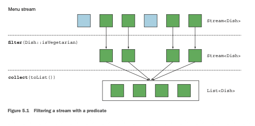
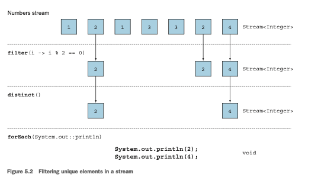
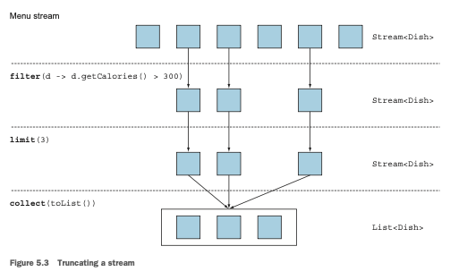
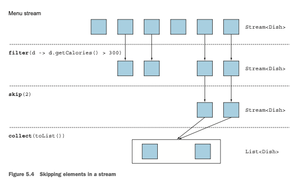
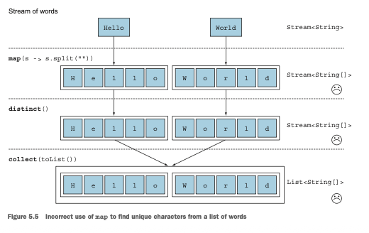
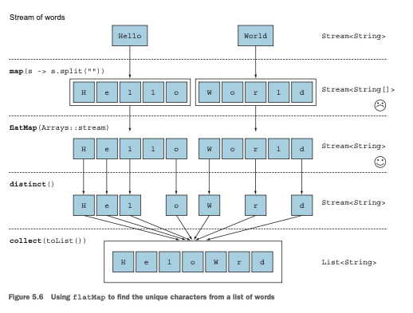
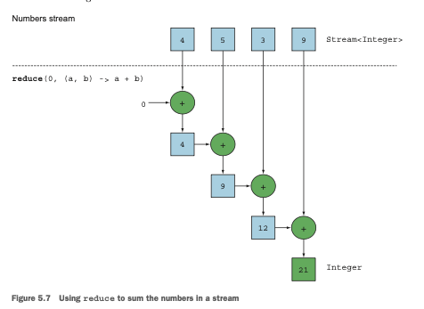
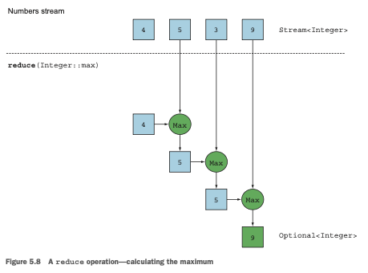
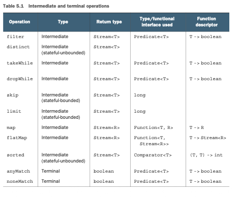
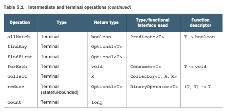

# Capitulo 5

# Trabajando con streams

### Este capítulo cubre

- Filtrado, segmentación y mapeo
- Búsqueda, coincidencia y reducción
- Uso de streams numéricos (especializaciones de streams primitivos)
- Creación de streams a partir de múltiples fuentes
- Streams infinitos

En el capítulo anterior, viste que los streams te permiten pasar de la iteración externa a la interna.
En lugar de escribir código como el siguiente, donde gestionas explícitamente la iteración sobre una
colección de datos (iteración externa), 
```java
List<Dish> vegetarianDishes = new ArrayList<>();
    for(Dish d: menu) {
            if(d.isVegetarian()){
            vegetarianDishes.add(d);
    }
}
```
puedes usar la API de Streams (iteración interna), que soporta las operaciones filter y collect, para
gestionar la iteración sobre la colección de datos por ti. Todo lo que necesitas hacer es pasar el 
comportamiento de filtrado como argumento al método filter:
```java
import static java.util.stream.Collectors.toList;
List<Dish> vegetarianDishes =
    menu.stream()
        .filter(Dish::isVegetarian)
        .collect(toList());
```
Esta diferente forma de trabajar con datos es útil porque dejas que la API de Streams gestione cómo 
procesar los datos. Como consecuencia, la API de Streams puede realizar varias optimizaciones entre 
bastidores. Además, usando la iteración interna, la API de Streams puede decidir ejecutar tu código 
en paralelo. Usando la iteración externa, esto no es posible porque estás comprometido con una 
iteración secuencial paso a paso de un solo hilo.
En este capítulo, tendrás una visión extensa de las diversas operaciones soportadas por la API de 
Streams. Aprenderás sobre las operaciones disponibles en Java 8 y también las nuevas incorporaciones
en Java 9. Estas operaciones te permitirán expresar consultas complejas de procesamiento de datos 
como filtrado, segmentación, mapeo, búsqueda, coincidencia y reducción. A continuación, exploraremos
casos especiales de streams: streams numéricos, streams construidos a partir de múltiples fuentes 
como archivos y arrays, y finalmente streams infinitos.


## 5.1 Filtrado
En esta sección, veremos las formas de seleccionar elementos de un stream: filtrado con un predicado
y filtrado de elementos únicos solamente.

### 5.1.1 Filtrado con un predicado
La interfaz Stream soporta un método filter (con el que ya deberías estar familiarizado). Esta 
operación toma como argumento un predicado (una función que retorna un boolean) y retorna un stream
que incluye todos los elementos que coinciden con el predicado. Por ejemplo, puedes crear un menú 
vegetariano filtrando todos los platos vegetarianos como se ilustra en la figura 5.1 y el código que
le sigue:



```java
List<Dish> vegetarianMenu = menu.stream()
                            .filter(Dish::isVegetarian) //Usa una referencia a metodo para verificar si un plato es apto para vegetarianos.
                            .collect(toList());
```
### 5.1.2 Filtrado de elementos únicos

Los streams también soportan un método llamado distinct que retorna un stream con elementos únicos 
(de acuerdo con la implementación de los métodos hashcode y equals de los objetos producidos por el 
stream). Por ejemplo, el siguiente código filtra todos los números pares de una lista y luego elimina
los duplicados (usando el método equals para la comparación). La figura 5.2 muestra esto visualmente.

```java
List<Integer> numbers = Arrays.asList(1, 2, 1, 3, 3, 2, 4);
numbers.stream()
        .filter(i -> i % 2 == 0)
        .distinct()
        .forEach(System.out::println);
```



## 5.2 Segmentación de un stream
En esta sección, analizaremos cómo seleccionar y omitir elementos en un stream de diferentes maneras.
Hay operaciones disponibles que te permiten seleccionar o descartar elementos de forma eficiente 
usando un predicado, ignorar los primeros elementos de un stream o truncar un stream a un tamaño dado.


### 5.2.1 Segmentación usando un predicado
Java 9 agregó dos nuevos métodos que son útiles para seleccionar elementos de forma eficiente en un 
stream: `takeWhile y dropWhile`.

### usando takeWhile
Supongamos que tienes la siguiente lista especial de platos:
```java
List<Dish> specialMenu = Arrays.asList(
    new Dish("seasonal fruit", true, 120, Dish.Type.OTHER),
    new Dish("prawns", false, 300, Dish.Type.FISH),
    new Dish("rice", true, 350, Dish.Type.OTHER),
    new Dish("chicken", false, 400, Dish.Type.MEAT),
    new Dish("french fries", true, 530, Dish.Type.OTHER));
```
¿Cómo seleccionarías los platos que tienen menos de 320 calorías? Instintivamente, ya sabes de la 
sección anterior que la operación filter puede usarse de la siguiente manera:
```java
List<Dish> filteredMenu = specialMenu.stream()
                .filter(dish -> dish.getCalories() < 320)
                .collect(toList());  //Lista fruta de temporada, gambas.
```
Sin embargo, notarás que la lista inicial ya estaba ordenada por número de calorías. La desventaja 
de usar la operación filter aquí es que necesitas iterar por todo el stream y el predicado se aplica
a cada elemento. En cambio, podrías detenerte una vez que encontraras un plato que tiene más de 
(o igual a) 320 calorías. Con una lista pequeña esto puede no parecer un gran beneficio, pero puede 
volverse útil si trabajas con un stream potencialmente grande de elementos. Pero ¿cómo especificas 
esto? ¡La operación takeWhile está aquí para rescatarte! Te permite segmentar cualquier stream 
(incluso un stream infinito como aprenderás más adelante) usando un predicado. Pero afortunadamente,
se detiene una vez que ha encontrado un elemento que no coincide. Así es como puedes usarla:
```java
List<Dish> slicedMenu1 = specialMenu.stream()
                .takeWhile(dish -> dish.getCalories() < 320)
                .collect(toList()); //Lista fruta de temporada, gambas.
```
### usando dropWhile
Sin embargo, ¿qué hay de obtener los otros elementos? ¿Qué hay de encontrar los elementos que tienen
más de 320 calorías? Puedes usar la operación dropWhile para esto:
```java
List<Dish> slicedMenu2 = specialMenu.stream()
                    .dropWhile(dish -> dish.getCalories() < 320)
                    .collect(toList()); //Lista arroz, pollo, papas fritas.
```
La operación dropWhile es el complemento de takeWhile. Descarta los elementos al inicio donde el 
predicado es falso. Una vez que el predicado se evalúa como verdadero, se detiene y retorna todos los
elementos restantes, ¡e incluso funciona si hay un número infinito de elementos restantes!

### 5.2.2 Truncamiento de un stream
Los streams soportan el método limit(n), que retorna otro stream que no es más largo que un tamaño 
dado. El tamaño solicitado se pasa como argumento a limit. Si el stream está ordenado, se retornan 
los primeros elementos hasta un máximo de n. Por ejemplo, puedes crear una List seleccionando los 
tres primeros platos que tienen más de 300 calorías de la siguiente manera:
```java
List<Dish> dishes = specialMenu.stream()
                                .filter(dish -> dish.getCalories() > 300)
                                .limit(3)
                                .collect(toList()); //Lista arroz, pollo, papas fritas.
```
La figura 5.3 ilustra una combinación de filter y limit. Puedes ver que solo se seleccionan los tres 
primeros elementos que coinciden con el predicado, y el resultado se retorna inmediatamente.



Ten en cuenta que limit también funciona en streams no ordenados (por ejemplo, si la fuente es un 
Set). En este caso no debes asumir ningún orden en el resultado producido por limit.

### 5.2.3 Omisión de elementos
Los streams soportan el método skip(n) para retornar un stream que descarta los primeros n elementos.
Si el stream tiene menos de n elementos, se retorna un stream vacío. ¡Ten en cuenta que limit(n) y 
skip(n) son complementarios! Por ejemplo, el siguiente código omite los dos primeros platos que tienen
más de 300 calorías y retorna el resto. La figura 5.4 ilustra esta consulta.
```java
List<Dish> dishes = menu.stream()
                        .filter(d -> d.getCalories() > 300)
                        .skip(2)
                        .collect(toList());
```



Pon en práctica lo que has aprendido en esta sección con el ejercicio 5.1 antes de pasar a las 
operaciones de mapeo.


#### Ejercicio 5.1: Filtrado
¿Cómo usarías streams para filtrar los dos primeros platos de carne?

#### Respuesta:
Puedes resolver este problema componiendo los métodos filter y limit juntos y usando 
`collect(toList())` para convertir el stream en una lista de la siguiente manera:
```java
List<Dish> dishes = menu.stream()
        .filter(dish -> dish.getType() == Dish.Type.MEAT)
        .limit(2)
        .collect(toList());

```
## 5.3 Mapeo

Un patrón común de procesamiento de datos es seleccionar información de ciertos objetos. Por ejemplo,
en SQL puedes seleccionar una columna particular de una tabla. La API de Streams proporciona 
facilidades similares a través de los métodos map y flatMap.

### 5.3.1 Aplicación de una función a cada elemento de un stream
Los streams soportan el método map, que toma una función como argumento. La función se aplica a cada
elemento, mapeándolo a un nuevo elemento (la palabra mapeo se usa porque tiene un significado similar
a transformar pero con el matiz de "crear una nueva versión de" en lugar de "modificar"). Por ejemplo,
en el siguiente código pasas una referencia a método Dish::getName al método map para extraer los 
nombres de los platos en el stream:
```java
List<String> dishNames = menu.stream()
                    .map(Dish::getName)
                    .collect(toList());
```
Debido a que el método getName retorna un `String`, el stream generado por el método map es de tipo 
`Stream<String>.`
Veamos un ejemplo ligeramente diferente para consolidar tu comprensión de map. Dada una lista de 
palabras, te gustaría retornar una lista con el número de caracteres de cada palabra. ¿Cómo lo harías?
Necesitarías aplicar una función a cada elemento de la lista. ¡Esto suena como un trabajo para el 
método map! La función a aplicar debería tomar una palabra y retornar su longitud. Puedes resolver 
este problema de la siguiente manera, pasando una referencia a método `String::length` a `map:`
```java
ence String::length to map:
List<String> words = Arrays.asList("Modern", "Java", "In", "Action");
List<Integer> wordLengths = words.stream()
                                .map(String::length)
                                .collect(toList());
```
### 5.3.2 Aplanamiento de streams
Viste cómo retornar la longitud de cada palabra en una lista usando el método map. Extendamos esta 
idea un poco más: ¿Cómo podrías retornar una lista de todos los caracteres únicos de una lista de 
palabras? Por ejemplo, dada la lista de palabras ["Hello", "World"] te gustaría retornar la lista 
["H", "e", "l", "o", "W", "r", "d"].
Puede que pienses que esto es fácil, que puedes mapear cada palabra en una lista de caracteres y 
luego llamar a distinct para filtrar los caracteres duplicados. Un primer intento podría ser el 
siguiente:
```java
words.stream()
            .map(word -> word.split(""))
            .distinct()
            .collect(toList());
```
El problema con este enfoque es que la lambda pasada al método map retorna un `String[]`
(un array de String) para cada palabra. El stream retornado por el método map es de tipo 
`Stream<String[]>`. Lo que quieres es Stream<String> para representar un stream de caracteres. La 
figura 5.5 ilustra el problema.



Afortunadamente hay una solución a este problema usando el método flatMap. Veamos paso a paso cómo 
resolverlo.

### Intento usando Map y Array.Stream
Primero, necesitas un stream de caracteres en lugar de un stream de arrays. Hay un método llamado 
Arrays.stream() que toma un array y produce un stream:
```java
String[] arrayOfWords = {"Goodbye", "World"};
Stream<String> streamOfwords = Arrays.stream(arrayOfWords);
```
Úsalo en el canal anterior para ver qué sucede:
```java
words.stream()
            .map(word -> word.split("")) //Convierte cada palabra en un array de sus letras individuales.
            .map(Arrays::stream) //Convierte cada array en un stream separado.
            .distinct()
            .collect(toList());
```

3:24 PM
¡La solución actual todavía no funciona! Esto se debe a que ahora terminas con una lista de streams 
(más precisamente, List<Stream<String>>). De hecho, primero conviertes cada palabra en un array de 
sus letras individuales y luego conviertes cada array en un stream separado.

### Usando FlatMap 
Puedes solucionar este problema usando flatMap de la siguiente manera:
```java
List<String> uniqueCharacters = words.stream()
                            .map(word -> word.split("")) //Convierte cada palabra en un array de sus letras individuales.
                            .flatMap(Arrays::stream) //Aplana cada stream generado en un único stream.
                            .distinct()
                            .collect(toList());
```
Usar el método `flatMap` tiene el efecto de mapear cada array no con un stream sino con el contenido 
de ese stream. Todos los streams separados que se generaron al usar `map(Arrays::stream)` se fusionan,
es decir, se aplanan en un único stream. La figura 5.6 ilustra el efecto de usar el método `flatMap`. 
Compáralo con lo que hace map en la figura 5.5.
En pocas palabras, el método `flatMap` te permite reemplazar cada valor de un stream con otro stream y
luego concatena todos los streams generados en un único stream. Volveremos a `flatMap` en el 
capítulo 11 cuando analicemos patrones más avanzados de Java 8, como el uso de la nueva clase de 
librería `Optional` para la verificación de nulos. Para consolidar tu comprensión de `map y flatMap`, 
intenta el ejercicio 5.2.



### Ejercicio 5.2: Mapeo
1. Dada una lista de números, ¿cómo retornarías una lista del cuadrado de cada número? Por ejemplo, 
dado [1, 2, 3, 4, 5] deberías retornar [1, 4, 9, 16, 25].

### Respuesta:
Puedes resolver este problema usando map con una lambda que toma un número y retorna el cuadrado del
número:
```java
List<Integer> numbers = Arrays.asList(1, 2, 3, 4, 5);
List<Integer> squares = numbers.stream()
                            .map(n -> n * n)
                            .collect(toList());
```
2. Dadas dos listas de números, ¿cómo retornarías todos los pares de números? Por ejemplo, dada una 
lista [1, 2, 3] y una lista [3, 4] deberías retornar [(1, 3), (1, 4), (2, 3), (2, 4), (3, 3), (3, 4)].
Para simplificar, puedes representar un par como un array con dos elementos.

### Respuesta:
Podrías usar dos maps para iterar sobre las dos listas y generar los pares. Pero esto retornaría un 
`Stream<Stream<Integer[]>>`. Lo que necesitas hacer es aplanar los streams generados para obtener un 
`Stream<Integer[]>`. Para eso es flatMap:
```java
List<Integer> numbers1 = Arrays.asList(1, 2, 3);
List<Integer> numbers2 = Arrays.asList(3, 4);
List<int[]> pairs = numbers1.stream()
                            .flatMap(i -> numbers2.stream()
                                                .map(j -> new int[]{i, j})
                                    )
                            .collect(toList());
```

3. ¿Cómo extenderías el ejemplo anterior para retornar solo los pares cuya suma es divisible por 3?

### Respuesta:
Viste anteriormente que filter puede usarse con un predicado para filtrar elementos de un stream. 
Debido a que después de la operación `flatMap` tienes un stream de `int[]` que representa un par, solo 
necesitas un predicado para verificar si la suma es divisible por 3:
```java
List<Integer> numbers1 = Arrays.asList(1, 2, 3);
List<Integer> numbers2 = Arrays.asList(3, 4);
List<int[]> pairs = numbers1.stream()
                            .flatMap(i -> numbers2.stream()
                                                .filter(j -> (i + j) % 3 == 0)
                                                .map(j -> new int[]{i, j})
                                    )
                            .collect(toList());
```
El resultado es: [(2, 4), (3, 3)].

## 5.4 Búsqueda y coincidencia
Otro patrón común de procesamiento de datos es encontrar si algunos elementos en un conjunto de datos
coinciden con una propiedad dada. La API de Streams proporciona tales facilidades a través de los 
métodos allMatch, anyMatch, noneMatch, findFirst y findAny de un stream.

### 5.4.1 Verificación de si un predicado coincide con al menos un elemento
El método anyMatch puede usarse para responder la pregunta "¿Hay algún elemento en el stream que 
coincida con el predicado dado?" Por ejemplo, puedes usarlo para averiguar si el menú tiene una opción
vegetariana:
```java
if(menu.stream().anyMatch(Dish::isVegetarian)){
        System.out.println("The menu is (somewhat) vegetarian friendly!!");
}
```
El método `anyMatch` retorna un `boolean` y por lo tanto es una operación terminal.

### 5.4.2 Verificación de si un predicado coincide con todos los elementos
El método allMatch funciona de manera similar a anyMatch pero verificará si todos los elementos del 
stream coinciden con el predicado dado. Por ejemplo, puedes usarlo para averiguar si el menú es 
saludable (todos los platos tienen menos de 1000 calorías):
```java
boolean isHealthy = menu.stream().allMatch(dish -> dish.getCalories() < 1000);
```
### NoneMatch
Lo opuesto de `allMatch` es `noneMatch`. Garantiza que ningún elemento en el stream coincida con el 
predicado dado. Por ejemplo, podrías reescribir el ejemplo anterior de la siguiente manera usando 
noneMatch:
```java
boolean isHealthy = menu.stream().noneMatch(d -> d.getCalories() >= 1000);
```
Estas tres operaciones, `anyMatch`, `allMatch` y `noneMatch`, hacen uso de lo que llamamos cortocircuito, 
una versión de stream de los familiares operadores Java de cortocircuito && y ||.

### Evaluación de cortocircuito
Algunas operaciones no necesitan procesar todo el stream para producir un resultado. Por ejemplo, 
supón que necesitas evaluar una expresión booleana grande encadenada con operadores and. Solo
necesitas encontrar que una expresión es falsa para deducir que toda la expresión retornará falso, 
sin importar cuán larga sea la expresión; no hay necesidad de evaluar toda la expresión. A esto es a
lo que se refiere el cortocircuito.
En relación con los streams, ciertas operaciones como `allMatch, noneMatch, findFirst y findAny` no 
necesitan procesar todo el stream para producir un resultado. Tan pronto como se encuentra un 
elemento, se puede producir un resultado. De manera similar, limit también es una operación de 
cortocircuito. La operación solo necesita crear un stream de un tamaño dado sin procesar todos los 
elementos en el stream. Tales operaciones son útiles (por ejemplo, cuando necesitas tratar con 
streams de tamaño infinito, porque pueden convertir un stream infinito en un stream de tamaño finito).
Mostraremos ejemplos de streams infinitos en la sección 5.7.

### 5.4.3 Búsqueda de un elemento
El método `findAny` retorna un elemento arbitrario del stream actual. Puede usarse en conjunto con 
otras operaciones de stream. Por ejemplo, puede que desees encontrar un plato que sea vegetariano. 
Puedes combinar el método `filter y findAny` para expresar esta consulta:
```java
Optional<Dish> dish = menu.stream()
                        .filter(Dish::isVegetarian)
                        .findAny();
```
El canal de stream se optimizará entre bastidores para realizar un único recorrido y finalizar tan 
pronto como se encuentre un resultado usando el cortocircuito. Pero espera un momento; ¿qué es este 
`Optional` en el código?

### Optional en pocas palabras
La clase `Optional<T>` (java.util.Optional) es una clase contenedora para representar la existencia
o ausencia de un valor. En el código anterior, es posible que findAny no encuentre ningún elemento. 
En lugar de retornar `null`, que es bien conocido por ser propenso a errores, los diseñadores de la
librería de Java 8 introdujeron `Optional<T>`. No entraremos en los detalles de Optional aquí, 
porque mostraremos en detalle en el capítulo 11 cómo tu código puede beneficiarse del uso de `Optional`
para evitar errores relacionados con la verificación de nulos. Pero por ahora, es bueno saber que 
hay algunos métodos disponibles en Optional que te obligan a verificar explícitamente la presencia 
de un valor o tratar con la ausencia de un valor:

- isPresent() retorna true si Optional contiene un valor, false en caso contrario.
- ifPresent(Consumer<T> block) ejecuta el bloque dado si hay un valor presente. Introdujimos la 
interfaz funcional Consumer en el capítulo 3; te permite pasar una lambda que toma un argumento de 
tipo T y retorna void.
- T get() retorna el valor si está presente; de lo contrario lanza una NoSuchElementException.
- T orElse(T other) retorna el valor si está presente; de lo contrario retorna un valor predeterminado.

Por ejemplo, en el código anterior necesitarías verificar explícitamente la presencia de un plato en
el objeto Optional para acceder a su nombre:
```java
menu.stream()
        .filter(Dish::isVegetarian)
        .findAny() //Retorna un Optional<Dish>.
        .ifPresent(dish -> System.out.println(dish.getName()); //Si hay un valor contenido, se imprime; de lo contrario no sucede nada.
```
### 5.4.4 Búsqueda del primer elemento
Algunos streams tienen un orden de encuentro que especifica el orden en que los elementos aparecen 
lógicamente en el stream (por ejemplo, un stream generado a partir de una List o de una secuencia de
datos ordenada). Para tales streams puede que desees encontrar el primer elemento. Existe el método 
`findFirst` para esto, que funciona de manera similar a `findAny` (por ejemplo, el código que sigue,
dada una lista de números, encuentra el primer cuadrado que es divisible por 3):
```java
List<Integer> someNumbers = Arrays.asList(1, 2, 3, 4, 5);
Optional<Integer> firstSquareDivisibleByThree =
    someNumbers.stream()
                .map(n -> n * n)
                .filter(n -> n % 3 == 0)
                .findFirst(); // 9
```
### Cuándo usar findFirst y findAny
Puede que te preguntes por qué tenemos tanto `findFirst como findAny`. La respuesta es el paralelismo.
Encontrar el primer elemento es más restrictivo en paralelo. Si no te importa qué elemento se retorna,
usa `findAny` porque es menos restrictivo al usar streams paralelos.

## 5.5 Reducción
Las operaciones terminales que has visto retornan un boolean `(allMatch y similares)`, void `(forEach)`
o un objeto `Optional (findAny y similares)`. También has usado collect para combinar todos los 
elementos en un `stream en una List`.
En esta sección, verás cómo puedes combinar elementos de un stream para expresar consultas más 
complicadas como "Calcula la suma de todas las calorías en el menú" o "¿Cuál es el plato con más 
calorías en el menú?" usando la operación reduce. Tales consultas combinan todos los elementos en el
stream repetidamente para producir un único valor como un `Integer`. Estas consultas pueden 
clasificarse como operaciones de reducción (un stream se reduce a un valor). En la jerga de los 
lenguajes de programación funcional, esto se denomina fold porque puedes ver esta operación como 
doblar repetidamente una hoja larga de papel (tu stream) hasta que forme un pequeño cuadrado, que es
el resultado de la operación `fold`.

### 5.5.1 Suma de los elementos
Antes de investigar cómo usar el método reduce, es útil primero ver cómo sumarías los elementos de 
una lista de números usando un bucle `for-each`:
```java
int sum = 0;
for (int x : numbers){
    sum +=x;
}
```
Cada elemento de numbers se combina iterativamente con el operador de adición para formar un resultado.
Reduces la lista de números a un único número usando repetidamente la adición. Hay dos parámetros en 
este código:

- El valor inicial de la variable sum, en este caso 0
- La operación para combinar todos los elementos de la lista, en este caso +

¿No sería genial si también pudieras multiplicar todos los números sin tener que copiar y pegar 
repetidamente este código? Aquí es donde la operación reduce, que abstrae sobre este patrón de 
aplicación repetida, puede ayudar. Puedes sumar todos los elementos de un stream de la siguiente 
manera:
```java
int sum = numbers.stream().reduce(0, (a, b) -> a + b);
```
`reduce` toma dos argumentos:

- Un valor inicial, aquí 0.
- Un BinaryOperator<T> para combinar dos elementos y producir un nuevo valor; aquí usas la lambda 
(a, b) -> a + b.

Podrías igualmente multiplicar todos los elementos pasando una lambda diferente, (a, b) -> a * b, 
a la operación reduce:
```java
int product = numbers.stream().reduce(1, (a, b) -> a * b);
```
La figura 5.7 ilustra cómo funciona la operación reduce en un stream: la lambda combina cada elemento 
repetidamente hasta que el stream que contiene los enteros 4, 5, 3, 9 se reduce a un único valor.



Veamos en detalle cómo ocurre la operación reduce para sumar un stream de números. Primero, 0 se usa
como el primer parámetro de la lambda (a), y 4 se consume del stream y se usa como el segundo 
parámetro (b). 0 + 4 produce 4, y se convierte en el nuevo valor acumulado. Luego la lambda se llama
nuevamente con el valor acumulado y el siguiente elemento del stream, 5, que produce el nuevo valor 
acumulado, 9. Avanzando, la lambda se llama nuevamente con el valor acumulado y el siguiente elemento,
3, que produce 12. Finalmente, la lambda se llama con 12 y el último elemento del stream, 9, que 
produce el valor final, 21.
Puedes hacer este código más conciso usando una referencia a método. A partir de Java 8, la clase 
`Integer` ahora viene con un método estático sum para sumar dos números, que es lo que quieres en 
lugar de escribir repetidamente el mismo código como lambda:
```java
int sum = numbers.stream().reduce(0, Integer::sum);
```
### Sin valor inicial
También hay una variante sobrecargada de reduce que no toma un valor inicial, pero retorna un objeto
`Optional`:
```java
Optional<Integer> sum = numbers.stream().reduce((a, b) -> (a + b));
```
¿Por qué retorna un `Optional<Integer>?` Considera el caso cuando el stream no contiene elementos. La 
operación reduce no puede retornar una suma porque no tiene un valor inicial. Por eso el resultado 
se envuelve en un objeto `Optional` para indicar que la suma puede estar ausente. Ahora ve qué más 
puedes hacer con reduce.

### 5.5.2 Máximo y mínimo
¡Resulta que la reducción es todo lo que necesitas para calcular máximos y mínimos también! Veamos 
cómo puedes aplicar lo que acabas de aprender sobre reduce para calcular el elemento máximo o mínimo
en un stream. Como viste, reduce toma dos parámetros:
- Un valor inicial
- Una lambda para combinar dos elementos del stream y producir un nuevo valor

La lambda se aplica paso a paso a cada elemento del stream con el operador de adición, como se muestra
en la figura 5.7. Necesitas una lambda que, dados dos elementos, retorne el máximo de ellos. ¡La 
operación reduce usará el nuevo valor con el siguiente elemento del stream para producir un nuevo 
máximo hasta que todo el stream sea consumido!
Puedes usar reduce de la siguiente manera para calcular el máximo en un stream; esto se ilustra en 
la figura 5.8.
```java
Optional<Integer> max = numbers.stream().reduce(Integer::max);
```
Para calcular el mínimo, necesitas pasar Integer.min a la operación reduce en lugar de `Integer.max:`
```java
Optional<Integer> min = numbers.stream().reduce(Integer::min);
```
Igualmente podrías haber usado la lambda `(x, y) -> x < y ? x :` y en lugar de `Integer::min`, ¡pero
esta última es definitivamente más fácil de leer!



Para comprobar tu comprensión de la operación reduce, intenta el ejercicio 5.3.

### Ejercicio 5.3: Reducción

¿Cómo contarías el número de platos en un stream usando los métodos map y reduce?

### Respuesta:
Puedes resolver este problema mapeando cada elemento de un stream al número 1 y luego sumándolos 
usando reduce. ¡Esto es equivalente a contar, en orden, el número de elementos en el stream!
```java
int count = menu.stream()
                .map(d -> 1)
                .reduce(0, (a, b) -> a + b);
```
Una cadena de map y reduce se conoce comúnmente como el patrón map-reduce, que se hizo famoso por el
uso que Google hace de él para la búsqueda web, porque puede paralelizarse fácilmente. Ten en cuenta
que en el capítulo 4 viste el método integrado count para contar el número de elementos en el stream:
```java
long count = menu.stream().count();
```
### Beneficio del método reduce y el paralelismo.
El beneficio de usar reduce en comparación con la suma iterativa paso a paso que escribiste 
anteriormente es que la iteración se abstrae usando iteración interna, lo que permite que la 
implementación interna elija realizar la operación reduce en paralelo. El ejemplo de suma iterativa 
implica actualizaciones compartidas a una variable sum, que no se paraleliza con gracia. Si agregas 
la sincronización necesaria, es probable que descubras que la contención de hilos te roba todo el 
rendimiento que se suponía que el paralelismo iba a darte. Paralelizar este cálculo requiere un 
enfoque diferente: particionar la entrada, sumar las particiones y combinar las sumas. Pero ahora el
código empieza a verse muy diferente. Verás cómo se ve esto en el capítulo 7 usando el framework 
`fork/join`. Pero por ahora es importante darse cuenta de que el patrón de acumulador mutable es un 
callejón sin salida para la paralelización. Necesitas un nuevo patrón, y esto es lo que reduce te 
proporciona. También verás en el capítulo 7 que para sumar todos los elementos en paralelo usando 
streams, hay casi ninguna modificación en tu código: `stream()` se convierte en `parallelStream()`:
```java
int sum = numbers.parallelStream().reduce(0, Integer::sum);
```
Pero hay un precio a pagar para ejecutar este código en paralelo, como explicaremos más adelante: la
lambda pasada a reduce no puede cambiar el estado (por ejemplo, variables de instancia), y la 
operación necesita ser asociativa y conmutativa para que pueda ejecutarse en cualquier orden.

Has visto ejemplos de reducción que producían un `Integer`: la suma de un stream, el máximo de un 
stream o el número de elementos en un stream. Verás, en la sección 5.6, que hay métodos integrados 
adicionales como sum y max disponibles para ayudarte a escribir código ligeramente más conciso para
patrones de reducción comunes. Investigaremos una forma más compleja de reducciones usando el método
`collect` en el próximo capítulo. Por ejemplo, en lugar de reducir un stream a un Integer, también 
puedes reducirlo a un Map si quieres agrupar los platos por tipos.

### Operaciones de stream: sin estado vs. con estado
Has visto muchas operaciones de stream. Una presentación inicial puede hacerlas parecer una panacea.
Todo funciona sin problemas, y obtienes paralelismo de forma gratuita cuando usas parallelStream en 
lugar de stream para obtener un stream de una colección.
Ciertamente para muchas aplicaciones este es el caso, como has visto en los ejemplos anteriores. 
Puedes convertir una lista de platos en un stream, filtrar para seleccionar varios platos de cierto 
tipo, luego mapear el stream resultante para agregar el número de calorías, y luego reducir para 
producir el número total de calorías del menú. Incluso puedes realizar tales cálculos de stream en 
paralelo. Pero estas operaciones tienen diferentes características. Hay problemas sobre qué estado 
interno necesitan para operar.
Operaciones como map y filter toman cada elemento del stream de entrada y producen cero o un resultado
en el stream de salida. Estas operaciones son en general sin estado: no tienen un estado interno 
(asumiendo que la lambda o referencia a método suministrada por el usuario no tiene estado mutable 
interno).

Pero operaciones como reduce, sum y max necesitan tener estado interno para acumular el resultado. 
En este caso el estado interno es pequeño. En nuestro ejemplo consistía en un int o double. El estado
interno tiene un tamaño acotado sin importar cuántos elementos haya en el stream que se está procesando.

Por el contrario, algunas operaciones como sorted o distinct parecen a primera vista comportarse 
como filter o map, todas toman un stream y producen otro stream (una operación intermedia), pero hay
una diferencia crucial. Tanto el ordenamiento como la eliminación de duplicados de un stream 
requieren conocer el historial previo para hacer su trabajo. Por ejemplo, el ordenamiento requiere 
que todos los elementos estén almacenados en buffer antes de que un solo elemento pueda agregarse al 
stream de salida; el requisito de almacenamiento de la operación es ilimitado. Esto puede ser 
problemático si el flujo de datos es grande o infinito. (¿Qué debería hacer la inversión del stream 
de todos los números primos? Debería retornar el número primo más grande, que las matemáticas nos 
dicen que no existe.) Llamamos a estas operaciones operaciones con estado.

¡Ahora has visto muchas operaciones de stream que puedes usar para expresar consultas sofisticadas 
de procesamiento de datos! La tabla 5.1 resume las operaciones vistas hasta ahora. Las practicarás 
en la siguiente sección a través de un ejercicio.




## 5.6 Poniéndolo todo en práctica
En esta sección, practicarás lo que has aprendido sobre los streams hasta ahora. Ahora exploramos un
dominio diferente: operadores ejecutando transacciones. Tu gerente te pide que encuentres respuestas
a ocho consultas. ¿Puedes hacerlo? Damos las soluciones en la sección 5.6.2, pero deberías intentarlo
tú mismo primero para obtener algo de práctica:

1. Encuentra todas las transacciones del año 2011 y ordénalas por valor (de menor a mayor).
2. ¿Cuáles son todas las ciudades únicas donde trabajan los operadores?
3. Encuentra todos los operadores de Cambridge y ordénalos por nombre.
4. Retorna un String con todos los nombres de los operadores ordenados alfabéticamente.
5. ¿Hay algún operador con sede en Milán?
6. Imprime los valores de todas las transacciones de los operadores que viven en Cambridge.
7. ¿Cuál es el valor más alto de todas las transacciones?
8. Encuentra la transacción con el valor más pequeño.

### 5.6.1 El dominio: Operadores y Transacciones
Aquí está el dominio con el que trabajarás, una lista de Traders y Transactions:
```java
Trader raoul = new Trader("Raoul", "Cambridge");
Trader mario = new Trader("Mario","Milan");
Trader alan = new Trader("Alan","Cambridge");
Trader brian = new Trader("Brian","Cambridge");
List<Transaction> transactions = Arrays.asList(
        new Transaction(brian, 2011, 300),
        new Transaction(raoul, 2012, 1000),
        new Transaction(raoul, 2011, 400),
        new Transaction(mario, 2012, 710),
        new Transaction(mario, 2012, 700),
        new Transaction(alan, 2012, 950)
);
```
Trader y Transaction son clases definidas de la siguiente manera:
```java
public class Trader {
    private final String name;
    private final String city;

    public Trader(String n, String c) {
        this.name = n;
        this.city = c;
    }

    public String getName() {
        return this.name;
    }

    public String getCity() {
        return this.city;
    }

    public String toString() {
        return "Trader:" + this.name + " in " + this.city;
    }
}
public class Transaction {
    private final Trader trader;
    private final int year;
    private final int value;

    public Transaction(Trader trader, int year, int value) {
        this.trader = trader;
        this.year = year;
        this.value = value;
    }

    public Trader getTrader() {
        return this.trader;
    }

    public int getYear() {
        return this.year;
    }

    public int getValue() {
        return this.value;
    }

    public String toString() {
        return "{" + this.trader + ", " +
                "year: " + this.year + ", " +
                "value:" + this.value + "}";
    }
}
```
### 5.6.2 Soluciones
Ahora proporcionamos las soluciones en los siguientes listados de código, para que puedas verificar 
tu comprensión de lo que has aprendido hasta ahora. ¡Bien hecho!

Listado 5.1 Encuentra todas las transacciones en 2011 y las ordena por valor (de menor a mayor):
```java
List<Transaction> tr2011 =
transactions.stream()
        .filter(transaction -> transaction.getYear() == 2011); //Pasa un predicado a filter para seleccionar las transacciones del año 2011.
        .sorted(comparing(Transaction::getValue)) //Las ordena usando el valor de la transacción.
        .collect(toList()); //Recopila todos los elementos del Stream resultante en una List.
```
Listado 5.2 ¿Cuáles son todas las ciudades únicas donde trabajan los operadores?
```java
List<String> cities =
        transactions.stream()
                .map(transaction -> transaction.getTrader().getCity()) //Extrae la ciudad de cada operador asociado con la transacción.
                .distinct() //Selecciona solo las ciudades únicas.
                .collect(toList());
```
Aún no has visto esto, pero también podrías eliminar `distinct() y usar toSet()` en su lugar, lo que 
convertiría el stream en un conjunto. Aprenderás más sobre esto en el capítulo 6.
```java
Set<String> cities =
    transactions.stream()
                .map(transaction -> transaction.getTrader().getCity())
                .collect(toSet());
```
Listado 5.3 Encuentra todos los operadores de Cambridge y los ordena por nombre.
```java
List<Trader> traders = transactions.stream()
        .map(Transaction::getTrader) //Extrae todos los operadores de las transacciones.
        .filter(trader -> trader.getCity().equals("Cambridge")) //Selecciona solo los operadores de Cambridge.
        .distinct() //Elimina cualquier duplicado.
        .sorted(comparing(Trader::getName)) //Ordena el stream resultante de operadores por sus nombres.
        .collect(toList());
```
Listado 5.4 Retorna un String con todos los nombres de los operadores ordenados alfabéticamente.
```java
String traderStr =
        transactions.stream()
                .map(transaction -> transaction.getTrader().getName()) //Extrae todos los nombres de los operadores como un Stream de Strings.
                .distinct() //Elimina nombres duplicados.
                .sorted() //Ordena los nombres alfabéticamente.
                .reduce("", (n1, n2) -> n1 + n2); //Combina los nombres uno por uno para formar un String que concatena todos los nombres.
```
Ten en cuenta que esta solución es ineficiente (todos los Strings se concatenan repetidamente, lo que
crea un nuevo objeto String en cada iteración). En el próximo capítulo, verás una solución más 
eficiente que usa joining() de la siguiente manera (que internamente hace uso de un StringBuilder):
```java
String traderStr =
transactions.stream()
        .map(transaction -> transaction.getTrader().getName())
        .distinct()
        .sorted()
        .collect(joining());
```
Listado 5.5 ¿Hay algún operador con sede en Milán?
```java
boolean milanBased =
    transactions.stream()
                .anyMatch(transaction -> transaction.getTrader()
                                                    .getCity()
                                                    .equals("Milan")); //Pasa un predicado a anyMatch para verificar si hay un operador de Milán.
```
Listado 5.6 Imprime todos los valores de las transacciones de los operadores que viven en Cambridge.
```java
transactions.stream()
            .filter(t -> "Cambridge".equals(t.getTrader().getCity())) //Selecciona las transacciones donde los operadores viven en Cambridge.
            .map(Transaction::getValue) //Extrae los valores de estas operaciones.
            .forEach(System.out::println); //Imprime cada valor.
```
Listado 5.7 ¿Cuál es el valor más alto de todas las transacciones?
```java
Optional<Integer> highestValue =
    transactions.stream()
                .map(Transaction::getValue) //Extrae el valor de cada transacción.
                .reduce(Integer::max); //Calcula el máximo del stream resultante.
```
Listado 5.8 Encuentra la transacción con el valor más pequeño.
```java
Optional<Transaction> smallestTransaction =
        transactions.stream()
                    .reduce((t1, t2) -> t1.getValue() < t2.getValue() ? t1 : t2); //Encuentra la transacción más pequeña comparando repetidamente los valores de cada transacción.
```
Puedes hacerlo mejor. Un stream soporta los métodos min y max que toman un Comparator como argumento
para especificar qué clave comparar al calcular el mínimo o máximo:
```java
Optional<Transaction> smallestTransaction =
    transactions.stream().min(comparing(Transaction::getValue));
```
