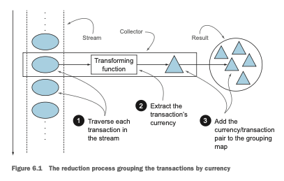
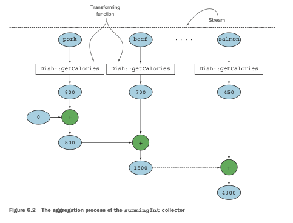
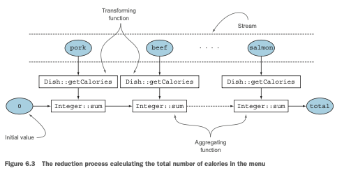
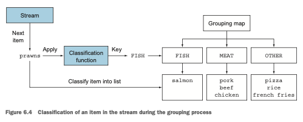
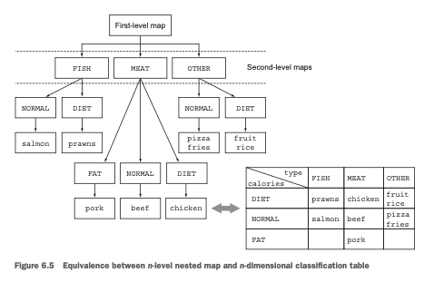
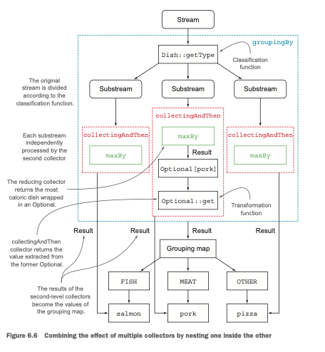
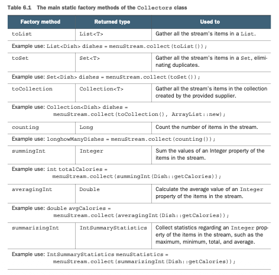
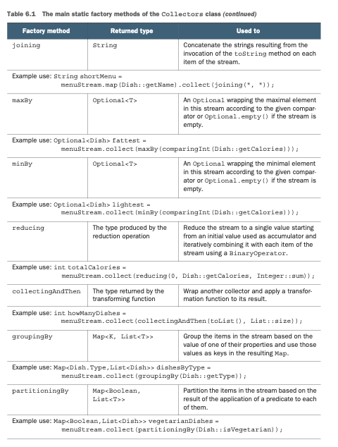
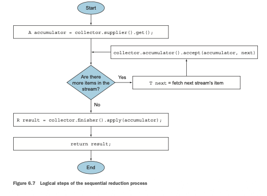
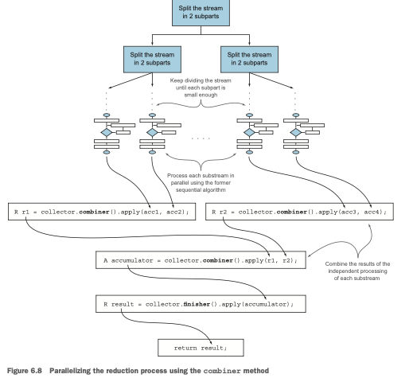

# Capitulo 6

# Recopilando datos con streams

### Este capítulo cubre
- Creación y uso de un collector con la clase Collectors
- Reducción de streams de datos a un único valor
- Summarización como un caso especial de reducción
- Agrupación y partición de datos
- Desarrollo de tus propios collectors personalizados

Aprendiste en el capítulo anterior que los streams te ayudan a procesar colecciones con operaciones 
similares a las de bases de datos. Puedes ver los streams de Java 8 como iteradores perezosos 
sofisticados de conjuntos de datos. Soportan dos tipos de operaciones: operaciones intermedias como 
filter o map y operaciones terminales como count, findFirst, forEach y reduce. Las operaciones 
intermedias pueden encadenarse para convertir un stream en otro stream. Estas operaciones no consumen
del stream; su propósito es configurar un canal de streams. Por el contrario, las operaciones 
terminales sí consumen de un stream para producir un resultado final (por ejemplo, retornando el 
elemento más grande en un stream). A menudo pueden acortar los cálculos optimizando el canal de un 
stream.
Ya usamos la operación terminal collect en streams en los capítulos 4 y 5, pero la empleamos 
principalmente para combinar todos los elementos de un stream en una List. En este capítulo, 
descubrirás que collect es una operación de reducción, como reduce, que toma como argumento varias 
recetas para acumular los elementos de un stream en un resultado resumido. Estas recetas están 
definidas por una nueva interfaz Collector, por lo que es importante distinguir entre Collection, 
Collector y collect.
Aquí hay algunos ejemplos de consultas de lo que podrás hacer usando collect y collectors:

- Agrupar una lista de transacciones por moneda para obtener la suma de los valores de todas las 
transacciones con esa moneda (retornando un Map<Currency, Integer>)
- Particionar una lista de transacciones en dos grupos: caras y no caras (retornando un Map<Boolean,
List<Transaction>>)
- Crear agrupaciones multinivel, como agrupar transacciones por ciudades y luego categorizar 
adicionalmente por si son caras o no (retornando un Map<String, Map<Boolean, List<Transaction>>>)

¿Emocionado? Genial. Empecemos explorando un ejemplo que se beneficia de los collectors.
Imagina un escenario donde tienes una List de Transactions y quieres agruparlas según su moneda 
nominal. Antes de Java 8, incluso un caso de uso simple como este es complicado de implementar, como
se muestra en el siguiente listado.

Listado 6.1 Agrupación de transacciones por moneda en estilo imperativo:
```java
//Crea el Map donde se acumularán las transacciones agrupadas.
Map<Currency, List<Transaction>> transactionsByCurrencies = new HashMap<>();
for (Transaction transaction : transactions){ //Itera la List de Transactions.
    Currency currency = transaction.getCurrency(); //Extrae la moneda de la Transaction.
    List<Transaction> transactionsForCurrency = transactionsByCurrencies.get(currency);
    //Si no hay una entrada en el Map de agrupación para esta moneda, la crea.
    if(transactionsForCurrency == null){
        transactionsForCurrency = new ArrayList<>();
        transactionsByCurrencies.put(currency, transactionsForCurrency);
    }
    //Agrega la Transaction actualmente recorrida a la List de Transactions con la misma moneda.
    transactionsForCurrency.add(transaction); //
}
```
Si eres un desarrollador Java experimentado, probablemente te sientas cómodo escribiendo algo así, 
pero tienes que admitir que es mucho código para una tarea tan simple. Aún peor, ¡esto es 
probablemente más difícil de leer que de escribir! El propósito del código no es inmediatamente 
evidente a primera vista, aunque puede expresarse de manera sencilla en lenguaje común: "Agrupar una
lista de transacciones por su moneda." Como aprenderás en este capítulo, puedes lograr exactamente 
el mismo resultado con una sola declaración usando un parámetro `Collector` más general para el método
`collect` en stream en lugar del caso especial `toList` usado en el capítulo anterior:
```java
Map<Currency, List<Transaction>> transactionsByCurrencies =
transactions.stream().collect(groupingBy(Transaction::getCurrency));
```
La comparación es bastante vergonzosa, ¿no es así?

## 6.1 Collectors en pocas palabras
El ejemplo anterior muestra claramente una de las principales ventajas de la programación de estilo
funcional sobre un enfoque imperativo: tienes que formular el resultado que quieres obtener, el "qué",
y no los pasos realizados para obtenerlo, el "cómo". En el ejemplo anterior, el argumento pasado al 
método `collect` es una implementación de la interfaz `Collector`, que es una receta para cómo construir
un resumen de los elementos en el stream. En el capítulo anterior, la receta `toList` decía "Hacer una
lista de cada elemento en orden." En este ejemplo, la receta `groupingBy` dice "Hacer un Map cuyas 
claves son categorías (de moneda) y cuyos valores son una lista de elementos en esas categorías."
La diferencia entre las versiones imperativa y funcional de este ejemplo es aún más pronunciada si 
realizas agrupaciones multinivel: en ese caso el código imperativo se vuelve rápidamente más difícil
de leer, mantener y modificar debido al número de bucles y condiciones profundamente anidados 
requeridos. En comparación, la versión de estilo funcional, como descubrirás en la sección 6.3, puede
mejorarse fácilmente con un `collector` adicional.

### 6.1.1 Collectors como reducciones avanzadas
Esta última observación plantea otro beneficio típico de una API funcional bien diseñada: su mayor 
grado de componibilidad y reutilización. Los `collectors` son extremadamente útiles, porque proporcionan
una forma concisa pero flexible de definir los criterios que `collect` usa para producir la colección 
resultante. Más específicamente, invocar el método `collect` en un stream desencadena una operación de
reducción `(parametrizada por un Collector)` sobre los elementos del stream en sí. Esta operación de 
reducción, ilustrada en la figura 6.1, hace por ti internamente lo que tenías que codificar 
imperativamente en el listado 6.1. Recorre cada elemento del stream y permite que el `Collector` los 
procese.
Típicamente, el `Collector` aplica una función de transformación al elemento. Con bastante frecuencia 
esta es la transformación identidad, que no tiene ningún efecto `(por ejemplo, como en toList)`. La 
función luego acumula el resultado en una estructura de datos que forma la salida final de este 
proceso. Por ejemplo, en nuestro ejemplo de agrupación de transacciones mostrado anteriormente, la
función de transformación extrae la moneda de cada transacción, y posteriormente la transacción en 
sí se acumula en el Map resultante, usando la moneda como clave.
La implementación de los métodos de la interfaz `Collector` define cómo realizar una operación de 
reducción en un stream, como la de nuestro ejemplo de monedas. Investigaremos cómo crear `collectors` 
personalizados en las secciones 6.5 y 6.6. Pero la clase de utilidad `Collectors` proporciona muchos 
métodos de fábrica estáticos para crear convenientemente una instancia de los `collectors` más comunes
que están listos para usar. El `collector` más sencillo y frecuentemente usado es el método estático 
`toList`, que reúne todos los elementos de un stream en una List:
```java
List<Transaction> transactions =
transactionStream.collect(Collectors.toList());
```



### 6.1.2 Collectors predefinidos
En el resto de este capítulo, exploraremos principalmente las características de los `collectors` 
predefinidos, aquellos que pueden crearse a partir de los métodos de fábrica `(como groupingBy)` 
proporcionados por la clase `Collectors`. Estos ofrecen tres funcionalidades principales:
- Reducción y summarización de elementos del stream a un único valor
- Agrupación de elementos
- Partición de elementos

Comenzamos con `collectors` que te permiten reducir y resumir. Estos son útiles en una variedad de 
casos de uso, como encontrar el monto total de los valores transaccionados en la lista de 
transacciones del ejemplo anterior.
Luego verás cómo agrupar los elementos de un stream, generalizando el ejemplo anterior a múltiples 
niveles de agrupación o combinando diferentes `collectors` para aplicar operaciones de reducción 
adicionales en cada uno de los subgrupos resultantes. También describiremos la partición como un caso
especial de agrupación, usando un predicado (una función de un argumento que retorna un boolean) como
función de agrupación.
Al final de la sección 6.4 encontrarás una tabla que resume todos los `collectors` predefinidos 
explorados en este capítulo. Finalmente, en la sección 6.5 aprenderás más sobre la `interfaz Collector`
antes de explorar (en la sección 6.6) cómo puedes crear tus propios `collectors` personalizados para 
usar en los casos no cubiertos por los métodos de fábrica de la clase `Collectors`.

## 6.2 Reducción y summarización
Para ilustrar el rango de posibles instancias de collector que pueden crearse a partir de la clase de
fábrica Collectors, reutilizaremos el dominio que introdujimos en el capítulo anterior: ¡un menú que
consiste en una lista de deliciosos platos!
Como aprendiste, los collectors (los parámetros del método collect del stream) se usan típicamente en
casos donde es necesario reorganizar los elementos del stream en una colección. Pero de manera más 
general, pueden usarse cada vez que quieras combinar todos los elementos del stream en un único 
resultado. Este resultado puede ser de cualquier tipo, tan complejo como un mapa multinivel que 
representa un árbol o tan simple como un único entero, quizás representando la suma de todas las 
calorías en el menú. Veremos ambos tipos de resultados: enteros únicos en la sección 6.2.2 y 
agrupación multinivel en la sección 6.3.1.
Como primer ejemplo simple, contemos el número de platos en el menú, usando el collector retornado 
por el método de fábrica counting:
```java
long howManyDishes = menu.stream().collect(Collectors.counting());
```
Puedes escribir esto de manera mucho más directa como:
```java
long howManyDishes = menu.stream().count();
```
pero el collector counting puede ser útil cuando se usa en combinación con otros collectors, como 
demostraremos más adelante.
En el resto de este capítulo, asumiremos que has importado todos los métodos de fábrica estáticos de
la clase Collectors con:
```java
import static java.util.stream.Collectors.*;
```
para poder escribir `counting()` en lugar de `Collectors.counting()` y así sucesivamente.
Continuemos explorando collectors predefinidos simples viendo cómo puedes encontrar los valores máximos
y mínimos en un stream.

### 6.2.1 Búsqueda del máximo y mínimo en un stream de valores
Supón que quieres encontrar el plato con más calorías en el menú. Puedes usar dos collectors, 
`Collectors.maxBy` y `Collectors.minBy`, para calcular el valor máximo o mínimo en un stream. Estos 
dos collectors toman un Comparator como argumento para comparar los elementos en el stream. Aquí 
creas un Comparator que compara los platos según su contenido calórico y lo pasas a `Collectors.maxBy`:
```java
Comparator<Dish> dishCaloriesComparator = Comparator.comparingInt(Dish::getCalories);
Optional<Dish> mostCalorieDish = menu.stream()
        .collect(maxBy(dishCaloriesComparator));
```
Puede que te preguntes para qué sirve el `Optional<Dish>`. Para responder esto tenemos que hacernos la
pregunta: "¿Qué pasaría si el menú estuviera vacío?" ¡No hay ningún plato para retornar! Java 8 
introduce `Optional`, que es un contenedor que puede o no contener un valor. Aquí representa 
perfectamente la idea de que puede o no haber un plato retornado. Lo mencionamos brevemente en el 
capítulo 5 cuando encontraste el método `findAny`. No te preocupes por eso por ahora; dedicamos el 
capítulo 11 al estudio de `Optional<T>` y sus operaciones.
Otra operación de reducción común que retorna un único valor es sumar los valores de un campo numérico
de los objetos en un stream. Alternativamente, puede que quieras promediar los valores. Tales 
operaciones se llaman operaciones de summarización. Veamos cómo puedes expresarlas usando `collectors`.

### 6.2.2 Summarización
La clase `Collectors` proporciona un método de fábrica específico para sumar: `Collectors.summingInt`. 
Acepta una función que mapea un objeto al `int` que debe sumarse y retorna un `collector` que, cuando se
pasa al método `collect` habitual, realiza la summarización solicitada. Por ejemplo, puedes encontrar 
el número total de calorías en tu lista de menú con:
```java
int totalCalories = menu.stream().collect(summingInt(Dish::getCalories));
```
Aquí el proceso de recopilación procede como se ilustra en la figura 6.2. Mientras se recorre el 
stream, cada plato se mapea a su número de calorías, y ese número se agrega a un acumulador comenzando
desde un valor inicial (en este caso el valor es 0).
Los métodos `Collectors.summingLong y Collectors.summingDouble` se comportan exactamente de la misma 
manera y pueden usarse donde el campo a sumar es respectivamente un `long o un double.`
Pero hay más en la summarización que la simple suma. Un `Collectors.averagingInt`, junto con sus 
contrapartes `averagingLong y averagingDouble`, también está disponible para calcular el promedio del 
mismo conjunto de valores numéricos:
```java
double avgCalories = menu.stream().collect(averagingInt(Dish::getCalories));
```
Hasta ahora, has visto cómo usar `collectors` para contar los elementos en un stream, encontrar los 
valores máximos y mínimos de una propiedad numérica de esos elementos, y calcular su suma y promedio.
Con bastante frecuencia, sin embargo, puede que quieras recuperar dos o más de estos resultados, y 
posiblemente te gustaría hacerlo en una sola operación. En este caso, puedes usar el `collector` 
retornado por el método de fábrica `summarizingInt`.
Por ejemplo, puedes contar los elementos en el menú y obtener la suma, el promedio, el máximo y el 
mínimo de las calorías contenidas en cada plato con una única operación de summarización:
```java
IntSummaryStatistics menuStatistics = menu.stream()
        .collect(summarizingInt(Dish::getCalories));
```



Este `collector` reúne toda esa información en una clase llamada `IntSummaryStatistics` que proporciona 
convenientes métodos `getter` para acceder a los resultados. Imprimir el objeto `menuStatistic` produce 
la siguiente salida:
```terminaloutput
IntSummaryStatistics{count=9, sum=4300, min=120,
average=477.777778, max=800}
```
Como de costumbre, hay correspondientes métodos de fábrica `summarizingLong y summarizingDouble` con 
los tipos asociados `LongSummaryStatistics y DoubleSummaryStatistics`. Estos se usan cuando la propiedad
a recopilar es un tipo primitivo `long o double`.

### 6.2.3 Unión de Strings
El `collector` retornado por el método de fábrica `joining` concatena en un único `string` todos los 
strings resultantes de invocar el método `toString` en cada objeto del stream. Esto significa que 
puedes concatenar los nombres de todos los platos en el menú de la siguiente manera:
```java
String shortMenu = menu.stream().map(Dish::getName).collect(joining());
```
Ten en cuenta que joining hace uso internamente de un `StringBuilder` para agregar los strings generados
en uno. También ten en cuenta que si la clase Dish tuviera un método toString que retornara el nombre
del plato, obtendrías el mismo resultado sin necesidad de mapear sobre el stream original con una 
función que extraiga el nombre de cada plato:
```java
String shortMenu = menu.stream().collect(joining());
```
Ambos producen el string:
```terminaloutput
porkbeefchickenfrench friesriceseason fruitpizzaprawnssalmon
```
que es difícil de leer. Afortunadamente, el método de fábrica `joining` está sobrecargado, con una de
sus variantes sobrecargadas tomando un string usado para delimitar dos elementos consecutivos, por 
lo que puedes obtener una lista de nombres de platos separados por comas con:
```java
String shortMenu = menu.stream().map(Dish::getName).collect(joining(", "));
```
que, como se esperaba, generaráq:
```terminaloutput
pork, beef, chicken, french fries, rice, season fruit, pizza, prawns, salmon
```
Hasta ahora, hemos explorado varios `collectors` que reducen un stream a un único valor. En la 
siguiente sección, demostraremos cómo todos los procesos de reducción de esta forma son casos 
especiales del collector de reducción más general proporcionado por el método de fábrica 
`Collectors.reducing`.

### 6.2.4 Summarización generalizada con reducción
Todos los `collectors` que hemos analizado hasta ahora son, en realidad, solo especializaciones 
convenientes de un proceso de reducción que puede definirse usando el método de fábrica reducing. 
El método de fábrica `Collectors.reducing` es una generalización de todos ellos. Los casos especiales
analizados anteriormente se proporcionan posiblemente solo por conveniencia para el programador. 
`(¡Pero recuerda que la conveniencia y la legibilidad del programador son de suma importancia!)`
Por ejemplo, es posible calcular el total de calorías en tu menú con un `collector` creado a partir 
del método `reducing` de la siguiente manera:
```java
int totalCalories = menu.stream()
        .collect(reducing(0, Dish::getCalories, (i, j) -> i + j));
```
Toma tres argumentos:
- El primer argumento es el valor inicial de la operación de reducción y también será el valor retornado
en el caso de un stream sin elementos, por lo que claramente 0 es el valor apropiado en el caso de 
una suma numérica.
- El segundo argumento es la misma función que usaste en la sección 6.2.2 para transformar un plato en
un int que representa su contenido calórico.
- El tercer argumento es un BinaryOperator que agrega dos elementos en un único valor del mismo tipo.
Aquí, suma dos ints.

De manera similar, podrías encontrar el plato con más calorías usando la versión de un argumento de 
reducing de la siguiente manera:
```java
Optional<Dish> mostCalorieDish = menu.stream()
        .collect(reducing((d1, d2) -> d1.getCalories() > d2.getCalories() ? d1 : d2));
```
Puedes pensar en el `collector` creado con el método de fábrica `reducing` de un argumento como un caso 
particular del método de tres argumentos, que usa el primer elemento en el stream como punto de 
partida y una función identidad (una función que retorna su argumento de entrada tal cual) como 
función de transformación. Esto también implica que el `collector reducing` de un argumento no tendrá 
ningún punto de partida cuando se pase al método `collect` de un stream vacío y, como explicamos en la
sección 6.2.1, por esta razón retorna un objeto `Optional<Dish>`.

### Collect vs. reduce
Hemos analizado muchas reducciones en el capítulo anterior y en este. Puede que te preguntes cuáles
son las diferencias entre los métodos `collect` y reduce de la interfaz de stream, porque a menudo 
puedes obtener los mismos resultados usando cualquiera de los métodos.
Por ejemplo, puedes lograr lo que hace el `Collector toList` usando el método reduce de la siguiente 
manera:
```java
Stream<Integer> stream = Arrays.asList(1, 2, 3, 4, 5, 6).stream();
List<Integer> numbers = stream.reduce(new ArrayList<Integer>(), 
        (List<Integer> l, Integer e) -> {l.add(e);
        return l; },
        (List<Integer> l1, List<Integer> l2) -> {l1.addAll(l2);
        return l1; });
```
Esta solución tiene dos problemas: uno semántico y uno práctico. El problema semántico radica en el 
hecho de que el método reduce está diseñado para combinar dos valores y producir uno nuevo; es una 
reducción inmutable. Por el contrario, el método collect está diseñado para mutar un contenedor para
acumular el resultado que se supone debe producir.
Esto significa que el fragmento de código anterior está haciendo un mal uso del método reduce, 
porque está mutando en el lugar la List usada como acumulador. Como verás con más detalle en el 
próximo capítulo, usar el método reduce con la semántica incorrecta también es la causa de un 
problema práctico: este proceso de reducción no puede funcionar en paralelo, porque la modificación 
concurrente de la misma estructura de datos operada por múltiples hilos puede corromper la List en 
sí. En este caso, si quieres seguridad en hilos, necesitarás asignar una nueva List cada vez, lo que
perjudicaría el rendimiento por la asignación de objetos. Esta es la razón principal por la que el 
método collect es útil para expresar reducciones que trabajan en un contenedor mutable pero 
crucialmente de una manera compatible con el paralelismo, como aprenderás más adelante en el capítulo.

### Flexibilidad del framework de colecciones: Realizando la misma operacion de diferentes maneras
Puedes simplificar aún más el ejemplo de suma anterior usando el collector reducing al usar una 
referencia al método sum de la clase Integer en lugar de la expresión lambda que usaste para 
codificar la misma operación. Esto resulta en lo siguiente:
```java
int totalCalories = menu.stream().collect(reducing(0, //valor inicial
        Dish::getCalories, //funcion de transformacion
        Integer::sum)); //agregando funcion
```
Lógicamente, esta operación de reducción procede como se muestra en la figura 6.3, donde un 
acumulador, inicializado con un valor inicial, se combina iterativamente usando una función de 
agregación, con el resultado de la aplicación de la función de transformación en cada elemento del 
stream.



El `collector counting` que mencionamos al comienzo de la sección 6.2 está, en realidad, implementado
de manera similar usando el método de fábrica `reducing` de tres argumentos. Transforma cada elemento 
en el stream en un objeto de tipo Long con valor 1 y luego suma todos estos unos. Se implementa de 
la siguiente manera:
```java
public static <T> Collector<T, ?, Long> counting() {
    return reducing(0L, e -> 1L, Long::sum);
}
```
### Uso del comodín genérico ?
En el fragmento de código que acabas de ver, probablemente notaste el comodín ?, usado como el 
segundo tipo genérico en la firma del `collector` retornado por el método de fábrica `counting`. Ya 
deberías estar familiarizado con esta notación, especialmente si usas el Framework de Colecciones de
Java con bastante frecuencia. Pero aquí solo significa que el tipo del acumulador del `collector` es 
desconocido, o equivalentemente el acumulador en sí puede ser de cualquier tipo. Lo usamos aquí para
reportar exactamente la firma del método tal como fue definida originalmente en la clase `Collectors`,
pero en el resto del capítulo, evitamos cualquier notación de comodín para mantener la discusión lo
más simple posible.

Ya observamos en el capítulo 5 que hay otra forma de realizar la misma operación sin usar un 
collector, mapeando el stream de platos al número de calorías de cada plato y luego reduciendo este 
stream resultante con la misma referencia a método usada en la versión anterior:
```java
int totalCalories = menu.stream()
        .map(Dish::getCalories)
        .reduce(Integer::sum)
        .get();
```
Ten en cuenta que, como cualquier operación reduce de un argumento en un stream, la invocación 
`reduce(Integer::sum)` no retorna un `int` sino un `Optional<Integer>` para gestionar el caso de una 
operación de reducción sobre un stream vacío de manera segura frente a nulos. Aquí extraes el valor 
dentro del objeto `Optional` usando su método `get()`. Ten en cuenta que en este caso usar el método get 
es seguro solo porque estás seguro de que el stream de platos no está vacío. En general, como 
aprenderás en el capítulo 10, es más seguro desempaquetar el valor eventualmente contenido en un 
`Optional` usando un método que también te permita proporcionar un valor predeterminado, como `orElse 
u orElseGet`. Finalmente, y de manera aún más concisa, puedes lograr el mismo resultado mapeando el
stream a un `IntStream` y luego invocando el método `sum()` sobre él:
```java
int totalCalories = menu.stream()
        .mapToInt(Dish::getCalories)
        .sum();
```
### Elegir la mejor solucion para tu situacion:
Una vez más, esto demuestra cómo la programación funcional en general (y la nueva API basada en 
principios de estilo funcional agregada al framework de Colecciones en Java 8 en particular) a 
menudo proporciona múltiples formas de realizar la misma operación. Este ejemplo también muestra que
los `collectors` son algo más complejos de usar que los métodos directamente disponibles en la interfaz
Streams, pero a cambio ofrecen niveles más altos de abstracción y generalización y son más 
reutilizables y personalizables.
Nuestra sugerencia es explorar el mayor número posible de soluciones al problema en cuestión, pero 
siempre elegir la más especializada que sea lo suficientemente general para resolverlo. Esta suele 
ser la mejor decisión tanto por razones de legibilidad como de rendimiento. Por ejemplo, para 
calcular el total de calorías en nuestro menú, preferiríamos la última solución `(usando IntStream)` 
porque es la más concisa y probablemente también la más legible.

Al mismo tiempo, también es la que mejor rendimiento tiene, porque `IntStream` nos permite evitar 
todas las operaciones de `auto-unboxing`, o conversiones implícitas de `Integer a int`, que son inútiles
en este caso.
A continuación, pon a prueba tu comprensión de cómo `reducing` puede usarse como una generalización de
otros `collectors` trabajando en el ejercicio del quiz 6.1.

### Quiz 6.1: Unión de strings con reducing
¿Cuál de las siguientes declaraciones usando el collector reducing son reemplazos válidos para este 
collector joining (como se usa en la sección 6.2.3)?
```java
String shortMenu = menu.stream().map(Dish::getName).collect(joining());
// 1.
String shortMenu = menu.stream().map(Dish::getName)
        .collect( reducing( (s1, s2) -> s1 + s2 ) ).get();
//2.
String shortMenu = menu.stream()
        .collect(reducing((d1, d2) -> d1.getName() + d2.getName()))
        .get();
//3.
String shortMenu = menu.stream()
        .collect(reducing("", Dish::getName, (s1, s2) -> s1 + s2));
```
### Respuesta:
Las declaraciones 1 y 3 son válidas, mientras que 2 no compila.
1. Esta convierte cada plato en su nombre, como lo hace la declaración original usando el `collector 
joining`, y luego reduce el stream resultante de strings usando un String como acumulador y agregando
los nombres de los platos uno por uno.
2. Esta no compila porque el único argumento que reducing acepta es un `BinaryOperator<T>` que es un 
`BiFunction<T,T,T>`. Esto significa que quiere una función que toma dos argumentos y retorna un valor
del mismo tipo, pero la expresión lambda usada allí tiene dos platos como argumentos pero retorna un
`string`.
3. Esta inicia el proceso de reducción con un string vacío como acumulador, y al recorrer el stream 
de platos, convierte cada plato a su nombre y agrega este nombre al acumulador. Ten en cuenta que, 
como mencionamos, `reducing` no necesita los tres argumentos para retornar un `Optional` porque en el 
caso de un stream vacío puede retornar un valor más significativo, que es el string vacío usado como
valor inicial del acumulador.

Ten en cuenta que aunque las declaraciones 1 y 3 son reemplazos válidos para el `collector joining`, 
se han usado aquí para demostrar cómo el `reducing` puede verse, al menos conceptualmente, como una 
generalización de todos los demás `collectors` analizados en este capítulo. Sin embargo, para todos 
los propósitos prácticos siempre sugerimos usar el `collector joining` tanto por razones de 
legibilidad como de rendimiento.

## 6.3 Agrupación
Una operación común en bases de datos es agrupar elementos en un conjunto, basándose en una o más
propiedades. Como viste en el ejemplo anterior de agrupación de transacciones por moneda, esta 
operación puede ser complicada, verbosa y propensa a errores cuando se implementa con un estilo 
imperativo. Pero puede traducirse fácilmente en una única declaración legible reescribiéndola en un 
estilo más funcional como lo fomenta Java 8. Como segundo ejemplo de cómo funciona esta 
característica, supón que quieres clasificar los platos en el menú según su tipo, poniendo los que 
contienen carne en un grupo, los que tienen pescado en otro grupo y todos los demás en un tercer 
grupo. Puedes realizar fácilmente esta tarea usando un collector retornado por el método de fábrica 
`Collectors.groupingBy`, de la siguiente manera:
```java
Map<Dish.Type, List<Dish>> dishesByType = menu.stream()
        .collect(groupingBy(Dish::getType));
```
Esto resultará en el siguiente Map:
```terminaloutput
{FISH=[prawns, salmon], OTHER=[french fries, rice, season fruit, pizza],
MEAT=[pork, beef, chicken]}
```
Aquí, pasas al método `groupingBy` una Function (expresada en forma de referencia a método) que extrae
el `Dish.Type` correspondiente para cada Dish en el stream. Llamamos a esta Function una función de 
clasificación específicamente porque se usa para clasificar los elementos del stream en diferentes 
grupos. El resultado de esta operación de agrupación, mostrado en la figura 6.4, es un Map que tiene
como clave del mapa el valor retornado por la función de clasificación y como valor del mapa 
correspondiente una lista de todos los elementos en el stream que tienen ese valor clasificado. En 
el ejemplo de clasificación del menú, una clave es el tipo de plato, y su valor es una lista que 
contiene todos los platos de ese tipo.



Pero no siempre es posible usar una referencia a método como función de clasificación, porque puede 
que desees clasificar usando algo más complejo que un simple acceso a propiedades. Por ejemplo, 
podrías decidir clasificar como "diet" todos los platos con 400 calorías o menos, establecer como 
"normal" los platos que tienen entre 400 y 700 calorías, y establecer como "fat" los que tienen más
de 700 calorías. Debido a que el autor de la clase Dish no proporcionó tal operación como método, 
no puedes usar una referencia a método en este caso, pero puedes expresar esta lógica en una 
expresión lambda:
```java
public enum CaloricLevel { DIET, NORMAL, FAT }
Map<CaloricLevel, List<Dish>> dishesByCaloricLevel = menu.stream().collect(
    groupingBy(dish -> {
        if (dish.getCalories() <= 400) return CaloricLevel.DIET;
        else if (dish.getCalories() <= 700) return CaloricLevel.NORMAL;
        else return CaloricLevel.FAT;
    } ));
```
Ahora has visto cómo agrupar los platos en el menú, tanto por su tipo como por calorías, pero 
también podría ser bastante común que necesites manipular aún más los resultados de la agrupación 
original, y en la siguiente sección mostraremos cómo lograr esto.

### 6.3.1 Manipulación de elementos agrupados
Con frecuencia, después de realizar una operación de agrupación, puede que necesites manipular los 
elementos en cada grupo resultante. Supón, por ejemplo, que quieres filtrar solo los platos calóricos,
digamos los que tienen más de 500 calorías. Puede que argumentes que en este caso podrías aplicar 
este predicado de filtrado antes de la agrupación de la siguiente manera:
```java
Map<Dish.Type, List<Dish>> caloricDishesByType = menu.stream()
        .filter(dish -> dish.getCalories() > 500)
        .collect(groupingBy(Dish::getType));
```
Esta solución funciona pero tiene un inconveniente posiblemente relevante. Si intentas usarla en los
platos de nuestro menú, obtendrás un Map como el siguiente:
```terminaloutput
{OTHER=[french fries, pizza], MEAT=[pork, beef]}
```
¿Ves el problema ahí? Debido a que no hay ningún plato de tipo FISH que satisfaga nuestro predicado 
de filtrado, esa clave desapareció completamente del mapa resultante. Para solucionar este problema 
la clase `Collectors` sobrecarga el método de fábrica `groupingBy`, con una variante que también toma un
segundo argumento de tipo `Collector` junto con la función de clasificación habitual. De esta manera, 
es posible mover el predicado de filtrado dentro de este segundo `Collector`, de la siguiente manera:
```java
Map<Dish.Type, List<Dish>> caloricDishesByType = menu.stream()
        .collect(groupingBy(Dish::getType, filtering(dish -> dish.getCalories() > 500, toList())));
```
El método `filtering` es otro método de fábrica estático de la clase Collectors que acepta un 
`Predicate` para filtrar los elementos en cada grupo y un `Collector` adicional que se usa para 
reagrupar los elementos filtrados. De esta manera, el Map resultante también mantendrá una entrada 
para el tipo FISH aunque mapee una List vacía:
```terminaloutput
{OTHER=[french fries, pizza], MEAT=[pork, beef], FISH=[]}
```
Otra forma aún más común en la que podría ser útil manipular los elementos agrupados es 
transformándolos a través de una función de mapeo. Para este propósito, de manera similar a lo que 
has visto para el Collector filtering, la clase Collectors proporciona otro Collector a través del 
método mapping que acepta una función de mapeo y otro Collector usado para recopilar los elementos 
resultantes de la aplicación de esa función a cada uno de ellos. Usándolo puedes, por ejemplo, 
convertir cada Dish en los grupos en sus respectivos nombres de esta manera:
```java
Map<Dish.Type, List<String>> dishNamesByType = menu.stream()
        .collect(groupingBy(Dish::getType, mapping(Dish::getName, toList())));
```
Ten en cuenta que en este caso cada grupo en el Map resultante es una List de Strings en lugar de 
una de Dishes como era en los ejemplos anteriores. También podrías usar un tercer `Collector` en 
combinación con el `groupingBy` para realizar una transformación `flatMap` en lugar de un simple map. 
Para demostrar cómo funciona esto, supongamos que tenemos un Map que asocia a cada Dish una lista 
de etiquetas de la siguiente manera:
```java
Map<String, List<String>> dishTags = new HashMap<>();
dishTags.put("pork", asList("greasy", "salty"));
dishTags.put("beef", asList("salty", "roasted"));
dishTags.put("chicken", asList("fried", "crisp"));
dishTags.put("french fries", asList("greasy", "fried"));
dishTags.put("rice", asList("light", "natural"));
dishTags.put("season fruit", asList("fresh", "natural"));
dishTags.put("pizza", asList("tasty", "salty"));
dishTags.put("prawns", asList("tasty", "roasted"));
dishTags.put("salmon", asList("delicious", "fresh"));
```
En caso de que necesites extraer estas etiquetas para cada grupo de tipo de platos, puedes lograrlo 
fácilmente usando el `Collector flatMapping`:
```java
Map<Dish.Type, Set<String>> dishNamesByType = menu.stream()
        .collect(groupingBy(Dish::getType, flatMapping(dish -> dishTags.get( dish.getName() )
                        .stream(), toSet())));
```
Aquí para cada Dish estamos obteniendo una List de etiquetas. Por lo tanto, de manera análoga a lo 
que ya hemos visto en el capítulo anterior, necesitamos realizar un `flatMap` para aplanar la lista de
dos niveles resultante en una sola. También ten en cuenta que esta vez recopilamos el resultado de 
las operaciones `flatMapping` ejecutadas en cada grupo en un Set en lugar de usar una List como hicimos
antes, con el fin de evitar repeticiones de las mismas etiquetas asociadas a más de un Dish del mismo
tipo. El Map resultante de esta operación es entonces el siguiente:
```terminaloutput
{MEAT=[salty, greasy, roasted, fried, crisp], FISH=[roasted, tasty, fresh,
delicious], OTHER=[salty, greasy, natural, light, tasty, fresh, fried]}
```
Hasta este punto solo hemos usado un único criterio para agrupar los platos del menú, por ejemplo 
por su tipo o por calorías, pero ¿qué pasa si quieres usar más de un criterio al mismo tiempo? La 
agrupación es poderosa porque se compone eficazmente. Veamos cómo hacer esto.

### 6.3.2 Agrupación multinivel
El método de fábrica `Collectors.groupingBy` de dos argumentos que usamos en una sección anterior para
manipular los elementos en los grupos resultantes de la operación de agrupación también puede usarse
para realizar una agrupación de dos niveles. Para lograr esto puedes pasarle un segundo `groupingBy` 
interno al `groupingBy` externo, definiendo un criterio de segundo nivel para clasificar los elementos
del stream, como se muestra en el siguiente listado.

Listado 6.2 Agrupación multinivel:
```java
Map<Dish.Type, Map<CaloricLevel, List<Dish>>> dishesByTypeCaloricLevel =
menu.stream().collect(
groupingBy(Dish::getType, //Función de clasificación de primer nivel.
        groupingBy(dish -> { //Función de clasificación de segundo nivel.
            if (dish.getCalories() <= 400) return CaloricLevel.DIET;
            else if (dish.getCalories() <= 700) return CaloricLevel.NORMAL;
            else return CaloricLevel.FAT;
        })
    )
);
```
El resultado de esta agrupación de dos niveles es un Map de dos niveles como el siguiente:
```terminaloutput
{MEAT={DIET=[chicken], NORMAL=[beef], FAT=[pork]},
FISH={DIET=[prawns], NORMAL=[salmon]},
OTHER={DIET=[rice, seasonal fruit], NORMAL=[french fries, pizza]}}
```
Aquí el Map externo tiene como claves los valores generados por la función de clasificación de primer
nivel: fish, meat, other. Los valores de este Map son a su vez otros Maps, que tienen como claves 
los valores generados por la función de clasificación de segundo nivel: normal, diet o fat. 
Finalmente, los Maps de segundo nivel tienen como valores la List de los elementos en el stream que 
retornan los valores de clave de primer y segundo nivel correspondientes cuando se aplican 
respectivamente a las funciones de clasificación primera y segunda: salmon, pizza, y así 
sucesivamente. Esta operación de agrupación multinivel puede extenderse a cualquier número de 
niveles, y una agrupación de n niveles tiene como resultado un Map de n niveles, modelando una 
estructura de árbol de n niveles.
La figura 6.5 muestra cómo esta estructura es también equivalente a una tabla n-dimensional, 
destacando el propósito de clasificación de la operación de agrupación.



En general, ayuda pensar que `groupingBy` funciona en términos de "categorías". El primer `groupingBy`
crea una categoría para cada clave. Luego recopilas los elementos en cada categoría con el `collector`
descendente y así sucesivamente para lograr agrupaciones de n niveles.

### 6.3.3 Recopilación de datos en subgrupos
En la sección anterior, viste que es posible pasar un segundo `collector groupingBy` al externo para
lograr una agrupación multinivel. Pero de manera más general, el segundo collector pasado al primer 
`groupingBy` puede ser cualquier tipo de `collector`, no solo otro `groupingBy`. Por ejemplo, es 
posible contar el número de Dishes en el menú para cada tipo, pasando el `collector counting` como 
segundo argumento al `collector groupingBy`:
```java
Map<Dish.Type, Long> typesCount = menu.stream()
        .collect(groupingBy(Dish::getType, counting()));
```
El resultado es el siguiente Map:
```terminaloutput
{MEAT=3, FISH=2, OTHER=4}
```
También ten en cuenta que el `groupingBy(f)` regular de un argumento, donde f es la función de 
clasificación, es en realidad una forma abreviada de `groupingBy(f, toList())`.
Para dar otro ejemplo, podrías reutilizar el `collector` que ya usaste para encontrar el plato con más
calorías en el menú para lograr un resultado similar, pero ahora clasificado por el tipo de plato:
```java
Map<Dish.Type, Optional<Dish>> mostCaloricByType = menu.stream()
        .collect(groupingBy(Dish::getType, maxBy(comparingInt(Dish::getCalories))));
```
El resultado de esta agrupación es entonces claramente un Map, que tiene como claves los tipos 
disponibles de Dishes y como valores el `Optional<Dish>`, envolviendo el Dish con más calorías 
correspondiente para un tipo dado:
```terminaloutput
{FISH=Optional[salmon], OTHER=Optional[pizza], MEAT=Optional[pork]}
```
`NOTA` Los valores en este Map son `Optionals` porque este es el tipo resultante del `collector` generado
por el método de fábrica `maxBy`, pero en realidad si no hay ningún Dish en el menú para un tipo dado,
ese tipo no tendrá `Optional.empty()` como valor; no estará presente en absoluto como clave en el Map.
El `collector groupingBy` agrega perezosamente una nueva clave en el Map de agrupación solo la primera
vez que encuentra un elemento en el stream, produciendo esa clave al aplicar en él los criterios de 
agrupación que se están usando. Esto significa que en este caso, el envoltorio `Optional` no es útil,
porque no está modelando un valor que podría estar posiblemente ausente sino que está allí 
incidentalmente, solo porque este es el tipo retornado por el `collector reducing`.

`ADAPTACIÓN DEL RESULTADO DEL COLLECTOR A UN TIPO DIFERENTE`

Debido a que los `Optionals` que envuelven todos los valores en el Map resultante de la última 
operación de agrupación no son útiles en este caso, puede que quieras deshacerte de ellos. Para 
lograr esto, o de manera más general, para adaptar el resultado retornado por un `collector` a un 
tipo diferente, podrías usar el `collector` retornado por el método de fábrica 
`Collectors.collectingAndThen`, como se muestra en el siguiente listado.

Listado 6.3 Búsqueda del plato con más calorías en cada subgrupo:
```java
Map<Dish.Type, Dish> mostCaloricByType = menu.stream()
        .collect(groupingBy(Dish::getType, //Función de clasificación.
        collectingAndThen(maxBy(comparingInt(Dish::getCalories)), //Collector envuelto.
                Optional::get))); //Función de transformación.
```
Este método de fábrica toma dos argumentos: el `collector` que se va a adaptar y una función de 
transformación, y retorna otro `collector`. Este `collector` adicional actúa como un envoltorio para
el anterior y mapea el valor que retorna usando la función de transformación como último paso de la
operación `collect`. En este caso, el `collector` envuelto es el creado con `maxBy`, y la función de
transformación, `Optional::get`, extrae el valor contenido en el `Optional` retornado. Como hemos 
dicho, aquí esto es seguro porque el `collector reducing` nunca retornará `Optional.empty()`. El
resultado es el siguiente Map:
```terminaloutput
{FISH=salmon, OTHER=pizza, MEAT=pork}
```


Es bastante común usar múltiples `collectors` anidados, y al principio la forma en que interactúan 
puede no siempre ser obvia. La figura 6.6 te ayuda a visualizar cómo trabajan juntos. Desde la capa 
más externa y moviéndose hacia adentro, ten en cuenta lo siguiente:

- Los collectors están representados por las líneas discontinuas, por lo que groupingBy es el más 
externo y agrupa el stream del menú en tres substreams según los diferentes tipos de platos.
- El `collector groupingBy` envuelve el `collector collectingAndThen`, por lo que cada substream 
resultante de la operación de agrupación es reducido adicionalmente por este segundo `collector`.
- El `collector collectingAndThen` envuelve a su vez un tercer `collector`, el `maxBy`.
- La operación de reducción en los substreams es entonces realizada por el `collector reducing`, 
pero el `collector collectingAndThen` que lo contiene aplica la función de transformación 
`Optional::get` a su resultado.
- Los tres valores transformados, siendo los Dishes con más calorías para un tipo dado (resultantes 
de la ejecución de este proceso en cada uno de los tres substreams), serán los valores asociados con
las claves de clasificación respectivas, los tipos de Dishes, en el Map retornado por el `collector
groupingBy`.

`OTROS EJEMPLOS DE COLLECTORS USADOS EN CONJUNTO CON GROUPINGBY`

De manera más general, el collector pasado como segundo argumento al método de fábrica `groupingBy`
se usará para realizar una operación de reducción adicional en todos los elementos del stream 
clasificados en el mismo grupo. Por ejemplo, también podrías reutilizar el collector creado para 
sumar las calorías de todos los platos en el menú para obtener un resultado similar, pero esta vez 
para cada grupo de Dishes:
```java
Map<Dish.Type, Integer> totalCaloriesByType = menu.stream()
        .collect(groupingBy(Dish::getType, summingInt(Dish::getCalories)));
```
Otro `collector`, comúnmente usado en conjunto con `groupingBy`, es uno generado por el método 
mapping. Este método toma dos argumentos: una función que transforma los elementos en un stream y
un `collector` adicional que acumula los objetos resultantes de esta transformación. Su propósito es
adaptar un `collector` que acepta elementos de un tipo dado para que trabaje en objetos de un tipo 
diferente, aplicando una función de mapeo a cada elemento de entrada antes de acumularlos. Para ver 
un ejemplo práctico de uso de este `collector`, supón que quieres saber qué `CaloricLevels` están
disponibles en el menú para cada tipo de Dish. Podrías lograr este resultado combinando un `groupingBy`
y un `collector mapping`, de la siguiente manera:
```java
Map<Dish.Type, Set<CaloricLevel>> caloricLevelsByType = menu.stream()
        .collect(groupingBy(Dish::getType, mapping(dish -> {
            if (dish.getCalories() <= 400) return CaloricLevel.DIET;
            else if (dish.getCalories() <= 700) return CaloricLevel.NORMAL;
            else return CaloricLevel.FAT; },
        toSet() )));
```
Aquí la función de transformación pasada al método mapping mapea un Dish a su CaloricLevel, como has
visto antes. El stream resultante de CaloricLevels se pasa entonces a un `collector toSet`, análogo
al `toList`, pero acumulando los elementos de un stream en un Set en lugar de en una List, para 
mantener solo los valores distintos. Como en ejemplos anteriores, este `collector mapping` se usará 
entonces para recopilar los elementos en cada substream generado por la función de agrupación, 
permitiéndote obtener como resultado el siguiente Map:
```terminaloutput
{OTHER=[DIET, NORMAL], MEAT=[DIET, NORMAL, FAT], FISH=[DIET, NORMAL]}
```
A partir de esto puedes determinar fácilmente tus opciones. Si tienes ganas de pescado y estás a 
dieta, podrías encontrar fácilmente un plato; del mismo modo, si tienes hambre y quieres algo con 
muchas calorías, podrías satisfacer tu robusto apetito eligiendo algo de la sección de carnes del 
menú. Ten en cuenta que en el ejemplo anterior, no hay garantías sobre qué tipo de Set se retorna. 
Pero usando `toCollection`, puedes tener más control. Por ejemplo, puedes pedir un `HashSet` pasando
una referencia al constructor:
```java
Map<Dish.Type, Set<CaloricLevel>> caloricLevelsByType = menu.stream()
        .collect(groupingBy(Dish::getType, mapping(dish -> {
            if (dish.getCalories() <= 400) return CaloricLevel.DIET;
            else if (dish.getCalories() <= 700) return CaloricLevel.NORMAL;
            else return CaloricLevel.FAT; },
        toCollection(HashSet::new) )));
```

## 6.4 Partición
La partición es un caso especial de agrupación: tener un predicado llamado función de partición como
función de clasificación. El hecho de que la función de partición retorne un boolean significa que 
el Map de agrupación resultante tendrá un Boolean como tipo de clave, y por lo tanto, puede haber 
como máximo dos grupos diferentes: uno para true y uno para false. Por ejemplo, si eres vegetariano 
o has invitado a un amigo vegetariano a cenar contigo, puede que te interese particionar el menú en
platos vegetarianos y no vegetarianos:
```java
Map<Boolean, List<Dish>> partitionedMenu =
menu.stream().collect(partitioningBy(Dish::isVegetarian));//Función de partición.
```
Esto retornará el siguiente Map:
```terminaloutput
{false=[pork, beef, chicken, prawns, salmon],
true=[french fries, rice, season fruit, pizza]}
```
Así podrías recuperar todos los platos vegetarianos obteniendo del Map el valor indexado con la 
clave true:
```java
List<Dish> vegetarianDishes = partitionedMenu.get(true);
```
Ten en cuenta que podrías lograr el mismo resultado filtrando el stream creado a partir de la List 
del menú con el mismo predicado usado para particionar y luego recopilando el resultado en una List 
adicional:
```java
List<Dish> vegetarianDishes = menu.stream()
        .filter(Dish::isVegetarian).collect(toList());
```
### 6.4.1 Ventajas de la partición
La partición tiene la ventaja de mantener ambas listas de los elementos del stream, para los cuales 
la aplicación de la función de partición retorna true o false. En el ejemplo anterior, puedes 
obtener la List de los Dishes no vegetarianos accediendo al valor de la clave false en el Map 
`partitionedMenu`, usando dos operaciones de filtrado separadas: una con el predicado y otra con su 
negación. Además, como ya viste para la agrupación, el método de fábrica `partitioningBy` tiene una 
versión sobrecargada a la que puedes pasar un segundo `collector`, como se muestra aquí:
```java
Map<Boolean, Map<Dish.Type, List<Dish>>> vegetarianDishesByType = menu.stream()
        .collect(partitioningBy(Dish::isVegetarian,//Funsion de particion
                        groupingBy(Dish::getType)));//segundo collector
```
Esto producirá un Map de dos niveles:
```terminaloutput
{false={FISH=[prawns, salmon], MEAT=[pork, beef, chicken]},
true={OTHER=[french fries, rice, season fruit, pizza]}}
```
Aquí la agrupación de los platos por su tipo se aplica individualmente a ambos substreams de platos
vegetarianos y no vegetarianos resultantes de la partición, produciendo un Map de dos niveles que es
similar al que obtuviste cuando realizaste la agrupación de dos niveles en la sección 6.3.1. Como 
otro ejemplo, puedes reutilizar tu código anterior para encontrar el plato más calórico tanto entre 
los platos vegetarianos como no vegetarianos:
```java
Map<Boolean, Dish> mostCaloricPartitionedByVegetarian = menu.stream()
        .collect(partitioningBy(Dish::isVegetarian, 
                collectingAndThen(maxBy(comparingInt(Dish::getCalories)), 
                        Optional::get)));
```
Eso producirá el siguiente resultado:
```terminaloutput
{false=pork, true=pizza}
```
Comenzamos esta sección diciendo que puedes pensar en la partición como un caso especial de 
agrupación. También vale la pena señalar que la implementación de Map retornada por `partitioningBy`
es más compacta y eficiente ya que solo necesita contener dos claves: true y false. De hecho, la 
implementación interna es un Map especializado con dos campos.
Las analogías entre los `collectors groupingBy y partitioningBy` no terminan aquí; como verás en el
próximo quiz, también puedes realizar partición multinivel de manera similar a lo que hiciste para 
la agrupación en la sección 6.3.1.
Para dar un último ejemplo de cómo puedes usar el `collector partitioningBy`, dejaremos de lado el
modelo de datos del menú y veremos algo un poco más complejo pero también más interesante: particionar
números en primos y no primos.

### Quiz 6.2: Uso de partitioningBy
Como has visto, al igual que el `collector groupingBy`, el `collector partitioningBy` puede usarse 
en combinación con otros `collectors`. En particular, podría usarse con un segundo `collector 
partitioningBy` para lograr una partición multinivel. ¿Cuál será el resultado de las siguientes 
particiones multinivel?
```java
//1.
menu.stream().collect(partitioningBy(Dish::isVegetarian,
                      partitioningBy(d -> d.getCalories() > 500)));
//2.
menu.stream().collect(partitioningBy(Dish::isVegetarian,
                              partitioningBy(Dish::getType)));
//3.
menu.stream().collect(partitioningBy(Dish::isVegetarian,
                              counting()));
```
### Respuesta:
1. Esta es una partición multinivel válida, produciendo el siguiente Map de dos niveles:
```terminaloutput
{ false={false=[chicken, prawns, salmon], true=[pork, beef]},
true={false=[rice, season fruit], true=[french fries, pizza]}}
```

2. Esto no compilará porque partitioningBy requiere un predicado, una función que retorna un 
boolean. Y la referencia a método Dish::getType no puede usarse como predicado.

3. Esto cuenta el número de elementos en cada partición, resultando en el siguiente Map:
```terminaloutput
{false=5, true=4}
```

### 6.4.2 Partición de números en primos y no primos
Supón que quieres escribir un método que acepte como argumento un int n y particione los primeros n 
números naturales en primos y no primos. Pero primero, será útil desarrollar un predicado que pruebe
si un número candidato dado es primo o no:
```java
public boolean isPrime(int candidate) {
    return IntStream.range(2, candidate)//Genera un rango de números naturales comenzando desde e incluyendo 2, hasta pero excluyendo el candidato.
            .noneMatch(i -> candidate % i == 0);//Retorna true si el candidato no es divisible por ninguno de los números en el stream.
}
```
Una optimización simple es probar solo con factores menores o iguales a la raíz cuadrada del candidato:
```java
public boolean isPrime(int candidate) {
    int candidateRoot = (int) Math.sqrt((double) candidate);
    return IntStream.rangeClosed(2, candidateRoot)
                .noneMatch(i -> candidate % i == 0);
}
```
Ahora la mayor parte del trabajo está hecha. Para particionar los primeros n números en primos y no 
primos, es suficiente crear un stream que contenga esos n números y reducirlo con un `collector 
partitioningBy` usando como predicado el método `isPrime` que acabas de desarrollar:
```java
public Map<Boolean, List<Integer>> partitionPrimes(int n) {
    return IntStream.rangeClosed(2, n).boxed()
            .collect(partitioningBy(candidate -> isPrime(candidate)));
}
```
Ahora hemos cubierto todos los `collectors` que pueden crearse usando los métodos de fábrica estáticos
de la clase `Collectors`, mostrando ejemplos prácticos de cómo funcionan. La tabla 6.1 los reúne todos
junto con el tipo que retornan cuando se aplican a un `Stream<T>`, y un ejemplo práctico de su uso 
en un `Stream<Dish>` llamado `menuStream`.




Como mencionamos al comienzo del capítulo, todos estos `collectors` implementan la interfaz `Collector`,
por lo que en la parte restante del capítulo investigamos esta interfaz con más detalle. Investigamos 
los métodos en esa interfaz y luego exploramos cómo puedes implementar tus propios `collectors`.

## 6.5 La interfaz Collector
La interfaz `Collector` consiste en un conjunto de métodos que proporcionan un plano para cómo 
implementar operaciones de reducción específicas `(collectors)`. Has visto muchos `collectors` que 
implementan la `interfaz Collector`, como `toList` o `groupingBy`. Esto también implica que eres 
libre de crear operaciones de reducción personalizadas proporcionando tu propia implementación de la
`interfaz Collector`. En la sección 6.6 mostraremos cómo puedes implementar la `interfaz Collector`
para crear un `collector` que particione un stream de números en primos y no primos de manera más
eficiente que lo que has visto hasta ahora.
Para comenzar con la `interfaz Collector`, nos enfocamos en uno de los primeros `collectors` que 
encontraste al comienzo de este capítulo: el método de fábrica `toList`, que reúne todos los 
elementos de un stream en una List. Dijimos que usarás este `collector` frecuentemente en tu trabajo
diario, pero también es uno que, al menos conceptualmente, es sencillo de desarrollar. Investigar 
con más detalle cómo se implementa este `collector` es una buena manera de entender cómo se define la 
`interfaz Collector` y cómo los métodos retornados por sus métodos son usados internamente por el 
método `collect`.
Comencemos echando un vistazo a la definición de la `interfaz Collector` en el siguiente listado, 
que muestra la firma de la interfaz junto con los cinco métodos que declara.

Listado 6.4 La interface Collector:
```java
public interface Collector<T, A, R> {
    Supplier<A> supplier();
    BiConsumer<A, T> accumulator();
    Function<A, R> finisher();
    BinaryOperator<A> combiner();
    Set<Characteristics> characteristics();
}
```
En este listado, se aplican las siguientes definiciones:
- T es el tipo genérico de los elementos en el stream que se va a recopilar.
- A es el tipo del acumulador, el objeto en el que se acumulará el resultado parcial durante el 
proceso de recopilación.
- R es el tipo del objeto (típicamente, pero no siempre, la colección) resultante de la operación 
`collect`.
Por ejemplo, podrías implementar una clase `ToListCollector<T>` que reúne todos los elementos de un
`Stream<T>` en una `List<T>` con la siguiente firma:

```java
public class ToListCollector<T> implements Collector<T, List<T>, List<T>>
```
donde, como aclararemos pronto, el objeto usado para el proceso de acumulación también será el 
resultado final del proceso de recopilación.

### 6.5.1 Comprensión de los métodos declarados por la interfaz Collector

Ahora podemos analizar los cinco métodos declarados por la interfaz Collector uno por uno. Al hacerlo,
notarás que cada uno de los primeros cuatro métodos retorna una función que será invocada por el 
método collect, mientras que el quinto, characteristics, proporciona un conjunto de características 
que es una lista de sugerencias usadas por el método collect en sí para saber qué optimizaciones 
(por ejemplo, paralelización) puede emplear al realizar la operación de reducción.

#### Creacion de un nuevo contenedor de resultados: El metodo Supplier
El `método supplier` debe retornar un `Supplier` de un acumulador vacío, una función sin parámetros 
que cuando se invoca crea una instancia de un acumulador vacío usado durante el proceso de 
recopilación. Claramente, para un `collector` que retorna el acumulador en sí como resultado, como 
nuestro `ToListCollector`, este acumulador vacío también representará el resultado del proceso de 
recopilación cuando se realiza en un stream vacío. En nuestro `ToListCollector`, el supplier 
retornará entonces una List vacía, de la siguiente manera:
```java
public Supplier<List<T>> supplier() {
    return () -> new ArrayList<T>();
}
```
Ten en cuenta que también podrías pasar una referencia al constructor:
```java
public Supplier<List<T>> supplier() {
    return ArrayList::new;
}
```
#### Agregacion de un elemento a un contenedor de resultados: El Metodo Accumulator
El método accumulator retorna la función que realiza la operación de reducción. Al recorrer el 
n-ésimo elemento en el stream, esta función se aplica con dos argumentos, el acumulador siendo el 
resultado de la reducción (después de haber recopilado los primeros n-1 elementos del stream) y el 
n-ésimo elemento en sí. La función retorna void porque el acumulador se modifica en el lugar, lo que
significa que su estado interno es cambiado por la aplicación de la función para reflejar el efecto
del elemento recorrido. Para `ToListCollector`, esta función simplemente tiene que agregar el elemento
actual a la lista que contiene los ya recorridos:
```java
public BiConsumer<List<T>, T> accumulator() {
    return (list, item) -> list.add(item);
```
En cambio, podrías usar una referencia a método, que es más concisa:
```java
public BiConsumer<List<T>, T> accumulator() {
    return List::add;
}
```
#### Aplicacion de la transformacion final al contenedor de resultados: El Metodo Finisher
El método `finisher` debe retornar una función que se invoca al final del proceso de acumulación, 
después de haber recorrido completamente el stream, para transformar el objeto acumulador en el 
resultado final de toda la operación de recopilación. Con frecuencia, como en el caso del 
`ToListCollector`, el objeto acumulador ya coincide con el resultado final esperado. Como consecuencia,
no hay necesidad de realizar una transformación, por lo que el método finisher debe retornar la 
función identidad:
```java
public Function<List<T>, List<T>> finisher() {
    return Function.identity();
}
```
Estos primeros tres métodos son suficientes para ejecutar una reducción secuencial del stream que, 
al menos desde un punto de vista lógico, podría proceder como en la figura 6.7. Los detalles de 
implementación son un poco más difíciles en la práctica debido tanto a la naturaleza perezosa del 
stream, que podría requerir que se ejecute un canal de otras operaciones intermedias antes de la 
operación collect, como a la posibilidad, en teoría, de realizar la reducción en paralelo.

#### Fusion de dos contenedores de resultados: El metodo COMBINER
El método combiner, el último de los cuatro métodos que retornan una función usada por la operación 
de reducción, define cómo se combinan los acumuladores resultantes de la reducción de diferentes 
subpartes del stream cuando las subpartes se procesan en paralelo. En el caso de toList, la 
implementación de este método es simple; agrega la lista que contiene los elementos recopilados de 
la segunda subparte del stream al final de la lista obtenida al recorrer la primera subparte:



```java
public BinaryOperator<List<T>> combiner() {
    return (list1, list2) -> {
        list1.addAll(list2);
        return list1; }
}
```


La adición de este cuarto método permite una reducción paralela del stream. Esto usa el framework 
`fork/join` introducido en Java 7 y la abstracción `Spliterator` sobre la que aprenderás en el 
próximo capítulo. Sigue un proceso similar al mostrado en la figura 6.8 y descrito en detalle aquí.

- El stream original se divide recursivamente en substreams hasta que una condición que define si un
stream necesita dividirse más se vuelve falsa (la computación paralela es a menudo más lenta que la 
secuencial cuando las unidades de trabajo que se distribuyen son demasiado pequeñas, y no tiene 
sentido generar muchas más tareas paralelas que núcleos de procesamiento disponibles).
- En este punto, todos los substreams pueden procesarse en paralelo, cada uno de ellos usando el 
algoritmo de reducción secuencial mostrado en la figura 6.7.
- Finalmente, todos los resultados parciales se combinan de dos en dos usando la función retornada 
por el método combiner del collector. Esto se hace combinando los resultados correspondientes a los 
substreams asociados con cada división del stream original.

#### EL MÉTODO CHARACTERISTICS
El último método, characteristics, retorna un conjunto inmutable de Characteristics, definiendo el 
comportamiento del collector, en particular proporcionando sugerencias sobre si el stream puede 
reducirse en paralelo y qué optimizaciones son válidas al hacerlo. Characteristics es una enumeración
que contiene tres elementos:

- UNORDERED: el resultado de la reducción no se ve afectado por el orden en que los elementos en el 
stream son recorridos y acumulados.
- CONCURRENT: la función acumuladora puede ser llamada concurrentemente desde múltiples hilos, y 
entonces este collector puede realizar una reducción paralela del stream. Si el collector no también
está marcado como UNORDERED, puede realizar una reducción paralela solo cuando se aplica a una fuente
de datos no ordenada.
- IDENTITY_FINISH: esto indica que la función retornada por el método finisher es la identidad, y su
aplicación puede omitirse. En este caso, el objeto acumulador se usa directamente como el resultado 
final del proceso de reducción. Esto también implica que es seguro hacer una conversión de tipos sin
verificar desde el acumulador A al resultado R.

El ToListCollector desarrollado hasta ahora es IDENTITY_FINISH, porque la List usada para acumular 
los elementos en el stream ya es el resultado final esperado y no necesita ninguna transformación 
adicional, pero no es UNORDERED porque si lo aplicas a un stream ordenado quieres que este 
ordenamiento se preserve en la List resultante. Finalmente, es CONCURRENT, pero siguiendo lo que 
acabamos de decir, el stream se procesará en paralelo solo si su fuente de datos subyacente no está 
ordenada.

### 6.5.2 Poniéndolos todos juntos
Los cinco métodos analizados en la subsección anterior son todo lo que necesitas para desarrollar tu
propio ToListCollector para que puedas implementarlo poniéndolos todos juntos, como muestra el 
siguiente listado.

Listado 6.5  El ToListCollector:
```java
import java.util.*;
import java.util.function.*;
import java.util.stream.Collector;
import static java.util.stream.Collector.Characteristics.*;
public class ToListCollector<T> implements Collector<T, List<T>, List<T>> {
    @Override
    public Supplier<List<T>> supplier() {
        return ArrayList::new; //Crea el punto de partida de la operación de recopilación.
    }
    @Override
    public BiConsumer<List<T>, T> accumulator() {
        return List::add; //Acumula el elemento recorrido, modificando el acumulador en el lugar.
    }
    @Override
    public Function<List<T>, List<T>> finisher() {
        return Function.identity(); //Función identidad.
    }
    @Override
    public BinaryOperator<List<T>> combiner() {
        return (list1, list2) -> {
            list1.addAll(list2); //Modifica el primer acumulador, combinándolo con el contenido del segundo.
            return list1; //Retorna el primer acumulador modificado.
        };
    }
    @Override
    public Set<Characteristics> characteristics() {
        return Collections.unmodifiableSet(EnumSet.of(
                IDENTITY_FINISH, CONCURRENT)); //Marca el collector como IDENTITY_FINISH y CONCURRENT.
    }
}
```
Ten en cuenta que esta implementación no es idéntica a la retornada por el método `Collectors.toList,`
pero difiere solo en algunas optimizaciones menores. Estas optimizaciones están relacionadas 
principalmente con el hecho de que el `collector` proporcionado por la API de Java usa el singleton
`Collections.emptyList()` cuando tiene que retornar una lista vacía. Esto significa que podría usarse
de manera segura en lugar del Java original como ejemplo para recopilar una lista de todos los
Dishes de un stream de menú:
```java
List<Dish> dishes = menuStream.collect(new ToListCollector<Dish>());
```
La diferencia restante entre esta y la formulación estándar
```java
List<Dish> dishes = menuStream.collect(toList());
```
es que `toList` es una fábrica, mientras que tienes que usar new para instanciar tu `ToListCollector`.

#### Realizando una recopilacion personalizada sin una implementacion de Collector:
En el caso de una operación de recopilación `IDENTITY_FINISH`, existe otra posibilidad de obtener el 
mismo resultado sin desarrollar una implementación completamente nueva de la `interfaz Collector`. 
Streams tiene un método `collect` sobrecargado que acepta las otras tres funciones, `supplier, 
accumulator y combiner`, con exactamente la misma semántica que las retornadas por los métodos 
correspondientes de la `interfaz Collector`. Por ejemplo, es posible recopilar en una List todos los
elementos en un stream de platos, de la siguiente manera:
```java
List<Dish> dishes = menuStream.collect(
                    ArrayList::new, //supplier
                    List::add, //accumulator
                    List::addAll); //combiner
```
Creemos que esta segunda forma, aunque más compacta y concisa que la anterior, es bastante menos 
legible. Además, desarrollar una implementación de tu `collector` personalizado en una clase adecuada
promueve su reutilización y ayuda a evitar la duplicación de código. También vale la pena señalar 
que no puedes pasar ninguna Characteristics a este segundo método `collect`, por lo que siempre se 
comporta como un collector IDENTITY_FINISH y CONCURRENT pero no UNORDERED.

En la siguiente sección, llevarás tu nuevo conocimiento sobre la implementación de collectors al 
siguiente nivel. Desarrollarás tu propio `collector` personalizado para un caso de uso más complejo 
pero con suerte más específico y convincente.

## 6.6 Desarrollo de tu propio collector para mejor rendimiento
En la sección 6.4, donde analizamos la partición, creaste un `collector` usando uno de los muchos 
métodos de fábrica convenientes proporcionados por la clase `Collectors`, que divide los primeros n 
números naturales en primos y no primos, como se muestra en el siguiente listado.

Listado 6.6 Partición de los primeros n números naturales en primos y no primos:
```java
public Map<Boolean, List<Integer>> partitionPrimes(int n) {
    return IntStream.rangeClosed(2, n).boxed()
                    .collect(partitioningBy(candidate -> isPrime(candidate));
}
```
Allí lograste una mejora sobre el método isPrime original limitando el número de divisores a probar 
contra el número primo candidato a aquellos no mayores que la raíz cuadrada del candidato:
````java
public boolean isPrime(int candidate) {
    int candidateRoot = (int) Math.sqrt((double) candidate);
    return IntStream.rangeClosed(2, candidateRoot)
            .noneMatch(i -> candidate % i == 0);
}
````
¿Hay una manera de obtener un rendimiento aún mejor? La respuesta es sí, pero para esto tendrás que 
desarrollar un collector personalizado.

### 6.6.1 División solo por números primos
Una optimización posible es probar solo si el número candidato es divisible por números primos. 
¡No tiene sentido probarlo contra un divisor que no sea primo en sí mismo! Puedes limitar la prueba 
solo a los números primos encontrados antes del candidato actual. El problema con los `collectors`
predefinidos que has usado hasta ahora, y la razón por la que tienes que desarrollar uno personalizado,
es que durante el proceso de recopilación no tienes acceso al resultado parcial. Esto significa que
cuando pruebas si un número candidato dado es primo o no, no tienes acceso a la lista de los otros 
números primos encontrados hasta ahora.
Supón que tuvieras esta lista; podrías pasarla al método `isPrime` y reescribirlo de la siguiente 
manera:
```java
public static boolean isPrime(List<Integer> primes, int candidate) {
    return primes.stream().noneMatch(i -> candidate % i == 0);
}
```
Además, deberías implementar la misma optimización que usaste antes y probar solo con primos menores
que la raíz cuadrada del número candidato. Necesitas una manera de dejar de probar si el candidato 
es divisible por un primo tan pronto como el siguiente primo sea mayor que la raíz del candidato. 
Puedes hacer esto fácilmente usando el método takeWhile del Stream:
```java
public static boolean isPrime(List<Integer> primes, int candidate){
    int candidateRoot = (int) Math.sqrt((double) candidate);
    return primes.stream()
            .takeWhile(i -> i <= candidateRoot)
            .noneMatch(i -> candidate % i == 0);
}
```

### Quiz 6.3: Simulación de takeWhile en Java 8
El método `takeWhile` fue introducido en Java 9, por lo que desafortunadamente no puedes usar esta 
solución si todavía estás usando Java 8. ¿Cómo podrías solucionar esta limitación y lograr algo 
similar en Java 8?

### Respuesta:
Podrías implementar tu propio método takeWhile, que, dada una lista ordenada y un predicado, retorna
el prefijo más largo de esta lista cuyos elementos satisfacen el predicado:
```java
public static <A> List<A> takeWhile(List<A> list, Predicate<A> p) {
    int i = 0;
    for (A item : list) {
        if (!p.test(item)) { //Verifica si el elemento actual en la lista satisface el Predicate.
            return list.subList(0, i); //Si no lo hace, retorna el prefijo de la sublista hasta el elemento anterior al probado.
        }
        i++;
    }
    return list; //Todos los elementos de la lista satisfacen el Predicate, por lo que retorna la lista en sí.
}
```
Usando este método, puedes reescribir el método isPrime y una vez más probar el primo candidato solo
contra los primos que no son mayores que su raíz cuadrada:
```java
public static boolean isPrime(List<Integer> primes, int candidate){
    int candidateRoot = (int) Math.sqrt((double) candidate);
    return takeWhile(primes, i -> i <= candidateRoot)
            .stream()
            .noneMatch(p -> candidate % p == 0);
}
```
Ten en cuenta que, a diferencia de la proporcionada por la API de Streams, esta implementación de 
`takeWhile` es ansiosa. Cuando sea posible, siempre prefiere la versión perezosa de `takeWhile` del 
Stream de Java 9 para que pueda fusionarse con la operación `noneMatch`.

Con este nuevo método `isPrime` en mano, ahora estás listo para implementar tu propio `collector`
personalizado. Primero, necesitas declarar una nueva clase que implemente la `interfaz Collector`. 
Luego, necesitas desarrollar los cinco métodos requeridos por la interfaz `Collector`.

### PASO 1: Definicion de la firma de la clase Collector
Comencemos con la firma de la clase, recordando que la interfaz Collector está definida como
```java
public interface Collector<T, A, R>
```
Donde T, A y R son respectivamente el tipo de los elementos en el stream, el tipo del objeto usado 
para acumular resultados parciales y el tipo del resultado final de la operación `collect`. En este 
caso, quieres recopilar streams de Integers mientras que tanto el acumulador como los tipos de 
resultado son `Map<Boolean, List<Integer>>` (el mismo Map que obtuviste como resultado de la 
operación de partición anterior en el listado 6.6), teniendo como claves true y false y como valores
respectivamente las Lists de números primos y no primos:
```java
public class PrimeNumbersCollector implements Collector<Integer, //El tipo de los elementos en el stream.
        Map<Boolean, List<Integer>>, //El tipo del acumulador.
        Map<Boolean, List<Integer>>>{} //El tipo del resultado de la operación collect.
```
### PASO 2: Implementacion del proceso de Reduccion
A continuación, necesitas implementar los cinco métodos declarados en la `interfaz Collector`. El 
método `supplier` debe retornar una función que cuando se invoca crea el acumulador:
```java
public Supplier<Map<Boolean, List<Integer>>> supplier() {
    return () -> new HashMap<Boolean, List<Integer>>() {{
        put(true, new ArrayList<Integer>());
        put(false, new ArrayList<Integer>());
    }};
}
```
Aquí no solo estás creando el Map que usarás como acumulador, sino que también lo estás inicializando
con dos listas vacías bajo las claves true y false. Aquí es donde agregarás respectivamente los 
números primos y no primos durante el proceso de recopilación. El método más importante de tu 
`collector` es el método accumulator, porque contiene la lógica que define cómo deben recopilarse 
los elementos del stream. En este caso, también es la clave para implementar la optimización que 
describimos anteriormente. En cualquier iteración dada, ahora puedes acceder al resultado parcial 
del proceso de recopilación, que es el acumulador que contiene los números primos encontrados hasta 
ahora:
```java
public BiConsumer<Map<Boolean, List<Integer>>, Integer> accumulator() {
    return (Map<Boolean, List<Integer>> acc, Integer candidate) -> {
        acc.get(isPrime(acc.get(true), candidate)) //Obtiene la lista de números primos o no primos dependiendo del resultado de isPrime.
                .add(candidate); //Agrega el candidato a la lista apropiada.
    };
}
```
En este método, invocas el método isPrime, pasándole (junto con el número para el que quieres probar
si es primo o no) la lista de los números primos encontrados hasta ahora. (Estos son los valores 
indexados por la clave true en el Map de acumulación.) El resultado de esta invocación se usa 
entonces como la clave para obtener la lista de números primos o no primos, para que puedas agregar 
el nuevo candidato a la lista correcta.

### PASO 3: Hacer que el Collector funcione en paralelo (si es posible)
El siguiente método debe combinar dos acumuladores parciales en el caso de un proceso de recopilación
paralelo, por lo que en este caso debe fusionar los dos Maps agregando todos los números en las 
listas de primos y no primos del segundo Map a las listas correspondientes en el primero:
```java
public BinaryOperator<Map<Boolean, List<Integer>>> combiner() {
    return (Map<Boolean, List<Integer>> map1,
            Map<Boolean, List<Integer>> map2) -> {
        map1.get(true).addAll(map2.get(true));
        map1.get(false).addAll(map2.get(false));
        return map1;
    };
}
```
Ten en cuenta que en realidad este collector no puede usarse en paralelo, porque el algoritmo es 
inherentemente secuencial. Esto significa que el método combiner nunca será invocado, y podrías dejar
su implementación vacía (o mejor, lanzar una `UnsupportedOperationException`). Decidimos implementarlo
de todos modos solo por completitud.

### PASO 4: El metodo Finisher y el metodo de caracteristicas del Collector
La implementación de los últimos dos métodos es bastante sencilla. Como dijimos, el acumulador 
coincide con el resultado del collector, por lo que no necesitará ninguna transformación adicional,
y el método finisher retorna la función identidad:
```java
public Function<Map<Boolean, List<Integer>>, 
        Map<Boolean, List<Integer>>> finisher() {
    return Function.identity();
}
```
En cuanto al método characteristics, ya dijimos que no es CONCURRENT ni `UNORDERED` pero sí es 
`IDENTITY_FINISH`:
```java
public Set<Characteristics> characteristics() {
    return Collections.unmodifiableSet(EnumSet.of(IDENTITY_FINISH));
}
```
El siguiente listado muestra la implementación final de PrimeNumbersCollector.

Listado 6.7 El PrimeNumbersCollector:
```java
public class PrimeNumbersCollector
implements Collector<Integer,
Map<Boolean, List<Integer>>,
Map<Boolean, List<Integer>>> {
    @Override
    public Supplier<Map<Boolean, List<Integer>>> supplier() {
        return () -> new HashMap<Boolean, List<Integer>>() {{//Inicia el proceso de recopilación con un Map que contiene dos Lists vacías.
            put(true, new ArrayList<Integer>());
            put(false, new ArrayList<Integer>());
        }};
    }

    @Override
    public BiConsumer<Map<Boolean, List<Integer>>, Integer> accumulator() {
        return (Map<Boolean, List<Integer>> acc, Integer candidate) -> {
            acc.get(isPrime(acc.get(true), //Pasa al metodo isPrime la lista de primos ya encontrados.
                            candidate))
                    .add(candidate); //Obtiene del Map la lista de números primos o no primos, según lo que retornó el metodo isPrime, y le agrega el candidato actual.
        };
    }

    @Override
    public BinaryOperator<Map<Boolean, List<Integer>>> combiner() {
        return (Map<Boolean, List<Integer>> map1,
                Map<Boolean, List<Integer>> map2) -> {//Fusiona el segundo Map en el primero.
            map1.get(true).addAll(map2.get(true));
            map1.get(false).addAll(map2.get(false));
            return map1;
        };
    }

    @Override
    public Function<Map<Boolean, List<Integer>>,
            Map<Boolean, List<Integer>>> finisher() {
        return Function.identity();//No es necesaria ninguna transformación al final del proceso de recopilación, por lo que se termina con la función identidad.
    }

    @Override
    public Set<Characteristics> characteristics() {
        return Collections.unmodifiableSet(EnumSet.of(IDENTITY_FINISH));//Este collector es IDENTITY_FINISH pero ni UNORDERED ni CONCURRENT porque depende del hecho de que los números primos se descubren en secuencia.
    }
}    
```
Ahora puedes usar este nuevo collector personalizado en lugar del anterior creado con el método de 
fábrica partitioningBy en la sección 6.4 y obtener exactamente el mismo resultado:
```java
public Map<Boolean, List<Integer>> partitionPrimesWithCustomCollector(int n) {
    return IntStream.rangeClosed(2, n).boxed()
            .collect(new PrimeNumbersCollector());
}
```
### 6.6.2 Comparación del rendimiento de los collectors
El collector creado con el método de fábrica partitioningBy y el personalizado que acabas de 
desarrollar son funcionalmente idénticos, pero ¿lograste tu objetivo de mejorar el rendimiento del 
`collector partitioningBy` con tu collector personalizado? Escribamos un rápido banco de pruebas
para verificar esto:
```java
public class CollectorHarness {
public static void main(String[] args) {
    long fastest = Long.MAX_VALUE;
    for (int i = 0; i < 10; i++) {//Ejecuta la prueba 10 veces.
        long start = System.nanoTime();
        partitionPrimes(1_000_000);//Particiona el primer millón de números naturales en primos y no primos.
        long duration = (System.nanoTime() - start) / 1_000_000;//la duracion en milisegundos
        if (duration < fastest) fastest = duration;//Verifica si esta ejecución es la más rápida.
    }
    System.out.println("Fastest execution done in " + fastest + " msecs");
}
```
Ten en cuenta que un enfoque de benchmarking más científico sería usar un framework como Java 
`Microbenchmark Harness (JMH)`, pero no quisimos agregar la complejidad de usar tal framework aquí 
y, para este caso de uso, los resultados proporcionados por esta pequeña clase de benchmarking son 
suficientemente precisos. Esta clase particiona el primer millón de números naturales en primos y no
primos, invocando el método usando el collector creado con el método de fábrica partitioningBy 10 
veces y registrando la ejecución más rápida. Al ejecutarlo en un Intel i5 2.4 GHz, imprime el 
siguiente resultado:
```terminaloutput
Fastest execution done in 4716 msecs
```
Ahora reemplaza partitionPrimes con partitionPrimesWithCustomCollector en el banco de pruebas, para 
probar el rendimiento del collector personalizado que desarrollaste. Ahora el programa imprime
```terminaloutput
Fastest execution done in 3201 msecs
```
¡Nada mal! Esto significa que no perdiste tu tiempo desarrollando este collector personalizado por 
dos razones: Primero, aprendiste cómo implementar tu propio collector cuando lo necesitas. Y segundo,
lograste una mejora de rendimiento de alrededor del 32%.
Finalmente, es importante señalar que, como hiciste con el `ToListCollector` en el listado 6.5, es 
posible obtener el mismo resultado pasando las tres funciones que implementan la lógica central de 
`PrimeNumbersCollector` a la versión sobrecargada del método `collect`, tomándolas como argumentos
```java
public Map<Boolean, List<Integer>> partitionPrimesWithCustomCollector
(int n) {
IntStream.rangeClosed(2, n).boxed()
        .collect(
                () -> new HashMap<Boolean, List<Integer>>() {{ //supplier
                    put(true, new ArrayList<Integer>());
                    put(false, new ArrayList<Integer>());
                }},
                (acc, candidate) -> { //accumulator
                    acc.get( isPrime(acc.get(true), candidate) )
                            .add(candidate);
                },
                (map1, map2) -> { //combiner
                    map1.get(true).addAll(map2.get(true));
                    map1.get(false).addAll(map2.get(false));
                });
}  
```
Como puedes ver, de esta manera puedes evitar crear una clase completamente nueva que implemente la 
`interfaz Collector`; el código resultante es más compacto, aunque también es probablemente menos 
legible y ciertamente menos reutilizable.

### Resumen
- `collect` es una operación terminal que toma como argumento varias recetas `(llamadas collectors)`
para acumular los elementos de un stream en un resultado resumido.
- Los collectors predefinidos incluyen reducir y resumir elementos del stream en un único valor, como
calcular el mínimo, máximo o promedio. Esos `collectors` se resumen en la tabla 6.1.
- Los `collectors` predefinidos te permiten agrupar elementos de un stream con `groupingBy` y particionar
elementos de un stream con `partitioningBy`.
- Los collectors se componen eficazmente para crear agrupaciones multinivel, particiones y reducciones.
- Puedes desarrollar tus propios `collectors` implementando los métodos definidos en la `interfaz 
Collector`.