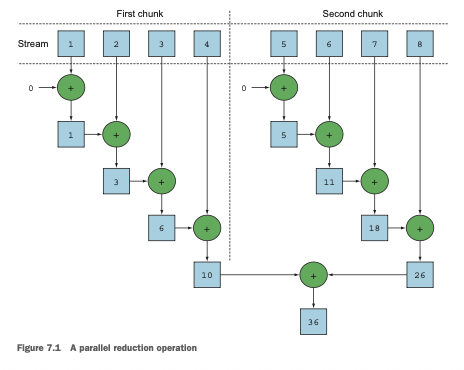
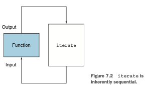
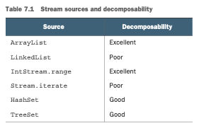
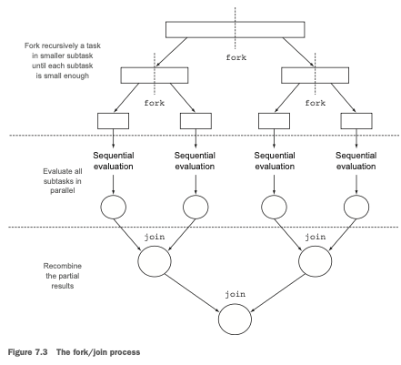
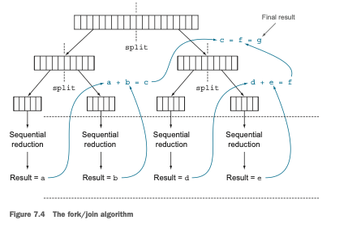
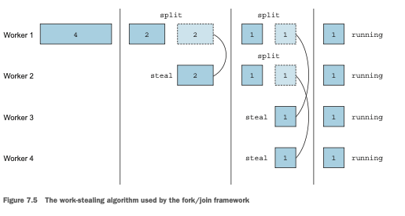
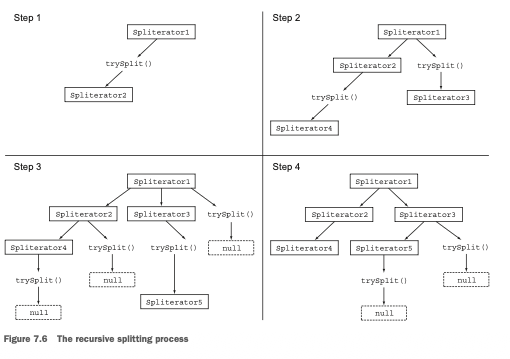
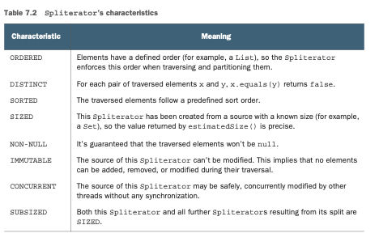
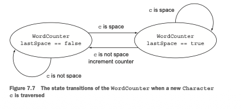

# Procesamiento de datos en paralelo y rendimiento

### Este capítulo cubre
- Procesamiento de datos en paralelo con streams paralelos
- Análisis de rendimiento de streams paralelos
- El framework fork/join
- División de un stream de datos usando un Spliterator

En los últimos tres capítulos, has visto cómo la nueva interfaz Streams te permite manipular 
colecciones de datos de forma declarativa. También explicamos que el cambio de la iteración externa 
a la interna permite que la librería nativa de Java tome el control sobre el procesamiento de los 
elementos de un stream. Este enfoque libera a los desarrolladores de Java de implementar 
explícitamente las optimizaciones necesarias para acelerar el procesamiento de colecciones de datos.
Con mucho, el beneficio más importante es la posibilidad de ejecutar un canal de operaciones en 
estas colecciones que automáticamente hace uso de los múltiples núcleos de tu computador.
Por ejemplo, antes de Java 7, procesar una colección de datos en paralelo era extremadamente 
complicado. Primero, necesitabas dividir explícitamente la estructura de datos que contenía tus datos
en subpartes. Segundo, necesitabas asignar cada una de estas subpartes a un hilo diferente. Tercero,
necesitabas sincronizarlos oportunamente para evitar condiciones de carrera no deseadas, esperar la 
finalización de todos los hilos y finalmente combinar los resultados parciales. Java 7 introdujo un 
framework llamado fork/join para realizar estas operaciones de manera más consistente y con menos 
probabilidad de errores. Exploraremos este framework en la sección 7.2.
En este capítulo, descubrirás cómo la interfaz Streams te brinda la oportunidad de ejecutar 
operaciones en paralelo en una colección de datos sin mucho esfuerzo. Te permite convertir 
declarativamente un stream secuencial en uno paralelo. Además, verás cómo Java puede hacer que ocurra
esta magia o, de manera más práctica, cómo funcionan los streams paralelos internamente empleando el
framework fork/join introducido en Java 7. También descubrirás que es importante saber cómo funcionan
los streams paralelos internamente, porque si ignoras este aspecto, podrías obtener resultados 
inesperados (y probablemente incorrectos) al usarlos de manera incorrecta.
En particular, demostraremos que la forma en que un stream paralelo se divide en fragmentos, antes
de procesar los diferentes fragmentos en paralelo, puede en algunos casos ser el origen de estos 
resultados incorrectos y aparentemente inexplicables. Por esta razón, aprenderás cómo tomar el 
control de este proceso de división implementando y usando tu propio Spliterator.

## 7.1 Streams paralelos
En el capítulo 4, mencionamos brevemente que la interfaz Streams te permite procesar sus elementos 
en paralelo de manera conveniente: es posible convertir una colección en un stream paralelo invocando
el método parallelStream en la fuente de la colección. Un stream paralelo es un stream que divide 
sus elementos en múltiples fragmentos, procesando cada fragmento con un hilo diferente. Por lo tanto,
puedes particionar automáticamente la carga de trabajo de una operación dada en todos los núcleos de
tu procesador multinúcleo y mantenerlos todos igualmente ocupados. Experimentemos con esta idea usando
un ejemplo simple.
Supón que necesitas escribir un método que acepte un número n como argumento y retorne la suma de 
los números del uno al n. Un enfoque sencillo (quizás ingenuo) es generar un stream infinito de 
números, limitándolo a los números pasados, y luego reducir el stream resultante con un `BinaryOperator`
que suma dos números, de la siguiente manera:
```java
public long sequentialSum(long n) {
    return Stream.iterate(1L, i -> i + 1)//Genera el stream infinito de números naturales.
            .limit(n)//Lo limita a los primeros n números.
            .reduce(0L, Long::sum);//Reduce el stream sumando todos los números.
}
```
En términos más tradicionales de Java, este código es equivalente a su contraparte iterativa:
```java
public long iterativeSum(long n) {
    long result = 0;
    for (long i = 1L; i <= n; i++) {
        result += i;
    }
    return result;
}
```
Esta operación parece ser un buen candidato para usar la paralelización, especialmente para valores 
grandes de n. Pero ¿por dónde empiezas? ¿Sincronizas en la variable result? ¿Cuántos hilos usas? 
¿Quién genera los números? ¿Quién los suma? No te preocupes por todo esto. ¡Es un problema mucho más
simple de resolver si adoptas streams paralelos!

### 7.1.1 Convertir un stream secuencial en uno paralelo
Puedes hacer que el proceso de reducción funcional anterior (suma) se ejecute en paralelo convirtiendo
el stream en uno paralelo; llama al método parallel en el stream secuencial:
```java
public long parallelSum(long n) {
    return Stream.iterate(1L, i -> i + 1)
            .limit(n)
            .parallel() //Convierte el stream en uno paralelo.
            .reduce(0L, Long::sum);
}    
```
En el código anterior, el proceso de reducción usado para sumar todos los números en el stream 
funciona de una manera similar a lo que se describe en la sección 5.4.1. La diferencia es que el 
stream ahora se divide internamente en múltiples fragmentos. Como resultado, la operación de 
reducción puede trabajar en los diversos fragmentos de forma independiente y en paralelo, como se 
muestra en la figura 7.1. Finalmente, la misma operación de reducción combina los valores 
resultantes de las reducciones parciales de cada substream, produciendo el resultado del proceso de 
reducción en todo el stream inicial.
Ten en cuenta que, en realidad, llamar al método parallel en un stream secuencial no implica ninguna
transformación concreta en el stream en sí. Internamente, se establece una bandera booleana para 
indicar que quieres ejecutar en paralelo todas las operaciones que siguen a la invocación de parallel.
De manera similar, puedes convertir un stream paralelo en uno secuencial invocando el método 
sequential en él. Ten en cuenta que podrías pensar que combinando estos dos métodos podrías lograr 
un control más detallado sobre qué operaciones quieres realizar en paralelo y cuáles secuencialmente
mientras recorres el stream. Por ejemplo, podrías hacer algo como lo siguiente:
```java
stream.parallel()
    .filter(...)
    .sequential()
    .map(...)
    .parallel()
    .reduce();
```
Pero la última llamada a parallel o sequential gana y afecta al canal globalmente. En este ejemplo, 
el canal se ejecutará en paralelo porque esa es la última llamada en el canal.



### Configuración del pool de hilos usado por los streams paralelos

Al mirar el método parallel del stream, puede que te preguntes de dónde vienen los hilos usados por
el stream paralelo, cuántos hay y cómo puedes personalizar el proceso.
Los streams paralelos usan internamente el ForkJoinPool predeterminado (aprenderás más sobre el
framework fork/join en la sección 7.2), que por defecto tiene tantos hilos como procesadores 
disponibles, según lo retornado por `Runtime.getRuntime().availableProcessors()`.
Pero puedes cambiar el tamaño de este pool usando la propiedad del sistema 
`java.util.concurrent.ForkJoinPool.common.parallelism`, como en el siguiente ejemplo:
`System.setProperty("java.util.concurrent.ForkJoinPool.common.parallelism", "12")`;
Esta es una configuración global, por lo que afectará a todos los streams paralelos en tu código. 
Por el contrario, actualmente no es posible especificar este valor para un único stream paralelo. 
En general, tener el tamaño del `ForkJoinPool` igual al número de procesadores en tu máquina es un 
valor predeterminado significativo, y te sugerimos encarecidamente que no lo modifiques a menos que 
tengas una buena razón para hacerlo.

Volviendo al ejercicio de suma de números, dijimos que puedes esperar una mejora significativa del 
rendimiento en su versión paralela cuando se ejecuta en un procesador multinúcleo. Ahora tienes tres
métodos que ejecutan exactamente la misma operación de tres formas diferentes (estilo iterativo, 
reducción secuencial y reducción paralela), así que veamos cuál es el más rápido.

### 7.1.2 Medición del rendimiento del stream
Afirmamos que el método de suma paralelizado debería funcionar mejor que los métodos secuencial e 
iterativo. Sin embargo, en la ingeniería de software, adivinar nunca es una buena idea. Al optimizar
el rendimiento, siempre debes seguir tres reglas de oro: medir, medir, medir. Para este propósito 
implementaremos un `microbenchmark` usando una librería llamada `Java Microbenchmark Harness (JMH)`. Esta
es una herramienta que ayuda a crear, de manera simple basada en anotaciones, `microbenchmarks` 
confiables para programas Java y para cualquier otro lenguaje que tenga como objetivo la Máquina 
Virtual de Java (JVM). De hecho, desarrollar benchmarks correctos y significativos para programas que
se ejecutan en la JVM no es una tarea fácil, porque hay muchos factores a considerar como el tiempo 
de calentamiento requerido por HotSpot para optimizar el bytecode y la sobrecarga introducida por el
recolector de basura. Si estás usando Maven como tu herramienta de construcción, entonces para 
comenzar a usar JMH en tu proyecto agregas un par de dependencias a tu archivo pom.xml (que define 
el proceso de construcción de Maven).
```xml
<dependency>
<groupId>org.openjdk.jmh</groupId>
<artifactId>jmh-core</artifactId>
<version>1.17.4</version>
</dependency>
<dependency>
<groupId>org.openjdk.jmh</groupId>
<artifactId>jmh-generator-annprocess</artifactId>
<version>1.17.4</version>
</dependency>
```
La primera librería es la implementación central de `JMH` mientras que la segunda contiene un procesador
de anotaciones que ayuda a generar un archivo `Java Archive (JAR)` a través del cual puedes ejecutar 
convenientemente tu `benchmark` una vez que también hayas agregado el siguiente plugin a tu 
configuración de Maven:
```xml
<build>
    <plugin>
        <groupId>org.apache.maven.plugins</groupId>
        <artifactId>maven-shade-plugin</artifactId>
        <executions>
            <execution>
                <phase>package</phase>
                <goals><goal>shade</goal></goals>
                <configuration>
                    <finalName>benchmarks</finalName>
                    <transformers>
                        <transformer implementation="org.apache.maven.plugins.shade.
                                    resource.ManifestResourceTransformer">
                            <mainClass>org.openjdk.jmh.Main</mainClass>
                        </transformer>
                    </transformers>
                </configuration>
            </execution>
        </executions>
    </plugin>
</build>
```
Hecho esto, puedes hacer el benchmark del método sequentialSum introducido al comienzo de esta 
sección de esta manera simple, como se muestra en el siguiente listado.

Listado 7.1 Medición del rendimiento de una función que suma los primeros n números:
```java
@BenchmarkMode(Mode.AverageTime) //Mide el tiempo promedio que tarda el metodo del benchmark.
@OutputTimeUnit(TimeUnit.MILLISECONDS)//Imprime los resultados del benchmark usando milisegundos como unidad de tiempo.
@Fork(2, jvmArgs={"-Xms4G", "-Xmx4G"})//Ejecuta el benchmark 2 veces para aumentar la confiabilidad de los resultados, con 4GB de espacio de heap.
public class ParallelStreamBenchmark {
    private static final long N = 10_000_000L;

    @Benchmark //El metodo a comparar en el benchmark.
    public long sequentialSum() {
        return Stream.iterate(1L, i -> i + 1).limit(N)
                .reduce(0L, Long::sum);
    }
    @TearDown(Level.Invocation) //Intenta ejecutar el recolector de basura después de cada iteración del benchmark.
    public void tearDown() {
        System.gc();
    }    
}    
```
Cuando compilas esta clase, el plugin de Maven configurado anteriormente genera un segundo archivo 
JAR llamado benchmarks.jar que puedes ejecutar de la siguiente manera:

```curl
java -jar ./target/benchmarks.jar ParallelStreamBenchmark
```
Configuramos el benchmark para usar un heap de gran tamaño para evitar cualquier influencia del 
recolector de basura tanto como sea posible, y por la misma razón, intentamos forzar al recolector 
de basura a ejecutarse después de cada iteración de nuestro benchmark. A pesar de todas estas 
precauciones, hay que señalar que los resultados deben tomarse con cautela. ¡Muchos factores influirán
en el tiempo de ejecución, como cuántos núcleos soporta tu máquina! Puedes probar esto en tu propia 
máquina ejecutando el código disponible en el repositorio del libro.
Cuando lanzas el comando anterior, JMH ejecuta 20 iteraciones de calentamiento del método del 
benchmark para permitir que HotSpot optimice el código, y luego 20 iteraciones más que se usan para 
calcular el resultado final. Estas 20+20 iteraciones son el comportamiento predeterminado de JMH, 
pero puedes cambiar ambos valores ya sea a través de otras anotaciones específicas de JMH o, aún más
convenientemente, agregándolos a la línea de comandos usando las banderas -w y -i. Al ejecutarlo en 
un computador equipado con un Intel i7-4600U 2.1 GHz de cuatro núcleos, imprime el siguiente resultado:

`Benchmark Mode Cnt Score Error Units
ParallelStreamBenchmark.sequentialSum avgt 40 121.843 ± 3.062 ms/op`

Deberías esperar que la versión iterativa usando un bucle for tradicional se ejecute mucho más rápido
porque trabaja a un nivel mucho más bajo y, más importante, no necesita realizar ningún boxing o 
unboxing de los valores primitivos. Podemos verificar esta intuición agregando un segundo método a 
la clase de benchmarking del listado 7.1 y también anotándolo con @Benchmark:
```java
@Benchmark
public long iterativeSum() {
    long result = 0;
    for (long i = 1L; i <= N; i++) {
        result += i;
    }
    return result;
}
```
Al ejecutar este segundo benchmark (posiblemente habiendo comentado el primero para evitar ejecutarlo
nuevamente) en nuestra máquina de prueba, obtuvimos el siguiente resultado:

`Benchmark Mode Cnt Score Error Units
ParallelStreamBenchmark.iterativeSum avgt 40 3.278 ± 0.192 ms/op`

Esto confirmó nuestras expectativas: la versión iterativa es casi 40 veces más rápida que la que usa
el stream secuencial por las razones que anticipamos. Ahora hagamos lo mismo con la versión que usa 
el stream paralelo, también agregando ese método a nuestra clase de benchmarking. Obtuvimos el 
siguiente resultado:

`Benchmark Mode Cnt Score Error Units
ParallelStreamBenchmark.parallelSum avgt 40 604.059 ± 55.288 ms/op`

Esto es bastante decepcionante: la versión paralela del método de suma no está aprovechando en 
absoluto nuestra CPU de cuatro núcleos y es alrededor de cinco veces más lenta que la secuencial.
¿Cómo puedes explicar este resultado inesperado? Dos problemas se mezclan juntos:

- iterate genera objetos con boxing, que tienen que ser convertidos a números mediante unboxing antes
de poder sumarse.
- iterate es difícil de dividir en fragmentos independientes para ejecutar en paralelo.

El segundo problema es particularmente interesante porque necesitas mantener un modelo mental de que
algunas operaciones de stream son más paralelizables que otras. Específicamente, la operación iterate
es difícil de dividir en fragmentos que puedan ejecutarse de forma independiente, porque la entrada 
de una aplicación de función siempre depende del resultado de la aplicación anterior, como se ilustra
en la figura 7.2.



Esto significa que en este caso específico el proceso de reducción no procede como se muestra en la
figura 7.1: la lista completa de números no está disponible al comienzo del proceso de reducción, lo
que hace imposible particionar eficientemente el stream en fragmentos para procesarse en paralelo. 
Al marcar el stream como paralelo, estás agregando la sobrecarga de asignar cada operación de suma 
en un hilo diferente al procesamiento secuencial.
Esto demuestra cómo la programación paralela puede ser complicada y a veces contraintuitiva. Cuando 
se usa incorrectamente (por ejemplo, usando una operación que no es compatible con el paralelismo, 
como iterate) puede empeorar el rendimiento general de tus programas, por lo que es obligatorio 
entender qué sucede detrás de escena cuando invocas ese aparentemente mágico método parallel.

### Usando metodos mas especializados
Entonces, ¿cómo puedes usar tus procesadores multinúcleo y el stream para realizar una suma paralela
de manera efectiva? Analizamos un método llamado LongStream.rangeClosed en el capítulo 5. Este método
tiene dos beneficios en comparación con iterate:
- LongStream.rangeClosed trabaja directamente con números long primitivos, por lo que no hay 
sobrecarga de boxing y unboxing.
- LongStream.rangeClosed produce rangos de números, que pueden dividirse fácilmente en fragmentos 
independientes. Por ejemplo, el rango 1-20 puede dividirse en 1-5, 6-10, 11-15 y 16-20.

Primero veamos cómo funciona en un stream secuencial agregando el siguiente método a nuestra clase 
de benchmarking para verificar si la sobrecarga asociada con el unboxing es relevante:
```java
@Benchmark
public long rangedSum() {
    return LongStream.rangeClosed(1, N)
            .reduce(0L, Long::sum);
}
```
Esta vez la salida es:
```terminaloutput
Benchmark Mode Cnt Score Error Units
ParallelStreamBenchmark.rangedSum avgt 40 5.315 ± 0.285 ms/op
```
El stream numérico es mucho más rápido que la versión secuencial anterior, generada con el método de
fábrica iterate, porque el stream numérico evita toda la sobrecarga causada por todas las operaciones
innecesarias de autoboxing y auto-unboxing realizadas por el stream no especializado. Esto es 
evidencia de que elegir las estructuras de datos correctas es a menudo más importante que paralelizar
el algoritmo que las usa. Pero ¿qué sucede si intentas usar un stream paralelo en esta nueva versión
que sigue?
```java
@Benchmark
public long parallelRangedSum() {
    return LongStream.rangeClosed(1, N)
            .parallel()
            .reduce(0L, Long::sum);
}
```
Ahora, agregando este método a nuestra clase de benchmarking obtuvimos
```terminaloutput
Benchmark Mode Cnt Score Error Units
ParallelStreamBenchmark.parallelRangedSum avgt 40 2.677 ± 0.214 ms/op
```
Finalmente, obtuvimos una reducción paralela que es más rápida que su contraparte secuencial, porque
esta vez la operación de reducción puede ejecutarse como se muestra en la figura 7.1. Esto también 
demuestra que usar la estructura de datos correcta y luego hacer que funcione en paralelo garantiza 
el mejor rendimiento. Ten en cuenta que esta última versión también es alrededor de un 20% más rápida
que la versión iterativa original, demostrando que, cuando se usa correctamente, el estilo de 
programación funcional nos permite usar el paralelismo de las CPUs multinúcleo modernas de una manera
más simple y directa que su contraparte imperativa.
Sin embargo, ten en cuenta que la paralelización no es gratuita. El proceso de paralelización en sí 
requiere que particiones recursivamente el stream, asignes la operación de reducción de cada 
substream a un hilo diferente y luego combines los resultados de estas operaciones en un único valor.
Pero mover datos entre múltiples núcleos también es más costoso de lo que podrías esperar, por lo 
que es importante que el trabajo que se realizará en paralelo en otro núcleo tome más tiempo que el
tiempo requerido para transferir los datos de un núcleo a otro. En general, hay muchos casos en los 
que no es posible o conveniente usar la paralelización. Pero antes de usar un stream paralelo para 
hacer tu código más rápido, debes asegurarte de que lo estás usando correctamente; no es útil producir 
un resultado en menos tiempo si el resultado será incorrecto. Veamos una trampa común.

### 7.1.3 Uso correcto de los streams paralelos
La principal causa de errores generados por el uso incorrecto de streams paralelos es el uso de 
algoritmos que mutan algún estado compartido. Aquí hay una manera de implementar la suma de los 
primeros n números naturales mutando un acumulador compartido:
```java
public long sideEffectSum(long n) {
    Accumulator accumulator = new Accumulator();
    LongStream.rangeClosed(1, n).forEach(accumulator::add);
    return accumulator.total;
}
public class Accumulator {
    public long total = 0;
    public void add(long value) { total += value; }
}
```
Es bastante común escribir este tipo de código, especialmente para desarrolladores que están 
familiarizados con los paradigmas de programación imperativa. Este código se parece mucho a lo que 
estás acostumbrado a hacer cuando iteras imperativamente una lista de números: inicializas un 
acumulador y recorres los elementos de la lista uno por uno, agregándolos al acumulador.
¿Qué está mal con este código? Desafortunadamente, está irremediablemente roto porque es 
fundamentalmente secuencial. Tienes una condición de carrera de datos en cada acceso a total. Y si 
intentas solucionar eso con sincronización, perderás todo tu paralelismo. Para entender esto, 
intentemos convertir el stream en uno paralelo:
```java
public long sideEffectParallelSum(long n) {
    Accumulator accumulator = new Accumulator();
    LongStream.rangeClosed(1, n).parallel().forEach(accumulator::add);
    return accumulator.total;
}
```
Intenta ejecutar este último método con el banco de pruebas del listado 7.1, también imprimiendo el 
resultado de cada ejecución:
```java
System.out.println("SideEffect parallel sum done in: " +
    measurePerf(ParallelStreams::sideEffectParallelSum, 10_000_000L) + "
    msecs" );
```
Podrías obtener algo como lo siguiente:
```terminaloutput
Result: 5959989000692
Result: 7425264100768
Result: 6827235020033
Result: 7192970417739
Result: 6714157975331
Result: 7497810541907
Result: 6435348440385
Result: 6999349840672
Result: 7435914379978
Result: 7715125932481
SideEffect parallel sum done in: 49 msecs
```
Esta vez el rendimiento de tu método no es importante. Lo único relevante es que cada ejecución 
retorna un resultado diferente, todos distantes del valor correcto de 50000005000000. Esto es causado
por el hecho de que múltiples hilos están accediendo concurrentemente al acumulador y, en particular,
ejecutando total += value, que, a pesar de su apariencia, no es una operación atómica. El origen del
problema es que el método invocado dentro del bloque forEach tiene el efecto secundario de cambiar 
el estado mutable de un objeto compartido entre múltiples hilos. Es obligatorio evitar este tipo de 
situaciones si quieres usar streams paralelos sin incurrir en sorpresas similares.
Ahora sabes que un estado mutable compartido no funciona bien con los streams paralelos y con los 
cálculos paralelos en general. Volveremos a esta idea de evitar la mutación en los capítulos 18 y 19
cuando analicemos la programación funcional con más detalle. Por ahora, ten en cuenta que evitar un 
estado mutable compartido garantiza que tu stream paralelo producirá el resultado correcto. A 
continuación, veremos algunos consejos prácticos que puedes usar para determinar cuándo es apropiado
usar streams paralelos para ganar rendimiento.

### 7.1.4 Uso efectivo de los streams paralelos
En general, es imposible (y sin sentido) intentar dar cualquier sugerencia cuantitativa sobre cuándo
usar un stream paralelo, porque cualquier criterio específico como "solo cuando el stream contiene 
más de mil elementos" podría ser correcto para una operación específica que se ejecuta en una máquina
específica, pero completamente incorrecto en un contexto marginalmente diferente. Sin embargo, al 
menos es posible proporcionar algunos consejos cualitativos que podrían ser útiles al decidir si tiene
sentido usar un stream paralelo en una situación determinada:

- Si tienes dudas, mide. Convertir un stream secuencial en uno paralelo es trivial pero no siempre 
lo correcto. Como ya demostramos en esta sección, un stream paralelo no siempre es más rápido que la
versión secuencial correspondiente. Además, los streams paralelos a veces pueden funcionar de manera
contraintuitiva, por lo que la primera y más importante sugerencia al elegir entre streams 
secuenciales y paralelos es siempre verificar su rendimiento con un benchmark apropiado.
- Ten cuidado con el boxing. Las operaciones automáticas de boxing y unboxing pueden dañar 
drásticamente el rendimiento. Java 8 incluye streams primitivos (IntStream, LongStream y DoubleStream)
para evitar tales operaciones, así que úsalos cuando sea posible.
- Algunas operaciones naturalmente tienen peor rendimiento en un stream paralelo que en uno secuencial.
En particular, las operaciones como limit y findFirst que dependen del orden de los elementos son 
costosas en un stream paralelo. Por ejemplo, findAny funcionará mejor que findFirst porque no está 
restringido a operar en el orden de encuentro. Siempre puedes convertir un stream ordenado en uno no
ordenado invocando el método unordered en él. Por ejemplo, si necesitas N elementos de tu stream y 
no estás necesariamente interesado en los primeros N, llamar a limit en un stream paralelo no 
ordenado puede ejecutarse más eficientemente que en un stream con un orden de encuentro (por ejemplo,
cuando la fuente es una List).
- Considera el costo computacional total del canal de operaciones realizado por el stream. Con N 
siendo el número de elementos a procesar y Q el costo aproximado de procesar uno de estos elementos 
a través del canal del stream, el producto N*Q da una estimación cualitativa aproximada de este
costo. Un valor más alto para Q implica una mejor posibilidad de buen rendimiento al usar un stream 
paralelo.
- Para una pequeña cantidad de datos, elegir un stream paralelo casi nunca es una decisión ganadora.
Las ventajas de procesar en paralelo solo unos pocos elementos no son suficientes para compensar el
costo adicional introducido por el proceso de paralelización.
- Ten en cuenta qué tan bien la estructura de datos subyacente al stream se descompone. Por ejemplo,
un ArrayList puede dividirse mucho más eficientemente que un LinkedList, porque el primero puede 
dividirse uniformemente sin recorrerlo, como es necesario hacer con el segundo. Además, los streams 
primitivos creados con el método de fábrica range pueden descomponerse rápidamente. Finalmente, como
aprenderás en la sección 7.3, puedes tener control total de este proceso de descomposición 
implementando tu propio Spliterator.
- Las características de un stream, y cómo las operaciones intermedias a través del canal las 
modifican, pueden cambiar el rendimiento del proceso de descomposición. Por ejemplo, un stream SIZED
puede dividirse en dos partes iguales, y luego cada parte puede procesarse en paralelo de manera más
efectiva, pero una operación filter puede descartar un número impredecible de elementos, haciendo que
el tamaño del stream en sí sea desconocido.
- Considera si una operación terminal tiene un paso de fusión barato o costoso (por ejemplo, el 
método combiner en un Collector). Si es costoso, entonces el costo causado por la combinación de los
resultados parciales generados por cada substream puede superar los beneficios de rendimiento de un 
stream paralelo.

La tabla 7.1 da un resumen de la compatibilidad con el paralelismo de ciertas fuentes de stream en 
términos de su descomponibilidad.



Finalmente, necesitamos enfatizar que la infraestructura usada detrás de escena por los streams 
paralelos para ejecutar operaciones en paralelo es el framework fork/join introducido en Java 7. El 
ejemplo de suma paralela demostró que es vital tener una buena comprensión de los internos de los 
streams paralelos para usarlos correctamente, por lo que investigaremos en detalle el framework 
fork/join en la siguiente sección.

## 7.2 El framework fork/join
El framework fork/join fue diseñado para dividir recursivamente una tarea paralelizable en tareas 
más pequeñas y luego combinar los resultados de cada subtarea para producir el resultado general. 
Es una implementación de la interfaz ExecutorService, que distribuye esas subtareas a hilos de trabajo
en un pool de hilos, llamado ForkJoinPool. Comencemos explorando cómo definir una tarea y subtareas.

### 7.2.1 Trabajando con RecursiveTask
Para enviar tareas a este pool, tienes que crear una subclase de RecursiveTask<R>, donde R es el 
tipo del resultado producido por la tarea paralelizada (y cada una de sus subtareas) o de 
RecursiveAction si la tarea no retorna ningún resultado (aunque podría estar actualizando otras 
estructuras no locales). Para definir RecursiveTasks solo necesitas implementar su único método 
abstracto, compute:
```java
protected abstract R compute();
```
Este método define tanto la lógica de dividir la tarea en cuestión en subtareas como el algoritmo 
para producir el resultado de una subtarea individual cuando ya no es posible o conveniente dividirla
más. Por esta razón, una implementación de este método a menudo se parece al siguiente pseudocódigo:
```java
if (task is small enough or no longer divisible) {
    compute task sequentially
} else{
    split task in two subtasks call this method recursively possibly further splitting each
    subtask wait for the completion of all subtasks combine the results of each subtask
}
```
En general, no hay criterios precisos para decidir si una tarea dada debe dividirse más o no, pero 
hay varias heurísticas que puedes seguir para ayudarte con esta decisión. Las aclaramos con más 
detalle en la sección 7.2.2. El proceso de división recursiva de tareas se sintetiza visualmente en 
la figura 7.3.
Como habrás notado, esto no es más que la versión paralela del conocido algoritmo divide y vencerás.
Para demostrar un ejemplo práctico de cómo usar el framework fork/join y basándonos en nuestros 
ejemplos anteriores, intentemos calcular la suma de un rango de números (aquí representado por un 
array de números long[]) usando este framework. Como se explicó, primero necesitas proporcionar una 
implementación para la clase RecursiveTask, como se muestra por ForkJoinSumCalculator en el listado 7.2.



Listado 7.2 Ejecución de una suma paralela usando el framework fork/join:
```java
public class ForkJoinSumCalculator
extends java.util.concurrent.RecursiveTask<Long> { //Extiende RecursiveTask para crear una tarea utilizable con el framework fork/join.
    private final long[] numbers; //El array de números a sumar.
    private final int start; //Las posiciones inicial y final del subarray procesado por esta subtarea.
    private final int end;
    public static final long THRESHOLD = 10_000; //El umbral de tamaño para dividir en subtareas.

    public ForkJoinSumCalculator(long[] numbers) { //Constructor público para crear la tarea principal.
        this(numbers, 0, numbers.length);
    }
    
    //Constructor privado para crear subtareas de la tarea principal.
    private ForkJoinSumCalculator(long[] numbers, int start, int end) { //
        this.numbers = numbers;
        this.start = start;
        this.end = end;
    }

    //Sobreescribe el metodo abstracto de RecursiveTask.
    @Override
    protected Long compute() {
        int length = end - start; //El tamaño del subarray sumado por esta tarea.
        if (length <= THRESHOLD) {
            return computeSequentially(); //Si el tamaño es menor o igual al umbral, calcula el resultado secuencialmente.
        }
        //Crea una subtarea para sumar la primera mitad del array.
        ForkJoinSumCalculator leftTask =
                new ForkJoinSumCalculator(numbers, start, start + length / 2);
        //Ejecuta de forma asíncrona la subtarea recién creada usando otro hilo de ForkJoinPool.
        leftTask.fork();
        //Crea una subtarea para sumar la segunda mitad del array.
        ForkJoinSumCalculator rightTask =
                new ForkJoinSumCalculator(numbers, start + length / 2, end);
        //Ejecuta esta segunda subtarea de forma síncrona, permitiendo potencialmente más divisiones recursivas.
        Long rightResult = rightTask.compute();
        //Lee el resultado de la primera subtarea, esperando si no está lista.
        Long leftResult = leftTask.join();
        //Combina los resultados de las dos subtareas.
        return leftResult + rightResult;
    }
    //Un algoritmo secuencial simple para tamaños por debajo del umbral.
    private long computeSequentially() {
        long sum = 0;
        for (int i = start; i < end; i++) {
            sum += numbers[i];
        }
        return sum;
    }
}
```
Escribir un método que realice una suma paralela de los primeros n números naturales es ahora 
sencillo. Necesitas pasar el array deseado de números al constructor de ForkJoinSumCalculator:
```java
public static long forkJoinSum(long n) {
    long[] numbers = LongStream.rangeClosed(1, n).toArray();
    ForkJoinTask<Long> task = new ForkJoinSumCalculator(numbers);
    return new ForkJoinPool().invoke(task);
}
```
Aquí, generas un array que contiene los primeros n números naturales usando un LongStream. Luego 
creas una ForkJoinTask (la superclase de RecursiveTask), pasando este array al constructor público 
de ForkJoinSumCalculator mostrado en el listado 7.2. Finalmente, creas un nuevo ForkJoinPool y pasas
esa tarea a su método invoke. El valor retornado por este último método es el resultado de la tarea 
definida por la clase ForkJoinSumCalculator cuando se ejecuta dentro del ForkJoinPool.
Ten en cuenta que en una aplicación del mundo real, no tiene sentido usar más de un ForkJoinPool. 
Por esta razón, lo que normalmente debes hacer es instanciarlo solo una vez y mantener esta instancia
en un campo estático, convirtiéndola en un singleton, para que pueda reutilizarse convenientemente 
por cualquier parte de tu software. Aquí, para crearlo estás usando su constructor predeterminado 
sin argumentos, lo que significa que quieres permitir que el pool use todos los procesadores 
disponibles para la JVM. Más precisamente, este constructor usará el valor retornado por 
Runtime.availableProcessors para determinar el número de hilos usados por el pool. Ten en cuenta que
el método availableProcessors, a pesar de su nombre, en realidad retorna el número de núcleos 
disponibles, incluidos los virtuales debido al hyperthreading.

### Ejecutando el ForkJoinSumCalculator:
Cuando pasas la tarea ForkJoinSumCalculator al ForkJoinPool, esta tarea es ejecutada por un hilo del
pool que a su vez llama al método compute de la tarea. Este método verifica si la tarea es lo 
suficientemente pequeña para realizarse secuencialmente; de lo contrario, divide el array de números
a sumar en dos mitades y las asigna a dos nuevos ForkJoinSumCalculators que están programados para 
ser ejecutados por el ForkJoinPool. Como resultado, este proceso puede repetirse recursivamente, 
permitiendo que la tarea original se divida en tareas más pequeñas, hasta que se cumpla la condición
usada para verificar si ya no es conveniente o ya no es posible dividirla más (en este caso, si el 
número de elementos a sumar es menor o igual a 10,000). En este punto, el resultado de cada subtarea
se calcula secuencialmente, y el árbol binario (implícito) de tareas creado por el proceso de 
bifurcación se recorre de vuelta hacia su raíz. El resultado de la tarea se calcula entonces 
combinando los resultados parciales de cada subtarea. Este proceso se muestra en la figura 7.4.



Una vez más puedes verificar el rendimiento del método de suma que usa explícitamente el framework 
fork/join con el banco de pruebas desarrollado al comienzo de este capítulo:
```java
System.out.println("ForkJoin sum done in: " + 
                   measureSumPerf(ForkJoinSumCalculator::forkJoinSum, 10_000_000) + " msecs" );
```
Aquí, el rendimiento es peor que la versión que usa el stream paralelo, pero solo porque estás 
obligado a colocar todo el stream de números en un long[] antes de poder usarlo en la tarea 
ForkJoinSumCalculator.

### 7.2.2 Mejores prácticas para usar el framework fork/join
Aunque el framework fork/join es relativamente fácil de usar, desafortunadamente también es fácil de
usar incorrectamente. Aquí hay algunas mejores prácticas para usarlo eficazmente:

- Invocar el método join en una tarea bloquea al llamante hasta que el resultado producido por esa 
tarea esté listo. Por esta razón, es necesario llamarlo después de que la computación de ambas 
subtareas haya comenzado. De lo contrario, terminarás con una versión más lenta y más compleja de tu
algoritmo secuencial original porque cada subtarea tendrá que esperar a que la otra termine antes de
comenzar.
- El método invoke de un ForkJoinPool no debe usarse desde dentro de una RecursiveTask. En cambio, 
siempre debes llamar a los métodos compute o fork directamente; solo el código secuencial debe usar 
invoke para comenzar la computación paralela.
- Llamar al método fork en una subtarea es la manera de programarla en el ForkJoinPool. Puede parecer
natural invocarlo tanto en la subtarea izquierda como en la derecha, pero esto es menos eficiente que
llamar directamente a compute en una de ellas. Hacer esto te permite reutilizar el mismo hilo para 
una de las dos subtareas y evitar la sobrecarga causada por la asignación innecesaria de una tarea 
adicional en el pool.
- Depurar una computación paralela usando el framework fork/join puede ser complicado. En particular,
es bastante común examinar una traza de pila en tu IDE favorito para descubrir la causa de un 
problema, pero esto no puede funcionar con una computación fork/join porque la llamada a compute 
ocurre en un hilo diferente al llamante conceptual, que es el código que llamó a fork.
- Como has descubierto con los streams paralelos, nunca debes dar por sentado que una computación 
usando el framework fork/join en un procesador multinúcleo es más rápida que su contraparte 
secuencial. Ya dijimos que una tarea debe ser descomponible en varias subtareas independientes para 
ser paralelizable con una ganancia de rendimiento relevante. Todas estas subtareas deben tardar más
en ejecutarse que en bifurcar una nueva tarea; un idioma es poner la E/S en una subtarea y la 
computación en otra, superponiendo así la computación con la E/S. Además, debes considerar otras cosas
al comparar el rendimiento de las versiones secuencial y paralela del mismo algoritmo. Como cualquier
otro código Java, el framework fork/join necesita "calentarse", o ejecutarse, algunas veces antes de
ser optimizado por el compilador JIT. Por eso siempre es importante ejecutar el programa varias 
veces antes de medir su rendimiento, como hicimos en nuestro banco de pruebas. También ten en cuenta
que las optimizaciones integradas en el compilador podrían dar injustamente una ventaja a la versión
secuencial (por ejemplo, realizando análisis de código muerto, eliminando una computación que nunca 
se usa). La estrategia de división del framework fork/join merece una última nota: debes elegir los 
criterios usados para decidir si una subtarea dada debe dividirse más o si es lo suficientemente 
pequeña para evaluarse secuencialmente. Daremos algunas sugerencias al respecto en la siguiente sección.

### 7.2.3 Robo de trabajo
En nuestro ejemplo de ForkJoinSumCalculator decidimos dejar de crear más subtareas cuando el array 
de números a sumar contenía como máximo 10,000 elementos. Esta es una elección arbitraria, pero en 
la mayoría de los casos es difícil encontrar una buena heurística, aparte de intentar optimizarla 
haciendo varios intentos con diferentes entradas. En nuestro caso de prueba, comenzamos con un array
de 10 millones de elementos, lo que significa que el ForkJoinSumCalculator bifurcará al menos 1,000
subtareas. Esto podría parecer un desperdicio de recursos porque lo ejecutamos en una máquina que 
solo tiene cuatro núcleos. En este caso específico, eso es probablemente cierto porque todas las 
tareas están ligadas a la CPU y se espera que tomen una cantidad similar de tiempo.
Pero bifurcar un número bastante grande de tareas de grano fino es en general una elección ganadora.
Esto se debe a que idealmente quieres particionar la carga de trabajo de una tarea paralelizada de 
tal manera que cada subtarea tome exactamente la misma cantidad de tiempo, manteniendo todos los 
núcleos de tu CPU igualmente ocupados. Desafortunadamente, especialmente en casos más cercanos a 
escenarios del mundo real que el ejemplo directo que presentamos aquí, el tiempo tomado por cada 
subtarea puede variar dramáticamente ya sea debido al uso de una estrategia de partición ineficiente
o debido a causas impredecibles como el acceso lento al disco o la necesidad de coordinar la ejecución
con servicios externos.
El framework fork/join soluciona este problema con una técnica llamada robo de trabajo. En la 
práctica, esto significa que las tareas se dividen más o menos uniformemente entre todos los hilos 
del ForkJoinPool. Cada uno de estos hilos mantiene una cola doblemente enlazada de las tareas 
asignadas a él, y tan pronto como completa una tarea, toma otra de la cabeza de la cola y comienza a
ejecutarla. Por las razones que enumeramos anteriormente, un hilo podría completar todas las tareas 
asignadas a él mucho más rápido que los demás, lo que significa que su cola se vaciará mientras los 
otros hilos todavía están bastante ocupados. En este caso, en lugar de quedar inactivo, el hilo elige
aleatoriamente una cola de un hilo diferente y "roba" una tarea, tomándola de la cola. Este proceso 
continúa hasta que todas las tareas se ejecutan y luego todas las colas se vacían. Por eso tener 
muchas tareas más pequeñas, en lugar de solo unas pocas más grandes, puede ayudar a equilibrar mejor
la carga de trabajo entre los hilos de trabajo.
De manera más general, este algoritmo de robo de trabajo se usa para redistribuir y equilibrar las 
tareas entre los hilos de trabajo en el pool. La figura 7.5 muestra cómo ocurre este proceso. Cuando
una tarea en la cola de un trabajador se divide en dos subtareas, una de las dos subtareas es robada 
por otro trabajador inactivo. Como se describió anteriormente, este proceso puede continuar 
recursivamente hasta que la condición usada para definir que una subtarea dada debe ejecutarse 
secuencialmente se vuelva verdadera.
Ahora debería estar claro cómo un stream puede usar el framework fork/join para procesar sus elementos
en paralelo, pero todavía hay un ingrediente faltante. En esta sección, analizamos un ejemplo donde 
desarrollaste explícitamente la lógica para dividir un array de números en múltiples tareas. Sin 
embargo, no tuviste que hacer nada similar cuando usaste los streams paralelos al comienzo de este 
capítulo, y esto significa que debe haber un mecanismo automático que divide el stream por ti. Este 
nuevo mecanismo automático se llama Spliterator, y lo exploraremos en la siguiente sección.



## 7.3 Spliterator
El Spliterator es otra nueva interfaz añadida en Java 8; su nombre significa "iterador divisible". 
Al igual que los Iterators, los Spliterators se usan para recorrer los elementos de una fuente, pero
también están diseñados para hacerlo en paralelo. Aunque puede que no tengas que desarrollar tu 
propio Spliterator en la práctica, entender cómo hacerlo te dará una comprensión más amplia sobre 
cómo funcionan los streams paralelos. Java 8 ya proporciona una implementación de Spliterator 
predeterminada para todas las estructuras de datos incluidas en su Framework de Colecciones. La 
interfaz Collection ahora proporciona un método predeterminado spliterator() (aprenderás más sobre 
los métodos predeterminados en el capítulo 13) que retorna un objeto Spliterator. La interfaz 
Spliterator define varios métodos, como se muestra en el siguiente listado.

Listado 7.3 La interfaz Spliterator:
```java
public interface Spliterator<T> {
    boolean tryAdvance(Consumer<? super T> action);
    Spliterator<T> trySplit();
    long estimateSize();
    int characteristics();
}
```
Como de costumbre, T es el tipo de los elementos recorridos por el Spliterator. El método tryAdvance
se comporta de manera similar a un Iterator normal en el sentido de que se usa para consumir 
secuencialmente los elementos del Spliterator uno por uno, retornando true si todavía hay otros 
elementos por recorrer. Pero el método trySplit es más específico de la interfaz Spliterator porque
se usa para separar algunos de sus elementos en un segundo Spliterator (el retornado por el método),
permitiendo que los dos se procesen en paralelo. Un Spliterator también puede proporcionar una 
estimación del número de elementos restantes por recorrer a través de su método estimateSize, porque
incluso un valor impreciso pero rápido de calcular puede ser útil para dividir la estructura de 
manera más o menos uniforme.
Es importante entender cómo se realiza este proceso de división internamente para poder controlarlo 
cuando sea necesario. Por lo tanto, lo analizaremos con más detalle en la siguiente sección.

### 7.3.1 El proceso de división
El algoritmo que divide un stream en múltiples partes es un proceso recursivo y procede como se 
muestra en la figura 7.6. En el primer paso, trySplit se invoca en el primer Spliterator y genera un
segundo. Luego en el paso dos, se llama nuevamente en estos dos Spliterators, lo que resulta en un 
total de cuatro. El framework sigue invocando el método trySplit en un Spliterator hasta que retorna
null para indicar que la estructura de datos que está procesando ya no es divisible, como se muestra
en el paso 3. Finalmente, este proceso de división recursiva termina en el paso 4 cuando todos los 
Spliterators han retornado null a una invocación de trySplit.
Este proceso de división también puede verse influenciado por las características del Spliterator en
sí, que se declaran a través del método characteristics.



### Las caracteristicas del Spliterator:
El último método abstracto declarado por la interfaz Spliterator es characteristics, que retorna un
int que codifica el conjunto de características del Spliterator en sí. Los clientes del Spliterator 
pueden usar estas características para controlar y optimizar mejor su uso. La tabla 7.2 las resume. 
(Desafortunadamente, aunque conceptualmente se superponen con las características de un collector, 
se codifican de manera diferente.) Las características son constantes int definidas en la interfaz 
Spliterator.



Ahora que has visto qué es la interfaz Spliterator y qué métodos define, puedes intentar desarrollar
tu propia implementación de un Spliterator.

### 7.3.2 Implementación de tu propio Spliterator
Veamos un ejemplo práctico de dónde podrías necesitar implementar tu propio Spliterator. 
Desarrollaremos un método simple que cuenta el número de palabras en un String. Una versión iterativa
de este método podría escribirse como se muestra en el siguiente listado.

Listing 7.4 An iterative word counter method:
```java
public int countWordsIteratively(String s) {
    int counter = 0;
    boolean lastSpace = true;
    for (char c : s.toCharArray()) { //Recorre todos los caracteres del String uno por uno.
        if (Character.isWhitespace(c)) {
            lastSpace = true;
        } else {
            if (lastSpace) counter++; //Incrementa el contador de palabras cuando el último carácter es un espacio y el que se está recorriendo actualmente no lo es.
            lastSpace = false;
        }
    }
    return counter;
}
```
Pongamos este método a trabajar en la primera oración del Inferno de Dante
(ver http://en.wikipedia.org/wiki/Inferno_(Dante)):
```java
final String SENTENCE =
    " Nel mezzo del cammin di nostra vita " +
    "mi ritrovai in una selva oscura" +
    " ché la dritta via era smarrita ";
System.out.println("Found " + countWordsIteratively(SENTENCE) + " words");
```
Ten en cuenta que agregamos algunos espacios aleatorios adicionales en la oración para demostrar que
la implementación iterativa funciona correctamente incluso en presencia de múltiples espacios entre 
dos palabras. Como se esperaba, este código imprime lo siguiente:
```terminaloutput
Found 19 words
```
Idealmente te gustaría lograr el mismo resultado en un estilo más funcional porque de esta manera 
podrás, como se mostró anteriormente, paralelizar este proceso usando un stream paralelo sin tener 
que tratar explícitamente con hilos y su sincronización.

### Reescribiendo el WordCounter en estilo funcional
Primero, necesitas convertir el String en un stream. Desafortunadamente, solo hay streams primitivos
para int, long y double, por lo que tendrás que usar un Stream<Character>:
```java
Stream<Character> stream = IntStream.range(0, SENTENCE.length())
                    .mapToObj(SENTENCE::charAt);
```
Puedes calcular el número de palabras realizando una reducción en este stream. Al reducir el stream,
tendrás que llevar un estado que consiste en dos variables: un int que cuenta el número de palabras 
encontradas hasta ahora y un boolean para recordar si el último Character encontrado era un espacio 
o no. Debido a que Java no tiene tuplas (una construcción para representar una lista ordenada de 
elementos heterogéneos sin necesidad de un objeto envoltorio), tendrás que crear una nueva clase, 
WordCounter, que encapsulará este estado como se muestra en el siguiente listado.

Listado 7.5 Una clase para contar palabras mientras se recorre un stream de Characters.
```java
class WordCounter {
    private final int counter;
    private final boolean lastSpace;

    public WordCounter(int counter, boolean lastSpace) {
        this.counter = counter;
        this.lastSpace = lastSpace;
    }

    public WordCounter accumulate(Character c) {
        if (Character.isWhitespace(c)) {
            return lastSpace ?
                    this :
                    new WordCounter(counter, true);
        } else {
            return lastSpace ?
                    this;
            new WordCounter(counter + 1, false) :
            this;
        }
    }

    public WordCounter combine(WordCounter wordCounter) {
        return new WordCounter(counter + wordCounter.counter,
                wordCounter.lastSpace);
    }

    public int getCounter() {
        return counter;
    }
}
```
En este listado, el método accumulate define cómo cambiar el estado del WordCounter, o, más 
precisamente, con qué estado crear un nuevo WordCounter porque es una clase inmutable. Esto es 
importante de entender. Estamos acumulando estado con una clase inmutable específicamente para que 
el proceso pueda paralelizarse en el siguiente paso. El método accumulate se llama cada vez que se 
recorre un nuevo Character del stream. En particular, como hiciste en el método countWordsIteratively
en el listado 7.4, el contador se incrementa cuando se encuentra un nuevo carácter que no es espacio,
y el último carácter encontrado es un espacio. La figura 7.7 muestra las transiciones de estado del 
WordCounter cuando el método accumulate recorre un nuevo Character.



El segundo método, combine, se invoca para agregar los resultados parciales de dos WordCounters 
operando en dos subpartes diferentes del stream de Characters, por lo que combina dos WordCounters 
sumando sus contadores internos.
Ahora que has codificado la lógica de cómo acumular caracteres en un WordCounter y cómo combinarlos 
en el propio WordCounter, escribir un método que reducirá el stream de Characters es sencillo:
```java
private int countWords(Stream<Character> stream) {
    WordCounter wordCounter = stream.reduce(new WordCounter(0, true),
            WordCounter::accumulate,
            WordCounter::combine);
    return wordCounter.getCounter();
}
```
Ahora puedes probar este método con el stream creado a partir del String que contiene la primera 
oración del Inferno de Dante:
```java
Stream<Character> stream = IntStream.range(0, SENTENCE.length())
                    .mapToObj(SENTENCE::charAt);
System.out.println("Found " + countWords(stream) + " words");
```
Puedes verificar que su salida corresponde con la generada por la versión iterativa:
```terminaloutput
Found 19 words
```
Hasta ahora, todo bien, pero dijimos que una de las principales razones para implementar el 
WordCounter en términos funcionales era poder paralelizar fácilmente esta operación, así que veamos
cómo funciona esto.

### Haciendo que el WordCounter funcione en paralelo
Podrías intentar acelerar la operación de conteo de palabras usando un stream paralelo, de la 
siguiente manera:
```java
System.out.println("Found " + countWords(stream.parallel()) + " words");
```
Desafortunadamente, esta vez la salida es:
```terminaloutput
Found 25 words
```
Evidentemente algo salió mal, pero ¿qué? El problema no es difícil de descubrir. Debido a que el 
String original se divide en posiciones arbitrarias, a veces una palabra se divide en dos y luego se
cuenta dos veces. En general, esto demuestra que pasar de un stream secuencial a uno paralelo puede 
llevar a un resultado incorrecto si este resultado puede verse afectado por la posición donde se 
divide el stream.
¿Cómo puedes solucionar este problema? La solución consiste en asegurarse de que el String no se 
divida en una posición aleatoria sino solo al final de una palabra. Para hacer esto, tendrás que 
implementar un Spliterator de Character que divida un String solo entre dos palabras (como se muestra
en el siguiente listado) y luego cree el stream paralelo a partir de él.

Listing 7.6 The WordCounterSpliterator:
```java
class WordCounterSpliterator implements Spliterator<Character> {
    private final String string;
    private int currentChar = 0;

    public WordCounterSpliterator(String string) {
        this.string = string;
    }
    @Override
    public boolean tryAdvance(Consumer<? super Character> action) {
        action.accept(string.charAt(currentChar++)); //Consume el carácter actual.
        return currentChar < string.length(); //Retorna true si hay más caracteres por consumir.
    }
    @Override
    public Spliterator<Character> trySplit() {
        int currentSize = string.length() - currentChar;
        if (currentSize < 10) {
            //Retorna null para indicar que el String a analizar es lo suficientemente pequeño para 
            // procesarse secuencialmente.
            return null;
        }
        for (int splitPos = currentSize / 2 + currentChar;
             //Establece la posición candidata de división en la mitad del String a analizar.
             splitPos < string.length(); splitPos++) {
            //Avanza la posición de división hasta el siguiente espacio.
            if (Character.isWhitespace(string.charAt(splitPos))) {
                //Crea un nuevo WordCounterSpliterator que analiza el String desde el inicio hasta 
                // la posición de división.
                Spliterator<Character> spliterator =
                        new WordCounterSpliterator(string.substring(currentChar,
                                splitPos));
                //Establece la posición inicial del WordCounterSpliterator actual en la posición de división
                currentChar = splitPos;
                //Encontró un espacio y creó el nuevo Spliterator, por lo que sale del bucle.
                return spliterator;
            }
        }
        return null;
    }
    @Override
    public long estimateSize() {
        return string.length() - currentChar;
    }
    @Override
    public int characteristics() {
        return ORDERED + SIZED + SUBSIZED + NON-NULL + IMMUTABLE;
    }
}
```
Este Spliterator se crea a partir del String a analizar e itera sobre sus Characters manteniendo el 
índice del que se está recorriendo actualmente. Revisemos rápidamente los métodos del 
WordCounterSpliterator que implementa la interfaz Spliterator:

- El método tryAdvance alimenta al Consumer con el Character en el String en la posición del índice 
actual e incrementa esta posición. El Consumer pasado como su argumento es una clase interna de Java
que reenvía el Character consumido al conjunto de funciones que deben aplicarse a él mientras se 
recorre el stream, que en este caso es solo una función de reducción, a saber, el método accumulate
de la clase WordCounter. El método tryAdvance retorna true si la nueva posición del cursor es menor
que la longitud total del String y hay más Characters por iterar.
- El método trySplit es el más importante en un Spliterator, porque es el que define la lógica usada
para dividir la estructura de datos a iterar. Como hiciste en el método compute de la RecursiveTask 
implementada en el listado 7.1, lo primero que tienes que hacer aquí es establecer un límite por 
debajo del cual no quieres realizar más divisiones. Aquí, usas un límite bajo de 10 Characters solo 
para asegurarte de que tu programa realice algunas divisiones con el String relativamente corto que 
estás analizando. Pero en aplicaciones del mundo real tendrás que usar un límite más alto, como 
hiciste en el ejemplo fork/join, para evitar crear demasiadas tareas. Si el número de Characters 
restantes por recorrer está por debajo de este límite, retornas null para indicar que no es necesaria
ninguna división adicional. Por el contrario, si necesitas realizar una división, estableces la 
posición candidata de división en la mitad del fragmento de String que queda por analizar. Pero no 
usas esta posición de división directamente porque quieres evitar dividir en medio de una palabra, 
por lo que avanzas hasta encontrar un Character en blanco. Una vez que encuentras una posición de 
división oportuna, creas un nuevo Spliterator que recorrerá el fragmento de substring desde la 
posición actual hasta la de división; estableces la posición actual de este en la de división, porque
la parte anterior a ella será gestionada por el nuevo Spliterator, y luego lo retornas.
- El estimatedSize de elementos todavía por recorrer es la diferencia entre la longitud total del 
String analizado por este Spliterator y la posición actualmente iterada.
- Finalmente, el método characteristics señala al framework que este Spliterator es ORDERED (el 
orden es la secuencia de Characters en el String), SIZED (el valor retornado por el método 
estimatedSize es exacto), SUBSIZED (los otros Spliterators creados por el método trySplit también 
tienen un tamaño exacto), NON_NULL (no puede haber Characters nulos en el String) e IMMUTABLE (no se
pueden agregar más Characters mientras se analiza el String porque el String en sí es una clase 
inmutable).

### Poniendo el WordCounterSpliterator a trabajar
Ahora puedes usar un stream paralelo con este nuevo WordCounterSpliterator de la siguiente manera:
```java
Spliterator<Character> spliterator = new WordCounterSpliterator(SENTENCE);
Stream<Character> stream = StreamSupport.stream(spliterator, true);
```
El segundo argumento booleano pasado al método de fábrica StreamSupport.stream significa que quieres
crear un stream paralelo. Pasando este stream paralelo al método countWords
```java
System.out.println("Found " + countWords(stream) + " words");
```
produce la salida correcta, como se esperaba:
```terminaloutput
Found 19 words
```
Has visto cómo un Spliterator puede permitirte tomar el control sobre la política usada para dividir
una estructura de datos. Una última característica notable de los Spliterators es la posibilidad de 
vincular la fuente de los elementos a recorrer en el punto del primer recorrido, primera división, o
primera consulta del tamaño estimado, en lugar de en el momento de su creación. Cuando esto sucede, 
se llama un Spliterator de vinculación tardía. Hemos dedicado el apéndice C a mostrar cómo puedes 
desarrollar una clase de utilidad capaz de realizar múltiples operaciones en el mismo stream en 
paralelo usando esta característica.

### Resumen
- La iteración interna te permite procesar un stream en paralelo sin necesidad de usar y coordinar 
explícitamente diferentes hilos en tu código.
- Aunque procesar un stream en paralelo es tan fácil, no hay garantía de que hacerlo hará que tus 
programas se ejecuten más rápido en todas las circunstancias. El comportamiento y el rendimiento del
software paralelo a veces pueden ser contraintuitivos, y por esta razón siempre es necesario medirlos
y asegurarse de no estar ralentizando tus programas.
- La ejecución paralela de una operación en un conjunto de datos, como lo hace un stream paralelo, 
puede proporcionar un aumento de rendimiento, especialmente cuando el número de elementos a procesar
es enorme o el procesamiento de cada elemento individual es particularmente costoso en tiempo.
- Desde el punto de vista del rendimiento, usar la estructura de datos correcta, por ejemplo, emplear
streams primitivos en lugar de los no especializados siempre que sea posible, es casi siempre más 
importante que intentar paralelizar algunas operaciones.
- El framework fork/join te permite dividir recursivamente una tarea paralelizable en tareas más 
pequeñas, ejecutarlas en diferentes hilos y luego combinar los resultados de cada subtarea para 
producir el resultado general.
- Los Spliterators definen cómo un stream paralelo puede dividir los datos que recorre.