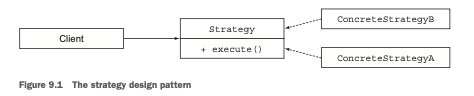
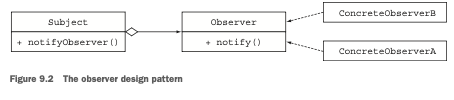
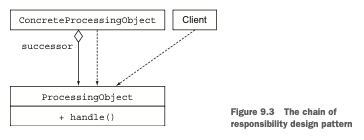
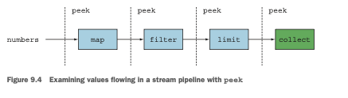

# Capitulo 9

# Refactorización, pruebas y depuración

### Este capítulo cubre
- Refactorización de código para usar expresiones lambda
- Apreciar el impacto de las expresiones lambda en los patrones de diseño orientados a objetos
- Prueba de expresiones lambda
- Depuración de código que usa expresiones lambda y la Streams API

En los primeros ocho capítulos de este libro, viste el poder expresivo de las lambdas y la Streams API.
Mainly estabas creando nuevo código que usaba estas características. Si tenés que empezar un nuevo 
proyecto de Java, podés usar lambdas y streams inmediatamente.
Desafortunadamente, no siempre empezás un proyecto desde cero. La mayor parte del tiempo tenés que 
tratar con una base de código existente escrita en una versión anterior de Java.
Este capítulo presenta varias recetas que te muestran cómo refactorizar código existente para usar 
expresiones lambda para ganar legibilidad y flexibilidad. Además, discutimos cómo varios patrones de
diseño orientados a objetos (incluyendo estrategia, template method, observer, chain of 
responsibility, y factory) pueden volverse más concisos gracias a las expresiones lambda. Finalmente,
exploramos cómo podés probar y depurar código que usa expresiones lambda y la Streams API.

En el capítulo 10, exploramos una forma más amplia de refactorizar código para hacer la lógica de la
aplicación más legible: creando un lenguaje específico de dominio.

## 9.1 Refactorización para mejorar la legibilidad y flexibilidad
Desde el inicio de este libro, hemos argumentado que las expresiones lambda te permiten escribir 
código más conciso y flexible. El código es más conciso porque las expresiones lambda te permiten 
representar un comportamiento en una forma más compacta en comparación con usar clases anónimas. 
También te mostramos en el capítulo 3 que las referencias de métodos te permiten escribir código aún
más conciso cuando todo lo que querés es pasar un método existente como argumento a otro método.
Tu código es más flexible porque las expresiones lambda fomentan el estilo de parametrización de 
comportamiento que introdujimos en el capítulo 2. Tu código puede usar y ejecutar múltiples 
comportamientos pasados como argumentos para enfrentar cambios de requisitos.
En esta sección, recopilamos todo y te mostramos pasos simples para refactorizar código para ganar 
legibilidad y flexibilidad, usando las características que aprendiste en capítulos anteriores: 
lambdas, referencias de métodos, y streams.

### 9.1.1 Mejorando la legibilidad del código
¿Qué significa mejorar la legibilidad del código? Definir buena legibilidad puede ser subjetivo. La 
visión general es que el término significa "qué tan fácilmente este código puede ser entendido por 
otro humano". Mejorar la legibilidad del código asegura que tu código sea entendible y mantenible por
personas otras que vos. Podés tomar algunos pasos para asegurar que tu código sea entendible por 
otras personas, como asegurar que tu código esté bien documentado y siga los estándares de codificación.
Usar características introducidas en Java 8 también puede mejorar la legibilidad del código en 
comparación con versiones anteriores. Podés reducir la verbosidad de tu código, haciéndolo más fácil
de entender. También podés mostrar mejor la intención de tu código usando referencias de métodos y la
Streams API.
En este capítulo, describimos tres refactorizaciones simples que usan lambdas, referencias de métodos, y streams, que podés aplicar a tu código para mejorar su legibilidad:
- Refactorizar clases anónimas a expresiones lambda
- Refactorizar expresiones lambda a referencias de métodos
- Refactorizar procesamiento de datos de estilo imperativo a streams

### 9.1.2 De clases anónimas a expresiones lambda
La primera refactorización simple que deberías considerar es convertir usos de clases anónimas que 
implementan un solo método abstracto a expresiones lambda. ¿Por qué? Esperamos que en capítulos 
anteriores, te hayamos convencido de que las clases anónimas son verbosas y propensas a errores. Al 
adoptar expresiones lambda, producís código que es más sucinto y legible. Como se mostró en el 
capítulo 3, aquí hay una clase anónima para crear un objeto Runnable y su contraparte de expresión 
lambda:
```java
Runnable r1 = new Runnable() {//Antes, usando una clase anónima;
    public void run(){
        System.out.println("Hello");
    }
};
Runnable r2 = () -> System.out.println("Hello");//Después, usando una expresión lambda
```
Pero convertir clases anónimas a expresiones lambda puede ser un proceso difícil en ciertas 
situaciones. Primero, los significados de this y super son diferentes para clases anónimas y 
expresiones lambda. Dentro de una clase anónima, this se refiere a la clase anónima misma, pero 
dentro de una lambda, se refiere a la clase envolvente. Segundo, a las clases anónimas se les permite
sombrear variables de la clase envolvente. Las expresiones lambda no pueden (causarán un error de 
compilación), como se muestra en el siguiente código:
```java
int a = 10;
Runnable r1 = () -> {
int a = 2; //error al compilar
System.out.println(a);
};
Runnable r2 = new Runnable() {
    public void run() {
        int a = 2; //al compilar esta bien
        System.out.println(a);
    }
};
```
Finalmente, convertir una clase anónima a una expresión lambda puede hacer que el código resultante 
sea ambiguo en el contexto de la sobrecarga. De hecho, el tipo de clase anónima es explícito en la 
instanciación, pero el tipo de la lambda depende de su contexto. Aquí hay un ejemplo de cómo esta 
situación puede ser problemática. Supone que declaraste una interfaz funcional con la misma firma 
que Runnable, aquí llamada Task (como podría ocurrir cuando necesitás nombres de interfaz más 
significativos en tu modelo de dominio):
```java
interface Task {
    public void execute();
}
public static void doSomething(Runnable r){ r.run(); }
public static void doSomething(Task a){ r.execute(); }
```
Ahora podés pasar una clase anónima implementando Task sin problemas:
```java
doSomething(new Task() {
    public void execute() {
        System.out.println("Danger danger!!");
    }
});
```
Pero convertir esta clase anónima a una expresión lambda resulta en una llamada de método ambigua, 
porque tanto Runnable como Task son tipos de destino válidos:
```java
//Problema; tanto doSomething(Runnable) como doSomething(Task) coinciden
doSomething(() -> System.out.println("Danger danger!!"));
```
Podés resolver la ambigüedad proporcionando un cast explícito (Task):
```java
doSomething((Task)() -> System.out.println("Danger danger!!"));
```
No te desanimes por estos problemas; ¡hay buenas noticias! La mayoría de los entornos de desarrollo
integrados (IDEs)—como NetBeans, Eclipse, e IntelliJ—soportan esta refactorización y automáticamente
aseguran que estos problemas no surjan.

### 9.1.3 De expresiones lambda a referencias de métodos
Las expresiones lambda son excelentes para código corto que necesita ser pasado alrededor. Pero 
considerá usar referencias de métodos siempre que sea posible para mejorar la legibilidad del código.
Un nombre de método indica la intención de tu código más claramente. En el capítulo 6, por ejemplo, 
te mostramos el siguiente código para agrupar platos por niveles calóricos:
```java
Map<CaloricLevel, List<Dish>> dishesByCaloricLevel = menu.stream()
        .collect(groupingBy(dish -> {
        if (dish.getCalories() <= 400) return CaloricLevel.DIET;
        else if (dish.getCalories() <= 700) return CaloricLevel.NORMAL;
        else return CaloricLevel.FAT;
    }));
```
Podés extraer la expresión lambda a un método separado y pasarla como argumento a groupingBy. El 
código se vuelve más conciso, y su intención es más explícita:
```java
Map<CaloricLevel, List<Dish>> dishesByCaloricLevel = menu.stream()
        .collect(groupingBy(Dish::getCaloricLevel)); //La expresión lambda es extraída a un metodo.
```
Necesitás agregar el método getCaloricLevel dentro de la clase Dish misma para que este código funcione:
```java
public class Dish {
    
    public CaloricLevel getCaloricLevel() {
        if (this.getCalories() <= 400) return CaloricLevel.DIET;
        else if (this.getCalories() <= 700) return CaloricLevel.NORMAL;
        else return CaloricLevel.FAT;
    }
}
```
Además, considerá usar métodos estáticos helper como comparing y maxBy siempre que sea posible. 
¡Estos métodos fueron diseñados para usarse con referencias de método! De hecho, este código indica
mucho más claramente su intención que su contraparte que usa una expresión lambda, como te mostramos
en el capítulo 3:
```java
//Tenés que pensar sobre la implementación de comparación.
inventory.sort((Apple a1, Apple a2) -> a1.getWeight().compareTo(a2.getWeight()));
        inventory.sort(comparing(Apple::getWeight)); //Se lee como el enunciado del problema
```
Además, para muchas operaciones comunes de reducción como suma, máximo, hay métodos helper 
incorporados que pueden combinarse con referencias de métodos. Te mostramos, por ejemplo, que usando
la API de Collectors, podés encontrar el máximo o la suma de una manera más clara que usando una 
combinación de una expresión lambda y una operación de reduce de bajo nivel. En lugar de escribir
```java
int totalCalories = menu.stream()
        .map(Dish::getCalories)
        .reduce(0, (c1, c2) -> c1 + c2);
```
intentá usar colectores incorporados alternativos, que declaren el enunciado del problema más 
claramente. Aquí, usamos el colector summingInt (los nombres ayudan mucho a documentar tu código):
```java
int totalCalories = menu.stream().collect(summingInt(Dish::getCalories));
```
### 9.1.4 Del procesamiento de datos imperativo a Streams
Idealmente, deberías intentar convertir todo el código que procesa una colección con patrones 
típicos de procesamiento de datos con un iterador para usar la Streams API en su lugar. ¿Por qué? La
Streams API expresa más claramente la intención de un pipeline de procesamiento de datos. Además, 
los streams pueden ser optimizados en segundo plano, aprovechando el cortocircuito y la pereza, así 
como aprovechar tu arquitectura multinúcleo, como explicamos en el capítulo 7.
El siguiente código imperativo expresa dos patrones (filtrado y extracción) que están mezclados 
juntos, forzando al programador a descubrir cuidadosamente toda la implementación antes de descubrir
qué hace el código. Además, una implementación que se ejecuta en paralelo sería mucho más difícil de
escribir. Ver el capítulo 7 (particularmente la sección 7.2) para tener una idea del trabajo 
involucrado:
```java
List<String> dishNames = new ArrayList<>();
for(Dish dish: menu) {
    if(dish.getCalories() > 300){
        dishNames.add(dish.getName());
    }
}
```
La alternativa, que usa la Streams API, se lee más como el enunciado del problema, y puede ser 
fácilmente paralelizada:
```java
menu.parallelStream()
    .filter(d -> d.getCalories() > 300)
    .map(Dish::getName)
    .collect(toList());
```
Desafortunadamente, convertir código imperativo a la Streams API puede ser una tarea difícil, porque
necesitás pensar en declaraciones de control de flujo como break, continue, y return y luego inferir
las operaciones de stream correctas a usar. Las buenas noticias son que algunas herramientas pueden
ayudarte con esta tarea también.

### 9.1.5 Mejorando la flexibilidad del código
Argumentamos en los capítulos 2 y 3 que las expresiones lambda fomentan el estilo de parametrización
de comportamiento. Podés representar múltiples comportamientos con diferentes lambdas que luego podés
pasar alrededor para ejecutar. Este estilo te permite enfrentar cambios de requisitos (creando 
múltiples formas de filtrar con un Predicate o comparar con un Comparator, por ejemplo). En la 
siguiente sección, miramos un par de patrones que podés aplicar a tu base de código para beneficiarte
inmediatamente de las expresiones lambda.

### Adoptando Interfaces Funcionales
Primero, no podés usar expresiones lambda sin interfaces funcionales; por lo tanto, deberías comenzar
a introducirlas en tu base de código. ¿Pero en qué situaciones deberías introducirlas? En este 
capítulo, discutimos dos patrones de código comunes que pueden refactorizarse para aprovechar las 
expresiones lambda: ejecución diferida condicional y execute around. También, en la siguiente sección,
te mostramos cómo varios patrones de diseño orientada a objetos—como los patrones de diseño strategy
y template-method—pueden reescribirse de manera más concisa con expresiones lambda.

### Ejecucion Diferida Condicional
Es común ver declaraciones de control de flujo mezcladas dentro del código de lógica de negocio. 
Escenarios típicos incluyen verificaciones de seguridad y logging. Considerá el siguiente código, 
que usa la clase Logger incorporada de Java:
```java
if (logger.isLoggable(Log.FINER)) {
    logger.finer("Problem: " + generateDiagnostic());
}
```
¿Qué está mal? Un par de cosas:
- El estado del logger (qué nivel soporta) está expuesto en el código del cliente a través del método
isLoggable.
- ¿Por qué tendrías que consultar el estado del objeto logger cada vez antes de registrar un mensaje?
Desordena tu código. Una mejor alternativa es usar el método log, que verifica internamente si el 
objeto logger está configurado en el nivel correcto antes de registrar el mensaje:
```java
logger.log(Level.FINER, "Problem: " + generateDiagnostic());
```
Este enfoque es mejor porque tu código no está desordenado con verificaciones if, y el estado del 
logger ya no está expuesto. Desafortunadamente, este código todavía tiene un problema: el mensaje de
logging siempre se evalúa, incluso si el logger no está habilitado para el nivel de mensaje pasado 
como argumento.
Las expresiones lambda pueden ayudar. Lo que necesitás es una forma de diferir la construcción del 
mensaje para que pueda generarse solo bajo una condición dada (aquí, cuando el nivel del logger está
configurado en FINER). Resulta que los diseñadores de la API de Java 8 conocían este problema e 
introdujeron una alternativa sobrecargada a log que toma un Supplier como argumento. Este método log
alternativo tiene la siguiente firma:
```java
public void log(Level level, Supplier<String> msgSupplier)
```
Ahora podés llamarlo de la siguiente manera:
```java
logger.log(Level.FINER, () -> "Problem: " + generateDiagnostic());
```
El método log internamente ejecuta la lambda pasada como argumento solo si el logger está en el nivel
correcto. La implementación interna del método log es más o menos así:
```java
public void log(Level level, Supplier<String> msgSupplier) {
    if (logger.isLoggable(level)) {
        log(level, msgSupplier.get());//Ejecutando la lambda
    }
}
```
¿Qué podés aprender de esta historia? Si te ves consultando el estado de un objeto (como el estado 
del logger) muchas veces en código de cliente, solo para llamar a algún método en este objeto con 
argumentos (como para registrar un mensaje), considerá introducir un nuevo método que llame a ese 
método, pasado como una lambda o referencia de método, solo después de verificar internamente el 
estado del objeto. Tu código será más legible (menos desordenado) y mejor encapsulado, sin exponer 
el estado del objeto en código de cliente.

### Execute Around
En el capítulo 3, discutimos otro patrón que podés adoptar: execute around. Si te encontrás rodeando
diferentes código con las mismas fases de preparación y limpieza, a menudo podés extraer ese código 
a una lambda. El beneficio es que podés reutilizar la lógica que trata con las fases de preparación 
y limpieza, reduciendo así la duplicación de código.
Aquí está el código que viste en el capítulo 3. Reutiliza la misma lógica para abrir y cerrar un 
archivo pero puede ser parametrizado con diferentes lambdas para procesar el archivo:
```java
String oneLine = 
        processFile((BufferedReader b) -> b.readLine());//Pasando la lamnda
String twoLines = 
        processFile((BufferedReader b) -> b.readLine() + b.readLine());//Pasar una lambda diferente.
public static String processFile(BufferedReaderProcessor p) throws
IOException {
    try (BufferedReader br = new BufferedReader(new
            FileReader("ModernJavaInAction/chap9/data.txt"))) {
        return p.process(br);//Execute the Buffered-ReaderProcessor passed as an argument.
    }
}
public interface BufferedReaderProcessor { //Una interfaz funcional para una lambda, que puede lanzar una IOException
    String process(BufferedReader b) throws IOException;
}
```
Este código fue posible al introducir la interfaz funcional BufferedReaderProcessor, que te permite 
pasar diferentes lambdas para trabajar con un objeto BufferedReader.
En esta sección, viste cómo aplicar varias recetas para mejorar la legibilidad y flexibilidad de tu 
código. En la siguiente sección, ves cómo las expresiones lambda pueden eliminar código repetitivo 
asociado con comunes patrones de diseño orientados a objetos.

## 9.2 Refactorización de patrones de diseño orientados a objetos con lambdas
Las nuevas características del lenguaje a menudo hacen que los patrones o idioms de código existentes
sean menos populares. La introducción del bucle for-each en Java 5, por ejemplo, ha reemplazado muchos
usos de iteradores explícitos porque es menos propenso a errores y más concisa. La introducción del 
operador diamante <> en Java 7 redujo el uso de generics explícitos en la creación de instancias 
(y lentamente impulsó a los programadores de Java a aprovechar la inferencia de tipos).
Una clase específica de patrones se llama patrones de diseño. Los patrones de diseño son planos 
reutilizables, por así decirlo, para problemas comunes en el diseño de software. Son bastante como 
cómo los ingenieros de construcción tienen un conjunto de soluciones reutilizables para construir 
puentes para escenarios específicos (puente colgante, puente de arco, etc.). El patrón visitor, por 
ejemplo, es una solución común para separar un algoritmo de una estructura sobre la que necesita 
operar. El patrón singleton es una solución común para restringir la instanciación de una clase a un
objeto.
Las expresiones lambda proporcionan otra nueva herramienta en el toolbox del programador. Pueden 
proporcionar soluciones alternativas a los problemas que los patrones de diseño abordan, pero a 
menudo con menos trabajo y de manera más simple. Muchos patrones de diseño orientados a objetos 
existentes pueden volverse redundantes o escribirse de manera más concisa con expresiones lambda.

En esta sección, exploramos cinco patrones de diseño:
- Strategy
- Template method
- Observer
- Chain of responsibility
- Factory

Te mostramos cómo las expresiones lambda pueden proporcionar una forma alternativa de resolver el 
problema que cada patrón de diseño está destinado a resolver.

### 9.2.1 Strategy
El patrón strategy es una solución común para representar una familia de algoritmos y permitirte 
elegir entre ellos en tiempo de ejecución. Viste este patrón brevemente en el capítulo 2 cuando te 
mostramos cómo filtrar un inventario con diferentes predicates (como manzanas pesadas o manzanas 
verdes). Podés aplicar este patrón a una multitude de escenarios, como validar un input con diferentes
criterios, usar diferentes formas de parseo, o formatear un input.
El patrón strategy consiste en tres partes, como se ilustra en la figura 9.1:



Supone que te gustaría validar si un texto de entrada está correctamente formateado para diferentes 
criterios (consiste solo de letras minúsculas o es numérico, por ejemplo). Comenzás definiendo una
interfaz para validar el texto (representado como un String):
```java
public interface ValidationStrategy {
    boolean execute(String s);
}
```
Segundo, definís una o más implementaciones de esa interfaz:
```java
public class IsAllLowerCase implements ValidationStrategy {
    public boolean execute(String s){
        return s.matches("[a-z]+");
    }
}
public class IsNumeric implements ValidationStrategy {
    public boolean execute(String s){
        return s.matches("\\d+");
    }
}
```
Entonces podés usar estas diferentes estrategias de validación en tu programa:
```java
public class Validator {
    private final ValidationStrategy strategy;

    public Validator(ValidationStrategy v) {
        this.strategy = v;
    }

    public boolean validate(String s) {
        return strategy.execute(s);
    }
}
Validator numericValidator = new Validator(new IsNumeric());
boolean b1 = numericValidator.validate("aaaa"); //Retorna false
Validator lowerCaseValidator = new Validator(new IsAllLowerCase ());
boolean b2 = lowerCaseValidator.validate("bbbb"); //Retorna true
```
### Usando Expresion Lamnda
Para ahora, deberías reconocer que ValidationStrategy es una interfaz funcional. Además, tiene el 
mismo descriptor de función que Predicate<String>. Como resultado, en lugar de declarar nuevas clases
para implementar diferentes estrategias, podés pasar expresiones lambda más concisas directamente:
```java
Validator numericValidator =
new Validator((String s) -> s.matches("[a-z]+"));//Pasando una lambda directamente
boolean b1 = numericValidator.validate("aaaa");
Validator lowerCaseValidator =
new Validator((String s) -> s.matches("\\d+"));//Pasando una lambda directamente
boolean b2 = lowerCaseValidator.validate("bbbb");
```
Como podés ver, las expresiones lambda eliminan el código repetitivo que es inherente al patrón de 
diseño strategy. Si lo pensás, las expresiones lambda encapsulan un piece of code (o estrategia), que
es para lo que se creó el patrón de diseño strategy, así que recomendamos que uses expresiones lambda
en su lugar para problemas similares.

### 9.2.2 Template method
El patrón de diseño template method es una solución común cuando necesitás representar el esquema de
un algoritmo y tener la flexibilidad adicional de cambiar ciertas partes de él. Okay, este patrón 
suena un poco abstracto. En otras palabras, el patrón template method es útil cuando te encontrás 
diciendo "me encantaría usar este algoritmo, pero necesito cambiar algunas líneas para que haga lo 
que quiero".
Aquí hay un ejemplo de cómo funciona este patrón. Supone que necesitás escribir una simple aplicación
de banca en línea. Los usuarios típicamente ingresan un ID de cliente; la aplicación obtiene los 
detalles del cliente de la base de datos del banco y hace algo para hacer feliz al cliente. Diferentes
aplicaciones de banca en línea para diferentes sucursales bancarias pueden tener diferentes formas de
hacer feliz a un cliente (como agregar un bonus a su cuenta o enviarle menos papel). Podés escribir 
la siguiente clase abstracta para representar la aplicación de banca en línea:
```java
abstract class OnlineBanking {
    public void processCustomer(int id) {
        Customer c = Database.getCustomerWithId(id);
        makeCustomerHappy(c);
    }

    abstract void makeCustomerHappy(Customer c);
}
```
El método processCustomer proporciona un esquema para el algoritmo de banca en línea: obtener el 
cliente dado su ID y hacer feliz al cliente. Ahora diferentes sucursales pueden proporcionar 
diferentes implementaciones del método makeCustomerHappy subclaseando la clase OnlineBanking.

### Usando Expresiones Lamnda
Podés abordar el mismo problema (crear un esquema de un algoritmo y dejar que los implementadores 
conecten algunas partes) usando tus lambdas favoritas. Los componentes de los algoritmos que querés 
conectar pueden ser representados por expresiones lambda o referencias de métodos.
Aquí, introducimos un segundo argumento al método processCustomer de tipo Consumer<Customer> porque 
coincide con la firma del método makeCustomerHappy definido anteriormente:
```java
public void processCustomer(int id, Consumer<Customer> makeCustomerHappy) {
    Customer c = Database.getCustomerWithId(id);
    makeCustomerHappy.accept(c);
}
```
Ahora podés conectar diferentes comportamientos directamente sin subclasear la clase OnlineBanking 
pasando expresiones lambda:
```java
new OnlineBankingLambda().processCustomer(1337, (Customer c) -> 
        System.out.println("Hello " + c.getName());
```
Este ejemplo muestra cómo las expresiones lambda pueden ayudarte a eliminar el código repetitivo 
inherente a los patrones de diseño.

### 9.2.3 Observer
El patrón de diseño observer es una solución común cuando un objeto (llamado sujeto) necesita 
notificar automáticamente a una lista de otros objetos (llamados observers) cuando ocurre algún 
evento (como un cambio de estado). Típicamente te encontrás con este patrón cuando trabajás con 
aplicaciones GUI. Registrás un conjunto de observers en un componente GUI como un botón. Si se hace 
clic en el botón, los observers son notificados y pueden ejecutar una acción específica. Pero el 
patrón observer no se limita a GUIs. El patrón de diseño observer también es adecuado en una 
situación en la que varios traders (observers) quieren reaccionar al cambio de precio de una acción
(sujeto). La figura 9.2 ilustra el diagrama UML del patrón observer.



Ahora escribí algo de código para ver qué tan útil es el patrón observer en la práctica. Diseñarás e
implementarás un sistema de notificaciones personalizado para una aplicación como Twitter. El concepto
es simple: varias agencias de periódicos (The New York Times, The Guardian y Le Monde) están 
suscritas a un feed de tweets de noticias y pueden querer recibir una notificación si un tweet 
contiene una palabra clave particular.
Primero, necesitás una interfaz Observer que agrupe los observers. Tiene un método, llamado notify, 
que será llamado por el sujeto (Feed) cuando un nuevo tweet esté disponible:
```java
interface Observer {
    void notify(String tweet);
}
```
Ahora podés declarar diferentes observers (aquí, los tres periódicos) que producen una acción 
diferente para cada diferente palabra clave contenida en un tweet:
```java
class NYTimes implements Observer {
    public void notify(String tweet) {
        if (tweet != null && tweet.contains("money")) {
            System.out.println("Breaking news in NY! " + tweet);
        }
    }
}
class Guardian implements Observer {
    public void notify(String tweet) {
        if (tweet != null && tweet.contains("queen")) {
            System.out.println("Yet more news from London... " + tweet);
        }
    }
}
class LeMonde implements Observer {
    public void notify(String tweet) {
        if (tweet != null && tweet.contains("wine")) {
            System.out.println("Today cheese, wine and news! " + tweet);
        }
    }
}
```
Todavía te falta la parte crucial: el sujeto. Definí una interfaz para el sujeto:
```java
interface Subject {
    void registerObserver(Observer o);
    void notifyObservers(String tweet);
}
```
El sujeto puede registrar un nuevo observer usando el método registerObserver y notificar a sus 
observers de un tweet con el método notifyObservers. Ahora implementá la clase Feed:
```java
class Feed implements Subject {
    private final List<Observer> observers = new ArrayList<>();

    public void registerObserver(Observer o) {
        this.observers.add(o);
    }

    public void notifyObservers(String tweet) {
        observers.forEach(o -> o.notify(tweet));
    }
}
```
Esta implementación es directa: el feed mantiene una lista interna de observers que puede notificar 
cuando llega un tweet. Podés crear una aplicación de demostración para conectar el sujeto y los 
observers:
```java
Feed f = new Feed();
f.registerObserver(new NYTimes());
f.registerObserver(new Guardian());
f.registerObserver(new LeMonde());
f.notifyObservers("The queen said her favourite book is Modern Java in Action!");
```
Sin sorpresa, The Guardian capta este tweet.

### Usando Expresiones Lamnda
Te podrías preguntar cómo usar expresiones lambda con el patrón de diseño observer. Notá que las 
varias clases que implementan la interfaz Observer todas proporcionan implementación para un solo 
método: notify. Est envolviendo un piece of behavior para ejecutar cuando llega un tweet. Las 
expresiones lambda están diseñadas específicamente para eliminar ese código repetitivo. En lugar de 
instanciar tres objetos observer explícitamente, podés pasar una expresión lambda directamente para 
representar el comportamiento a ejecutar:
```java
f.registerObserver((String tweet) -> {
    if(tweet != null && tweet.contains("money")){
        System.out.println("Breaking news in NY! " + tweet);
    }
});
f.registerObserver((String tweet) -> {
    if(tweet != null && tweet.contains("queen")){
        System.out.println("Yet more news from London... " + tweet);
    }
});
```
¿Deberías usar expresiones lambda todo el tiempo? La respuesta es no. En el ejemplo que describimos,
las expresiones lambda funcionan muy bien porque el comportamiento a ejecutar es simple, por lo que 
son útiles para eliminar código repetitivo. Pero los observers pueden ser más complejos; podrían 
tener estado, definir varios métodos, y similares. En esas situaciones, deberías stickear con clases.

### 9.2.4 Chain of responsibility
El patrón chain of responsibility es una solución común para crear una cadena de objetos de 
procesamiento (como una cadena de operaciones). Un objeto de procesamiento puede hacer algo de 
trabajo y pasar el resultado a otro objeto, que también hace algo de trabajo y lo pasa a otro objeto
de procesamiento, y así sucesivamente.
Generalmente, este patrón se implementa definiendo una clase abstracta que representa un objeto de 
procesamiento que define un campo para mantener un successor. Cuando termina su trabajo, el objeto 
de procesamiento entrega su trabajo a su successor. El código se ve así:
```java
public abstract class ProcessingObject<T> {
    protected ProcessingObject<T> successor;

    public void setSuccessor(ProcessingObject<T> successor) {
        this.successor = successor;
    }

    public T handle(T input) {
        T r = handleWork(input);
        if (successor != null) {
            return successor.handle(r);
        }
        return r;
    }

    abstract protected T handleWork(T input);
}
```
La figura 9.3 ilustra el patrón chain of responsibility en UML.



Aquí, podés reconocer el patrón de diseño template method, que discutimos en la sección 9.2.2. El 
método handle proporciona un esquema para tratar un piece of work. Podés crear diferentes tipos de 
objetos de procesamiento subclaseando la clase ProcessingObject y proporcionando una implementación 
para el método handleWork. Aquí hay un ejemplo de cómo usar este patrón. Podés crear dos objetos de 
procesamiento haciendo algo de procesamiento de texto:
```java
public class HeaderTextProcessing extends ProcessingObject<String> {
    public String handleWork(String text) {
        return "From Raoul, Mario and Alan: " + text;
    }
}
public class SpellCheckerProcessing extends ProcessingObject<String> {
    public String handleWork(String text) {
        return text.replaceAll("labda", "lambda");//Oops—we forgot the ‘m’ in “lambda”!
    }
}
```
Ahora podés conectar dos objetos de procesamiento para construir una cadena de operaciones:
```java
ProcessingObject<String> p1 = new HeaderTextProcessing();
ProcessingObject<String> p2 = new SpellCheckerProcessing();
p1.setSuccessor(p2);//Encadenando dos objetos de procesamiento
String result = p1.handle("Aren't labdas really sexy?!!");
System.out.println(result);//Imprime "From Raoul, Mario and Alan: ¡No son realmente sexy las lambdas?!!"
```
### Usando Expresiones Lamnda
Un minuto—este patrón parece encadenar (es decir, componer) funciones. Discutimos la composición de 
expresiones lambda en el capítulo 3. Podés representar los objetos de procesamiento como una 
instancia de Function<String, String>, o (más precisamente) un UnaryOperator<String>. Para 
encadenarlos, componé estas funciones usando el método andThen:
```java
UnaryOperator<String> headerProcessing = 
        (String text) -> "From Raoul, Mario and Alan: " + text; //El primer objeto de procesamiento
UnaryOperator<String> spellCheckerProcessing = 
        (String text) -> text.replaceAll("labda", "lambda"); //El segundo objeto de procesamiento
Function<String, String> pipeline = 
        headerProcessing.andThen(spellCheckerProcessing); //Componer las dos funciones,resultando en una cadena de operaciones.
String result = pipeline.apply("Aren't labdas really sexy?!!");
```
### 9.2.5 Factory
El patrón de diseño factory te permite crear objetos sin exponer la lógica de instanciación al 
cliente. Supone que trabajás para un banco que necesita una forma de crear diferentes productos 
financieros: préstamos, bonos, acciones, etc.
Típicamente, crearías una clase Factory con un método responsable de la creación de diferentes 
objetos, como se muestra aquí:
```java
public class ProductFactory {
    public static Product createProduct(String name) {
        switch (name) {
            case "loan":
                return new Loan();
            case "stock":
                return new Stock();
            case "bond":
                return new Bond();
            default:
                throw new RuntimeException("No such product " + name);
        }
    }
}
```
Aquí, Loan, Stock y Bond son subtipos de Product. El método createProduct podría tener lógica 
adicional para configurar cada producto creado. Pero el beneficio es que podés crear estos objetos 
sin exponer el constructor y la configuración al cliente, lo que hace que la creación de productos 
sea más simple para el cliente, de la siguiente manera:
```java
Product p = ProductFactory.createProduct("loan");
```
### Usando Expresiones Lamnda
Viste en el capítulo 3 que podés referirte a los constructores de la misma manera que te referís a 
los métodos: usando referencias de métodos. Aquí te mostramo cómo referirte al constructor de Loan:
```java
Supplier<Product> loanSupplier = Loan::new;
Loan loan = loanSupplier.get();
```
Usando esta técnica, podías reescribir el código anterior creando un Map que mapea un nombre de 
producto a su constructor:
```java
final static Map<String, Supplier<Product>> map = new HashMap<>();
static {
    map.put("loan", Loan::new);
    map.put("stock", Stock::new);
    map.put("bond", Bond::new);
}
```
Podés usar este Map para instanciar diferentes productos, como hiciste con el patrón de diseño
factory:
```java
public static Product createProduct(String name) {
    Supplier<Product> p = map.get(name);
    if (p != null) return p.get();
    throw new IllegalArgumentException("No such product " + name);
}
```
Esta técnica es una forma elegante de usar esta característica de Java 8 para lograr la misma 
intención que el patrón factory. Pero esta técnica no escala bien si el método factory createProduct
necesita tomar múltiples argumentos para pasar a los constructores de productos. Tendrías que 
proporcionar una interfaz funcional otra que un simple Supplier.
Supone que querés referirte a constructores de productos que toman tres argumentos (dos Integers y
un String); necesitás crear una interfaz funcional especial TriFunction para soportar tales 
constructores. Como resultado, la firma del Map se vuelve más compleja:
```java
public interface TriFunction<T, U, V, R> {
    R apply(T t, U u, V v);
}
Map<String, TriFunction<Integer, Integer, String, Product>> map = new HashMap<>();
```
Viste cómo escribir y refactorizar código usando expresiones lambda. En la siguiente sección, ves 
cómo asegurar que tu nuevo código sea correcto.

## 9.3 Probando lambdas
Esparciste expresiones lambda en tu código, y se ve bonito y conciso. Pero en la mayoría de los 
trabajos de desarrollo, no te pagan por escribir código bonito, sino por escribir código que es 
correcto.
Generalmente, la buena práctica de ingeniería de software implica usar pruebas unitarias para 
asegurar que tu programa se comporte como se espera. Escribís casos de prueba, que assert que partes
pequeñas e individuales de tu código fuente están produciendo los resultados esperados. Considerá 
una simple clase Point para una aplicación gráfica:
```java
public class Point {
    private final int x;
    private final int y;
    
    private Point(int x, int y) {
        this.x = x;
        this.y = y;
    }
    public int getX() {
        return x;
    }
    public int getY() {
        return y;
    }
    public Point moveRightBy(int x) {
        return new Point(this.x + x, this.y);
    }
}
```
La siguiente prueba unitaria verifica si el método moveRightBy se comporta como se espera:
```java
@Test
public void testMoveRightBy() throws Exception {
    Point p1 = new Point(5, 5);
    Point p2 = p1.moveRightBy(10);
    assertEquals(15, p2.getX());
    assertEquals(5, p2.getY());
}
```
### 9.3.1 Probando el comportamiento de una lambda visible
Este código funciona bien porque el método moveRightBy es público y, por lo tanto, puede ser probado 
dentro del caso de prueba. Pero las lambdas no tienen nombres (son funciones anónimas, después de 
todo), y probarlas en tu código es tricky porque no podés referirte a ellas por nombre.
A veces, tenés acceso a una lambda a través de un campo para poder reutilizarla, y te gustaría probar
la lógica encapsulada en esa lambda. ¿Qué podés hacer? Podrías probar la lambda como hacés cuando 
llamás a métodos. Supone que agregás un campo estático compareByXAndThenY en la clase Point que te 
da acceso a un objeto Comparator generado a partir de referencias de métodos:
```java
public class Point {
    public final static Comparator<Point> compareByXAndThenY =
            comparing(Point::getX).thenComparing(Point::getY);
}
```
Recordá que las expresiones lambda generan una instancia de una interfaz funcional. Como resultado,
podés probar el comportamiento de esa instancia. Aquí, podés llamar al método compare en el objeto
Comparator compareByXAndThenY con diferentes argumentos para probar si su comportamiento es el 
previsto:
```java
@Test
public void testComparingTwoPoints() throws Exception {
    Point p1 = new Point(10, 15);
    Point p2 = new Point(10, 20);
    int result = Point.compareByXAndThenY.compare(p1, p2);
    assertTrue(result < 0);
}
```
### 9.3.2 Enfocándose en el comportamiento del método usando una lambda
Pero el propósito de las lambdas es encapsular un piece of behavior único para ser usado por otro 
método. En ese caso, no deberías hacer que las expresiones lambda estén disponibles públicamente; 
son solo detalles de implementación. En cambio, argumentamos que deberías probar el comportamiento 
del método que usa una expresión lambda. Considerá el método moveAllPointsRightBy mostrado aquí:
```java
public static List<Point> moveAllPointsRightBy(List<Point> points, int x) {
    return points.stream()
            .map(p -> new Point(p.getX() + x, p.getY()))
            .collect(toList());
}
```
No tiene sentido (juego de palabras intencional) probar la lambda p -> new Point(p.getX() + x, 
p.getY()); es solo un detalle de implementación del método moveAllPointsRightBy. En su lugar, 
deberías enfocarte en probar el comportamiento del método moveAllPointsRightBy:
```java
@Test
public void testMoveAllPointsRightBy() throws Exception {
    List<Point> points =
            Arrays.asList(new Point(5, 5), new Point(10, 5));
    List<Point> expectedPoints =
            Arrays.asList(new Point(15, 5), new Point(20, 5));
    List<Point> newPoints = Point.moveAllPointsRightBy(points, 10);
    assertEquals(expectedPoints, newPoints);
}
```
`Nota` que en la prueba unitaria, es importante que la clase Point implemente el método equals 
apropiadamente; de lo contrario, depende de la implementación predeterminada de Object.

### 9.3.3 Extrayendo lambdas complejas a métodos separados
Tal vez te encontrás con una expresión lambda realmente compleja que contiene mucha lógica (como un 
algoritmo de precios técnicos con casos extremos). ¿Qué hacés, porque no podés referirte a la 
expresión lambda dentro de tu prueba? Una estrategia es convertir la expresión lambda a una 
referencia de método (que implica declarar un nuevo método regular), como explicamos en la sección 
9.1.3. Entonces podés probar el comportamiento del nuevo método como lo harías con cualquier método 
regular.

### 9.3.4 Probando funciones de orden superior
Los métodos que toman una función como argumento o devuelven otra función (las llamadas funciones de
orden superior, explicadas en el capítulo 19) son un poco más difíciles de manejar. Una cosa que 
podés hacer si un método toma una lambda como argumento es probar su comportamiento con diferentes 
lambdas. Podés probar el método filter que creaste en el capítulo 2 con diferentes predicates:
```java
@Test
public void testFilter() throws Exception {
    List<Integer> numbers = Arrays.asList(1, 2, 3, 4);
    List<Integer> even = filter(numbers, i -> i % 2 == 0);
    List<Integer> smallerThanThree = filter(numbers, i -> i < 3);
    assertEquals(Arrays.asList(2, 4), even);
    assertEquals(Arrays.asList(1, 2), smallerThanThree);
}
```
¿Qué pasa si el método que necesita ser probado devuelve otra función? Podés probar el comportamiento
de esa función tratándola como una instancia de una interfaz funcional, como te mostramos antes con 
un Comparator.
Desafablemente, no todo funciona la primera vez, y tus pruebas pueden reportar algunos errores 
relacionados con tu uso de expresiones lambda. Entonces, en la siguiente sección pasamos a la 
depuración.

## 9.4 Depuración
El arsenal de un desarrollador tiene dos armas principales tradicionales para depurar código 
problemático:
- Examinar el stack trace
- Logging
Las expresiones lambda y los streams pueden traer nuevos desafíos a tu rutina de depuración típica. 
Exploramos ambos en esta sección.

### 9.4.1 Examinando el stack trace
Cuando tu programa se ha detenido (porque se lanzó una excepción, por ejemplo), lo primero que 
necesitás saber es dónde se detuvo el programa y cómo llegó allí. Los stack frames son útiles para 
este propósito. Cada vez que tu programa realiza una llamada a un método, se genera información sobre
la llamada, incluyendo la ubicación de la llamada en tu programa, los argumentos de la llamada, y las
variables locales del método que se está llamando. Esta información se almacena en un stack frame.

Cuando tu programa falla, obtenés un stack trace, que es un resumen de cómo tu programa llegó a ese 
fallo, frame de stack por frame de stack. En otras palabras, obtés una valiosa lista de llamadas de 
método hasta que apareció el fallo. Esta lista te ayuda a entender cómo ocurrió el problema.

### Usando Expresiones Lamnda
Desafortunadamente, debido al hecho de que las expresiones lambda no tienen nombres, los stack traces
pueden ser un poco desconcertantes. Considerá el siguiente simple código, que está hecho para fallar
a propósito:
```java
import java.util.*;
public class Debugging {
    public static void main(String[] args) {
        List<Point> points = Arrays.asList(new Point(12, 2), null);
        points.stream().map(p -> p.getX()).forEach(System.out::println);
    }
}
```
Ejecutar este código produce un stack trace más o menos como el siguiente (dependiendo de tu versión
de javac; podés no tener el mismo stack trace):
```terminaloutput
Exception in thread "main" java.lang.NullPointerException
at Debugging.lambda$main$0(Debugging.java:6) //¿Qué significa $0 en esta línea?
at Debugging$$Lambda$5/284720968.apply(Unknown Source)
at java.util.stream.ReferencePipeline$3$1.accept(ReferencePipeline
.java:193)
at java.util.Spliterators$ArraySpliterator.forEachRemaining(Spliterators
.java:948)
```
¡Yuck! ¿Qué está pasando? El programa falla, por supuesto, porque el segundo elemento de la lista de
puntos es null. Intentás procesar una referencia nula. Como el error ocurre en un pipeline de stream,
toda la secuencia de llamadas de método que hacen funcionar un pipeline de stream te queda expuesta.
Pero notá que el stack trace produce las siguientes líneas crípticas:
```terminaloutput
at Debugging.lambda$main$0(Debugging.java:6)
    at Debugging$$Lambda$5/284720968.apply(Unknown Source)
```
Estas líneas significan que el error ocurrió dentro de una expresión lambda. Desafortunadamente, 
como las expresiones lambda no tienen nombres, el compilador tiene que inventar un nombre para 
referirse a ellas. En este caso, el nombre es lambda$main$0, que no es intuitivo y puede ser 
problemático si tenés clases grandes que contienen varias expresiones lambda. Incluso si usás 
referencias de método, es posible que el stack no te muestre el nombre del método que usaste. Cambiar
la lambda anterior p -> p.getX() a la referencia de método Point::getX también resulta en un stack 
trace problemático:
```terminaloutput
points.stream().map(Point::getX).forEach(System.out::println);
Exception in thread "main" java.lang.NullPointerException
at Debugging$$Lambda$5/284720968.apply(Unknown Source)
at java.util.stream.ReferencePipeline$3$1.accept(ReferencePipeline
.java:193)
```
Notá que si una referencia de método se refiere a un método declarado en la misma clase donde se usa,
aparece en el stack trace. En el siguiente ejemplo:
```java
import java.util.*;
public class Debugging {
    public static void main(String[] args) {
        List<Integer> numbers = Arrays.asList(1, 2, 3);
        numbers.stream().map(Debugging::divideByZero).forEach(System
                .out::println);
    }

    public static int divideByZero(int n) {
        return n / 0;
    }
}
```
El método divideByZero se reporta correctamente en el stack trace:
```terminaloutput
Exception in thread "main" java.lang.ArithmeticException: / by zero
at Debugging.divideByZero(Debugging.java:10)
at Debugging$$Lambda$1/999966131.apply(Unknown Source)
at java.util.stream.ReferencePipeline$3$1.accept(ReferencePipeline
.java:193)
```
En general, tené en mente que los stack traces que involucran expresiones lambda pueden ser más 
difíciles de entender. Esta es un área en la que el compilador puede ser mejorado en una versión 
futura de Java.

### 9.4.2 Informacion del login
Supone que estás intentando depurar un pipeline de operaciones en un stream. ¿Qué podés hacer? 
Podrías usar forEach para imprimir o registrar el resultado de un stream de la siguiente manera:
```java
List<Integer> numbers = Arrays.asList(2, 3, 4, 5);
numbers.stream()
    .map(x -> x + 17)
    .filter(x -> x % 2 == 0)
    .limit(3)
    .forEach(System.out::println);
```
Este código produce la siguiente salida:
20
22
Desafortunadamente, después de llamar a forEach, todo el stream se consume. Sería útil entender qué 
produce cada operación (map, filter, limit) en el pipeline de un stream.
La operación de stream peek puede ayudar. El propósito de peek es ejecutar una acción sobre cada 
elemento de un stream a medida que se consume. Sin embargo, no consume todo el stream como lo hace 
forEach; reenvía el elemento sobre el que realizó una acción a la siguiente operación en el pipeline.
La figura 9.4 ilustra la operación peek.



En el siguiente código, usás peek para imprimir los valores intermedios antes y después de cada
operación en el pipeline del stream:
```java
List<Integer> result = 
        numbers.stream()
                //Imprime el elemento actual consumido de la fuente.
                .peek(x -> System.out.println("from stream: " + x))
                .map(x -> x + 17)
                //Imprime el resultado de la operación map.
                .peek(x -> System.out.println("after map: " + x))
                .filter(x -> x % 2 == 0)
                //Imprime el número seleccionado después de la operación filter.
                .peek(x -> System.out.println("after filter: " + x))
                .limit(3)
                //Imprime el número seleccionado después de la operación limit.
                .peek(x -> System.out.println("after limit: " + x))
                .collect(toList());
```
Este código produce salida útil en cada paso del pipeline:
```terminaloutput
from stream: 2
after map: 19
from stream: 3
after map: 20
after filter: 20
after limit: 20
from stream: 4
after map: 21
from stream: 5
after map: 22
after filter: 22
after limit: 22
```
### Resumen
- Las expresiones lambda pueden hacer tu código más legible y flexible.
- Considerá convertir clases anónimas a expresiones lambda, pero cuidadoso con diferencias semánticas
sutiles como el significado de la palabra clave this y el sombreado de variables.
- Las referencias de método pueden hacer tu código más legible en comparación con las expresiones lambda.
- Considerá convertir el procesamiento iterativo de colecciones para usar la Streams API.
- Las expresiones lambda pueden eliminar código repetitivo asociado con varios patrones de diseño 
orientados a objetos, como strategy, template method, observer, chain of responsibility, y factory.
- Las expresiones lambda pueden ser probadas unitariamente, pero en general, deberías enfocarte en 
probar el comportamiento de los métodos en los que aparecen las expresiones lambda.
- Considerá extraer expresiones lambda complejas a métodos regulares.
- Las expresiones lambda pueden hacer que los stack traces sean menos legibles.
- El método peek de un stream es útil para registrar valores intermedios a medida que fluyen más allá
de ciertos puntos de un pipeline de stream.